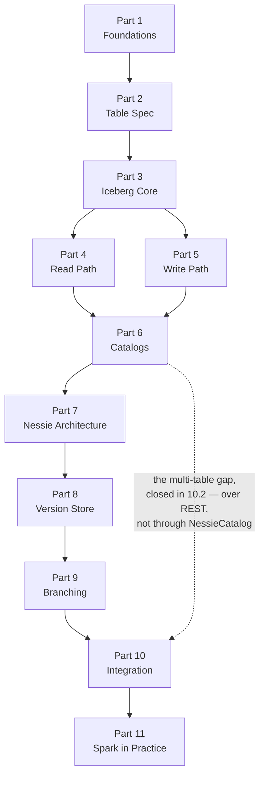

# Iceberg & Nessie Internals

A source-level walkthrough of [Apache Iceberg](https://github.com/apache/iceberg) and [Project Nessie](https://github.com/projectnessie/nessie) — the table format, and the catalog that gives it Git semantics.

This is not a usage guide. It assumes you can already create a table and run a query, and goes after the layer underneath: the bytes on disk, the commit protocol, the pruning algorithms, the storage engine behind Nessie's branches.

## Read against real source

Every code block in this book is **extracted from the upstream repositories at build time**, not transcribed. Line numbers match the tag. Each block links back to the exact lines on GitHub.

| Project | Tag | Released |
| --- | --- | --- |
| `apache/iceberg` | `apache-iceberg-1.11.0` | 2026-05-20 |
| `projectnessie/nessie` | `nessie-0.108.4` | 2026-07-31 |

If a method is renamed or a file moves upstream, the build fails rather than showing you code that no longer exists. Stale source in a source-level book is worse than no source at all.

## The route



Parts 2 through 6 are Iceberg. Parts 7 through 9 are Nessie. Part 10 is where they meet — and where the gap left open in Part 6 gets filled.

Read in order the first time: Part 2 establishes the vocabulary that Parts 3–5 assume, and Part 6 sets up the problem Part 10 solves. After that, chapters are written to be re-entered individually, each opening with the question it answers and the source files it covers.

## Contents

<div class="grid cards" markdown>

-   :material-numeric-1-box: **[Foundations](part01_foundations/index.md)**

    Why table formats exist; the two core ideas; how to navigate the codebases.

-   :material-numeric-2-box: **[The Table Spec](part02_table_spec/index.md)**

    `metadata.json`, manifest lists, manifests, and the V1→V2→V3 evolution.

-   :material-numeric-3-box: **[Iceberg Core](part03_iceberg_core/index.md)**

    Metadata evolution, `SnapshotProducer`, the commit protocol, conflict detection.

-   :material-numeric-4-box: **[The Read Path](part04_read_path/index.md)**

    `planFiles`, manifest and file pruning, residuals, split planning.

-   :material-numeric-5-box: **[The Write Path](part05_write_path/index.md)**

    Writers, appends, deletes, CoW vs MoR, table maintenance.

-   :material-numeric-6-box: **[Catalogs](part06_catalogs/index.md)**

    The `Catalog` SPI, where atomicity is real and where it leaks, the REST spec.

-   :material-numeric-7-box: **[Nessie Architecture](part07_nessie_architecture/index.md)**

    Service layers, the `Reference`/`Content` model, the request path.

-   :material-numeric-8-box: **[The Version Store](part08_version_store/index.md)**

    `Persist`, the commit DAG, key indexes, CAS, storage backends.

-   :material-numeric-9-box: **[Branching Algorithms](part09_branching/index.md)**

    Commit, merge, transplant, and garbage collection.

-   :material-numeric-10-box: **[Integration & Ecosystem](part10_ecosystem/index.md)**

    `NessieCatalog`, multi-table commits, and the catalog landscape.

-   :material-fire: **[Spark in Practice](part11_spark_practice/index.md)**

    Catalog wiring, importing existing tables, write distribution, maintenance traps.

</div>

## Running it locally

```bash
make install   # python deps via uv
make vendor    # clone both upstream repos at their pinned tags
make serve     # http://localhost:8000
make check     # verify every source locator still resolves
```

`make vendor` fetches roughly 120 MB of shallow clones into `vendor/`, which is gitignored. The book cannot build without it — there would be no source to inject.

## Status

All 51 chapters are written and have been reviewed against the pinned source. Chapter **3.3** was written first, to establish the format the rest follow.

Every chapter's prose was checked claim by claim against `vendor/` by a reader who did not write it. That pass found errors in most chapters — the injection mechanism proves the code is real, and proves nothing about the sentences around it. What survives is what two readings agreed on.

!!! note "On accuracy"
    Code is extracted mechanically and is accurate to the pinned tag by construction. The *prose* is a reading of that code and can be wrong. Corrections welcome.
