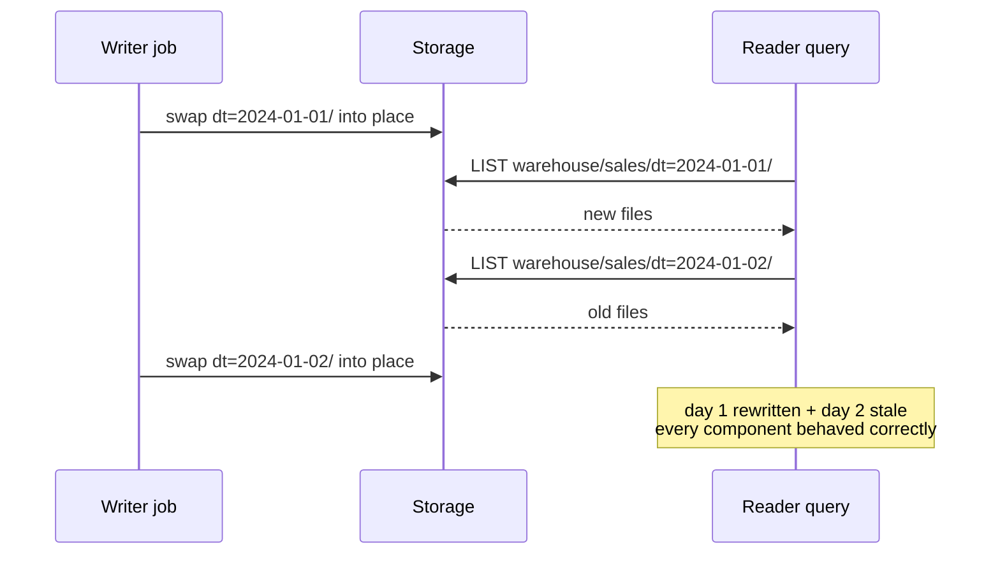
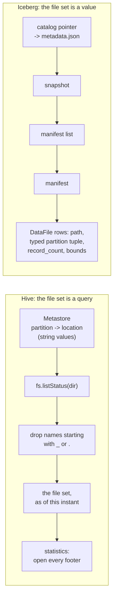

# Chapter 1.1 — Why table formats exist: the Hive table's failure modes

**The question this chapter answers:** why does "a directory of Parquet files plus a metastore entry" fail as a definition of a table, and what did Iceberg put in its place?

**Prerequisites:** none. This chapter opens the book.

**Source covered:** `data/.../TableMigrationUtil.java`, `api/.../DataFile.java`, `core/.../hadoop/HadoopTableOperations.java`

## 1. The query that returned the wrong answer, correctly

A daily job rewrites two partitions of a Hive table — `dt=2024-01-01` and `dt=2024-01-02`. It does what such jobs do: writes new files to a staging location, then swaps each partition directory into place. Two partitions, two swaps.

A dashboard query starts while that is in flight. It lists the first partition and gets the new files. It lists the second and gets the old ones. It returns a number that corresponds to no state the table was ever in.

Nothing failed. The writer did exactly what it was told. The storage layer served every listing correctly. The metastore was consistent throughout — it was never asked anything, because it does not know which files are in a partition. The reader's query planner asked the only question available to it, and got an honest answer to each half.

The bug is in the definition. A Hive table is not a value you can hold. It is **a query against the filesystem**: *everything under this prefix that does not start with `_` or `.`*. Two things follow immediately. There is no instant at which "the contents of the table" is a fixed object, so there is nothing for a reader to pin. And there is no operation that changes more than one directory at a time, so a writer that needs to change two has already lost.

Every well-known Hive failure mode — torn reads, no rollback, planning that takes minutes on a wide table, schema changes that corrupt data, partition predicates that silently miss files — is a consequence of that one definition rather than a separate defect. This chapter reads the definition as code, because Iceberg still ships it, and then reads what replaced it.

## 2. Two definitions of "the file set"

Read the arrow directions. On the left, the question "what is in this table" is answered by storage, at read time, freshly, every time. On the right it is answered by a file that was written once, at commit time, and never modified again. Everything else in this book is downstream of that difference.

## 3. The Hive table, as code

Iceberg contains an exact, executable statement of the Hive model. It exists for one purpose — importing an existing Hive table into Iceberg — and that is precisely what makes it good evidence: to migrate a Hive table you must first reconstruct what it contained, which means implementing the definition.



Four lines carry the whole model.

**`spec.fields().stream().map(PartitionField::name).map(partition::get)`.** The partition values arrive as a `Map<String, String>` — strings, looked up by field name, handed over by the metastore. Nothing here knows that `dt` is a date. The metastore recorded what the directory name said.

**`fs.listStatus(partitionDir, HIDDEN_PATH_FILTER)`.** This is the membership test. A file belongs to the partition if it is in the directory and its name does not begin with `_` or `.`. There is no other criterion, and no list to check the result against.

**`getParquetMetrics` / `getOrcMetrics` / `getAvroMetrics`.** Statistics do not exist yet. To learn how many rows a file has, or what range of values a column covers, someone has to open the file. `listPartition` opens every one of them, because that is the only way to obtain the information. Whether it does so in parallel is the caller's choice: `Tasks.range(fileStatus.size())` gets an `executeWith(service)` only `if (service != null)`, and `TableMigrationUtil.migrationService(parallelism)` returns `null` for a parallelism of 1 — in which case every footer is read on the calling thread. The I/O is not optional either way; only its width is.

**`buildDataFile(...)` returning a `DataFile`.** The output of the whole method is the thing Hive never had: an explicit record of one file's identity, partition tuple and statistics.

## 4. What that model cannot do

Each of these follows from the lines above, not from an implementation choice anyone made.

**The file set is a query, not a value.** Two listings a second apart may differ, and neither is more correct than the other. A reader cannot pin a version because no version exists to pin. Snapshot isolation is not hard here — it is unavailable.

**Partition values are untyped strings welded to the layout.** They come out of a path. Changing how a table is partitioned means moving every file, and a predicate on `dt` has to be translated by the engine into a string comparison against directory names — which is why a query filtering on a timestamp column often reads partitions it did not need.

**Per-file statistics do not exist until someone reads every file.** Pruning at plan time needs bounds, and bounds live in footers, and footers require I/O proportional to the number of files. This is why planning a wide Hive table is slow in a way that has nothing to do with the data being scanned.

**There is no unit of change larger than one filesystem operation.** The opening failure is not a race that better locking would fix. There is no object whose replacement constitutes "the new table", so there is nothing to replace atomically.

**Columns are identified by name or by position, and both drift.** Nothing in the model above records which column in a file corresponds to which column in the table; the engine matches them up at read time, by name if the format supports it and by ordinal if it does not. Rename a column and old files stop matching. Drop one and every file written before the drop shifts by a position. The damage is silent, because a file that resolves to the wrong column still parses.

Notice what all five have in common. None of them is a bug that a careful implementation avoids. They are what the definition entails, and the only way out is to change the definition.

## 5. What replaced the listing

Iceberg's answer is to make the file set a value, written down. The row type of that value is `DataFile`:



Compare it column by column with what `listPartition` had to reconstruct. `FILE_PATH` and `FILE_FORMAT` replace the listing. `RECORD_COUNT` and `FILE_SIZE` replace `FileStatus` plus a footer read. `COLUMN_SIZES`, `VALUE_COUNTS`, `NULL_VALUE_COUNTS`, `NAN_VALUE_COUNTS`, `LOWER_BOUNDS` and `UPPER_BOUNDS` replace opening the file at all — they are maps keyed by *column id*, so they survive renames, and they are written by the writer that produced the file.

Two details in that excerpt are easy to read past and matter more than the field list.

Every constant is a `Types.NestedField` with an explicit numeric id — `103` for `record_count`, `125` for `lower_bounds`, `128` for `upper_bounds` — and the bounds maps are documented as *"Map of column id to lower bound"*. Not column name. Not ordinal. The id is assigned when the column is created and never reused, which is what makes a rename a metadata-only operation and what stops a dropped column from shifting everything after it. The fifth failure mode in section 4 is closed by a numbering scheme.

The same discipline applies to the *format's own* fields, and the excerpt shows it. `CONTENT` is declared first and carries id `134`; `FILE_PATH`, declared underneath it, carries `100`. The comment above `CONTENT` says why — *"fields for adding delete data files"* — it was added when deletes were, long after the first ten fields, and it took the next free number rather than the next free line. Ids are assigned in the order fields entered the spec, never in the order they are written down, and the file ends with a bookkeeping line that keeps it that way: `// NEXT ID TO ASSIGN: 146`. Reading a manifest means reading ids, never positions, all the way down.

The partition tuple is absent from the excerpt because it is not a fixed field at all:



`required(PARTITION_ID, PARTITION_NAME, partitionType, PARTITION_DOC)` takes the struct type from the caller, and `PARTITION_DOC` states what it holds: *"Partition data tuple, schema based on the partition spec"*. The partition value is a typed struct computed from the row by the spec's transforms, stored beside the file's path. It is not parsed out of a directory name.

That is the difference between the two models in one line. Because the partition value is data rather than location, a table can be re-partitioned without moving a byte: new files are written under a new spec, old files keep their old tuple, and `SPEC_ID` on each row records which spec to interpret it with. Because it is typed, a predicate on a timestamp column is evaluated against a timestamp, not against a substring of a path.

And planning no longer touches data files. A scan reads manifests, compares a predicate against `LOWER_BOUNDS` and `UPPER_BOUNDS`, and discards files without opening them. The `// IDs start at 100 to leave room for changes to ManifestEntry` comment is a reminder of where these rows actually live: inside a manifest, wrapped in a `ManifestEntry` that adds the status and sequence number. Part 2 reads that wrapper byte by byte.

## 6. The commit becomes a pointer move

Once the file set is a value, changing the table means writing a new value and pointing at it. `HadoopTableOperations` — the simplest possible catalog, a metadata directory on a filesystem — marks the moment with a comment:



The new metadata is written first, to a path containing a `UUID.randomUUID()`, where nothing can be reading it. Then one `renameToFinal`. Everything before the rename is invisible; everything after it is the new table. That single operation is what the opening failure lacked.

The word "atomic" in that comment is carrying weight, and the class javadoc says whose weight: *"TableOperations implementation for file systems that support atomic rename."* Even granted such a filesystem, one atomic swap needs this much scaffolding:



A `LockManager` lease around the whole thing. An existence check on the destination — because two writers may have computed the same `nextVersion`, and losing that race must produce `CommitFailedException` rather than a silent overwrite. A `rename` whose `false` return is a failure, not an error. And `tryDelete(src)` on three of the four failure paths, with the result added as a suppressed exception so that a cleanup failure never masks the commit failure.

Three of four, not four of four, and the exception is worth noticing because it is the first one in the method. A failure to *acquire* the lock throws `CommitFailedException` immediately, with no `tryDelete`: the temp metadata file this commit wrote a moment earlier is left behind. It is harmless — nothing points at it, and section 7 explains why an unreferenced file under `metadata/` cannot affect a reader — but it is garbage that only the cleanup jobs in Part 5 will ever collect. Even the simplest commit path in Iceberg leaks something on one of its four exits.

The `LockManager` is there because `fs.exists(dst)` and `fs.rename(src, dst)` are two separate observations with a window between them. On an object store there is no rename at all — the sequence is copy-then-delete, and none of it is atomic. That gap is the entire reason Part 6 has more than one catalog in it.

## 7. Where listing survives, and why it is harmless there

`HadoopTableOperations` still lists a directory. It is worth seeing exactly where, because the contrast with section 3 is the whole point of the chapter:



The happy path reads a single file, `version-hint.text`, and parses an integer. When that fails — the hint is missing, truncated, or written by a crashed process — the code falls back to `fs.listStatus(metadataRoot(), ...)` filtered by `VERSION_PATTERN`, and takes the maximum version whose metadata file actually loads.

Structurally this is the Hive move: ask storage what exists. But note what it is being asked. Not *which files are in the table* — that question is answered by a manifest, and a stale or partial listing here cannot change the answer. It is asked only *which metadata file is newest*, and every candidate it might return is a complete, self-consistent table. The worst outcome of a bad listing is reading a slightly older version of the table, which is a normal thing for a reader to do.

That is the general rule this book will keep returning to: listing is acceptable for discovery, never for correctness. `writeVersionHint` is called after the rename and its failure is logged, not raised, precisely because the hint is an optimisation over a fallback that already works.

It is worth being explicit about what this trade costs, because the rest of the book is spent paying it. Hive's metadata is free: the directory is the metadata, so nothing has to be maintained and nothing can go stale. Iceberg's metadata is a data structure with its own write amplification, its own compaction problem, and its own garbage. Every append writes a manifest list. Every retry under contention writes another one. Snapshots accumulate until something expires them, and the files they referenced stay alive until something deletes them.

None of that existed in the Hive model, and all of it is the price of being able to name a version. Parts 2 and 3 describe the structure; Part 5 describes the maintenance jobs that keep it from growing without bound.

## 8. Gotchas

!!! warning "In the Hive model, membership is decided by a file's first character"
    `HIDDEN_PATH_FILTER` is `p -> !p.getName().startsWith("_") && !p.getName().startsWith(".")`. The filter has to exist — `_SUCCESS` markers and `.crc` sidecars share the directory with the data — but it means a legitimately named file beginning with an underscore silently vanishes from the table, and no error is possible because there is nothing to compare the listing against. Iceberg cannot have this failure mode: membership is enumeration, and a file no manifest lists is simply not in the table.

!!! warning "Migrating Avro partitions discards every column statistic"
    `getAvroMetrics` returns `new Metrics(rowCount, null, null, null, null)`, and the javadoc says so outright: *"For Avro partitions, metrics other than row count are set to null."* The migrated table looks identical to a natively written one, but its manifest rows carry empty bounds, so file pruning degrades to a full scan for those partitions until the data is rewritten. The cause is structural — Avro footers do not carry the per-column bounds that Parquet and ORC footers do.

!!! note "Some statistics can never be recovered by reading a file"
    The same javadoc: *"certain metrics, like NaN counts, that are only supported by Iceberg file writers but not file footers, will not be populated."* Metadata produced at write time is strictly richer than metadata reconstructed at read time. That asymmetry is the argument for the whole format.

!!! warning "Nothing checks the atomic-rename precondition at runtime"
    The class javadoc restricts `HadoopTableOperations` to *"file systems that support atomic rename"*, but no code enforces it. Point a `HadoopCatalog` at an object store and every method still runs: the `TableMetadataParser.write` in `commit()` succeeds, `findVersion` degrades gracefully, and `renameToFinal` calls a `rename` that is really copy-then-delete. The table appears to work until two writers commit at once. This is the single most common way to build an Iceberg deployment that loses data, and the only defence is the sentence in the javadoc.

!!! warning "`listPartition` shuts down an `ExecutorService` you passed in"
    `finally { if (service != null) { service.shutdown(); } }`, documented: *"the provided ExecutorService will be shutdown within this method after file reading is complete."* Handing the same pool to a second partition fails. Worth knowing, because a migration loop over thousands of partitions is exactly where someone reaches for a shared pool — and note that the `null` guard makes the single-threaded path legal, not the reuse.

## Key takeaways

- A Hive table is defined as a query against storage — everything under a prefix, minus hidden names — so there is no version for a reader to pin and no unit of change larger than one directory operation.
- Torn reads, slow planning, untyped partition values and unavailable rollback are all consequences of that single definition, not independent defects.
- Iceberg replaces the query with a value: `DataFile` rows enumerating every file with a typed partition tuple and per-column bounds keyed by column id.
- Because bounds live in metadata, planning reads manifests instead of footers, and the filesystem is never asked what the table contains.
- With the file set written down, a commit is one pointer move — and `renameToFinal` shows that even the simplest atomic swap needs a lock, an existence check and delete-on-failure.
- Listing does not disappear from Iceberg; it is demoted. `findVersion` lists a directory to *discover* the newest metadata file, and a stale answer costs a reader freshness, never correctness.
- The bill for all of this is that metadata is now a data structure someone has to write, compact and expire. Parts 2 through 5 are that bill.

## Source map

| What | File |
| --- | --- |
| The Hive definition, as code | [`data/.../TableMigrationUtil.java`](https://github.com/apache/iceberg/blob/apache-iceberg-1.11.0/data/src/main/java/org/apache/iceberg/data/TableMigrationUtil.java) |
| What a manifest row records | [`api/.../DataFile.java`](https://github.com/apache/iceberg/blob/apache-iceberg-1.11.0/api/src/main/java/org/apache/iceberg/DataFile.java) |
| The atomic-rename commit | [`core/.../hadoop/HadoopTableOperations.java`](https://github.com/apache/iceberg/blob/apache-iceberg-1.11.0/core/src/main/java/org/apache/iceberg/hadoop/HadoopTableOperations.java) |
| Builder that assembles a `DataFile` | [`core/.../DataFiles.java`](https://github.com/apache/iceberg/blob/apache-iceberg-1.11.0/core/src/main/java/org/apache/iceberg/DataFiles.java) |
| The value the pointer points at | [`core/.../TableMetadata.java`](https://github.com/apache/iceberg/blob/apache-iceberg-1.11.0/core/src/main/java/org/apache/iceberg/TableMetadata.java) |

**Next:** Chapter 1.2 follows the pointer this chapter stops at — down through `metadata.json`, snapshots and manifest lists — and shows why exactly one mutable cell is enough for the whole system.
