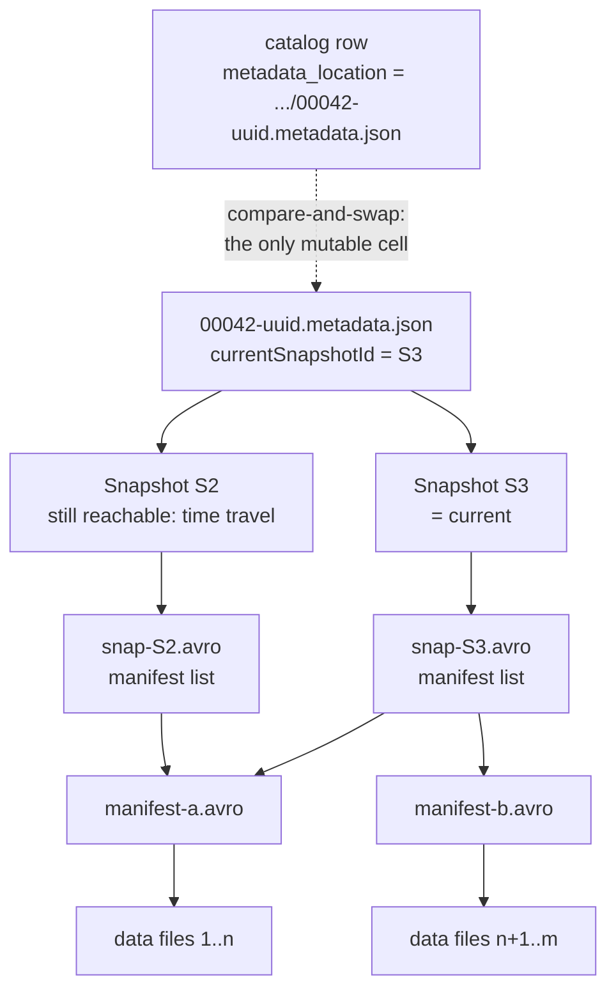
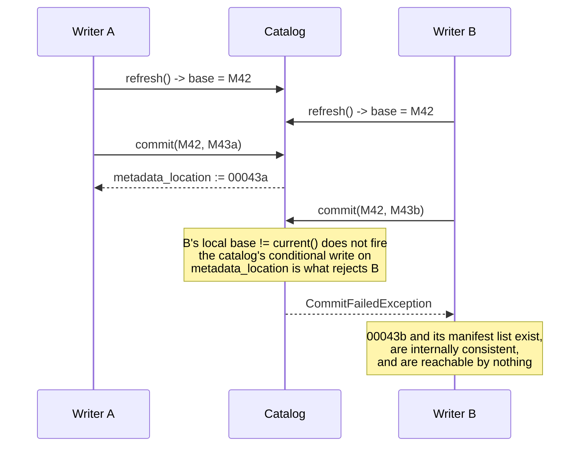

# Chapter 1.2 — Iceberg's core idea: an immutable metadata tree and one atomic pointer

<div class="chapter-meta" markdown>
**The question this chapter answers:** if every file Iceberg writes is immutable, where is the one mutable thing — and why is one enough?

**Prerequisites:** Chapter 1.1 (why the file set has to be a value rather than a listing)

**Source covered:** `core/.../TableMetadata.java`, `core/.../BaseMetastoreTableOperations.java`, `api/.../Snapshot.java`
</div>

## 1. Find the mutable thing

Chapter 1.1 ended on a rename with a comment attached: *"this rename operation is the atomic commit operation."* That comment is the thesis of the whole format, stated once, in the simplest catalog Iceberg has.

Take it seriously and a question follows. Iceberg writes a lot of files — metadata files, manifest lists, manifests, data files, statistics files, delete files — and every one of them is written once and never modified. Nothing is appended to. Nothing is edited in place. So where does change live?

The answer is that it lives in exactly one place, and it is one string. Everything else in Iceberg is a purely functional data structure: a tree of immutable nodes, each addressed by a location, rooted at a `metadata.json`. Committing means building a new tree that shares most of its nodes with the old one, writing the new root, and compare-and-swapping a single pointer from the old root to the new one.

That reduction is worth internalising early, because it makes the rest of the format follow rather than accumulate. Time travel is *not throwing the old roots away*. Rollback is *pointing at an old root*. Snapshot isolation is *a reader holding a root while a writer makes a different one*. Optimistic concurrency is *the swap failing if the pointer moved*. None of these are features built on top of the commit protocol. They are the same fact, viewed from different directions.

This chapter stays at that altitude. It shows the shape of the value, where the mutable cell physically is, and what the swap does. The machinery that *builds* a candidate — computing sequence numbers, writing the manifest list, validating against a moving base, retrying — is Chapter 3.3, and this chapter deliberately stops at the method call that hands off to it.

## 2. The shape of the tree



Two things in that picture do the work. `ML2` and `ML3` both point at `manifest-a.avro`: a commit copies pointers, not data, so an append that adds one file writes one new manifest and one new manifest list and reuses everything else. And the dashed edge is the only one that is ever redrawn. Every solid edge, once written, is permanent.

## 3. `TableMetadata` is a value, not a handle

Open the class and look at what it stores.



Almost everything under `// stored metadata` is `final`. Schemas, partition specs, sort orders, properties, `currentSnapshotId`, `lastSequenceNumber`, the snapshot log, the metadata log — all of it. There is no setter in the class. A `TableMetadata` is not a handle onto a table you can mutate; it is one version of a table, complete in itself.

That is why `TableMetadata.Builder` exists and why changes are expressed as `MetadataUpdate` objects rather than field assignments: producing a new version means building a new object from the old one. Chapter 3.2 covers that builder.

The last five fields on the page are the exception, and they are worth understanding now because they cause real surprises later. Count them in the excerpt: `snapshotsSupplier`, then four `volatile` — `snapshots`, `snapshotsById`, `refs`, `snapshotsLoaded`. None of them is `final`.

The tempting reading is that they are a cache sitting outside the value. That is not what they are. `snapshots` and `refs` are both persisted `metadata.json` fields — `TableMetadataParser` has a constant, a writer and a parser branch for each — and both arrive through the constructor like any other stored field. `snapshotsById` is a derived index over `snapshots`. What is genuinely not part of the value is the pair that records *how much of it has arrived yet*: `snapshotsSupplier` and `snapshotsLoaded`.

So the mutability here is about **when** the value shows up, not whether it can change. A REST catalog may return metadata whose snapshot list has not been fetched, because a table with fifty thousand snapshots should not force all of them into memory to answer a question about the current one; the catalog hands over a supplier instead. `ensureSnapshotsLoaded()` calls it once, under `synchronized`, then rebuilds `snapshotsById`, re-validates `refs` against the new index, sets `snapshotsLoaded` and drops the supplier to `null`. After that the object never changes again. The `volatile` markers exist because that one-time fill can happen on any thread.

## 4. Every edge in the tree is a location string

The tree in section 2 has no object references in it. Each node names its children by path:



A snapshot does not contain its manifests. It contains a string. Resolving the edge means reading a file, and because that file is immutable, the resolution is stable forever: two readers following the same edge at any two times get identical bytes.

The clause *"or null if it is not separate"* is a fossil. V1 tables could store the manifest list inline in `metadata.json`; the separate manifest-list file was introduced so that reading a snapshot's file set does not require parsing every snapshot's file set. Part 2 covers the format versions in detail.

## 5. Dereferencing the pointer

With that in place, following `currentSnapshotId` is almost nothing:



`currentSnapshot()` is a single map lookup. `snapshot(long)` is the same lookup, guarded by `ensureSnapshotsLoaded()` — and the asymmetry is deliberate. The *current* snapshot is expected to be in whatever partial set the catalog handed back, because a catalog that cannot describe the current state of the table has not done its job. An *arbitrary historical* snapshot may require going back to the source.

The defensive line inside `ensureSnapshotsLoaded` is the one to stop on:

```java
loadedSnapshots.removeIf(s -> s.sequenceNumber() > lastSequenceNumber);
```

The supplier is talking to something that keeps moving — a catalog, a REST endpoint, another process's view of the table. By the time it answers, it may know about snapshots that were committed *after* this `TableMetadata` was created. Keeping them would produce an object that reports a future its own `lastSequenceNumber` denies, and every consistency guarantee in the format would be void for anything holding it. So they are discarded. The immutable value stays immutable even though part of it arrived late.

`refs()` is the generalisation of `currentSnapshotId`: named branches and tags, each pointing at a snapshot id. Everything in this chapter applies to them unchanged — a ref is one more name for one more root, and `currentSnapshotId` is what `main` resolves to. Chapter 3.2 §4 opens `SnapshotRef` itself and shows what separates a branch from a tag, which turns out to be three nullable fields and nothing else.

## 6. What one pointer buys

Section 1 claimed that time travel, rollback and snapshot isolation are the same fact seen from different angles. The stored fields make that concrete. Three of them exist purely to keep old roots and old subtrees findable:



They are not adjacent in the source. `currentSnapshotId` sits at :258 and the other two at :262-263, with the by-id lookup maps between them — which is itself the shape of the thing: the pointer is one field among many, and the history that makes it reversible is stored separately from it.

`currentSnapshotId` is the pointer inside the current root. `snapshotLog` is the history of what it pointed at and when — which is what a `TIMESTAMP AS OF` query resolves against, since a timestamp has to be turned into a snapshot id before anything else can happen. `previousFiles` is the list of *earlier roots*, the metadata log, which is what the cleanup gotcha in section 10 trims.

So:

- **Time travel** is reading a `Snapshot` that is still in `snapshots()` but is not `currentSnapshotId`. Nothing special happens — the subtree under it was never modified, because nothing in Iceberg is ever modified.
- **Rollback** is a commit whose only change is setting `currentSnapshotId` back to an older value. It goes through the same `commit()` as an append and takes the same optimistic-concurrency check.
- **Snapshot isolation** is a reader holding a `TableMetadata` reference while a writer builds a different one. There is no lock and no MVCC layer; the reader's tree is unreachable from the writer's changes by construction.
- **Incremental reads** are two snapshot ids and a diff of the manifests between them, which is what makes changelog scans possible at all.

Each of these costs one field and no mechanism. That is the return on making the file set a value.

## 7. Where the mutable cell physically lives

For any catalog backed by a metastore, the answer is a table property:



`METADATA_LOCATION_PROP` is `"metadata_location"`. That string — a path to a `metadata.json` — *is* the table, as far as the catalog is concerned. `TABLE_TYPE_PROP` is `"table_type"`, and the constant on the line below it, `ICEBERG_TABLE_TYPE_VALUE`, is `"iceberg"`: name and value are two constants, and a Hive metastore entry announces that its `metadata_location` means something by setting the first to the second.

`PREVIOUS_METADATA_LOCATION_PROP` is worth being precise about, because it looks like it does more than it does. Every metastore-backed catalog writes it — `HMSTablePropertyHelper`, `GlueTableOperations`, `DynamoDbTableOperations`, `BigQueryTableOperations`, and JDBC in its `SET` clause — and none of them ever conditions on it. JDBC's compare-and-swap is `WHERE metadata_location = ?`, the previous location appearing only on the left of the assignment; the single read of the property in the tree copies it into a map for a caller to look at. It is a breadcrumb for a human or an external tool, not a mechanism. Rollback is driven by `snapshotLog` and `snapshots` *inside* the metadata file, and losing a race is detected by `base != current()` plus the catalog's conditional write on `metadata_location` — both of which section 8 gets to.

The four instance fields below them are the local cache of one resolution: `currentMetadata`, `currentMetadataLocation`, `shouldRefresh`, `version`. Everything a running process believes about the table is derived from these.

## 8. The swap



Twenty-eight lines, and three decisions in them.

**`if (base != current())`** is the *local* half of the concurrency check, and it is reference identity, not `equals`. That works only because `TableMetadata` is immutable and this object hands out the same instance until `refresh()` replaces it — which makes the test free. It also means a commit must be built from the metadata *this* `TableOperations` gave you. Reconstructing an equal `TableMetadata` from the same JSON and committing against it fails, correctly, because you have not demonstrated that you read the current state.

It is worth being exact about what this line can and cannot see, because it is easy to read it as the whole mechanism. `current()` re-reads the catalog only `if (shouldRefresh)`, and `refresh()` clears that flag on the way out. So a writer that refreshed, built a commit and submitted it compares its own cached instance against itself: the test passes, and it passes *even if another process committed in between*. What it reliably catches is a stale handle inside this process — a `base` older than the metadata this object has since loaded. What catches a genuinely concurrent writer is the conditional write inside `doCommit`, which is Part 6's subject. The two are complements, not alternatives.

**`base == null` means create, and losing that race is a different exception.** The comment spells it out: *"when current is non-null, the table exists. but when base is null, the commit is trying to create the table."* The distinction matters two layers up: Chapter 3.3's retry loop retries `CommitFailedException` and nothing else, so a lost creation race is terminal by design. Retrying it would append to somebody else's brand-new table.

**`doCommit(base, metadata)` is where this chapter stops.** It is the hook every catalog fills in — not an `abstract` method but a concrete one whose body is `throw new UnsupportedOperationException("Not implemented: doCommit")`, so a subclass that forgets it compiles and fails at commit time rather than at build time — and whether the swap it performs is genuinely atomic is the subject of Part 6. What follows it — `CatalogUtil.deleteRemovedMetadataFiles`, then `requestRefresh()` — is trailing work, performed after the table has already changed.



That last note is the point of the diagram. Writer B's files are not corrupt and not partially written. They are a complete, valid tree that no pointer refers to. Cleaning them up is bookkeeping, not repair — and Chapter 3.3 shows the surprising amount of care that bookkeeping requires when the outcome of the swap is unknown.

## 9. Why a new file, never an overwrite



The comment carries the argument: *"use overwrite to avoid negative caching in S3. this is safe because the metadata location is always unique because it includes a UUID."*

Read it in the right order. Iceberg wants `overwrite` semantics because a create-if-absent call on S3 can leave a negative cache entry that makes a freshly written object look missing. Overwriting is normally dangerous. It is safe here only because the path can never collide — `newTableMetadataFilePath` embeds a `UUID.randomUUID()`, so no two calls can produce the same name.

Immutability in Iceberg is enforced by naming, not by a filesystem flag. The `00042-` version prefix is a convenience for humans reading a directory listing; the UUID is what makes the name unrepeatable. Code that reconstructs metadata paths from a version number alone is relying on a property the format does not promise.

## 10. Gotchas

!!! warning "The staleness check is `!=`, not `!equals`"
    A `TableMetadata` parsed a second time from the same `metadata.json` is a different object and will be rejected as stale. This is not an oversight — identity comparison is what makes the concurrency check free — but it means you cannot construct a base out of band. Go through `refresh()`.

!!! warning "`currentSnapshot()` does not force a snapshot load; `snapshot(id)` does"
    If the catalog returned metadata with a partial snapshot list, `currentSnapshot()` reads whatever is cached and `snapshot(someOldId)` triggers a fetch. On a table with a long history that is the difference between a map lookup and a network round trip, and it is invisible at the call site.

!!! warning "Old metadata files are kept by default"
    `commit()` calls `CatalogUtil.deleteRemovedMetadataFiles`, but it is gated on `METADATA_DELETE_AFTER_COMMIT_ENABLED`, whose default is `false`. On a busy table the metadata directory grows without bound. Turning it on moves the cost the other way: deletion becomes trailing work performed *after* the atomic point, so a failure there cannot un-commit anything but can leave the operator with an exception on a commit that succeeded.

!!! note "One pointer is one table"
    Everything in this chapter is scoped to a single table. Two tables that must change together have no shared pointer to swap, and no amount of care inside `commit()` can create one. That gap is exactly what Chapter 1.3 is about.

## Key takeaways

- Iceberg is a purely functional data structure with one mutable cell: the catalog's `metadata_location` string. Every other file it writes is immutable and named so it can never be rewritten.
- Every stored field of `TableMetadata` is `final` except the five that record how much of the value has arrived — `snapshots` and `refs` are persisted fields that a catalog may deliver late, behind `snapshotsSupplier` — and a late delivery is filtered against `lastSequenceNumber` so it cannot smuggle in a newer state.
- Every edge in the metadata tree is a location string, so resolving an edge is stable forever and a commit shares nodes with its predecessor instead of copying them.
- Concurrency is checked in two places, not one: `base != current()` is a free reference-identity guard against a stale handle *inside* one process — which is why a commit must be built from metadata obtained through `refresh()` — and the catalog's conditional write inside `doCommit` is what rejects a genuinely concurrent writer.
- A lost race leaves a complete, valid, unreferenced tree on storage. Nothing is corrupt; the files are simply garbage.
- Time travel, rollback, snapshot isolation and optimistic concurrency are not four mechanisms. They are one mechanism seen from four directions.

## Source map

| What | File |
| --- | --- |
| The immutable value | [`core/.../TableMetadata.java`](https://github.com/apache/iceberg/blob/apache-iceberg-1.11.0/core/src/main/java/org/apache/iceberg/TableMetadata.java) |
| The downward edges of the tree | [`api/.../Snapshot.java`](https://github.com/apache/iceberg/blob/apache-iceberg-1.11.0/api/src/main/java/org/apache/iceberg/Snapshot.java) |
| The mutable cell and the swap | [`core/.../BaseMetastoreTableOperations.java`](https://github.com/apache/iceberg/blob/apache-iceberg-1.11.0/core/src/main/java/org/apache/iceberg/BaseMetastoreTableOperations.java) |
| The SPI both sides implement | [`core/.../TableOperations.java`](https://github.com/apache/iceberg/blob/apache-iceberg-1.11.0/core/src/main/java/org/apache/iceberg/TableOperations.java) |
| Named refs beyond `currentSnapshotId` | [`api/.../SnapshotRef.java`](https://github.com/apache/iceberg/blob/apache-iceberg-1.11.0/api/src/main/java/org/apache/iceberg/SnapshotRef.java) |
| Trailing metadata cleanup | [`core/.../CatalogUtil.java`](https://github.com/apache/iceberg/blob/apache-iceberg-1.11.0/core/src/main/java/org/apache/iceberg/CatalogUtil.java) |

**Next:** Chapter 1.3 takes the same compare-and-swap one level up. Nessie gives the *catalog* a pointer, so that a branch names a consistent set of table pointers rather than one table's.
