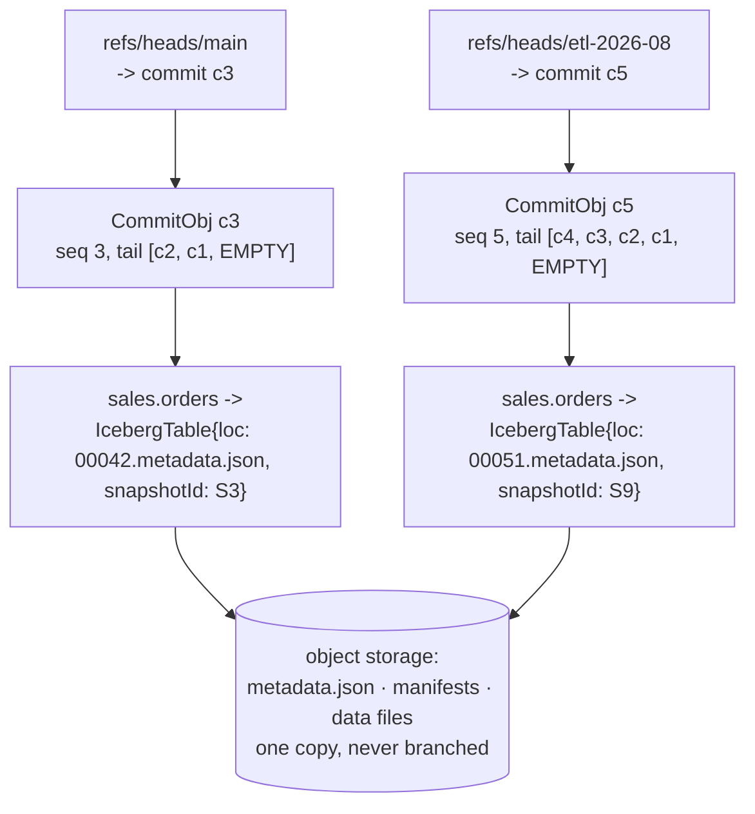
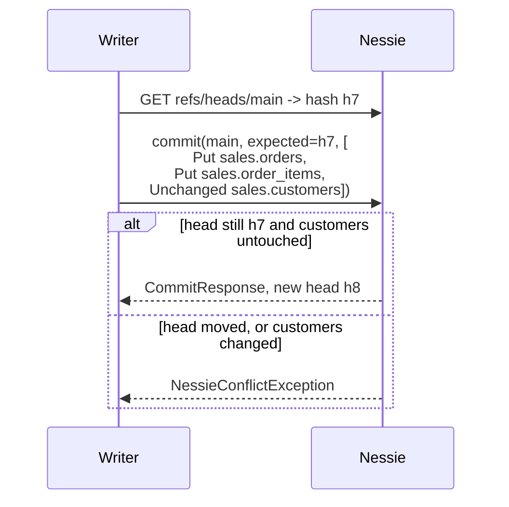

# Chapter 1.3 — Nessie's core idea: Git semantics for the catalog

**The question this chapter answers:** what exactly does Nessie version, and in what sense is "it works like Git" a claim about the source rather than a marketing analogy?

**Prerequisites:** Chapter 1.2 (the immutable tree and the one atomic pointer)

**Source covered:** `versioned/storage/common/.../persist/Reference.java`, `.../objtypes/CommitObj.java`, `api/model/.../Validation.java`, `.../CommitMeta.java`, `.../Operations.java`, `.../IcebergContent.java`, `api/model/.../api/v2/TreeApi.java`

## 1. The gap that one pointer leaves

Chapter 1.2 reduced an Iceberg table to a single compare-and-swapped string. That is a complete answer for one table, and it is silent about two.

An ETL job that rewrites `sales.orders` and `sales.order_items` together commits twice. Between those commits the warehouse is in a state neither job intended and no reader wants — orders updated, line items not. Iceberg has no construct that spans them: there is no shared pointer, no shared metadata file, nothing to swap once. The same gap swallows the questions people actually ask of a warehouse. *Show me every table as it was before last night's load.* *Let me validate a whole batch of tables and publish them together, or none of them.* *Give my team a copy of the warehouse to experiment on that costs nothing to create.*

Nessie's answer is to apply Chapter 1.2's move one level up. If one pointer per table gives you atomic single-table commits, then one pointer per **branch** — naming a consistent set of table pointers — gives you all of the above. What that branch points at is a commit; what a commit records is a set of changes to keys; what a key maps to is a small immutable value. If that sounds like Git, it is because the resemblance is not an analogy. This chapter shows where it is written down.

## 2. It really is Git

Start at the bottom, in the storage layer, where a reference is defined:



*"Reference is a generic named pointer."* Branches live under `refs/heads/`; tags live under `refs/tags/`. Those are not Nessie's names for things — they are Git's on-disk ref namespaces, adopted verbatim. A branch reference points at a `COMMIT` object; a tag may point at a `TAG` object or straight at a `COMMIT`, exactly as an annotated versus lightweight tag does in Git.

Two of the six attributes below the javadoc are the Git part: a `name()` and an `ObjId pointer()`. Everything Chapter 1.2 said about `metadata_location` applies to that pair word for word — a name, a pointer, and a compare-and-swap.

The other four are storage bookkeeping that no client ever sees. `deleted()` marks a reference as tombstoned rather than removing the row, so a concurrent reader cannot observe a half-deleted branch. `createdAtMicros()` and `previousPointers()` are the reference's own history — the latter is `@Value.Auxiliary`, deliberately excluded from `equals`, and is what lets the server answer "where did `main` point ten minutes ago" without walking the commit log. `extendedInfoObj()` is a nullable pointer to a side object. Keep the split in mind: this type is the *stored* reference, and section 9's second gotcha is about the two other types that share its name.

The Git shape does not stop at the storage layer. It reaches the wire format:



`HASH_RAW_REGEX` is a hex string of 8 to 64 characters, so a client may abbreviate a hash the way `git log abc1234` does. Then `RELATIVE_COMMIT_SPEC_RAW_REGEX`: `~`, `^` or `*`, followed by a count or an ISO-8601 timestamp. The two are composed by the constant underneath them, `HASH_OR_RELATIVE_COMMIT_SPEC_RAW_REGEX` — an optional hash followed by any number of relative lookups — and it is that constant's javadoc that carries the worked examples, including *"the commit in the commit log starting at `11223344` with a commit-created timestamp of `2021-04-07T14:42:25.534748Z` or less."*

`~N` and `^N` are Git's own relative-lookup operators, with the same meanings: the javadoc defines `~` as the n-th predecessor in the commit log and `^` as the n-th parent, *"either 1, referencing the direct parent, or 2, referencing the merge parent."* `*timestamp` is the one addition, and it is the one a warehouse needs: resolve a reference as of a wall-clock time. A client can send `main~3` or `main*2021-04-07T14:42:25Z` as a reference string and let the server resolve it, which is why time travel across the whole catalog needs no special API.

## 3. What a commit is



A monotonic `seq`, a list of parents, secondary parents for merges, multi-valued headers, and a plain-text `message`. The shape is familiar; two details are not.

`tail()` is documented as *"Zero, one or more parent-entry hashes of this commit, the nearest parent first… This is an internal attribute used to more efficiently page through the commit log. Only the first, the nearest parent, shall be exposed to clients."* It is not a skip list — nothing is skipped. It is a dense sliding window over the nearest ancestors: `CommitLogicImpl` seeds a new commit's tail with `parentCommitId` and then copies the first `parentsPerCommit - 1` entries of the *parent's* tail, so with `DEFAULT_PARENTS_PER_COMMIT = 20` every commit carries the 20 consecutive ancestors immediately behind it. `StoreConfig` says what for: *"Number of parent-commit-hashes stored in each commit. This is used to allow bulk-fetches when accessing the commit log."* Twenty commits of log come back per round trip instead of one.

The §5 diagram below shows the shape at small scale, and the `seq` in each box is what fixes it: `seq` starts at `1` on the root commit and is `parent.seq() + 1` thereafter, so `c5` has exactly four ancestors and its tail is `[c4, c3, c2, c1, EMPTY]` — every one of them, in order, terminated by the sentinel that stands where the root's parent would be. A commit deeper than twenty carries the nearest twenty and stops. Chapter 8.2 draws the same structure with `parents-per-commit` turned down to five so the boxes fit.

`directParent()` is the accessor that means what a Git user expects, and `secondaryParents()` — *"for example the ID of a merged commit"* — is where a merge's second parent goes.

The rest of `CommitObj`, elided here, is two indexes; its class javadoc calls them *"the mapping of all reachable `StoreKey` keys to `Obj` values"*, held as a full `referenceIndex()` and an `incrementalIndex()` diff against it. Note the key type. `StoreKey` is the storage-layer key, and its own javadoc warns that it *"does not map exactly to a (user facing) Nessie content keys. Keys at the storage level are finer grained"* — one `ContentKey` can produce several. That is the machinery that makes "what is at this key on this branch" a lookup rather than a replay of history, and Part 8 is about it.

The human-facing half of a commit is a separate type on the wire:



Note the javadoc on `getCommitter`: *"The committer should follow the git spec for names eg Committer Name &lt;committer.name@example.com&gt; but this is not enforced"*, with a link to the `git-commit` documentation. The trailing clause is the operative half — the convention is Git's, the validation is nobody's, and the same javadoc adds that the field is *"populated on the server"* and that Nessie returns an error if a client sets it. Nessie also keeps author and committer as separate fields, which only matters if you cherry-pick or replay commits — and Nessie does both, under the names `transplant` and `merge`.

`getHash()` carries a warning worth remembering: *"This is not known at creation time and is only valid when reading the log."* A commit's identity is derived from its content, so it cannot be part of the content.

## 4. What a commit contains



Twelve lines, and the whole commit protocol is in them: some `CommitMeta`, and one or more `Operation`s. `@Size(min = 1)` — an empty commit is rejected at validation, not silently accepted.

There are exactly three kinds of `Operation`: `Put` writes a value at a `ContentKey`, `Delete` removes one, and `Unchanged` asserts that a key the writer *read* has not moved. That third one has no Git equivalent and is the most important of the three for correctness; the gotchas in section 9 explain why. Chapter 7.2 reads all three types in full.

## 5. What actually gets versioned

The value stored at a key, for anything in Iceberg format, is this:



Five lines. A metadata location and a version id. `IcebergTable` extends it with `snapshotId`, `schemaId`, `specId` and `sortOrderId` — each javadoc'd as *"Corresponds to Iceberg's …"*. `IcebergView` is the view counterpart but not a mirror of it: it overrides `getVersionId()` as *"Corresponds to Iceberg's `currentVersionId`"*, adds `getSchemaId()`, and carries two deprecated accessors (`getSqlText`, `getDialect`) left over from when Nessie stored view definitions itself. A view's spec and sort order have nowhere to go, because a view has neither.

That is the entire integration, and it is worth pausing on how little it is. Nessie stores the string Chapter 1.2 called the one mutable cell. It does not store schemas, does not read manifests, and never touches a data file. Creating a branch writes one row. The Parquet in object storage is not copied, not marked, and not aware that branches exist.

The corollary arrives immediately, and it is the price of the design: garbage collection can no longer be decided per table. A snapshot that is unreachable on `main` may be the current one on a branch nobody has merged, so Iceberg's own expire-snapshots is not safe to run under a Nessie catalog. Nessie ships its own collector, and Part 9 covers it.

## 6. The swap, one level up



*"Commit multiple operations against the given branch expecting that branch to have the given hash as its latest commit."* That sentence is Chapter 1.2's `base != current()`, restated for a catalog. The client sends the hash it read; the server accepts only if the head still matches; otherwise `NessieConflictException`, documented as *"either caused by a conflicting commit or concurrent commits."*

Everything the opening section asked for falls out of that one method. Two tables in one `Operations` list commit atomically, because one CAS covers both. A branch is created by pointing a new name at an existing commit, which copies nothing. A whole-warehouse rollback is a CAS that moves a branch backwards.

The `Unchanged` in that request is the piece with no counterpart in Chapter 1.2, and the reason is structural. An Iceberg commit implicitly reads exactly one table — its own — so "what did this writer depend on" needs no declaration. A Nessie commit may depend on keys it does not write, and only the writer knows which. How the server turns these declarations into conflict detection is Chapter 9.1.

## 7. The rest of the verbs

Once a reference is a pointer to a commit, the operations Git users expect are not new machinery — they are compositions of the same CAS. Two of them appear in the same interface, one line apart:



*"Cherry-pick a set of commits into a branch."* Nessie calls it `transplantCommitsIntoBranch`, but the javadoc uses Git's word, because the operation is Git's operation: take commits from somewhere else, replay their effect onto this branch, mint new commit objects. That is why `CommitMeta` separates author from committer — a transplanted commit keeps its author and gets a new committer.

`mergeRefIntoBranch` takes a `Merge` payload rather than a list of hashes, and both return `MergeResponse` rather than a plain `Branch`, because either can partially fail: a merge that touches twenty keys may conflict on three. The `MergeKeyBehavior` and `MergeBehavior` types beside them in `api/model` are how a client says what to do per key. Part 9 implements all of it.

What is *not* here is as informative. There is no rebase, no history rewriting, no force-push of arbitrary history — `assignReference` can move a branch, but the commit graph itself is append-only. Immutability is the same bargain Chapter 1.2 struck, kept at a larger scale.

## 8. Two levels of the same idea

| Iceberg (Chapter 1.2) | Nessie (this chapter) |
| --- | --- |
| `metadata_location` in a catalog row | `Reference.pointer()` under `refs/heads/` |
| `TableMetadata`, immutable, written once | `CommitObj`, immutable, content-addressed |
| `currentSnapshotId` selects a `Snapshot` | the commit's key index maps `StoreKey` to a value |
| `base != current()` on `commit()` | expected hash on `commitMultipleOperations` |
| scope of one CAS: one table | scope of one CAS: every key in the repository |
| history: `snapshotLog`, `previousFiles` | history: the commit DAG, `tail()` and `secondaryParents()` |
| time travel: snapshot id or timestamp | time travel: `~N`, `^N`, `*timestamp` on any reference |
| garbage: unreferenced files under one table | garbage: files unreachable from *every* reference |

Read down the right-hand column and Nessie is Chapter 1.2 with the scope of the compare-and-swap widened from one table to one repository. Read across any row and the same design decision appears twice: make the state immutable, name it, and change exactly one pointer.

## 9. Gotchas

!!! warning "`Unchanged` is the read set, and omitting it fails silently"
    A commit conflicts only on the keys it names. If your job read `sales.customers` to compute what it wrote to `sales.orders` and did not send `Unchanged` for it, a concurrent change to `customers` will not conflict, and your commit lands on a premise that is no longer true. Nothing warns you — Nessie cannot know what you read.

!!! warning "Three unrelated types are spelled `Reference` or `Ref`"
    `org.projectnessie.model.Reference` is the wire type (`Branch`, `Tag`, `Detached`). `org.projectnessie.versioned.Ref` in `versioned/spi` is a marker interface with no members at all. `org.projectnessie.versioned.storage.common.persist.Reference` — the one in section 2 — is the stored row, and it carries `deleted`, `createdAtMicros`, `extendedInfoObj` and `previousPointers` that no client ever sees. They are separate so the wire model can stay frozen across API versions while storage evolves. Always resolve the package before trusting a search hit.

!!! warning "`ContentKey` and `StoreKey` are not the same key"
    The wire type is `org.projectnessie.model.ContentKey`; the type the commit indexes are keyed by is `org.projectnessie.versioned.storage.common.indexes.StoreKey`. The conversion is not the identity: `TypeMapping.keyToStoreKey` joins the key's elements with `char 0` and appends `char 0` plus a one-character discriminator, `CONTENT_DISCRIMINATOR = "C"`, and there are `keyToStoreKeyMin` / `keyToStoreKeyMax` variants that exist to bracket a range scan over everything filed under one content key. So the storage layer holds *more* keys than the client ever names, which is why `StoreKey`'s javadoc calls them "finer grained". Debugging an index dump means converting before comparing.

!!! warning "`tail()` is not the parent list"
    Rendering `tail()` as a DAG draws edges to commits that are ancestors but not parents, producing a history that never happened. Use `directParent()` for the parent and `secondaryParents()` for merges.

!!! note "Branching is free; garbage collection is not"
    A branch costs one reference row. What it costs instead is reachability analysis: no file can be deleted because one branch stopped referencing it, only because *every* branch has. A forgotten experiment branch pins its snapshots and their data files indefinitely.

## Key takeaways

- Nessie versions the catalog, not the data: the value stored per key is a metadata location plus a few IDs, and object storage is neither copied nor aware that branches exist.
- The Git resemblance is literal in the source — `refs/heads/` and `refs/tags/` namespaces, `~N` and `^N` relative commit specs, author/committer fields that cite the `git-commit` spec.
- A commit is a `CommitObj`: monotonic `seq`, parents nearest-first, secondary parents for merges, headers and a message. `tail()` is a dense 20-commit window of consecutive ancestors, kept for bulk-fetching the log — not the parent chain, and not a skip list.
- A commit request is `CommitMeta` plus at least one `Operation`, and `Unchanged` is how a writer declares the keys it read but did not write.
- `commitMultipleOperations` is Chapter 1.2's compare-and-swap moved up a level: one CAS on a branch head, covering any number of tables at once.
- Cheap branching moves the cost to reachability: garbage collection becomes a whole-repository question, which is why Iceberg's own snapshot expiry is unsafe under a Nessie catalog.

## Source map

| What | File |
| --- | --- |
| Named pointers, in Git's namespaces | [`versioned/storage/common/.../persist/Reference.java`](https://github.com/projectnessie/nessie/blob/nessie-0.108.4/versioned/storage/common/src/main/java/org/projectnessie/versioned/storage/common/persist/Reference.java) |
| Hash and relative-commit-spec grammar | [`api/model/.../Validation.java`](https://github.com/projectnessie/nessie/blob/nessie-0.108.4/api/model/src/main/java/org/projectnessie/model/Validation.java) |
| The commit object | [`versioned/storage/common/.../objtypes/CommitObj.java`](https://github.com/projectnessie/nessie/blob/nessie-0.108.4/versioned/storage/common/src/main/java/org/projectnessie/versioned/storage/common/objtypes/CommitObj.java) |
| How a commit's `tail` is built | [`versioned/storage/common/.../logic/CommitLogicImpl.java`](https://github.com/projectnessie/nessie/blob/nessie-0.108.4/versioned/storage/common/src/main/java/org/projectnessie/versioned/storage/common/logic/CommitLogicImpl.java), [`config/StoreConfig.java`](https://github.com/projectnessie/nessie/blob/nessie-0.108.4/versioned/storage/common/src/main/java/org/projectnessie/versioned/storage/common/config/StoreConfig.java) |
| `ContentKey` to `StoreKey` | [`versioned/storage/store/.../versionstore/TypeMapping.java`](https://github.com/projectnessie/nessie/blob/nessie-0.108.4/versioned/storage/store/src/main/java/org/projectnessie/versioned/storage/versionstore/TypeMapping.java) |
| Commit metadata | [`api/model/.../CommitMeta.java`](https://github.com/projectnessie/nessie/blob/nessie-0.108.4/api/model/src/main/java/org/projectnessie/model/CommitMeta.java) |
| A commit request | [`api/model/.../Operations.java`](https://github.com/projectnessie/nessie/blob/nessie-0.108.4/api/model/src/main/java/org/projectnessie/model/Operations.java), [`Operation.java`](https://github.com/projectnessie/nessie/blob/nessie-0.108.4/api/model/src/main/java/org/projectnessie/model/Operation.java) |
| What is versioned | [`api/model/.../IcebergContent.java`](https://github.com/projectnessie/nessie/blob/nessie-0.108.4/api/model/src/main/java/org/projectnessie/model/IcebergContent.java), [`IcebergTable.java`](https://github.com/projectnessie/nessie/blob/nessie-0.108.4/api/model/src/main/java/org/projectnessie/model/IcebergTable.java) |
| Content identity across renames | [`api/model/.../Content.java`](https://github.com/projectnessie/nessie/blob/nessie-0.108.4/api/model/src/main/java/org/projectnessie/model/Content.java) |
| The commit endpoint | [`api/model/.../api/v2/TreeApi.java`](https://github.com/projectnessie/nessie/blob/nessie-0.108.4/api/model/src/main/java/org/projectnessie/api/v2/TreeApi.java) |

**Next:** Chapter 1.4 turns from what these two systems do to where their code is — the real Gradle module layout of both repositories, and why the search you reach for first returns nothing.
