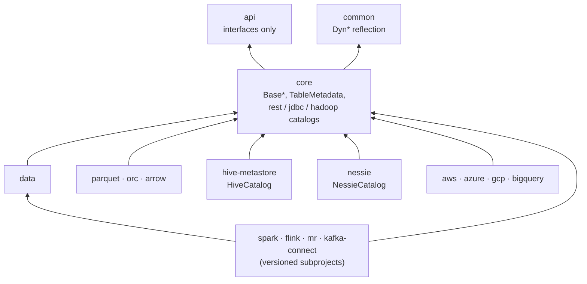

# Chapter 1.4 — Reading these codebases: module maps and navigation

**The question this chapter answers:** given a class name, an interface, or a config string, where in these two repositories do you actually look — and why does the obvious search so often return nothing?

**Prerequisites:** Chapter 1.2 (`TableMetadata` and the one atomic pointer), Chapter 1.3 (`CommitObj`, `Operation`, `IcebergTable`)

**Source covered:** `settings.gradle`, `settings.gradle.kts`, `gradle/projects.main.properties`, `core/.../CatalogUtil.java`, `versioned/storage/common/.../PersistLoader.java`

## 1. The search that fails

You have a stack trace with `BaseMetastoreTableOperations` three frames down. Or a Spark config line that reads `type=nessie` and a `ClassNotFoundException` that names nothing you recognise. Or you are holding `org.apache.iceberg.catalog.Catalog` in an editor and you press "go to implementation", and you get a list of thirty classes, none of which is the one your cluster is running.

This is not bad luck. It is the direct consequence of how both projects are built.

Iceberg puts every interface in one Gradle module, `api/`, and every implementation in another, `core/`, and then chooses between implementations by **reflecting on a class-name string** that came out of table properties. Nessie splits the wire model from the storage engine and chooses a backend through **`ServiceLoader`**. In both cases the edge from an abstraction to the thing that implements it is *data* — a string in a config map, a line in a `META-INF/services` file — not a compile-time reference. A code search follows compile-time references. There is nothing there to follow.

Two moves work instead, and this chapter is about both:

1. Read the settings file to learn what the modules are and what each one holds.
2. Read the **registry** — `CatalogUtil`'s constants on the Iceberg side, `META-INF/services` on the Nessie side — to learn which class a string resolves to.

## 2. Iceberg: twenty-five includes and one naming rule

Iceberg's entire static module list fits on one screen:



Twenty-five `include` lines, with `api` second and `core` fourth. The lines immediately below rename each project to its published artifact — `project(':core').name = 'iceberg-core'` — which is why the coordinate you see in a dependency report (`org.apache.iceberg:iceberg-core`) never quite matches the directory on disk.

The split those first four lines encode is the one navigation rule worth memorising:

> An interface `Foo` in `api/src/main/java/org/apache/iceberg/` almost always has a `BaseFoo` in the **same package** under `core/`.

`Table` → `BaseTable`. `Transaction` → `BaseTransaction`. `RewriteFiles` → `BaseRewriteFiles`. There are 39 `Base*.java` files in `core`'s root package alone. When "go to implementation" fails, replacing `api/` with `core/` in the path and prefixing `Base` succeeds far more often than it has any right to.

Arrows point at what a module depends on. Everything depends on `api`; `api` depends on nothing; **no arrow ever runs from `api` to `core`**. That asymmetry is the whole reason the first search fails, and it is deliberate — it is what lets an engine compile against `iceberg-api` without pulling in a catalog implementation.

| Module | Gradle project | What lives there |
| --- | --- | --- |
| `api/` | `iceberg-api` | The contracts: `Table`, `Snapshot`, `DataFile`, `Schema`, `SnapshotRef`, plus `expressions`, `types`, `transforms`, `catalog`, `io`, `view`, `actions`, `metrics`, `variants`, `geospatial` |
| `core/` | `iceberg-core` | The implementations: `TableMetadata`, `SnapshotProducer`, `BaseMetastoreTableOperations`, 39 `Base*.java` in the root package, plus `avro`, `hadoop`, `rest`, `jdbc`, `catalog`, `deletes`, `encryption`, `puffin`, `mapping`, `inmemory` |
| `common/` | `iceberg-common` | Four files only: `DynClasses`, `DynConstructors`, `DynFields`, `DynMethods` — the reflection helpers everything else loads implementations with |
| `data/` | `iceberg-data` | Generic record read/write, `DeleteFilter`, and `TableMigrationUtil` (Chapter 1.1) |
| `parquet/`, `orc/`, `arrow/` | `iceberg-parquet`, … | Per-format readers, writers and metrics |
| `hive-metastore/` | `iceberg-hive-metastore` | `org.apache.iceberg.hive.HiveCatalog`, `HiveTableOperations` |
| `nessie/` | `iceberg-nessie` | `org.apache.iceberg.nessie.NessieCatalog`, `NessieTableOperations`, `UpdateableReference` — the bridge Part 10 covers |
| `aws/`, `azure/`, `gcp/`, `aliyun/`, `dell/` | `iceberg-aws`, … | Cloud `FileIO`s; `GlueCatalog` is in `aws/.../aws/glue/` |
| `bigquery/`, `snowflake/`, `delta-lake/` | `iceberg-bigquery`, … | Further catalog and format integrations |
| `open-api/` | `iceberg-open-api` | `rest-catalog-open-api.yaml` — the REST catalog spec itself |
| `mr/` | `iceberg-mr` | Hive `mapred`/`mapreduce` input formats |
| `*-bundle/`, `bundled-guava/` | … | Shading, no logic. `include 'bom'` is in the settings file too, but there is no `bom` directory: `iceberg-bom` is configured entirely from a `project(':iceberg-bom') { … }` block in the root `build.gradle` |
| `spark/` | `iceberg-spark` | An umbrella project only. The code lives in versioned subprojects added conditionally, below |

`flink/` and `kafka-connect/` are absent from the list above on purpose: unlike `spark`, not even their umbrella projects are included unless a version property selects them.

## 3. Engine modules are conditional, and renamed

Every `include` after line 45 of `settings.gradle` is inside an `if`. (Not everything after it: lines 79-108 are unguarded top-level statements that parse the version lists and throw `GradleException` on an unknown one.)



Read the three halves separately, because there are three. `include ":iceberg-spark:spark-3.4_${scalaVersion}"` creates the project. `projectDir = file('spark/v3.4/spark')` says where the code is. `.name = "iceberg-spark-3.4_${scalaVersion}"` says what Gradle calls it — and renaming a project *changes its path*, so the path you can actually invoke is `:iceberg-spark:iceberg-spark-3.4_2.12`, with `iceberg-` twice. The path in the `include` line is dead the moment the `.name =` assignment further down the same block runs. The whole block only executes if `sparkVersions.contains("3.4")`.

Neither name is derivable from the other by inspection, which is the practical point: the directory says `spark/v3.4/spark`, the artifact says `iceberg-spark-3.4_2.12`, and only the settings file connects them.

Two consequences you will hit in the first hour:

- `./gradlew :iceberg-spark:iceberg-spark-3.5_2.13:test` needs the matching `-DsparkVersions=3.5 -DscalaVersion=2.13` or it fails with "project not found" — the task is not missing, the project was never included. Get the path wrong as well (`:iceberg-spark:spark-3.5_2.13`, the pre-rename form) and the same error means something different. Upstream's own CI is the reference: `.github/workflows/spark-ci.yml` invokes `:iceberg-spark:iceberg-spark-${matrix.spark}_${matrix.scala}:check`. `-DallModules` sets every version list to its known-versions value at once.
- The same class name exists once per supported Spark version under `spark/v3.4/`, `spark/v3.5/`, `spark/v4.0/`, `spark/v4.1/`. A grep hit is not necessarily the code your cluster runs, and a fix applied to one copy is not applied to the others.

Flink (`flink/v1.20`, `v2.0`, `v2.1`) and Kafka Connect follow the same pattern with their own property names.

## 4. Nessie: a settings file that declares no modules

Nessie is larger — 120 projects in the main build, about 135 after a full configure — and its `settings.gradle.kts` does not list a single one of them. It reads them out of a properties file at configuration time, so the module map is not in the build script:



Artifact name on the left, directory on the right, one per line. This answers "where does `nessie-versioned-storage-common` live" and "what is the artifact for `versioned/spi`" in both directions, and it is the fastest thing to grep in the entire repository. That is the whole navigation rule for this side of the book; **Chapter 7.1 reads the loader that consumes this file, groups the modules into bands, and draws the layer stack they form.** What matters here is only that the file exists and that nothing else answers the question.

A third source of projects has no file at all. Nessie's Spark extensions are generated from a matrix: `integrations/spark-scala.properties` lists `sparkVersions=4.0,3.5,3.4` and a Scala version list per Spark version, and `settings.gradle.kts` loops over the cross product creating `nessie-spark-extensions-${sparkVersion}_${scalaVersion}` projects that all share one directory, `integrations/spark-extensions/v${sparkVersion}`. Searching for a project name that a Gradle error mentions will not find it in any file, because the string was assembled at configuration time.

## 5. The same rule, stated for both projects

Iceberg and Nessie fail a code search for opposite-looking reasons that turn out to be the same reason.

Iceberg's module list is static and its directories match its `include` lines, right up until an engine module renames itself; there, the answer is in `settings.gradle`. Nessie's module list is not in the build script at all; there, the answer is in `gradle/projects.main.properties`. In both cases the mapping from a name you have to a directory you need is **data read at configuration time**, and in both cases exactly one file holds it.

The api/core rule of section 2 has an equivalent on the Nessie side, and it is worth carrying forward even before the modules mean anything. Nessie splits contract from behaviour twice over. `api/model` holds the wire types a client and a server both compile against; `versioned/spi` holds `VersionStore`, the interface between the service layer and storage; and `versioned/storage/common` holds the engine that implements it. Three names, one rule: **when a Nessie type has an obvious interface and an obvious implementation, they are in different Gradle modules, and the implementation is the one further down that list.**

The rule has the same practical payoff as `api/` → `core/`. A search that lands on `VersionStore` and finds no logic has landed on the contract; `versioned/storage/store` holds the class that satisfies it. A search that lands on `Reference` may have landed on any of three unrelated types, which is Chapter 1.3's second gotcha and the reason this book keeps naming packages.

That is the first of two places a search dies. The second is worse, because the file that would answer it is not a build file:

## 6. From an interface to the class that implements it

Iceberg's registry is a block of constants. Read it top to bottom and the whole `type=` mechanism falls out:



Seven short names, then the fully-qualified class each one resolves to. This is what a Spark session's `spark.sql.catalog.x.type=nessie` finally means — but note *which* method does the mapping, because opening the wrong one is its own failed search. `CatalogUtil.buildIcebergCatalog` holds the `switch` over the short names and turns `nessie` into the string `"org.apache.iceberg.nessie.NessieCatalog"`; `CatalogUtil.loadCatalog` receives an already-resolved class name and only reflects on it, `DynConstructors.builder(Catalog.class).impl(impl).buildChecked()`. A reader who goes straight to `loadCatalog` finds no mapping at all. `buildIcebergCatalog` consults `type` only when `catalog-impl` is absent, and its `else` branch is a `Preconditions.checkArgument` refusing both at once — *"Cannot create catalog %s, both type and catalog-impl are set"* — so the two properties are mutually exclusive by construction, and `loadCatalog` is the single funnel they both end in.

The package prefix then names the module, most of the time — `org.apache.iceberg.hadoop`, `.rest` and `.jdbc` are subpackages of `core/`; `org.apache.iceberg.aws.glue` is `aws/`; `org.apache.iceberg.nessie` is `nessie/`. The javadoc on `ICEBERG_CATALOG_TYPE` lists only `hive` and `hadoop`, so it is out of date with the seven type constants beneath it; trust the constants.

Nessie makes the same hop, and the answer is not in Java at all:



A `ServiceLoader`, filtered by predicate, then three assertions in a row: something was on the classpath, something matched, and *exactly* one thing matched. The `ServiceLoader.load(BackendFactory.class)` call itself is one level down, in the private `loader()` helper, which is why the method above shows only `ServiceLoader<BackendFactory<C>> loader = loader();`.

`findFactoryByName("jdbc")` is `findFactory(f -> f.name().equals("jdbc"))`, and the class it returns is named in `versioned/storage/jdbc/src/main/resources/META-INF/services/org.projectnessie.versioned.storage.common.persist.BackendFactory` — a 16-line resource file with exactly one meaningful line under a 15-line Apache licence header: `org.projectnessie.versioned.storage.jdbc.JdbcBackendFactory`.

When a Nessie server refuses to start with "No BackendFactory on class path", that resource is what is missing, and no Java search will tell you so.

## 7. The routine

Three steps, and the rest of this book assumes them:

1. **Module from the settings file.** Iceberg: `settings.gradle`, twenty-five includes plus the conditional engine blocks. Nessie: `grep <name> gradle/projects.main.properties`.
2. **Class from the registry.** A `type=` string → `CatalogUtil`'s constants. A backend name → `META-INF/services`. A `Content` payload type → `ContentTypes`.
3. **Contract in `api/`, behaviour in `core/`.** On the Nessie side the equivalent pair is `versioned/spi` for the contract and `versioned/storage/common` for the behaviour.

## 8. Gotchas

!!! warning "The package prefix names the module — except when it does not"
    `CatalogUtil`'s own constants contain the counterexample: `org.apache.iceberg.gcp.bigquery.BigQueryMetastoreCatalog` lives in **`bigquery/`**, not `gcp/`. `HiveCatalog` is package `org.apache.iceberg.hive` in module `hive-metastore/`. The rule is a heuristic; the settings file is the authority.

!!! warning "The Gradle project name is not the directory name for any engine module"
    `spark/v3.4/spark` is invoked as `:iceberg-spark:iceberg-spark-3.4_${scalaVersion}` — the `include` line spells it `spark-3.4_…`, and a `.name =` assignment further down the same block rewrites it. All of it sits inside `if (sparkVersions.contains("3.4"))`, so a `./gradlew` task on it also fails without the matching `-DsparkVersions`/`-DscalaVersion`, and the same class exists once per supported version under `spark/v*/`.

!!! note "In both projects, the last hop is data, not code"
    Iceberg's is `DynConstructors.builder(Catalog.class).impl(impl)` driven by a string from table properties. Nessie's is `ServiceLoader.load(BackendFactory.class)` resolved against `META-INF/services`. No static analysis will follow either edge for you, which is why the registries in section 6 are worth knowing by name.

## Key takeaways

- Neither repository contains a compile-time reference from an abstraction to its implementation, which is exactly what a code search follows — hence the failed search this chapter opens with.
- Iceberg's 25 static `include` lines are the whole module list; `api/` holds interfaces, `core/` holds `Base*` implementations in the same package, and no dependency arrow ever runs from `api` to `core`.
- Every engine module is conditional and renamed twice over: the directory is `spark/v3.4/spark`, the `include` path is `:iceberg-spark:spark-3.4_2.12`, and the path you can actually invoke — after the `.name =` line runs — is `:iceberg-spark:iceberg-spark-3.4_2.12`. The block only executes when a version property selects it.
- Nessie's `settings.gradle.kts` declares nothing. `gradle/projects.main.properties` maps 120 artifact names to directories and is the single fastest file to grep in that repository; Chapter 7.1 turns it into a map of the architecture.
- Both projects split contract from behaviour across module boundaries: `api/` → `core/` in Iceberg, `api/model` → `versioned/spi` → `versioned/storage/common` in Nessie. A search that finds an interface with no logic in it has found the contract, not the bug.
- The two registries that end a search are `CatalogUtil`'s `ICEBERG_CATALOG_*` constants and the `META-INF/services` files behind `PersistLoader.findFactory`.

## Source map

| What | File |
| --- | --- |
| Iceberg's module list | [`settings.gradle`](https://github.com/apache/iceberg/blob/apache-iceberg-1.11.0/settings.gradle) |
| Nessie's project loader | [`settings.gradle.kts`](https://github.com/projectnessie/nessie/blob/nessie-0.108.4/settings.gradle.kts) |
| Nessie's module map | [`gradle/projects.main.properties`](https://github.com/projectnessie/nessie/blob/nessie-0.108.4/gradle/projects.main.properties), [`gradle/projects.iceberg.properties`](https://github.com/projectnessie/nessie/blob/nessie-0.108.4/gradle/projects.iceberg.properties) |
| Nessie's Spark/Scala matrix | [`integrations/spark-scala.properties`](https://github.com/projectnessie/nessie/blob/nessie-0.108.4/integrations/spark-scala.properties) |
| Iceberg's catalog registry | [`core/.../CatalogUtil.java`](https://github.com/apache/iceberg/blob/apache-iceberg-1.11.0/core/src/main/java/org/apache/iceberg/CatalogUtil.java) |
| Iceberg's reflective loader | [`common/.../DynConstructors.java`](https://github.com/apache/iceberg/blob/apache-iceberg-1.11.0/common/src/main/java/org/apache/iceberg/common/DynConstructors.java) |
| Nessie's backend loader | [`versioned/storage/common/.../PersistLoader.java`](https://github.com/projectnessie/nessie/blob/nessie-0.108.4/versioned/storage/common/src/main/java/org/projectnessie/versioned/storage/common/persist/PersistLoader.java) |
| Nessie's content-type registry | [`api/model/.../types/ContentTypes.java`](https://github.com/projectnessie/nessie/blob/nessie-0.108.4/api/model/src/main/java/org/projectnessie/model/types/ContentTypes.java) |

**Next:** Part 2 opens the files themselves. Chapter 2.1 walks the directory an Iceberg table leaves behind after one real write, and names every file in it.
