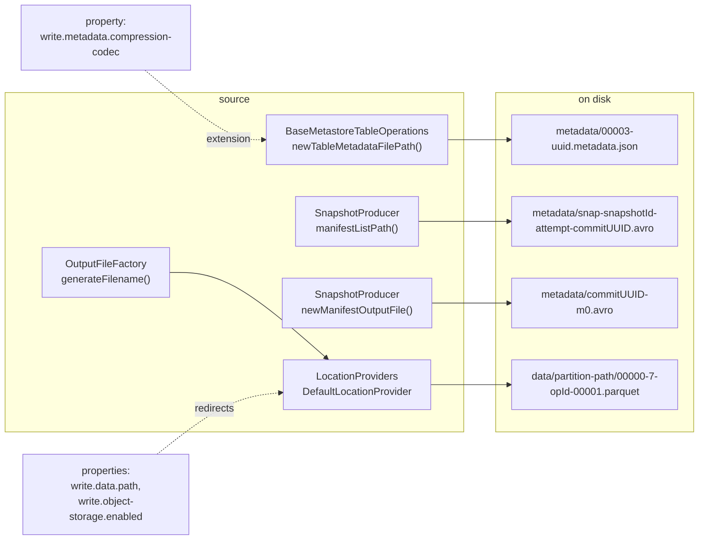
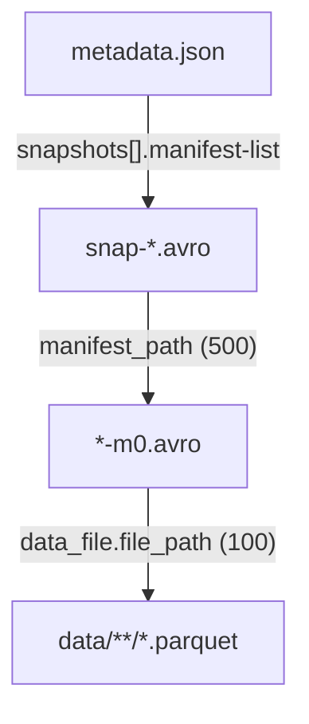

# Chapter 2.1 — Anatomy of a table directory after a real write

<div class="chapter-meta" markdown>
**The question this chapter answers:** given a table directory full of machine-generated file names, which line of Iceberg source produced each name, and what can you infer from a name without opening the file?

**Prerequisites:** none beyond having written to an Iceberg table once.

**Source covered:** `core/.../BaseMetastoreTableOperations.java`, `core/.../SnapshotProducer.java`, `core/.../io/OutputFileFactory.java`, `core/.../LocationProviders.java`
</div>

## 1. The problem

Listing an Iceberg table for the first time produces something like this:

```
metadata/00003-9c12d441-03fe-4693-9a96-a0705ddf69c1.metadata.json
metadata/snap-3055729675574597004-1-f5a8b3c1-….avro
metadata/f5a8b3c1-…-m0.avro
data/dept=eng/00000-7-b71e9d02-…-00001.parquet
```

Only the first three lines share a UUID with each other: `f5a8b3c1` is the commit UUID, and the data file's `b71e9d02` is an unrelated *operation* ID minted by the writing engine. Section 6 says why they cannot be the same value.

None of that is a convention someone wrote down in a style guide. Every one of those names is a `String.format` call in the source, and each format string was chosen to solve a specific problem: ordering without a catalog round-trip, uniqueness under object-store negative caching, attributing a file to the commit that wrote it, and telling a catalog's files apart from another catalog's.

That matters more than it sounds. Iceberg's correctness rests on the catalog, not on the file system — but its *operational* tooling (orphan cleanup, migration, forensic recovery after a bad commit) rests almost entirely on file names. When a commit ends in an unknown state and deletes nothing, the names are what an operator has left to work with.

It is worth naming the absence first. Nothing in the directory says *which* `metadata.json` is current. That single pointer lives in the catalog — a row in a metastore, a key in a JDBC table, a Nessie reference — and swapping it is the commit (Chapter 3.4). Everything on disk is append-only history around that one mutable pointer. Which is exactly why the version counter in the file name matters: it is the only ordering signal a reader has when the catalog is unavailable, and the only one a migration tool has when the catalog is being replaced.

So this chapter reads the four naming functions and the one pluggable placement strategy, and asks what each field in each name is for.

## 2. Which code names which file



Two things are already visible. First, `metadata/` is a **flat namespace holding three unrelated file species** — table metadata, manifest lists, manifests — distinguished only by their name shape. Second, only the data path is configurable; the three metadata names are hardcoded format strings.

The reference chain those files form is the subject of the next four chapters:



The numbers in parentheses are Avro field IDs. They are stable across every format version, and Chapters 2.3 and 2.4 spend their time inside those two boxes.

## 3. `metadata.json`: a counter and a UUID



`%05d-%s%s` — a zero-padded version counter, a fresh UUID, and a codec-dependent extension.

The counter is the obvious part: it makes `ls` sort correctly and lets a human say "we are on metadata version 3". The UUID is the interesting part, and the caller explains it. `writeNewMetadata` — the two-line method that calls this one, injected in full in Chapter 1.2 §9 — writes through `TableMetadataParser.overwrite` under the comment *"use overwrite to avoid negative caching in S3. this is safe because the metadata location is always unique because it includes a UUID."*

An object store that has served a 404 for a key may keep serving it for a while after the key exists. A name derived only from the version counter would be *reused* across a failed and a retried attempt, and the retry could write to a path the store still believes is absent. The UUID guarantees a name no attempt has ever asked for.

The extension is the third field, and it is assembled the way round that surprises people. `TableMetadataParser.getFileExtension` returns `codec.extension + ".metadata.json"`, so gzipped metadata is `00003-<uuid>.gz.metadata.json`, not `…metadata.json.gz`. The old ordering exists too — `getOldFileExtension` still produces it, and `Codec.fromFileName` accepts both — because files written by older versions are still out there.

The counter is not write-only. It gets parsed back:



Read the javadoc's second sentence: `-1` is returned *"as a sign that the metadata is not part of this catalog"*. `HadoopTableOperations` names its files `v7.metadata.json`; a metastore-backed catalog names them `00007-<uuid>.metadata.json`. The name is how one tells the other's files apart. That is a load-bearing role for a string.

Every one of these files is kept. Two properties govern that: `write.metadata.previous-versions-max` bounds how many entries the `metadata-log` array inside the current file retains (default `100`), and `write.metadata.delete-after-commit.enabled` decides whether the files that fall off the end are actually deleted — and it defaults to **`false`**. A long-lived table therefore accumulates one `*.metadata.json` per commit indefinitely by default, most of them no longer listed anywhere.

Which 100 it keeps is worth being exact about, because it is the opposite of what "previous versions" suggests. `addPreviousFile` computes `removeIndex = previousFiles.size() - maxSize + 1` and keeps `subList(removeIndex, size)` — the **most recent** hundred, dropping from the front. The oldest roots are the ones that stop being listed, which is also why the metadata log is no help at all in finding the file a table started life at. Chapter 2.2 shows where the array sits in the document; the entries trimmed out of it are reachable only by listing the directory.

## 4. The manifest list: a snapshot ID and an attempt counter



`snap-%d-%d-%s` plus `.avro`: snapshot ID, **attempt number**, commit UUID.

The middle field is the one to stop on. `attempt.incrementAndGet()` is evaluated every time this method is called, and this method is called once per pass through the commit retry loop. A commit that lost three races and won on the fourth wrote four manifest lists, named `…-1-…`, `…-2-…`, `…-3-…`, `…-4-…`, of which exactly one is referenced by the snapshot that landed. Chapter 3.3 covers why the retry cannot reuse the previous attempt's work, and how the losers are cleaned up.

Consequence for anyone staring at a directory: **`snap-*` files are not all live**, and the ones that are not live are not necessarily garbage either — see the gotchas.

The first field is more useful than it looks. The snapshot ID is in the file name, so a `snap-*` file can be matched against `metadata.json`'s `snapshots[].snapshot-id` without opening either — enough to answer "is this manifest list referenced?" from a directory listing plus one JSON parse. That is the cheapest reachability check available, and it is why the ID is in the name at all: the file's own Avro key-value metadata already carries `snapshot-id`, so putting it in the name buys nothing except the ability to avoid reading the file.

## 5. Manifests: one prefix per commit



`commitUUID + "-m" + manifestCount.getAndIncrement()`.

Note what is *shared*: `commitUUID` is a field of the `SnapshotProducer`, generated once per operation, and it also appears in every manifest list name from section 4. So every metadata file a single commit attempt produced carries the same UUID in its name. That is what makes "which files did this commit write?" answerable with a prefix match rather than by parsing Avro — the property orphan-file cleanup and post-mortem forensics both lean on.

The counter after `-m` is per producer, not per table. Two concurrent commits both write `…-m0.avro`; their UUIDs keep them apart.

What the manifest name deliberately does *not* encode is the snapshot that wrote it. It cannot: a manifest is frequently written by one commit and then referenced, unchanged, by every subsequent snapshot until something rewrites it. Ownership of a manifest is a property of the manifest list rows that point at it (`added_snapshot_id`, field 503 — Chapter 2.3), not of the file. The commit UUID says "this attempt produced this file"; it says nothing about how long the file stays live.

## 6. Data files: written by one factory, placed by another

Data file names come from `OutputFileFactory`:



`%05d-%d-%s-%05d%s` — partition ID, task ID, operation ID, a per-factory file counter, and a fifth conversion that is either empty or `"-" + suffix`. This is the engine's identity, not the table's: in Spark those first two are the partition and task IDs of the writing job, which is precisely what makes the name unique across executors without any coordination. The optional suffix is how compaction and other rewrites tag their output.

Where that name lands is a separate decision:



`<dataLocation>/<spec.partitionToPath(partition)>/<filename>`, where `dataLocation` is `write.data.path` if set and `<table>/data` otherwise.

The method looks like it has a third source — a second lookup for the legacy `write.folder-storage.path` sits between the two — but that branch cannot execute. `WRITE_FOLDER_STORAGE_LOCATION` is a member of `DEPRECATED_PROPERTIES`, and every lookup goes through `getAndCheckLegacyLocation`, which throws `IllegalArgumentException` — *"has been deprecated and will be removed in 2.0.0, use 'write.data.location' instead"* — the moment a deprecated key has a value. So the call returns `null` or throws; the assignment beneath it is dead code. Setting the old property is a hard failure at table load, not a second placement source. (`ObjectStoreLocationProvider` has the same shape with *two* dead lookups, `write.object-storage.path` and the folder-storage one.)

`DefaultLocationProvider` is one of three options — `write.location-provider.impl` replaces the whole thing with user code, and `ObjectStoreLocationProvider`, selected by `write.object-storage.enabled`, prefixes a hash computed from the file name so that keys spread across an object store's partitions instead of clustering under one path.

What that provider does with the partition path is the part worth getting right, because the answer changed and the old answer is still widely repeated. `WRITE_OBJECT_STORE_PARTITIONED_PATHS_DEFAULT` is **`true`**, so by default `newDataLocation(spec, partitionData, filename)` builds `partitionPath/filename` and hands it to the single-argument overload, which prepends the hash as a directory — the upstream comment says *"if partition paths are included, add last part of entropy as dir before partition names"*. The default output is `<storage>/<hash>/dept=eng/<file>`: entropy *and* readable partition directories. Only `write.object-storage.partitioned-paths=false` drops them, and then the hash is joined to the file name with a hyphen rather than a slash: `<storage>/<hash>-<file>`.

So the `data/` directory and the `dept=eng/` path components are *defaults*, not spec. The manifest's `file_path` field is the only authority on where a data file is.

The partition path is worth one more sentence, because it is the most misread part of the layout. `spec.partitionToPath(partitionData)` renders the *partition tuple of the spec that wrote the file*, not the table's current spec. After a partition-spec evolution, files written under the old spec keep their old directory shape forever, and the two shapes coexist under `data/`. Hive-style directory parsing therefore cannot reconstruct partition values reliably; the manifest's `partition` struct, tagged with its `partition_spec_id`, can.

## 7. Gotchas

!!! warning "The UUID in `metadata.json` is not decoration"
    It defends against object-store negative caching, and the upstream comment says so: *"use overwrite to avoid negative caching in S3. this is safe because the metadata location is always unique because it includes a UUID."* Tooling that reconstructs a metadata file name from the version counter alone will eventually write to a path a store still believes is absent.

!!! warning "`metadata/` accumulates manifest lists that nothing references"
    Every retry writes its own `snap-*-<attempt>-*.avro`. The winner's is referenced; the losers' are deleted after a successful commit. But when a commit ends in `CommitStateUnknownException`, Iceberg deliberately deletes **nothing** — the commit may have succeeded and those files may now be live. Unreferenced `snap-*` files are therefore evidence of contention, not permission to delete. Route them through orphan-file cleanup, which checks reachability, never through `rm`.

!!! warning "The version counter can be a lie across a catalog migration"
    `parseVersion` returns `-1` when the leading token is not an integer, because a Hadoop-catalog table names its metadata `v7.metadata.json`. A table adopted from one catalog into another keeps its old file names, so both shapes can sit in the same directory. Sorting by name across that boundary produces a plausible, wrong history.

!!! warning "By default, no old `metadata.json` is ever deleted"
    `TableMetadata.Builder.addPreviousFile` trims the in-file `metadata-log` array to `write.metadata.previous-versions-max` (default `100`), but the *files* it drops are only deleted by `CatalogUtil.deleteRemovedMetadataFiles`, which is gated on `write.metadata.delete-after-commit.enabled` — default **`false`**. The comment there is explicit that the trimmed entries are the deletion candidates. On a table committing every minute, `metadata/` grows by a file a minute forever unless that property is turned on.

!!! note "`data/` is a property, not a spec requirement"
    `DefaultLocationProvider` only reaches `String.format("%s/data", tableLocation)` after two properties come back null, and with `write.object-storage.enabled` the path gains a hash directory ahead of the partition path — or loses the partition path entirely, if `write.object-storage.partitioned-paths` is turned off. A tool that finds data files by globbing `<table>/data/**` is guessing; the authoritative list is in the manifests.

## Key takeaways

- Every file name in an Iceberg table is a format string in the source, and each field in it encodes state a reader would otherwise have to open a file to learn.
- `metadata.json` is `%05d-<uuid>` — the counter for ordering and catalog attribution, the UUID because object stores negatively cache paths that once 404'd.
- The attempt counter in `snap-<id>-<attempt>-<uuid>.avro` means unreferenced manifest lists are normal after contention, and are not automatically safe to delete.
- Every metadata file one commit wrote shares that commit's UUID as a prefix, which is what makes commit-scoped cleanup a prefix match.
- Data file *names* come from the writing engine's partition and task IDs; data file *locations* come from a `LocationProvider` that table properties can redirect entirely.
- Nothing on disk says which `metadata.json` is current; that pointer is the catalog's, and everything in the directory is append-only history around it.

## Source map

| What | File |
| --- | --- |
| `metadata.json` naming, version parsing | [`core/.../BaseMetastoreTableOperations.java`](https://github.com/apache/iceberg/blob/apache-iceberg-1.11.0/core/src/main/java/org/apache/iceberg/BaseMetastoreTableOperations.java) |
| Manifest list and manifest naming | [`core/.../SnapshotProducer.java`](https://github.com/apache/iceberg/blob/apache-iceberg-1.11.0/core/src/main/java/org/apache/iceberg/SnapshotProducer.java) |
| Data file naming | [`core/.../io/OutputFileFactory.java`](https://github.com/apache/iceberg/blob/apache-iceberg-1.11.0/core/src/main/java/org/apache/iceberg/io/OutputFileFactory.java) |
| Data file placement | [`core/.../LocationProviders.java`](https://github.com/apache/iceberg/blob/apache-iceberg-1.11.0/core/src/main/java/org/apache/iceberg/LocationProviders.java) |
| Compression codec and extension | [`core/.../TableMetadataParser.java`](https://github.com/apache/iceberg/blob/apache-iceberg-1.11.0/core/src/main/java/org/apache/iceberg/TableMetadataParser.java) |
| The other naming scheme (`v7.metadata.json`) | [`core/.../hadoop/HadoopTableOperations.java`](https://github.com/apache/iceberg/blob/apache-iceberg-1.11.0/core/src/main/java/org/apache/iceberg/hadoop/HadoopTableOperations.java) |
| Old metadata retention and deletion | [`core/.../CatalogUtil.java`](https://github.com/apache/iceberg/blob/apache-iceberg-1.11.0/core/src/main/java/org/apache/iceberg/CatalogUtil.java) |
| Layout-affecting properties | [`core/.../TableProperties.java`](https://github.com/apache/iceberg/blob/apache-iceberg-1.11.0/core/src/main/java/org/apache/iceberg/TableProperties.java) |

**Next:** Chapter 2.2 opens the `metadata.json` this chapter named, and finds that its schema is not a document anywhere — it is the statement order of a single method.
