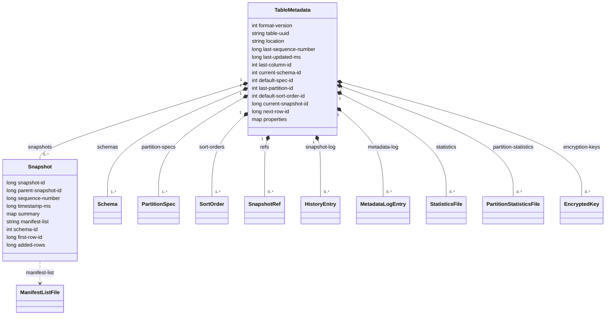

# Chapter 2.2 — `metadata.json`, field by field

<div class="chapter-meta" markdown>
**The question this chapter answers:** what is the complete, authoritative field set of `metadata.json` at this version, and which fields exist only because of the format version the table was written at?

**Prerequisites:** Chapter 2.1 (where this file lives and how it is named)

**Source covered:** `core/.../TableMetadataParser.java`, `core/.../TableMetadata.java`, `core/.../SnapshotParser.java`
</div>

## 1. The problem

There is no schema file for `metadata.json`. No JSON Schema, no `.avsc`, no generated model class. The Iceberg specification describes the document in prose, and the prose is normative — but the *implementation's* definition of the field set is a single Java file, and where the two ever diverge, the file is what your reader actually parsed.

That makes `TableMetadataParser` unusually good evidence. A pasted example document shows you one table's fields; the parser shows you the whole possible field set, in the order it is written, with every version branch made explicit. It also shows something an example never can: the places where the reader is deliberately **more permissive** than the writer, which is where all the interesting compatibility history is buried.

This chapter reads the writer and the reader side by side, and checks both against one real metadata file committed upstream as a test fixture — the same file, in three passes, from its opening brace to its last array.

## 2. The shape of the document



`last-sequence-number` exists only from v2; `next-row-id` and the snapshot's `first-row-id` / `added-rows` only from v3. Everything else has been there since v1 in some form.

Note what is missing. There is no file list, no row count, no column statistic. **Every array in this document is bounded by schema evolutions, spec evolutions or commits — never by data volume.** That is the property that keeps a commit cheap: rewriting `metadata.json` on every write is only tolerable because its size is independent of how much data the table holds. The moment you want file-level information, you follow `snapshots[].manifest-list` out of this document, which is Chapter 2.3.

## 3. One file, from the top

Definitions are stronger evidence than examples, for the reason section 1 gave. But a definition has to be checkable against something, and Iceberg commits real `metadata.json` documents to `core/src/test/resources` as parser fixtures. One of them, `TableMetadataV2Valid.json`, carries every top-level field the diagram above names. This chapter walks that one file, in three passes, beside the code that writes it and the code that reads it.



Seven scalar fields, then an array. `format-version` is `2`, so `last-sequence-number` is present and `next-row-id` is absent — the first exists from v2, the second from v3, and section 5 has the two branches that decide it. `current-schema-id` is `1` while the `schemas` array holds entries with `schema-id` `0` and `1`: this table has evolved its schema once, and the pointer names the second one. Section 7 shows the reader validating that pointer rather than trusting it.

The second schema carries `identifier-field-ids` and the first does not. Fields arrive; they do not have to arrive everywhere.

One caveat holds for the whole walk. These fixtures are hand-written for tests, so what they demonstrate is what the *reader* accepts, not what `toJson` emits. A sibling file makes the gap visible: `TableMetadataV3ValidMinimal.json` puts `next-row-id` on line 8, ahead of `current-schema-id`, where the writer emits it some forty statements later, after `properties` and `current-snapshot-id`. Both parse, because the reader is a Jackson object lookup and does not care about order at all. Section 5's claim is about files this code *writes*, and the fixtures leave it standing.

## 4. The field set



Twenty-nine lines: twenty-eight `static final String`s that are the entire vocabulary, and one `static final int` that is not a key at all. Every key that can appear in a `metadata.json` written by this version is one of those strings, and the comment above them — `// visible for testing` — is a fair description of the situation: these are package-private constants, not a published model.

Two of the keys are worth flagging now. `NEXT_ROW_ID = "next-row-id"` is the newest field in the document and belongs entirely to v3 row lineage (Chapter 2.5). `ENCRYPTION_KEYS` is the other recent arrival. The odd constant on the last line, `MIN_NULL_CURRENT_SNAPSHOT_VERSION`, is filed here because it governs how one of these keys is *encoded* rather than whether it appears — section 6.

## 5. `toJson`: order is statement order



Two structural facts fall out immediately.

**The field order of a real `metadata.json` is the statement order of this method.** Jackson writes keys as they are generated. So `format-version` first, `table-uuid`, `location`, then the version-conditional `last-sequence-number`, and so on. If you have ever wondered why every Iceberg metadata file you have opened has the same field order regardless of who wrote it — this is why.

**There are five version branches in these sixty-seven lines, and they point in three different directions.**

The *forward* pair is the easy one: `if (metadata.formatVersion() > 1)` writes `last-sequence-number`, and `if (metadata.formatVersion() >= 3)` writes `next-row-id`. New version, new field.

The *backward* pair is more interesting, and both carry a comment:

```java
// for older readers, continue writing the current schema as "schema".
// this is only needed for v1 because support for schemas and current-schema-id is required in
// v2 and later.
if (metadata.formatVersion() == 1) {
  generator.writeFieldName(SCHEMA);
  SchemaParser.toJson(metadata.schema(), generator);
}
```

A v1 table gets its current schema written **twice** — once as `schema`, once inside the `schemas` array — and its default spec written twice, as `partition-spec` and inside `partition-specs`. This is not redundancy for its own sake; it is a deliberate concession to readers that predate multi-schema support. The cost is that a v1 metadata file has two sources of truth for the same information, and a tool that edits one without the other produces a file two readers disagree about.

The middle of the document is where that order is easiest to check. Continuing the file from section 3:



`default-spec-id`, `partition-specs`, `last-partition-id`, `default-sort-order-id`, `sort-orders`, `properties` — six keys in the order the statements above emit them. Note what is *absent*: no `partition-spec` and no `schema` beside the plural forms, because this is a v2 file and the duplication is written only at v1. `properties` is `{}`, which is the only field in the document a user populates directly and the common case for a new table.

The fifth branch is neither forward nor backward. It does not decide whether a field appears — it decides how an unchanged field is *spelled*, and it is the next section.

## 6. `current-snapshot-id` changes representation at v3

The block just before `next-row-id` is the sharpest illustration of the whole compatibility problem:

```java
if (metadata.currentSnapshot() != null) {
  generator.writeNumberField(CURRENT_SNAPSHOT_ID, metadata.currentSnapshot().snapshotId());
} else {
  if (metadata.formatVersion() >= MIN_NULL_CURRENT_SNAPSHOT_VERSION) {
    generator.writeNullField(CURRENT_SNAPSHOT_ID);
  } else {
    generator.writeNumberField(CURRENT_SNAPSHOT_ID, -1L);
  }
}
```

An empty table — no snapshots yet, or all of them expired — has to encode "there is no current snapshot". Before v3 that encoding was the sentinel `-1`, because the field was typed as a number and older readers cannot parse `null` into a `long`. From v3 it is a proper `null`.

Both encodings mean exactly the same thing, both are in the wild, and each one breaks code written against the other. `currentSnapshotId == -1` silently stops detecting empty tables at v3; `currentSnapshotId == null` never fires at v2. This is the single most common way a third-party `metadata.json` reader is subtly wrong.

## 7. `fromJson`: where the reader is stricter, and where it is not



Immediately after the object check it reads `format-version`, and the statement after that is the version ceiling:

```java
int formatVersion = JsonUtil.getInt(FORMAT_VERSION, node);
Preconditions.checkArgument(
    formatVersion <= TableMetadata.SUPPORTED_TABLE_FORMAT_VERSION,
    "Cannot read unsupported version %s",
    formatVersion);
```

At this tag `SUPPORTED_TABLE_FORMAT_VERSION` is **4**, while `DEFAULT_TABLE_FORMAT_VERSION` — the version a new table gets when nothing asks otherwise — is **2**. The parser will happily read a v4 file it would never have chosen to write. That gap is normal in Iceberg: version support lands in the reader well before it becomes a default, and well before the feature set is finished (Chapter 2.5 checks how finished v4 actually is).

Then the reader inverts the writer's backward-compatibility branches into *requirements*:

```java
} else {
  Preconditions.checkArgument(
      formatVersion == 1, "%s must exist in format v%s", SCHEMAS, formatVersion);

  schema = SchemaParser.fromJson(JsonUtil.get(SCHEMA, node));
  currentSchemaId = schema.schemaId();
  schemas = ImmutableList.of(schema);
}
```

`schemas` missing is legal in v1 and rejected in v2 and above. The same pattern repeats for `partition-specs`, `last-partition-id` and `sort-orders`, each with the identical error message. Note also the asymmetry with `last-sequence-number`: the reader does not require it in v1, it *defaults* it to `TableMetadata.INITIAL_SEQUENCE_NUMBER`. Absent-and-defaulted, absent-and-fatal, and present-but-duplicated all coexist in one parser, and which you get depends only on `format-version`.

One more detail, easy to read past: when the `schemas` array is present, the reader requires that some element in it has `schema-id == current-schema-id`, and fails with `"Cannot find schema with %s=%s from %s"` if not. The pointer is validated on read, not assumed.

## 8. The rest of the document

Thirty-five lines close the file, and everything in them after the first key belongs to `SnapshotParser` rather than to `TableMetadataParser`:



Line 88 is `current-snapshot-id`, written by the branch in section 6 — here carrying a real snapshot ID rather than either of the two "empty" encodings, because this table has snapshots.

The omissions in the `snapshots` array are the informative part. The first snapshot has no `parent-snapshot-id` (it is the root) and no `schema-id` (it predates schema tracking on snapshots); the second has both, and its `schema-id` is `1` — the second of the two schemas from section 3. `sequence-number` is `0` on the first and `1` on the second: this is the counter Chapter 2.5 shows arriving in v2 and becoming the ordering key for delete files.

`snapshot-log` repeats both snapshot IDs with their timestamps, in the order they became current. `metadata-log` is empty, because no commit ever wrote this file — Chapter 2.1 covers what fills that array and what trims it.

`manifest-list` is the pointer out of this document. Everything from Chapter 2.3 onward hangs off that one string.

## 9. Gotchas

!!! warning "A v1 table's `schema` and `partition-spec` are duplicates, and both are written"
    The writer emits `schema` *and* `schemas`, `partition-spec` *and* `partition-specs`, for v1 only, with the comment: *"for older readers, continue writing the current schema as `schema`. this is only needed for v1 because support for schemas and current-schema-id is required in v2 and later."* Hand-editing one and not the other produces a valid-looking file that two readers disagree about.

!!! warning "`current-snapshot-id` means "empty" two different ways"
    `-1` below v3, `null` from v3. `MIN_NULL_CURRENT_SNAPSHOT_VERSION = 3` is the constant. Any check for an empty table must handle both, and the failure mode is silence, not an exception.

!!! warning "The parser accepts a higher format version than it defaults to writing"
    `SUPPORTED_TABLE_FORMAT_VERSION` is 4; `DEFAULT_TABLE_FORMAT_VERSION` is 2. "This version can read v4" and "v4 is ready" are different claims, and only the first is made by the code here.

!!! note "`.gz` goes before `.metadata.json`, not after"
    `getFileExtension` returns `codec.extension + ".metadata.json"`, so compressed metadata is `00003-<uuid>.gz.metadata.json`. `getOldFileExtension` still produces the historical `.metadata.json.gz` ordering and `Codec.fromFileName` accepts both, so detection by suffix must handle both shapes.

## Key takeaways

- `metadata.json` has no schema file; `TableMetadataParser`'s constants are the field set and `toJson`'s statement order is the field order.
- One committed fixture, `TableMetadataV2Valid.json`, carries all eighteen top-level fields — two schemas, a spec, sort orders, two snapshots and a snapshot log — and sections 3, 5 and 8 walk it end to end. What a fixture proves is what the *reader* accepts; the writer's order is a separate claim, made by `toJson` alone.
- Version branching runs in two directions: forward for new fields (`last-sequence-number`, `next-row-id`), backward for duplicated fields written only so older readers can still parse v1.
- The reader is deliberately asymmetric — absent `last-sequence-number` is defaulted in v1, absent `schemas` is fatal in v2+ — and every asymmetry is a compatibility decision, not an oversight.
- `current-snapshot-id` encodes "no snapshot" as `-1` before v3 and `null` from v3; both are live and each breaks code written for the other.
- No array in this document scales with data volume, which is the entire reason a commit can afford to rewrite the whole file.

## Source map

| What | File |
| --- | --- |
| The field set, writer and reader | [`core/.../TableMetadataParser.java`](https://github.com/apache/iceberg/blob/apache-iceberg-1.11.0/core/src/main/java/org/apache/iceberg/TableMetadataParser.java) |
| Version constants, in-memory model | [`core/.../TableMetadata.java`](https://github.com/apache/iceberg/blob/apache-iceberg-1.11.0/core/src/main/java/org/apache/iceberg/TableMetadata.java) |
| Snapshot serialization | [`core/.../SnapshotParser.java`](https://github.com/apache/iceberg/blob/apache-iceberg-1.11.0/core/src/main/java/org/apache/iceberg/SnapshotParser.java) |
| Ref serialization | [`core/.../SnapshotRefParser.java`](https://github.com/apache/iceberg/blob/apache-iceberg-1.11.0/core/src/main/java/org/apache/iceberg/SnapshotRefParser.java) |
| Schema and spec serialization | [`core/.../SchemaParser.java`](https://github.com/apache/iceberg/blob/apache-iceberg-1.11.0/core/src/main/java/org/apache/iceberg/SchemaParser.java), [`PartitionSpecParser.java`](https://github.com/apache/iceberg/blob/apache-iceberg-1.11.0/core/src/main/java/org/apache/iceberg/PartitionSpecParser.java) |
| The fixture walked in sections 3, 5 and 8 | [`core/src/test/resources/TableMetadataV2Valid.json`](https://github.com/apache/iceberg/blob/apache-iceberg-1.11.0/core/src/test/resources/TableMetadataV2Valid.json) — 122 lines, all eighteen top-level fields |
| Other committed fixtures | [`core/src/test/resources/`](https://github.com/apache/iceberg/tree/apache-iceberg-1.11.0/core/src/test/resources) — `TableMetadataV1Valid.json`, `TableMetadataV2Valid.json`, `TableMetadataV2ValidMinimal.json`, `TableMetadataV3ValidMinimal.json` |

**Next:** Chapter 2.3 follows `snapshots[].manifest-list` into the `snap-*.avro` file, where the fields stop describing the table and start describing how to avoid reading it.
