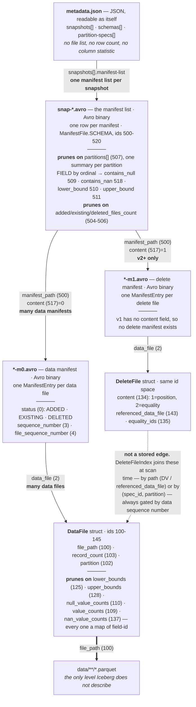
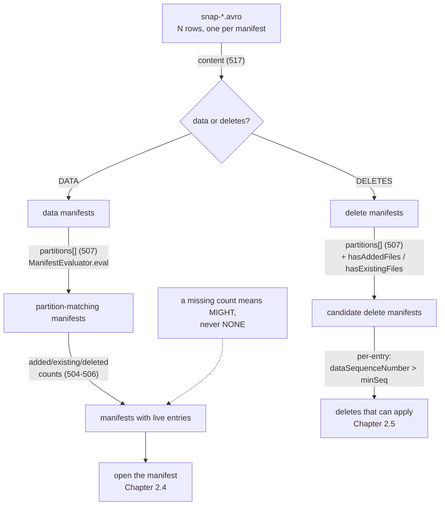

# Chapter 2.3 — The manifest list: snapshot-level pruning data

<div class="chapter-meta" markdown>
**The question this chapter answers:** what is stored per manifest in a `snap-*.avro` file, and how much of a query can be eliminated without opening a single manifest?

**Prerequisites:** Chapter 2.1 (the `snap-*.avro` name), Chapter 2.2 (`snapshots[].manifest-list`)

**Source covered:** `api/.../ManifestFile.java`, `core/.../ManifestWriter.java`, `core/.../PartitionSummary.java`, `api/.../expressions/ManifestEvaluator.java`, `core/.../ManifestGroup.java`, `core/.../V3Metadata.java`
</div>

## 1. The problem

A snapshot has to answer "which files are in the table?" — and it has to answer it without reading them all. On a table with a hundred thousand data files spread over a thousand manifests, a planner that opens every manifest has already lost, regardless of how good the per-file statistics inside them are.

So Iceberg puts a layer of summary above the manifests: one Avro file per snapshot, one row per manifest. That file is the manifest list, and every one of its sixteen fields exists for the same reason — to let a planner decide *not* to open something.

The name undersells it. A manifest list is not a list of manifests; it is an **index of indexes**, and it prunes along three independent axes, only one of which is partition data:

- **partition bounds** — this manifest holds no file whose partition could match the predicate;
- **entry counts** — this manifest holds no live entries at all;
- **content and sequence numbers** — this manifest holds deletes, not data, and its deletes are ordered against the data.

This chapter reads the row definition, the code that fills it in, and the two consumers that use it to skip work.

## 2. The shape, and the funnel that walks it

Chapter 2.2 could show you a `metadata.json`, because it is JSON and upstream commits real ones as test fixtures. This chapter cannot return the favour. A manifest list is **Avro binary**, and so is every manifest it points at, so for this layer of the format a diagram is not the better representation — it is the only one there is.



Three things in that picture are worth fixing before anything else.

**The fan-out is the point.** One manifest list per snapshot, many manifests per list, many files per manifest. Chapter 2.1's reference chain drew the same four levels one-to-one, because its question was which field names which file; this is the same skeleton carrying its cardinalities and its payload.

**The two `prunes on` bands are the whole read path.** Chapter 4.2 works at the manifest-list band, on `partitions[]` and the counts; Chapter 4.3 works one level down, on `lower_bounds` and `upper_bounds`. A scan is a walk down this tree discarding subtrees, and those two bands are where the discarding happens.

**The dashed edge is not a caveat, it is a claim.** Nothing in the format points from a delete file to the data file it applies to — `referenced_data_file` (143) is a *string*, not a traversable edge. `DeleteFileIndex` computes the attachment at scan time through five differently-keyed lookups: by path for a DV and for path-scoped position deletes, by `(spec_id, partition)` for partition-scoped position and equality deletes, and table-wide for unpartitioned equality deletes — every one of them filtered on the data sequence number. Drawn solid, that edge would be a fabrication, and a structural diagram is the worst place to hide one: it looks like it is merely reporting shape, so nobody thinks to doubt it.

`min_sequence_number` (516) is deliberately absent from both pruning bands. Section 8 is about why.

That is the shape. The order the filters run in is a different question, and it is the funnel:



Four filters, three of them answered entirely from the manifest list row. The fourth — the sequence-number comparison on delete files — is the one that is *not* done from the row, and section 8 explains why that is worth knowing.

## 3. The row



Sixteen fields, IDs 500 through 520, each with a doc string that is part of the written Avro schema. This declaration is the spec: there is no separate `.avsc`, and `ManifestFile.SCHEMA` at the bottom is what a reader binds against.

Group them by job:

| Job | Fields |
| --- | --- |
| Locate the manifest | `manifest_path` (500), `manifest_length` (501), `key_metadata` (519) |
| Interpret the manifest | `partition_spec_id` (502), `content` (517) |
| Attribute it | `added_snapshot_id` (503), `sequence_number` (515), `min_sequence_number` (516) |
| Prune by partition | `partitions` (507), with nested 508–511 and 518 |
| Prune by liveness | `added_files_count` (504), `existing_files_count` (505), `deleted_files_count` (506) and their `_rows_` counterparts (512–514) |
| Row lineage | `first_row_id` (520) — v3, Chapter 2.5 |

`partition_spec_id` is required, and it is required for a specific reason: a table that has evolved its partitioning holds manifests written under several specs at once. Nothing about the partition summaries is interpretable without knowing which spec produced them.

## 4. Where the numbers come from

Nothing recomputes these fields later. They are accumulated as the manifest is written, one entry at a time:



The switch on `entry.status()` is the whole counting scheme: `ADDED`, `EXISTING` and `DELETED` each bump a file counter and a row counter. `stats.update(...)` folds the partition tuple into the summaries. And `minDataSequenceNumber` tracks the lowest data sequence number among **live** entries only — `entry.isLive()` guards it, so a deleted file's sequence number never lowers the manifest's floor.

Then the row is emitted:



Two details repay attention.

`UNASSIGNED_SEQ` is passed as the manifest's own `sequence_number`, and as `min_sequence_number` too when no live entry carried one. The comment says why:

> *if the minSequenceNumber is null, then no manifests with a sequence number have been written, so the min data sequence number is the one that will be assigned when this is committed. pass UNASSIGNED_SEQ to inherit it.*

Sequence numbers are not known until the commit succeeds — the writer does not know which sequence number it will win. Inheritance, signalled by a sentinel, is how the value gets filled in at commit time. Chapter 2.4 shows the same mechanism one level down, on manifest entries.

The second detail: `Preconditions.checkState(closed, "Cannot build ManifestFile, writer is not closed")`. The counts are only correct once every entry has gone through `addEntry`, so the row cannot be built early.

The consequence of accumulate-once is worth stating plainly: **these fields are asserted, never verified.** A manifest whose counts are wrong will be trusted, and will silently produce wrong results. That is a design choice — checking them would mean reading the manifest, which defeats the point of the manifest list.

## 5. Partition summaries, per field, by ordinal



Four pieces of state per partition field: `containsNull`, `containsNaN`, `min`, `max`.

Read `update` carefully, because the ordering of its branches is the contract. A null value sets `containsNull` and **does not touch the bounds**. A NaN sets `containsNaN` and does not touch the bounds either. Only an ordinary value participates in min/max. So `lower_bound == null` does not mean "we did not compute it" — it means *no ordinary value was ever seen*, which is a much stronger statement, and section 6 depends on it being true.

The shape of the summary list is the thing readers most often get wrong. The javadoc on `partitions()` is unambiguous:

> *Each summary corresponds to a field in the manifest file's partition spec, by ordinal. For example, the partition spec [ ts_day=date(ts), type=identity(type) ] will have 2 summaries. The first summary is for the ts_day partition field and the second is for the type partition field.*

One summary per **partition field**, positionally — not per column, not per data file. Combined with the previous section: matching those summaries against the wrong spec produces silently wrong pruning, which is why `partition_spec_id` is a required field and why the consumers cache one evaluator per spec.

## 6. Proving a manifest cannot match



This class decides what *provably cannot* match rather than what does, and every uncertain answer resolves to "might". **Chapter 4.2 owns that contract** — the two named constants, the javadoc's "if and only if", and what it costs the planner — because the evaluator belongs to the read path and is read there against a whole scan. What this chapter needs from it is narrower and is about the *row*: whether the sixteen fields of section 3 are strong enough to support a proof at all.

They are, and one branch shows exactly where the strength comes from. Look at `lt`:

```java
ByteBuffer lowerBound = stats.get(pos).lowerBound();
if (lowerBound == null) {
  return ROWS_CANNOT_MATCH; // values are all null
}
```

A missing lower bound *excludes* the manifest. That looks like the opposite of the safe direction — until you recall section 5: `min` is only ever left null when no ordinary value was seen, so an absent bound is a proof that the partition column is entirely null (or entirely NaN), and `x < 5` cannot match a null. The soundness of this branch is a consequence of how `PartitionFieldStats.update` is written, and nothing else.

`notNaN` is the same argument in a subtler form. It excludes only when `containsNaN` is true, `containsNull` is false, **and** `lowerBound` is null — three conditions that together mean "every value here is NaN". Any one of them missing, and the answer is "might".

## 7. Pruning by counts, not just bounds

Partition bounds are the famous half. The other half runs in `ManifestGroup`:



Three filters chain. First the partition filter, with `evalCache` keyed by `partitionSpecId` — one `ManifestEvaluator` per spec, exactly as section 5 requires. Then two count-based filters, and the comments state the rule twice:

> *remove any manifests that don't have any existing or added files. if either the added or existing files count is missing, the manifest must be scanned.*

That is enforced in the API, not in the caller. `hasAddedFiles()` is a default method returning `addedFilesCount() == null || addedFilesCount() > 0`. Null means *might*, never *none* — the same safe-direction convention as the bounds, applied to a different field. A v1 manifest list, which may omit these counts entirely, therefore loses count-based pruning rather than losing correctness.

`ignoreDeleted` and `ignoreExisting` correspond to the two things a caller might be asking for. A normal scan wants live files, so it can skip a manifest with no `ADDED` and no `EXISTING` entries — one consisting entirely of `DELETED` tombstones. An incremental scan wants only what changed, so it can skip a manifest with nothing added and nothing deleted. Same three counts, two different questions.

Read `ignoreDeleted` as a statement about entry *status*, not about file content: it has nothing to do with delete-file manifests, which the funnel in section 2 separated two filters earlier on `content` (517). A manifest full of tombstones is a data manifest whose files have all been removed.

## 8. What is actually written

`ManifestFile.SCHEMA` is the *read* schema. It is not what a writer emits:



Same field list, but `content`, `sequence_number`, `min_sequence_number` and all six counts are wrapped in `asRequired()`. The API declares them optional so that a v1 manifest list — which has none of the first three and may omit the counts — still parses. The writers declare them required so that anything written at v2 or above is fully pruneable.

This split is a small piece of a bigger pattern: there is a `V1Metadata`, `V2Metadata`, `V3Metadata` and `V4Metadata`, each holding one static `MANIFEST_LIST_SCHEMA`, and `ManifestLists.write` switches on the format version to pick one. Chapter 2.5 turns those four declarations into a version table.

One honest note before leaving the row. `min_sequence_number` is documented as *"the lowest data sequence number of any live file in the manifest"*, and it is written faithfully — but at this tag, **core's scan planner does not read it**. There is no call to `ManifestFile.minSequenceNumber()` anywhere in `ManifestGroup`, `DeleteFileIndex`, `BaseDistributedDataScan` or `TableScan`. The filter that decides whether a delete can apply runs one level down and per *entry*, inside `DeleteFileIndex.loadDeleteFiles()` — `if (entry.dataSequenceNumber() > minSequenceNumber)`, where `minSequenceNumber` is the index builder's own floor, not the row's field. Chapter 4.1 injects that method in full.

The same builder carries a second method that looks like the same filter and is not:



It filters an already-materialised `Iterable<DeleteFile>`, not manifest entries, and `build()` picks between the two with `deleteFiles != null ? filterDeleteFiles() : loadDeleteFiles()`. `deleteFiles` is non-null only through `builderFor(Iterable<DeleteFile>)`, whose only non-test callers are Spark's `SparkDistributedDataScan`. Every core path — `ManifestGroup`, `BaseDistributedDataScan`, both `MergingSnapshotProducer` call sites — uses the `FileIO` plus `Iterable<ManifestFile>` builder and takes the other branch. Two methods, one comparison, and core runs the one that opens the manifests.

Where core *does* read the row's field is the commit path rather than the read path. `MergingSnapshotProducer.apply` maps `ManifestFile::minSequenceNumber` over the data manifests that survived filtering, discards `UNASSIGNED_SEQ`, reduces the rest to a minimum, and hands it to `dropDeleteFilesOlderThan` — which is how a commit drops delete files that can no longer match any surviving data file. `SnapshotProducer` copies the field forward whenever it rewrites a manifest. Chapter 5.2 reads that same number from the writer's side.

So the field is load-bearing, just not where a reader of this chapter would first look for it — and one prominent consumer discards it outright. Spark's `ManifestFileBean`, the serialisable row wrapper its rewrite actions pass through, has no `minSequenceNumber` field at all: `fromManifest` copies `content` and `sequenceNumber` and stops, and the accessor is overridden to `return 0;` in every one of the four Spark versions in the tree.

## 9. Gotchas

!!! warning "`partitions[]` is positional, per partition field — not per column"
    One summary per field in the manifest's own spec, matched by ordinal. A table with several live specs has manifest list rows whose `partitions` arrays mean different things, distinguished only by `partition_spec_id` (502). This is why `ManifestGroup` caches one `ManifestEvaluator` per spec ID rather than one per scan.

!!! warning "A null `lower_bound` means "all values null", not "unknown""
    `ManifestEvaluator.lt` returns `ROWS_CANNOT_MATCH` when `lowerBound == null`, and that is only sound because `PartitionFieldStats.update` sets min and max for every non-null, non-NaN value. A writer that omits partition bounds "to save space" produces manifests that Iceberg will silently skip.

!!! warning "Missing counts disable count pruning, deliberately"
    `hasAddedFiles()`, `hasExistingFiles()` and `hasDeletedFiles()` all return true when the count is null. The `ManifestGroup` comment states the rule outright: *"if either the added or existing files count is missing, the manifest must be scanned."*

!!! warning "The counts are asserted, never checked"
    They are accumulated in `addEntry` and frozen in `toManifestFile`. Nothing re-derives them from the manifest afterwards, because doing so would require reading the manifest. A tool that rewrites a manifest and copies the old row forward has produced a table that reads incorrectly, with no error anywhere.

!!! note "The write schema is stricter than the read schema"
    `ManifestFile.SCHEMA` marks `content`, both sequence numbers and all six counts optional; `V2Metadata`/`V3Metadata.MANIFEST_LIST_SCHEMA` mark them `asRequired()`. Permissive on read so v1 files still load; strict on write so new files are always fully pruneable.

## Key takeaways

- The manifest list is one Avro row per manifest, sixteen fields, all of which exist to let a planner avoid opening something.
- It prunes on three independent axes — partition bounds, entry counts, and content type — and only the first is what most people mean by "partition pruning".
- Summary fields are accumulated once in `ManifestWriter.addEntry` and frozen in `toManifestFile`; they are trusted on read and never re-derived.
- Every uncertain answer resolves to "might match": null counts mean *might*, and a null `lower_bound` means *all null* only because the writer guarantees it.
- `ManifestFile.SCHEMA` is the read schema; `V<N>Metadata.MANIFEST_LIST_SCHEMA` is what gets written, and the difference is which fields are required.

## Source map

| What | File |
| --- | --- |
| The manifest list row | [`api/.../ManifestFile.java`](https://github.com/apache/iceberg/blob/apache-iceberg-1.11.0/api/src/main/java/org/apache/iceberg/ManifestFile.java) |
| Written schemas, per version | [`core/.../V1Metadata.java`](https://github.com/apache/iceberg/blob/apache-iceberg-1.11.0/core/src/main/java/org/apache/iceberg/V1Metadata.java), [`V2Metadata.java`](https://github.com/apache/iceberg/blob/apache-iceberg-1.11.0/core/src/main/java/org/apache/iceberg/V2Metadata.java), [`V3Metadata.java`](https://github.com/apache/iceberg/blob/apache-iceberg-1.11.0/core/src/main/java/org/apache/iceberg/V3Metadata.java), [`V4Metadata.java`](https://github.com/apache/iceberg/blob/apache-iceberg-1.11.0/core/src/main/java/org/apache/iceberg/V4Metadata.java) |
| Producing the row | [`core/.../ManifestWriter.java`](https://github.com/apache/iceberg/blob/apache-iceberg-1.11.0/core/src/main/java/org/apache/iceberg/ManifestWriter.java), [`core/.../PartitionSummary.java`](https://github.com/apache/iceberg/blob/apache-iceberg-1.11.0/core/src/main/java/org/apache/iceberg/PartitionSummary.java) |
| Writing the list | [`core/.../ManifestListWriter.java`](https://github.com/apache/iceberg/blob/apache-iceberg-1.11.0/core/src/main/java/org/apache/iceberg/ManifestListWriter.java), [`core/.../ManifestLists.java`](https://github.com/apache/iceberg/blob/apache-iceberg-1.11.0/core/src/main/java/org/apache/iceberg/ManifestLists.java) |
| Consuming the row | [`api/.../expressions/ManifestEvaluator.java`](https://github.com/apache/iceberg/blob/apache-iceberg-1.11.0/api/src/main/java/org/apache/iceberg/expressions/ManifestEvaluator.java), [`core/.../ManifestGroup.java`](https://github.com/apache/iceberg/blob/apache-iceberg-1.11.0/core/src/main/java/org/apache/iceberg/ManifestGroup.java), [`core/.../DeleteFileIndex.java`](https://github.com/apache/iceberg/blob/apache-iceberg-1.11.0/core/src/main/java/org/apache/iceberg/DeleteFileIndex.java) |
| Exposed as a metadata table | [`core/.../ManifestsTable.java`](https://github.com/apache/iceberg/blob/apache-iceberg-1.11.0/core/src/main/java/org/apache/iceberg/ManifestsTable.java) |

**Next:** Chapter 2.4 opens one of the manifests this list points at, where the unit stops being "a manifest" and becomes "an assertion about one data file".
