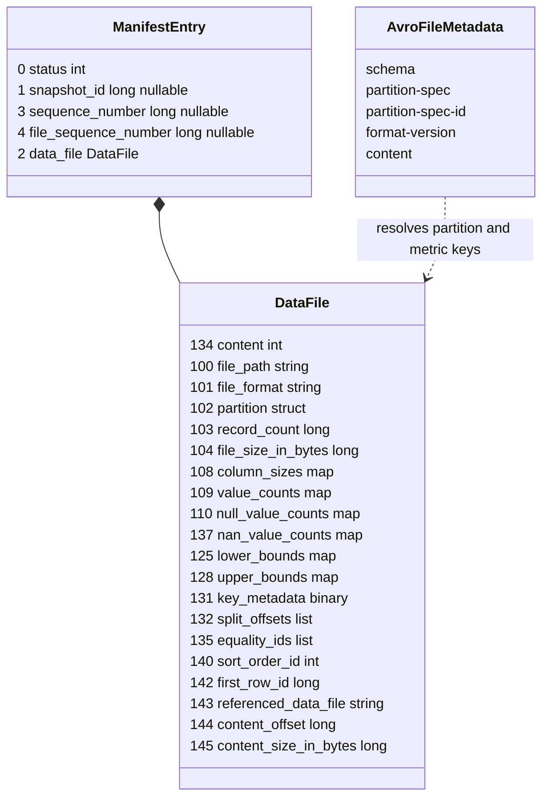

# Chapter 2.4 — The manifest file: data files, column metrics, field IDs

<div class="chapter-meta" markdown>
**The question this chapter answers:** what is stored about a single data file inside a manifest, and why is every column metric a map keyed by an integer instead of a column name?

**Prerequisites:** Chapter 2.3 (the manifest list row that points here, and `partition_spec_id`)

**Source covered:** `core/.../ManifestEntry.java`, `api/.../DataFile.java`, `core/.../MetricsConfig.java`, `core/.../ManifestReader.java`, `core/.../ManifestWriter.java`
</div>

## 1. The problem

A manifest is where the table stops being metadata and starts being an inventory. It is also the largest metadata structure by a wide margin: one row per data file, and each row carries up to six maps of per-column statistics. On a table with a hundred thousand files, this is where the bytes are.

Two design pressures shape it, and they pull against each other.

The first is **evolution**. A table's schema changes: columns are renamed, reordered, added, dropped. Manifests written years apart have to remain readable and — more demanding — their statistics have to remain *usable*. A `lower_bounds` entry recorded before a rename must still prune a predicate written after it.

The second is **size**. Statistics are the reason a manifest is worth reading, and also the reason it is expensive to read. A planner that needs only file paths should not pay for bounds.

Iceberg's answer to the first is field IDs everywhere: every metric map is keyed by schema field ID, never by name. Its answer to the second is that metrics are optional on both ends — configurable on write, projectable away on read. This chapter reads both.

## 2. One manifest row



The `DataFile` box lists twenty fields; the struct has twenty-one. The missing one is `spec_id` (141), left out here because it is never written into a manifest — the last gotcha in section 9 says why.

Three ID spaces coexist in that picture. The entry uses 0–4. The file struct uses 100–145. The metric maps have reserved IDs of their own for their keys and values — 117/118, 119/120, 121/122, 138/139, 126/127, 129/130 — because in Iceberg every element of every nested type needs an ID too.

And nothing in the row is interpretable on its own. The `partition` struct's shape and the meaning of every integer key in every metric map both come from the Avro file's key-value metadata, at the bottom of the diagram. A manifest is self-describing by design; that is what makes field-ID keys resolvable years later.

## 3. The entry: three bookkeeping fields around one struct



Five fields, wrapped into a schema by `wrapFileSchema` at the centre of the excerpt: `STATUS`, `SNAPSHOT_ID`, `SEQUENCE_NUMBER`, `FILE_SEQUENCE_NUMBER`, and the file struct at `DATA_FILE_ID = 2`. The IDs run 0–4 with a `// next ID to assign: 5` underneath, and the comment above the block explains the gap between this space and the file struct's: *"ids for data-file columns are assigned from 1000"*.

That comment is stale, and it is worth saying so rather than quietly repeating it. Data-file IDs start at **100**, not 1000 — section 4's field list shows it, and `DataFile.java` says it from the other side: *"IDs start at 100 to leave room for changes to ManifestEntry."* The intent survives the wrong number: the two ID spaces are deliberately far apart so the entry can grow without colliding with the file struct.

`status` is the whole delta mechanism, and the `Status` enum at the top of the excerpt is all of it: `EXISTING(0)`, `ADDED(1)`, `DELETED(2)`. A manifest is not a set of files. It is a set of **assertions about entries**, and the `isLive()` default method at the bottom is the two-line definition of what a scan should see — `ADDED` or `EXISTING`, nothing else.

A `DELETED` entry is a tombstone: the file is still described in full, so that expiry and orphan cleanup can find it, but no scan reads it. This is why the manifest list carries `deleted_files_count` at all — a manifest can consist entirely of tombstones.

The remaining three fields — `snapshot_id`, `sequence_number`, `file_sequence_number` — are all **optional**, and that is not a convenience. It is the inheritance mechanism from Chapter 2.3, one level down. A writer building a manifest does not know which snapshot ID or sequence number its commit will win, so it writes null and the reader fills the value in from the manifest list row.

The javadoc on the two sequence numbers is the clearest statement in the codebase of a distinction that confuses everyone:

> *[data sequence number] Independently of the entry status, this method represents the sequence number to which the file should apply. Note the data sequence number may differ from the sequence number of the snapshot in which the underlying file was added. New snapshots can add files that belong to older sequence numbers (e.g. compaction). The data sequence number also does not change when the file is marked as deleted.*

> *[file sequence number] The file sequence number represents the sequence number of the snapshot in which the underlying file was added. The file sequence number is always assigned at commit and cannot be provided explicitly, unlike the data sequence number. The file sequence number does not change upon assigning and must be preserved in existing and deleted entries.*

Read together: **the data sequence number says where the file belongs in the delete ordering; the file sequence number says when it physically arrived.** Compaction is the case that separates them — a rewritten file arrives now but must keep applying at its original position, or the deletes written against the pre-compaction data would start applying to it.

## 4. The `data_file` struct



Twenty `Types.NestedField` constants, IDs 100 through 145, plus `int PARTITION_ID = 102` — a bare id with no field, for reasons the end of this section gives — and a hand-maintained `// NEXT ID TO ASSIGN: 146` at the bottom. Counting the spliced-in `partition`, the struct has twenty-one fields. That comment is the allocator. Field IDs in this struct are a global, append-only namespace shared across every format version — which is why the numbers are not in order and never will be: `content` is 134 because it was added long after `file_path` was 100.

The last four are worth naming now, since they are the v3 story and Chapter 2.5 spends its time on them: `first_row_id` (142) is row lineage; `referenced_data_file` (143), `content_offset` (144) and `content_size_in_bytes` (145) are what turn a `DeleteFile` row into a deletion vector.

The canonical order — the order fields actually appear in Avro — is a separate declaration:



`content` first, then path and format, then `spec_id`, then `partition`. The partition is injected here rather than declared above, because its type is not fixed: `required(PARTITION_ID, PARTITION_NAME, partitionType, PARTITION_DOC)` takes the struct type of whichever spec wrote the manifest. That is the field the Avro metadata's `partition-spec` entry exists to describe.

## 5. Why the metrics are keyed by integers

Six of those twenty-one fields are maps:

```java
Types.NestedField LOWER_BOUNDS =
    optional(
        125,
        "lower_bounds",
        MapType.ofRequired(126, 127, IntegerType.get(), BinaryType.get()),
        "Map of column id to lower bound");
```

`map<int, binary>`, and the doc string says what the int is: *column id*. Not column name, not ordinal — the schema field ID.

That single choice is what makes Iceberg's schema evolution free. Renaming a column changes its name and nothing else; its field ID is stable, so every bound, null count and NaN count recorded against it in every manifest ever written remains valid and remains usable for pruning. Reordering columns is likewise a no-op for statistics.

The flip side is the failure mode. `DROP COLUMN x` followed by `ADD COLUMN x` produces a *new* field ID. The name is the same; the statistics are not inherited. Predicates on the new `x` will not prune against any file written before the re-add, and there is no warning — only a query that reads more than it should.

The values are `binary`, not typed: bounds are serialized with `Conversions.toByteBuffer` against the column's type, which means a reader that does not know the schema cannot interpret them. Again: the Avro file metadata is not optional context.

## 6. Which columns get metrics

Not all of them, and the default cutoff surprises people:



Four decisions, in the order the method applies them — and the order is the whole content, so **Chapter 5.1 §7 walks all four**, where the write path they belong to is being read. Two of them matter here, because they decide what a manifest ends up holding.

**The built-in default is `truncate(16)`** — bounds are stored, truncated to sixteen units. Enough to prune string prefixes and any fixed-width type, cheap enough to store per column per file. It is a *default*, not a floor: `write.metadata.metrics.default` replaces it, and that is the method's first branch.

**Above 100 columns, the inferred default becomes `None`.** `TypeUtil.getProjectedIds(schema).size()` is compared against `write.metadata.metrics.max-inferred-column-defaults` (default `100`); above it, only the first hundred projected IDs get the default mode and *"all other columns don't use metrics"*. Nested struct fields count toward that limit, so a schema with a few wide structs reaches it faster than its top-level column count suggests. Both numbers in this section are `static final` constants — `METRICS_MAX_INFERRED_COLUMN_DEFAULTS_DEFAULT` and `DEFAULT_WRITE_METRICS_MODE_DEFAULT` — injected in Chapter 2.1 §3.

That second rule is reached **only when `write.metadata.metrics.default` is unset** — a configured default short-circuits the width inference entirely and applies to every column. So there are two ways to get metrics on the 101st column of a wide table: name it in `write.metadata.metrics.column.*`, or set a default mode for the whole table.

## 7. Which metrics get read

The other end of the size problem is on the read path:



`STATS_COLUMNS` is the set `value_counts`, `null_value_counts`, `nan_value_counts`, `lower_bounds`, `upper_bounds`, `record_count`, and `dropStats` returns true — meaning the entry is copied *without* its stats, `e.file().copy(!dropStats)` — in exactly two cases: the projection intersects that set in nothing, or it intersects it in `record_count` alone.

Read the exception in the right direction, because it runs the opposite way to the obvious reading. Naming *any* stats column normally **protects** all of them from being dropped; the comment is explicit — *"We do not drop stats even if we had partially added some stats columns, except for record_count column."* `record_count` is carved **out** of that protection, and the second half of the comment says why: *"we don't want to keep stats map which could be huge in size just because we select record_count, which is a primitive type."* One cheap integer should not drag six maps along behind it.

`record_count` does survive a projection that omits it, but by a different route entirely: `ManifestReader.open()` adds `DataFile.RECORD_COUNT` back into the projection when it is not there (and `FIRST_ROW_ID` with it), because a scan task cannot be built without a row count.

There is a complementary branch, `requireStatsProjection`, which puts the stats columns *back* into a projection that omitted them. It belongs to the read path and Chapter 4.3 §6 reads it there, alongside the evaluator that needs them. The fact to carry out of this chapter is the one that makes both branches worth having: bounds are the biggest thing in a manifest, so a reader spends real effort deciding whether it can avoid deserializing them at all.

## 8. The container



Two things happen here, and both matter.

`Schema manifestSchema = V3Metadata.entrySchema(spec.partitionType())` picks the *write* schema for this format version, built from the partition type of this manifest's spec. As with the manifest list in Chapter 2.3, `ManifestEntry.getSchema` is the general read shape and `V<N>Metadata.entrySchema` is what a writer emits.

Then five Avro key-value metadata entries: `schema`, `partition-spec`, `partition-spec-id`, `format-version`, and `content`. That is the payload that makes everything above resolvable — the full table schema for interpreting metric field IDs and bound types, the spec for interpreting the `partition` struct, and `content` recording whether this manifest holds data or deletes, mirroring field 517 in the manifest list row.

`V3DeleteWriter` is a separate class beside this one, and diffing the two is the quickest way to see what a delete manifest is. There are four differences, not the two you would guess:

- the type parameter — `ManifestWriter<DeleteFile>` instead of `ManifestWriter<DataFile>`, repeated in `entryWrapper` and `prepare`;
- `.meta("content", "deletes")` instead of `"data"`;
- a `content()` override returning `ManifestContent.DELETES`, which `V3Writer` does not need because `DATA` is the default;
- and the constructor, which has **no `Long firstRowId` parameter at all** and passes `null` to `super` in its place.

That fourth one is load-bearing v3 behaviour rather than plumbing. `first_row_id` (142) is row lineage — section 4 flagged it as a v3 field — and a delete manifest is therefore guaranteed to have none. Rows are numbered; tombstones are not. Everything else in this chapter applies to both kinds of manifest unchanged.

## 9. Gotchas

!!! warning "Metric maps are keyed by field ID, so `DROP` + `ADD` of the same name orphans the statistics"
    Every metric map is `map<int, X>` over schema field IDs. Renaming preserves statistics; dropping and re-adding a column with the same name allocates a new field ID and starts from nothing. Predicates on it stop pruning against existing files, silently, until those files are rewritten.

!!! warning "The 101st column silently gets no metrics — unless a default mode is set"
    With `write.metadata.metrics.default` unset, `MetricsConfig.from` compares the schema's projected ID count against `write.metadata.metrics.max-inferred-column-defaults` (default `100`) and sets `defaultMode` to `None` above it. Nested fields count. The symptom is a filter that used to prune and stopped after a schema grew, with nothing logged. Setting a table-wide default mode skips the inference and this never fires.

!!! warning "A null `sequence_number` does not mean zero"
    Null means *inherit from the committing snapshot*, and the writer enforces that it may only appear on `ADDED` entries whose snapshot ID is null or matches the current commit — `"Only entries with status ADDED can have null sequence number"`. Reading a manifest outside `ManifestReader`, which applies the inheritance, yields entries whose sequence numbers are literally absent.

!!! warning "`data_file.spec_id` (141) is not written into manifests"
    It appears in `DataFile.getType()` but in neither `V2Metadata.fileType` nor `V3Metadata.fileType`. The partition spec is a property of the *manifest*, carried in the manifest list (`partition_spec_id`, 502) and in the Avro metadata. Field 141 exists so the metadata tables can flatten files from many specs into one relation.

!!! note "Dropping stats is a projection decision, not a storage decision"
    `dropStats` affects what a reader deserializes; the bytes are still in the manifest. A plan with a row filter gets the stats columns projected back in automatically, whether the caller listed them or not.

## Key takeaways

- A manifest row is `(status, snapshot_id, sequence_number, file_sequence_number, data_file)`: three inheritable bookkeeping fields wrapped around one struct.
- `status` makes a manifest a set of assertions rather than a set of files, and `DELETED` entries are retained in full so that cleanup can find them.
- Data sequence number is where a file belongs in the delete ordering; file sequence number is when it arrived. Compaction is what separates them.
- Every column metric is keyed by schema field ID, which is why renames are free and why a drop-then-re-add silently loses all statistics for that column.
- Metrics are optional on both ends: `MetricsConfig` decides what is written (default `truncate(16)`, first 100 columns), `dropStats` decides what is deserialized.
- A manifest is self-describing — schema, spec and format version live in the Avro file metadata, and nothing in the row can be interpreted without them.

## Source map

| What | File |
| --- | --- |
| The entry wrapper | [`core/.../ManifestEntry.java`](https://github.com/apache/iceberg/blob/apache-iceberg-1.11.0/core/src/main/java/org/apache/iceberg/ManifestEntry.java) |
| The `data_file` struct | [`api/.../DataFile.java`](https://github.com/apache/iceberg/blob/apache-iceberg-1.11.0/api/src/main/java/org/apache/iceberg/DataFile.java), [`api/.../ContentFile.java`](https://github.com/apache/iceberg/blob/apache-iceberg-1.11.0/api/src/main/java/org/apache/iceberg/ContentFile.java), [`api/.../DeleteFile.java`](https://github.com/apache/iceberg/blob/apache-iceberg-1.11.0/api/src/main/java/org/apache/iceberg/DeleteFile.java) |
| In-memory implementation | [`core/.../BaseFile.java`](https://github.com/apache/iceberg/blob/apache-iceberg-1.11.0/core/src/main/java/org/apache/iceberg/BaseFile.java), [`GenericDataFile.java`](https://github.com/apache/iceberg/blob/apache-iceberg-1.11.0/core/src/main/java/org/apache/iceberg/GenericDataFile.java) |
| Per-version write schemas | [`core/.../V2Metadata.java`](https://github.com/apache/iceberg/blob/apache-iceberg-1.11.0/core/src/main/java/org/apache/iceberg/V2Metadata.java), [`V3Metadata.java`](https://github.com/apache/iceberg/blob/apache-iceberg-1.11.0/core/src/main/java/org/apache/iceberg/V3Metadata.java) |
| Writing | [`core/.../ManifestWriter.java`](https://github.com/apache/iceberg/blob/apache-iceberg-1.11.0/core/src/main/java/org/apache/iceberg/ManifestWriter.java), [`core/.../ManifestFiles.java`](https://github.com/apache/iceberg/blob/apache-iceberg-1.11.0/core/src/main/java/org/apache/iceberg/ManifestFiles.java) |
| Reading and projection | [`core/.../ManifestReader.java`](https://github.com/apache/iceberg/blob/apache-iceberg-1.11.0/core/src/main/java/org/apache/iceberg/ManifestReader.java), [`core/.../InheritableMetadataFactory.java`](https://github.com/apache/iceberg/blob/apache-iceberg-1.11.0/core/src/main/java/org/apache/iceberg/InheritableMetadataFactory.java) |
| Metric configuration | [`core/.../MetricsConfig.java`](https://github.com/apache/iceberg/blob/apache-iceberg-1.11.0/core/src/main/java/org/apache/iceberg/MetricsConfig.java), [`MetricsModes.java`](https://github.com/apache/iceberg/blob/apache-iceberg-1.11.0/core/src/main/java/org/apache/iceberg/MetricsModes.java) |

**Next:** Chapter 2.5 diffs everything in Chapters 2.2 through 2.4 across format versions 1, 2 and 3 — and finds that the whole difference reduces to four static schema declarations and a handful of named guards.
