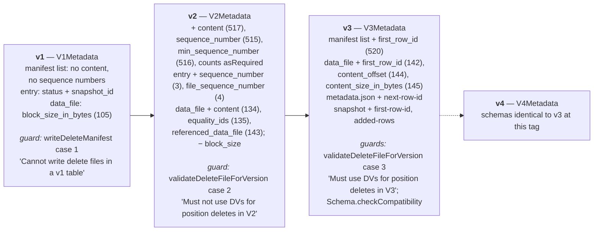
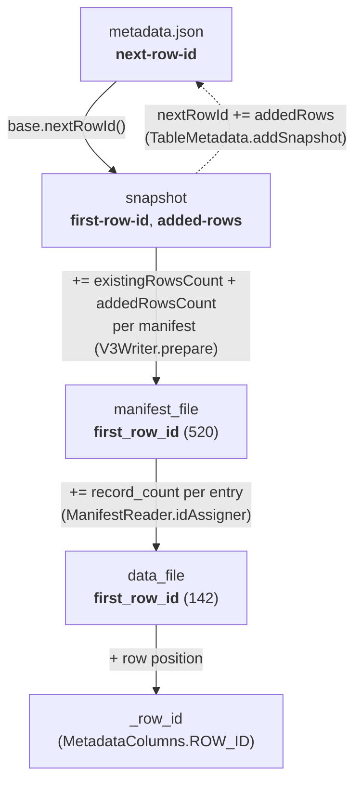

# Chapter 2.5 — V1 → V2 → V3: row-level deletes, deletion vectors, row lineage

**The question this chapter answers:** between format versions 1, 2 and 3, exactly which bytes changed on disk — and where in the source does the code branch on `formatVersion` to produce them?

**Prerequisites:** Chapter 2.2 (`metadata.json`), Chapter 2.3 (the manifest list), Chapter 2.4 (the manifest file)

**Source covered:** `core/.../V1Metadata.java`, `V2Metadata.java`, `V3Metadata.java`, `V4Metadata.java`, `core/.../ManifestLists.java`, `ManifestFiles.java`, `MergingSnapshotProducer.java`, `deletes/BaseDVFileWriter.java`, `ManifestListWriter.java`, `ManifestReader.java`, `api/.../Schema.java`

## 1. The problem

"Format version" sounds like a feature flag: a number that a hundred call sites consult before deciding what to do. Iceberg's implementation is almost the opposite, and knowing that is what makes this chapter short enough to be useful.

The version is dispatched in essentially **three switches**. One picks a manifest-list writer, one picks a manifest writer, and one picks a *delete*-manifest writer — and that third one is where the format says what v1 is. Each hands back a `V<N>Writer` whose siblings differ, at minimum, in two things: a static schema declaration and a wrapper class that adapts an in-memory object to it. Not every sibling stops at two — v1's manifest-list writer also validates, and v3's and v4's carry a `nextRowId` they stamp into each manifest (section 6) — but nothing downstream of the writer knows any of it. The Avro encoder, the readers and the planner are all version-agnostic.

The consequence is a method for answering the question in the title. To know what v3 changed, you diff four static schema declarations and read a handful of named guards. That is the whole answer, and the rest of this chapter is that diff.

## 2. Where the version is branched on

`ManifestLists.write` takes an `int formatVersion` and switches on it, returning `ManifestListWriter.V1Writer` through `V4Writer`; its fallthrough is `throw new UnsupportedOperationException("Cannot write manifest list for table version: " + formatVersion)`. `ManifestFiles.newWriter` does the same for `ManifestWriter.V1Writer` … `V4Writer`, and its fallthrough is the same sentence with the word *list* removed: *"Cannot write manifest for table version: "*. Worth knowing before you grep for one string and conclude the other switch does not exist.

The third switch is the one that says what v1 *is*, and it is `ManifestFiles.writeDeleteManifest` — which shares its fallthrough message with `newWriter`, not with `ManifestLists`:



`case 1` throws before there is any writer to return: v1 has no delete-manifest writer, so the absence is by construction. It is not the format's only line of defence, though — `ManifestListWriter.V1Writer.prepare` independently rejects a delete manifest with *"Cannot store delete manifests in a v1 table"*, so a v1 table refuses deletes at both the manifest and the manifest-list layer.

## 3. The `data_file` struct, from v1 to v3

Start with what a v1 table records about a file:



Fifteen fields, and two observations carry the whole v1-to-v2 story.

`BLOCK_SIZE` is declared privately inside `V1Metadata` itself — `required(105, "block_size_in_bytes", Types.LongType.get())` — and appears in no other version's schema. It was a required field that nothing consumes; the v2 writers simply stopped emitting it. Across all four version schemas it is the only `data_file` field that is ever dropped rather than added.

What is missing matters more. There is no `content` field, so every row in a v1 manifest is a data file by definition. There is no `equality_ids`. There is no `referenced_data_file`. A v1 manifest has no vocabulary for a file that describes deletions, which is why section 2's `writeDeleteManifest` throws rather than validates.

One version later:



`BLOCK_SIZE` is gone, and three fields have arrived: `CONTENT` (134) at the front, `EQUALITY_IDS` (135), and `REFERENCED_DATA_FILE` (143) at the end. Those three are the entire vocabulary a v2 manifest needs to describe a file that describes deletions, which is why §2's `writeDeleteManifest` throws only for v1.

And two versions later:



`DataFile.CONTENT.asRequired()` is now the *first* field — field 134, documented as "Contents of the file: 0=data, 1=position deletes, 2=equality deletes". `BLOCK_SIZE` is gone. The rest of the difference is two deltas, not one, and they are easy to merge by mistake because only the v1 and v3 schemas are on this page:

**V1 → V2** added `content` (134), `equality_ids` (135) and `referenced_data_file` (143). That last one is not a v3 field, and the v2 schema above shows it: `V2Metadata.fileType` already ends with `DataFile.REFERENCED_DATA_FILE`, and a v2 position-delete file uses it to name the data file its positions belong to. The §2 diagram files it under v2 for that reason.

**V2 → V3** added three fields — `first_row_id` (142), `content_offset` (144) and `content_size_in_bytes` (145) — and moved `referenced_data_file` from the end of the struct to sit between 142 and 144, so that the v3 list reads in id order. Sections 5 and 6 are about the three that are genuinely new.

## 4. V1 → V2: the entry and the manifest list

The manifest entry wrapper is three fields in v1:



and five in v2:



`SEQUENCE_NUMBER` (3) and `FILE_SEQUENCE_NUMBER` (4) — the pair Chapter 2.4 explained as "where this file sits in the delete ordering" and "when it arrived". The manifest list gains the same concept one level up:





Three fields appear: `MANIFEST_CONTENT` (517), `SEQUENCE_NUMBER` (515), `MIN_SEQUENCE_NUMBER` (516). Six existing fields change from optional to `asRequired()` — every added/existing/deleted files and rows count. A v1 manifest list may omit its counts; a v2 one may not, which is what lets a v2 planner answer "how many files does this manifest add" without opening it.

The ordering of the two changes is not a coincidence. Deletes are only meaningful if a reader can tell which delete applies to which data file, and that ordering *is* the sequence number. Row-level deletes and sequence numbers arrive in the same version because neither is usable without the other.

## 5. V2 → V3: the encoding of position deletes

The common summary — "v3 replaces position delete files with deletion vectors" — is wrong in a way that matters. Here is the actual rule:



Read the four cases as a table of what is legal:

| | equality deletes | position deletes as a data file | position deletes as a DV |
| --- | --- | --- | --- |
| **v1** | rejected | rejected | rejected |
| **v2** | legal | legal | **rejected** |
| **v3 / v4** | legal | **rejected** | required |

v3 does not remove position deletes. It removes one *encoding* of them and mandates another. Equality deletes are untouched by the guard in both directions — `file.content() == FileContent.EQUALITY_DELETES ||` short-circuits before either check — and remain legal in v3. Note also that v2 is symmetric: writing a DV to a v2 table is rejected just as firmly as writing a non-DV position delete to a v3 table.

What a v3 table gains is therefore not "no position deletes" but a much stronger invariant: **at most one file-scoped, Puffin-encoded position delete per data file.** That is why `ContentFileUtil.containsSingleDV` — `Iterables.size(deleteFiles) == 1 && Iterables.all(deleteFiles, ContentFileUtil::isDV)` — is a meaningful fast path in the read planner rather than a rare special case.

And a deletion vector, at this tag, is not a new kind of manifest row:



An ordinary `DeleteFile`. `ofPositionDeletes()` sets `content` to `POSITION_DELETES`; `withFormat(FileFormat.PUFFIN)` is the entire distinguishing mark, and `ContentFileUtil.isDV` is one line that says so: `return deleteFile.format() == FileFormat.PUFFIN;`. The three v3 fields carry the rest — `referenced_data_file` names the data file this vector applies to, `content_offset` and `content_size_in_bytes` point at a `deletion-vector-v1` blob (`StandardBlobTypes.DV_V1`) inside a Puffin file that may hold many such blobs.

## 6. V2 → V3: row lineage

The other half of v3 adds three fields at three levels, so that a row can be tracked across rewrites without being rewritten itself.

The important claim in that diagram is what is *not* in it: no row ID is ever stored per row. Only ranges are stored, and every level derives its range from the level above.

Allocation happens at commit time, one manifest at a time:



A manifest that already has a `first_row_id`, or that holds deletes rather than data, is passed through untouched. Otherwise it is stamped with the writer's running `nextRowId`, which then advances by `existingRowsCount + addedRowsCount` — and the comment says exactly why that sum and not just the added rows: *"leave space for existing and added rows, in case any of the existing data files do not have an assigned first-row-id (this is the case with manifests from pre-v3 snapshots)"*.

Assignment to individual files happens at read time:



Three branches, and each is a different situation. With a manifest-level `firstRowId`, a counter walks the entries and gives each file the next range, advancing by that file's `recordCount` — note the `null == file.firstRowId()` guard, so a file that already carries an ID keeps it, and `DELETED` entries are skipped. With no manifest-level ID on an *uncommitted* manifest, the function is `identity()`, preserving IDs on `EXISTING` entries that may be merged later. With no manifest-level ID on a *committed* manifest — the "(pre-v3 upgrade path)" comment — every entry's row ID is defensively set to `null`.

`TableMetadata.Builder.addSnapshot` closes the loop, under `if (formatVersion >= MIN_FORMAT_VERSION_ROW_LINEAGE)`: it checks that the snapshot has a `first-row-id`, that it is not behind the table's `next-row-id`, and then advances `nextRowId` by the snapshot's `addedRows`.

## 7. V2 → V3: types and defaults

"V3 added new types" has a precise definition, and it is one map:





`MIN_FORMAT_VERSIONS` maps five type IDs to the number 3: `TIMESTAMP_NANO`, `VARIANT`, `UNKNOWN`, `GEOMETRY`, `GEOGRAPHY`. Any field whose type is in that map, in a table below its minimum, is a problem. `DEFAULT_VALUES_MIN_FORMAT_VERSION` is also 3, so a non-null `initialDefault` on any field is the sixth thing that requires v3 — the mechanism behind adding a column with a default and not rewriting a single data file.

Problems accumulate into a `TreeMap` keyed by field ID rather than throwing on the first one, so the error names every offending column at once.

## 8. And v4

`TableMetadata.SUPPORTED_TABLE_FORMAT_VERSION` is `4`, and `V4Metadata` exists alongside its three siblings. Diffing it against `V3Metadata` is instructive, and "identical line for line" is a claim worth putting a snippet behind rather than asserting:



Set that beside `V3Metadata.MANIFEST_LIST_SCHEMA`, which Chapter 2.3 §8 injects at the same line range — same eighteen lines, same `asRequired()` on the same six counts, `FIRST_ROW_ID` (520) in the same place. `fileType` matches just as exactly. The only real difference is that `V3Metadata`'s wrappers call a `checkContentType` precondition — rejecting manifest and file content types outside the known set — which `V4Metadata` does not carry.

The genuinely new v4 shape is in the tree but not wired up. `TrackedFile` declares `deletion_vector` at field 148 as a *nested struct* (`DeletionVector.schema()`) rather than the three flat fields v3 uses, and `ManifestInfo` sits beside it. Outside their own tests and their `*Struct` companions, nothing references them.

So the accurate claim about v4 at this tag is about *schemas*, and it is worth keeping it that narrow. A v4 table's rows have the same shape as a v3 table's, field for field. The files are not identical: `ManifestWriter`'s v4 appenders write `.meta("format-version", "4")` where the v3 ones write `"3"`, `ManifestListWriter` does the same in its Avro key-value metadata, and `metadata.json` records `"format-version": 4`. A reader can always tell which version wrote a file; what it cannot do is find a field in one that is missing from the other.

## 9. Gotchas

!!! warning "V3 does not replace position deletes with DVs — it replaces the *encoding*"
    `validateDeleteFileForVersion` rejects a non-DV position delete in v3 and rejects a DV in v2. Equality deletes are untouched and legal in both. The invariant a v3 table gains is "at most one file-scoped, Puffin-encoded position delete per data file", which is what makes `ContentFileUtil.containsSingleDV` a meaningful fast path.

!!! warning "One Puffin file holds many DVs, so path and size are not what they look like"
    `createDV` is called once per referenced data file but shares `puffinPath` and `puffinFileSize` across all of them — only `content_offset` and `content_size_in_bytes` differ. `file_path` is therefore not a unique key for a DV, and `file_size_in_bytes` is the size of the whole Puffin file, not of the blob. Tooling that reasons about delete files by path or by size gets both wrong.

!!! warning "Row IDs are inherited, and the inheritance is lossy in one direction"
    `idAssigner` assigns `first_row_id` only when the entry's own value is null and the manifest carries one. Its third branch — a committed manifest with a null manifest-level `first_row_id` — **nulls out** every entry's row ID, with the comment "(pre-v3 upgrade path)". Data files that predate the upgrade have no row lineage and cannot acquire it without a rewrite.

!!! warning "The row ID allocator deliberately over-allocates"
    `V3Writer.prepare` advances `nextRowId` by `existingRowsCount + addedRowsCount` so that pre-v3 data files inside a manifest have room. Row IDs are unique and monotonic but **not dense** — gaps are normal and are not evidence of deleted rows.

!!! note "Upgrading is one-way, and is not a rewrite"
    `TableMetadata.Builder.upgradeFormatVersion` refuses to go backwards — `"Cannot downgrade v%s table to v%s"` — and otherwise does nothing but bump the number and record a `MetadataUpdate`. Existing manifests keep the schema they were written with; only new ones use the new version. A "v3 table" routinely contains v2 manifests.

## Key takeaways

- The format version is dispatched in three switches — `ManifestLists.write`, `ManifestFiles.newWriter` and `ManifestFiles.writeDeleteManifest` — each selecting one of four sibling classes that differ mainly in a static schema and a wrapper. Everything downstream is version-agnostic.
- V1 has no `content` field anywhere, so it has no vocabulary for a delete file; `writeDeleteManifest` throws for v1 rather than validating. `block_size_in_bytes` (105) is the one field ever removed.
- V2 adds sequence numbers at the entry and manifest-list levels in the same release as row-level deletes, because a delete is meaningless without an ordering that says which files it applies to.
- V3 keeps position deletes and changes their encoding: a DV is an ordinary `DeleteFile` with `file_format = PUFFIN` plus `referenced_data_file`, `content_offset` and `content_size_in_bytes`, and `ContentFileUtil.isDV` is a one-line format check.
- Row lineage stores ranges, never per-row IDs: `next-row-id` in `metadata.json` feeds the snapshot, the snapshot feeds each manifest at commit, and `idAssigner` walks `record_count` to reach individual files at read time.
- "V3 added new types" means five entries in `Schema.MIN_FORMAT_VERSIONS` plus non-null `initial-default`; v4 exists and its schemas are identical to v3's at this tag, though the version it stamps into every file is not.

## Source map

| What | File |
| --- | --- |
| Version dispatch | [`core/.../ManifestLists.java`](https://github.com/apache/iceberg/blob/apache-iceberg-1.11.0/core/src/main/java/org/apache/iceberg/ManifestLists.java), [`ManifestFiles.java`](https://github.com/apache/iceberg/blob/apache-iceberg-1.11.0/core/src/main/java/org/apache/iceberg/ManifestFiles.java) |
| Per-version schemas | [`core/.../V1Metadata.java`](https://github.com/apache/iceberg/blob/apache-iceberg-1.11.0/core/src/main/java/org/apache/iceberg/V1Metadata.java), [`V2Metadata.java`](https://github.com/apache/iceberg/blob/apache-iceberg-1.11.0/core/src/main/java/org/apache/iceberg/V2Metadata.java), [`V3Metadata.java`](https://github.com/apache/iceberg/blob/apache-iceberg-1.11.0/core/src/main/java/org/apache/iceberg/V3Metadata.java), [`V4Metadata.java`](https://github.com/apache/iceberg/blob/apache-iceberg-1.11.0/core/src/main/java/org/apache/iceberg/V4Metadata.java) |
| Delete-format guard | [`core/.../MergingSnapshotProducer.java`](https://github.com/apache/iceberg/blob/apache-iceberg-1.11.0/core/src/main/java/org/apache/iceberg/MergingSnapshotProducer.java) |
| Deletion vectors | [`core/.../deletes/BaseDVFileWriter.java`](https://github.com/apache/iceberg/blob/apache-iceberg-1.11.0/core/src/main/java/org/apache/iceberg/deletes/BaseDVFileWriter.java), [`core/.../util/ContentFileUtil.java`](https://github.com/apache/iceberg/blob/apache-iceberg-1.11.0/core/src/main/java/org/apache/iceberg/util/ContentFileUtil.java), [`core/.../puffin/StandardBlobTypes.java`](https://github.com/apache/iceberg/blob/apache-iceberg-1.11.0/core/src/main/java/org/apache/iceberg/puffin/StandardBlobTypes.java) |
| Row lineage | [`core/.../ManifestListWriter.java`](https://github.com/apache/iceberg/blob/apache-iceberg-1.11.0/core/src/main/java/org/apache/iceberg/ManifestListWriter.java), [`ManifestReader.java`](https://github.com/apache/iceberg/blob/apache-iceberg-1.11.0/core/src/main/java/org/apache/iceberg/ManifestReader.java), [`TableMetadata.java`](https://github.com/apache/iceberg/blob/apache-iceberg-1.11.0/core/src/main/java/org/apache/iceberg/TableMetadata.java), [`MetadataColumns.java`](https://github.com/apache/iceberg/blob/apache-iceberg-1.11.0/core/src/main/java/org/apache/iceberg/MetadataColumns.java) |
| Field IDs | [`api/.../DataFile.java`](https://github.com/apache/iceberg/blob/apache-iceberg-1.11.0/api/src/main/java/org/apache/iceberg/DataFile.java), [`api/.../ManifestFile.java`](https://github.com/apache/iceberg/blob/apache-iceberg-1.11.0/api/src/main/java/org/apache/iceberg/ManifestFile.java) |
| Type gating | [`api/.../Schema.java`](https://github.com/apache/iceberg/blob/apache-iceberg-1.11.0/api/src/main/java/org/apache/iceberg/Schema.java) |
| v4 work in progress | [`core/.../TrackedFile.java`](https://github.com/apache/iceberg/blob/apache-iceberg-1.11.0/core/src/main/java/org/apache/iceberg/TrackedFile.java), [`DeletionVector.java`](https://github.com/apache/iceberg/blob/apache-iceberg-1.11.0/core/src/main/java/org/apache/iceberg/DeletionVector.java), [`ManifestInfo.java`](https://github.com/apache/iceberg/blob/apache-iceberg-1.11.0/core/src/main/java/org/apache/iceberg/ManifestInfo.java) |

**Next:** Chapter 2.6 closes Part 2 with the one structure the previous five chapters kept pointing at without opening — `PartitionSpec`, the recorded function that turns a column into the partition tuple every manifest carries, and the reason a table can change its partitioning without rewriting a byte.
