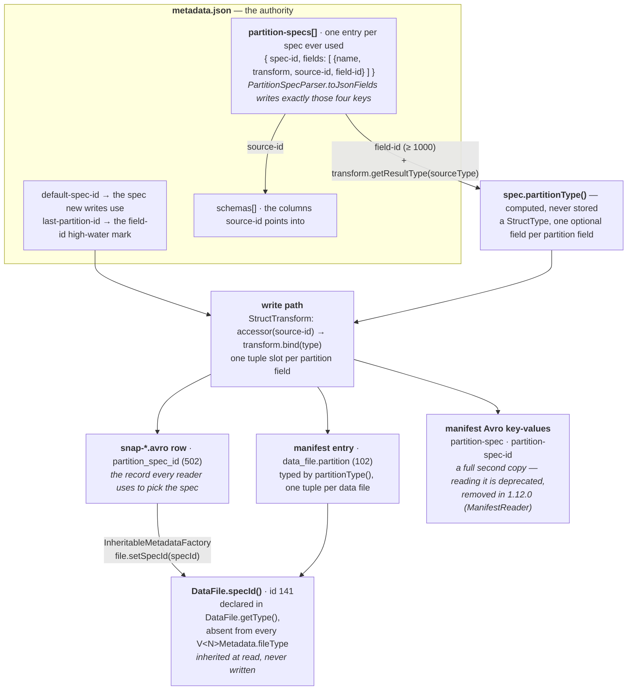
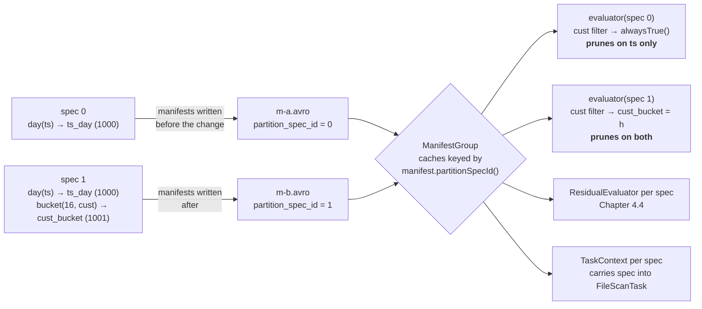

# Chapter 2.6 — `PartitionSpec`: transforms, hidden partitioning, partition evolution

**The question this chapter answers:** no column holds a partition value and no query names one, so where does the value in a manifest's `partition` tuple come from — and what has to be recorded for a table to change its partitioning without rewriting a byte?

**Prerequisites:** Chapter 1.1 (the Hive partition and what it could not do), Chapter 2.2 (`partition-specs` in a real `metadata.json`), Chapter 2.3 (`partition_spec_id` on every manifest list row)

**Source covered:** `api/.../PartitionSpec.java`, `api/.../PartitionField.java`, `api/.../transforms/Transforms.java`, `api/.../StructTransform.java`, `core/.../PartitionSpecParser.java`, `core/.../BaseUpdatePartitionSpec.java`, `core/.../InheritableMetadataFactory.java`, `core/.../Partitioning.java`

## 1. The problem

A Hive table's partition value is a column. It is declared in the DDL, it is a real field the writer has to populate, it appears in the directory name, and a query that does not mention it by name gets no pruning at all. `WHERE event_ts >= '2024-03-01'` scans everything; `WHERE dt >= '2024-03-01' AND event_ts >= '2024-03-01'` scans one day. The two predicates say the same thing and only one of them is fast, which means the physical layout has leaked into every query anyone writes. Chapter 1.1 reads the code that made that true and does not need repeating here.

Iceberg's answer is one decision, and everything in this chapter is a consequence of it: **the partition value is derived from a column by a named function, and the function is recorded in table metadata.** Not the value's provenance as documentation — the function itself, as data, in a form the planner can invert.

That single move buys three things that look unrelated:

- A filter on the **source column** can be rewritten into a filter on the **partition value**, so the user never names the partition. This is what "hidden partitioning" means, and Chapter 4.2 is the rewrite.
- The partition value is a typed tuple stored beside the file, not a substring of a path, so it survives a change of layout.
- Because the derivation is recorded per *spec* rather than per *table*, a table can hold data derived several different ways at once. That is partition evolution, and section 6 is the whole of it.

The cost is that "the partition value" is now three different objects — a declaration, a computation, and a stored tuple — and they live in different files. Section 2 is a map of where they are.

## 2. Where a partition lives

Two claims in that picture are worth stating before anything else, because both are easy to get backwards.

**The spec is stored once and pointed at, not copied onto each file.** `data_file` has a `spec_id` field — `DataFile.SPEC_ID`, id 141, doc *"Partition spec ID"* — and it is in `DataFile.getType()`, which is what metadata tables and in-memory code bind against. It is in none of `V1Metadata`, `V2Metadata`, `V3Metadata` or `V4Metadata`'s `fileType`, so no manifest ever contains it. It is filled in on the way out of the reader:



`file.setSpecId(specId)`, where `specId` came from `manifest.partitionSpecId()` in `fromManifest`. It sits in the same method as the sequence-number inheritance of Chapter 2.4 §3, and it is the same trick: a value that is constant across a whole manifest is stored once on the manifest, not once per row. That is why `partition_spec_id` (502) is a required field of the manifest list row (Chapter 2.3 §3), and why a manifest can only ever hold one spec's files.

**`partitionType()` is derived, not persisted.** Nothing writes the partition struct's field types anywhere. They are recomputed from the schema and the transforms every time, which is section 3.

The directory path is conspicuously absent from that diagram. `spec.partitionToPath` still renders `name=value/` for readability, but nothing reads it back — Chapter 2.1 §6 shows the provider that builds it and what happens to it after a spec change.

## 3. A partition field is four integers and a name



Four fields, and the two integers do different jobs.

**`sourceId`** — *"the field id of the source field in the spec's table schema"*. This is the join key that makes hidden partitioning possible. A predicate is bound to a schema column, which gives it a field id; `spec.getFieldsBySourceId(id)` asks whether anything partitions on that column. Nothing in that lookup involves the partition field's *name*, which is why the user never has to type it. Chapter 4.2 §4 is that lookup and what it does with the answer.

**`fieldId`** — *"the partition field id across all the table metadata's partition specs"*. Across all specs, not within one. Partition field ids are allocated from a table-wide counter starting at `PARTITION_DATA_ID_START = 1000` and recorded in `metadata.json` as `last-partition-id`. Section 6 is about why that counter must never go backwards.

The declaration that reaches disk is exactly these four values:



`name`, `transform`, `source-id`, `field-id` — Chapter 2.2 §5 walks a real `partition-specs` array carrying precisely that shape. Note what is *not* written: no type. The partition value's type is computed:



`schema.findType(field.sourceId())` then `field.transform().getResultType(sourceType)`. So `day(ts)` is a `date`, `year(ts)`/`month(ts)`/`hour(ts)` are `int` ordinals, `bucket(16, id)` is an `int`, and `identity`/`truncate` return the source type unchanged. Every field is `optional`, because a partition value is allowed to be null.

The branch in the middle is the interesting one. When `sourceType == null` — the source column was **dropped from the schema** — the result type becomes `Types.UnknownType`. The spec outlives the column it reads, and the manifests written under it still have to be interpretable. Section 6 shows the other half of that arrangement.

## 4. The transform is a string on disk

There is no transform registry, no class name, no plugin id. A transform round-trips through its `toString()`:



One regex — `(\w+)\[(\d+)\]` — for the two parameterised transforms, then six literal names. That is the complete vocabulary: `identity`, `year`, `month`, `day`, `hour`, `void`, `bucket[N]`, `truncate[W]`.

The fall-through at the end is the forward-compatibility decision. An unrecognised name does not fail the parse; it becomes an `UnknownTransform`, whose `canTransform` returns true for any type, whose `getResultType` returns `StringType` with the comment *"the actual result type is not known"*, and whose `project` and `projectStrict` both `return null`. A reader that meets a transform from a newer writer can still parse the spec and still plan a scan, pruning nothing on that field. Compare `bind`, which throws: you can plan against an unknown transform, but you cannot write one.

The property that decides how much a transform is worth downstream is `Transform.preservesOrder()`, and Chapter 4.2 §3 spends it. The split is: `Identity`, `Truncate`, `Dates`, `Timestamps` and `TimeTransform` override it to return `true`; `Bucket` and `VoidTransform` do not override it at all, so they take the interface default of `false`. What that costs is visible in `Bucket` itself:



Unary predicates pass through. `EQ` projects, because `id = 5` implies `bucket(16, id) = bucket(16, 5)`. `IN` projects, elementwise. Everything else falls off the end to `return null`, under a comment that names both exclusions: *"comparison predicates can't be projected, notEq can't be projected"*. There is even a TODO admitting the theoretical fix — enumerate small ranges into an `IN` list — which nobody has taken.

So a bucketed table prunes point lookups and equi-joins and prunes ranges not at all, and the reason is one `if`/`else if` chain in one file, not a property of hashing in the abstract. `Bucket.apply` is `(hash(value) & Integer.MAX_VALUE) % numBuckets`; the mask is there because `%` on a negative int is negative and a partition ordinal must not be.

`void` is the same shape with less to it: `project` and `projectStrict` both return null, `apply` returns null for every input. It exists for one reason, and section 6 is that reason.

## 5. Computing the tuple

`PartitionKey` — the object an engine hands to a writer once per row — is a thin subclass over `StructTransform`, which does the work. All of it happens in the constructor:



Per partition field: an `Accessor` resolved from the **source id**, and a `SerializableFunction` obtained by binding the transform to that accessor's type. Both are resolved once, when the writer is built. The transform is bound to a concrete type here rather than dispatching per value — this is why `Transform.bind(Type)` exists at all and why the deprecated `apply(value)` on the interface throws.

Then per row:



An array write per partition field, through an accessor and a function both resolved before the first row arrived. No name lookup and no type dispatch — and note `transformedTuple` is a field, reused across rows. That reuse is the reason `ClusteredWriter` and `FanoutWriter` both copy the key before storing it as a map key (Chapter 5.1 §5); the object an engine passes in is the same object every time.

The whole of "hidden partitioning" on the write side is these two snippets. The partition value is never stored in the row, never given a column, and never seen by the user. It exists only as this tuple, written into `data_file.partition` (Chapter 2.4) and summarised into `partitions[]` on the manifest list row (Chapter 2.3 §5).

## 6. Evolution: a new spec, and not one byte rewritten



Read what this method does not do. It does not touch a manifest, a data file, or a snapshot. It builds a `PartitionSpec` object out of the old spec's fields plus the pending adds, and `commit()` hands it to `base.updatePartitionSpec(...)` or `base.addPartitionSpec(...)` — a `metadata.json` rewrite and nothing more. Old data keeps the tuple it was written with, and keeps the spec id that says how to read it.

Two details carry the design.

**Removal at v1 becomes `void`, not deletion.** The `else if (formatVersion < 2)` branch replaces a removed field with `Transforms.alwaysNull()` at the *same field id*, under a comment that states the constraint: *"field IDs were not required for v1 and were assigned sequentially in each partition spec starting at 1,000. to maintain consistent field ids across partition specs in v1 tables, any partition field that is removed must be replaced with a null transform."* A v1 partition tuple is positional, so dropping a field would shift every later field's meaning in every previously written manifest. The void transform is a tombstone that holds the position. `TableMetadata.Builder.addPartitionSpecInternal` enforces the invariant from the other side — `formatVersion > 1 || PartitionSpec.hasSequentialIds(spec)`, failing with *"Spec does not use sequential IDs that are required in v1"* — and `PartitionSpec.checkCompatibility` exempts void from every type check with the note that *"a VoidTransform is always compatible"*, which is what lets the tombstone outlive its source column.

**At v2 and above, field ids are recycled rather than reassigned:**



Adding back a partitioning the table once had searches every historical spec for a field with the same source id and transform, and reuses its id. A table that goes `day(ts)` → `month(ts)` → `day(ts)` ends with two field ids, not three. Spec ids get the same treatment one level up:



`compatibleWith` compares source ids, transforms and names while *ignoring field ids*, so returning to a previous partitioning returns to its spec id too. `partition-specs` grows with the number of distinct partitionings a table has ever had, not with the number of times someone changed it.

## 7. The payoff: everything downstream is keyed by spec id



`residualCache`, `taskContextCache` and — a few lines further down, in `entries()` — the `ManifestEvaluator` cache, all `LoadingCache<Integer, …>` keyed by spec id and all populated from `specsById.get(specId)`. Nothing in the scan planner asks the table what its partitioning *is*; it asks each manifest what its partitioning *was*. That is the payoff that makes the design cohere, and it is the reason Chapter 4.2 §7 can report two different pruning ratios for one query over one table.

The same fact makes one operation genuinely hard, and Iceberg's answer to it is worth reading:



When an engine wants to know what it can rely on being co-located — for an aggregate push-down, a bucketed join, a `SELECT * FROM t.partitions` — it cannot use any one spec. `groupingKeyType` returns the **intersection** of non-void partition fields across all specs, and the javadoc says why: *"If a partition field is present only in a subset of specs, Iceberg cannot guarantee data distribution on that field."* Its sibling `partitionType(table)` returns the **union**, which is what the metadata tables project. Intersection for guarantees, union for display. Evolve a spec and the intersection shrinks, silently, until the old data is rewritten.

## 8. Gotchas

!!! warning "Partition field names share a namespace with columns"
    `PartitionSpec.Builder.checkAndAddPartitionName` rejects a partition name that exists in the schema — *"Cannot create partition from name that exists in schema"* — unless the field is an identity transform on that exact column, in which case the name is *required* to match: *"Cannot create identity partition sourced from different field in schema"*. The partition fields become a struct that sits beside the row's columns, so a collision would be ambiguous. This is why `PARTITIONED BY (days(ts))` produces `ts_day` and not `ts`.

!!! warning "Adding a partition field does not repartition anything"
    `BaseUpdatePartitionSpec.apply()` writes a spec, and `commit()` writes a `metadata.json`. Existing manifests keep their old `partition_spec_id` and are still evaluated with the old spec, so a filter on the newly added field prunes only data written after the change. There is no error, no warning, and no metric that distinguishes this from a filter that simply is not selective — Chapter 4.4 §8 documents the matching effect on residuals.

!!! warning "A bucketed column cannot prune a range"
    `Bucket.project` returns `null` for every comparison operator. `WHERE id BETWEEN 100 AND 200` on a table partitioned by `bucket(16, id)` reads all sixteen buckets. Bucketing is for point lookups, joins and write distribution, and choosing it commits the table's range queries to Chapter 4.3's column statistics.

!!! warning "A dropped source column leaves the spec behind"
    `partitionType()` substitutes `UnknownType` when `schema.findType(sourceId)` returns null, and `checkCompatibility` skips its checks entirely for void transforms. The spec survives the column; that is deliberate, because manifests written under it must stay readable. But `Partitioning.buildPartitionProjectionType` raises *"Cannot build %s type, unknown transforms"* on an unknown transform, so a table carrying one cannot produce a grouping key at all.

!!! note "The manifest carries a second copy of the spec, and it is on the way out"
    `ManifestWriter` writes `partition-spec` (the full field list as JSON) and `partition-spec-id` into every manifest's Avro key-value metadata. `ManifestReader` uses them only when no `specsById` map was passed, and logs: *"Reading partition spec from manifest file metadata is deprecated and will be removed in the 1.12.0 release."* `metadata.json` is the authority; the embedded copy is a v1-era convenience.

## Key takeaways

- Hidden partitioning is one decision with three consequences: the partition value is a recorded function of a column, so a filter on the column can be rewritten onto the partition, the value survives a layout change, and several derivations can coexist.
- `PartitionField` is `sourceId`, `fieldId`, `name`, `transform`. `sourceId` is the join key the planner looks up; `fieldId` is allocated from a table-wide counter at 1000 and must never be reused for a different meaning.
- The partition struct's *types* are never stored — `partitionType()` recomputes them from the schema and `transform.getResultType`, and substitutes `UnknownType` when the source column has been dropped.
- Transforms round-trip as strings through one regex and six literals; an unrecognised one becomes `UnknownTransform`, which plans (projecting nothing) but refuses to write.
- `preservesOrder()` is the property that decides a transform's worth: `Bucket.project` returns `null` for every comparison, so a bucketed table prunes equality and never a range.
- Evolution rewrites `metadata.json` and nothing else. Old manifests keep their `partition_spec_id`, and `ManifestGroup` caches an evaluator, a residual evaluator and a task context per spec — so one query prunes old and new data differently, by design.

## Source map

| What | File |
| --- | --- |
| The spec and its builder | [`api/.../PartitionSpec.java`](https://github.com/apache/iceberg/blob/apache-iceberg-1.11.0/api/src/main/java/org/apache/iceberg/PartitionSpec.java), [`PartitionField.java`](https://github.com/apache/iceberg/blob/apache-iceberg-1.11.0/api/src/main/java/org/apache/iceberg/PartitionField.java) |
| The transforms | [`api/.../transforms/Transforms.java`](https://github.com/apache/iceberg/blob/apache-iceberg-1.11.0/api/src/main/java/org/apache/iceberg/transforms/Transforms.java), [`Bucket.java`](https://github.com/apache/iceberg/blob/apache-iceberg-1.11.0/api/src/main/java/org/apache/iceberg/transforms/Bucket.java), [`Truncate.java`](https://github.com/apache/iceberg/blob/apache-iceberg-1.11.0/api/src/main/java/org/apache/iceberg/transforms/Truncate.java), [`Timestamps.java`](https://github.com/apache/iceberg/blob/apache-iceberg-1.11.0/api/src/main/java/org/apache/iceberg/transforms/Timestamps.java), [`VoidTransform.java`](https://github.com/apache/iceberg/blob/apache-iceberg-1.11.0/api/src/main/java/org/apache/iceberg/transforms/VoidTransform.java), [`UnknownTransform.java`](https://github.com/apache/iceberg/blob/apache-iceberg-1.11.0/api/src/main/java/org/apache/iceberg/transforms/UnknownTransform.java) |
| Computing the tuple | [`api/.../StructTransform.java`](https://github.com/apache/iceberg/blob/apache-iceberg-1.11.0/api/src/main/java/org/apache/iceberg/StructTransform.java), [`api/.../PartitionKey.java`](https://github.com/apache/iceberg/blob/apache-iceberg-1.11.0/api/src/main/java/org/apache/iceberg/PartitionKey.java) |
| Serialization | [`core/.../PartitionSpecParser.java`](https://github.com/apache/iceberg/blob/apache-iceberg-1.11.0/core/src/main/java/org/apache/iceberg/PartitionSpecParser.java), [`api/.../UnboundPartitionSpec.java`](https://github.com/apache/iceberg/blob/apache-iceberg-1.11.0/api/src/main/java/org/apache/iceberg/UnboundPartitionSpec.java) |
| Evolution | [`core/.../BaseUpdatePartitionSpec.java`](https://github.com/apache/iceberg/blob/apache-iceberg-1.11.0/core/src/main/java/org/apache/iceberg/BaseUpdatePartitionSpec.java), [`core/.../TableMetadata.java`](https://github.com/apache/iceberg/blob/apache-iceberg-1.11.0/core/src/main/java/org/apache/iceberg/TableMetadata.java) |
| Reading across specs | [`core/.../Partitioning.java`](https://github.com/apache/iceberg/blob/apache-iceberg-1.11.0/core/src/main/java/org/apache/iceberg/Partitioning.java), [`core/.../ManifestGroup.java`](https://github.com/apache/iceberg/blob/apache-iceberg-1.11.0/core/src/main/java/org/apache/iceberg/ManifestGroup.java), [`core/.../InheritableMetadataFactory.java`](https://github.com/apache/iceberg/blob/apache-iceberg-1.11.0/core/src/main/java/org/apache/iceberg/InheritableMetadataFactory.java) |
| Where the spec is embedded and read back | [`core/.../ManifestWriter.java`](https://github.com/apache/iceberg/blob/apache-iceberg-1.11.0/core/src/main/java/org/apache/iceberg/ManifestWriter.java), [`core/.../ManifestReader.java`](https://github.com/apache/iceberg/blob/apache-iceberg-1.11.0/core/src/main/java/org/apache/iceberg/ManifestReader.java) |

**Next:** Part 2 has described the files; Part 3 reads the code that writes them. Chapter 3.1 maps Iceberg's core module and the abstractions every write path is built from.
