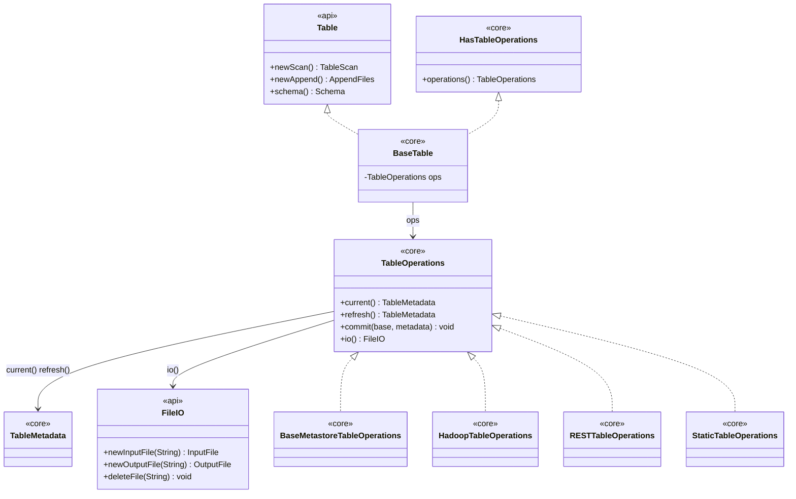

# Chapter 3.1 — Module map and the core abstractions

**The question this chapter answers:** when you hold an Iceberg `Table`, which code is actually running, and where is the line between the interfaces an engine programs against and the machinery that implements them?

**Prerequisites:** Chapter 1.4 (reading these codebases), Chapter 2.2 (`metadata.json` field by field)

**Source covered:** `api/.../Table.java`, `core/.../BaseTable.java`, `core/.../TableOperations.java`, `api/.../io/FileIO.java`

## 1. The problem

Iceberg has to be embedded in query engines it does not control. Spark, Flink, Trino, Hive and a dozen smaller projects each compile against it, and each ships its own transitive dependency mess. If the interface an engine compiles against dragged in Avro, Hadoop, Jackson and an HTTP client, integration would be a version-conflict exercise rather than an implementation one.

At the same time Iceberg has to be embedded in catalogs it does not control either. A Hive metastore, a JDBC database, a DynamoDB table and an HTTP service have nothing in common except that each can store a string and swap it conditionally.

Those two pressures shape the whole codebase. They produce a hard split between an `api` module that is almost entirely interfaces, and a `core` module that holds every class knowing about JSON, files or catalogs — plus exactly one seam between them.

Everything a user does with a table decomposes into two questions: *what is the current metadata*, and *how do I replace it*. Find the interface that asks those two questions and you have found the seam.

## 2. Where the line falls

Every arrow that crosses from `api` into `core` passes through `TableOperations` — and nothing on the api side names it.

The split is enforced by the build, not by convention. In the root `build.gradle`, `project(':iceberg-api')` declares one production dependency: the shaded Guava bundle. No Avro, no Hadoop, no Jackson. `project(':iceberg-core')` opens with `api project(':iceberg-api')` and pulls in everything else. There are 321 Java source files under `api/src/main/java` against 601 under `core/src/main/java`.

The rule that decides which side a type lands on is simple once you see it: **api holds what a caller says, core holds what the table is.** `Table`, `Snapshot`, `AppendFiles`, `OverwriteFiles`, `RowDelta`, `PendingUpdate`, `FileIO` are api. `TableMetadata`, `BaseTable`, `TableOperations`, `MetadataUpdate`, `SnapshotProducer` are core.

Everything outside those two modules is a plug-in for one of the three seams. `settings.gradle` lists them: `aws`, `gcp`, `azure`, `aliyun`, `dell` and `bigquery` mostly supply `FileIO` and `TableOperations` implementations; `hive-metastore`, `nessie`, `jdbc` (inside core) and `snowflake` supply catalogs; `spark`, `flink` and `mr` are engine integrations that compile against `api` and reach into `core` only where they must. Most of those `build.gradle` blocks carry the same two lines — `api project(':iceberg-api')` and `implementation project(':iceberg-core')` — which is the dependency graph stating the rule out loud: a module re-exports the api to whoever depends on it, and keeps core to itself. `dell` and `snowflake` are the two exceptions, and they are instructive: neither declares `iceberg-api` at all, only `implementation project(':iceberg-core')`. They still compile against `Table` and `FileIO`, because `project(':iceberg-core')` opens with `api project(':iceberg-api')` and re-exports it — but they decline to promise those types onward to their own consumers.

That gives a map for the rest of this book:

| Part | Module it reads |
| --- | --- |
| Part 2 — the table spec | `format/` and the parsers in `core/.../TableMetadataParser.java`, `core/.../ManifestReader.java` |
| Part 3 — this part | `core/src/main/java/org/apache/iceberg/*.java`, the top-level files |
| Part 4 — the read path | `core/.../BaseTableScan.java`, `ManifestGroup`, `expressions/` |
| Part 5 — the write path | `core/.../io/`, `SnapshotProducer` subclasses, `data/` |
| Part 6 — catalogs | `core/.../hadoop/`, `core/.../jdbc/`, `core/.../rest/`, `hive-metastore/`, plus the cloud modules |
| Part 11 — Spark in practice | `spark/v3.5/spark/.../source/` |

## 3. `BaseTable` is a facade over one field

`BaseTable` is the implementation behind almost every `Table` a user ever holds. It has three fields — `ops`, `name`, `reporter` — and no table state at all.



Read past the boilerplate to the pattern: `schema()` is `ops.current().schema()`, `schemas()` is `ops.current().schemasById()`. Every accessor re-derives from `ops.current()` rather than caching. That is why `refresh()` is one line — there is nothing local to invalidate.

The write side is the same trick with a different shape:



This is the api-interface-to-core-implementation mapping table, written as code. `AppendFiles` becomes `MergeAppend`, `OverwriteFiles` becomes `BaseOverwriteFiles`, `RowDelta` becomes `BaseRowDelta`. Every one of them is constructed with `(name, ops)` and nothing else, because the same `ops` field is the only state a write operation needs — Chapter 3.3 follows one of them from that constructor to a committed snapshot.

Note `newAppend()` returns `MergeAppend` while `newFastAppend()` returns `FastAppend`. The default append merges manifests; the fast one does not. Chapter 5.2 is about that choice.

## 4. `TableOperations` is the entire catalog contract

The atomicity contract lives in the javadoc on `commit`, which Chapter 3.3 quotes in full. Here is everything else the SPI asks of a catalog:



Seven methods, and four of them — `encryption()`, `temp()`, `newSnapshotId()`, `requireStrictCleanup()` — already have bodies. Only three are abstract here: `io()`, `metadataFileLocation(String)` and `locationProvider()`. Add the three declared above this excerpt — `current()`, `refresh()`, `commit()` — and that is the whole required surface: six methods. `BaseMetastoreTableOperations` implements five of them for anything metastore-shaped — everything but `io()`, which a subclass must still supply (`HiveTableOperations`, `JdbcTableOperations` and the rest each override it), alongside `tableName()` and the two hooks the base class calls into, `doRefresh()` and `doCommit()`.

Two of the defaults are worth naming now because later chapters lean on them.

`temp(TableMetadata)` returns operations backed by *uncommitted* metadata, so a transaction can compute file locations that reflect changes not yet visible to anyone else. The default ignores the request and returns `this`. `BaseMetastoreTableOperations` overrides it with an anonymous implementation whose `refresh()` and `commit()` both throw — a deliberately inert object, safe to hand to a transaction that must not touch the catalog.

`requireStrictCleanup()` defaults to `true` and decides whether a failed commit deletes the files it wrote. Chapter 3.3 meets the other end of this flag, in the `if (!strictCleanup || e instanceof CleanableFailure)` branch of `SnapshotProducer.commit`.

Now the seam itself. `Table` — the api interface — has no `operations()` method. This does:



Four lines, in `core`. That placement is the entire trick: engines compile against `Table` and never see `TableOperations`; integrations that genuinely need the SPI downcast to `HasTableOperations` and accept the core dependency that comes with it.

## 5. `FileIO`, and what is deliberately missing

At the bottom sits the storage abstraction — and it is anaemic on purpose.



Ninety-six lines, and only three of them declare something an implementation must write: `newInputFile(String)`, `newOutputFile(String)`, `deleteFile(String)`. Everything else is `default` — convenience overloads that unwrap a `DataFile`, `ManifestFile` or `ManifestListFile` into a path and a length, plus `properties()`, `initialize()` and `close()`.

What is *not* there matters more than what is. There is no `rename`. No `listPrefix`. No conditional or compare-and-swap put. Capabilities beyond the three arrive as separate opt-in interfaces — `SupportsPrefixOperations`, `SupportsBulkOperations`, `SupportsRecoveryOperations` — which callers must test for at runtime.

The consequence is the load-bearing fact of the next three chapters. **Iceberg does not permit storage to be the source of atomicity.** A `FileIO` implementation is not asked whether it can rename atomically, because the answer on object storage is no and the design refuses to depend on it. The atomic swap has to come from the catalog, which is exactly where Chapter 3.4 goes looking for it.

## 6. Gotchas

!!! warning "A `Table` is not necessarily a `HasTableOperations`"
    `BaseTable` and `SerializableTable` implement it. `BaseMetadataTable` — the parent of `$snapshots`, `$files`, `$manifests` and the rest — extends `BaseReadOnlyTable` and does not. Iceberg's own code shows the shape of the workaround: `SerializableTable.metadataFileLocation(Table)` tests `instanceof HasTableOperations` first, then falls back to `instanceof BaseMetadataTable` and reaches through `.table().operations()`. An integration that blindly casts `Table` to `HasTableOperations` throws a `ClassCastException` the first time someone queries a metadata table.

!!! warning "Serializing a table quietly makes it read-only"
    `BaseTable.writeReplace()` returns `SerializableTable.copyOf(this)`, whose class javadoc states the intent: no catalog calls are needed after deserialization. It rebuilds its ops lazily as a `StaticTableOperations` over the metadata file location captured at serialization time, and that class's `commit` is a single `throw new UnsupportedOperationException("Cannot modify a static table")`. For a Spark user this is the rule that a table broadcast to executors can be read and planned against but never committed from there. Commits happen on the driver.

!!! note "`ops.current()` is not free on a stale handle"
    `BaseTable` re-derives everything from `ops.current()`, and `BaseMetastoreTableOperations.current()` calls `refresh()` whenever `shouldRefresh` is set — which `requestRefresh()` sets after every commit. A loop that reads `table.schema()` repeatedly across a commit boundary can trigger a catalog round trip and a metadata file read. This is why a scan pins what it needs at construction rather than consulting the table object per task: `BaseTable.newScan()` evaluates `schema()` once and hands the resulting `Schema` to `BaseScan`, and the snapshot a scan reads is an optional `snapshotId` on the immutable `TableScanContext`. No scan class holds a `TableMetadata` at all.

!!! note "`FileIO` implementations must be `Serializable`, and the javadoc says why"
    The interface extends `Serializable` and the class comment explains the requirement: Spark clients initialize a `FileIO` once and hand it to a separate module that then works with the streams. That constraint rules out holding an open client, a connection pool or a `Configuration` object directly in a field — which is why the cloud `FileIO` implementations carry a properties map and rebuild their clients lazily after deserialization.

## Key takeaways

- The `api` module is interfaces with one production dependency; `core` holds every class that knows about files, JSON or catalogs. The build enforces it.
- `BaseTable` stores no table state. Reads are `ops.current().x()`; writes are `new <CoreClass>(name, ops)`.
- `TableOperations` is the whole catalog contract: six required methods, with four more supplied as defaults. A metastore-shaped catalog writes `doRefresh`, `doCommit`, `io()` and `tableName()`, and inherits the rest from `BaseMetastoreTableOperations`.
- `Table` cannot reach `TableOperations`. `HasTableOperations` can, and it lives in core, which is how the api stays free of the SPI.
- `FileIO` requires three methods and offers no rename, no listing and no conditional write. Atomicity is therefore not storage's job — it is the catalog's.

## Source map

| What | File |
| --- | --- |
| The api-side table interface | [`api/.../Table.java`](https://github.com/apache/iceberg/blob/apache-iceberg-1.11.0/api/src/main/java/org/apache/iceberg/Table.java) |
| The core implementation | [`core/.../BaseTable.java`](https://github.com/apache/iceberg/blob/apache-iceberg-1.11.0/core/src/main/java/org/apache/iceberg/BaseTable.java) |
| The SPI | [`core/.../TableOperations.java`](https://github.com/apache/iceberg/blob/apache-iceberg-1.11.0/core/src/main/java/org/apache/iceberg/TableOperations.java) |
| The api/core seam | [`core/.../HasTableOperations.java`](https://github.com/apache/iceberg/blob/apache-iceberg-1.11.0/core/src/main/java/org/apache/iceberg/HasTableOperations.java) |
| Storage contract | [`api/.../io/FileIO.java`](https://github.com/apache/iceberg/blob/apache-iceberg-1.11.0/api/src/main/java/org/apache/iceberg/io/FileIO.java) |
| Opt-in storage capabilities | [`api/.../io/SupportsPrefixOperations.java`](https://github.com/apache/iceberg/blob/apache-iceberg-1.11.0/api/src/main/java/org/apache/iceberg/io/SupportsPrefixOperations.java), [`SupportsBulkOperations.java`](https://github.com/apache/iceberg/blob/apache-iceberg-1.11.0/api/src/main/java/org/apache/iceberg/io/SupportsBulkOperations.java) |
| Read-only ops after serialization | [`core/.../SerializableTable.java`](https://github.com/apache/iceberg/blob/apache-iceberg-1.11.0/core/src/main/java/org/apache/iceberg/SerializableTable.java), [`StaticTableOperations.java`](https://github.com/apache/iceberg/blob/apache-iceberg-1.11.0/core/src/main/java/org/apache/iceberg/StaticTableOperations.java) |
| Metadata tables, which have no ops | [`core/.../BaseMetadataTable.java`](https://github.com/apache/iceberg/blob/apache-iceberg-1.11.0/core/src/main/java/org/apache/iceberg/BaseMetadataTable.java) |

**Next:** Chapter 3.2 opens up the object every one of those `ops.current()` calls returns — `TableMetadata` — and asks why an immutable snapshot of a table also carries a log of the changes that produced it.
