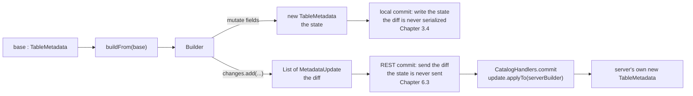

# Chapter 3.2 — `TableMetadata` and `MetadataUpdate`

<div class="chapter-meta" markdown>
**The question this chapter answers:** `TableMetadata` is immutable, so how does a table ever change — and why does the new object carry a *list of the changes* that produced it, when the file it will be written to has no field for such a list?

**Prerequisites:** Chapter 2.2 (`metadata.json` field by field), Chapter 3.1 (the api/core split)

**Source covered:** `core/.../TableMetadata.java`, `core/.../MetadataUpdate.java`, `core/.../rest/CatalogHandlers.java`
</div>

## 1. The problem

`TableMetadata` is the in-memory form of `metadata.json`: schemas, partition specs, sort orders, properties, every snapshot, every ref, the metadata log. Chapter 2.2 walked the file. This chapter is about the object, and the object has one property the file does not — nothing you can reach through its public API ever changes value.

That is the right decision for a format built on optimistic concurrency. A writer holds a `TableMetadata` for the whole duration of a commit attempt and needs it to be a stable photograph; a reader may be scanning against it on another thread. Nothing may mutate underneath either of them.

That is almost, but not quite, "every field is final". Five are not: `snapshotsSupplier`, `snapshots`, `snapshotsById`, `refs` and `snapshotsLoaded`. They exist for one purpose — a `TableMetadata` handed over by a REST catalog may arrive with its snapshot list replaced by a supplier, and `ensureSnapshotsLoaded()` fills the four `volatile` fields from it on first access, under `synchronized`, exactly once, then drops the supplier. It is lazy initialisation of a value that was always fixed, not mutation. Section 6 shows the `hasChanges()` clause that keeps it from being mistaken for a change.

So a change means constructing a whole new object. `TableMetadata.Builder` does that. What is not obvious, and is the subject of this chapter, is that the builder produces **two** outputs and only one of them ends up in the file.

## 2. Two outputs from one builder



Same builder, two halves, two destinations. A local commit uses the state and throws the diff away. A REST commit sends the diff and throws the state away. Hold onto that shape; sections 6 and 7 are where it pays.

## 3. `buildFrom` copies everything, including the log

There is no copy-on-write cleverness here. `buildFrom(base)` is a constructor that walks the base object field by field:



Thirty-eight lines, and exactly one of them is not a copy. The fourth, `this.lastUpdatedMillis = null;`, is a deliberate reset: a new version of the table is a new point in time, so `build()` stamps `System.currentTimeMillis()` into whatever is still null. (`withMetadataLocation` is the single caller that puts the base value back, and only when the metadata is being attached to the file it already came from.)

Two of the copies matter more than the rest:

```java
this.changes = Lists.newArrayList(base.changes);
this.startingChangeCount = changes.size();
```

The builder does not start with an empty change list. It **inherits** the base object's list, then records how long that list already was. `startingChangeCount` is a watermark separating "changes that arrived with the base" from "changes this builder made".

That inheritance exists for transactions. A transaction runs several updates in sequence, each building on the metadata the previous one produced, and the accumulated log across all of them is exactly what a multi-update commit has to send. Section 7 shows the receiver.

## 4. Every mutator does two things

### What a ref is, before the method that sets one

Chapter 1.2 said `refs()` generalises `currentSnapshotId` to named branches and tags, and left the detail here. It is one small class:



A snapshot id, a `SnapshotRefType` that is `BRANCH` or `TAG`, and three nullable retention fields. `MAIN_BRANCH = "main"` is a plain string constant; nothing in the type marks the main branch as different, which is why the special-casing below is in the *builder* rather than in the ref.

The three retention fields are where branch and tag stop being the same thing, and `SnapshotRef.Builder` is where the difference is enforced. `maxRefAgeMs` takes any positive value on either kind — it governs how long the ref itself survives. The other two are branch-only, and the builder refuses them by name: `minSnapshotsToKeep` and `maxSnapshotAgeMs` each open with a `Preconditions.checkArgument` on `value == null || !type.equals(SnapshotRefType.TAG)`, failing with *"Tags do not support setting minSnapshotsToKeep"* and *"Tags do not support setting maxSnapshotAgeMs"*.

The asymmetry follows from what the two are for. A branch accumulates history, so it needs a policy saying how much of that history expiry must leave alone. A tag names one snapshot and never moves, so "keep the last N snapshots on it" has no referent to be a policy about.

That is the whole difference in the format. A tag is a branch that may not move and may not retain — and `isBranch()` is the one-line test every caller uses, because the `type` field is the only thing separating them.

Nearly every builder method changes state and describes what it changed in the same breath. `setRef` is the specimen — it is the method behind every branch move, and therefore behind every commit in Chapter 3.3:



Four things happen in order, and only the third is the "real" work.

**It short-circuits an identity change.** `if (existingRef != null && existingRef.equals(ref)) return this;` — setting a ref to what it already is records nothing. This is one of the paths that lets `build()` return the base object unchanged, which Chapter 3.3 relies on when it declines to commit a no-op.

**It special-cases `main`.** Moving the main branch also sets `currentSnapshotId` and appends a `SnapshotLogEntry`. The timestamp chosen for that entry is worth reading twice: `isAddedSnapshot(snapshotId) ? snapshot.timestampMillis() : this.lastUpdatedMillis`. A brand new snapshot logs its own creation time; a *rollback* to an existing snapshot logs the time of the rollback, because that is when the change happened.

**It mutates.** `refs.put(name, ref)`.

**It records.** `changes.add(refUpdate)` with a fully populated `MetadataUpdate.SetSnapshotRef` — name, snapshot ID, type, and all three retention fields. Enough information to replay the operation somewhere else, which is the whole point.

Twenty-odd other mutators follow the identical shape: `assignUUID`, `upgradeFormatVersion`, `setCurrentSchema`, `addSnapshot`, `removeRef`, `setProperties`, `setLocation`, `addEncryptionKey`.

There is one method that breaks the shape, and upstream documents it as a break. `suppressHistoricalSnapshots()` drops from the builder every snapshot no ref points at — and adds no `RemoveSnapshots` change for any of them. Its javadoc is explicit: *"Note that the snapshots are not considered removed from metadata and no RemoveSnapshot changes are created."* Its one production caller is a REST server answering a load request in `REFS` snapshot mode, sending the client only the snapshots its refs name. Nothing was removed from the table, so there is nothing to replay; what changed is which snapshots this copy carries. Section 6 shows how `hasChanges()` accounts for a change that produced no `MetadataUpdate`.

The other way to change a `TableMetadata` without leaving a trace is to not go through the builder at all — which is exactly what deserialization does, and section 6 has the precondition that keeps those two worlds from mixing.

## 5. `MetadataUpdate`: the change as an object



The interface has two `applyTo` overloads — one for a table builder, one for a view builder — and both defaults throw `UnsupportedOperationException` naming the class that could not be applied. This is a hand-rolled visitor. A `MetadataUpdate` is not a passive record of what happened; it is the *inverse* of the builder mutator, able to reapply itself to any builder it is handed.

`AssignUUID` implements both overloads because a UUID means the same thing to a table and to a view. `SetCurrentSchema` implements only the table one and inherits the throwing default for views — the type system does not separate table updates from view updates, so the failure is deferred to runtime and made loud.

There are 25 implementations in the file. They group cleanly:

<div class="grid cards" markdown>

-   **Identity and location**

    `AssignUUID`, `UpgradeFormatVersion`, `SetLocation`, `SetProperties`, `RemoveProperties`

-   **Schema, spec, sort order**

    `AddSchema`, `SetCurrentSchema`, `AddPartitionSpec`, `SetDefaultPartitionSpec`, `RemovePartitionSpecs`, `RemoveSchemas`, `AddSortOrder`, `SetDefaultSortOrder`

-   **Snapshots and refs**

    `AddSnapshot`, `RemoveSnapshots`, `SetSnapshotRef`, `RemoveSnapshotRef`

-   **Statistics, keys, views**

    `SetStatistics`, `RemoveStatistics`, `SetPartitionStatistics`, `RemovePartitionStatistics`, `AddEncryptionKey`, `RemoveEncryptionKey`, `AddViewVersion`, `SetCurrentViewVersion`

</div>

## 6. `hasChanges()` and `build()`



The first clause is the watermark comparison from section 3 — not `changes.isEmpty()`, which would be wrong for any builder that inherited a log. The other four clauses cover changes that produce no `MetadataUpdate` at all: attaching a metadata file location, suppressing historical snapshots, installing a lazy snapshot supplier.



The first three lines are the ones to stop on:

```java
if (!hasChanges()) {
  return base;
}
```

Not a copy. The **same reference**. This is the mechanism behind two identity checks elsewhere in the codebase: `SnapshotProducer.commit`'s `if (updated.changes().isEmpty())`, which Chapter 3.3 reads next, and `BaseMetastoreTableOperations.commit`'s `if (base == metadata)` short circuit, which Chapter 3.4 reads after it. Both are cheap because this method makes them safe.

Then the precondition that explains why the log is in-memory only:

```java
Preconditions.checkArgument(
    changes.isEmpty() || discardChanges || metadataLocation == null,
    "Cannot set metadata location with changes to table metadata: %s changes",
    changes.size());
```

Metadata associated with a file must correspond to that file exactly. A file has no changes field. So metadata that carries a location must carry no log, and the builder's final constructor argument enforces it: `discardChanges ? ImmutableList.of() : ImmutableList.copyOf(changes)`.

Two callers take the other route to the same place. `TableMetadataParser` skips the builder entirely and calls the constructor with a literal empty list, annotated `/* no changes from the file */`. `RESTSessionCatalog`, rebuilding metadata that arrived from a server, chains `.withMetadataLocation(...).setPreviousFileLocation(null).setSnapshotsSupplier(...).discardChanges()` before building — same rule, applied to metadata that never touched local storage.

## 7. Why the log exists

Nothing so far explains why Iceberg bothers. A local commit writes the new state and never looks at `changes()`. The answer is on the other side of a network:



This runs in the catalog *server*. It never receives a `TableMetadata`. It receives an `UpdateTableRequest` containing two lists, and it does two things with them:

- `request.requirements().forEach(requirement -> requirement.validate(base))` — the client's preconditions, checked against whatever the **server's** current metadata is.
- `request.updates().forEach(update -> update.applyTo(metadataBuilder))` — the client's changes, replayed onto a builder over the **server's** base.

That is the same `Tasks.foreach(...).onlyRetryOn(CommitFailedException.class)` loop and the same `updated.changes().isEmpty()` no-op check as the client-side loop Chapter 3.3 is about to read. The protocol did not need re-inventing for HTTP, because the update log made the client's intent transportable.

**`changes()` is the wire format.** Everything else in this chapter is the machinery that keeps it accurate for free, on every mutation, whether or not anyone will ever send it. Chapter 6.3 takes the REST spec apart properly, and 6.4 shows where this model runs out — multi-table commits.

## 8. Gotchas

!!! warning "`build()` can hand you back the object you started from"
    When `hasChanges()` is false the return value is `base` itself, not an equal copy. Code that assumes `build()` allocates — comparing with `!=` to detect a change, or mutating the result in place — will be surprised. Iceberg relies on the behaviour deliberately in at least two places, so it is not going to change.

!!! warning "`changes.isEmpty()` is not the same question as `hasChanges()`"
    A builder created from metadata that already carries a log starts with a non-empty `changes` list and no changes of its own. That is why `hasChanges()` compares against `startingChangeCount`. `discardChanges()` handles the mirror case: metadata reconstructed from a file must publish no log at all, and `build()` enforces the combination with the metadata-location precondition.

!!! warning "Some builder validations are marked retryable on purpose"
    `Builder.addSnapshot` raises `RetryableValidationException`, not the plain `ValidationException`, when a snapshot's sequence number or `first-row-id` is behind the table's current state. The class javadoc is explicit: "This is specifically not a conflict... Retrying the commit with refreshed metadata can resolve the failure." `CatalogHandlers.commit` catches it and re-throws it as a `CommitFailedException`, with a comment noting that server-side retry cannot help because the stale values are in the request itself. Only the client, after a refresh, can fix it. Chapter 3.5 takes the whole exception taxonomy apart.

!!! note "The update log never reaches storage"
    `TableMetadataParser` constructs `TableMetadata` directly with an empty change list, and the upstream comment on that argument says why: `/* no changes from the file */`. `metadata.json` records the resulting state and the log of previous metadata files; it has no notion of the operations that produced them. Anything you want to know about *how* a table got somewhere has to come from snapshot summaries, not from this list.

## Key takeaways

- `TableMetadata` is immutable, so every change constructs a new object through a `Builder` that copies all state up front.
- The builder inherits the base object's change log and records `startingChangeCount` as a watermark, so accumulated changes survive across a transaction's updates.
- Every mutator both changes a field and appends a `MetadataUpdate` describing it; a `MetadataUpdate` can replay itself onto any builder via `applyTo`.
- `build()` returns the base object unchanged when nothing happened, which is what makes the identity-based no-op checks in Chapters 3.3 and 3.4 correct.
- The change log is never written to `metadata.json`. It exists so a client can send its *intent* to a catalog server, which is what makes REST catalogs possible — Chapter 6.3 collects on this.

## Source map

| What | File |
| --- | --- |
| `TableMetadata` and its `Builder` | [`core/.../TableMetadata.java`](https://github.com/apache/iceberg/blob/apache-iceberg-1.11.0/core/src/main/java/org/apache/iceberg/TableMetadata.java) |
| The update hierarchy | [`core/.../MetadataUpdate.java`](https://github.com/apache/iceberg/blob/apache-iceberg-1.11.0/core/src/main/java/org/apache/iceberg/MetadataUpdate.java) |
| State serialization, with no `changes` field | [`core/.../TableMetadataParser.java`](https://github.com/apache/iceberg/blob/apache-iceberg-1.11.0/core/src/main/java/org/apache/iceberg/TableMetadataParser.java) |
| Update serialization, for the wire | [`core/.../MetadataUpdateParser.java`](https://github.com/apache/iceberg/blob/apache-iceberg-1.11.0/core/src/main/java/org/apache/iceberg/MetadataUpdateParser.java) |
| Commit preconditions | [`core/.../UpdateRequirement.java`](https://github.com/apache/iceberg/blob/apache-iceberg-1.11.0/core/src/main/java/org/apache/iceberg/UpdateRequirement.java), [`UpdateRequirements.java`](https://github.com/apache/iceberg/blob/apache-iceberg-1.11.0/core/src/main/java/org/apache/iceberg/UpdateRequirements.java) |
| Server-side replay | [`core/.../rest/CatalogHandlers.java`](https://github.com/apache/iceberg/blob/apache-iceberg-1.11.0/core/src/main/java/org/apache/iceberg/rest/CatalogHandlers.java) |
| Retryable builder validation | [`core/.../RetryableValidationException.java`](https://github.com/apache/iceberg/blob/apache-iceberg-1.11.0/core/src/main/java/org/apache/iceberg/RetryableValidationException.java) |

**Next:** Chapter 3.3 puts all of this to work from the writer's side — `TableMetadata.buildFrom(base)`, `setBranchSnapshot`, `build()`, then `ops.commit` — inside a retry loop, on a `SnapshotProducer`.
