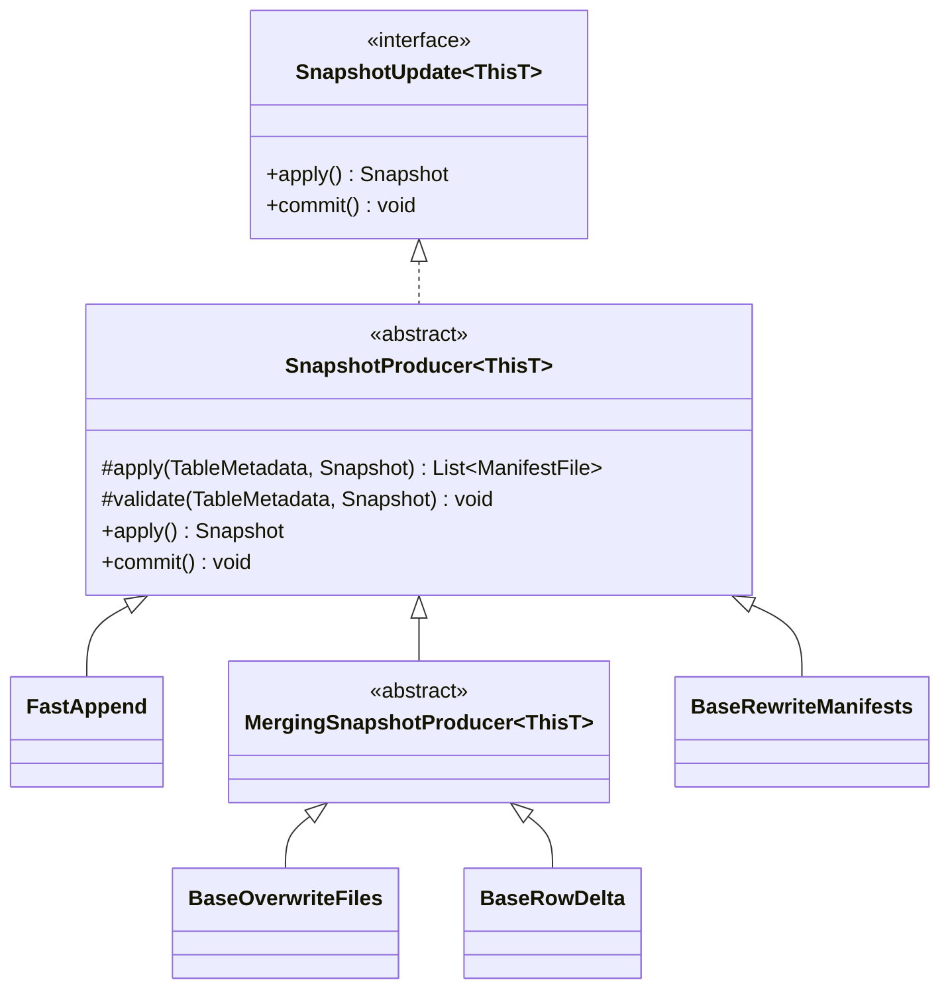
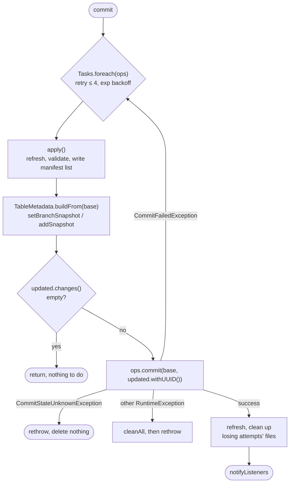

# Chapter 3.3 — `SnapshotProducer`: the life of a commit

<div class="chapter-meta" markdown>
**The question this chapter answers:** when you call `table.newAppend().appendFile(f).commit()`, what actually happens between that call and a new `metadata.json` existing in storage?

**Prerequisites:** Chapter 2.2 (`metadata.json` field by field), Chapter 2.3 (the manifest list), Chapter 3.2 (`TableMetadata` and `MetadataUpdate`)

**Source covered:** `core/.../SnapshotProducer.java`, `core/.../TableOperations.java`
</div>

## 1. The problem

Every write to an Iceberg table — append, overwrite, delete, rewrite — ends the same way: a new snapshot becomes the current one. That sounds like a single pointer assignment, and at the very bottom it is. Everything above it is the hard part.

A writer has to solve four problems at once:

1. **Build** the new snapshot: write a manifest list, assign a sequence number, compute the summary.
2. **Validate** that the change is still legal against whatever the table looks like *now* — which may have moved since the writer started.
3. **Swap** the table's current pointer atomically, losing to any concurrent writer that got there first.
4. **Clean up** the files it wrote if it lost — but *not* if it cannot tell whether it lost.

`SnapshotProducer` is the base class that solves all four, once, for every write operation in Iceberg. `FastAppend`, `MergeAppend`, `BaseOverwriteFiles`, `BaseRowDelta`, `BaseRewriteManifests` — they all inherit this machinery and fill in a single abstract method.

That is why this class is the right place to start reading Iceberg's core. Understand these two methods and you understand every write path in the project.

## 2. Where `SnapshotProducer` sits



Note the two `apply` methods. The public no-arg `apply()` is the template — it does the orchestration. The `protected abstract apply(TableMetadata, Snapshot)` is the interesting hole subclasses fill: *given the current metadata and parent snapshot, produce the list of manifests this snapshot should point at.*

It is not the only hole. `SnapshotProducer` declares five abstract methods, and `FastAppend` — the simplest subclass — implements all five:

| Abstract method | What the subclass supplies |
| --- | --- |
| `self()` | The fluent return type, so builder calls chain at the subclass type |
| `operation()` | The `DataOperations` string recorded in the snapshot |
| `summary()` | The snapshot summary map |
| `apply(TableMetadata, Snapshot)` | The manifests the new snapshot points at |
| `cleanUncommitted(Set<ManifestFile>)` | Which files to delete when an attempt loses |

Four of those are small — a type, a string, a map, a cleanup rule. `apply` carries the actual work, which is why it is the one worth reading: `FastAppend` returns the existing manifests plus one new one, `MergeAppend` returns a merged set. Everything else — sequence numbers, the manifest list file, retries, the retry loop's cleanup driver — is inherited.

## 3. `apply()` — materializing a candidate snapshot



Read it in five beats:

**Beat 1 — re-read the world.** `refresh()` is the first statement in the body, under the `@Override` and the signature. Not a cache check: this reloads table metadata from the catalog. By the time the last line of this method runs, `base` is the freshest metadata the writer has seen.

**Beat 2 — derive identity from that world.** The sequence number and parent snapshot ID are read *out of* `base`. They are not fields captured when the operation was created. Change `base`, and everything downstream changes with it.

**Beat 3 — validate, then delegate.** `runValidations(parentSnapshot)` runs the subclass's conflict checks (Chapter 3.5) plus ancestry validation:



Only after validation passes does the abstract `apply(base, parentSnapshot)` get called to produce the manifest list contents.

**Beat 4 — write the manifest list.** Read the `Tasks.range(...)` block carefully, because it is easy to misread as a parallel write. What runs on the worker pool is `manifestFiles[index] = manifestsWithMetadata.get(manifests.get(index))` — resolving each manifest to its metadata-enriched form, filling an array. The write itself is the single `writer.addAll(...)` on the line after, and it is serial. The parallelism is in preparing the entries, not in emitting them.

Note also `manifestLists.add(manifestList.location())` — the producer is *bookkeeping every manifest list it writes*. That list matters in section 7.

**Beat 5 — return an in-memory snapshot.** `new BaseSnapshot(...)`. Nothing has been committed. No table pointer has moved. This is a *candidate*: a fully materialized snapshot, with real files on disk, that may still be thrown away.

!!! note "Format version 3 in the middle of it"
    The `if (base.formatVersion() >= 3)` block computes `nextRowId` and `assignedRows`. This is row lineage — V3's mechanism for tracking rows across rewrites, covered in Chapter 2.5. Note that it reads `base.nextRowId()` and the writer's own `writer.nextRowId()`: the row ID range is allocated per snapshot, from the table's running counter. Another reason a retry cannot reuse the previous attempt's work.

## 4. `commit()` — the retry loop



The shape of it:



Four things are worth stopping on.

**The retry policy is table configuration, not a constant.** `COMMIT_NUM_RETRIES` defaults to `4`, with exponential backoff from `100 ms` to `60 s`, capped at `30 min` total. All four are table properties — a table under heavy concurrent write pressure is tuned here.

**`onlyRetryOn(CommitFailedException.class)`.** This is the entire concurrency contract in one line. `CommitFailedException` means *"the base you committed against is no longer current"* — someone else won, and retrying is correct. Any other exception means something is actually broken, and retrying would be wrong.

**The no-op short circuit.** `if (updated.changes().isEmpty()) return;` — with a comment noting the check uses *identity*. Setting the current snapshot to the ID that is already current produces no change, and Iceberg declines to write a new metadata file for it. Worth remembering when a commit appears to "succeed" but the snapshot log did not grow.

**`withUUID()` on every attempt.** The comment explains why: if a concurrent operation assigns the table UUID first, this operation must not fail because of it. The UUID is re-derived per attempt rather than captured once.

## 5. Why `apply()` lives *inside* the loop

This is the single most important structural fact in the chapter, and it is easy to read past.

`Snapshot newSnapshot = apply();` is the first statement **inside** the retried lambda. Every retry re-runs the whole of section 3: refresh, re-read the sequence number, re-run validations, **write a brand new manifest list file**.

The tempting design — build the snapshot once, then retry only the pointer swap — is wrong, and specifically it is wrong in a way that corrupts tables rather than merely failing:

<div class="grid cards" markdown>

-   **Sequence numbers would collide**

    `base.nextSequenceNumber()` was read from stale metadata. The winning writer already consumed that number.

-   **Validations would be vacuous**

    A conflict check that ran against metadata from before the concurrent commit has verified nothing about the table you are about to write to.

-   **The parent would be wrong**

    The new snapshot would claim a parent that is no longer the branch head, silently branching the lineage.

</div>

So retries are genuinely expensive: each one rewrites a manifest list, and for `MergeAppend` may rewrite merged manifests too. That cost is the price of correctness under optimistic concurrency, and it is why `commit.retry.num-retries` is a tuning knob rather than a hardcoded large number.

## 6. When the outcome is unknown

The exception handling is ordered deliberately:

```java
} catch (CommitStateUnknownException commitStateUnknownException) {
  throw commitStateUnknownException;
} catch (RuntimeException e) {
  if (!strictCleanup || e instanceof CleanableFailure) {
    Exceptions.suppressAndThrow(e, this::cleanAll);
  }
  throw e;
}
```

`CommitStateUnknownException` is caught *first* and rethrown having deleted **nothing**. The contract that forces this is documented on the method the producer is calling:



The reasoning: if a network partition swallowed the catalog's confirmation, the commit may well have *succeeded*. The files this producer wrote may now be referenced by a live snapshot. Deleting them would corrupt a committed table. So Iceberg leaks the files instead and tells the operator to resolve it later — which is what `CommitStateUnknownException`'s message says in full:

> *Cannot determine whether the commit was successful or not... Manual intervention via the Remove Orphan Files Action can remove these files when a connection to the Catalog can be re-established... At this time no files will be deleted including possibly unused manifest lists.*

**Leaked storage is recoverable. A corrupted table is not.** That tradeoff, made explicit here, shows up repeatedly in Iceberg's design.

## 7. Cleanup across attempts

After a successful commit, `commit()` does something subtle:

```java
Snapshot saved = ops.refresh().snapshot(newSnapshotId.get());
if (saved != null) {
  if (cleanupAfterCommit()) {
    cleanUncommitted(Sets.newHashSet(saved.allManifests(ops.io())));
  }
  for (String manifestList : manifestLists) {
    if (!saved.manifestListLocation().equals(manifestList)) {
      deleteFile(manifestList);
    }
  }
}
```

Recall that every retry wrote its own manifest list, and `apply()` recorded each in `manifestLists`. Exactly one of them is referenced by the snapshot that won. This loop deletes the rest.

Two defensive details:

- The snapshot is re-loaded **by ID** after a `refresh()`, not taken from the local variable. The comment explains: another commit may have landed between this commit and the refresh, so the branch head is not necessarily this snapshot. Looking it up by ID is the only way to be sure this attempt's snapshot is the one being cleaned around.
- If `saved` is `null` — the refresh failed to see the just-written snapshot, plausible under eventual consistency on object storage — cleanup is **skipped entirely** with a warning. Same principle as section 6: when unsure, delete nothing.

The whole post-commit block is wrapped in `catch (Throwable e)` that only logs. Once the catalog swap succeeds, the commit *has happened*; no subsequent failure is allowed to turn it into an error for the caller. `notifyListeners()` is wrapped the same way.

## 8. Gotchas

!!! warning "`apply()` is public, and calling it has side effects"
    `SnapshotUpdate.apply()` is part of the public API and looks like a dry run. It is not: it writes a manifest list file to storage every time it is called. Calling `apply()` to "preview" a snapshot and then never committing leaks that file.

!!! warning "Retries multiply written bytes"
    Under contention, N retries write N manifest lists — and for merging producers, N sets of merged manifests. A hot table with many concurrent writers can spend far more I/O on losing attempts than on the winner. This is the symptom that leads people to `commit.retry.*` tuning, and further, to partitioning strategies that reduce writer overlap.

!!! warning "`CommitStateUnknownException` requires operator action"
    It is not retryable and not cleanable. It means: go check whether the commit landed, before anyone retries. Retrying an already-successful operation duplicates records.

!!! note "`stageOnly` skips the branch pointer"
    `update.addSnapshot(newSnapshot)` instead of `setBranchSnapshot(...)`. The snapshot is added to metadata but no branch points at it. That is a **staged commit**, and it is the mechanism behind write-audit-publish: a job writes a snapshot nobody can see, a separate process reads it by ID and checks it, and only then does something move a branch onto it. The alternative — publish first, validate second — has no state in which the data is both durable and invisible, which is the state the whole pattern needs. Chapter 3.2 §4 covers the ref move that ends it.

## Key takeaways

- `SnapshotProducer` implements the entire write lifecycle; subclasses fill five abstract methods, of which only `apply(TableMetadata, Snapshot)` — returning the manifests for the new snapshot — carries real work.
- `apply()` builds a *candidate* — real files, no commit. `commit()` is the atomic pointer swap, retried on `CommitFailedException`.
- `apply()` runs inside the retry loop by necessity: sequence numbers, parent IDs, row ID ranges, and validations all derive from freshly refreshed metadata.
- Every attempt writes a manifest list; the successful commit cleans up the losers by comparing against the snapshot re-loaded by ID.
- When commit state is unknown, Iceberg deletes nothing. Leaked files are recoverable; a corrupted table is not.

## Source map

| What | File |
| --- | --- |
| `SnapshotProducer` | [`core/.../SnapshotProducer.java`](https://github.com/apache/iceberg/blob/apache-iceberg-1.11.0/core/src/main/java/org/apache/iceberg/SnapshotProducer.java) |
| `TableOperations` commit contract | [`core/.../TableOperations.java`](https://github.com/apache/iceberg/blob/apache-iceberg-1.11.0/core/src/main/java/org/apache/iceberg/TableOperations.java) |
| Retry defaults | [`core/.../TableProperties.java`](https://github.com/apache/iceberg/blob/apache-iceberg-1.11.0/core/src/main/java/org/apache/iceberg/TableProperties.java) |
| `CommitStateUnknownException` | [`api/.../exceptions/CommitStateUnknownException.java`](https://github.com/apache/iceberg/blob/apache-iceberg-1.11.0/api/src/main/java/org/apache/iceberg/exceptions/CommitStateUnknownException.java) |
| Simplest subclass, to see the contract | [`core/.../FastAppend.java`](https://github.com/apache/iceberg/blob/apache-iceberg-1.11.0/core/src/main/java/org/apache/iceberg/FastAppend.java) |

**Next:** Chapter 3.4 opens `ops.commit(base, updated)` — the protocol every catalog's `doCommit` is wrapped in, and what an honest compare-and-swap looks like in a store that offers one. Which catalogs actually offer one, and how the rest leak, is the audit in Chapter 6.2.
