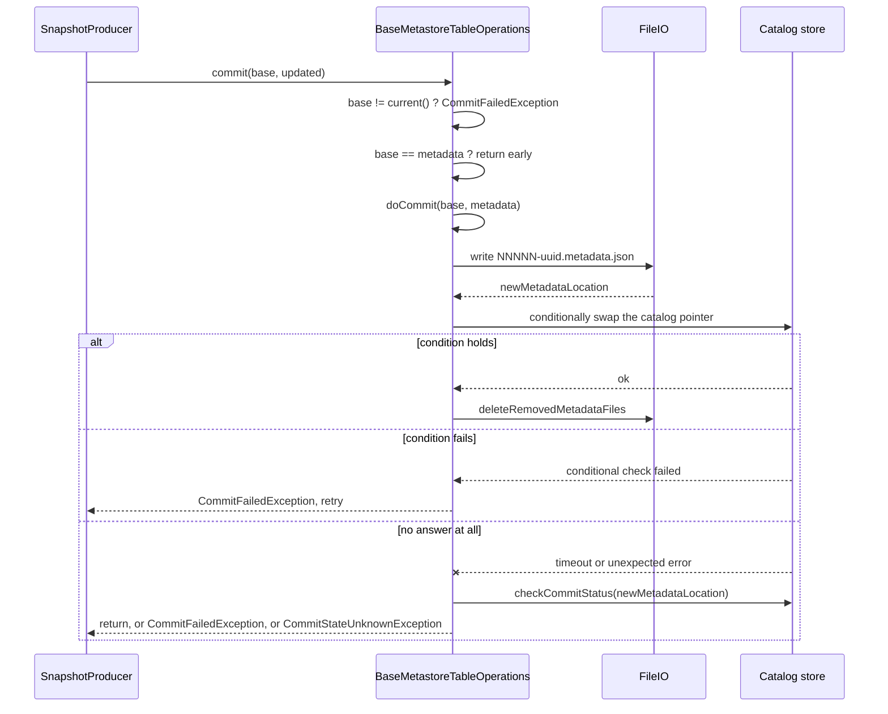

# Chapter 3.4 — The commit protocol: CAS, retries, and where atomicity comes from

<div class="chapter-meta" markdown>
**The question this chapter answers:** Chapter 3.3 ended at `ops.commit(base, updated)`. What happens inside it, and which component in the stack is actually performing an atomic compare-and-swap?

**Prerequisites:** Chapter 3.3 (`SnapshotProducer`), Chapter 3.2 (`TableMetadata.Builder`), Chapter 3.1 (`TableOperations` and `FileIO`)

**Source covered:** `core/.../BaseMetastoreTableOperations.java`, `core/.../BaseMetastoreOperations.java`, `aws/.../DynamoDbTableOperations.java`
</div>

## 1. The problem

Chapter 3.3 ended at `ops.commit(base, updated)` with the catalog side unopened. This chapter opens it, and it opens exactly half of it: the protocol `BaseMetastoreTableOperations` wraps around every catalog's `doCommit`, and what an honest compare-and-swap looks like in a store that offers one. Whether a *given* catalog's swap is genuinely atomic — and how the ones without a conditional write leak — is the audit in Chapter 6.2.

Chapter 3.1 established the constraint that makes it hard. `FileIO` declares three methods: read a file, write a file, delete a file. No rename, no conditional put, no listing. Iceberg refuses to let storage be the source of atomicity, because on object storage it cannot be. So the atomic swap has to come from the catalog, and the catalog is a piece of software Iceberg does not own.

Optimistic concurrency needs one primitive: an operation that sets a value *only if* it still holds the value you read. Everything Chapter 3.3 built — the retry loop, the candidate snapshot, the cleanup rules — assumes such an operation exists somewhere below `ops.commit`. This chapter finds it.

That leaves the core with three jobs. Define the file the pointer points at. Define the protocol a catalog must follow to move that pointer. And define what everybody does when the catalog's answer never arrives — because on a network, *a failed call is not evidence of a failed commit*. That last one is why "did it commit?" is answered by a three-valued enum instead of a boolean, and it is where most of this chapter goes.

## 2. The shape of a commit



Two different checks appear in that diagram and only the second one is atomic. Section 3 is the first; section 5 is the second.

## 3. The pre-check that is not the swap



The first statement is `if (base != current())` — reference inequality, in the local JVM, against a field. No network call has happened yet.

This is a fail-fast guard, not the concurrency mechanism. It is correct only because of two facts established earlier: the producer obtained `base` from `ops.refresh()` on this very object (Chapter 3.3, the first statement in `apply()`), and `TableMetadata.build()` returns `base` unchanged when nothing changed (Chapter 3.2). Given those, identity is a sound proxy for "still current" and it costs nothing.

The branch inside is the interesting part. If `base` is non-null, a stale base means someone else committed: `CommitFailedException`, which Chapter 3.3's retry loop is listening for. If `base` is null, the caller was trying to *create* the table and the table exists, so the answer is `AlreadyExistsException` — not retryable, because retrying will not make the table stop existing. Two different failures wearing the same symptom, separated by one null check.

Then `if (base == metadata) return;` — the no-op short circuit, again on identity, again free because of Chapter 3.2.

Everything real happens in `doCommit`, which this class does not implement. The two lines after it are cleanup and bookkeeping: `CatalogUtil.deleteRemovedMetadataFiles` trims old metadata files, and `requestRefresh()` marks the cached metadata stale so the next `current()` reloads.

That reload is not a bare read. `refreshFromMetadataLocation` wraps it in `Tasks.foreach(newLocation).retry(20).exponentialBackoff(100, 5000, 600000, 4.0)`, stopping early only on `NotFoundException` — the file was written moments ago and object storage may not be showing it yet. Having read it, the method asserts something stronger than freshness: that the refreshed metadata's `uuid()` equals the one already loaded, failing with `Table UUID does not match: current=%s != refreshed=%s`. A catalog entry that suddenly points at metadata carrying a different table UUID is not a new version of this table; it is a *different table* wearing its name — dropped and recreated, or a location collision. Committing into it would be worse than failing.

## 4. Naming the file before swapping the pointer

A pointer needs something to point at, and the new state must exist in storage *before* the swap, not after.



`writeNewMetadataIfRequired` carries a branch worth naming: when the commit is *creating* a table and the metadata already has a `metadataFileLocation()`, it adopts that file instead of writing a new one. That is the path behind `register_table` — taking an existing metadata file into a catalog without rewriting it. Every other commit falls through to `writeNewMetadata`, where two decisions are recorded. The first is `currentVersion() + 1`: metadata files are numbered, and the number comes from the version this operations object last loaded. The second is in the comment:

```java
// use overwrite to avoid negative caching in S3. this is safe because the metadata location is
// always unique because it includes a UUID.
TableMetadataParser.overwrite(metadata, newMetadataLocation);
```

`overwrite` rather than create-if-absent, because S3 caches 404s and a create-style write can require a preceding HEAD that poisons the cache. It is safe only because the name is unique — which brings us to the naming:



`String.format(Locale.ROOT, "%05d-%s%s", newVersion, UUID.randomUUID(), fileExtension)` — a five-digit zero-padded version, a random UUID, and an extension that depends on `write.metadata.compression-codec` (default `none`, so `.metadata.json`; set it to `gzip` and you get `.gz.metadata.json`).

The version prefix is decoration for humans *and* load-bearing for `parseVersion`, which reads it back. Note both failure returns: no `-` after the last `/` gives `-1` with the comment "found filesystem table's metadata", and an unparseable prefix gives `-1` with a warning. The javadoc states the meaning of `-1`: the metadata "is not part of this catalog". A `HadoopCatalog`-style table uses `v3.metadata.json`; a metastore catalog reading that location knows immediately it is looking at someone else's file.

## 5. The swap itself

`doCommit` is where a catalog earns the word "atomic". Read a conditional-write catalog as the specimen — the shape recurs wherever the store offers a real conditional write, and the specifics of `HadoopCatalog` and `HiveCatalog` get their own audit in Chapter 6.2:



Four structural features are worth naming, because every correct `doCommit` has them.

**`commitStatus` starts at `FAILURE`.** Not `UNKNOWN`, not a boolean. It is set to `SUCCESS` only on the line after `persistTable` returns normally. Any escape from the `try` block leaves it pessimistic.

**Explicit `CommitFailedException`s pass straight through.** `catch (CommitFailedException e) { throw e; }` with the comment "any explicit commit failures are passed up and out to the retry handler". `checkMetadataLocation` throws this when the stored `metadata_location` no longer matches `base`; that is a known-lost race and needs no investigation.

**The conditional failure is the CAS.** `persistTable` issues an `UpdateItem` carrying `conditionExpression(COL_VERSION + " = :v")`, with `:v` bound to the value of the item's `v` attribute read a few lines earlier — and the same update rewrites `v` to a fresh `UUID.randomUUID()`. So the condition is not on the metadata location at all; it is on an opaque per-row version token, which is *stricter*: any concurrent write to this catalog entry invalidates it, not only one that moved the metadata pointer. (Creating a table conditions on `attribute_not_exists(v)` instead — the same idea with no prior value to name.) `ConditionalCheckFailedException` means the condition did not hold — a genuine, provable conflict.

**Everything else is caught once, and sorted by a boolean.** There is no second `catch` clause for `ConditionalCheckFailedException`. After the `CommitFailedException` rethrow there is exactly one `catch (RuntimeException persistFailure)`, whose first line is `boolean conditionCheckFailed = persistFailure instanceof ConditionalCheckFailedException`. That flag then does two separate jobs, and the second is easy to read past.

Its first job gates reconciliation — `if (!conditionCheckFailed || retryDetector.retried())` calls `checkCommitStatus`. So an ordinary lost race, a conditional failure with no SDK retry behind it, **skips the status check entirely** and carries the seeded `FAILURE` forward. Iceberg does not investigate a conflict it can already prove.

Its second job is a guard standing in front of the three-way `switch`:

```java
if (commitStatus != CommitStatus.SUCCESS && conditionCheckFailed) {
  throw new CommitFailedException(
      persistFailure, "Cannot commit %s: concurrent update detected", tableName());
}
```

Section 7 reads what that guard does to the `switch` underneath it.

The `finally` block deletes the metadata file it wrote, but only when `commitStatus == FAILURE`. On `SUCCESS` the file is live. On `UNKNOWN` it may be live. Chapter 3.3 made the same call one layer up: when unsure, delete nothing.

Note also what happens *before* the conditional write. `checkMetadataLocation(table, base)` reads the stored metadata location and compares it against `base.metadataFileLocation()`, throwing `CommitFailedException` if they differ. That is a second optimistic check — this time against the real store rather than a local field — and it exists to lose cheaply. Without it, a doomed commit would still issue the write and learn its fate from an exception; with it, most lost races are settled by a read. It is emphatically not the swap: it is a plain `GetItem`, and another writer can land in the gap between it and the `UpdateItem`. Catching that gap is the version condition's whole job.

## 6. Asking the catalog what happened



The initial value is the answer: `AtomicReference<CommitStatus> status = new AtomicReference<>(CommitStatus.UNKNOWN)`. `SUCCESS` and `FAILURE` are only ever written from *inside* a check that completed. The loop runs up to `commit.status-check.num-retries` times — default 3 — with exponential backoff from 1 second to 1 minute, capped at 30 minutes total, and it uses `suppressFailureWhenFinished()`. So if every attempt to look at the table throws, the seeded `UNKNOWN` survives and the closing `LOG.error` explains itself: "Cannot determine commit state... Treating commit state as unknown."

What counts as "did it commit" is supplied by the caller:



`checkCurrentMetadataLocation` refreshes and then checks two things: whether the new location is the *current* pointer, **or** whether it appears anywhere in `metadata.previousFiles()`. The javadoc on both wrappers explains why the second clause is not optional — "Past locations must also be searched on the chance that a second committer was able to successfully commit on top of our commit." Your commit landed and then someone else's landed on top of it. The current pointer is not yours, and you still succeeded.

Which of the two a catalog reaches for is visible in its source and worth checking before you trust one. `GlueTableOperations` and `DynamoDbTableOperations` call `checkCommitStatus`. `HiveTableOperations` calls both, choosing between them by the kind of failure it caught: a metastore error whose message names `metadata_location` proves that no request still in flight can succeed later, so it takes the strict variant; anything it cannot classify gets the lenient one. Chapter 6.2 reads `HiveTableOperations.doCommit` end to end.

The two wrappers differ in exactly one respect, and it is a policy decision rather than a mechanism. When the location is nowhere to be found, `checkCommitStatusStrict` returns `FAILURE` — "we can be sure that no retry attempts for the commit will be successful later". `checkCommitStatus` downgrades that same result to `UNKNOWN`, because "possible pending retries might still commit the change". A caller picks the strict variant only when it can rule out an in-flight retry of its own write.

## 7. Three answers, three behaviours

| `CommitStatus` | What the `switch` throws | Producer deletes its files? | Retried? |
| --- | --- | --- | --- |
| `SUCCESS` | nothing — the original exception is swallowed | only the losing attempts, after refresh | no |
| `FAILURE` | `CommitFailedException` | yes — it is a `CleanableFailure` | yes, up to `commit.retry.num-retries` |
| `UNKNOWN` | `CommitStateUnknownException` — **unreachable when the failure was a conditional check**, which section 5's guard turns into `CommitFailedException` before the `switch` is entered | **no** | no |

The middle row is ordinary optimistic concurrency. The top row is the subtle one: an exception was raised, the commit succeeded anyway, and the correct response is to return normally as though nothing happened. The bottom row is the one that reaches a human, and Chapter 3.3 explained the reasoning — leaked storage is recoverable, a corrupted table is not.

That table is the `switch`, and the `switch` is not the last word. Section 5's guard stands in front of it, so **a conditional failure never reaches the `UNKNOWN` arm**: once `conditionCheckFailed` is true, any status other than `SUCCESS` — including an `UNKNOWN` that `checkCommitStatus` returned because it could not read the table at all — is thrown as `CommitFailedException`, which is retryable and a `CleanableFailure`. The bottom row is reached only when the failure was *not* a conditional one. `GlueTableOperations` has the identical shape with `isAwsServiceException` in place of `conditionCheckFailed`, routing through `handleAWSExceptions` rather than throwing inline, so this is the pattern rather than one catalog's quirk.

Read that as a deliberate ordering. A failed condition is proof the write did not land, and proof outranks a probe — but the proof is only as good as the assumption that the SDK did not already succeed on an earlier attempt, which is exactly what `retryDetector` exists to detect.

Every row of that table is reachable from a single `doCommit`, which is why `checkCommitStatus` returns an enum instead of throwing. The caller has to make the decision, and the decision depends on catalog-specific knowledge the shared code does not have.

This is the protocol every catalog is expected to implement. Whether a given catalog *can* — whether its swap genuinely is atomic, or quietly is not — comes down to whether the store underneath offers a real conditional write. A catalog with one gets the protocol almost for free. A catalog without one has to borrow atomicity from somewhere else — a metastore lock, or a filesystem rename that fails when the destination already exists — and each substitute fails differently. (`version-hint.text` is not one of the substitutes, whatever its name suggests: `HadoopTableOperations` writes it *after* the rename that already committed, under the comment "update the best-effort version pointer", and swallows any `IOException` with a warning.) Chapter 6.2 audits `HadoopCatalog` and `HiveCatalog` on exactly that question.

## 8. Gotchas

!!! warning "The pre-check compares references, not values"
    `base != current()` is identity comparison. Hand a producer a `TableMetadata` that was deserialized, or loaded through a *different* `TableOperations` instance, and this check fails on a table that is perfectly current — with the misleading message "Cannot commit: stale table metadata". The guard is an optimisation that assumes the whole commit ran through one operations object.

!!! warning "A conditional-check failure is not proof of failure once the SDK has retried"
    `DynamoDbTableOperations` carries a `RetryDetector` and only believes a `ConditionalCheckFailedException` when `!retryDetector.retried()`. The comment names the failure mode: the SDK may have retried internally, the *first* attempt may have succeeded, and the retry then fails its own condition — against your own commit. Believing it would send the writer round the retry loop to redo work that already landed. `GlueTableOperations` carries the same guard for `AwsServiceException`. Any catalog client with transparent internal retries needs this, and it is easy to omit.

!!! warning "`UNKNOWN` means the status check failed, not that the commit failed"
    The seeded value survives when every check throws. It is the honest answer — nobody was able to look — but it reaches the caller as `CommitStateUnknownException`, which is not retryable and not cleanable. Choosing `checkCommitStatus` where `checkCommitStatusStrict` was correct converts a clean failure into operator toil; choosing the strict one where a retry may still be in flight risks deleting files that a pending write is about to reference.

!!! note "The `doCommit` shape recurs, but it is a family resemblance, not a rule"
    `GlueTableOperations`, `DynamoDbTableOperations`, `JdbcTableOperations`, `HiveTableOperations` and `NessieTableOperations` all extend `BaseMetastoreTableOperations`, but only Glue and Dynamo make all three of the specimen's moves — status seeded to `FAILURE`, one conditional operation, a three-way mapping onto an exception. Each of the others drops one. `HiveTableOperations` seeds pessimistically and reconciles like the specimen, but the operation it issues is conditional only when Hive locking is *off*: it passes `hiveLockEnabled(base, conf) ? null : baseMetadataLocation` as the expected value, and `HIVE_LOCK_ENABLED_DEFAULT` is `true`, so by default exclusion comes from an HMS lock rather than a CAS. `JdbcTableOperations` has no `CommitStatus` at all — its swap is `UPDATE … WHERE metadata_location = ?` and it decides by counting rows, `updatedRecords == 1` or `CommitFailedException`, with no unknown state to report. `NessieTableOperations` seeds *optimistically*, `boolean failure = false`, and raises the flag only inside the catch blocks it recognises. Find `doCommit` first when reading an unfamiliar integration — then read it for which of the three moves it actually makes.

!!! note "Two implementations skip `doCommit` entirely"
    `RESTTableOperations` and `HadoopTableOperations` both implement `TableOperations` directly and override `commit` rather than extending `BaseMetastoreTableOperations`. Their reasons differ: for a REST catalog the conditional check runs on the server (Chapters 6.3 and 6.4), while `HadoopTableOperations` has no catalog entry to swap — its commit is a `FileSystem.rename` onto `v<N>.metadata.json`, with the version taken from the directory rather than from a stored pointer (Chapter 6.2). Neither gets the retry, cleanup and status-check scaffolding read above; each rebuilds what it needs.

!!! note "Old metadata files are kept by default"
    `commit()` calls `CatalogUtil.deleteRemovedMetadataFiles` after `doCommit`, but `write.metadata.delete-after-commit.enabled` defaults to **false** while `write.metadata.previous-versions-max` defaults to 100 (both constants are injected in Chapter 2.1 §3). The metadata log inside the file is trimmed to 100 entries; the files that fell off the end stay in storage forever. When deletion *is* enabled it runs after the swap has already succeeded, which looks like a violation of the `TableOperations` javadoc — "implementations must not perform any operations that may fail" once the commit lands. It is not, because `CatalogUtil.deleteFiles` runs under `Tasks...suppressFailureWhenFinished()` and logs rather than throws.

## Key takeaways

- `BaseMetastoreTableOperations.commit` performs a local identity check, not the atomic operation; its job is to fail fast and to tell a stale commit apart from a duplicate create.
- The new `metadata.json` is written before the swap, named `%05d-<uuid>` so the version is parseable and the name is unique enough for an overwrite-style write on S3.
- The real compare-and-swap is a single conditional operation inside `doCommit`, and what it is conditioned on is the catalog's own business — DynamoDB an opaque row version, JDBC a `WHERE metadata_location = ?`, Hive a lock or an expected-parameter comparison. The metadata-location comparison in the shared code is only the pre-check.
- A commit whose outcome is unclear is reconciled by re-reading the table and searching both the current pointer and `previousFiles()` — because another writer may have committed on top of your success.
- `writeNewMetadataIfRequired` adopts an existing metadata file when creating a table, which is the mechanism behind `register_table`.
- `CommitStatus` is three-valued because a network failure is not evidence: `FAILURE` retries, `SUCCESS` swallows the exception, `UNKNOWN` deletes nothing and escalates to a human.

## Source map

| What | File |
| --- | --- |
| The commit entry point | [`core/.../BaseMetastoreTableOperations.java`](https://github.com/apache/iceberg/blob/apache-iceberg-1.11.0/core/src/main/java/org/apache/iceberg/BaseMetastoreTableOperations.java) |
| `CommitStatus` and the status checks | [`core/.../BaseMetastoreOperations.java`](https://github.com/apache/iceberg/blob/apache-iceberg-1.11.0/core/src/main/java/org/apache/iceberg/BaseMetastoreOperations.java) |
| Status-check and retry tuning | [`core/.../TableProperties.java`](https://github.com/apache/iceberg/blob/apache-iceberg-1.11.0/core/src/main/java/org/apache/iceberg/TableProperties.java) |
| Post-commit metadata cleanup | [`core/.../CatalogUtil.java`](https://github.com/apache/iceberg/blob/apache-iceberg-1.11.0/core/src/main/java/org/apache/iceberg/CatalogUtil.java) |
| Metadata file extensions and codecs | [`core/.../TableMetadataParser.java`](https://github.com/apache/iceberg/blob/apache-iceberg-1.11.0/core/src/main/java/org/apache/iceberg/TableMetadataParser.java) |
| A conditional-write catalog, read as the specimen | [`aws/.../dynamodb/DynamoDbTableOperations.java`](https://github.com/apache/iceberg/blob/apache-iceberg-1.11.0/aws/src/main/java/org/apache/iceberg/aws/dynamodb/DynamoDbTableOperations.java) |
| The same shape with a lock in front of it | [`aws/.../glue/GlueTableOperations.java`](https://github.com/apache/iceberg/blob/apache-iceberg-1.11.0/aws/src/main/java/org/apache/iceberg/aws/glue/GlueTableOperations.java) |
| A catalog that commits server-side instead | [`core/.../rest/RESTTableOperations.java`](https://github.com/apache/iceberg/blob/apache-iceberg-1.11.0/core/src/main/java/org/apache/iceberg/rest/RESTTableOperations.java) |
| The exceptions | [`api/.../exceptions/CommitFailedException.java`](https://github.com/apache/iceberg/blob/apache-iceberg-1.11.0/api/src/main/java/org/apache/iceberg/exceptions/CommitFailedException.java), [`CommitStateUnknownException.java`](https://github.com/apache/iceberg/blob/apache-iceberg-1.11.0/api/src/main/java/org/apache/iceberg/exceptions/CommitStateUnknownException.java), [`CleanableFailure.java`](https://github.com/apache/iceberg/blob/apache-iceberg-1.11.0/api/src/main/java/org/apache/iceberg/exceptions/CleanableFailure.java) |

**Next:** Chapter 3.5 turns to the other way a commit can fail. Winning the compare-and-swap proves your base was current; it proves nothing about whether the change you computed is still correct.
