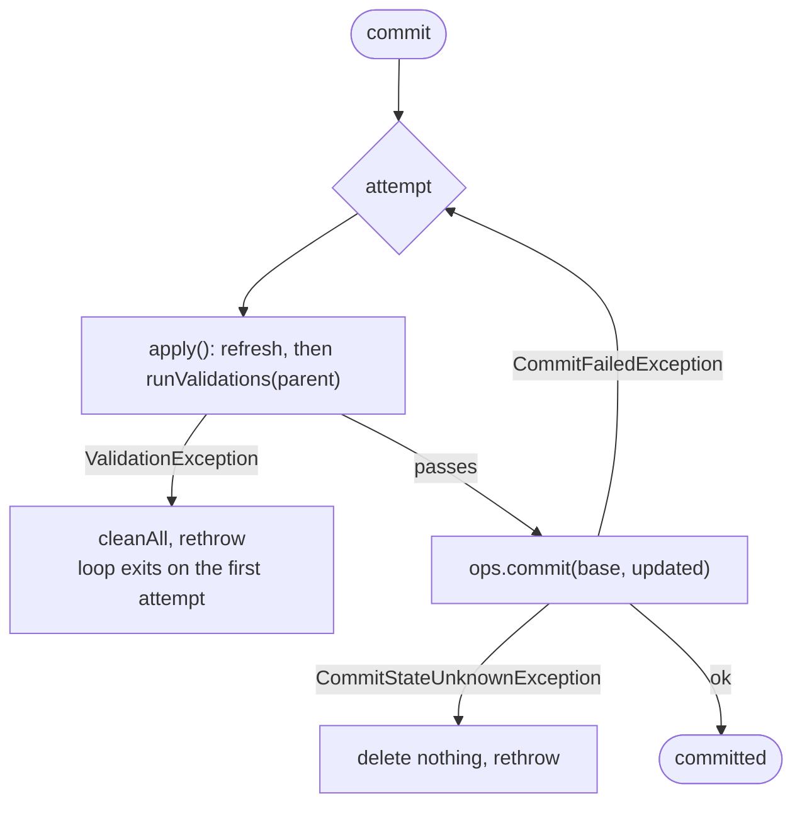

# Chapter 3.5 — Conflict detection and isolation levels

<div class="chapter-meta" markdown>
**The question this chapter answers:** two writers commit concurrently and the second one loses the compare-and-swap, retries, and wins it cleanly. What stops that retry from committing a change that is now wrong?

**Prerequisites:** Chapter 3.3 (`SnapshotProducer`, `runValidations`), Chapter 3.4 (the CAS and its exceptions), Chapter 2.4 (manifest entries and metrics)

**Source covered:** `core/.../MergingSnapshotProducer.java`, `core/.../BaseRowDelta.java`, `core/.../IsolationLevel.java`, `spark/v3.5/.../SparkPositionDeltaWrite.java`
</div>

## 1. The problem

Chapter 3.4 delivered a compare-and-swap that answers exactly one question: *is the metadata I based this commit on still the current metadata?* When the answer is no, Chapter 3.3's loop refreshes and tries again.

That question is not enough.

Take a `DELETE FROM t WHERE id = 5`. The engine plans a scan, finds the three data files that could contain `id = 5`, and builds a `RowDelta` that adds position deletes for them. While it is doing that, another writer appends a new data file that also contains `id = 5`. Our writer loses the CAS, refreshes, re-runs `apply()`, wins the second attempt — and commits a delete that misses rows, because the new file was never in the plan.

Nothing about the swap was wrong. The base was current at the instant of the swap. What went stale was not the metadata pointer but *the assumption the change was computed under*.

So Iceberg has two independent gates on a commit, and the whole part turns on keeping them apart. The CAS asks "is my base still the head?" and is retryable by definition. The `validate*` family asks "did anything commit since I read this table that would have changed what I computed?" — and is **not** retryable, because retrying re-runs the same doomed check against a table that has only moved further.

## 2. Two gates



Both failure edges out of the diagram are `CleanableFailure`, so both clean up the files they wrote. Only one of them re-enters the loop. Chapter 3.3 showed the single line that decides it: `.onlyRetryOn(CommitFailedException.class)`.

## 3. One hook, filled by each operation

`SnapshotProducer.runValidations` — read in Chapter 3.3 — does two things. It runs the ancestry validator, and it calls `validate(base, parentSnapshot)`. That method is declared on `SnapshotProducer` as `protected void validate(TableMetadata currentMetadata, Snapshot snapshot) {}` — an empty body. `FastAppend` never overrides it, which is correct: an append that adds files and asserts nothing about existing data cannot conflict with anything.

Every conflict rule in Iceberg lives behind that hook, in the operation subclasses. The commit machinery has no opinion about conflicts at all.

`MergingSnapshotProducer` supplies the reusable checks that those subclasses call. Before reading any of them, get the names straight, because there are two sets and they are confusingly similar.

## 4. The family, by name

The **implementations**, all `protected` on `MergingSnapshotProducer`:

| Method | Overloads | Fails when |
| --- | --- | --- |
| `validateAddedDataFiles` | `PartitionSet`, `Expression` | data files were *added* since the starting snapshot that match the filter or partitions |
| `validateDeletedDataFiles` | `Expression`, `PartitionSet` | data files were *removed* since the starting snapshot that match |
| `validateNoNewDeleteFiles` | `Expression`, `PartitionSet` | delete files were added that could apply to matching rows |
| `validateNoNewDeletesForDataFiles` | with and without a data filter; a private core overload takes `ignoreEqualityDeletes` | new deletes apply to specific data files this commit is replacing |
| `validateDataFilesExist` | one, with `skipDeletes` and a conflict filter | a data file this commit references was already removed by someone else |
| `validateAddedDVs` | one protected, one private per-manifest | a concurrent commit added a deletion vector for a data file this commit also adds a DV for |
| `validateNewDeleteFile` | one | a delete file is illegal for the table's format version — a precondition, not a conflict check |

The **opt-in flags**, on the api interfaces, which only set booleans: `OverwriteFiles.validateNoConflictingData()`, `validateNoConflictingDeletes()`, `validateAddedFilesMatchOverwriteFilter()`; `RowDelta.validateNoConflictingDataFiles()`, `validateNoConflictingDeleteFiles()`, `validateDeletedFiles()`, `validateDataFilesExist(Iterable)`; `ReplacePartitions.validateNoConflictingData()`, `validateNoConflictingDeletes()`, `validateAppendOnly()`. Plus `validateFromSnapshot(long)`, on all three, and `conflictDetectionFilter(Expression)`, on `RowDelta` and `OverwriteFiles` only — parameters rather than switches. `ReplacePartitions` has no conflict-detection filter, and does not need one: the partitions it is replacing *are* the predicate, which is why `BaseReplacePartitions.validate` hands the family a `PartitionSet` where the other two hand it an `Expression`.

Almost nothing validates by default. Most checks in the first table run only because a caller flipped a flag in the second — but three do not wait to be asked:

- `validateNewDeleteFile` runs from `add(DeleteFile, long)`, so on every delete file the commit accepts. It is the odd one out in the table for a reason: it asks whether a delete file is *legal* for this format version, which no flag should be able to switch off.
- `BaseRewriteFiles.validate` calls `validateNoNewDeletesForDataFiles` with no flag in front of it whenever the commit replaces data files. A rewrite that drops a file another writer has just attached deletes to loses those deletes under any isolation level, so there is nothing to opt into.
- `validateAddedDVs` sits outside every conditional in `BaseRowDelta.validate`. Section 7 comes back to it.

## 5. One check, read closely



Twenty-two lines, and the shape is shared by every member of the family: ask a private helper for an iterable of *conflicting entries*, and if it has a first element, throw. The exception names the offending files — `Iterators.transform(conflicts, entry -> entry.file().location().toString())` — because an operator's next question is always "which ones".

Two details are deliberate. The iterable is lazy and consumed inside try-with-resources, so a conflict short-circuits after the first matching entry rather than materialising the whole set. And `IOException` becomes `UncheckedIOException`, not `ValidationException` — a failure to *read* the manifests is not a finding of conflict, and must not be reported as one.

## 6. The engine underneath

Every check in the family funnels into one method:



Three filters, applied in order.

**By ancestry.** `SnapshotUtil.ancestorsBetween(parent.snapshotId(), startingSnapshotId, base::snapshot)` yields only the snapshots committed on this branch after the writer read the table.

**By operation.** `if (matchingOperations.contains(currentSnapshot.operation()))` — and the constants at the top of the file encode real knowledge about which operations can produce which conflict:



A concurrent `delete` cannot have added data files, so a check for added data files skips those snapshots entirely — without opening a single manifest.

**By authorship.** `if (manifest.snapshotId() == currentSnapshot.snapshotId())` keeps only the manifests a matching snapshot actually *wrote*. Snapshots inherit their predecessors' manifests; without this the same manifest would be scanned once per snapshot in the window.

Then the closing check, which is the one people meet in production:

```java
ValidationException.check(
    lastSnapshot == null || Objects.equals(lastSnapshot.parentId(), startingSnapshotId),
    "Cannot determine history between starting snapshot %s and the last known ancestor %s",
    startingSnapshotId,
    lastSnapshot != null ? lastSnapshot.snapshotId() : null);
```

The walk is supposed to terminate at the starting snapshot. If it does not — the starting snapshot was expired, or the branch was rolled back, or a cherry-pick reshaped the lineage — the writer cannot enumerate what happened in between and therefore cannot prove the absence of a conflict. It refuses rather than assuming there was none.

Everything downstream is a query over that slice: a `ManifestGroup` for data files, a `DeleteFileIndex` for delete files.

## 7. A caller, assembled



Five checks from the family, plus two things that are not checks from the family at all. Five checks is not five flags, though — read the nesting. `validateNoNewDeletesForDataFiles` and `validateNoNewDeleteFiles` share a single `if (validateNewDeleteFiles)`, which is why `RowDelta.validateNoConflictingDeleteFiles()` turns on two checks at once. And `validateAddedDVs` is the last statement in the method, outside every conditional, behind no flag at all.

That last one is guarded from the inside instead: its first lines return immediately unless `parent != null && !dvsByReferencedFile.isEmpty()`, so it costs nothing unless this commit is actually adding deletion vectors. When it is, the check is not negotiable — a deletion vector replaces a data file's whole delete state, so two writers each attaching one to the same data file would silently lose one set of deletes. There is no isolation level under which that is acceptable, so there is no flag.

`SnapshotUtil.isAncestorOf(parent.snapshotId(), startingSnapshotId, base::snapshot)` is a `Preconditions.checkArgument`, not a `ValidationException` — a starting snapshot that is not an ancestor of the head is a caller bug, not a concurrency event. And `validateNoConflictingFileAndPositionDeletes` is local to this class: it fails when the same commit both removes a data file and adds a delete file referencing it, which is a self-contradiction rather than a conflict with anyone else.

`BaseReplacePartitions.validate` is worth reading beside it for the overload pattern. It calls `validateAddedDataFiles(…, Expressions.alwaysTrue(), parent)` when the spec is unpartitioned and `validateAddedDataFiles(…, replacedPartitions, parent)` when it is not. That is what the `Expression`/`PartitionSet` pairs are for: the same question asked with whichever predicate the operation can express precisely.

## 8. Isolation levels



Two constants, a `fromName`, and no behaviour whatsoever. The semantics are entirely in the javadoc, and the sentence that matters is the last one: under serializable isolation an ongoing UPDATE/DELETE/MERGE "must fail" if a concurrent transaction adds a file that might contain matching rows, whereas under snapshot isolation the same operation "can still commit".

Where does that become code? In the engine integration:



`if (isolationLevel == SERIALIZABLE) { rowDelta.validateNoConflictingDataFiles(); }`. One call. That is the entire difference for a merge-on-read row-level operation — precisely the scenario from section 1, and precisely the check that would have caught it.

The rest of the block is as instructive. `validateDataFilesExist(referencedDataFiles)` runs at *both* levels, because a delete that references a file someone else already rewrote is broken under any isolation. `validateFromSnapshot(scan.snapshotId())` bounds the history walk to snapshots after the read, with a comment saying what happens otherwise: "the validation will go through all snapshots present in the table". And when `scan == null` — the optimizer replaced it with an empty relation — no validation runs at all, because there is no read to be serialized against.

Reading the same pattern out of `SparkWrite`, the full mapping is:

| Operation | `SNAPSHOT` enables | `SERIALIZABLE` adds |
| --- | --- | --- |
| position delta (MoR `UPDATE`/`DELETE`/`MERGE`) | `validateDataFilesExist`; for `UPDATE`/`MERGE` also `validateDeletedFiles` + `validateNoConflictingDeleteFiles` | `validateNoConflictingDataFiles` |
| overwrite by filter (CoW) | `validateNoConflictingDeletes` | `validateNoConflictingData` |
| dynamic partition overwrite | `validateNoConflictingDeletes` | `validateNoConflictingData` |

Isolation level is not a mode the core runs in. It is a name for a set of flags an integration turns on.

## 9. Why a validation failure is not a conflict

`ValidationException` implements `CleanableFailure` but does not extend `CommitFailedException`. Given `.onlyRetryOn(CommitFailedException.class)`, that single fact decides the behaviour: a failed check exits the loop on the first attempt, `cleanAll` deletes the manifests and manifest list the attempt wrote, and the exception reaches the caller.

This is right. The check compares the table against the snapshot the writer *read*. Refreshing and re-running it against a table that has moved further cannot make the conflict disappear — it can only find more of them. The fix is to re-plan the query, which only the engine above can do.

There is exactly one deliberate exception:



`TableMetadata.Builder.addSnapshot` raises this when a snapshot's sequence number or `first-row-id` is behind the table's current state — stale values, not a conflict, and a refresh fixes them. Chapter 3.2 met it from the builder's side. `CatalogHandlers.commit` catches it server-side and re-throws it as a `CommitFailedException`, with a comment explaining that server-side retry cannot help because the stale values are in the request itself. Only the client, after refreshing, can produce a valid one.

## 10. Gotchas

!!! warning "Without `validateFromSnapshot()`, validation walks the entire table history"
    `startingSnapshotId` defaults to `null` in `BaseRowDelta`, and the field comment says "check all versions by default". `startingSequenceNumber` then falls back to `TableMetadata.INITIAL_SEQUENCE_NUMBER` and `validationHistory` walks from the parent to the beginning of the branch. The behaviour is safe but the cost grows with the table's whole snapshot history. Spark avoids it by passing the scan's snapshot ID; a hand-written integration that forgets sees validation time climb quietly as the table ages.

!!! warning "Configured is not the same as performed"
    Every check opens with `if (parent == null) return;`, and the delete-oriented ones also return early on `base.formatVersion() < 2`. One level up, the Spark delta write skips validation entirely when `scan == null`. All three are correct — there is nothing to conflict with — but they mean a commit can be configured for serializable isolation and validate nothing. The commit log message is what distinguishes the cases: it reports either the scan snapshot, filter and isolation level, or the words "no validation required".

!!! warning "`validateDataFilesExist` and `validateNoConflictingDataFiles` fail differently on purpose"
    The first protects correctness of *this* commit: a delete file pointing at a data file that no longer exists is dangling. It runs at every isolation level. The second protects serializability: a new file that might match the predicate. It runs only under `SERIALIZABLE`. Conflating them leads people to weaken isolation and be surprised that `MERGE INTO` still fails — that failure was the first check, and it is not negotiable.

!!! note "Partition pruning of concurrent manifests gives up when a spec changed"
    `filterManifestsByPartition` prunes concurrent manifests with a `ManifestEvaluator` before scanning them, but first checks whether any of them carries a `partitionSpecId` other than the default and, if so, returns them all unpruned. The comment gives the reason: "to avoid incorrectly excluding manifests when a spec change happened during validation". A slower complete scan beats a fast wrong one — the same tradeoff Chapter 3.3 found in the cleanup path.

## Key takeaways

- The CAS proves your base was current. It proves nothing about whether the change you computed is still correct; that is the `validate*` family's job.
- Every conflict rule sits behind one hook, `SnapshotProducer.validate(base, parent)`, and almost all of them wait for a caller to opt in. The unflagged three are `validateAddedDVs`, `validateNoNewDeletesForDataFiles` inside `BaseRewriteFiles`, and the `validateNewDeleteFile` format-version precondition.
- All checks share one engine: `validationHistory` narrows to snapshots on this branch since the starting snapshot, filters them by operation type, and keeps only the manifests those snapshots wrote.
- `IsolationLevel` has no behaviour. `SERIALIZABLE` is one extra `validateNoConflictingDataFiles()` or `validateNoConflictingData()` call made by the engine integration.
- A `ValidationException` is not a `CommitFailedException`, so it leaves the retry loop immediately — retrying a validation against a table that has moved further can only find more conflicts, never fewer.

## Source map

| What | File |
| --- | --- |
| The validation family and its engine | [`core/.../MergingSnapshotProducer.java`](https://github.com/apache/iceberg/blob/apache-iceberg-1.11.0/core/src/main/java/org/apache/iceberg/MergingSnapshotProducer.java) |
| The hook they hang from | [`core/.../SnapshotProducer.java`](https://github.com/apache/iceberg/blob/apache-iceberg-1.11.0/core/src/main/java/org/apache/iceberg/SnapshotProducer.java) |
| Callers that assemble the family | [`core/.../BaseRowDelta.java`](https://github.com/apache/iceberg/blob/apache-iceberg-1.11.0/core/src/main/java/org/apache/iceberg/BaseRowDelta.java), [`BaseOverwriteFiles.java`](https://github.com/apache/iceberg/blob/apache-iceberg-1.11.0/core/src/main/java/org/apache/iceberg/BaseOverwriteFiles.java), [`BaseReplacePartitions.java`](https://github.com/apache/iceberg/blob/apache-iceberg-1.11.0/core/src/main/java/org/apache/iceberg/BaseReplacePartitions.java) |
| The opt-in flags, on the api side | [`api/.../RowDelta.java`](https://github.com/apache/iceberg/blob/apache-iceberg-1.11.0/api/src/main/java/org/apache/iceberg/RowDelta.java), [`OverwriteFiles.java`](https://github.com/apache/iceberg/blob/apache-iceberg-1.11.0/api/src/main/java/org/apache/iceberg/OverwriteFiles.java) |
| The two isolation levels | [`core/.../IsolationLevel.java`](https://github.com/apache/iceberg/blob/apache-iceberg-1.11.0/core/src/main/java/org/apache/iceberg/IsolationLevel.java) |
| Where a level becomes a call | [`spark/v3.5/.../SparkPositionDeltaWrite.java`](https://github.com/apache/iceberg/blob/apache-iceberg-1.11.0/spark/v3.5/spark/src/main/java/org/apache/iceberg/spark/source/SparkPositionDeltaWrite.java), [`SparkWrite.java`](https://github.com/apache/iceberg/blob/apache-iceberg-1.11.0/spark/v3.5/spark/src/main/java/org/apache/iceberg/spark/source/SparkWrite.java) |
| Ancestry helpers | [`core/.../util/SnapshotUtil.java`](https://github.com/apache/iceberg/blob/apache-iceberg-1.11.0/core/src/main/java/org/apache/iceberg/util/SnapshotUtil.java) |
| Exception taxonomy | [`api/.../exceptions/ValidationException.java`](https://github.com/apache/iceberg/blob/apache-iceberg-1.11.0/api/src/main/java/org/apache/iceberg/exceptions/ValidationException.java), [`CleanableFailure.java`](https://github.com/apache/iceberg/blob/apache-iceberg-1.11.0/api/src/main/java/org/apache/iceberg/exceptions/CleanableFailure.java), [`core/.../RetryableValidationException.java`](https://github.com/apache/iceberg/blob/apache-iceberg-1.11.0/core/src/main/java/org/apache/iceberg/RetryableValidationException.java) |

**Next:** Part 4 turns from writing to reading — how a scan uses the same manifest metadata these checks query, to skip files instead of to reject commits.
