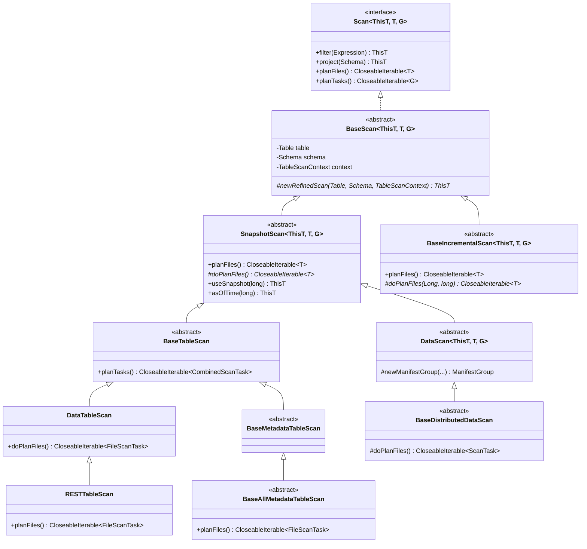
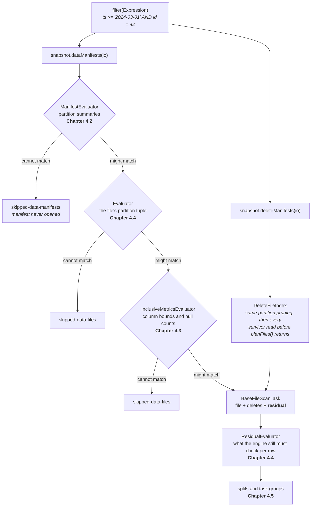

# Chapter 4.1 — `TableScan` and `planFiles`

**The question this chapter answers:** when you call `table.newScan().filter(expr).planFiles()`, what code runs, in what order, and where does the file list actually come from?

**Prerequisites:** Chapter 2.3 (the manifest list), Chapter 2.4 (the manifest file and its column metrics), Chapter 3.1 (the core abstractions)

**Source covered:** `core/.../BaseScan.java`, `core/.../TableScanContext.java`, `core/.../SnapshotScan.java`, `core/.../DataTableScan.java`

## 1. The problem

A query engine arrives with two things: an expression and a list of columns. It wants back a list of files small enough to be worth reading. Nothing about that is trivial.

The table it is asking about may hold millions of data files across thousands of manifests, written under several partition specs and several schemas, some of them shadowed by delete files. The expression is written against *column names in the current schema*. The files are described by *partition tuples and byte-serialised bounds*. Between the question and the answer sit four filtering stages, two projections, a per-spec cache, and an optional thread pool.

Part 4 is that machinery, read end to end. This chapter is the frame: the classes that hold the request, the method that orchestrates planning, and the abstract hole that almost every scan variant fills differently.

The thing worth noticing early is how little the scan classes actually do. `DataTableScan.doPlanFiles()` is thirty lines, and twenty-eight of them are configuration. The algorithm lives in `ManifestGroup`, which Chapters 4.2 through 4.4 take apart. The scan hierarchy is wiring.

## 2. Where the scan classes sit

Read the hierarchy for where `planFiles` and `doPlanFiles` land, because that is the whole design.

`SnapshotScan.planFiles()` is the template: it owns the lifecycle every scan of a *single snapshot* shares, and the ordinary data scan, the metadata tables and the distributed scan supply only `doPlanFiles()`. `BaseTableScan` is a thin package-private class whose only real contribution is `planTasks()` (Chapter 4.5) and a refusal to do incremental scans.

That is the same shape as `SnapshotProducer` in Chapter 3.3: a public template method that owns the lifecycle, and one protected abstract method that subclasses fill. Iceberg uses this pattern in both directions — once for writes, once for reads.

It is a template, not a monopoly, and both exceptions matter for reading the rest of Part 4.

**A second template.** `BaseIncrementalScan` extends `BaseScan` directly rather than `SnapshotScan`, and implements its own `planFiles()` over a two-argument `doPlanFiles(fromSnapshotIdExclusive, toSnapshotIdInclusive)`. An incremental scan has no single snapshot to resolve — it has a range — so beat 1 of section 4 does not apply to it, and neither does the `ScanReport` plumbing in beat 5; it notifies an `IncrementalScanEvent` instead and returns `doPlanFiles(...)` unwrapped. `BaseIncrementalAppendScan` and `BaseIncrementalChangelogScan` are its subclasses.

**Eight overrides.** Eight classes in `core` re-implement `planFiles()` rather than fill in `doPlanFiles()`, and each replaces a specific beat of the template:

- The four static metadata scans — `HistoryTable.HistoryScan`, `SnapshotsTable.SnapshotsTableScan`, `RefsTable.RefsTableScan`, `MetadataLogEntriesTable.MetadataLogScan` — say why in a comment: *"override planFiles to avoid the check for a current snapshot because this metadata table is for all snapshots"*. Their rows come from table metadata, not from a snapshot, so beat 1 would wrongly return an empty result on a table that has never been written to.
- `BaseAllMetadataTableScan` does the same for the `all_*` family, logging a synthetic table name (`db.tbl.all_manifests`) rather than resolving a snapshot at all.
- `RESTTableScan` sends the whole scan to the catalog and reads planned file tasks back over HTTP, so there is no local planning to template.
- `IncrementalDataTableScan` is the older incremental path, layered onto `DataTableScan` and reached only through `TableScan.appendsBetween`, deprecated since 1.0.0 in favour of `Table.newIncrementalAppendScan()`.
- `BaseIncrementalScan`, above.

So `doPlanFiles()` is the hole to fill for anything that plans over one snapshot's manifests, which is everything Part 4 examines closely — and the exceptions are exactly the scans that do not have one snapshot to plan over.

## 3. A scan is a value, not a session

Before any planning happens, a scan has to accumulate a request. It does that immutably.



`@Value.Immutable` is the Immutables annotation: this abstract class generates `ImmutableTableScanContext`, and every "setter" on it returns a new instance. The scan itself holds three fields — a `Table`, a `Schema`, and one of these contexts — and every refinement method on `BaseScan` follows the same shape:



`newRefinedScan` is the abstract factory each concrete scan implements — `DataTableScan` returns `new DataTableScan(table, schema, context)`. Note also that filters accumulate: the new context holds `and(existing, new)`, so two `filter()` calls conjoin rather than replace.

Two consequences. The good one: a scan is safe to share, cache, and refine from several places, because no refinement can be observed by anyone holding an earlier reference. The bad one is Gotcha 1 below.

Note also that `rowFilter()` defaults to `Expressions.alwaysTrue()` rather than to `null`. Every downstream evaluator can therefore be written without a null check, and "no filter" flows through the same code path as "some filter" — it simply never prunes.

## 4. `planFiles()` — the template



Five beats, and only one of them plans anything.

**Beat 1 — resolve the snapshot.** `snapshot()` returns `table().snapshot(snapshotId())` if the scan was pinned by `useSnapshot`, `useRef`, or `asOfTime`, and `table().currentSnapshot()` otherwise. A table with no current snapshot short-circuits to `CloseableIterable.empty()` *before* anything else — no listener notification, no timer, no scan report.

**Beat 2 — announce.** `Listeners.notifyAll(new ScanEvent(...))` is the legacy hook; `context().metricsReporter()` at the bottom is the current one. Note `ExpressionUtil.toSanitizedString(filter())` in the log line: filter literals are redacted before they reach a log file, because a predicate on a customer ID is customer data.

**Beat 3 — start the clock.** `scanMetrics().totalPlanningDuration().start()` returns a `Timer.Timed` held in a local, to be stopped in the completion callback.

**Beat 4 — delegate.** `doPlanFiles()`. One call. Everything specific to *this kind of scan* happens behind it.

**Beat 5 — arrange for a report.** `CloseableIterable.whenComplete(doPlanFiles(), () -> {...})` builds the `ScanReport`: schema ID, projected field IDs and names, table name, snapshot ID, the sanitized filter, and the accumulated `ScanMetrics`. The word "whenComplete" is misleading and is Gotcha 2.

`planFiles()` itself reads nothing — but it is worth being precise about what "lazy" covers, because the common summary of this method is wrong. `doPlanFiles()` runs to completion before beat 5 wraps its result: the iterable it returns is lazy over *data* manifests, which are opened on first iteration. Delete manifests are not. `ManifestGroup.plan()` (Chapter 4.4, section 5) builds a `DeleteFileIndex` before it returns anything, and building one drains every delete manifest that survived partition pruning, synchronously:



`Tasks.foreach(...).run(...)` blocks until the last reader is exhausted, accumulating copies of the surviving delete files in a `ConcurrentLinkedQueue`; `build()` then indexes that queue by partition, by path, and by sequence number, so a data file can be matched against its deletes in memory. That is a deliberate trade — the index has to be complete before the first `FileScanTask` can name its deletes — but it means the cost of `planFiles()` on a table with many delete manifests is paid at the call, not at the first `next()`.

Building a scan is still cheap. Calling `planFiles()` is cheap only in proportion to the delete manifests; consuming the result is where the data manifests are read.

## 5. `doPlanFiles()` — the method that differs



For the ordinary table scan, planning is: get two lists of manifests out of the snapshot, count them, and configure a `ManifestGroup`.

`snapshot.dataManifests(io)` and `snapshot.deleteManifests(io)` read the manifest list from Chapter 2.3 and partition its entries by `ManifestContent`. That is the only I/O in the body of this method; the `manifestGroup.planFiles()` call on its last line does the rest, as section 4 described.

The builder chain is worth reading as a list of decisions handed downstream:

- `filterData(filter())` — the row filter, which will drive all three pruning stages.
- `specsById(specs())` and `schemasById(schemas())` — every spec and schema the table has ever had, because manifests written years apart may sit in one snapshot.
- `ignoreDeleted()` — skip manifest entries with status `DELETED`; a read wants live files.
- `columnsToKeepStats(...)` and `select(scanColumns())` — how much of each manifest entry to materialise.
- `planWith(planExecutor())`, but only if `shouldPlanWithExecutor()` **and** there is more than one manifest to work on. Chapter 4.5.
- `ignoreResiduals()`, conditionally. Chapter 4.4.

Then `manifestGroup.planFiles()`. From here the scan classes are done, and the rest of Part 4 is inside `ManifestGroup`.

## 6. The funnel

Because the pruning stages are split across the next three chapters, it is worth fixing the pipeline once, here, and referring back to it.

Four filters, not three, and they discard different things: whole manifests, whole files by partition value, whole files by column statistics, and finally individual rows. Each stage is cheaper than the one after it and runs on less information, which is why they are ordered this way.

Only the left-hand column is lazy. The delete-manifest branch on the right is drained eagerly, as section 4 described, because a task cannot be constructed until the deletes that shadow its file are known.

The counters on the left-hand branches are real: `skipped-data-manifests`, `scanned-data-manifests`, `skipped-data-files`, `result-data-files` all appear in the `ScanReport` that section 4 assembles. When a scan is slower than it should be, those four numbers say which stage failed to do its job.

## 7. Projection is not independent of the filter

One piece of `BaseScan` looks like a detail and is not.



When the caller used `select(...)`, the projected schema is *not* just the selected columns. `Binder.boundReferences(schema, [rowFilter], caseSensitive)` extracts every field ID the filter touches — binding is what turns a column *name* in a filter into a resolved field with an ID, and Chapter 4.2 §3 opens it, and those are unioned into `requiredFieldIds` before `TypeUtil.project`.

The reason is Chapter 4.4. Every `FileScanTask` carries a residual expression that the engine must evaluate against the rows it reads. If the projection dropped a column the residual mentions, that evaluation would be impossible. So filtering on a column you do not select is legal, and Iceberg quietly reads it anyway.

## 8. Gotchas

!!! warning "Scans are immutable, so an ignored return value silently drops the filter"
    `scan.filter(expr); scan.planFiles();` compiles, runs, and reads the entire table. Every refinement method routes through `newRefinedScan`, and `TableScanContext` is `@Value.Immutable` — there is nowhere for a mutation to land. The correct form is `scan = scan.filter(expr)`. This is the single most common way to accidentally write a full-table scan against Iceberg.

!!! warning "The `ScanReport` is emitted on `close()`, not on exhaustion"
    `CloseableIterable.whenComplete` runs its runnable inside `close()`, not when the iterator runs out. A caller that iterates every task but never closes the iterable gets no metrics, no `total-planning-duration`, and leaks the manifest readers underneath. This is why every engine wraps planning in try-with-resources, and why a missing scan report is usually a resource leak wearing a disguise.

!!! note "Time travel rebinds every partition spec"
    `SnapshotScan.specs()` looks like a getter. When `useSnapshotSchema()` is true — it is for `DataTableScan` — and the scan targets a non-current snapshot, it rebuilds the entire spec map with `entry.getValue().toUnbound().bind(snapshotSchema, true)`. Without that, a spec referencing a column renamed after the snapshot would fail to bind, and manifest pruning for historical reads would break outright.

!!! note "An empty table produces no scan report at all"
    The `snapshot == null` check returns before the `ScanEvent` and before the planning timer starts. If you are looking for a report that never arrived, check whether the table has a current snapshot on the branch you asked for.

## Key takeaways

- `SnapshotScan.planFiles()` is the template for every scan of a single snapshot, and those variants override only `doPlanFiles()`; `BaseIncrementalScan` is a second template on `BaseScan` for snapshot *ranges*, and eight classes in `core` — the static and `all_*` metadata scans, `RESTTableScan`, the incremental scans — override `planFiles()` outright because beat 1 does not apply to them.
- A scan is an immutable `TableScanContext` plus a table and a schema; refinements return new scans, so discarding the return value discards the refinement.
- `DataTableScan.doPlanFiles()` performs one piece of I/O — reading the manifest list — and otherwise only configures a `ManifestGroup`, which is where the pruning algorithm lives.
- Planning is lazy over *data* manifests only: they open on iteration, while `ManifestGroup.plan()` reads every surviving delete manifest into a `DeleteFileIndex` before `planFiles()` returns. The `ScanReport` fires on close.
- The filter is not just a filter: it forces its own columns into the projection, because the residual it produces must be evaluable against the rows the engine reads.

## Source map

| What | File |
| --- | --- |
| The scan interfaces | [`api/.../Scan.java`](https://github.com/apache/iceberg/blob/apache-iceberg-1.11.0/api/src/main/java/org/apache/iceberg/Scan.java), [`api/.../TableScan.java`](https://github.com/apache/iceberg/blob/apache-iceberg-1.11.0/api/src/main/java/org/apache/iceberg/TableScan.java) |
| Shared state and refinement | [`core/.../BaseScan.java`](https://github.com/apache/iceberg/blob/apache-iceberg-1.11.0/core/src/main/java/org/apache/iceberg/BaseScan.java) |
| The request object | [`core/.../TableScanContext.java`](https://github.com/apache/iceberg/blob/apache-iceberg-1.11.0/core/src/main/java/org/apache/iceberg/TableScanContext.java) |
| The template method | [`core/.../SnapshotScan.java`](https://github.com/apache/iceberg/blob/apache-iceberg-1.11.0/core/src/main/java/org/apache/iceberg/SnapshotScan.java) |
| The ordinary table scan | [`core/.../DataTableScan.java`](https://github.com/apache/iceberg/blob/apache-iceberg-1.11.0/core/src/main/java/org/apache/iceberg/DataTableScan.java), [`core/.../BaseTableScan.java`](https://github.com/apache/iceberg/blob/apache-iceberg-1.11.0/core/src/main/java/org/apache/iceberg/BaseTableScan.java) |
| Where the algorithm lives | [`core/.../ManifestGroup.java`](https://github.com/apache/iceberg/blob/apache-iceberg-1.11.0/core/src/main/java/org/apache/iceberg/ManifestGroup.java) |
| Entry point | [`core/.../BaseTable.java`](https://github.com/apache/iceberg/blob/apache-iceberg-1.11.0/core/src/main/java/org/apache/iceberg/BaseTable.java) |
| Planning counters | [`core/.../metrics/ScanMetrics.java`](https://github.com/apache/iceberg/blob/apache-iceberg-1.11.0/core/src/main/java/org/apache/iceberg/metrics/ScanMetrics.java) |

**Next:** Chapter 4.2 opens the `ManifestGroup` this chapter only configured, and shows how a filter on data columns becomes a decision not to download a manifest at all.
