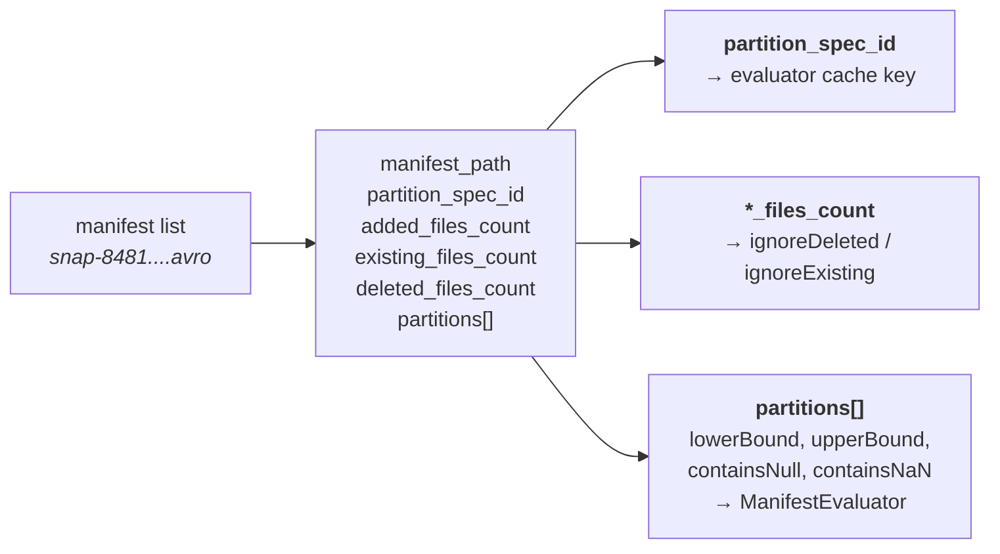
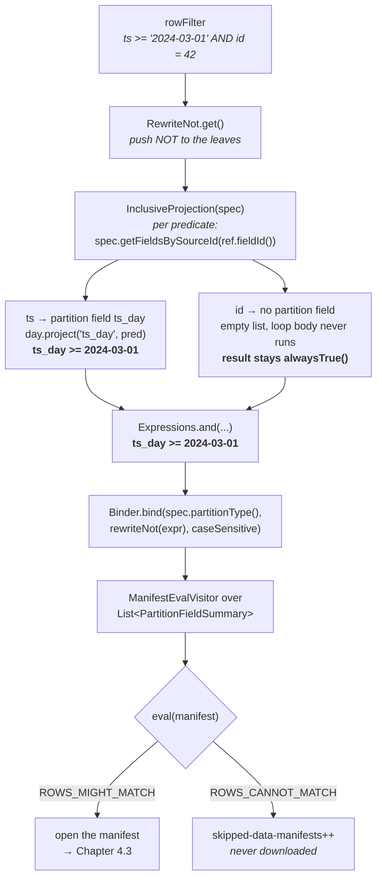

# Chapter 4.2 — Manifest pruning with `ManifestEvaluator`

**The question this chapter answers:** how does Iceberg decide *not to open* a manifest file, using only the few hundred bytes of partition summary already sitting in the manifest list?

**Prerequisites:** Chapter 2.3 (the manifest list and its partition summaries), Chapter 4.1 (where `ManifestGroup` is configured)

**Source covered:** `api/.../expressions/ManifestEvaluator.java`, `api/.../expressions/Projections.java`, `api/.../expressions/BoundReference.java`, `api/.../transforms/Transform.java`, `core/.../ManifestGroup.java`

## 1. The problem

This is stage one of the funnel from Chapter 4.1. No *data* manifest has been opened yet — only the manifest list, plus whatever delete manifests Chapter 4.1 watched `ManifestGroup.plan()` drain into its `DeleteFileIndex`.

A snapshot's manifest list can name thousands of manifests. Each one is a separate Avro file: a network round trip, a decompress, and a parse before a single data file's metadata is visible. On object storage that round trip dominates. So the first question planning asks is not "which files match" but "which manifests are worth opening at all".

The information available to answer it is limited on purpose. The manifest list row for each manifest carries a compact partition summary — bounds and null flags per partition field — and nothing about data columns. Meanwhile the user's filter is written against data columns. Those are different vocabularies, and bridging them without ever producing a wrong answer is what this chapter is about.

The bridge is an *inclusive projection*: rewrite a predicate on rows into a predicate on partition values such that **if a row matches, its partition matches**. Predicates that cannot be rewritten become `alwaysTrue()` — they contribute no pruning rather than wrong pruning.

## 2. What the manifest list already tells us



The javadoc fixes the access pattern: summaries are positional, one per field of the manifest's spec, in spec order. That is why `ManifestEvalVisitor` reads them with `stats.get(Accessors.toPosition(ref.accessor()))` rather than by name — the reference has already been bound to `spec.partitionType()`, so its accessor knows its ordinal.

Each `PartitionFieldSummary` carries four things: `lowerBound()`, `upperBound()`, `containsNull()`, and `containsNaN()` (nullable, defaulting to `null` for backward compatibility). Everything in this chapter is derived from those four fields.

Note what is *not* there: no column bounds, no per-file information at all. Manifest-level pruning is partition pruning and nothing else. A filter on a non-partitioned column survives this stage untouched and is handed to Chapter 4.3.

## 3. Two things a predicate has to be before it can be projected

The rewrite in section 4 operates on a predicate that has already had two things done to it, and neither has been named yet in this book. Both are worth ten minutes now, because Chapters 4.3 and 4.4 assume them as thoroughly as this one does.

### Bound and unbound

An `Expression` written by a caller — `Expressions.lessThan("event_ts", cutoff)` — names a column by *string*. It cannot be evaluated, because nothing has said which column that string is, whether it exists, or what type it holds. That is an **unbound** expression, and `UnboundPredicate` is its type.

Binding resolves the name against a schema and produces the other kind:



Three fields. A `Types.NestedField` — the resolved column, carrying the field ID that Chapter 2.4 showed every metric map is keyed by. An `Accessor<StructLike>`, which is a pre-computed path for pulling that column out of a struct, so evaluation is a field read rather than a name lookup. And the original `name`, kept only for error messages.

`Binder.bind(struct, expr, caseSensitive)` is the entry point, and its failure modes are the point of the exercise. An unknown column, a type that cannot hold the literal, a case mismatch under `caseSensitive` — all of them fail *here*, once, at plan time, rather than per row or per file. `ValidationException: Cannot find field 'evnt_ts'` is a binding failure, and it is why a typo in a filter fails the query instead of silently matching nothing.

Two consequences run through the rest of Part 4. Every evaluator in this part — `ManifestEvaluator`, `InclusiveMetricsEvaluator`, `StrictMetricsEvaluator`, `ResidualEvaluator` — binds its expression once in its constructor and then visits the bound form. And `pred.ref().fieldId()`, which section 4 is about to use as the key into the partition spec, is only available *because* the predicate was bound: an unbound predicate has a name where that integer would be.

### Transforms, and the one property projection depends on

A partition value is not a column value. It is a **transform** of one — `day(event_ts)`, `bucket(16, id)`, `truncate(10, name)`, or `identity(dept)` — computed by the writer and stored in the manifest as its own typed field (Chapter 1.1 §5). The partition summaries this chapter prunes on are bounds over *transformed* values, so a predicate on the raw column cannot be compared against them directly.

What makes the rewrite possible at all is a single method on `Transform`:



*"Whether the transform preserves the order of values (is monotonic)."* `identity`, `year`, `month`, `day`, `hour` and `truncate` are order-preserving: if `a < b` then `t(a) <= t(b)`. `bucket` is not — hashing destroys order by design, which is the whole point of bucketing.

That one bit decides which predicates survive projection. Against an order-preserving transform, `event_ts < X` becomes `day(event_ts) <= day(X)` and the manifest's `lower_bound`/`upper_bound` are usable. Against `bucket`, an inequality projects to nothing, because two adjacent ids land in unrelated buckets and no bound over bucket numbers says anything about a range of ids. Equality still projects — `id = 5` implies `bucket(16, id) = bucket(16, 5)` — which is why a bucketed table prunes beautifully for point lookups and not at all for ranges.

Chapter 4.4 uses the same property in the opposite direction: where this chapter asks whether a partition *might* match, 4.4 asks whether it *must*, and reaches for `preservesOrder()` again to answer it.

## 4. From a row filter to a partition filter



The whole rewrite is fourteen lines of logic and one long comment.

`spec().getFieldsBySourceId(pred.ref().fieldId())` asks: is this predicate's column the source of any partition field? If not, the answer is `Expressions.alwaysTrue()`. That is the safe direction: a predicate we cannot express over partition values must not eliminate anything.

It is worth being exact about *how* that answer is produced, because the obvious reading is wrong and Chapter 4.4 meets the identical trap. The `if (parts == null)` guard on the line below the lookup never fires. `getFieldsBySourceId` is one line — `return lazyFieldsBySourceId().get(fieldId)` — over a Guava `ListMultimap`, and `Multimap.get` returns an *empty list* for an absent key, never `null`. The guard is dead defensive code. What actually handles a non-partition column is the pair of lines wrapped around the loop: `result` starts as `Expressions.alwaysTrue()`, the loop body never runs, and `result` is returned unchanged. The identity element of the conjunction is the mechanism; the null check is decoration. Chapter 4.4 finds the same dead branch — with the same wrong-looking explanation available — in `ResidualEvaluator`.

When the column *is* a partition source, every partition field derived from it contributes a projected predicate, and they are **AND**-ed. The comment explains why the conjunction is correct and not merely conservative:

> *consider (d = 2019-01-01) with bucket(7, d) and bucket(5, d) / projections: b1 = bucket(7, '2019-01-01') = 5, b2 = bucket(5, '2019-01-01') = 0 / any value where b1 != 5 or any value where b2 != 0 cannot be the '2019-01-01'*

Each projection is independently necessary, so requiring all of them is both sound and maximally selective. The `day(ts)` / `hour(ts)` case in the same comment makes the point again: partitioning by two granularities of the same column gives two independent constraints, and using both prunes more than using either.

The actual per-transform work is `Transform.project(name, pred)`, which each transform implements for itself — `identity` passes the predicate through, `day` converts a timestamp literal to a date, `bucket` can only project equality, and so on. A transform that cannot project a given operation returns `null`, and that predicate simply drops out of the conjunction.

One step above all this matters more than it looks. `InclusiveProjection` is never entered directly; callers go through `project()` on its base class:



Two nested visits. `RewriteNot.get()` runs first and pushes every `NOT` down to the leaves, turning `not(a < b)` into `a >= b`. Only then is the projection applied. The comment says exactly why, and Gotcha 2 unpacks it.

Put end to end, a two-predicate filter against a table partitioned by `day(ts)` travels like this:

The `id = 42` branch is the important one. It contributes nothing here — and that is not a failure of the projection, it is the correct answer. `id` is not a partition column, so the manifest summary genuinely says nothing about it. The predicate is not lost; it is carried forward and does its work one stage later, against column statistics.

## 5. `ManifestEvaluator` — contract and construction



The javadoc states the contract in the form that matters:

> *Manifest files may be skipped if and only if the return value of `eval` is false.*

"If and only if" is doing real work there. It licenses skipping on `false`, and it forbids skipping on anything else — including anything the evaluator could not decide. That asymmetry is the subject of Chapter 4.3; here it shows up as the two constants `ROWS_MIGHT_MATCH = true` and `ROWS_CANNOT_MATCH = false`, and the fact that `ManifestEvalVisitor.eval` returns `ROWS_MIGHT_MATCH` immediately when `manifest.partitions()` is `null`.

Everything downstream of that contract rests on a promise made by the writer, not by this class. Chapter 2.3 §5–6 is where that promise is established: `PartitionFieldStats.update` sets a bound for every ordinary value and for nothing else, which is what licenses the one branch that skips a manifest on an *absent* bound rather than a present one. Read the two together and the division is clean — 2.3 proves the row is trustworthy, this chapter spends the trust.

Two factories, two callers:

- `forRowFilter(rowFilter, spec, caseSensitive)` does the projection for you. This is what the metadata-table scans use (Chapter 4.5).
- `forPartitionFilter(partitionFilter, spec, caseSensitive)` takes an expression that is *already* over partition values. `ManifestGroup` uses this one, because it needs to combine an explicit partition filter with the projected row filter before evaluating.

The constructor does the rest: `Binder.bind(spec.partitionType(), rewriteNot(partitionFilter), caseSensitive)`. Note `rewriteNot` appearing a second time — the evaluator does not trust its caller to have done it.

## 6. One visitor, read closely

`ManifestEvalVisitor` implements every predicate type. `eq` is the representative case: two bound comparisons, both proving impossibility.



Three exits, and only two of them prune.

`fieldStats.lowerBound() == null` means every partition value for this field in this manifest is null, and the comment says why that settles it: *"values are all null and literal cannot contain null"*. An Iceberg literal is never null — `IS NULL` is a separate predicate — so equality against one cannot hold.

Then the interval test. If `lower > lit`, every value in the manifest exceeds the literal. If `upper < lit`, every value falls short. Otherwise the literal lies inside `[lower, upper]` and *some file in this manifest might* have that partition value — might, not does, because the bounds are an interval over many files, not an enumeration.

The fall-through is `ROWS_MIGHT_MATCH`. Every visitor in the class ends that way.

`lt`, `ltEq`, `gt`, and `gtEq` are the same shape with one comparison instead of two. `startsWith` truncates both bounds to the prefix length and compares them as unsigned bytes. And `notEq` is where the technique runs out — see Gotcha 3.

## 7. Where it runs



This is `ManifestGroup`'s private `entries(BiFunction)`, the method every public entry point funnels through. Read the first sixty lines as a pipeline of `CloseableIterable.filter` calls.

**The evaluator cache.** A Caffeine `LoadingCache<Integer, ManifestEvaluator>` keyed by *partition spec ID*. This is not a micro-optimisation: one snapshot legitimately contains manifests written under several specs, and the projection of a row filter depends on the spec. Building one evaluator per manifest would redo the binding thousands of times; building one globally would be wrong.

The cached expression is worth reading character by character:



Two sources combine. `partitionFilter` is an explicit partition-level predicate set by `filterPartitions(...)` — used by delete and rewrite paths, left as `alwaysTrue()` by `DataTableScan`. `dataFilter` is the user's row filter, projected. `forPartitionFilter` is used precisely because the projection has already happened here.

**The filter itself.** `CloseableIterable.filter(scanMetrics.skippedDataManifests(), closeableDataManifests, manifest -> evalCache.get(manifest.partitionSpecId()).eval(manifest))`. The counter is passed *into* the filter, so every rejection increments `skipped-data-manifests` without a separate bookkeeping pass.

**Two more cheap filters.** With `ignoreDeleted` set — `DataTableScan` always sets it — manifests with no added and no existing files are dropped, because a read has no interest in a manifest that only records deletions. `ignoreExisting` is the mirror image, used by incremental scans. Both comments say the same defensive thing: *"if either the added or existing files count is missing, the manifest must be scanned."*

**And a counter.** `CloseableIterable.count(scanMetrics.scannedDataManifests(), matchingManifests)` tallies survivors. `scanned` plus `skipped` equals `total-data-manifests`, and the ratio is the direct measure of whether this stage did anything.

Everything after line L334 — opening a `ManifestReader`, applying the partition and metrics evaluators per entry — belongs to Chapter 4.3.

One consequence of the per-spec cache deserves stating plainly, because it surfaces as a support question rather than as an error. Suppose a table was originally partitioned by `days(ts)` and later evolved to add `bucket(16, customer_id)`. Manifests written before the change are evaluated with an evaluator built from the old spec, in which `customer_id` is not a partition source — so a filter on `customer_id` projects to `alwaysTrue()` for them and prunes nothing. Manifests written after the change prune normally. The same query, the same filter, and two completely different pruning ratios depending on when the data was written. Nothing is wrong; the older manifests simply do not carry the summary that would answer the question.

## 8. Gotchas

!!! warning "The summary is a union over every file in the manifest"
    `PartitionFieldSummary` bounds cover all files the manifest names. One file with an outlier partition value widens the manifest's bounds and defeats pruning for every other file in it. This — not the raw manifest count — is the real argument for `RewriteManifests` and for clustering writes by partition. The trap is diagnostic: the metric that looks bad is `scanned-data-manifests`, but its cause is how the manifests were grouped at write time.

!!! warning "`NOT` must be rewritten before projecting, or pruning becomes data loss"
    `BaseProjectionEvaluator.not()` throws `UnsupportedOperationException("[BUG] project called on expression with a not")`, and the comment above `project()` explains the reason: *"this is necessary to ensure that the default expression returned when a predicate can't be projected is correct."* The default is `alwaysTrue()`. A surviving `NOT` node would negate it into `alwaysFalse()` and silently discard manifests that do contain matching rows. Throwing is the right response — there is no safe way to guess.

!!! note "`notEq` and `notIn` almost never prune here"
    The upstream comment is blunt: *"because the bounds are not necessarily a min or max value, this cannot be answered using them. notEq(col, X) with (X, Y) doesn't guarantee that X is a value in col."* The helper `uniqueValue(ref)` recovers the one safe case — `lowerBound` equals `upperBound`, no nulls, and for float/double no NaN — which in practice means a manifest holding exactly one partition value. Everything else falls through to `ROWS_MIGHT_MATCH`.

!!! note "A missing count means 'scan it'"
    `ManifestFile.hasAddedFiles()` is `addedFilesCount() == null || addedFilesCount() > 0`. Old V1 manifests written before those counts became reliable therefore never get dropped by the `ignoreDeleted` filter. Same principle as the `partitions() == null` check: absence of information is never treated as permission to skip.

!!! note "More than 200 values in an `IN` list disables the interval test, but not the whole check"
    `IN_PREDICATE_LIMIT = 200`. Above that, `in(...)` returns `ROWS_MIGHT_MATCH` rather than compare the list against the bounds — a deliberate trade of pruning for planning time, since the filter runs once per manifest per predicate. Note the order, though: the all-null exit reads `fieldStats.lowerBound()` and returns `ROWS_CANNOT_MATCH` *before* the size check, so a manifest whose partition values for that field are entirely null is still pruned by an `IN` list of any length. What the limit skips is the two `filter` passes that intersect the literal set with `[lower, upper]`. The same constant appears again in `InclusiveMetricsEvaluator`, where it runs once per *file*.

## Key takeaways

- Manifest pruning runs entirely on data already in the manifest list; a rejected manifest is never downloaded.
- `Projections.inclusive(spec).project(rowFilter)` is the bridge from data columns to partition values, and its guarantee is one-directional: if a row matches, its partition matches.
- A predicate that cannot be projected becomes `alwaysTrue()` — produced by an empty partition-field list leaving the conjunction's identity element untouched, not by the dead `parts == null` branch — and that is safe only because `NOT` has been pushed to the leaves first, hence the explicit `[BUG]` throw.
- `ManifestEvaluator` returns `ROWS_CANNOT_MATCH` only when the partition summary proves impossibility; every other path, including a missing summary, returns `ROWS_MIGHT_MATCH`.
- Evaluators are cached per partition spec ID, because one snapshot can hold manifests written under several specs and the projection depends on the spec.
- This stage prunes on partition values only. Anything else in the filter survives to Chapter 4.3.

## Source map

| What | File |
| --- | --- |
| The evaluator | [`api/.../expressions/ManifestEvaluator.java`](https://github.com/apache/iceberg/blob/apache-iceberg-1.11.0/api/src/main/java/org/apache/iceberg/expressions/ManifestEvaluator.java) |
| Row filter → partition filter | [`api/.../expressions/Projections.java`](https://github.com/apache/iceberg/blob/apache-iceberg-1.11.0/api/src/main/java/org/apache/iceberg/expressions/Projections.java) |
| Binding a name to a schema | [`api/.../expressions/Binder.java`](https://github.com/apache/iceberg/blob/apache-iceberg-1.11.0/api/src/main/java/org/apache/iceberg/expressions/Binder.java), [`BoundReference.java`](https://github.com/apache/iceberg/blob/apache-iceberg-1.11.0/api/src/main/java/org/apache/iceberg/expressions/BoundReference.java), [`UnboundPredicate.java`](https://github.com/apache/iceberg/blob/apache-iceberg-1.11.0/api/src/main/java/org/apache/iceberg/expressions/UnboundPredicate.java) |
| Per-transform projection | [`api/.../transforms/Transform.java`](https://github.com/apache/iceberg/blob/apache-iceberg-1.11.0/api/src/main/java/org/apache/iceberg/transforms/Transform.java) |
| The pruning input | [`api/.../ManifestFile.java`](https://github.com/apache/iceberg/blob/apache-iceberg-1.11.0/api/src/main/java/org/apache/iceberg/ManifestFile.java) |
| Where it is applied | [`core/.../ManifestGroup.java`](https://github.com/apache/iceberg/blob/apache-iceberg-1.11.0/core/src/main/java/org/apache/iceberg/ManifestGroup.java) |
| Same evaluator, distributed path | [`core/.../BaseDistributedDataScan.java`](https://github.com/apache/iceberg/blob/apache-iceberg-1.11.0/core/src/main/java/org/apache/iceberg/BaseDistributedDataScan.java) |
| Counters | [`core/.../metrics/ScanMetrics.java`](https://github.com/apache/iceberg/blob/apache-iceberg-1.11.0/core/src/main/java/org/apache/iceberg/metrics/ScanMetrics.java) |

**Next:** Chapter 4.3 opens the manifests that survived and prunes inside them, using column statistics — and makes the correctness argument that every stage in this pipeline depends on.
