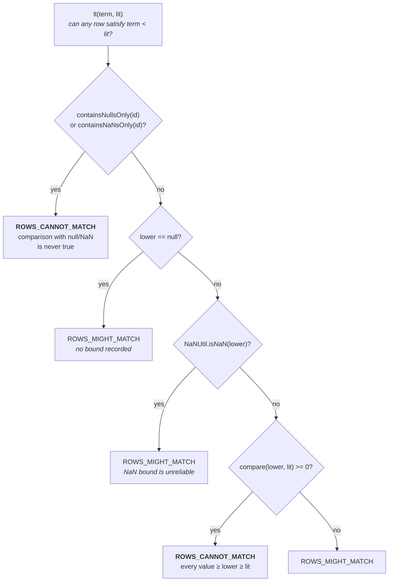

# Chapter 4.3 — File pruning with `InclusiveMetricsEvaluator`

<div class="chapter-meta" markdown>
**The question this chapter answers:** given a data file's column statistics and nothing else, how does Iceberg prove that the file cannot contain a single matching row — and why is every uncertain case resolved by *keeping* the file?

**Prerequisites:** Chapter 2.4 (the manifest file and its column metrics), Chapter 4.2 (the manifests that survived), Chapter 4.1 (the funnel)

**Source covered:** `api/.../expressions/InclusiveMetricsEvaluator.java`, `api/.../expressions/StrictMetricsEvaluator.java`, `core/.../ManifestReader.java`
</div>

## 1. The problem

The manifests that survived Chapter 4.2 are now open. Each one holds a `ManifestEntry` per data file, and each entry carries — alongside the file path and partition tuple — five maps keyed by field ID: `value_counts`, `null_value_counts`, `nan_value_counts`, `lower_bounds`, `upper_bounds`. Chapter 5.1 covers how a writer produces them.

This is the last stage before a file becomes a task. After it, the file will be opened, decompressed, and scanned. So the question is worth asking carefully: *can this file contain any row matching the filter?*

The interesting part is not the arithmetic. Comparing a literal against a min and a max is not hard. The interesting part is that the question is **deliberately lopsided**, and that lopsidedness is visible in every line of the class.

## 2. The asymmetry

Two kinds of mistake are available here, and they are not remotely equivalent.

A **false positive** — keeping a file that turns out to contain no matching rows — costs one wasted read. The engine opens the file, applies the residual (Chapter 4.4), gets nothing back, and moves on. The query is still correct. The cost is bounded and measurable.

A **false negative** — skipping a file that does contain matching rows — is a wrong answer. Not a slow query, not a degraded plan: rows that exist in the table silently do not appear in the result. No exception is raised, nothing in the scan report looks unusual, and the number is simply wrong.

So the evaluator is not written as "decide whether the file matches". It is written as a sequence of **proofs of impossibility**. Each visitor tries to establish, from the statistics alone, that no row can match. If it succeeds, the file is dropped. If it fails — for any reason, including having run out of information — the file is kept.



The javadoc states the contract as a biconditional:

> *Files may be skipped if and only if the return value of `eval` is false.*

And the two constants encode which direction is safe:

```java
private static final boolean ROWS_MIGHT_MATCH = true;
private static final boolean ROWS_CANNOT_MATCH = false;
```

Naming the booleans is not decoration. `return true` in a pruning function is ambiguous — true *what*? `return ROWS_MIGHT_MATCH` is a claim about the world, and it makes every fall-through in the file self-documenting. Read the class with those names in mind and the shape becomes obvious: twenty-seven returns of `ROWS_CANNOT_MATCH`, each guarded by a proof, and thirty-three of `ROWS_MIGHT_MATCH` — one closing every method as the fall-through, and the rest wherever a proof cannot be completed. The safe answer is the more common one, which is the shape you want.

The third paragraph of the javadoc is already an application of the rule. ORC reports NaN for both bounds of a float or double column when the first value in the file is NaN, *"despite that the column could contain non-NaN data"*. The bounds are not wrong, they are unusable — so the evaluator treats a NaN bound as no bound at all.

## 3. Reading a visitor as a proof: `lt`



Five exits. Two prune, three surrender.

**Proof 1 — nothing but nulls or NaNs.** `containsNullsOnly(id) || containsNaNsOnly(id)` returns `ROWS_CANNOT_MATCH`. Under SQL three-valued logic, `null < X` is `UNKNOWN`, which is not `TRUE`, and `NaN < X` is `false` for every `X`. If the column holds only those, no row satisfies the predicate. Note this is a *proof*, not a heuristic: it requires the value count and null count to both be present and to be equal.

**Surrender 1 — no usable lower bound.** `null == lower || NaNUtil.isNaN(lower)` returns `ROWS_MIGHT_MATCH`. Either the writer recorded no bound for this column, or the bound is the ORC NaN artefact from section 2. No information means no pruning.

**Proof 2 — the bound settles it.** `compare(lower, lit) >= 0` returns `ROWS_CANNOT_MATCH`. Every value in the file is at least `lower`, and `lower` is already at least the literal, so nothing is strictly less than it.

**Surrender 2 — the default.** `return ROWS_MIGHT_MATCH`.

The comment between the two proofs is the most valuable in the file, because it extends the argument past simple column references:

> *this also works for transforms that are order preserving: if a transform f is order preserving, a < b means that f(a) <= f(b). because lower <= a for all values of a in the file, f(lower) <= f(a). when f(lower) >= X then f(a) >= f(lower) >= X, so there is no a such that f(a) < X*

That is a written-out proof, and it is why `lt` accepts a `Bound<T>` term rather than a `BoundReference<T>`. A predicate like `truncate(4, name) < 'blue'` can be evaluated against the *untransformed* column bounds, provided the transform preserves order. The plumbing is in `lowerBound(term)`, which dispatches on the term type and — for `BoundTransform` — applies the transform to the parsed bound only when `transform.preservesOrder()` is true. A non-order-preserving transform such as `bucket` returns `null`, which lands in Surrender 1.

`ltEq`, `gt`, `gtEq`, and `eq` are the same skeleton with different comparisons. `in` adds the `IN_PREDICATE_LIMIT` escape from Chapter 4.2, applied per file this time.



Two proofs, three surrenders. That ratio is the design.

## 4. Null counts, and why they need a guard



`IS NULL` needs no bounds at all — just the null count. If the file records zero nulls for the column, no row satisfies the predicate.

The `isNonNullPreserving(term)` guard is the subtle part, and skipping it would be a false negative. The null count is recorded for the *source column*. If the term is a transform, "the source column has no nulls" only implies "the term has no nulls" when the transform maps non-null input to non-null output. The helper's own comment records where this fails: *"a non-null variant does not necessarily contain a specific field"* — a V3 variant extraction on a non-null variant column can still produce null when the requested path is absent. So `isNonNullPreserving` returns `true` for a plain reference, `preservesOrder()` for a transform, and `false` for everything else — and when it returns false, `isNull` falls straight through to `ROWS_MIGHT_MATCH`.

The three helpers underneath do nearly all the statistical reasoning in the class — section 5 has the one exception:



Read them as questions with a bias.

`mayContainNull` is a disjunction: *no null-count map at all*, **or** *this field is absent from it*, **or** *the count is non-zero*. Three separate ways to be uncertain, and all three answer "may". The only way to get `false` is a present map with a present, zero entry.

`containsNullsOnly` and `containsNaNsOnly` are conjunctions, and each one insists that both relevant maps exist and both contain the field before it will conclude anything. There is no branch anywhere in these three methods where a missing statistic produces a prunable answer. That is the asymmetry, expressed mechanically.

## 5. Where bounds run out



Fourteen lines, four of them comment, and no bounds check at all:

> *because the bounds are not necessarily a min or max value, this cannot be answered using them. notEq(col, X) with (X, Y) doesn't guarantee that X is a value in col.*

This is the honest limit of the technique. Bounds describe an interval that contains every value; they say nothing about which values inside it actually occur. A file with bounds `[10, 90]` and the predicate `col != 50` cannot be pruned, because `50` may or may not be present — and even a file whose bounds are exactly `[50, 50]` might contain nulls, which do not equal `50` either.

`uniqueValue(term)` recovers exactly one case, and its preconditions are the reason it is rarely met: `mayContainNull(id)` must be false, both bounds must be present and non-NaN, `lower.equals(upper)`, and the NaN count must not contradict any of that. That last check runs the opposite way from everything else in the class, so it is worth quoting:



It gives up on pruning only when the NaN count is present **and** non-zero. An *absent* NaN count does not block pruning — the one place in `InclusiveMetricsEvaluator` where a missing statistic is read optimistically instead of conservatively. The asymmetry is deliberate rather than sloppy: `nan_value_counts` is defined only for `float` and `double`, so a writer records nothing for a `string`, `int` or `date` column. Insisting on the count would not make `notEq` safer for those columns, it would disable it for them entirely, while `mayContainNull` and the two bound checks still require statistics that *are* present. What is left uncovered is narrow and real: a float or double column with equal, non-NaN bounds and no recorded NaN count. If such a file holds NaNs, `notEq` against that single value prunes it even though every NaN row satisfies `!=` — which is exactly the case the upstream comment (*"when min == max and the file has no nulls or NaN values"*) names. `notIn` uses the same helper and inherits the same edge.

There is a second reason this is worth dwelling on. The default metrics mode is `truncate(16)`: string bounds are *truncated*, so a recorded lower bound is a prefix that sorts at or below the real minimum, not the minimum itself. Equality against a truncated bound is meaningless. The comment's "not necessarily a min or max value" is describing that, not being cautious for its own sake.

## 6. Where it runs



`ManifestGroup` builds a `ManifestReader` per surviving manifest and calls `liveEntries()`, which lands here with `onlyLive = true`. The filtering predicate is a three-way conjunction:



`evaluator` is a plain `Evaluator` over the *partition tuple* — stage two of the funnel, built from `Projections.inclusive(spec).project(rowFilter)` AND the explicit partition filter. It is exact, not inclusive, because a file's partition tuple is a concrete value rather than an interval. `metricsEvaluator` is stage three, the subject of this chapter. Both feed the `skippedDataFiles` counter through `CloseableIterable.filter`.

The lines above the conjunction matter as much as the conjunction itself:

```java
boolean requireStatsProjection = requireStatsProjection(rowFilter, columns);
Collection<String> projectColumns =
    requireStatsProjection ? withStatsColumns(columns) : columns;
```

A caller can ask for a narrow projection of the manifest — `BaseScan.SCAN_COLUMNS` deliberately omits the statistics maps, because they are the bulk of a manifest entry's size. Chapter 2.4 §7 met the other half of this switch, `dropStats`, which decides when a reader may leave the maps on disk. `requireStatsProjection` is the branch that overrules it: if a row filter is present, the stats columns go back into the projection whether the caller asked or not. You cannot prune with statistics you did not read, and the reader refuses to let a projection quietly disable the third pruning stage.

The whole method is also guarded: if there is no row filter, no partition filter, and no partition set, neither evaluator is constructed and the entries stream through untouched.

## 7. The mirror: `StrictMetricsEvaluator`

The strongest evidence that the defaults in section 2 are a design choice rather than an accident is that Iceberg also ships the opposite class.

`StrictMetricsEvaluator` reads the same five statistics maps and asks the opposite question — *do **all** rows in this file match?* — with its own pair of named constants, `ROWS_MUST_MATCH` and `ROWS_MIGHT_NOT_MATCH`. Its javadoc mirrors the inclusive one clause for clause, down to the ORC NaN paragraph, which ends *"in order to not include files that may contain rows that don't match"* where the inclusive version ends *"in order to not skip files that may contain matching data"*.

Compare four points and the symmetry is exact:

| | `InclusiveMetricsEvaluator` | `StrictMetricsEvaluator` |
| --- | --- | --- |
| Question | may **any** row match? | must **all** rows match? |
| Safe default | `ROWS_MIGHT_MATCH` (keep) | `ROWS_MIGHT_NOT_MATCH` (do not act) |
| `recordCount() == 0` | `ROWS_CANNOT_MATCH` | `ROWS_MUST_MATCH` |
| Non-reference term | bounds via `BoundTransform` when order-preserving | `handleNonReference` → `ROWS_MIGHT_NOT_MATCH` |

The `recordCount() == 0` row is the sharpest. An empty file matches nothing, so the inclusive evaluator prunes it; and every one of its zero rows matches, so the strict evaluator accepts it. Same input, inverted output, both correct — because they are answering different questions with different consequences for being wrong.

Strict evaluation is not part of the read path. Its callers are `BaseOverwriteFiles`, which validates that added files really do satisfy the overwrite filter, and `ManifestFilterManager`, which deletes a data file wholesale when every row in it matches a delete predicate. Deleting a file requires proof about *all* its rows, which is why that side of the codebase needs the other evaluator. Chapters 5.3 and 5.4 pick this up.

## 8. Gotchas

!!! warning "No statistics means no pruning, and nothing tells you"
    Every bound lookup goes through `lowerBounds != null && lowerBounds.containsKey(id)`. A column written under `write.metadata.metrics.default=none`, or one falling past `write.metadata.metrics.max-inferred-column-defaults` (default `100`) in a wide table, has no entry — so every visitor falls through to `ROWS_MIGHT_MATCH` and this stage prunes nothing at all. The scan still returns correct rows. The only symptom is `skipped-data-files` sitting at zero in the scan report while `result-data-files` matches the table's total. Chapter 5.1 covers the write-side configuration that causes it.

!!! warning "A record count of `-1` disables pruning for the entire file"
    `MetricsEvalVisitor.eval` returns `ROWS_MIGHT_MATCH` when `file.recordCount() < 0`, and the comment names the cause: record count is set to `-1` when importing Avro tables, *"we haven't implemented parsing record count from avro file"*. `recordCount() == 0` takes the opposite branch and returns `ROWS_CANNOT_MATCH`. Two adjacent checks, opposite conclusions, both correct — and files imported that way are permanently unprunable until rewritten.

!!! warning "NaN bounds are treated as no bounds"
    `if (null == lower || NaNUtil.isNaN(lower))` appears verbatim three times — in `lt`, `ltEq` and `in` — each returning `ROWS_MIGHT_MATCH` on the spot. `eq` writes it inverted, as `if (lower != null && !NaNUtil.isNaN(lower))` guarding the comparison rather than an early return, so an unusable lower bound there costs only the lower-bound proof: `eq` carries on and can still prune on the upper bound. The cause is stated in the class javadoc: ORC's comparison implementation reports NaN for both bounds of a float/double column whose first value is NaN. Trusting that bound would skip files full of ordinary matching data. If you have float columns in ORC, expect this stage to be weaker than the statistics suggest.

!!! note "`notEq` and `notIn` are near-useless by construction"
    Bounds constrain an interval, not membership, and the default `truncate(16)` metrics mode means string bounds are prefixes rather than real extremes. `uniqueValue` recovers only single-valued, null-free columns with no recorded NaNs. A filter built out of `!=` predicates does not prune, and no amount of metrics configuration changes that.

!!! note "`AND` and `OR` short-circuit before the visitor is called"
    `ExpressionVisitors.visitEvaluator` evaluates the left operand first and returns `alwaysFalse()` / `alwaysTrue()` without visiting the right one. Predicate order in a filter therefore affects planning cost — a cheap, highly selective predicate first saves work on every file — though never the result.

## Key takeaways

- The evaluator's question is asymmetric by design: a false positive costs one wasted read, a false negative silently returns wrong results, so only *proved* impossibility prunes.
- Every visitor is a short sequence of proofs with `ROWS_MIGHT_MATCH` as the fall-through; a missing statistic, a null bound, a NaN bound, or an unrecognised term type all keep the file. The single exception is `uniqueValue`, which treats an absent NaN count as zero.
- `lt` extends beyond plain column references via a written-out proof about order-preserving transforms; transforms that do not preserve order return no bound and therefore never prune.
- `notEq` and `notIn` cannot use bounds at all, because bounds describe an interval rather than a set of values — and are truncated by default.
- `ManifestReader.entries` applies the partition evaluator and the metrics evaluator as one conjunction, and adds the statistics columns back to the projection when a filter needs them.
- `StrictMetricsEvaluator` is the same statistics with the opposite question and the opposite default; the inverted handling of `recordCount() == 0` shows the defaults are chosen, not incidental.

## Source map

| What | File |
| --- | --- |
| The evaluator | [`api/.../expressions/InclusiveMetricsEvaluator.java`](https://github.com/apache/iceberg/blob/apache-iceberg-1.11.0/api/src/main/java/org/apache/iceberg/expressions/InclusiveMetricsEvaluator.java) |
| Its mirror image | [`api/.../expressions/StrictMetricsEvaluator.java`](https://github.com/apache/iceberg/blob/apache-iceberg-1.11.0/api/src/main/java/org/apache/iceberg/expressions/StrictMetricsEvaluator.java) |
| Visitor dispatch and short-circuiting | [`api/.../expressions/ExpressionVisitors.java`](https://github.com/apache/iceberg/blob/apache-iceberg-1.11.0/api/src/main/java/org/apache/iceberg/expressions/ExpressionVisitors.java) |
| Where it runs during planning | [`core/.../ManifestReader.java`](https://github.com/apache/iceberg/blob/apache-iceberg-1.11.0/core/src/main/java/org/apache/iceberg/ManifestReader.java) |
| The statistics it reads | [`api/.../ContentFile.java`](https://github.com/apache/iceberg/blob/apache-iceberg-1.11.0/api/src/main/java/org/apache/iceberg/ContentFile.java) |
| Metrics-mode configuration | [`core/.../TableProperties.java`](https://github.com/apache/iceberg/blob/apache-iceberg-1.11.0/core/src/main/java/org/apache/iceberg/TableProperties.java), [`core/.../MetricsModes.java`](https://github.com/apache/iceberg/blob/apache-iceberg-1.11.0/core/src/main/java/org/apache/iceberg/MetricsModes.java) |
| Strict evaluator in the write path | [`core/.../BaseOverwriteFiles.java`](https://github.com/apache/iceberg/blob/apache-iceberg-1.11.0/core/src/main/java/org/apache/iceberg/BaseOverwriteFiles.java), [`core/.../ManifestFilterManager.java`](https://github.com/apache/iceberg/blob/apache-iceberg-1.11.0/core/src/main/java/org/apache/iceberg/ManifestFilterManager.java) |

**Next:** Chapter 4.4 takes the files that survived all three stages and asks what is left of the filter — because pruning is inclusive, every one of them may still contain rows that do not match.
