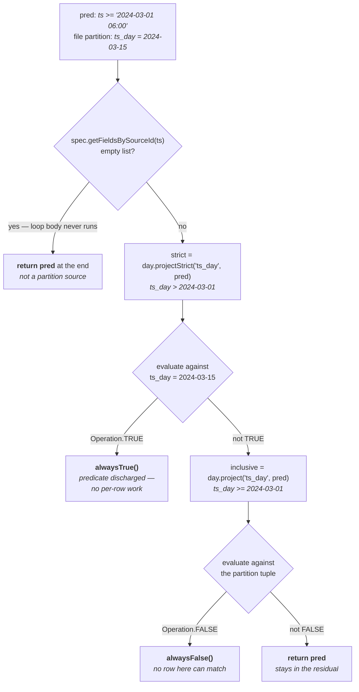

# Chapter 4.4 — Residual expressions and implicit partition filtering

<div class="chapter-meta" markdown>
**The question this chapter answers:** once planning has decided a file belongs in the scan, what is left of the filter — and why does Iceberg hand the engine a *different, weaker* expression than the one the user wrote?

**Prerequisites:** Chapter 4.2 (inclusive projection and the transform API), Chapter 4.3 (why a surviving file may still contain no matching rows)

**Source covered:** `api/.../expressions/ResidualEvaluator.java`, `core/.../ManifestGroup.java`, `core/.../BaseContentScanTask.java`
</div>

## 1. The problem

Three pruning stages are done. What remains is a set of files, each of which *may* contain matching rows, and a filter that still has to be applied to every row the engine reads. That last part is where the waste is.

Take a table partitioned by `day(ts)`, one file per day, read with `ts >= '2024-03-01 06:00' AND ts <= '2024-03-31 18:00'`. The inclusive projection from Chapter 4.2 turns that into `ts_day >= 2024-03-01 AND ts_day <= 2024-03-31`, and planning selects thirty-one files. For twenty-nine of them — every day strictly inside the range — *both* predicates are already known to be true for every row, because the file's partition value says so. Evaluating `ts >= '2024-03-01 06:00'` against a hundred million rows to learn something the planner established from one date is not a small inefficiency. It also forces the reader to materialise `ts` at all, even for a query that never selects it.

The fix has a name: the **residual**. Partially evaluate the filter against the file's partition tuple, and hand the engine only what is left undecided.

This is the payoff of the whole part. "Implicit partition filtering" — the property that makes partitioned Iceberg tables fast without users writing partition predicates by hand — is not a claim about the query optimiser. It is this: the partition predicate is *removed from the expression* before the reader ever sees it.

## 2. What a residual is

The class javadoc defines it by example, and the example is well chosen.



Four cases for one filter, depending on where the partition value `d` sits. Filling in the section 1 scan — `a = 2024-03-01 06:00`, `b = 2024-03-31 18:00`:

| File's `d` | Relationship | Residual | Per-row work |
| --- | --- | --- | --- |
| `2024-03-15` | `day(a) < d < day(b)` | `alwaysTrue()` | none |
| `2024-03-01` | `d == day(a)`, `d != day(b)` | `ts >= '2024-03-01 06:00'` | one comparison |
| `2024-03-31` | `d == day(b)`, `d != day(a)` | `ts <= '2024-03-31 18:00'` | one comparison |
| single-day range | `d == day(a) == day(b)` | both predicates | two comparisons |

Twenty-nine of the thirty-one files land in the first row and do no per-row filtering at all. The two boundary partitions pay, and each pays for half the predicate: the file at `2024-03-01` still has to check the lower bound, because it also holds the rows between midnight and 06:00, and the file at `2024-03-31` still has to check the upper bound. That is the entire optimisation, and it falls out of substituting a constant into an expression.

The boundary rows are not inevitable, though — they are a consequence of where the literals fall inside a day, which section 4 works out.

The class is `Serializable`, and that is not incidental: a `ResidualEvaluator` travels inside every `FileScanTask` to whichever executor picks the task up, so the residual is computed where the file is read.

## 3. The algorithm: strict proves true, inclusive proves false



The comment at the top is the whole method, stated before it is implemented:

> *The strict projection returns true iff the original predicate would have returned true, so the predicate can be eliminated if the strict projection evaluates to true. Similarly the inclusive projection returns false iff the original predicate would have returned false, so the predicate can also be eliminated if the inclusive projection evaluates to false.*

Both projections from Chapter 4.2 appear here, used in opposite directions:

**The non-partition column.** `spec.getFieldsBySourceId(pred.ref().fieldId())` asks whether the predicate's column is the source of any partition field. If it is not, the method returns `pred` unchanged — a predicate on a non-partition column cannot be simplified by a partition value, so it survives intact.

The `if (parts == null)` guard on the next line looks like the code that does this, and the comment beside it reads like a confession that it does: *"not associated inclusive a partition field, can't be evaluated"* (the mangled wording is upstream's). It is dead code. As Chapter 4.2 established for the identical guard in `Projections.InclusiveProjection`, `getFieldsBySourceId` delegates to a Guava `ListMultimap`, whose `get` returns an empty list rather than `null` for a column that partitions nothing. The list is empty, the guard does not fire, the `for` loop body never executes, and control falls to the last line of the method — `return pred`, under the comment *"neither strict not inclusive predicate was conclusive"*. Right answer, different route. Both classes are worth reading with that in mind: the branch that looks like the explanation is unreachable in both, and in both the real mechanism is what the loop does when it has nothing to iterate over.

**Strict.** `part.transform().projectStrict(part.name(), pred)`, bound to `spec.partitionType()`, then evaluated by `super.predicate(...)` — which dispatches through `BoundExpressionVisitor` to the `lt`/`gt`/`eq`/… overloads on `ResidualVisitor` itself. Each of those is a single comparison that returns `alwaysTrue()` or `alwaysFalse()`, obtained by reading the reference out of the struct the visitor is holding. That struct is *this file's partition tuple*, so the projected predicate is evaluated against a concrete value, not an interval. If the result is `Operation.TRUE`, the strict guarantee says every row in this partition satisfies the original predicate, so it is discharged: `return Expressions.alwaysTrue()`.

**Inclusive.** Same shape, `project` instead of `projectStrict`. If it evaluates to `Operation.FALSE`, the inclusive guarantee says no row here can match, so `return Expressions.alwaysFalse()` — and the residual for the whole file collapses.

**Neither.** `return pred`. The partition value is compatible with the predicate but does not settle it, so the engine still has to check it per row.



One detail in the sibling overload is easy to read past. `predicate(UnboundPredicate<T> pred)` binds against the *data* schema, computes the bound residual, and then — if the result is still a predicate — returns the original **unbound** `pred` rather than the bound one. The residual therefore comes back expressed in the same terms the caller supplied it in, ready for the engine's own binder to resolve against its own schema.

## 4. Why the boundary files pay, and when they do not

Section 2 leaves an asymmetry unexplained. Why does the file at `ts_day = 2024-03-01` keep `ts >= '2024-03-01 06:00'` while the file at `2024-03-02` does not? Both sit inside the selected range; only one still has work to do. The answer is arithmetic inside the strict projection, and it is worth following once, because it decides how much of this optimisation a given query actually gets.

`day(ts)` on a timestamp column is the `Timestamps` transform, and its `projectStrict` hands literal predicates to a small switch:



Read the two closed cases as the questions they answer. For `ts >= X`, the strict projection has to name the days in which *every* timestamp satisfies `ts >= X`. The obvious candidate, `ts_day >= day(X)`, is wrong: the day containing `X` also contains the hours before it. So `GT_EQ` becomes `GT` against `transform.apply(boundary - 1L)` — strictly after the last day that could hold a value below `X`. `LT_EQ` is the mirror image, `LT` against `transform.apply(boundary + 1L)`. The literal that comes out is an `int` day ordinal; the dates below are how `day` renders one.

Substitute the section 1 filter. With `a = 2024-03-01 06:00`, one microsecond earlier is still 2024-03-01, so the strict projection is `ts_day > 2024-03-01` — false at the file whose partition value *is* 2024-03-01. The predicate is not discharged there, the inclusive projection `ts_day >= 2024-03-01` is not false either, and `pred` survives into the residual. From 2024-03-02 onward the same expression is true and `ts >= a` disappears. The upper bound behaves symmetrically: `ts_day < 2024-03-31` is true everywhere except the last file.

The `- 1L` is also why a *day-aligned* literal behaves completely differently. With `a = 2024-03-01 00:00`, one microsecond earlier falls into 2024-02-29, the strict projection becomes `ts_day > 2024-02-29`, and that **is** true at 2024-03-01 — every timestamp in that day is at or after midnight, which is exactly what the predicate asks. The boundary file is discharged along with the interior ones. Pair it with a half-open upper bound, `ts < '2024-04-01'`, whose strict projection is `ts_day < 2024-04-01`, and all thirty-one files come back with `alwaysTrue()`: the reader evaluates no predicate at all, on any file, for the whole scan.

That is the practical rule this chapter is for. A range expressed in whole partition units costs nothing per row anywhere; a range that cuts into a partition pays on the files at the cut, and pays for as many rows as those files hold. It is the same query either way — `ts >= '2024-03-01' AND ts < '2024-04-01'` and `ts >= '2024-03-01 06:00' AND ts <= '2024-03-31 18:00'` differ by six hours at each end — but only one of them is free.

One wrinkle sits just past the snippet. `Timestamps.projectStrict` wraps its result in `ProjectionUtil.fixStrictTimeProjection`, which strengthens a `GT` or `GT_EQ` projection by one when the projected ordinal is `<= 0`. Pre-epoch timestamps were once transformed by truncating toward zero instead of flooring, so a value that does not match the predicate may have been written under a partition value that does; the fix uses the stricter literal. It applies only to negative ordinals — dates before 1970 — and `LT`/`LT_EQ` need no correction, which is why the method returns them untouched.

## 5. Where residuals are built



The first statement in `plan()` builds the residual cache — lazily, so no evaluator exists until a manifest of that spec turns up (the statement immediately after it is the eager `DeleteFileIndex` build from Chapter 4.1):

```java
LoadingCache<Integer, ResidualEvaluator> residualCache =
    Caffeine.newBuilder()
        .build(
            specId -> {
              PartitionSpec spec = specsById.get(specId);
              Expression filter = ignoreResiduals ? Expressions.alwaysTrue() : dataFilter;
              return ResidualEvaluator.of(spec, filter, caseSensitive);
            });
```

Keyed by partition spec ID, for the same reason the `ManifestEvaluator` cache is: the projections a residual depends on are spec-specific, and one snapshot can hold manifests from several specs.

`ignoreResiduals` appears right here as a ternary. When set, the evaluator is built over `alwaysTrue()`, so every residual it produces is trivially true. Gotcha 2 covers what that is for and how it goes wrong.

`ResidualEvaluator.of` has one branch worth knowing: when `spec.fields()` is empty it returns an `UnpartitionedResidualEvaluator`, whose `residualFor` ignores its argument and returns the expression unchanged. Unpartitioned tables get the full filter as their residual, which is correct — there is no partition value to simplify against.

The distributed scan reaches the same place by a slightly different road, and the difference is instructive. `BaseDistributedDataScan.toFileTasks` calls `specCache(this::newResidualEvaluator)`, which walks `table().specs()` and builds an evaluator for *every* spec the table has ever had, eagerly, into a plain `HashMap` — there is no lazy cache to consult from a worker, and the map has to be complete before tasks are handed out. `newResidualEvaluator` is one line, `ResidualEvaluator.of(spec, residualFilter(), isCaseSensitive())`, and `BaseScan.residualFilter()` is where the `ignoreResiduals` ternary actually lives: `shouldIgnoreResiduals() ? Expressions.alwaysTrue() : filter()`. `ManifestGroup` open-codes the same expression rather than calling it.

The residual evaluator is then folded into a `TaskContext` alongside the serialised schema and spec, one per spec ID, and `createFileScanTasks` passes `ctx.residuals()` into every `BaseFileScanTask` it constructs. Note also the two lines above the task-context cache: if the delete index contains equality deletes, `select(ManifestReader.withStatsColumns(columns))` forces the statistics back into the projection — equality-delete matching needs bounds, the same way Chapter 4.3's evaluator does.

## 6. Where residuals are evaluated



One line. `residuals` is the shared per-spec evaluator; `file.partition()` is this file's tuple. Nothing is cached — every call constructs a fresh `ResidualVisitor` and walks the expression again.

That is a defensible choice: the result depends on the file, planning may produce millions of tasks, and most callers ask once. It becomes a problem only in the case Gotcha 3 describes.

Splits preserve it. `BaseFileScanTask.SplitScanTask.residual()` delegates straight to its parent task, so cutting a file into row-group-aligned pieces (Chapter 4.5) does not change what the reader must check.

## 7. Who consumes it

The residual is only worth computing if engines use it, and they do, at the point where a file reader is constructed.

Spark's `RowDataReader.open` passes `task.residual()` — not the scan's filter — as the filter argument when it builds the underlying file iterable, and that becomes the Parquet or ORC reader's row filter. `BatchDataReader` does the same for vectorised reads. Flink's `RowDataFileScanTaskReader` calls `.filter(task.residual())` on the iterable it builds.

So the interior file from section 2 reaches the Parquet reader with `alwaysTrue()` as its filter, and no per-row predicate is evaluated for it at all. That is the observable form of implicit partition filtering.

## 8. Gotchas

!!! warning "Pruning is inclusive, so applying the residual is not optional"
    Chapters 4.2 and 4.3 admit false positives by design — a file can survive all three stages and contain no matching row. An engine that trusts planning and skips `task.residual()` returns wrong results. An engine that ignores the residual and applies the original scan filter instead is correct, but re-does work the planner already discharged and loses the entire optimisation in this chapter.

!!! warning "`ignoreResiduals()` silently disarms row filtering for whoever reads the tasks"
    The ternary in `plan()` swaps the filter for `alwaysTrue()`, so every task reports `residual() == alwaysTrue()`. It exists for callers that only want a file list — compaction planning, metadata-only deletes — where computing residuals is pure waste. The scan filter is still used for pruning, so the file list is correct; only the per-task residual is emptied. Hand those tasks to a reader and you get every row of every planned file back, with no error anywhere.

!!! note "`residual()` is recomputed on every call, including from `toString()`"
    `BaseContentScanTask.toString()` includes `.add("residual", residual())`. Logging a task list at debug level on a large scan therefore re-runs the full residual computation once per file, on top of whatever the reader does. Cheap per call, expensive at a million tasks.

!!! note "Files written under an older spec keep the full predicate"
    Residual evaluators are cached per `partitionSpecId`. For a file written before a partition field existed, `spec.getFieldsBySourceId(...)` returns an empty list, the projection loop never runs, and `predicate()` falls through to `return pred` — the predicate comes back unchanged. After a partition-spec change, old files pay the full per-row filter cost and new files do not: a performance asymmetry with no error, no warning, and no metric. Chapter 2.6 §6 covers why the old files keep their old spec — evolution rewrites `metadata.json` and touches no data.

!!! note "The `alwaysFalse()` branch cannot fire inside a data scan"
    A file whose partition tuple makes the inclusive projection false never reaches a task. `ManifestReader.evaluator()` builds `new Evaluator(spec.partitionType(), and(partitionFilter, Projections.inclusive(spec, caseSensitive).project(rowFilter)))` — the same projection, the same spec, the same tuple — and stage two of the funnel applies it per manifest entry (Chapter 4.3, section 6). So by the time `residual()` runs, the file has already passed the test that branch exists to fail. It is not dead code: `ResidualEvaluator.of` is public API, and a caller that evaluates a filter the file list was not pruned with can reach it. Within `planFiles()`, it is a safety net over an invariant stage two already enforces.

!!! note "The residual is per file, not per task group"
    Bin-packing (Chapter 4.5) combines files from different partitions into one `CombinedScanTask`. Each `FileScanTask` inside it keeps its own residual, and readers must ask each file for its own. There is no such thing as a task group's residual.

## Key takeaways

- A residual is the scan filter partially evaluated against a file's partition tuple: what the engine still has to check per row.
- The algorithm uses both projections from Chapter 4.2 in opposite directions — strict proving the predicate always true, inclusive proving it always false — and keeps the predicate only when neither is conclusive.
- Files in the interior of a range get `alwaysTrue()` and do no per-row filtering; the boundary partitions pay, and only for the half of the predicate that cuts into them.
- Whether there are boundary partitions at all is decided by the literal. `truncateLongStrict` projects `>= X` to `> day(X - 1µs)`, so a range expressed in whole partition units discharges everywhere and a range that cuts into a day pays on the files at the cut.
- Residual evaluators are built once per partition spec and evaluated per file on demand; nothing is cached, and splits delegate to their parent task.
- `ignoreResiduals()` is for callers that only want a file list; using it and then reading the tasks returns unfiltered rows.
- Because pruning is inclusive rather than exact, the residual is a correctness requirement for the engine, not an optimisation it may skip.

## Source map

| What | File |
| --- | --- |
| The evaluator | [`api/.../expressions/ResidualEvaluator.java`](https://github.com/apache/iceberg/blob/apache-iceberg-1.11.0/api/src/main/java/org/apache/iceberg/expressions/ResidualEvaluator.java) |
| The two projections it uses | [`api/.../expressions/Projections.java`](https://github.com/apache/iceberg/blob/apache-iceberg-1.11.0/api/src/main/java/org/apache/iceberg/expressions/Projections.java), [`api/.../transforms/Transform.java`](https://github.com/apache/iceberg/blob/apache-iceberg-1.11.0/api/src/main/java/org/apache/iceberg/transforms/Transform.java) |
| Where the boundary arithmetic lives | [`api/.../transforms/ProjectionUtil.java`](https://github.com/apache/iceberg/blob/apache-iceberg-1.11.0/api/src/main/java/org/apache/iceberg/transforms/ProjectionUtil.java), [`api/.../transforms/Timestamps.java`](https://github.com/apache/iceberg/blob/apache-iceberg-1.11.0/api/src/main/java/org/apache/iceberg/transforms/Timestamps.java) |
| Visitor dispatch | [`api/.../expressions/ExpressionVisitors.java`](https://github.com/apache/iceberg/blob/apache-iceberg-1.11.0/api/src/main/java/org/apache/iceberg/expressions/ExpressionVisitors.java) |
| Construction, per spec | [`core/.../ManifestGroup.java`](https://github.com/apache/iceberg/blob/apache-iceberg-1.11.0/core/src/main/java/org/apache/iceberg/ManifestGroup.java), [`core/.../BaseDistributedDataScan.java`](https://github.com/apache/iceberg/blob/apache-iceberg-1.11.0/core/src/main/java/org/apache/iceberg/BaseDistributedDataScan.java) |
| Per-file evaluation | [`core/.../BaseContentScanTask.java`](https://github.com/apache/iceberg/blob/apache-iceberg-1.11.0/core/src/main/java/org/apache/iceberg/BaseContentScanTask.java), [`core/.../BaseFileScanTask.java`](https://github.com/apache/iceberg/blob/apache-iceberg-1.11.0/core/src/main/java/org/apache/iceberg/BaseFileScanTask.java) |
| The `ignoreResiduals` switch | [`core/.../BaseScan.java`](https://github.com/apache/iceberg/blob/apache-iceberg-1.11.0/core/src/main/java/org/apache/iceberg/BaseScan.java), [`core/.../TableScanContext.java`](https://github.com/apache/iceberg/blob/apache-iceberg-1.11.0/core/src/main/java/org/apache/iceberg/TableScanContext.java) |
| Consumers | [`spark/.../source/RowDataReader.java`](https://github.com/apache/iceberg/blob/apache-iceberg-1.11.0/spark/v3.5/spark/src/main/java/org/apache/iceberg/spark/source/RowDataReader.java), [`flink/.../source/RowDataFileScanTaskReader.java`](https://github.com/apache/iceberg/blob/apache-iceberg-1.11.0/flink/v2.0/flink/src/main/java/org/apache/iceberg/flink/source/RowDataFileScanTaskReader.java) |

**Next:** Chapter 4.5 closes the part — the file list is right, but the *units of work* are not, and fixing that is where split offsets, bin-packing, and metadata tables come in.
