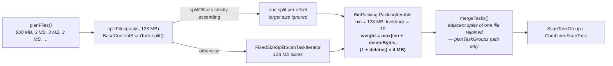
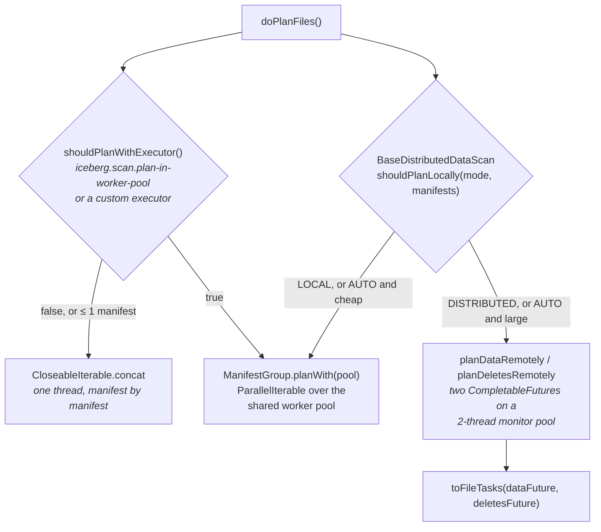

# Chapter 4.5 — Split planning, parallel planning, and metadata tables

<div class="chapter-meta" markdown>
**The question this chapter answers:** `planFiles()` hands back one task per file, which is the wrong unit of work for any engine — how does Iceberg turn that into evenly sized units, where does the planning itself run, and why do the `.files` and `.manifests` tables come out of the same machinery?

**Prerequisites:** Chapter 4.1 (`planFiles()` and the scan hierarchy), Chapter 4.2 (`ManifestEvaluator` and per-spec caching), Chapter 4.4 (the residual a task carries)

**Source covered:** `core/.../BaseTableScan.java`, `core/.../util/TableScanUtil.java`, `core/.../BaseContentScanTask.java`, `core/.../BaseDistributedDataScan.java`, `core/.../BaseFilesTable.java`
</div>

## 1. The problem

Four chapters of pruning have produced a correct answer to the wrong question. `planFiles()` returns one `FileScanTask` per surviving data file, and a file is not a unit of work.

Real tables do not have uniformly sized files. A partition that was compacted last night holds one 4 GB Parquet file; the partitions that streaming appends have been landing into since hold two thousand files of a few kilobytes each. Hand that list to an engine as-is and you get one task that runs for minutes while every other slot in the cluster sits idle, plus two thousand tasks whose scheduling overhead exceeds the work they do.

So the file list needs two corrections, applied in this order:

1. **Cut what is too big.** A 4 GB file has to become tasks that several executors can read concurrently.
2. **Combine what is too small.** Two thousand tiny files have to become a handful of tasks.

The corrections are independent, they are both in one place, and both are governed by constants that are deliberately not physical measurements.

## 2. `planTasks()` is those two corrections, in order



Eight lines, and everything in the rest of this chapter hangs off them. `planFiles()` is Chapters 4.1–4.4. `TableScanUtil.splitFiles` is section 3. `TableScanUtil.planTasks` is section 4.

The three arguments come from `BaseScan`, and each is read as a table property first and a scan option second:

| Method | Property | Default |
| --- | --- | --- |
| `targetSplitSize()` | `read.split.target-size` | 128 MB |
| `splitLookback()` | `read.split.planning-lookback` | 10 |
| `splitOpenFileCost()` | `read.split.open-file-cost` | 4 MB |

Note also what does *not* happen here: `planFiles()` is called once. Splitting and packing are stream transformations over its result, so no manifest is read twice to produce task groups.

## 3. Splitting: mostly decided at write time



Three branches, and the interesting one is the first.

**Not splittable at all.** `FileFormat` carries a `splittable` flag: Parquet, ORC and Avro are true; `PUFFIN` and `METADATA` are false. A non-splittable file returns `ImmutableList.of(self())` — one task, whatever its size.

**Split offsets present and strictly ascending.** `splitOffsets` are row-group offsets for Parquet and stripe offsets for ORC, recorded by the writer into the manifest entry. When they are there, Iceberg cuts exactly on them:



The comment on the increment says it plainly: *"create 1 split per offset"*. `targetSplitSize` is not a parameter of this iterator and is never consulted. Split granularity for such a file was fixed by whoever wrote it.

That is the right tradeoff. A split boundary in the middle of a row group buys nothing, because a reader cannot decode any row of a row group without reading the whole of it; the byte range on a task is a hint that the file reader maps back onto whole row groups. Cutting where the writer already cut is the only cut that translates into less I/O.

**Anything else.** `FixedSizeSplitScanTaskIterator` walks blind fixed-size byte ranges from zero. Note the guard that routes here: `ArrayUtil.isStrictlyAscending(splitOffsets)`. A null, empty, duplicated or out-of-order offsets array is not trusted — it would produce overlapping or negative-length splits — and the scan falls back to arithmetic instead of failing.

## 4. Bin-packing, and a cost that is not a measurement





The weight function is the whole design:

```java
file ->
    Math.max(
        file.length() + ScanTaskUtil.contentSizeInBytes(file.deletes()),
        (1 + file.deletes().size()) * openFileCost);
```

Two terms, and the `max` picks whichever is larger.

**The first term is bytes.** Data length plus the size of the delete files that apply to it — the comment above says why: *"Check the size of delete file as well to avoid unbalanced bin-packing."* A 100 MB file shadowed by 100 MB of position deletes is 200 MB of reading, and pretending otherwise produces a task that takes twice as long as its neighbours.

**The second term is a floor, and it is fictional.** `read.split.open-file-cost` defaults to 4 MB. No file is 4 MB because of this constant; the number is a claim that opening a file costs about as much as reading 4 MB of it. It is charged once per file plus once per delete file. With the default 128 MB target, that arithmetic caps a task at 32 files no matter how small they are — which is precisely the protection the two thousand tiny files needed in section 1.

The packing itself is first-fit-decreasing-ish rather than exact. `BinPacking.PackingIterable` keeps up to `lookback` bins open, tries each new item against them in turn, and when a new bin would make the eleventh, emits one. Scan planning passes `largestBinFirst = true`, so the bin emitted is the fullest one rather than the oldest. Larger lookback means fuller tasks and more retained state during planning.

## 5. Putting back what packing pulled apart

Splitting runs before packing, so nothing stops two adjacent splits of the same 4 GB file from landing in the same bin — which would turn one sequential read into two, with a seek between them. `SplitScanTask` therefore implements `MergeableScanTask`:



Same file, and `offset + len == that.start()` — strict adjacency, not mere proximity. `TableScanUtil.mergeTasks` walks the packed list once and folds every such neighbouring pair into a single wider `SplitScanTask`.

There is a catch worth knowing, because it decides which behaviour you actually get. `mergeTasks` is called from `planTaskGroups`, not from the `planTasks` shown in section 2 — that one wraps each bin in a `BaseCombinedScanTask` and merges nothing. Spark takes the newer path: `SparkPartitioningAwareScan.taskGroups()` calls `TableScanUtil.planTaskGroups`, optionally with a grouping key type so that each task group holds one partition value, which is what storage-partitioned joins need.

## 6. Where planning runs



**Locally.** `ManifestGroup.planWith(executor)` swaps `CloseableIterable.concat` for a `ParallelIterable`, so manifests are read concurrently. Two gates gate it. `shouldPlanWithExecutor()` is `PLAN_SCANS_WITH_WORKER_POOL || context().planWithCustomizedExecutor()`, and the system property behind the first (`iceberg.scan.plan-in-worker-pool`) defaults to **true**. The second gate is at the call site: `DataTableScan` only calls `planWith` when `dataManifests.size() > 1 || deleteManifests.size() > 1`. Parallel planning over one manifest is pure overhead.

The pool is `ThreadPools.getWorkerPool()`, sized `max(2, availableProcessors)` and shared by the whole JVM — the same pool that `SnapshotProducer` writes manifest lists with in Chapter 3.3. Planning a huge scan and committing at the same time contend for it.

**On the cluster.** When metadata is large enough that reading it locally is itself the bottleneck, `BaseDistributedDataScan` pushes manifest reading to the engine. The decision is a table property — `read.data-planning-mode` and `read.delete-planning-mode` — and the interesting thing about it is the default. `TableProperties.PLANNING_MODE_DEFAULT` is `PlanningMode.AUTO`, not `LOCAL`, so a table that has never been configured is already handing the decision to the heuristic below:



`LOCAL` and `DISTRIBUTED` are instructions. `AUTO` is a heuristic with three escape hatches to local, any one of which is enough: the cluster is no wider than the local thread pool, there are at most `2 × localParallelism` manifests, or the manifests total at most `localParallelism × 128 MB`. The premise is that distributed planning has a fixed cost — tasks to schedule, results to ship back — that only pays off past a threshold.

The first line of the method is the strongest rule. A caller who supplied a custom planning executor plans locally, whatever the mode says. Configuration set in code beats configuration set on the table.

Whether this class is reached at all is a separate, engine-level decision, and it too defaults to on. Spark builds a `SparkDistributedDataScan` when `SparkReadConf.distributedPlanningEnabled()` holds — the table implements `SupportsDistributedScanPlanning` (`BaseTable` does, and `allowDistributedPlanning()` defaults to `true`) and at least one of the two modes is not `LOCAL`, which with the `AUTO` default is the case out of the box. One more gate sits above it: both mode accessors return `LOCAL` outright when `spark.driver.maxResultSize` is below the minimum for shipping planning results back. So nothing here is opted *into*; what a table property does is opt a table *out*, or force the mode past `AUTO`'s escape hatches.

When planning does go remote, data and deletes are planned *concurrently*: two `CompletableFuture`s on a fixed pool of exactly two threads, joined by `toFileTasks`. The pool has one job, which is why it can be that small.

## 7. Metadata tables are ordinary scans

`SELECT * FROM db.tbl.files` looks like a different feature. It is the same machinery with a different `doPlanFiles()`:



Read it against Chapter 4.2 and the structure is familiar. A `Caffeine` cache keyed by partition spec ID. A `ManifestEvaluator.forRowFilter(...)` per spec. A `CloseableIterable.filter` that drops manifests the evaluator rejects. The same `ignoreResiduals` ternary as `ManifestGroup.plan()`.

One line does the trick that makes it work: `BaseFilesTable.transformSpec(tableSchema, spec)`. The user's filter is written against the *metadata table's* schema — columns like `file_path` and `record_count` — while `ManifestEvaluator` expects a filter over a partition spec. `transformSpec` rewrites the data table's spec into one whose source columns are the metadata table's, so the evaluator from Chapter 4.2 can be reused verbatim on a table that contains no data at all.

The task type is `ManifestReadTask`, one per surviving manifest, and it declines to split: `split(long)` returns `ImmutableList.of(this)` under the comment `// don't split`. So for metadata scans, the target split size influences bin-packing only.

## 8. Gotchas

!!! warning "Split offsets override the target split size completely"
    `OffsetsAwareSplitScanTaskIterator` creates one split per offset and never looks at `targetSplitSize`. A Parquet file written with one enormous row group yields exactly one split however small `read.split.target-size` is set, and lowering that property will not divide it. Split granularity is a write-time decision; the read-time knob only affects how splits are recombined.

!!! warning "`read.split.open-file-cost` is a fiction that dominates small-file scans"
    Charged per file and per delete file, the 4 MB default caps a 128 MB task at 32 files regardless of their real size. Lowering it produces tasks with thousands of file opens; raising it produces more, smaller tasks. It is a dial between open cost and scheduling overhead, not a measurement of anything, and it is the first thing to look at when a scan of many small files has too few or too many tasks.

!!! warning "Metadata scans take the metadata split size from the table and the plain split size from options"
    `BaseMetadataTableScan.targetSplitSize()` reads `read.split.metadata-target-size` (default 32 MB) from *table properties*, then lets `read.split.target-size` from *scan options* override it. Passing `read.split.metadata-target-size` as a scan option has no effect at all. And since `ManifestReadTask` never splits, the value only decides how many manifests share a task.

!!! note "`AUTO` planning falls back to local for reasons that have nothing to do with size"
    `shouldPlanDataLocally` returns true whenever column stats are requested, and `shouldPlanDeletesLocally` whenever equality deletes may exist. "May exist" is generous: `mayHaveEqualityDeletes` reads `total-equality-deletes` out of the snapshot summary and treats a *missing* value as "maybe". A table whose snapshots predate that summary field plans locally forever, in `AUTO`, no matter how large its metadata is.

!!! note "`all_*` tables cost history, not data"
    `BaseAllMetadataTableScan.reachableManifests` transforms *every* snapshot to its manifests in a `ParallelIterable` and collects the result into a `HashSet` held in memory. Its callers are `all_data_files`, `all_delete_files`, `all_files` and `all_entries`; on a small table with a long unexpired history they are expensive, and the cost drops when snapshots expire, not when data is compacted. `all_manifests` is the one member of the family that does *not* use it: `AllManifestsTableScan.doPlanFiles` filters `table().snapshots()` through a `SnapshotEvaluator` and emits one `ManifestListReadTask` per survivor, so it reads manifest *lists* rather than deduplicating manifests — the same dependence on history length, by a different route, and the reason a filter on `reference_snapshot_id` is the one filter that makes it cheap.

!!! note "Two task-group APIs coexist, and only one merges"
    `BaseTableScan.planTasks()` returns `CombinedScanTask` and does not call `mergeTasks`. `planTaskGroups` returns `ScanTaskGroup<T>`, merges adjacent splits, and supports grouping by partition key. Spark uses the second, and additionally overrides the split size through `TableScanUtil.adjustSplitSize` when a scan is small relative to the cluster — unless `split-size` was set explicitly as a read option, which disables the adjustment.

## Key takeaways

- `planTasks()` is two corrections in sequence: split files that are too large, then bin-pack the result so no task is trivially small. Everything else in this chapter is detail on those two lines.
- Splitting prefers the file's own `splitOffsets` — row group or stripe boundaries recorded by the writer — and ignores the target split size when it has them. Where a file can be cut is decided at write time.
- The bin-packing weight is `max(bytes including deletes, (1 + deletes) × open-file-cost)`. The open-file cost is an invented constant whose job is to stop a thousand tiny files from becoming one task.
- Adjacent splits of the same file that land in the same bin are merged back, but only on the `planTaskGroups` path — the one Spark uses.
- Local parallel planning is on by default and gated on having more than one manifest; it uses the JVM-wide worker pool shared with commit-time work.
- Distributed planning is not opt-in: both planning-mode properties default to `AUTO`, and Spark constructs the distributed scan for any table that allows it. `AUTO` then prefers local whenever the metadata is small, column stats are requested, or equality deletes might exist — the last two having nothing to do with metadata size.
- Metadata tables are `BaseTableScan`s whose `doPlanFiles()` synthesises rows from manifests, pruned by the same `ManifestEvaluator` as a data scan, made applicable by `transformSpec`.

Part 4 is now complete end to end. An expression enters `BaseScan`; `ManifestEvaluator` drops manifests; `InclusiveMetricsEvaluator` drops files; `ResidualEvaluator` strips the predicate down to what is still undecided; splitting and bin-packing turn what is left into task groups an engine can schedule evenly. Every stage is inclusive, so every stage can only over-select — which is why the residual at the end is a correctness requirement and not a nicety.

## Source map

| What | File |
| --- | --- |
| Split and bin-pack entry point | [`core/.../BaseTableScan.java`](https://github.com/apache/iceberg/blob/apache-iceberg-1.11.0/core/src/main/java/org/apache/iceberg/BaseTableScan.java), [`core/.../BaseScan.java`](https://github.com/apache/iceberg/blob/apache-iceberg-1.11.0/core/src/main/java/org/apache/iceberg/BaseScan.java) |
| Splitting and packing | [`core/.../util/TableScanUtil.java`](https://github.com/apache/iceberg/blob/apache-iceberg-1.11.0/core/src/main/java/org/apache/iceberg/util/TableScanUtil.java), [`core/.../util/BinPacking.java`](https://github.com/apache/iceberg/blob/apache-iceberg-1.11.0/core/src/main/java/org/apache/iceberg/util/BinPacking.java) |
| Split iterators | [`core/.../OffsetsAwareSplitScanTaskIterator.java`](https://github.com/apache/iceberg/blob/apache-iceberg-1.11.0/core/src/main/java/org/apache/iceberg/OffsetsAwareSplitScanTaskIterator.java), [`core/.../FixedSizeSplitScanTaskIterator.java`](https://github.com/apache/iceberg/blob/apache-iceberg-1.11.0/core/src/main/java/org/apache/iceberg/FixedSizeSplitScanTaskIterator.java) |
| Split tasks and merging | [`core/.../BaseContentScanTask.java`](https://github.com/apache/iceberg/blob/apache-iceberg-1.11.0/core/src/main/java/org/apache/iceberg/BaseContentScanTask.java), [`core/.../BaseFileScanTask.java`](https://github.com/apache/iceberg/blob/apache-iceberg-1.11.0/core/src/main/java/org/apache/iceberg/BaseFileScanTask.java) |
| Local parallel planning | [`core/.../ManifestGroup.java`](https://github.com/apache/iceberg/blob/apache-iceberg-1.11.0/core/src/main/java/org/apache/iceberg/ManifestGroup.java), [`core/.../util/ParallelIterable.java`](https://github.com/apache/iceberg/blob/apache-iceberg-1.11.0/core/src/main/java/org/apache/iceberg/util/ParallelIterable.java), [`core/.../util/ThreadPools.java`](https://github.com/apache/iceberg/blob/apache-iceberg-1.11.0/core/src/main/java/org/apache/iceberg/util/ThreadPools.java), [`core/.../SystemConfigs.java`](https://github.com/apache/iceberg/blob/apache-iceberg-1.11.0/core/src/main/java/org/apache/iceberg/SystemConfigs.java) |
| Distributed planning | [`core/.../BaseDistributedDataScan.java`](https://github.com/apache/iceberg/blob/apache-iceberg-1.11.0/core/src/main/java/org/apache/iceberg/BaseDistributedDataScan.java), [`core/.../PlanningMode.java`](https://github.com/apache/iceberg/blob/apache-iceberg-1.11.0/core/src/main/java/org/apache/iceberg/PlanningMode.java), [`spark/.../SparkDistributedDataScan.java`](https://github.com/apache/iceberg/blob/apache-iceberg-1.11.0/spark/v3.5/spark/src/main/java/org/apache/iceberg/spark/source/SparkDistributedDataScan.java) |
| Metadata tables | [`core/.../BaseMetadataTable.java`](https://github.com/apache/iceberg/blob/apache-iceberg-1.11.0/core/src/main/java/org/apache/iceberg/BaseMetadataTable.java), [`core/.../BaseMetadataTableScan.java`](https://github.com/apache/iceberg/blob/apache-iceberg-1.11.0/core/src/main/java/org/apache/iceberg/BaseMetadataTableScan.java), [`core/.../BaseAllMetadataTableScan.java`](https://github.com/apache/iceberg/blob/apache-iceberg-1.11.0/core/src/main/java/org/apache/iceberg/BaseAllMetadataTableScan.java), [`core/.../BaseFilesTable.java`](https://github.com/apache/iceberg/blob/apache-iceberg-1.11.0/core/src/main/java/org/apache/iceberg/BaseFilesTable.java) |
| Split and planning properties | [`core/.../TableProperties.java`](https://github.com/apache/iceberg/blob/apache-iceberg-1.11.0/core/src/main/java/org/apache/iceberg/TableProperties.java) |
| Spark's task grouping | [`spark/.../source/SparkPartitioningAwareScan.java`](https://github.com/apache/iceberg/blob/apache-iceberg-1.11.0/spark/v3.5/spark/src/main/java/org/apache/iceberg/spark/source/SparkPartitioningAwareScan.java), [`spark/.../source/SparkScan.java`](https://github.com/apache/iceberg/blob/apache-iceberg-1.11.0/spark/v3.5/spark/src/main/java/org/apache/iceberg/spark/source/SparkScan.java) |

**Next:** Part 5 turns the pipeline around. Chapter 5.1 starts with the writers that produce the files, the metrics, and the split offsets this chapter has been consuming.
