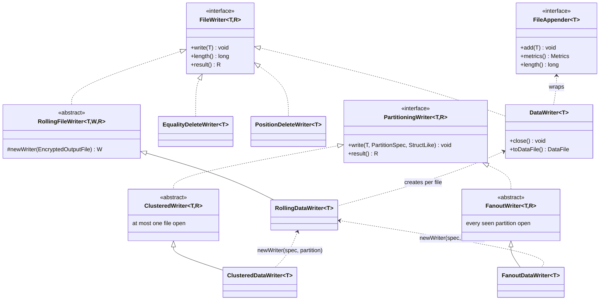
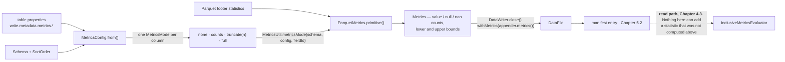

# Chapter 5.1 — The writer family and metrics collection

<div class="chapter-meta" markdown>
**The question this chapter answers:** between an engine handing Iceberg a row and a `DataFile` object appearing with column bounds inside it, which classes touch that row — and where do the bounds that Chapter 4.3 prunes on actually get computed?

**Prerequisites:** Chapter 2.4 (the manifest's `data_file` struct and its `lower_bounds` / `upper_bounds` maps), Chapter 4.3 (metrics pruning — this chapter is its other half)

**Source covered:** `core/.../io/FileWriter.java`, `core/.../io/RollingFileWriter.java`, `core/.../io/ClusteredWriter.java`, `core/.../io/DataWriter.java`, `core/.../MetricsConfig.java`, `parquet/.../ParquetMetrics.java`
</div>

## 1. The problem

Chapter 4.3 showed the read path throwing away entire files without opening them, on the strength of a few bytes in a manifest: `lower_bounds`, `upper_bounds`, `value_counts`, `null_value_counts`. That chapter treated those bytes as given.

They are not given. Somebody wrote them, at write time, having made a decision about which columns deserved them. If that decision went the wrong way, the file has no bounds for the column you filter on, and nothing downstream can recover them — not a re-plan, not a rewrite of the manifest, not a hint. The pruning simply does not happen, and the query plan will not tell you why.

So this chapter is the counterpart to 4.3. Half a mechanism lives there; the other half lives here, in the writer stack. And the writer stack has to solve three problems for every row, on behalf of every engine:

1. **Which file** does this row belong in — which partition, under which spec?
2. **How big** is that file allowed to get before we cut a new one?
3. **What do we record** about the file once it is closed?

Iceberg answers these in three separate layers, so that Spark, Flink and Trino do not each invent their own answer and then disagree about it. The layers compose: routing on top of rolling on top of a single writer contract, with metrics falling out of the bottom.

## 2. Two axes and one contract



Read the diagram as two axes rather than one hierarchy. `RollingFileWriter` adds **size**. `PartitioningWriter` adds **routing**. `ClusteredDataWriter` and `FanoutDataWriter` are the two corners where both are switched on, and they differ only in their routing strategy.

!!! note "There are two writer families in the tree, and both are live"
    Everything above is the `PartitioningWriter` family, which Spark uses. There is a second, older family — `TaskWriter`, `BaseTaskWriter`, `PartitionedWriter`, `PartitionedFanoutWriter`, `UnpartitionedWriter` — still used by the Flink sink, and not deprecated at this tag. `PartitionedFanoutWriter` belongs to that older family; its counterpart in the newer one is `FanoutDataWriter`. Naming a class without naming its family is how people end up reading the wrong file.

## 3. The floor: `FileWriter`



The interface is four methods, and the javadoc carries the whole point: as opposed to `FileAppender`, implementations "not only append records to files but actually produce `DataFile`s or `DeleteFile`s objects with Iceberg metadata."

That is the boundary this chapter is about. A `FileAppender` knows Parquet; it does not know what a partition is. A `FileWriter` wraps one with "extra information such as spec, partition, sort order ID needed to construct `DataFile`s". One spec, one partition, one file — and a result object, not bytes.

The generic result type `R` is why the same interface serves three purposes: `DataWriter` returns `DataWriteResult`, `EqualityDeleteWriter` and `PositionDeleteWriter` return `DeleteWriteResult`. Chapter 5.3 picks up the delete side.

## 4. The size axis

`RollingFileWriter` implements `FileWriter` by delegating to a *sequence* of `FileWriter`s, cutting a new one when the current file reaches the target size. The check is deliberately cheap:



`ROWS_DIVISOR` is 1000. Asking a Parquet appender for its current length is not free — it has to account for buffered, uncompressed row-group state — so the size is *sampled* every thousand rows rather than checked per row. This is the first place `write.target-file-size-bytes` reveals itself as a target rather than a cap.

The interesting method is the one that closes a file, because it has a branch that has nothing to do with rolling:



If `currentFileRows == 0`, the file is deleted instead of being added to the result. A zero-row data file is not wrong, exactly — it is a valid Parquet file with a valid footer — but it is a manifest entry that will be planned, opened and discarded forever after, for nothing. So it is removed.

Note *how* it is removed: `Tasks.foreach(...).suppressFailureWhenFinished()`, with a comment saying the file "may not have been created or cannot be deleted, and it isn't worth failing the job to clean up". The same preference that Chapter 3.3 §6 established for commits shows up here in miniature — a leaked empty file is cheaper than a failed write job.

## 5. The routing axis: clustered or fanout

`PartitioningWriter.write(row, spec, partition)` takes the partition as an argument, so the engine has already computed it — by `StructTransform.wrap`, into a tuple object it reuses for every row (Chapter 2.6 §5), which is why both writers below copy it before storing it. What remains is a bookkeeping question: how many files do you keep open at once?

There are exactly two answers, and they are not preferences. `FanoutWriter` keeps a `Map<Integer, StructLikeMap<FileWriter>>` — every spec/partition pair it has ever seen stays open until close. `ClusteredWriter` keeps one:



Three things are happening here.

**A spec change closes the current writer** and clears the completed-partition set, because partitions are only comparable within a spec.

**A partition change closes the current writer too** — this is the memory guarantee. At most one file is open, so peak memory does not scale with partition cardinality.

**Revisiting a completed spec or partition throws.** `completedSpecIds` and `completedPartitions` exist purely to detect that case, and the message names the remedy: *"Either cluster the incoming records or switch to fanout writers."* The class does not sort. It asserts that the caller sorted, and refuses to silently produce a second file per partition — which is what a lenient implementation would do, quietly turning one file per partition into hundreds and defeating the very guarantee the class exists to provide.

Both classes copy the partition key on the way in — `StructLikeUtil.copy(partition)`, with the comment "the key object may be reused". Engines hand the same mutable `PartitionKey` instance back on every row. Storing it as a map key without copying would corrupt the map on the next row.

## 6. Where a `DataFile` is born

Rolling and routing decide which appender gets the row. Closing is where metadata comes into existence:



Every field of the manifest entry is assembled here: format, path, partition, encryption key metadata, size, split offsets, sort order. And one line that this chapter exists for:

```java
.withMetrics(appender.metrics())
```

`appender.metrics()` is the appender's summary of what it just wrote — row count, per-column sizes, value counts, null counts, NaN counts, lower bounds, upper bounds. From here the `DataFile` travels into a manifest (Chapter 5.2), and from the manifest into `InclusiveMetricsEvaluator` (Chapter 4.3). **Nothing between those two points can add a statistic that was not computed on this line.**

## 7. `MetricsConfig`: deciding what to collect, before any row is written

`Metrics` is not "everything the format knows". It is a filtered projection, and the filter is `MetricsConfig`, resolved from table properties, schema and sort order. Two inputs on the left, one dashed edge on the right, and the whole chapter in between:



The dashed edge is the message. Everything to its left happens once, at write time; everything to its right is stuck with the result. Now the resolver:



Four decisions, in order:

1. **A configured default wins.** `write.metadata.metrics.default` — parsed into a `MetricsMode`: `none`, `counts`, `truncate(n)`, or `full`. The built-in default is `truncate(16)`.
2. **Otherwise the schema width decides.** If the schema has more projected ids than `write.metadata.metrics.max-inferred-column-defaults` (default 100), only the first N metrics-eligible field ids keep the default mode and **everything else becomes `none`**. The field's declaration carries the reason: *"Disable metrics by default for wide tables to prevent excessive metadata."*
3. **Sorted columns get promoted.** `sortedColumnDefaultMode` lifts `none` and `counts` to `truncate(16)` for any order-preserving sort column. Sorting a table by a column and then having no bounds on it would be perverse — the sort exists to make that column prunable.
4. **Per-column overrides are applied last.** `write.metadata.metrics.column.<name>`.

Everything downstream reads the resolved mode through one accessor, `MetricsUtil.metricsMode(schema, config, fieldId)`, which maps the field id to a column name and asks the config.

## 8. Applying the modes: `ParquetMetrics`

The Parquet writer collects the modes and applies them column by column when the footer is available:



The shape is: resolve the mode, convert it to a truncate length, then take the first available source of statistics.

`truncateLength(mode)` returns `0` for both `None` and `Counts`, and `Integer.MAX_VALUE` for `Full`. So the length is doing double duty — a length of zero means "counts only, no bounds", which is why `metricsFromFooter` branches to `counts(fieldId)` rather than `bounds(...)`.

Mode `None` returns `ImmutableList.of()` before that: no entry at all. Not a null bound, not an empty one — the column is absent from `valueCounts`, `nullValueCounts`, `lowerBounds` and `upperBounds` entirely. It is also excluded from `columnSizes` in the enclosing `metrics()` method. A reader cannot distinguish "no metrics collected" from "no such column".

Truncation is directional. `truncateLowerBound` calls `UnicodeUtil.truncateStringMin`, which shortens the string — always smaller, so the bound stays a valid *lower* bound. `truncateUpperBound` calls `truncateStringMax`, which must shorten *and then increment* to stay a valid upper bound. That increment can fail:



It walks backwards through code points looking for one it can increment without overflow. If every position overflows, it returns `null` — and the upper bound is omitted from `Metrics` altogether, while the lower bound survives.

This is the direction that matters for 4.3. A truncated lower bound is smaller than the true minimum; a truncated upper bound is larger than the true maximum. The stored range is always a *superset* of the real range, so `InclusiveMetricsEvaluator` may fail to prune a file it could have pruned, but never prunes one it should have kept. Correctness beat precision, and the truncation direction is where that decision is implemented.

## 9. Gotchas

!!! warning "A wide table silently loses metrics beyond the first 100 columns"
    With no explicit `write.metadata.metrics.default`, a schema of more than 100 projected ids gets default-mode metrics on the first 100 metrics-eligible fields and `none` on everything else. Manifests stay small; a filter on column 1001 becomes unprunable. Nothing warns you, at write time or at read time. On wide tables, set the mode explicitly for the columns you actually filter on.

!!! warning "Clustered writers do not sort — they assume sorting and fail loudly"
    `IllegalStateException: Incoming records violate the writer assumption that records are clustered by spec and by partition within each spec.` This is not a bug to work around by retrying. It means the engine promised sorted input and did not deliver, and the two legitimate fixes are in the message: cluster the input, or pay the memory cost of a fanout writer.

!!! warning "`write.target-file-size-bytes` is a target, not a cap"
    The roll check fires only on multiples of 1000 rows. A batch of very wide rows can overshoot the target substantially before the next check lands. Sizing downstream systems on the assumption that no data file exceeds the target will eventually be wrong.

!!! note "An upper bound can be missing while the lower bound is present"
    `internalTruncateMax` returning `null` drops the upper bound and nothing else. Readers must treat a missing bound as *unknown*, never as *empty* — and they do. Any tool that reads manifests directly and assumes bounds come in pairs will mis-prune.

## Key takeaways

- The writer stack composes two independent axes — rolling for file size, routing for spec/partition — over a single `FileWriter` contract whose job is to produce Iceberg metadata, not bytes.
- Clustered and fanout are a memory-versus-input-ordering trade, not a preference: clustered keeps one file open and throws when the input is unsorted; fanout keeps every seen partition open and scales memory with cardinality.
- `DataWriter.close()` is where a `DataFile` comes into existence, and `withMetrics(appender.metrics())` is the single line that feeds Chapter 4.3's pruning.
- `MetricsConfig.from()` decides per-column modes before a row is written, and its wide-table fallback to `none` is the most consequential default in the write path.
- Bounds are truncated outward — lower down, upper up — so the stored range always contains the real one. When the upper bound cannot be incremented it is dropped rather than made wrong.
- A statistic not collected at write time cannot be recovered later. Metrics configuration is a permanent property of every file written under it.

## Source map

| What | File |
| --- | --- |
| `FileWriter`, `DataWriter`, `DataWriteResult` | [`core/.../io/FileWriter.java`](https://github.com/apache/iceberg/blob/apache-iceberg-1.11.0/core/src/main/java/org/apache/iceberg/io/FileWriter.java) |
| `RollingFileWriter`, `RollingDataWriter` | [`core/.../io/RollingFileWriter.java`](https://github.com/apache/iceberg/blob/apache-iceberg-1.11.0/core/src/main/java/org/apache/iceberg/io/RollingFileWriter.java) |
| `PartitioningWriter`, `ClusteredWriter`, `FanoutWriter` | [`core/.../io/ClusteredWriter.java`](https://github.com/apache/iceberg/blob/apache-iceberg-1.11.0/core/src/main/java/org/apache/iceberg/io/ClusteredWriter.java), [`FanoutWriter.java`](https://github.com/apache/iceberg/blob/apache-iceberg-1.11.0/core/src/main/java/org/apache/iceberg/io/FanoutWriter.java) |
| `ClusteredDataWriter`, `FanoutDataWriter` | [`core/.../io/ClusteredDataWriter.java`](https://github.com/apache/iceberg/blob/apache-iceberg-1.11.0/core/src/main/java/org/apache/iceberg/io/ClusteredDataWriter.java) |
| Older family (Flink) | [`core/.../io/BaseTaskWriter.java`](https://github.com/apache/iceberg/blob/apache-iceberg-1.11.0/core/src/main/java/org/apache/iceberg/io/BaseTaskWriter.java), [`PartitionedFanoutWriter.java`](https://github.com/apache/iceberg/blob/apache-iceberg-1.11.0/core/src/main/java/org/apache/iceberg/io/PartitionedFanoutWriter.java) |
| Writer and output-file factories | [`core/.../io/FileWriterFactory.java`](https://github.com/apache/iceberg/blob/apache-iceberg-1.11.0/core/src/main/java/org/apache/iceberg/io/FileWriterFactory.java), [`OutputFileFactory.java`](https://github.com/apache/iceberg/blob/apache-iceberg-1.11.0/core/src/main/java/org/apache/iceberg/io/OutputFileFactory.java) |
| Where `MetricsConfig.forTable` is injected | [`data/.../BaseFileWriterFactory.java`](https://github.com/apache/iceberg/blob/apache-iceberg-1.11.0/data/src/main/java/org/apache/iceberg/data/BaseFileWriterFactory.java) |
| `MetricsConfig`, `MetricsModes`, `MetricsUtil` | [`core/.../MetricsConfig.java`](https://github.com/apache/iceberg/blob/apache-iceberg-1.11.0/core/src/main/java/org/apache/iceberg/MetricsConfig.java), [`MetricsModes.java`](https://github.com/apache/iceberg/blob/apache-iceberg-1.11.0/core/src/main/java/org/apache/iceberg/MetricsModes.java) |
| Metrics collection for Parquet | [`parquet/.../ParquetMetrics.java`](https://github.com/apache/iceberg/blob/apache-iceberg-1.11.0/parquet/src/main/java/org/apache/iceberg/parquet/ParquetMetrics.java), [`ParquetUtil.java`](https://github.com/apache/iceberg/blob/apache-iceberg-1.11.0/parquet/src/main/java/org/apache/iceberg/parquet/ParquetUtil.java) |
| Bound truncation | [`api/.../util/UnicodeUtil.java`](https://github.com/apache/iceberg/blob/apache-iceberg-1.11.0/api/src/main/java/org/apache/iceberg/util/UnicodeUtil.java), [`BinaryUtil.java`](https://github.com/apache/iceberg/blob/apache-iceberg-1.11.0/api/src/main/java/org/apache/iceberg/util/BinaryUtil.java) |

**Next:** Chapter 5.2 takes the `DataFile` objects this chapter produced and asks how they get into manifests — where `FastAppend` and `MergeAppend` give opposite answers.
