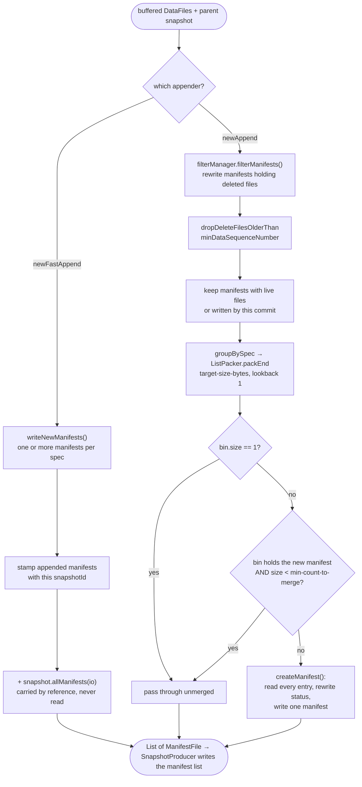

# Chapter 5.2 — `FastAppend` vs `MergeAppend`

<div class="chapter-meta" markdown>
**The question this chapter answers:** `table.newAppend()` and `table.newFastAppend()` both add data files and both produce an append snapshot — so what does the extra work in `MergeAppend` buy, and when does it cost more than it buys?

**Prerequisites:** Chapter 3.3 (`SnapshotProducer` — the commit loop and the abstract-`apply` contract), Chapters 2.3 and 2.4 (the manifest list, and the manifests it points at), Chapter 5.1 (the `DataFile` objects being appended)

**Source covered:** `core/.../FastAppend.java`, `core/.../MergeAppend.java`, `core/.../MergingSnapshotProducer.java`, `core/.../ManifestMergeManager.java`
</div>

## 1. The problem

Chapter 3.3 established the contract: `SnapshotProducer` handles refresh, validation, sequence numbers, the manifest list, the retry loop and cleanup, and subclasses fill in one method — *given the current metadata and parent snapshot, produce the list of manifests this snapshot should point at.*

For an append that sounds trivial. You have new data files. Write them into a manifest. Return that manifest plus everything the parent snapshot already pointed at. Done.

That is exactly what `FastAppend` does, and it has a defect that only shows up on the hundredth commit: the manifest count grows by at least one every time, forever. A thousand small appends produce a thousand manifests, every one of which every subsequent scan must open during planning. The table still works; planning gets slower and slower.

The alternative is to pay a little on each commit to keep that number down — read some existing manifests, merge them into fewer, larger ones. That is `MergeAppend`. It amortises manifest compaction into every write instead of deferring it to a maintenance job.

Which one you get is decided by which method you call, and the default is not the one most people assume:



`newAppend()` returns `MergeAppend`. `newFastAppend()` returns `FastAppend`. The merging one is the default.

!!! note "There is no `BaseAppendFiles`"
    The merging implementation is `MergeAppend`, a package-private class in `org.apache.iceberg` that extends `MergingSnapshotProducer<AppendFiles>` and adds nothing but `appendFile` and `appendManifest`. `MergingSnapshotProducer` is the shared base for `MergeAppend`, `BaseOverwriteFiles`, `BaseRowDelta`, `BaseRewriteFiles` and `BaseReplacePartitions` — everything that has to reconcile new files against existing manifests.

## 2. Two answers to one abstract method



The left lane never opens an existing manifest. The right lane may open and rewrite many of them — and, because `apply()` runs inside the retry loop (Chapter 3.3 §5), may do so several times for one logical commit.

## 3. `FastAppend.apply()`



Three moves and a summary.

New data files become new manifests. Manifests handed in via `appendManifest` get a copy stamped with this snapshot's id. Then:

```java
if (snapshot != null) {
  manifests.addAll(snapshot.allManifests(ops().io()));
}
```

Every manifest of the parent snapshot is appended *by reference*. Not read, not filtered, not rewritten. This single line is the entire performance argument for `FastAppend`: commit cost is proportional to the data you are adding, not to the size of the table.

It is also the entire correctness argument. `FastAppend` can only carry manifests forward untouched because an append never invalidates anything already in them. Nothing is deleted, so nothing needs rewriting. The moment an operation removes a file, this strategy stops being available — which is why `FastAppend` extends `SnapshotProducer` directly and everything else extends `MergingSnapshotProducer`.

The per-attempt discipline is worth a look, because retries make it necessary:



Note the plural in `writeNewManifests`, because "one manifest per spec" is the natural guess and it is wrong twice over. `SnapshotProducer.writeManifests` splits the file list across `manifestWriterCount(WORKER_THREAD_POOL_SIZE, fileCount)` writers — `max(1, min(workerPoolSize, round(fileCount / 10_000)))` — so a commit adding tens of thousands of files writes several manifests per spec in parallel. And each of those writers is a `RollingManifestWriter` that cuts a new file at `commit.manifest.target-size-bytes`, 8 MB by default. One manifest per spec is the small-commit case, not the rule.

If new files were added since the last attempt wrote manifests, those manifests are deleted and rewritten. If not, the previously written ones are reused. So a retry caused purely by losing a commit race does *not* rewrite the data manifests — only the manifest list, which `SnapshotProducer` handles. That is a meaningful difference from the merging path, where the newest bin always changes identity.

This is also why `FastAppend` opts out of post-commit cleanup entirely:



The comment is the explanation: appended manifests are never rewritten, and manifests written by `appendFile` are already cleaned between attempts. The only case that needs the generic cleanup is a manifest that had to be *copied* because it could not inherit the snapshot id.

## 4. `MergingSnapshotProducer.apply()`

The merging path has a different shape, and it is doing more than merging:



Read it in four stages.

**Filter.** `filterManager.filterManifests(...)` walks the parent snapshot's data manifests and rewrites any that contain files this operation deletes. For a pure append there is nothing to delete and this is close to a no-op — but the code path is shared with `OverwriteFiles` and `RowDelta`, which is why `MergeAppend` inherits it.

**Age out deletes.** `minDataSequenceNumber` is the smallest sequence number among surviving data manifests. Any delete file older than that cannot apply to any live data file, so `dropDeleteFilesOlderThan` discards it. This is how equality delete files eventually leave a table (Chapter 5.3) — not by explicit removal, but by every data file they could have applied to being gone.

**Keep only what is alive.** The `shouldKeep` predicate drops manifests with no added and no existing files that were not written by this commit. A manifest whose every entry has been deleted is dead weight in the manifest list.

**Merge.** Two independent merge managers — one for data manifests, one for delete manifests. They never mix, because a manifest holds one content type.

The summary bookkeeping at the end is worth noticing: `replacedManifestsCount` sums four sources, and the comment enumerates them. Manifests rewritten by filtering are *replaced*; manifests copied on append are *new*. That distinction shows up in the snapshot summary and, from there, in anything monitoring commit cost.

## 5. The merge policy

`ManifestMergeManager` groups by spec id and then bin-packs each group. The policy is small enough to read in full:



Two decisions here are counter-intuitive, and both are explained by the comments.

**`new ListPacker<>(targetSizeBytes, 1, false)` with `packEnd`.** A lookback of 1 is the weakest possible bin-packer — it can only consider the current bin. A better packer would produce fuller bins. The comment says why it is not used:

> *use a lookback of 1 to avoid reordering the manifests. using 1 also means this should pack from the end so that the manifest that gets under-filled is the first one, which will be merged the next time.*

Reordering manifests reorders the data files inside them, and the second comment in the method spells out the consequence: preserving order "helps avoid random deletes when data files are eventually aged off". Manifest order is a weak but real proxy for insertion order, and insertion order is a weak but real proxy for locality. Better packing would buy a few bytes and cost that.

Packing from the end also means the under-filled bin is the *newest* one — the one that will grow on the next commit anyway.

**`bin.contains(first) && bin.size() < minCountToMerge`.** `first` is the manifest holding this commit's new data files. Only the bin containing it is subject to `commit.manifest.min-count-to-merge`. Bins made entirely of older manifests are merged regardless of how few they contain. The comment: the guard is *"applied only to bins with an in-memory manifest so that large manifests don't prevent merging older groups."*

Reading `commit.manifest.min-count-to-merge = 100` as "never merge fewer than 100 manifests" is therefore wrong, and it explains the common surprise that a table with that setting still rewrites manifests on a small append.

The three properties, with their defaults:

| Property | Default | Effect |
| --- | --- | --- |
| `commit.manifest.target-size-bytes` | 8 MB | Bin size for packing |
| `commit.manifest.min-count-to-merge` | 100 | Minimum bin size *for the bin holding new files* |
| `commit.manifest-merge.enabled` | `true` | `false` makes `MergeAppend` behave like `FastAppend` for merging, while keeping filtering |

## 6. What merging actually rewrites



Every entry of every manifest in the bin is read and re-written, with a three-way status decision:

- `DELETED` from a *previous* snapshot is dropped. The comment: "suppress deletes from previous snapshots. only files deleted by this snapshot should be added to the new manifest." A tombstone that has already been superseded carries no information.
- `ADDED` by *this* snapshot stays `ADDED`.
- Everything else becomes `EXISTING`.

That last rule is the one that surprises people. A data file added in snapshot 40 shows `status = 1` in snapshot 40's manifest. If snapshot 41 is a `MergeAppend` whose bin-packing happens to include that manifest, the same file shows `status = 0` in snapshot 41's manifest, with no data change whatsoever. Anything diffing manifests across snapshots to detect writes has to key on `snapshot_id`, not on status.

The cache at the top — `mergedManifests`, keyed by the input bin — is a retry optimisation. On a second attempt, bins of purely existing manifests hash the same and their merged output is reused. The bin containing the new files does not: its `ManifestFile` object changed, so that bin is always a cache miss. The comment says exactly this.

## 7. Choosing

<div class="grid cards" markdown>

-   **`newFastAppend()`**

    Commit cost independent of table size. Manifest count grows monotonically. Requires `RewriteManifests` (Chapter 5.5) as a separate maintenance job. Right for high-frequency ingestion where commit latency matters and a maintenance schedule exists.

-   **`newAppend()`**

    Manifest count stays bounded without external help. Commit cost includes reading and rewriting merged bins — repeated on every retry. Right for tables written at moderate frequency, and the default for a reason.

</div>

The failure mode of the first is a table that plans slowly. The failure mode of the second is a write job that spends more time on manifest I/O than on data, especially under contention, where each lost race throws away the merge work and redoes it.

## 8. Gotchas

!!! warning "Merge work is repeated on every commit retry"
    `apply()` is the first statement inside the retried lambda (Chapter 3.3 §5), and it must be, for the reasons given there. For `MergeAppend` that means N attempts do N rounds of manifest merging. The bin cache absorbs part of the cost for untouched bins, but never for the bin holding the new files. Under heavy concurrency this shows up as write amplification with no corresponding data volume.

!!! warning "`commit.manifest.min-count-to-merge` does not mean what it looks like"
    It gates only the bin containing the newly written manifest. Older manifests are bin-packed and merged with no count floor at all. Raising the property to suppress merging entirely does not work; `commit.manifest-merge.enabled = false` does.

!!! warning "`appendManifest` on a manifest you did not write is a copy, not a reference"
    `FastAppend.appendManifest` takes the cheap path only when `canInheritSnapshotId()` and the manifest has no snapshot id. Otherwise it calls `ManifestFiles.copyAppendManifest` and rewrites the whole file with this commit's snapshot id. The copies are tracked separately in `rewrittenAppendManifests` precisely because they are owned by the table and must be cleaned up if the commit fails, whereas inherited manifests must not be.

!!! note "Entry status changes without a data change"
    After a merge, a file's manifest entry status flips from `ADDED` to `EXISTING`. The `entries` metadata table will show this. It is not a rewrite of the data file and not a sign of anything going wrong.

## Key takeaways

- `FastAppend` and `MergeAppend` fill the same abstract `apply(TableMetadata, Snapshot)` hole; everything about retries, manifest lists and cleanup is inherited from `SnapshotProducer` unchanged.
- `FastAppend` carries the parent snapshot's manifests forward by reference and never reads them, which is only sound because an append invalidates nothing.
- `MergeAppend` runs the full `MergingSnapshotProducer` pipeline — filter, age out deletes, drop dead manifests, bin-pack and merge — and therefore pays I/O proportional to what it merges.
- The bin-packer uses a lookback of 1 and packs from the end deliberately, trading packing efficiency for manifest order, which is a proxy for data locality.
- `commit.manifest.min-count-to-merge` guards only the bin holding the new manifest; older bins merge unconditionally.
- Merging rewrites entry statuses: previous snapshots' `ADDED` becomes `EXISTING` and their `DELETED` entries disappear.

## Source map

| What | File |
| --- | --- |
| `FastAppend` | [`core/.../FastAppend.java`](https://github.com/apache/iceberg/blob/apache-iceberg-1.11.0/core/src/main/java/org/apache/iceberg/FastAppend.java) |
| `MergeAppend` | [`core/.../MergeAppend.java`](https://github.com/apache/iceberg/blob/apache-iceberg-1.11.0/core/src/main/java/org/apache/iceberg/MergeAppend.java) |
| `MergingSnapshotProducer` | [`core/.../MergingSnapshotProducer.java`](https://github.com/apache/iceberg/blob/apache-iceberg-1.11.0/core/src/main/java/org/apache/iceberg/MergingSnapshotProducer.java) |
| `ManifestMergeManager` | [`core/.../ManifestMergeManager.java`](https://github.com/apache/iceberg/blob/apache-iceberg-1.11.0/core/src/main/java/org/apache/iceberg/ManifestMergeManager.java) |
| `ManifestFilterManager` | [`core/.../ManifestFilterManager.java`](https://github.com/apache/iceberg/blob/apache-iceberg-1.11.0/core/src/main/java/org/apache/iceberg/ManifestFilterManager.java) |
| Bin packing | [`api/.../util/BinPacking.java`](https://github.com/apache/iceberg/blob/apache-iceberg-1.11.0/api/src/main/java/org/apache/iceberg/util/BinPacking.java) |
| `commit.manifest.*` defaults | [`core/.../TableProperties.java`](https://github.com/apache/iceberg/blob/apache-iceberg-1.11.0/core/src/main/java/org/apache/iceberg/TableProperties.java) |
| Which appender you get | [`core/.../BaseTable.java`](https://github.com/apache/iceberg/blob/apache-iceberg-1.11.0/core/src/main/java/org/apache/iceberg/BaseTable.java) |

**Next:** Chapter 5.3 keeps the same `MergingSnapshotProducer` base but adds delete files — and with them, the validation that decides whether a delete still means what its writer thought it meant.
