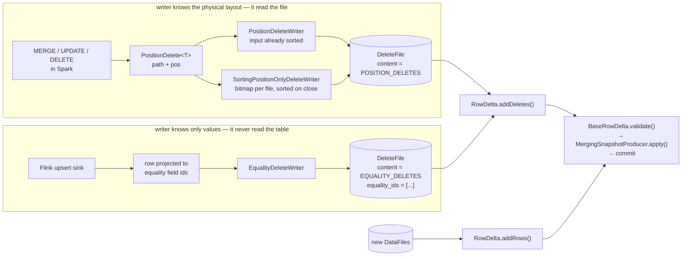
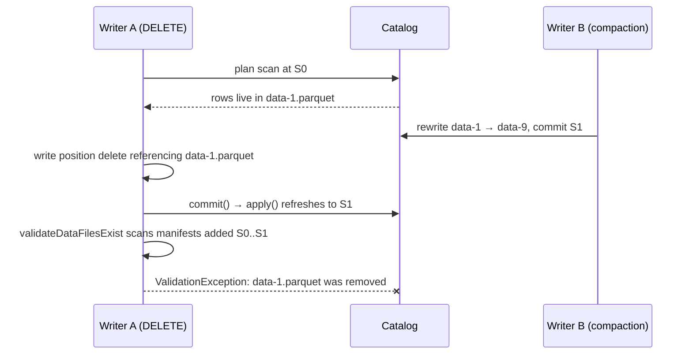

# Chapter 5.3 — Position deletes, equality deletes, and `RowDelta`

**The question this chapter answers:** when a row is deleted without rewriting the file that contains it, what exactly gets written — and what does the committing operation have to check to be sure the deletion still means what its writer thought it meant?

**Prerequisites:** Chapter 3.3 (`SnapshotProducer` — `validate()` is the hook), Chapter 3.5 (the validation family that hangs off it, and the isolation levels that select from it), Chapter 5.2 (`MergingSnapshotProducer`, the shared base), Chapter 2.4 (sequence numbers)

**Source covered:** `core/.../deletes/*`, `core/.../io/BaseTaskWriter.java`, `core/.../BaseRowDelta.java`, `core/.../util/ContentFileUtil.java`

## 1. The problem

Deleting a row from an immutable file is a contradiction, so Iceberg does not try. It records the deletion somewhere else and applies it when the file is read.

"Somewhere else" is a delete file, and there are two kinds. The difference between them is not a performance tuning choice — it is a difference in what the *writer* is able to know.

A **position delete** says: *in `data-7.parquet`, row 4132 is gone.* Exact, tiny, and applied by a reader with a bitmap lookup. To write one you must know where the row physically lives, which means you must have read the file. Only a reader can produce a position delete.

An **equality delete** says: *every row with `id = 42` is gone.* It is a predicate, not a reference. A Flink sink consuming a CDC stream can write one having never opened the table. That is the whole point, and it is also why equality deletes are the most expensive object a reader can encounter.

`RowDelta` is the commit operation that carries both — plus new data files, in the same snapshot. And almost all of `BaseRowDelta` is not about carrying anything. It is validation: a menu of opt-in checks, each defending against one specific way a concurrent writer can have invalidated the delete you are about to commit.

The delete file is the easy half. Deciding whether it is still correct at commit time is the chapter.

## 2. Which delete can you even write?

Both kinds land in delete manifests, both are committed by `RowDelta`, and both are applied at read time. Everything else about them differs.

## 3. Position deletes and the ordering requirement

The spec requires position deletes to be sorted by file path and then position, so readers can stream them. `PositionDeleteWriter` takes that at face value — its javadoc says it "does not keep track of seen deletes and assumes all incoming records are ordered by file and position as required by the spec."

Engines frequently cannot promise that. `SortingPositionOnlyDeleteWriter` is the fallback: it buffers a `BitmapPositionDeleteIndex` per data file and does the sorting itself on close.



Three things happen per path, in order: load any previously written deletes for that data file, merge them into the in-memory bitmap, and record the file they came from in `rewrittenDeleteFiles`. Then the bitmap is replayed in ascending order into the underlying writer.

`rewrittenDeleteFiles` is how the old delete file gets removed from the table: the write result carries it, and the commit passes it to `RowDelta.removeDeletes`. Merging without that would leave two delete files covering overlapping positions — correct, but growing without bound.

The safety check on that merge is five lines:



The class javadoc explains it: "Callers must ensure only previous file-scoped deletes are loaded because partition-scoped deletes can apply to multiple data files and can't be safely discarded." Absorb a partition-scoped delete into a file-scoped one and drop the original, and every *other* data file that original covered gets its rows back.

## 4. Granularity, and a metrics field doing structural work

Whether a delete file is file-scoped or partition-scoped is a writer choice:



The javadoc states the trade completely, and its last sentence is the one to keep: *"Regular delete compaction is still required regardless of which granularity is chosen."*

The table property is `write.delete.granularity`, defaulting to `partition`.

Now the part that is easy to miss. That distinction — file-scoped or not — has to survive into the manifest, so that planning and compaction can use it. There is a `referenced_data_file` field for exactly this, but it is not always populated. So `PositionDeleteWriter` arranges a fallback:



Eight lines. If the writer touched more than one data file, the `file_path` column's counts *and bounds* are stripped. If it touched exactly one, only the counts are stripped — the bounds survive, and they are necessarily equal to each other, because there was only one distinct value.

The other end reads the marker back:



Four branches, in order. An equality delete returns `null` immediately — it references no data file by construction. Otherwise: prefer the explicit `referenced_data_file`; failing that, take the `file_path` lower bound *only if it equals the upper bound*; failing that, return `null`. Equality of the two bounds is the proof that the delete file covers exactly one data file, and `isFileScoped` is just this method tested against `null`.

A metrics field is being used as a structural marker. It works, it is cheap, and it means any code that rewrites delete-file metrics has to preserve the invariant or file-scoped deletes silently degrade into partition-scoped ones and stop being discardable during compaction. `ContentFileUtil.replacePathBounds`, used by `RewriteTablePath`, exists to do exactly that preservation.

## 5. Equality deletes



Structurally identical to `DataWriter.close()` from Chapter 5.1 — same builder, same metrics handoff — with one difference: `ofEqualityDeletes(equalityFieldIds)`. Those ids are written into the manifest entry, and they are what tells a reader which columns to compare.

The rows written are the source rows projected to those columns. Nothing about physical layout is recorded, because the writer does not know any.

At this tag, **no Spark write path constructs an `EqualityDeleteWriter`** — only benchmarks do. The production user is Flink's `BaseDeltaTaskWriter`, through the older writer family's `BaseTaskWriter.BaseEqualityDeltaWriter`. That is why most Iceberg users never see an equality delete file, and why the ones who do are almost always running CDC ingestion.

That Flink-facing writer contains an optimisation that explains what equality deletes are really *for*:



`insertedRowMap` maps each equality key this writer has inserted to the `PathOffset` where it landed. Deleting a row that is in that map emits a **position** delete against the file this writer just wrote, and returns `true`. Only when the key is absent does `delete(row)` fall through to `eqDeleteWriter.write(row)`.

So a CDC stream that inserts a row and then updates it within the same checkpoint produces a position delete, not an equality delete. Equality deletes are reserved for rows the writer did not itself insert — the ones whose location it genuinely cannot know. The expensive mechanism is used only where the cheap one is impossible.

## 6. `RowDelta` and the cost of being right

`BaseRowDelta` extends `MergingSnapshotProducer<RowDelta>` and adds almost nothing but configuration: four methods that carry content (`addRows`, `addDeletes`, `removeRows`, `removeDeletes`), six that configure conflict checks (`validateFromSnapshot`, `validateDeletedFiles`, `validateDataFilesExist`, `conflictDetectionFilter`, `validateNoConflictingDataFiles`, `validateNoConflictingDeleteFiles`), `toBranch`, and an `operation()` that reports `append`, `delete` or `overwrite` depending on what was actually added.

Everything else it has is one `validate()` — the hook `SnapshotProducer` calls inside the retry loop, against freshly refreshed metadata (Chapter 3.3 §3). **Chapter 3.5 §7 reads that method line by line** and owns the general account: which of the five family checks share a single flag, why `validateAddedDVs` sits outside every conditional and behind none, why the ancestry precondition is a `checkArgument` rather than a `ValidationException`, and why `validateNoConflictingFileAndPositionDeletes` is a self-contradiction check rather than a concurrency one.

This section asks the narrower question a chapter about deletes owes: **what does each of those checks protect a delete file from?** The answers are specific to deletes in a way the general account is not, because a delete file is the one thing in Iceberg whose correctness depends on a file it does not contain.

**`validateDataFilesExist`** — the data files this delete references must still be present. The race it catches:

Without that check, A commits a delete file pointing at a data file nobody reads any more. The rows it was meant to remove are alive in `data-9.parquet`, and they come back.

**`validateAddedDataFiles`** — no new data files matching `conflictDetectionFilter` since the starting snapshot. A `DELETE FROM t WHERE region = 'eu'` that commits after someone inserted new `eu` rows leaves those rows undeleted: the delete file names positions in the files the planner saw, and a file it never saw has no positions named in it. Nothing about the delete is malformed; it is simply incomplete, and no later reader can tell.

**`validateNoNewDeleteFiles` / `validateNoNewDeletesForDataFiles`** — no concurrent deletes against the files this operation is removing. Two delete files against one data file are legal in V2 and merge at read time; the check exists for the case where this commit is *removing* the data file, which would strand the other writer's deletes on a file no scan reaches.

**`validateAddedDVs`** — specific to V3, and behind no flag at all, because two deletion vectors for one data file are not mergeable the way two V2 position-delete files are. Chapter 5.4 reads it.

### The flag that does two things

One wiring detail is worth pulling out, because reading either method alone gets the semantics wrong. Where `BaseRowDelta.validate` calls the first check, its fourth argument is `ignoreDeleted`, and the value passed is `!validateDeletes` — the negation of the flag that `RowDelta.validateDeletedFiles()` sets.

So calling `validateDeletedFiles()` does two things at once. It tightens this check from "the file must not have been removed by a rewrite" to "the file must not have been removed at all" — and, separately, it turns on `failMissingDeletePaths()`, which decides whether a delete path that matches nothing is an error or a silent no-op.

The two are coupled in the API and independent in meaning. A caller that wants the stricter existence check and *not* the missing-path failure cannot express it; a caller that reads `failMissingDeletePaths` in isolation will not find the line that turned it on.

Which of these checks run at all is the engine's decision, not core's: Spark's `SparkPositionDeltaWrite` turns on the set matching the isolation level configured for the operation, and Chapter 3.5 §8 has the full mapping from level to call.

## 7. Gotchas

!!! warning "Equality deletes apply to data the writer has never seen"
    An equality delete with `equality_ids = [id]` and value `42` removes every row with `id = 42` in any data file whose data sequence number is lower than the delete's — including files written months earlier by a different job. It is a predicate over the past. This is also why `MergingSnapshotProducer.apply()` calls `dropDeleteFilesOlderThan(minDataSequenceNumber)`: once no surviving data file is old enough to be affected, the delete file is dead and is dropped. That is the only way equality deletes leave a table without explicit compaction.

!!! warning "`validateDeletedFiles()` changes the meaning of `validateDataFilesExist()`"
    The `ignoreDeleted` argument is `!validateDeletes`. With `validateDeletedFiles()` off, a data file removed by a rewrite is tolerated as long as it is not *missing*; with it on, any removal fails the commit and missing delete paths fail too. The two methods are one setting with two names.

!!! warning "File-scoped position deletes are identified by a metrics field when `referenced_data_file` is absent"
    Equal `file_path` lower and upper bounds is the marker, and `PositionDeleteWriter.metrics()` is what maintains it by stripping the bounds as soon as a second data file is referenced. Any tool that rewrites delete-file metrics — path relocation, custom compaction, a metadata migration — must preserve it, or file-scoped deletes become invisible to `SortingPositionOnlyDeleteWriter`'s merge path and to compaction's delete-ratio heuristic (Chapter 5.5).

!!! note "`SortingPositionOnlyDeleteWriter` refuses to absorb partition-scoped deletes"
    `validatePreviousDeletes` asserts `isFileScoped` on everything it merges. Merging a partition-scoped delete and discarding the original would resurrect rows in every other data file that original covered. The check is a `Preconditions.checkArgument`, not a filter — a caller that loads the wrong deletes gets an error, not silent corruption.

## Key takeaways

- The two delete kinds are separated by what the writer knows: a position delete requires having read the data file, an equality delete requires only values.
- `SortingPositionOnlyDeleteWriter` exists because the spec requires file/position ordering that most engines cannot produce; it buffers a bitmap per data file and reports superseded delete files so the commit can drop them.
- `DeleteGranularity` trades total delete-file count against how much irrelevant delete data a scan must load; neither setting removes the need for delete compaction.
- File-scoped position deletes are marked by equal `file_path` bounds when `referenced_data_file` is absent — a metrics field carrying structural meaning.
- Flink's equality-delta writer emits position deletes for rows it inserted itself and equality deletes only for rows it did not; the expensive form is a last resort.
- `BaseRowDelta.validate()` is the chapter's real subject: an opt-in menu of concurrency checks, each mapping to one way a concurrent commit can invalidate a delete.

## Source map

| What | File |
| --- | --- |
| `PositionDelete`, `PositionDeleteWriter` | [`core/.../deletes/PositionDeleteWriter.java`](https://github.com/apache/iceberg/blob/apache-iceberg-1.11.0/core/src/main/java/org/apache/iceberg/deletes/PositionDeleteWriter.java) |
| `SortingPositionOnlyDeleteWriter` | [`core/.../deletes/SortingPositionOnlyDeleteWriter.java`](https://github.com/apache/iceberg/blob/apache-iceberg-1.11.0/core/src/main/java/org/apache/iceberg/deletes/SortingPositionOnlyDeleteWriter.java) |
| `EqualityDeleteWriter`, `DeleteGranularity` | [`core/.../deletes/EqualityDeleteWriter.java`](https://github.com/apache/iceberg/blob/apache-iceberg-1.11.0/core/src/main/java/org/apache/iceberg/deletes/EqualityDeleteWriter.java), [`DeleteGranularity.java`](https://github.com/apache/iceberg/blob/apache-iceberg-1.11.0/core/src/main/java/org/apache/iceberg/deletes/DeleteGranularity.java) |
| `PositionDeltaWriter`, `BasePositionDeltaWriter` | [`core/.../io/PositionDeltaWriter.java`](https://github.com/apache/iceberg/blob/apache-iceberg-1.11.0/core/src/main/java/org/apache/iceberg/io/PositionDeltaWriter.java) |
| `ClusteredPositionDeleteWriter`, `FanoutPositionOnlyDeleteWriter` | [`core/.../io/ClusteredPositionDeleteWriter.java`](https://github.com/apache/iceberg/blob/apache-iceberg-1.11.0/core/src/main/java/org/apache/iceberg/io/ClusteredPositionDeleteWriter.java) |
| `BaseEqualityDeltaWriter` | [`core/.../io/BaseTaskWriter.java`](https://github.com/apache/iceberg/blob/apache-iceberg-1.11.0/core/src/main/java/org/apache/iceberg/io/BaseTaskWriter.java) |
| `RowDelta` / `BaseRowDelta` | [`api/.../RowDelta.java`](https://github.com/apache/iceberg/blob/apache-iceberg-1.11.0/api/src/main/java/org/apache/iceberg/RowDelta.java), [`core/.../BaseRowDelta.java`](https://github.com/apache/iceberg/blob/apache-iceberg-1.11.0/core/src/main/java/org/apache/iceberg/BaseRowDelta.java) |
| Validation helpers | [`core/.../MergingSnapshotProducer.java`](https://github.com/apache/iceberg/blob/apache-iceberg-1.11.0/core/src/main/java/org/apache/iceberg/MergingSnapshotProducer.java) |
| `ContentFileUtil` | [`core/.../util/ContentFileUtil.java`](https://github.com/apache/iceberg/blob/apache-iceberg-1.11.0/core/src/main/java/org/apache/iceberg/util/ContentFileUtil.java) |
| Flink's equality-delete sink | [`flink/v2.1/.../sink/BaseDeltaTaskWriter.java`](https://github.com/apache/iceberg/blob/apache-iceberg-1.11.0/flink/v2.1/flink/src/main/java/org/apache/iceberg/flink/sink/BaseDeltaTaskWriter.java) |

**Next:** Chapter 5.4 asks the question this chapter deliberately left open — whether to write a delete file at all, or rewrite the data file instead — and what V3 deletion vectors change about the answer.
