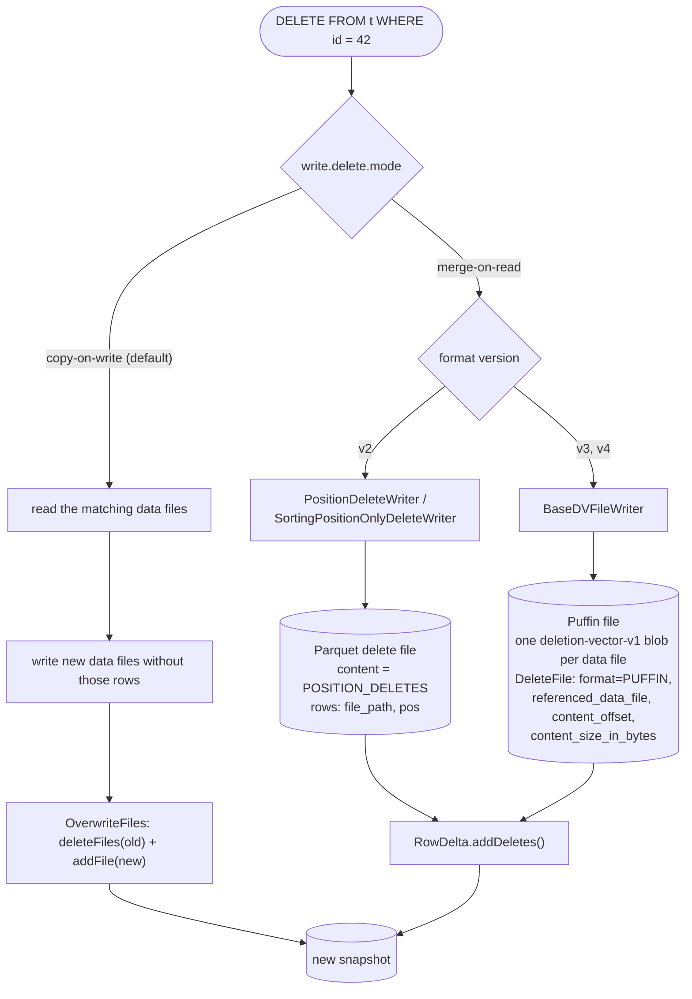
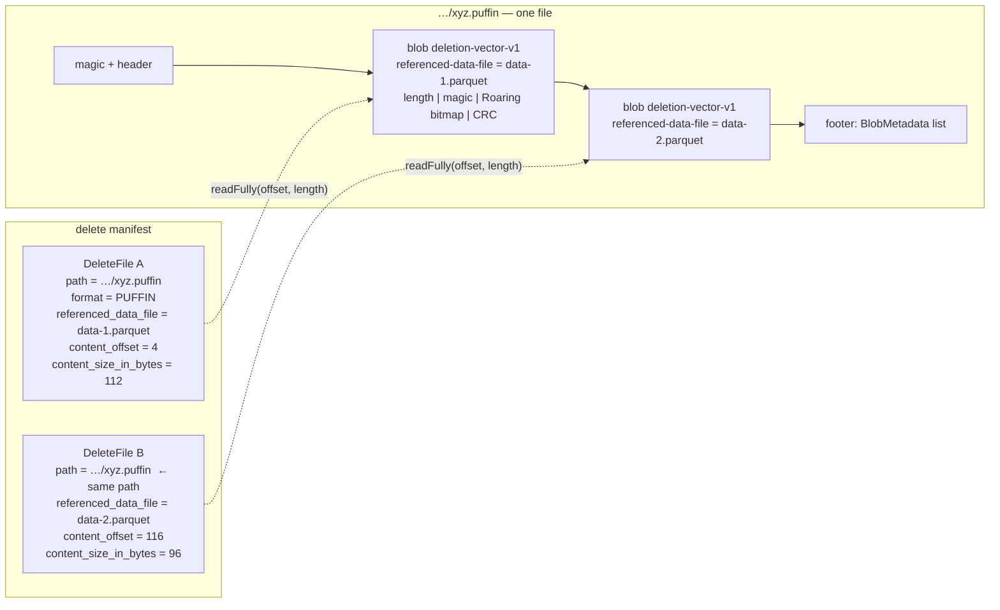

# Chapter 5.4 — Copy-on-write, merge-on-read, and V3 deletion vectors

<div class="chapter-meta" markdown>
**The question this chapter answers:** for a single-row `DELETE`, Iceberg can rewrite a 512 MB data file or write a few bytes of delete metadata — what decides which, what does each cost on the other side, and what do V3 deletion vectors change about that arithmetic?

**Prerequisites:** Chapter 5.3 (the two delete kinds and `RowDelta`), Chapter 3.3 (the commit loop and its `validate()` hook), Chapter 3.5 (what an isolation level is, and which validations it turns on), Chapters 2.3 and 2.5 (delete manifests, and the V2/V3 rule about how a position delete may be encoded)

**Source covered:** `core/.../RowLevelOperationMode.java`, `core/.../deletes/BaseDVFileWriter.java`, `core/.../DVUtil.java`, `core/.../MergingSnapshotProducer.java`, `spark/v4.0/.../SparkPositionDeltaWrite.java`
</div>

## 1. The problem

Chapter 5.3 built delete files without ever asking whether you should write one. That is the question here, and it has a name in the codebase:



The javadoc is the cleanest statement of the trade in the project, and the last paragraph is the whole of it: copy-on-write "consume[s] more time and resources during writes but [doesn't] introduce any performance overhead during reads"; merge-on-read is "much faster during writes but require[s] more time and resources to apply delete files during reads."

Same correctness, cost moved to a different day.

Three table properties select the mode per operation — `write.delete.mode`, `write.update.mode`, `write.merge.mode` — and **all three default to `copy-on-write`**. That is worth stating plainly, because a great deal of advice assumes otherwise.

Copy-on-write is not a separate mechanism. There is no CoW code path to read. It is `RewriteFiles` or `OverwriteFiles` over the `MergingSnapshotProducer` of Chapter 5.2: delete the whole data file, add a rewritten one without the affected rows. Which of the two depends on who is asking. A Spark `DELETE`, `UPDATE` or `MERGE` in copy-on-write mode commits through `table.newOverwrite()` — the class doing it is called `CopyOnWriteOperation`, and it is where the isolation level picks which of Chapter 5.3's validations run. `RewriteFiles` is the compaction path of Chapter 5.5. Both replace whole files, which is the part that matters here. No delete file exists. Its cost is write amplification proportional to *file size*, not to the number of rows changed — deleting one row from a 512 MB file rewrites 512 MB.

Merge-on-read is Chapter 5.3's machinery, committed through `RowDelta`. Its cost is that every subsequent scan touching those data files must find, load and apply the delete information.

And that second cost is where the real objection to MoR always lived. Not the concept — the *bookkeeping*. V2 position deletes are ordinary Parquet files. They accumulate. Each may cover many data files. They must be sorted. At plan time, `DeleteFileIndex` has to work out which of them could apply to each data file, using path ranges. At scan time they must be merged.

V3 deletion vectors attack precisely that. They do not add a new content type; they change the physical encoding so that the answer to "what is deleted in this data file" is one seek and one bitmap.

## 2. One DELETE, three outcomes



The branch on format version is not advisory. It is enforced at `add()` time:



V1: no deletes at all. V2: *"Must not use DVs for position deletes in V2"*. V3 and V4: *"Must use DVs for position deletes in V%s"*. Equality deletes are exempt in every version — they are unaffected by the change, because they were never position-based to begin with.

There is no mixed mode. Upgrading a table to V3 does not convert its existing V2 position deletes, but from that point on every new position delete must be a DV.

## 3. What a deletion vector actually is

Start with the type test, because it is one line and it is not what people expect:



That is all of it. A DV's manifest entry still says `content = POSITION_DELETES`. It is an ordinary `DeleteFile` in an ordinary delete manifest. What changed is `file_format`, and three fields that V2 position deletes leave empty.

Here is the writer:



Read it in four beats.

**Merge before writing.** For each data file, `loadPreviousDeletes.apply(path)` fetches whatever DV already exists, and `positions.merge(previousPositions)` folds it in. The superseded file goes into `rewrittenDeleteFiles` so the commit can remove it. Only file-scoped predecessors are eligible — the same `isFileScoped` guard as Chapter 5.3, for the same reason.

**One Puffin file, many blobs.** `newWriter()` is called once. Every data file's bitmap is written as a separate blob into that single file.

**Offsets, not files.** After closing, `writer.location()` and `writer.fileSize()` are read once and shared:

```java
String puffinPath = writer.location();
long puffinFileSize = writer.fileSize();

for (String path : deletesByPath.keySet()) {
  DeleteFile dv = createDV(puffinPath, puffinFileSize, path);
  dvs.add(dv);
}
```

With the comment above it stating the consequence outright: *"DVs share the Puffin path and file size but have different offsets."* `createDV` fills in `withReferencedDataFile(...)`, `withContentOffset(blobMetadata.offset())` and `withContentSizeInBytes(blobMetadata.length())`.

**Early return on empty.** If nothing was deleted, no Puffin file is created at all.

The blob itself:



Type `StandardBlobTypes.DV_V1`, whose value is the string `"deletion-vector-v1"`. One field id — `_pos`. Snapshot id and sequence number both `-1`, with inline comments saying they are inherited. The payload is `positions.serialize()`. And two blob properties, `referenced-data-file` and `cardinality`, which duplicate information also held in the manifest entry — deliberately, so the Puffin file is self-describing if you ever have to read it without the table.

`serialize()` produces a big-endian length, a little-endian magic number, a portable Roaring bitmap and a big-endian CRC-32. Its javadoc notes that the length and checksum cover the magic bytes too, "for compatibility with Delta". The container is Iceberg's; the blob's interior is not Iceberg-specific.

## 4. Why this makes reads cheap



Sixteen lines, and no Puffin footer is parsed. The manifest entry already carries the byte range: `contentOffset`, `contentSizeInBytes`, `IOUtil.readFully`, `PositionDeleteIndex.deserialize`. One ranged GET, one bitmap.

Compare what V2 requires for the same data file: find every position delete file that might reference it, using `file_path` bounds; read each one; filter to the rows matching this data file; merge into an index. `DeleteFileIndex` exists to do that matching, and the `file_path` bounds trick from Chapter 5.3 exists to make it cheaper.

With DVs, matching is a lookup by `referenced_data_file`, and there is at most one hit. That is the change, and it is structural rather than incremental.



The two dotted edges are the point: the reader never walks the footer to find a DV. The manifest told it where to look.

## 5. The invariant, and what it costs

A DV is only "the deletions for this data file" if there is exactly one of them. That invariant is enforced in three places.

**At buffer time**, `addInternal` routes DVs into `dvsByReferencedFile` — a `Map<String, List<DeleteFile>>` keyed by referenced data file — and everything else into `v2Deletes`. Two DVs for the same data file within one commit therefore land in the same list. `MergingSnapshotProducer.mergeDVs()` walks that map before manifests are written, logs a `LOG.warn` for every key holding more than one (*"Merging {} duplicate DVs for data file {} in table {}"*, because it means the caller produced something it should not have), and hands the map to `DVUtil.mergeAndWriteDVsIfRequired`, which reads the duplicates, merges their bitmaps and writes one new Puffin file named `merged-dvs-<snapshotId>-<attempt>`. It refuses to merge across mismatched sequence numbers or partitions first.

**At validation time**, against concurrent commits:



Every delete manifest added since the starting snapshot is scanned; if any newly added DV references a data file this commit also targets, the commit fails with *"Found concurrently added DV for %s"*.

**At the format boundary**, `validateDeleteFileForVersion`, already shown.

The middle one has a consequence that deserves to be said out loud, because it is the one real regression in the DV design. Two V2 position delete files against the same data file could both commit; a reader would simply union them. Two DVs cannot. **V3 makes concurrent row-level deletes to the same data file strictly more likely to conflict.** For a high-concurrency `MERGE` workload, that is a behavioural change, and the mitigation is the same as it always was for optimistic concurrency: arrange for writers not to overlap.

The other cost is on the writer. `loadPreviousDeletes` is a *read* — of the existing DV — before every write. MoR deletes are no longer append-only. In Spark that loader is supplied by `PreviousDeleteLoader`, driven by `scan.rewritableDeletes(useDVs)`, which means planning a MoR delete on a V3 table also plans the delete files it will need to absorb.

Here is where the choice is finally made, at the writer level:



DVs first, whenever `context.useDVs()` — which is simply `deleteFileFormat == FileFormat.PUFFIN`. Otherwise the V2 rules apply, and the comment states them: the spec requires position deletes ordered by file and position for V2 tables, so a clustered writer is used only when the input is already ordered and no previous deletes need rewriting; otherwise a fanout writer, "no matter whether fanout writers are enabled".

Notice what the DV branch drops. No `targetFileSize`. No `DeleteGranularity`. No ordering requirement. A DV is inherently file-scoped and inherently sorted, because it is a bitmap.

## 6. Gotchas

!!! warning "A deletion vector is not a new content type — branch on `PUFFIN`, not on content"
    `ContentFileUtil.isDV(f)` is exactly `f.format() == FileFormat.PUFFIN`, and the manifest entry's `content` field still reads `POSITION_DELETES`. Any code that branches on content type alone — a metadata-table query, a custom compaction tool, an external catalog integration — will treat a DV as a Parquet position delete file and fail on the first read.

!!! warning "Many DVs share one file path"
    `close()` mints one `DeleteFile` per referenced data file, all with the same `puffinPath` and the same `file_size_in_bytes`, differing only in `content_offset`. Deduplicating delete files by location loses DVs. Summing `file_size_in_bytes` across a V3 delete manifest multiply-counts the same Puffin file. Core uses `DeleteFileSet` for exactly this reason: its wrapper's `equals` and `hashCode` are over the triple `(location, contentOffset, contentSizeInBytes)`, which is the smallest key that tells two DVs in one Puffin file apart.

!!! warning "Writing a DV requires reading the previous one"
    `loadPreviousDeletes` runs before serialization, and the superseded DV is reported in `rewrittenDeleteFiles` for the commit to remove. This is what makes one-DV-per-data-file achievable, and it means a V3 delete costs a read that a V2 position delete did not. On a data file that is deleted from repeatedly, that read grows with the accumulated bitmap.

!!! warning "Two concurrent commits deleting from the same data file cannot both win"
    `validateAddedDVs` throws `ValidationException` rather than merging, because the spec permits only one DV per data file per snapshot. This is stricter than V2 behaviour. Partition writes apart, or expect retries and eventual failures under concurrent `MERGE`.

!!! note "DVs do not remove the need for compaction"
    They make applying deletes cheap; they do not make the deleted rows go away. A data file that is 80% deleted still costs 100% of its bytes to scan. Chapter 5.5's `tooHighDeleteRatio` heuristic exists for exactly that, and it can only see the deleted-row counts of file-scoped deletes — which, on a V3 table, is all of them.

## Key takeaways

- Copy-on-write and merge-on-read are the same correctness with the cost moved; all three row-level operation modes default to copy-on-write.
- Copy-on-write has no dedicated code path — it is `RewriteFiles`/`OverwriteFiles`, and its cost scales with file size rather than with rows changed.
- V3 deletion vectors are not a new content type: a DV is a `DeleteFile` with `content = POSITION_DELETES` and `format = PUFFIN`, carrying `referenced_data_file`, `content_offset` and `content_size_in_bytes`.
- One Puffin file holds one `deletion-vector-v1` blob per data file; the resulting `DeleteFile` entries share a path and differ only in offset.
- Reading a DV is a positioned read of a known byte range followed by a bitmap deserialization — no footer parsing, no range matching, at most one hit per data file.
- The one-DV-per-data-file invariant is what buys that, and it costs a read-before-write on the writer and a hard conflict between concurrent deletes to the same data file.

## Source map

| What | File |
| --- | --- |
| `RowLevelOperationMode` | [`core/.../RowLevelOperationMode.java`](https://github.com/apache/iceberg/blob/apache-iceberg-1.11.0/core/src/main/java/org/apache/iceberg/RowLevelOperationMode.java) |
| `write.delete.mode`, `write.update.mode`, `write.merge.mode` | [`core/.../TableProperties.java`](https://github.com/apache/iceberg/blob/apache-iceberg-1.11.0/core/src/main/java/org/apache/iceberg/TableProperties.java) |
| `BaseDVFileWriter`, `DVFileWriter` | [`core/.../deletes/BaseDVFileWriter.java`](https://github.com/apache/iceberg/blob/apache-iceberg-1.11.0/core/src/main/java/org/apache/iceberg/deletes/BaseDVFileWriter.java) |
| Bitmap and its wire format | [`core/.../deletes/BitmapPositionDeleteIndex.java`](https://github.com/apache/iceberg/blob/apache-iceberg-1.11.0/core/src/main/java/org/apache/iceberg/deletes/BitmapPositionDeleteIndex.java), [`RoaringPositionBitmap.java`](https://github.com/apache/iceberg/blob/apache-iceberg-1.11.0/core/src/main/java/org/apache/iceberg/deletes/RoaringPositionBitmap.java) |
| `PartitioningDVWriter` | [`core/.../io/PartitioningDVWriter.java`](https://github.com/apache/iceberg/blob/apache-iceberg-1.11.0/core/src/main/java/org/apache/iceberg/io/PartitioningDVWriter.java) |
| `DVUtil` — read and merge | [`core/.../DVUtil.java`](https://github.com/apache/iceberg/blob/apache-iceberg-1.11.0/core/src/main/java/org/apache/iceberg/DVUtil.java) |
| Puffin format | [`core/.../puffin/PuffinWriter.java`](https://github.com/apache/iceberg/blob/apache-iceberg-1.11.0/core/src/main/java/org/apache/iceberg/puffin/PuffinWriter.java), [`StandardBlobTypes.java`](https://github.com/apache/iceberg/blob/apache-iceberg-1.11.0/core/src/main/java/org/apache/iceberg/puffin/StandardBlobTypes.java) |
| `isDV`, `containsSingleDV`, `dvDesc` | [`core/.../util/ContentFileUtil.java`](https://github.com/apache/iceberg/blob/apache-iceberg-1.11.0/core/src/main/java/org/apache/iceberg/util/ContentFileUtil.java) |
| Version rules and DV conflict validation | [`core/.../MergingSnapshotProducer.java`](https://github.com/apache/iceberg/blob/apache-iceberg-1.11.0/core/src/main/java/org/apache/iceberg/MergingSnapshotProducer.java) |
| Spark's writer selection | [`spark/v4.0/.../SparkPositionDeltaWrite.java`](https://github.com/apache/iceberg/blob/apache-iceberg-1.11.0/spark/v4.0/spark/src/main/java/org/apache/iceberg/spark/source/SparkPositionDeltaWrite.java) |

**Next:** Chapter 5.5 takes the one thing deletion vectors do not fix — that deleted rows still occupy bytes — and works through the maintenance actions that reclaim them, along with the invariant all four of them must not break.
