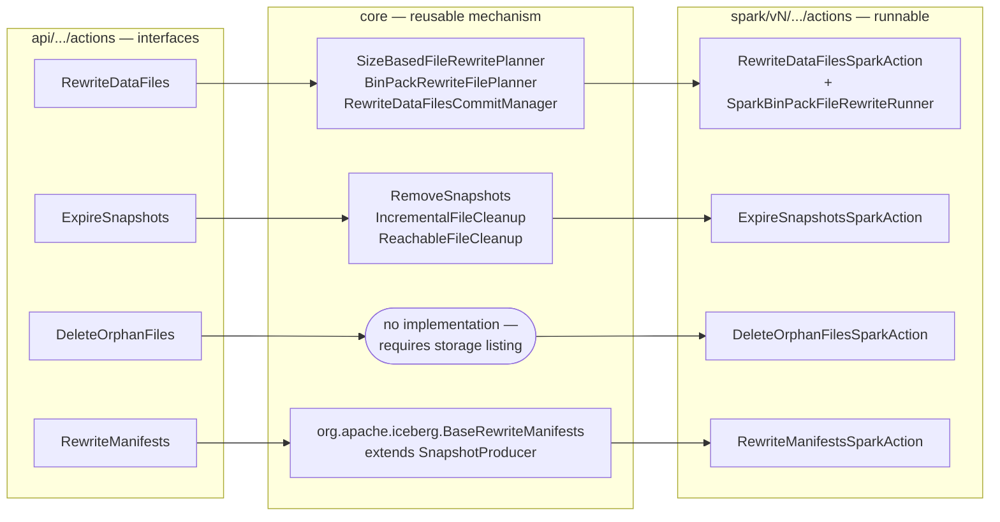
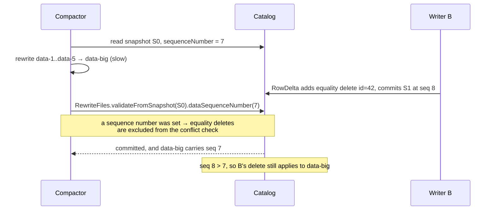

# Chapter 5.5 — Maintenance: compaction, snapshot expiry, orphan files

<div class="chapter-meta" markdown>
**The question this chapter answers:** four maintenance jobs delete or replace files in a table that other readers and writers are using concurrently — what code stops each of them from deleting something a live snapshot can still reach?

**Prerequisites:** Chapter 3.3 (the commit loop, and the "when unsure, delete nothing" principle), Chapter 3.5 (`BaseRewriteFiles.validate`, and the checks that run behind no flag), Chapter 5.2 (`MergingSnapshotProducer`), Chapter 5.4 (delete files and DVs are compaction *input*)

**Source covered:** `core/.../actions/*Planner.java`, `core/.../actions/RewriteDataFilesCommitManager.java`, `core/.../RemoveSnapshots.java`, `core/.../IncrementalFileCleanup.java`, `spark/v4.0/.../DeleteOrphanFilesSparkAction.java`
</div>

## 1. The problem

Every chapter so far has added files. This one removes them, and that is a categorically harder thing to do in a system where readers hold snapshot references, writers commit optimistically, and storage has no transactions.

The invariant is one sentence: **never delete a file that a retained snapshot can still reach.** Violating it does not produce an error. It produces a table that reads fine until someone time-travels, or until a scan that was planned two minutes ago tries to open a file that is gone.

Four jobs have to hold that invariant while doing genuinely destructive work:

| Action | Removes | Guards the invariant by |
| --- | --- | --- |
| `RewriteDataFiles` | data files, replaced by rewritten ones | a commit-time validation, and inheriting the old data sequence number |
| `ExpireSnapshots` | snapshots, then their unreachable files | a reachability computation over metadata |
| `DeleteOrphanFiles` | files that metadata does not reference | a timestamp cutoff, and refusing to guess on path mismatches |
| `RewriteManifests` | nothing — it replaces manifests only | not removing content-file references at all |

Before any of that, one piece of navigation, because the package layout actively misleads.

!!! warning "`core/.../actions/Base*.java` are not the implementations"
    `BaseExpireSnapshots`, `BaseDeleteOrphanFiles`, `BaseRewriteDataFiles` and `core/.../actions/BaseRewriteManifests` are package-private Immutables interfaces whose only job is to generate `ImmutableExpireSnapshots.Result` and friends. `BaseExpireSnapshots.java` is thirty-nine lines: eighteen of Apache licence, a `@Value.Enclosing` / `@Value.Style` pair naming the class to generate, and a nested `Result` interface whose entire body is one `@Value.Default` method delegating to a `super` default. No mechanism at any point. The expiry mechanism is `org.apache.iceberg.RemoveSnapshots`; the manifest-rewrite mechanism is `org.apache.iceberg.BaseRewriteManifests` — a *different class with the same simple name*, in a different package. Grepping for a class name here lands on the wrong file more often than not.

## 2. Where each layer lives



`DeleteOrphanFiles` having no core implementation is a design fact, not an omission. Finding orphans means listing storage, and `FileIO` deliberately does not require listing — that is what lets Iceberg run against object stores where listing is slow, eventually consistent, or unavailable. So the only implementation lives where a distributed listing engine already exists.

## 3. Compaction: plan in core, run in the engine, commit in core

`RewriteDataFiles` splits into three phases. Planning is engine-neutral.

`SizeBasedFileRewritePlanner`'s class javadoc states the base policy:

> *If files are smaller than the `MIN_FILE_SIZE_BYTES` threshold or larger than the `MAX_FILE_SIZE_BYTES` threshold, they are considered targets for being rewritten.*
>
> *Once selected, files are grouped based on the bin-packing algorithm into groups of no more than `MAX_FILE_GROUP_SIZE_BYTES`. Groups will be actually rewritten if they contain more than `MIN_INPUT_FILES` or if they would produce at least one file of `TARGET_FILE_SIZE_BYTES`.*

Two-stage filtering: pick candidate files, then decide whether a *group* of them is worth the work. `MIN_INPUT_FILES` defaults to 5, and the code behind "more than" is `group.size() > 1 && group.size() >= minInputFiles`, so a group of exactly five qualifies and a group of one never does on count.

The javadoc is describing the base class, though, and the concrete planner widens the policy at *both* stages — which is what the rest of this section is about. Take the file stage first:



Three predicates, OR'd. Compaction is not only about small files: a file of exactly the right size is still a rewrite candidate if it has accumulated too many delete files, or if too large a fraction of its rows are deleted. That is the direct link back to Chapter 5.4 — merge-on-read defers work, and this is where the deferred work is finally paid.

The same two predicates reappear at the group stage, which is the part the base javadoc does not cover:



A five-way disjunction, not the two-way one the javadoc describes. So four small files in a partition are *not* simply left alone: they are left alone only if none of them is under delete pressure. One file in the group carrying more than `delete-file-threshold` deletes drags the other three into the rewrite with it. Delete pressure is the one condition that can select both an individual file and an otherwise-uneconomic group.

The delete-ratio predicate has a limitation worth knowing:



Only deletes passing `ContentFileUtil::isFileScoped` contribute to `knownDeletedRecordCount`. A partition-scoped delete file's `recordCount` covers many data files, so attributing all of it to any one of them would be wrong — and the code declines to guess. The consequence: on a table written with `write.delete.granularity = partition`, this heuristic sees nothing and only `tooManyDeletes` can fire. On a V3 table every DV is file-scoped, so the ratio is always available.

The `min(knownDeletedRecordCount, task.file().recordCount())` clamp is there because overlapping delete files can double-count the same position.

## 4. Committing a compaction



The commit is an ordinary `RewriteFiles` — the same `MergingSnapshotProducer` from Chapter 5.2 — with two configurations that carry the whole safety argument. They look independent. They are not.

Start with what `validateFromSnapshot(startingSnapshotId)` does *not* do: it does not switch the delete check on. That check is one of the three in Chapter 3.5's family that run behind no flag — `BaseRewriteFiles.validate()` calls `validateNoNewDeletesForDataFiles` for every rewrite that replaces data files, and its `startingSnapshotId` field is simply `null` until someone sets it. What the call supplies is the *lower bound* of the scan — look only at what was committed since compaction started, instead of walking every version on the branch. It is a cost optimisation on a check that runs either way. The check itself fails the commit when a concurrent writer added a delete file against a data file in this rewrite group, and it has to: the rewritten file does not contain that deletion.

The second configuration is subtler:

```java
if (useStartingSequenceNumber) {
  long sequenceNumber = table.snapshot(startingSnapshotId).sequenceNumber();
  rewrite.dataSequenceNumber(sequenceNumber);
}
```

`USE_STARTING_SEQUENCE_NUMBER` defaults to `true`, and the method it feeds is `dataSequenceNumber` — which is the whole point, because Chapter 2.4 established that a manifest entry carries **two** of them. The *data* sequence number says where a file sits in the delete ordering; the *file* sequence number says when it physically arrived, is always assigned at commit, and cannot be set by a caller.

Compaction is the case that separates them, and this flag is how. The rewritten data file is stamped with the **data** sequence number the table had when compaction *started*, not the one its commit gets; its **file** sequence number is the committing snapshot's, because nothing can override that. So the file arrives now and applies as of then. It appears *older* than any delete file committed during the rewrite window, and those deletes still apply to it — which is exactly the behaviour a rewrite needs and exactly what one sequence number could not express.



That note is where the two configurations meet, and it is a real coupling in the code rather than a coincidence. `BaseRewriteFiles` calls the four-argument overload of `validateNoNewDeletesForDataFiles`, which forwards `newDataFilesDataSequenceNumber != null` as `ignoreEqualityDeletes` — so calling `dataSequenceNumber(...)` is exactly what tells the validation to stop treating a concurrent equality delete as a conflict. The javadoc gives the reasoning: *"if the added data files have the same sequence number as the replaced data files, equality deletes added at a higher sequence number are still effective against the added data files, so there is no risk of commit conflict."*

Position deletes are never excused, in either configuration. A DV or position delete file added during the window against any of `data-1..data-5` names positions that no longer exist, and the commit fails with a message that says which branch fired — *"Cannot commit, found new position delete for replaced data file"* rather than the general *"found new delete for replaced data file"*.

Turn `use-starting-sequence-number` off and `data-big` gets sequence number 9, above B's delete, so that delete would no longer apply to it — and the validation stops ignoring equality deletes at the same moment, precisely because it now has to catch that case. The commit fails rather than resurrecting rows. So the honest description of the default is not "it prevents silent corruption": it is that inheriting the old sequence number is what lets compaction and concurrent equality deletes both succeed. Turning it off converts a class of harmless overlaps into hard commit failures.

The third line worth noting is `danglingDVs.forEach(rewrite::deleteFile)`. When the rewritten data files are removed, any DV that referenced only them has nothing left to point at, and is removed in the same commit.

## 5. Snapshot expiry

`RemoveSnapshots` refuses to exist on a table where deleting files is unsafe:



The check is in the constructor, before any configuration, and the message names the failure mode: *"Cannot expire snapshots: GC is disabled (deleting files may corrupt other tables)"*. `gc.enabled = false` is what you set on a table whose files are shared — a table registered in two catalogs, or one produced by `snapshot` rather than `migrate`, where the data files still belong to somebody else.

The rest of the constructor reads the three defaults: `history.expire.max-snapshot-age-ms` (5 days), `history.expire.min-snapshots-to-keep` (1), `history.expire.max-ref-age-ms` (unbounded). Note `this.now = System.currentTimeMillis()` is captured once, at construction — the cutoff does not drift while the action runs.

`commit()` then does the metadata change through the same `Tasks.foreach(ops).retry(...).onlyRetryOn(CommitFailedException.class)` loop as any other write, and *only afterwards* deletes files. Where the strategy is chosen:



Two strategies, and the automatic choice between them is three conditions:

```java
incrementalCleanup =
    !specifiedSnapshotId
        && !hasRemovedNonMainAncestors(base, current)
        && !hasNonMainSnapshots(current);
```

`IncrementalFileCleanup` diffs the expired snapshots against what remains: find which snapshots went away, delete the files *those snapshots deleted* that no surviving snapshot references, then the manifests and manifest lists. It is proportional to what was expired.

`ReachableFileCleanup` computes the reachable set instead — read the expired snapshots' manifests, prune anything still referenced by a surviving manifest, delete the rest. It is proportional to the table.

The incremental path is only sound when expiry followed the main branch linearly. Named snapshot ids, branches, or tags break the assumption that "expired" means "older than everything retained", so the expensive path is used. `validateCleanupCanBeIncremental` throws if you force incremental cleanup in a case where it would be wrong, rather than silently doing the wrong thing.

## 6. Orphan files

There is nothing to reach here — an orphan is, by definition, a file no metadata mentions. So the only way to find one is to list storage and subtract.



A left-outer join of listed files against files referenced by metadata — content files, manifests, manifest lists, and other metadata files, all normalised through `FileURI`. Everything with no match is an orphan.

The interesting code is not the join, it is the refusal. A `SetAccumulator` collects `(scheme, authority)` pairs that differed between the two sides, and under the default `PrefixMismatchMode.ERROR` the action throws rather than returning a result:

> *Unable to determine whether certain files are orphan. Metadata references files that match listed/provided files except for authority/scheme... Set the prefix mismatch mode to 'NONE' to ignore remaining locations with conflicting authorities/schemes or to 'DELETE' iff you are ABSOLUTELY confident that remaining conflicting authorities/schemes are different. **It will be impossible to recover deleted files.**"*

The failure mode: metadata written as `s3://bucket/...`, storage listed as `s3a://bucket/...`. Every file looks orphaned. Delete on that basis and the table is gone. So the code stops and demands that a human declare the two prefixes equivalent via `equalSchemes()` or `equalAuthorities()`.

The other guard is a timestamp. `olderThanTimestamp` defaults to `System.currentTimeMillis() - TimeUnit.DAYS.toMillis(3)`, and the class javadoc explains why the number is large:

> *It is dangerous to call this action with a short retention interval as it might corrupt the state of the table if another operation is writing at the same time.*

This is the one place in the write path where the code cannot protect you. A file written thirty seconds ago by an in-flight job is unreferenced by metadata — that is exactly what an uncommitted file looks like. The cutoff is the only thing distinguishing it from garbage, and no amount of reading metadata can tell the difference.

## 7. Rewriting manifests

`org.apache.iceberg.BaseRewriteManifests` is a `SnapshotProducer` like any other from Chapter 3.3. It replaces manifests with differently-grouped manifests, keeping every content-file entry.

It is the only one of the four that cannot lose data, because it never removes a data file reference — it only moves references between manifests. That makes it the natural partner to `FastAppend` (Chapter 5.2): if you take the cheap append path and let manifest count grow, this is the job that brings it back down, and the merge policy it uses is the same bin-packing.

## 8. Gotchas

!!! warning "`use-starting-sequence-number` is load-bearing, and it is also a validation setting"
    With `USE_STARTING_SEQUENCE_NUMBER` off, rewritten files take the new snapshot's sequence number and sit *above* every delete committed during the rewrite window. What stops the rows coming back is that the same flag feeds `ignoreEqualityDeletes` in `validateNoNewDeletesForDataFiles`: with a sequence number set, a concurrent equality delete is not a conflict; without one, it is. So the visible symptom of turning it off is failed compaction commits under concurrent MoR writes, not silent data resurrection. The default is `true`; there is very rarely a good reason to change it.

!!! warning "Expiry commits first, then deletes — and the delete phase has no retry"
    `commit()` runs the metadata change through the retry loop, then calls `cleanExpiredSnapshots()`. A process that dies between the two leaves the snapshots gone from metadata and their files on storage. That is an orphan set, recoverable only by `DeleteOrphanFiles`. It is the same preference as Chapter 3.3 §6: leaked storage beats a corrupted table.

!!! warning "Orphan removal is bounded by a clock, not by reachability"
    Three days is the default because in-flight writes are indistinguishable from garbage. Shortening it to "clean up faster" trades a bounded amount of wasted storage for an unbounded risk of deleting a concurrent writer's staged files. The class javadoc says so; the code cannot enforce it.

!!! warning "`tooHighDeleteRatio` is blind to partition-scoped deletes"
    Only file-scoped delete files contribute a known deleted-record count, so on a V2 table using `write.delete.granularity = partition` this predicate never fires and compaction is driven by size and delete-file count alone. On a V3 table with DVs it always has a number to work with.

!!! note "Two classes named `BaseRewriteManifests`"
    `org.apache.iceberg.BaseRewriteManifests` is the `SnapshotProducer`. `org.apache.iceberg.actions.BaseRewriteManifests` is an Immutables result holder. The same pattern holds for `BaseExpireSnapshots`, `BaseDeleteOrphanFiles` and `BaseRewriteDataFiles`, none of which implement anything.

## Key takeaways

- All four maintenance actions defend one invariant — never delete a file a retained snapshot can reach — and each defends it differently.
- The `actions` package in core holds interfaces and generated result types; the mechanisms live in `RemoveSnapshots`, the rewrite planners and commit managers, and `org.apache.iceberg.BaseRewriteManifests`.
- Compaction selects files by size *and* by delete pressure, at both the file and the group stage, and commits through `RewriteFiles`: the delete-conflict check is unconditional, `validateFromSnapshot` only bounds how far back it scans, and the inherited data sequence number is what keeps concurrent equality deletes applicable — and out of the conflict check.
- `gc.enabled = false` makes `RemoveSnapshots` refuse to construct, because file deletion is unsafe on tables whose files are shared.
- Expiry picks incremental cleanup only when expiry was linear on the main branch; branches, tags or named snapshot ids force the full reachability walk.
- Orphan detection cannot exist in core because it needs storage listing, and it is guarded by a three-day clock and a hard stop on scheme/authority mismatches rather than by anything provable.

## Source map

| What | File |
| --- | --- |
| Action interfaces | [`api/.../actions/`](https://github.com/apache/iceberg/blob/apache-iceberg-1.11.0/api/src/main/java/org/apache/iceberg/actions/RewriteDataFiles.java) |
| Compaction planning | [`core/.../actions/SizeBasedFileRewritePlanner.java`](https://github.com/apache/iceberg/blob/apache-iceberg-1.11.0/core/src/main/java/org/apache/iceberg/actions/SizeBasedFileRewritePlanner.java), [`BinPackRewriteFilePlanner.java`](https://github.com/apache/iceberg/blob/apache-iceberg-1.11.0/core/src/main/java/org/apache/iceberg/actions/BinPackRewriteFilePlanner.java) |
| Compaction commit | [`core/.../actions/RewriteDataFilesCommitManager.java`](https://github.com/apache/iceberg/blob/apache-iceberg-1.11.0/core/src/main/java/org/apache/iceberg/actions/RewriteDataFilesCommitManager.java), [`RewriteFileGroup.java`](https://github.com/apache/iceberg/blob/apache-iceberg-1.11.0/core/src/main/java/org/apache/iceberg/actions/RewriteFileGroup.java) |
| Commit target | [`core/.../BaseRewriteFiles.java`](https://github.com/apache/iceberg/blob/apache-iceberg-1.11.0/core/src/main/java/org/apache/iceberg/BaseRewriteFiles.java) |
| Snapshot expiry | [`core/.../RemoveSnapshots.java`](https://github.com/apache/iceberg/blob/apache-iceberg-1.11.0/core/src/main/java/org/apache/iceberg/RemoveSnapshots.java) |
| Cleanup strategies | [`core/.../IncrementalFileCleanup.java`](https://github.com/apache/iceberg/blob/apache-iceberg-1.11.0/core/src/main/java/org/apache/iceberg/IncrementalFileCleanup.java), [`ReachableFileCleanup.java`](https://github.com/apache/iceberg/blob/apache-iceberg-1.11.0/core/src/main/java/org/apache/iceberg/ReachableFileCleanup.java) |
| Manifest rewriting | [`core/.../BaseRewriteManifests.java`](https://github.com/apache/iceberg/blob/apache-iceberg-1.11.0/core/src/main/java/org/apache/iceberg/BaseRewriteManifests.java) |
| Orphan files (Spark only) | [`spark/v4.0/.../DeleteOrphanFilesSparkAction.java`](https://github.com/apache/iceberg/blob/apache-iceberg-1.11.0/spark/v4.0/spark/src/main/java/org/apache/iceberg/spark/actions/DeleteOrphanFilesSparkAction.java) |
| Runnable actions | [`spark/v4.0/.../actions/SparkActions.java`](https://github.com/apache/iceberg/blob/apache-iceberg-1.11.0/spark/v4.0/spark/src/main/java/org/apache/iceberg/spark/actions/SparkActions.java) |
| `gc.enabled`, `history.expire.*` | [`core/.../TableProperties.java`](https://github.com/apache/iceberg/blob/apache-iceberg-1.11.0/core/src/main/java/org/apache/iceberg/TableProperties.java) |

**Next:** Part 6 turns to catalogs — the component `ops.commit(base, updated)` has been delegating to since Chapter 3.3, and the place where "atomic" either genuinely is or quietly is not. Running these maintenance actions in production, in what order and with what settings, is Chapter 11.5.
