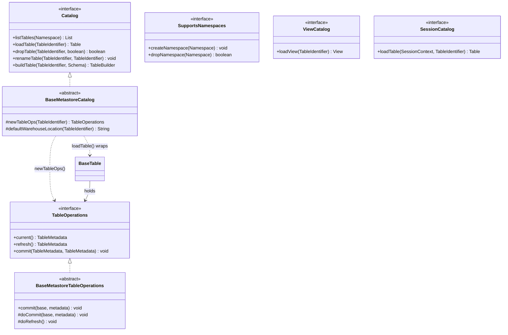

# Chapter 6.1 — The `Catalog` SPI

**The question this chapter answers:** what does a catalog actually have to implement, and where in that contract does the atomic commit live?

**Prerequisites:** Chapter 3.2 (`TableMetadata` and `MetadataUpdate`), Chapter 3.3 (`SnapshotProducer`)

**Source covered:** `api/.../catalog/Catalog.java`, `api/.../catalog/SupportsNamespaces.java`, `api/.../catalog/SessionCatalog.java`, `core/.../BaseMetastoreCatalog.java`, `core/.../BaseMetastoreTableOperations.java`

## 1. The problem

A table lives in object storage as a tree of immutable files. Nothing in that tree says which `metadata.json` is *current* — every file is equally real, and two writers appending to the same table both produce a perfectly valid new one. Something outside the tree has to answer one question: **which metadata file is the table right now**, and let exactly one writer change that answer at a time. That is the catalog's entire job; everything else it does — listing, renaming, namespaces, credential vending — is convenience layered on a single mutable pointer per table.

Reading `Catalog` with that in mind produces the first surprise of Part 6, and it is structural rather than a detail:

**`Catalog` has no `commit` method.**

The interface can create tables, drop them, rename them, list them, and load them. It cannot commit to one. The atomic swap lives one level down, on `TableOperations` — the interface Chapter 3.3 handed to `SnapshotProducer`. A catalog's real contribution to a write is to *manufacture a `TableOperations`* and step out of the way.

That split is what lets a catalog be a Hadoop directory, a Hive Metastore row, or an HTTP service without any of them touching the write path. It also settles something before a single implementation exists: the unit of atomicity is one table, because `TableOperations` addresses one table.

## 2. Two interfaces, one of which commits

`SupportsNamespaces` and `ViewCatalog` are *siblings* of `Catalog`, not superinterfaces. A catalog opts in by implementing them, and callers test with `instanceof`. That is why `HadoopCatalog` can manage namespaces while refusing to rename a table, and why a catalog that knows nothing about views is still a legal `Catalog`.

Part 6 follows three: `HadoopCatalog` and `HiveCatalog` (Chapter 6.2), both through `BaseMetastoreCatalog`, and `RESTSessionCatalog` (Chapter 6.3), which does not.

## 3. What an implementation must supply



Four abstract methods in the whole interface: `dropTable(identifier, purge)`, `renameTable`, `loadTable`, and — further up the file — `listTables`. Everything else is a default.

The eight `createTable` and `newCreateTableTransaction` overloads above this excerpt — twelve, counting the four `newReplaceTableTransaction` forms — all funnel into `buildTable(identifier, schema)`, which itself defaults to throwing `UnsupportedOperationException`. The real creation contract is one builder; an implementation that supplies it gets every overload for free.

One default in the excerpt deserves its own line: `dropTable(identifier)` delegates to `dropTable(identifier, true)` — the comment reads *drop data and metadata files*. A second sits just above it at `Catalog.java:279`, outside the excerpt: `tableExists` is `loadTable` wrapped in a `catch (NoSuchTableException)`, a full metadata read unless the implementation overrides it.

## 4. `BaseMetastoreCatalog`: where `TableOperations` comes from



Loading a table is three steps: build a `TableOperations` for the identifier, ask it whether the table exists, wrap it in a `BaseTable`. `ops.current() == null` *is* the existence test — there is no separate lookup, and the same call that would give you metadata gives you "no such table" by returning null. The `isValidMetadataIdentifier` branch handles `db.tbl.snapshots`-style metadata tables, where the identifier's namespace names the real table.

The method that produces `ops` is the one that matters:



Two abstract methods of its own, neither of which appears on `Catalog`: a subclass says how to reach one table's pointer and where new tables go. What the base class assembles on top of them is narrower than it looks — `loadTable`, `registerTable`, `buildTable`, `toString`, `close` — so `listTables`, `dropTable` and `renameTable` are still abstract when they arrive at the subclass. Five methods reach an implementation, not two.

Creation runs through the same door, one level down in the builder:



`ops.commit(null, metadata)` — a commit whose `base` is null. That is how "create" is expressed in a model with only one verb: replace the current metadata, where the current metadata is nothing.

Note the `catch`. A `CommitFailedException` here means another writer created the table first, so the builder rewrites it as `AlreadyExistsException("Table was created concurrently: %s", identifier)`. The API's exception vocabulary survives even though the mechanism underneath only knows about failed swaps.

## 5. What a metastore-backed implementation is actually required to write

Sections 3 and 4 counted abstract methods — four on `Catalog`, two added by `BaseMetastoreCatalog`. Apply the same count one level down, to the class every metastore-shaped `TableOperations` extends, and the answer is stranger than the pattern so far suggests.

`BaseMetastoreTableOperations` supplies `commit` itself: the identity pre-check, the create-versus-update distinction, the no-op short circuit, `doCommit`, and the trailing cleanup. That method is the *protocol a catalog is wrapped in* rather than anything a catalog contributes, so **Chapter 3.4 §3 reads it line by line** and this chapter does not. What belongs here is the shape of the hole it leaves.

Almost nothing in the class is `abstract`. `doCommit` is declared **concrete** at `:137-139`, with a body of `throw new UnsupportedOperationException("Not implemented: doCommit")`; `doRefresh` is the same at `:104-106`. The class's single `abstract` method is `tableName()` at `:67`.

So the compiler asks a subclass for a name and nothing else. A `TableOperations` that forgets to commit is a legal, compiling class that throws on first use — the failure moves from build time to commit time, deliberately. Read against sections 3 and 4 the progression is consistent and worth naming: `Catalog` requires four methods, `BaseMetastoreCatalog` requires two more, and `BaseMetastoreTableOperations` requires one. **The interface gets stricter as you move away from the atomic operation, and looser as you approach it.** The methods that actually move the pointer are the ones the type system declines to demand, because the base class cannot know which of them a given store can honestly implement — Chapter 6.2 finds a catalog that implements none of them, having bypassed this class entirely.

The pointer a metastore `doCommit` moves has a name — one of five constants declared together:



`metadata_location` is the pointer and `previous_metadata_location` its predecessor; the other three mark the metastore row as an Iceberg table and carry an optional hash of the metadata file. Only the first is ever compared. In Chapter 6.2 it is the literal Hive Metastore parameter the compare-and-swap runs against, while `previous_metadata_location` is written beside it (`HMSTablePropertyHelper.java:184`) and read by nothing — a breadcrumb, not a guard. `JdbcCatalog` has the same shape: its `UPDATE` sets both columns and its `WHERE` tests only `metadata_location`. Chapter 6.3 takes the other road: its request body is a change log rather than a pointer, and no `metadata_location` crosses the wire at all.

## 6. Capabilities are interfaces, and the caller has to ask

Section 2 called `SupportsNamespaces` and `ViewCatalog` siblings of `Catalog` rather than parts of it, and left the consequence hanging. It is the same pattern Chapter 3.1 found underneath `FileIO`, where `SupportsPrefixOperations` and `SupportsBulkOperations` are separate opt-in interfaces a caller tests for at runtime. Iceberg uses it wherever a capability is real for some implementations and impossible for others.



The class javadoc does something worth stopping on. Having declared an interface for managing namespaces, it immediately says implementations need not manage them: *"Catalog implementations are not required to maintain the existence of namespaces independent of objects in a namespace."* Its worked example is a function catalog using Java packages as namespaces, which can *discover* a namespace and can never *create* one. So even inside the opt-in interface, individual methods are allowed to throw `UnsupportedOperationException` — the javadoc on `createNamespace` lists it as a documented outcome, beside `AlreadyExistsException`.

That is two levels of optionality on one capability: implement the interface or not, and then honour each method or not. It is easy to read as weakness. It is the same trade the whole SPI makes — the alternative is a `Catalog` interface whose method set is the intersection of a filesystem directory, a Hive metastore, a JDBC table and an HTTP service, which is close to nothing.

The cost lands on callers, and it is worth being concrete about the shape, because it is the shape of every Iceberg integration:

- **Test, then use.** `catalog instanceof SupportsNamespaces` before `createNamespace`. A cast without the test is a `ClassCastException` at the first `CREATE SCHEMA`.
- **Catch, then fall back.** Even after the test, `UnsupportedOperationException` remains possible per method.
- **Neither is enforced.** Nothing in the type system requires the test, and nothing in the interface requires the method to work. Chapter 3.1's gotcha about `HasTableOperations` is the identical trap on the other seam, and Chapter 6.3 meets a third version of it — a REST server that advertises its endpoint set, which is this same question asked over a wire and answered with data instead of with a type.

`HadoopCatalog` is the specimen worth holding onto: it implements `SupportsNamespaces` and it throws from `renameTable`. Capability is not a property of a catalog. It is a property of a catalog and a method together.

## 7. `SessionCatalog`: the same contract, plus a caller



`SessionCatalog` is `Catalog` with a `SessionContext` threaded through every method that addresses a table or a namespace. The catalog's own lifecycle is exempt, and the excerpt shows it: `initialize(String, Map)`, `name()` and `properties()` take none. The context carries a session ID, an identity, a credential map, and properties — and its javadoc pins down what may not change: *"This identity cannot change for a given session ID."*

For a catalog backed by a local Hive Metastore client this is redundant; the process is the principal. For a catalog that is a remote service serving many users it is the difference between a client library and a multi-tenant protocol. `RESTSessionCatalog` implements this interface rather than `Catalog`, and `RESTCatalog` wraps it with a fixed context — `sessionCatalog.asCatalog(context)` — so engines written against `Catalog` still work.

## 8. Gotchas

!!! warning "`base != current()` is identity, not equality"
    A `TableMetadata` reconstructed from the same bytes will not commit. This is deliberate: the only `base` the catalog accepts is the exact object the operation refreshed from. Code that serialises table metadata across a boundary and expects to commit against it on the other side is fighting this check.

!!! warning "`dropTable(identifier)` deletes your data — unless the catalog overrides it"
    The one-argument default on `Catalog` is `dropTable(identifier, true)`. Callers that want to unregister without purging must pass `false`. The default is not universal: `BaseSessionCatalog.AsCatalog` overrides the one-arg form to the *non*-purging `dropTable(context, ident)` (`:108-111`), and `RESTCatalog` delegates to it (`:224-226`).

!!! warning "`registerTable` checks, then commits — the check is not the guard"
    `BaseMetastoreCatalog.registerTable` calls `tableExists(identifier)` and throws `AlreadyExistsException`, then does `ops.commit(null, metadata)`. The window between the two is real: the commit is what enforces uniqueness, and `tableExists` only buys a better error.

!!! note "Metadata file version numbers can come back as -1"
    `BaseMetastoreTableOperations` names new metadata files `%05d-<uuid>.metadata.json` and recovers the number with `parseVersion`, whose javadoc says it returns `-1` *"as a sign that the metadata is not part of this catalog"*. Register a path-based table's `v7.metadata.json` into a metastore catalog and the numbering restarts at `00000-<uuid>.metadata.json`. Nothing breaks — the pointer is the location, not the number — but file names stop dating the table.

## Key takeaways

- `Catalog` is a naming service. It has no `commit` method; the atomic swap lives on `TableOperations`, which the catalog manufactures via `newTableOps`.
- Four abstract methods make a `Catalog`: `listTables`, `loadTable`, `dropTable`, `renameTable`. Every creation overload funnels into one `buildTable` builder.
- `BaseMetastoreCatalog` supplies `loadTable`, `registerTable` and `buildTable` in exchange for two abstract methods, and leaves `listTables`, `dropTable` and `renameTable` to the subclass.
- Capabilities beyond the core four are opt-in interfaces tested with `instanceof`, and even inside one, individual methods may throw `UnsupportedOperationException`. `HadoopCatalog` implements `SupportsNamespaces` and refuses `renameTable`: capability is a property of a catalog *and a method*, never of a catalog alone.
- The requirement thins out as you approach the atomic operation: `Catalog` declares four abstract methods, `BaseMetastoreCatalog` two more, and `BaseMetastoreTableOperations` exactly one — `tableName()`. `doCommit` and `doRefresh` are concrete methods that throw, so a subclass that omits them compiles and fails at commit time.
- The pointer a metastore `doCommit` moves is the `metadata_location` table property — a metastore catalog's pointer, not every catalog's: `HadoopTableOperations` implements `TableOperations` directly and has no `doCommit`.
- Because `TableOperations` addresses exactly one table, the unit of atomicity is decided before any implementation is written. Chapter 6.4 returns to what that costs.

## Source map

| What | File |
| --- | --- |
| `Catalog` | [`api/.../catalog/Catalog.java`](https://github.com/apache/iceberg/blob/apache-iceberg-1.11.0/api/src/main/java/org/apache/iceberg/catalog/Catalog.java) |
| `SupportsNamespaces` | [`api/.../catalog/SupportsNamespaces.java`](https://github.com/apache/iceberg/blob/apache-iceberg-1.11.0/api/src/main/java/org/apache/iceberg/catalog/SupportsNamespaces.java) |
| `ViewCatalog` | [`api/.../catalog/ViewCatalog.java`](https://github.com/apache/iceberg/blob/apache-iceberg-1.11.0/api/src/main/java/org/apache/iceberg/catalog/ViewCatalog.java) |
| `SessionCatalog` | [`api/.../catalog/SessionCatalog.java`](https://github.com/apache/iceberg/blob/apache-iceberg-1.11.0/api/src/main/java/org/apache/iceberg/catalog/SessionCatalog.java) |
| `TableOperations` commit contract | [`core/.../TableOperations.java`](https://github.com/apache/iceberg/blob/apache-iceberg-1.11.0/core/src/main/java/org/apache/iceberg/TableOperations.java) |
| `BaseMetastoreCatalog` | [`core/.../BaseMetastoreCatalog.java`](https://github.com/apache/iceberg/blob/apache-iceberg-1.11.0/core/src/main/java/org/apache/iceberg/BaseMetastoreCatalog.java) |
| `BaseMetastoreTableOperations` | [`core/.../BaseMetastoreTableOperations.java`](https://github.com/apache/iceberg/blob/apache-iceberg-1.11.0/core/src/main/java/org/apache/iceberg/BaseMetastoreTableOperations.java) |

**Next:** Chapter 6.2 audits the swap itself in the two catalogs most deployments started on — a metastore that overrides `doCommit`, and a filesystem catalog that bypasses the whole class.
