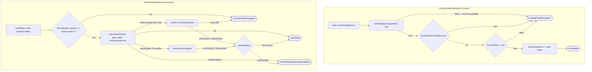

# Chapter 6.2 — `HadoopCatalog` and `HiveCatalog`: where atomicity leaks

<div class="chapter-meta" markdown>
**The question this chapter answers:** each of these catalogs claims an atomic single-table commit — which mechanism provides it, under exactly which conditions does that mechanism stop providing it, and which catalog should a deployment therefore run?

**Prerequisites:** Chapter 1.1 (why an object store has no atomic rename), Chapter 3.4 (the commit protocol: CAS, retries), Chapter 6.1 (the `Catalog` SPI and `doCommit`)

**Source covered:** `core/.../hadoop/HadoopTableOperations.java`, `core/.../util/LockManagers.java`, `hive-metastore/.../HiveTableOperations.java`, `hive-metastore/.../HiveOperationsBase.java`
</div>

## 1. The problem

Chapter 6.1 left one method open: `doCommit(base, metadata)`, and Chapter 3.4 covered the protocol wrapped around it. This chapter asks the narrower question neither can answer: **what actually performs the swap**, for the two catalogs most Iceberg deployments started on. Only one of them has a `doCommit` to fill in — `HadoopTableOperations` implements `TableOperations` directly and rebuilds only the parts of that protocol it needs.

Neither answer is "Iceberg does". Both borrow atomicity from a component Iceberg does not own — a filesystem in one case, a metastore in the other — and both document the dependency, one in a javadoc and one in a config flag. `HadoopTableOperations` says it in its class javadoc's first line:

> *TableOperations implementation for file systems that support atomic rename.*

Neither is broken and neither is unconditionally safe. Sections 3 to 9 are an audit — what each mechanism guarantees and where it stops. Section 10 turns that audit into the choice it implies, because one of these catalogs has a precondition that most deployments violate.

## 2. Two mechanisms for one contract



The shapes rhyme — check the base, swap, confirm — but the swap is a `FileSystem.rename` on the left and a metastore `alter_table` on the right. Everything below follows from that.

## 3. `HadoopTableOperations`: the rename *is* the commit



Two guards open it: a staleness check written `base != current.second()` — a third spelling of the comparison Chapter 3.4 read and section 7 makes again — and a no-op short circuit. Then four moves:

**Refuse to relocate, then write to a random name.** Two `Preconditions` reject a metadata object whose `location()` differs from the base, and any table setting `write.metadata.path`: a path-based table *is* its path. The new metadata then goes to `<uuid>.metadata.json`, not its final name — nothing is claimed yet. **Rename it.** The comment on that line is the whole design:

```java
// this rename operation is the atomic commit operation
renameToFinal(fs, tempMetadataFile, finalMetadataFile, nextVersion);
```

`finalMetadataFile` is `v<N+1>.metadata.json`; winning the commit means being the process that successfully creates that exact name. **Then update a hint.** `writeVersionHint(nextVersion)` runs *after* the rename, under a comment calling it a *best-effort version pointer* (section 5). The rename itself carries the defences:



Three guards, doing three different jobs. `lockManager.acquire(dst, src)` serialises writers *if* a real lock manager is configured; section 6 covers what happens when one is not. `fs.exists(dst)` turns a lost race into a clean `CommitFailedException` naming the version that already exists — a courtesy, not a correctness mechanism, since another writer can land between check and rename. `if (!fs.rename(src, dst))` is the correctness mechanism: where rename fails when the destination exists, this is the compare-and-swap, and exactly one of N concurrent writers gets `true`. Everything the class guarantees rests on that line, which is why the javadoc states the requirement rather than assuming it.

Three of the four failure paths call `tryDelete(src)` and attach any resulting exception with `addSuppressed`, so a losing writer cleans up its orphan without masking the real error. The fourth does not: when `lockManager.acquire` returns false the method throws `CommitFailedException` at `:363-366` with no `tryDelete`, and because that class extends `RuntimeException` the `catch (IOException e)` at `:388` never sees it — the `finally` only releases the lock. Losing the lock leaks the `<uuid>.metadata.json` written at `:155`.

## 4. What `HadoopCatalog` does not do

`HadoopCatalog`'s class javadoc is unusually direct about its limits — *"the `Catalog#renameTable` is not supported yet"*, and *"Note: The HadoopCatalog requires that the underlying file system supports atomic rename."* `renameTable` throws `UnsupportedOperationException("Cannot rename Hadoop tables")`, which is not an oversight: a path-based table's identity is its directory, and no single rename moves every file in it. `HadoopTableOperations` also never imports `CommitStateUnknownException`; `renameToFinal` converts every `IOException` into `CommitFailedException`, telling the caller *you lost, clean up your files*. Chapter 3.3 explained why that answer is dangerous when it is a guess — but on a filesystem that fails renames atomically it is not a guess, and the code claims nothing more.

## 5. The version hint is a hint



`writeVersionHint` writes a temp file, **deletes** `version-hint.text`, then renames the temp over it. A crash between the delete and the rename leaves no hint at all — and the method swallows `IOException` with `LOG.warn("Failed to update version hint")`, because the commit already happened and failing it now would be a lie.

`findVersion` makes that survivable. It reads the hint first; only when that throws does it list the metadata directory for names matching `v([^\.]*)\..*` and take the highest version `getMetadataFile` can resolve — correct, and on that path O(number of commits) in both directory entries and `getMetadataFile` calls. A missing `metadataRoot()` short-circuits to `0` first. And because the hint is written *after* the commit, a reader can legitimately see it pointing at version N while `v(N+1).metadata.json` already exists; `refresh()` walks forward with `getMetadataFile(ver + 1)` until it finds nothing.

## 6. The default lock manager is not a lock

`HadoopCatalog.initialize` sets up locking with one line:



`LockManagers.from` returns a configured implementation when `lock-impl` is set, otherwise `defaultLockManager()` — a static `InMemoryLockManager` whose own javadoc says it *"uses an in-memory concurrent map for locking"* and *"should only be used for testing, or if the caller only needs locking within the same JVM during table commits"*.

So by default `lockManager.acquire(dst, src)` serialises threads inside one JVM and does nothing across processes: two Spark drivers writing the same path-based table have only `fs.rename` between them. That is the honest summary of `HadoopCatalog` — on HDFS, correct; where rename overwrites the destination, an `exists` check and a JVM-local lock are all that is left.

## 7. `HiveTableOperations`: compare-and-swap on a table property

Hive does not borrow atomicity from storage. The pointer is the `metadata_location` parameter on the HMS table object, and the commit is a read-compare-write on it:



This runs against the freshly loaded HMS table, inside the lock — and it is *not* the check `BaseMetastoreTableOperations.commit` made in memory (Chapter 3.4 §3). That one is `base != current()`, object identity between two `TableMetadata` references; this one is `!Objects.equals(baseMetadataLocation, metadataLocation)` at `:306`, a string compared against a location read back out of the metastore. One asks "is this the object I refreshed from", the other "is the pointer still where I left it". The write half is where the locking modes diverge:



`lock.ensureActive()` is called before *and* after `persistTable`, throwing if the heartbeat thread died — the only way this code learns its lock expired while the alter was in flight. The ternary `hiveLockEnabled(base, conf) ? null : baseMetadataLocation` then decides whether the metastore compares as well: null with locking on, and with locking off the base location goes down as an environment context:



`expected_parameter_key` / `expected_parameter_value` is the HMS-side CAS added by HIVE-26882: the metastore applies the `alter_table` only if `metadata_location` still holds the expected value. `NoLock`'s constructor enforces the prerequisite — *"Minimally Hive 2 HMS client is needed to use HIVE-26882 based locking"*. A `LockException` raised by `ensureActive` around `persistTable` becomes `CommitStateUnknownException`; the outer catch at `:422-423`, for a failure to *acquire* the lock, raises `CommitFailedException` instead. The first names the risk:

> *Failed to heartbeat for hive lock while committing changes. This can lead to a concurrent
> commit attempt be able to overwrite this commit. Please check the commit history. If you are
> running into this issue, try reducing iceberg.hive.lock-heartbeat-interval-ms.*

A dead heartbeat is not a failed commit. The alter may well have landed, so the code escalates to a human rather than guessing — and `cleanupMetadata` deletes the new metadata file only when `commitStatus` is literally `FAILURE`, never on `UNKNOWN`. The compare above ran before the alter; the HMS runs its own after it, and a rejected conditional `alter_table` is where Chapter 3.4's two status checks are chosen between:



The routing is a string match. A metastore that refuses the CAS says *"The table has been modified. The parameter value for key 'metadata_location' is"*, and that refusal proves no request still in flight can succeed later — exactly the precondition `checkCommitStatusStrict` needs, so it is taken at `:391`; anything unclassifiable gets the lenient `checkCommitStatus` at `:402`. `commitStatus` is seeded `UNKNOWN` at `:380`, so a check that cannot run leaves the honest answer standing. A strict `FAILURE` is dealt with on the spot at `:392-395`, as a `CommitFailedException` named for concurrent modification — it never reaches the `switch` below. So reconciliation has three ends, but the `switch` decides only two: `SUCCESS` swallows the exception, because the check proved the commit landed, and `UNKNOWN` becomes `CommitStateUnknownException`. Its third arm, `case FAILURE: throw e;`, is unreachable from here — strict's `FAILURE` has already thrown, and the lenient wrapper downgrades that same verdict before returning, as its javadoc says: *"@return Commit Status of Success or Unknown"*.

## 8. `JdbcCatalog`: a real CAS that throws away the answer

Chapter 3.4 named a third shape in passing — a catalog whose swap is `UPDATE … WHERE metadata_location = ?`, deciding by row count. It is worth half a section, because it is the one of the three that gets the compare-and-swap unambiguously right and still ends up weaker than Hive on the axis this chapter cares about.



The swap is `updateTable(newMetadataLocation, oldMetadataLocation)`, and its whole verdict is two lines: `if (updatedRecords == 1)` it committed, otherwise `throw new CommitFailedException("Failed to update table %s from catalog %s", …)`. A relational `UPDATE` with the old location in its `WHERE` clause is a genuine conditional write — no lock, no borrowed filesystem semantics, and the database's own row count is the proof. On this axis JDBC is cleaner than either catalog above it.

Now read the `catch` blocks, because that is where it diverges. There are seven, and **not one of them produces a `CommitStatus`**. `SQLTimeoutException` becomes `UncheckedSQLException(e, "Database Connection timeout")`. `SQLTransientConnectionException` and `SQLNonTransientConnectionException` become *"Database Connection failed"*. A constraint violation becomes `AlreadyExistsException` or another `UncheckedSQLException` depending on whether `currentMetadataLocation()` is null. Everything unclassified becomes *"Unknown failure"*.

Line those up against Chapter 3.4's three-valued enum and the gap is exact. A timeout on the `UPDATE` is precisely the indeterminate case: the statement may have committed and the answer may have been lost on the way back. `DynamoDbTableOperations` calls `checkCommitStatus` there; `HiveTableOperations` picks between the strict and lenient variants by classifying the failure. `JdbcTableOperations` throws an exception that is neither `CommitFailedException` — so Chapter 3.3's loop will not retry it — nor `CommitStateUnknownException` — so nothing tells the caller that the commit may have landed.

The practical shape of that is worth following to the end, because it lands somewhere better than it deserves to. `UncheckedSQLException` is a plain `RuntimeException` — it does not implement `CleanableFailure`. Chapter 3.3's handler cleans up only under `!strictCleanup || e instanceof CleanableFailure`, and `TableOperations.requireStrictCleanup()` defaults to `true`. So neither clause holds, `cleanAll` does not run, and the attempt's manifests and manifest list stay on storage.

That is the correct outcome — it is what `CommitStateUnknownException` exists to produce — reached without anyone deciding to produce it. The exception type says "database error", the cleanup rule happens to read it as "do not touch anything", and the two agree by coincidence rather than by design. What is genuinely missing is the other half: nothing tells the caller the commit may have landed, so nobody knows to go and look.

## 9. The audit

| Guarantee | `HadoopCatalog` | `HiveCatalog` | `JdbcCatalog` |
| --- | --- | --- | --- |
| Atomic single-table commit | yes, *provided* `FileSystem.rename` fails when the destination exists | yes — HMS lock, or HMS-side CAS on `metadata_location` | yes — `UPDATE … WHERE metadata_location = ?`, verified by row count |
| Mutual exclusion across processes | only with a configured `lock-impl`; the default `LockManager` is JVM-local | yes, `MetastoreLock` by default | yes, from the database |
| Rename a table | no — `UnsupportedOperationException` | yes | yes |
| Reports unknown commit state | no — `renameToFinal` turns every `IOException` into `CommitFailedException` | yes — a status check whose three outcomes are commit-succeeded, `CommitFailedException`, `CommitStateUnknownException` | no — every SQL failure becomes an `UncheckedSQLException`, retried by nothing and reconciled by nothing |
| Multi-table commit | no | no | no |

Read the fourth row across. All three have a defensible answer to "did I win the race"; only one has an answer to "did anything happen at all". That is the axis Chapter 3.4 built the three-valued enum for, and two of the three catalogs most deployments start on decline to use it.

## 10. Choosing

The audit answers "what does each of these guarantee". A reader still has to pick one, and
three things decide it. The first is not a preference — it is a disqualification.

**`HadoopCatalog` requires a filesystem whose rename fails when the destination exists.**
Section 3 showed that `fs.rename` returning `false` *is* the compare-and-swap, and section
6 showed that the default `LockManager` does not serialise across processes. On an object
store neither holds: there is no rename at all, only copy-then-delete (Chapter 1.1 §6), so
two concurrent writers can both believe they won. Nothing enforces the precondition at
runtime — the class javadoc quoted in section 1 is the whole defence. Upstream states the
consequence without hedging:



*Not safe with a local FS or S3.* Chapter 1.1's gotcha calls pointing a `HadoopCatalog` at
an object store "the single most common way to build an Iceberg deployment that loses
data", and the failure is silent: every method still runs, and the table works until two
writers commit at once. If the warehouse is on S3, GCS or ADLS, this catalog is out, and no
configuration brings it back — `lock-impl` bounds the race, it does not make the rename
atomic.

The second thing is the shape of the board. `CatalogUtil` holds the authoritative list:



Seven names, resolved by the `switch` in `buildIcebergCatalog` (Chapter 1.4 §6), which
reads the `type` property with `ICEBERG_CATALOG_TYPE_HIVE` as its fallback: **omit `type`
and you get Hive.** Three of the seven are audited above; the rest move the swap somewhere
this chapter cannot see.

<div class="grid cards" markdown>

-   **`hadoop`**

    The swap is `fs.rename`. Correct on HDFS and anything else that fails a rename onto an
    existing path. Cannot rename a table, cannot report an unknown commit state, and its
    default lock manager is JVM-local. **Disqualified on object storage**, which is where
    most warehouses now live.

-   **`hive`**

    The swap is `alter_table` on `metadata_location`, serialised by an HMS lock with a
    heartbeat, or by the metastore's own `expected_parameter_key` comparison when
    `engine.hive.lock-enabled=false`. The only one of the three audited here that
    distinguishes *failed* from *cannot tell*. Needs a metastore that supports transactions
    — an embedded derby one does not (section 11).

-   **`jdbc`**

    The swap is `UPDATE … WHERE metadata_location = ?`, decided by row count: the cleanest
    compare-and-swap of the three, with mutual exclusion from the database and no
    filesystem semantics borrowed. Pays for it in failure reporting — every SQL error
    becomes an `UncheckedSQLException` that is neither retried nor reconciled, so a timeout
    on the `UPDATE` leaves nobody knowing whether it landed.

-   **`rest`, `nessie`, `glue`, `bigquery`**

    The swap moves off the client entirely. Chapter 6.3 reads the REST protocol;
    Chapter 6.4, what a server-side commit changes. Chapter 10.1 reads `NessieCatalog`,
    and Chapter 10.3 sets out how to answer capability questions about a catalog server
    from its source. These are also the only route to a multi-table commit — the audit's
    last row is `no` three times, and Chapter 10.2 shows what fills that gap.

</div>

The third thing is the row of the audit table nobody reads first. All three answer "did I
win the race"; only Hive answers "did anything happen at all". That distinction costs
nothing until a network partition, and then it decides whether an operator is told to go
and look at the table or told, wrongly, that the commit failed.

## 11. Gotchas

!!! warning "The default `LockManager` only locks within one JVM"
    `LockManagers.from(properties)` falls back to a static `InMemoryLockManager` documented for testing or same-JVM use. From more than one process, set `lock-impl` or accept `fs.rename` as the only serialisation — and note that `fs.exists(dst)` before it is check-then-act, so where rename overwrites, two writers can both pass the check and both believe they won.

!!! warning "Failing to acquire the lock leaks a metadata file"
    Every other exit from `renameToFinal` deletes the `<uuid>.metadata.json` it was about to install. The lock-acquisition failure at `:362-365` throws before that, and the enclosing `catch` only handles `IOException`. Repeated lock contention accumulates orphans that Iceberg's own cleanup never sees, because no commit ever referenced them.

!!! warning "Turning Hive locking off moves the CAS into the metastore"
    `engine.hive.lock-enabled` defaults to `true`. Set it to `false`, `lockObject()` returns `NoLock`, and correctness rests on the metastore honouring `expected_parameter_key`. Against a metastore that ignores it, `alter_table` is a blind overwrite Iceberg cannot detect.

!!! note "`HIVE_LOCKS does not exist` means the wrong metastore"
    `doCommit` special-cases a `Throwable` mentioning `Table/View 'HIVE_LOCKS' does not exist` and rewrites it: *"This can occur when using an embedded metastore which does not support transactions."* A derby-backed development metastore cannot provide this locking.

## Key takeaways

- `HadoopTableOperations` borrows its atomicity: `fs.rename` returning `false` on an existing destination is the compare-and-swap, and the javadoc states that requirement. Its other guards are damage control — `fs.exists` is check-then-act, the default `LockManager` is JVM-local, and the lock-failure path leaks the file it wrote.
- `version-hint.text` is written after the commit, can vanish entirely, and is recovered by a directory listing: an optimisation, not part of the protocol.
- `HiveTableOperations` builds its own CAS on the `metadata_location` table property — a string comparison, not 6.1's identity check — guarded either by an HMS lock with a heartbeat or, with locking disabled, by the metastore's own `expected_parameter_key` comparison.
- `JdbcTableOperations` has the cleanest swap of the three — `UPDATE … WHERE metadata_location = ?`, decided by `updatedRecords == 1` — and the weakest failure reporting: every SQL error becomes an `UncheckedSQLException`, which is neither retryable nor cleanable nor a signal that the outcome is unknown.
- Hive is the only one of the three that distinguishes "failed" from "cannot tell", and its reconciliation has three outcomes: the commit succeeded after all, it failed, or nobody knows.
- The audit implies a choice. `HadoopCatalog`'s precondition is a filesystem that fails a rename onto an existing path, which object storage is not — upstream's own quickstart says concurrent writes with it "are not safe with a local FS or S3". On S3, GCS or ADLS that rules it out, and no property setting restores it.

## Source map

| What | File |
| --- | --- |
| `HadoopCatalog` | [`core/.../hadoop/HadoopCatalog.java`](https://github.com/apache/iceberg/blob/apache-iceberg-1.11.0/core/src/main/java/org/apache/iceberg/hadoop/HadoopCatalog.java) |
| `HadoopTableOperations` | [`core/.../hadoop/HadoopTableOperations.java`](https://github.com/apache/iceberg/blob/apache-iceberg-1.11.0/core/src/main/java/org/apache/iceberg/hadoop/HadoopTableOperations.java) |
| `LockManager` and its default implementations | [`api/.../LockManager.java`](https://github.com/apache/iceberg/blob/apache-iceberg-1.11.0/api/src/main/java/org/apache/iceberg/LockManager.java), [`core/.../util/LockManagers.java`](https://github.com/apache/iceberg/blob/apache-iceberg-1.11.0/core/src/main/java/org/apache/iceberg/util/LockManagers.java) |
| `HiveCatalog` | [`hive-metastore/.../HiveCatalog.java`](https://github.com/apache/iceberg/blob/apache-iceberg-1.11.0/hive-metastore/src/main/java/org/apache/iceberg/hive/HiveCatalog.java) |
| `HiveTableOperations` | [`hive-metastore/.../HiveTableOperations.java`](https://github.com/apache/iceberg/blob/apache-iceberg-1.11.0/hive-metastore/src/main/java/org/apache/iceberg/hive/HiveTableOperations.java) |
| `MetastoreLock`, `NoLock` | [`hive-metastore/.../MetastoreLock.java`](https://github.com/apache/iceberg/blob/apache-iceberg-1.11.0/hive-metastore/src/main/java/org/apache/iceberg/hive/MetastoreLock.java), [`NoLock.java`](https://github.com/apache/iceberg/blob/apache-iceberg-1.11.0/hive-metastore/src/main/java/org/apache/iceberg/hive/NoLock.java) |
| `JdbcCatalog` and its swap | [`core/.../jdbc/JdbcTableOperations.java`](https://github.com/apache/iceberg/blob/apache-iceberg-1.11.0/core/src/main/java/org/apache/iceberg/jdbc/JdbcTableOperations.java) |
| The catalog `type` names and their default | [`core/.../CatalogUtil.java`](https://github.com/apache/iceberg/blob/apache-iceberg-1.11.0/core/src/main/java/org/apache/iceberg/CatalogUtil.java), [`docs/docs/java-api-quickstart.md`](https://github.com/apache/iceberg/blob/apache-iceberg-1.11.0/docs/docs/java-api-quickstart.md) |
| `hmsEnvContext`, `persistTable`, `cleanupMetadata` | [`hive-metastore/.../HiveOperationsBase.java`](https://github.com/apache/iceberg/blob/apache-iceberg-1.11.0/hive-metastore/src/main/java/org/apache/iceberg/hive/HiveOperationsBase.java) |

**Next:** Chapter 6.3 takes the swap away from storage entirely and puts it behind an HTTP endpoint — which changes what a commit request even contains.
