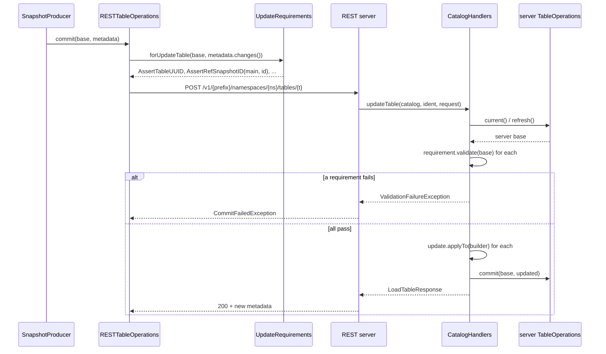

# Chapter 6.3 — The REST Catalog spec and `RESTSessionCatalog`

**The question this chapter answers:** when a REST-catalog client commits, what actually goes over the wire — and why is that payload the `MetadataUpdate` list from Chapter 3.2 rather than a metadata file?

**Prerequisites:** Chapter 3.2 (`TableMetadata` and `MetadataUpdate`), Chapter 6.1 (the `Catalog` SPI), Chapter 6.2 (what storage-backed catalogs guarantee)

**Source covered:** `core/.../rest/RESTSessionCatalog.java`, `core/.../rest/RESTTableOperations.java`, `core/.../UpdateRequirements.java`, `core/.../UpdateRequirement.java`, `core/.../rest/CatalogHandlers.java`

## 1. The problem

Chapter 6.2 ended with an uncomfortable summary: what a Hadoop or Hive catalog guarantees is a property of a filesystem or a metastore, and the client has to know which one it is talking to in order to know what it gets. A service could fix that — but only if the protocol between client and service is designed for it.

Two constraints shape that protocol. The client cannot be trusted to hold current metadata: it read the table some milliseconds ago and the world has moved. And the client cannot be allowed to upload a finished `metadata.json`, because then the server is a file store with extra steps — it would have no way to reason about, authorise, or merge what changed.

The REST catalog resolves both by sending something else entirely. It sends **the change log**: the `MetadataUpdate` list `TableMetadata` has been accumulating since Chapter 3.2, plus a set of `UpdateRequirement` assertions describing the base those changes were computed against. The server reads its own base, checks the assertions, applies the updates, and performs the swap.

That is the shift. In Chapter 6.2 the client computed the new state and storage arbitrated. Here the client computes a *diff* and the server owns the state.

## 2. Where the commit happens now

The two `base` objects are different objects. The client computes requirements from *its* base; the server validates them against *its* base. That gap is the entire concurrency story, and every requirement in the list exists to make it detectable.

## 3. `initialize()` is a negotiation

A `HiveCatalog` is configured. A `RESTSessionCatalog` is *negotiated*: `initialize` opens a throwaway client, calls `GET /v1/config`, and builds itself from the answer. Two pieces of that answer matter.

First, properties. `ConfigResponse` carries `defaults` and `overrides`, and merging them with the client's own configuration has a documented precedence:



Defaults first, then client properties, then overrides last. A catalog service can therefore *force* a setting — `io-impl`, a warehouse location, a table default — regardless of what the client passed. That is what makes multi-tenant hosting possible, and it is also why a local property can silently have no effect.

Second, capabilities. The response may list the endpoints the server implements, and call sites consult that list before making a request — though not all in the same way:



A missing endpoint becomes an `UnsupportedOperationException` at the client, not an HTTP error at the server. That is the two-argument overload, and it is one of four shapes. A second `check` at `Endpoint.java:156-161` throws whatever a `Supplier<RuntimeException>` produces, and the most-travelled read paths use it: `RESTSessionCatalog.loadTable` (`:449-455`) raises `NoSuchTableException`, `loadView` (`:1439-1445`) raises `NoSuchViewException`. `listTables` (`:306-309`) does not throw at all — it returns an empty list. And `tableExists` (`:402-416`) checks for `V1_TABLE_EXISTS` and, when it is absent, *falls back* to a load-based check with the comment *"fallback in order to work with 1.7.x and older servers"*. Refusing, substituting, returning empty, degrading: the endpoint set is consulted four different ways, and only the first produces the exception the class is named for.

None of it works if the server said nothing. When it does not, the client falls back to a frozen set:



The comment above it is the reason it can never grow: *"these default endpoints must not be updated in order to maintain backwards compatibility with legacy servers"*. Adding an entry would make the client assume a capability of every server written before that entry existed. Note what is already in the list — `V1_COMMIT_TRANSACTION`. Chapter 6.4 returns to that.

## 4. Before any of that: proving who you are

Section 3 skipped a step. `GET /v1/config` is an HTTP request to a service, and a service that will hand out table locations and accept commits does not answer anonymous callers. So before the negotiation there is an authentication decision, and it is made by inference rather than by configuration more often than anyone intends.

`AuthManager` is the interface, and its three methods are three *lifetimes* rather than three mechanisms:



`initSession` exists "to use for contacting the configuration endpoint only", over a client the javadoc calls short-lived and says "must be discarded after that". `catalogSession` is the long-lived one, "the parent session for all other sessions", closed when the catalog is. `tableSession` — below the excerpt — is for components that reach a table without going through the catalog, request signers among them. Chapter 7.5's S3 signing endpoint is on the other end of that third one.

The chicken-and-egg is the reason the first exists. Credentials may themselves come from the config response, so the client needs *some* session to fetch the config that tells it how to authenticate properly. `initSession` defaults to returning the catalog session, and an implementation overrides it only when the two genuinely differ.

Which manager you get is chosen here:



Read the middle of it, because that is the part that surprises people. When `rest.auth.type` is not set, the method does not default to a fixed value. It **infers** one:

- `credential` or `token` present in the properties → `oauth2`, with a `LOG.warn` that says so and asks you to set the type explicitly;
- neither → `none`.

So the same client, pointed at the same server, authenticates differently depending on whether an unrelated-looking property happens to be present, and the only notice is a warning line. A deployment that stops passing `credential` — moved to a vault, dropped from a config template — silently becomes an anonymous client, and the failure surfaces as a 401 from a catalog that worked yesterday.

The `sigv4` branch above it is the one place the design composes rather than chooses: SigV4 signs requests to a gateway, but something still has to authenticate to the *catalog* behind it, so a SigV4 manager wraps a delegate resolved by calling `loadAuthManager` again with `rest.auth.type` replaced by `rest.auth.sigv4.delegate-auth-type`. The recursion is guarded by one precondition — *"Cannot delegate a SigV4 auth manager to another SigV4 auth manager"*.

None of this is negotiated with the server. The client decides how to authenticate from local properties, and only then asks the server what it supports — which is why Chapter 7.5's Nessie gotcha reads the way it does: a client left on Iceberg's OAuth defaults sends a token request to `/v1/oauth/tokens`, Nessie answers `501`, and the fix is a client property (`oauth2-server-uri`) rather than anything on the server.

## 5. The commit request



The `switch` is the interesting part. Three update types, each producing a different set of requirements from a different base:

- **`CREATE`** — `base` must be null, the updates are `createChanges` plus `metadata.changes()`, and `UpdateRequirements.forCreateTable(updates)` asserts the table does not exist.
- **`REPLACE`** — requirements come from `replaceBase`, the metadata captured when the transaction started, *not* from `base`. The comment says why: *"use the original replace base metadata because the transaction will refresh"*.
- **`SIMPLE`** — the ordinary case. `updates = metadata.changes()`, requirements from the live `base`.

All three converge on one `UpdateTableRequest` and one `client.post(...)`. And after any successful commit, `this.updateType = UpdateType.SIMPLE` — a create or replace happens once; everything after it is an ordinary update.

`metadata.changes()` is doing the real work here. Chapter 3.2 introduced it as a bookkeeping device: `TableMetadata.Builder` records each `MetadataUpdate` it applies so the metadata object knows its own diff. In a Hadoop or Hive catalog that log is almost decorative — the finished metadata file is what gets written. Here it *is* the request body. The REST catalog is the reason `MetadataUpdate` had to be a first-class, serialisable type rather than an internal detail.

## 6. Requirements: the base, described



Nine lines, and the shape is the point: one unconditional `AssertTableUUID`, then a single pass handing each update to the builder, which adds whatever assertion that *kind* of change needs. Adding a snapshot ref adds an `AssertRefSnapshotID` for that ref. Adding a schema adds an `AssertLastAssignedFieldId`. Removing partition specs adds an `AssertDefaultSpecID` and, under the comment *"so that old specs won't be written"*, an `AssertRefSnapshotID` for every branch — except `main`. `requireNoBranchesChanged` (`UpdateRequirements.java:200-210`) guards on `ref.isBranch() && !name.equals(SnapshotRef.MAIN_BRANCH)`, so tags are skipped because they are not branches, and `main` is skipped by name. A spec removal races freely against a commit to `main` — the one branch a reader would assume was protected.

The requirements are derived from the updates, not written by hand, and that is what keeps them honest: a client cannot forget one for a change it is actually making.

On the server, each assertion is one `validate` call:



Three distinct failures, all `CommitFailedException`. A null expected `snapshotId` means *this ref must not exist yet*, so finding one is "created concurrently". A non-null mismatch is the ordinary lost race. A missing ref where one was expected is the third. This is the same optimistic-concurrency check `BaseMetastoreTableOperations` made with `base != current()` (Chapter 6.1) — decomposed into named, serialisable assertions so it can survive a network hop.

## 7. The server is a catalog too



This is the helper Iceberg ships for building a REST server — in the pinned tree `CatalogHandlers` is referenced only by itself and two test classes, so "every server is built from it" would be a claim about the ecosystem, not about this repository. What it contains is strikingly familiar: `Tasks.foreach(ops)` with `onlyRetryOn(CommitFailedException.class)`, exactly the retry loop Chapter 3.3 walked through — now running on the server, against a `TableOperations` obtained from the server's own catalog (`Table table = catalog.loadTable(ident);` then `((BaseTable) table).operations()`, `:562-564`). The catalog may be a `HiveCatalog`; the `ops` is then a `HiveTableOperations`, and Chapter 6.2's audit applies underneath the HTTP.

Two details are specific to being a server.

`ValidationFailureException` wraps a failed requirement so it escapes the retry loop immediately. The comment is explicit: *"wrap and rethrow outside of tasks to avoid unnecessary retry"*. A requirement that failed against the current base will fail again on the next attempt; only a `CommitFailedException` from the swap itself is worth retrying.

`RetryableValidationException` gets converted the other way — into a `CommitFailedException` carrying *"Validation failed, please retry"*. The comment explains the distinction: the request contains stale values such as a sequence number, so *"Server-side retry won't help since the stale values are in the request itself"*. The client must rebuild the request from fresh metadata. Two failure modes, and the server routes each to whoever can fix it.

## 8. Gotchas

!!! warning "An empty `endpoints` list means \"assume DEFAULT_ENDPOINTS\""
    `Endpoint.check` cannot protect you from an older server. When the config response lists no endpoints, the client assumes the frozen default set and sends requests it has no evidence the server implements — discovering the truth from an HTTP status instead of an `UnsupportedOperationException`.

!!! warning "The requirements are computed by the client"
    `UpdateRequirements.forUpdateTable(base, updates)` runs client-side, and the server validates exactly the assertions it is handed. A client that sends updates with no `AssertRefSnapshotID` is asking the server to skip the conflict check for that ref. This is why the spec requires servers to reject unknown updates and requirements outright rather than ignore them: silently dropping an assertion it does not understand would turn a conflict check into a no-op.

!!! warning "`CommitTableRequest` is the spec's name; `UpdateTableRequest` is the class"
    `rest-catalog-open-api.yaml` defines a `CommitTableRequest` schema. There is no Java class by that name in the tree — the payload is `org.apache.iceberg.rest.requests.UpdateTableRequest`. Reading the spec next to the code without knowing that costs an hour.

!!! note "Unknown commit state has one narrow escape hatch"
    On `CommitStateUnknownException`, `RESTTableOperations.commit` tries a lightweight reconciliation — but only for a `SIMPLE` update whose change list is a single `AddSnapshot` plus at most a `SetSnapshotRef` on `main`. Two snapshot adds, a non-main branch, or any other update type returns `false` and the exception is rethrown. One more case is rejected that the rule above does not describe: `:277-283` also gives up when `main` is being set to a snapshot ID *different* from the one just added — a rollback — because *"finding the added snapshot in history doesn't tell us whether main moved to it"*. The narrowness is deliberate: reconciling by refresh is only sound when the commit's entire effect is one snapshot ID that main now points at.

## Key takeaways

- Authentication is decided locally and before the negotiation: `AuthManagers.loadAuthManager` *infers* `oauth2` from the presence of `credential` or `token` and falls back to `none`, warning either way. A property that stops being passed turns a client anonymous without changing a line of catalog config.
- The REST catalog sends a diff, not a document: `metadata.changes()` plus derived `UpdateRequirement`s. This is what Chapter 3.2's update log was built for.
- `initialize()` negotiates. `GET /v1/config` supplies defaults, overrides (which win over client settings), and an endpoint set that four different kinds of call site consult in four different ways — refusing, substituting an exception, returning empty, or degrading to an older path.
- `DEFAULT_ENDPOINTS` is frozen by design; when a server advertises nothing, the client assumes that set — including the transaction endpoint.
- `RESTTableOperations.commit` has three modes, but only one request type: create and replace differ in which base the requirements come from, then collapse to `SIMPLE`.
- Requirements are derived mechanically from the updates, so an honest client cannot omit a check for a change it is making — but nothing on the wire forces it to be honest, and a server that silently ignored a requirement it did not recognise would turn a conflict check into a no-op. That is why the spec makes servers reject unknown updates and requirements outright.
- `CatalogHandlers.commit` runs the same retry loop as any local writer. A REST catalog is a catalog with a catalog inside it.

## Source map

| What | File |
| --- | --- |
| `RESTCatalog`, `RESTSessionCatalog` | [`core/.../rest/RESTCatalog.java`](https://github.com/apache/iceberg/blob/apache-iceberg-1.11.0/core/src/main/java/org/apache/iceberg/rest/RESTCatalog.java), [`RESTSessionCatalog.java`](https://github.com/apache/iceberg/blob/apache-iceberg-1.11.0/core/src/main/java/org/apache/iceberg/rest/RESTSessionCatalog.java) |
| `RESTTableOperations` | [`core/.../rest/RESTTableOperations.java`](https://github.com/apache/iceberg/blob/apache-iceberg-1.11.0/core/src/main/java/org/apache/iceberg/rest/RESTTableOperations.java) |
| `RESTClient`, `HTTPClient` | [`core/.../rest/RESTClient.java`](https://github.com/apache/iceberg/blob/apache-iceberg-1.11.0/core/src/main/java/org/apache/iceberg/rest/RESTClient.java), [`HTTPClient.java`](https://github.com/apache/iceberg/blob/apache-iceberg-1.11.0/core/src/main/java/org/apache/iceberg/rest/HTTPClient.java) |
| `Endpoint`, `ResourcePaths` | [`core/.../rest/Endpoint.java`](https://github.com/apache/iceberg/blob/apache-iceberg-1.11.0/core/src/main/java/org/apache/iceberg/rest/Endpoint.java), [`ResourcePaths.java`](https://github.com/apache/iceberg/blob/apache-iceberg-1.11.0/core/src/main/java/org/apache/iceberg/rest/ResourcePaths.java) |
| `UpdateTableRequest`, `ConfigResponse` | [`core/.../rest/requests/UpdateTableRequest.java`](https://github.com/apache/iceberg/blob/apache-iceberg-1.11.0/core/src/main/java/org/apache/iceberg/rest/requests/UpdateTableRequest.java), [`responses/ConfigResponse.java`](https://github.com/apache/iceberg/blob/apache-iceberg-1.11.0/core/src/main/java/org/apache/iceberg/rest/responses/ConfigResponse.java) |
| `UpdateRequirement`, `UpdateRequirements` | [`core/.../UpdateRequirement.java`](https://github.com/apache/iceberg/blob/apache-iceberg-1.11.0/core/src/main/java/org/apache/iceberg/UpdateRequirement.java), [`UpdateRequirements.java`](https://github.com/apache/iceberg/blob/apache-iceberg-1.11.0/core/src/main/java/org/apache/iceberg/UpdateRequirements.java) |
| Authentication | [`core/.../rest/auth/AuthManager.java`](https://github.com/apache/iceberg/blob/apache-iceberg-1.11.0/core/src/main/java/org/apache/iceberg/rest/auth/AuthManager.java), [`auth/AuthManagers.java`](https://github.com/apache/iceberg/blob/apache-iceberg-1.11.0/core/src/main/java/org/apache/iceberg/rest/auth/AuthManagers.java) |
| Server-side handlers | [`core/.../rest/CatalogHandlers.java`](https://github.com/apache/iceberg/blob/apache-iceberg-1.11.0/core/src/main/java/org/apache/iceberg/rest/CatalogHandlers.java) |
| The spec | [`open-api/rest-catalog-open-api.yaml`](https://github.com/apache/iceberg/blob/apache-iceberg-1.11.0/open-api/rest-catalog-open-api.yaml) |

**Next:** Chapter 6.4 asks what happens when one request has to carry changes to two tables — and finds the seam where Iceberg's model stops.
