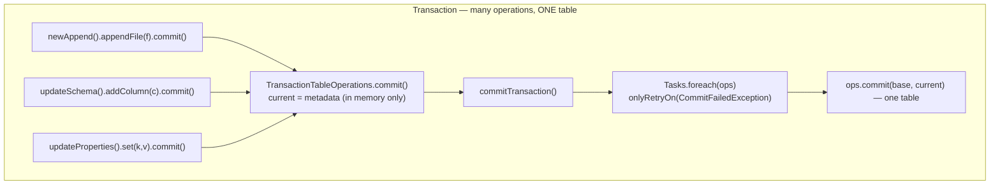
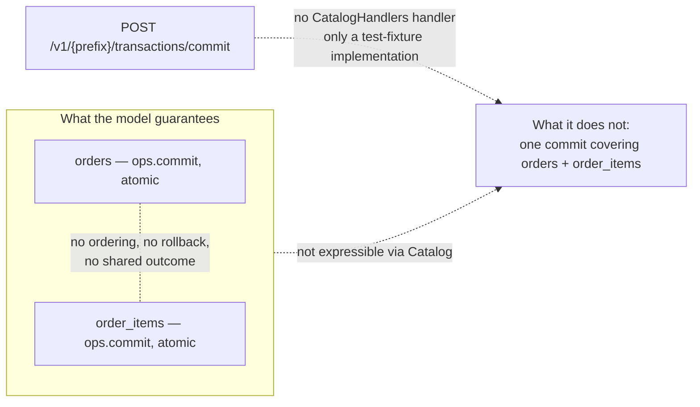

# Chapter 6.4 — Server-side commits and the multi-table gap

<div class="chapter-meta" markdown>
**The question this chapter answers:** an Iceberg commit is atomic for one table — so what is actually in this codebase to make a change land on two tables at once?

**Prerequisites:** Chapter 3.4 (the commit protocol), Chapter 6.1 (`TableOperations.commit` as the unit of atomicity), Chapter 6.3 (`UpdateTableRequest`, `UpdateRequirement`, the endpoint set)

**Source covered:** `api/.../Transaction.java`, `core/.../BaseTransaction.java`, `core/.../catalog/TableCommit.java`, `core/.../rest/RESTSessionCatalog.java`, `core/.../rest/CatalogHandlers.java`
</div>

## 1. The problem

Three chapters of Part 6 have circled one guarantee. Chapter 6.1 located it in the SPI: `TableOperations.commit(base, metadata)` either moves a table's pointer or throws. Chapter 6.2 audited what storage-backed catalogs deliver against that contract. Chapter 6.3 moved the arbitration behind an HTTP endpoint. Different mechanisms, one contract: **one table's pointer moves, or it does not.**

Now the ordinary case that breaks it. A pipeline appends to `orders` and rewrites the matching rows of `order_items`. Both writes are correct, both commits are atomic, and between them there is a window in which a reader sees new orders with no items. Nothing in the model narrows that window, and nothing closes it.

There are exactly two candidates in the tree: `Transaction`, which is not what its name suggests, and a REST endpoint the spec defines and the tree does not implement. This chapter follows both to their end and stops on the gap, because Iceberg stops there too.

## 2. What a `Transaction` actually is

`Transaction`'s javadoc is one line, and every word of it is load-bearing:

> *A transaction for performing multiple updates to a table.*

Singular. It composes *operations*, not tables.



The trick is the inner `TableOperations`. Each `PendingUpdate` in the chain runs the full Chapter 3.3 lifecycle and calls `commit` at the end of it — but on a `TableOperations` that does not touch a catalog:



`current()` and `refresh()` both return the same in-memory field, and `commit` assigns it. Every operation in the transaction believes it committed; what it actually did was advance an in-memory `TableMetadata` so the next operation can build on it. The identity check `underlyingBase != current` is there so an operation built against a stale intermediate state fails the way it would against a stale catalog — `CommitFailedException`, retry. A `Transaction` is a *staging area for one table's metadata*, drained by one real commit.

## 3. The proof is in the fields



Read the declarations, not the constructors. `private final String tableName` — one name. `private final TableOperations ops` — one set of operations. `private TableMetadata base` and `private TableMetadata current` — one before-and-after pair. No collection of tables anywhere. A class that could commit two tables would need at minimum a map from identifier to `ops`; the absence is not an oversight to be filled in later, it is the shape of the model.

## 4. `commitTransaction()` drains it into one swap

`BaseTransaction.commitTransaction()` switches on the transaction type — `CREATE_TABLE`, `REPLACE_TABLE`, `CREATE_OR_REPLACE_TABLE`, `SIMPLE`. The ordinary path is the last:



Sixty-eight lines, and the count that matters is one. This is everything the retry loop retries:

```java
.run(
    underlyingOps -> {
      applyUpdates(underlyingOps);

      underlyingOps.commit(base, current);
    });
```

`Tasks.foreach(ops)` iterates over exactly one thing — `ops`, the transaction's single `TableOperations`. Same retry loop as Chapter 3.3, same `onlyRetryOn(CommitFailedException)` contract, one level higher.

`applyUpdates` is the transaction's answer to the problem Chapter 3.3 solved with `apply()`-inside-the-loop: if `base != underlyingOps.refresh()`, the whole pending chain is re-committed against the refreshed metadata, in order. A `CommitFailedException` during that replay is wrapped in `PendingUpdateFailedException` and breaks out of the retry loop — *"Cannot pass even with retry due to conflicting metadata changes."*

Everything after the loop is one table's bookkeeping: `startingSnapshots` is one table's snapshot set, `committedFiles(ops, newSnapshots)` reads through the same single `ops`. No plural anywhere in the method.

## 5. The REST spec does define a multi-table endpoint

Iceberg has one type built specifically to carry a per-table commit as a value:



The javadoc names the scope itself: *"a commit to be applied for a single table"*. `create()` derives the two halves from one table's base and updated metadata — requirements from `UpdateRequirements.forUpdateTable(base, updated.changes())`, updates from `updated.changes()` — exactly the payload Chapter 6.3 followed onto the wire, now addressable by identifier instead of implied by the URL. The check that `base.uuid().equals(updated.uuid())` is the giveaway: a `TableCommit` is pinned to one table's identity.

`CommitTransactionRequest` carries a `List<TableCommit>`. And the client will send one:



N `TableCommit`s become N `UpdateTableRequest`s — the same request object from Chapter 6.3 — and go out as a single POST to `paths.commitTransaction()`, which is `/v1/{prefix}/transactions/commit`. The spec's summary for that path is unambiguous:

> *Commit updates to multiple tables in an atomic operation*

On the face of it, that closes the gap.

## 6. Following the seams

It is not, and the reason is visible in three places at once.



**The method is not on any interface.** `commitTransaction(List<TableCommit>)` appears on `RESTSessionCatalog` and, forwarding to it, on `RESTCatalog`. Neither carries `@Override`, because there is nothing to override: grep `api/` for `commitTransaction` and the only hit is `Transaction.commitTransaction()`, the single-table method. `Catalog` does not declare it and neither does `SessionCatalog`, so no engine integration — all of which are written against `Catalog` — can reach it. `TableCommit` appears in exactly three main-source files: its own, `RESTCatalog`, and `RESTSessionCatalog`. Not one in `spark/`, `flink/`, or `hive/`.

**The reference server has no handler.** Chapter 6.3 introduced `CatalogHandlers` as the helper set every Iceberg-based REST server is built from. Its table-update entry point is `updateTable(Catalog catalog, TableIdentifier ident, UpdateTableRequest request)` — one identifier, delegating to a `Catalog`. The class has no `commitTransaction` at all, and no seam where a second table could join, because the `Catalog` it delegates to cannot express the request.

**The only implementation in the tree is a test fixture that disclaims the guarantee.**



Note the path: `core/src/test`. `RESTCatalogAdapter` runs REST catalog tests in-process, and its javadoc says what it is:

> *This is a very simplistic approach that only validates the requirements for each table and
> does not do any other conflict detection. Therefore, it does not guarantee true
> transactional atomicity, which is left to the implementation details of a REST server.*

The body is the obvious implementation, and worth reading for why the obvious implementation cannot work. Each table change goes into its own `Transaction`, so `CatalogHandlers.commit(txTable.operations(), tableChange)` validates that table's requirements against the in-memory `TransactionTableOperations` from section 2, touching no storage. Then, once every validation has passed:

```java
// only commit if validations passed previously
transactions.forEach(Transaction::commitTransaction);
```

N independent commits, in a loop. Validating first narrows the window; it does not remove it. A failure on the third table leaves the first two committed, and nothing in Iceberg un-commits a snapshot as part of a failed larger operation.

## 7. The gap

> **In Iceberg the unit of commit is one table, and the model has no second unit.** Two tables that
> must change together cannot be expressed in it: `TableOperations.commit` moves one pointer,
> `Transaction` collapses many operations into one such move on one table, and `TableCommit` is,
> in its own javadoc, "a commit to be applied for a single table".

The REST spec reserves an endpoint for the missing unit, and the client will happily use it. But the endpoint sits outside the `Catalog` interface where no engine can reach it, has no server-side implementation anywhere in the Iceberg tree, and carries an atomicity guarantee that only a catalog server can make and no client can verify.

That is the gap: **Iceberg stops at the table boundary and hands the problem to whatever is running the catalog.**

## 8. Gotchas

!!! warning "`Transaction` does not mean what a database says it means"
    Its javadoc is *"A transaction for performing multiple updates to a table."* It buys atomicity across *operations* — an append and a schema change landing in one metadata file, one snapshot, one swap — and nothing across tables. Every `transaction.commitTransaction()` call in the Spark and Flink modules is this single-table method.

!!! warning "`commitTransaction(List<TableCommit>)` is not part of any catalog interface"
    A plain public method on `RESTCatalog` and `RESTSessionCatalog`, with no `@Override` and no declaration in `api/`. Code holding a `Catalog` — every engine integration — has no way to invoke it. A capability reachable only through the concrete type of one implementation is not part of the model.

!!! warning "The client assumes the endpoint exists"
    `V1_COMMIT_TRANSACTION` is in `DEFAULT_ENDPOINTS`, the frozen set the client falls back to when a server advertises nothing (Chapter 6.3). `Endpoint.check` therefore passes against a server that has never heard of the endpoint, and the failure arrives as an HTTP status rather than the `UnsupportedOperationException` the check exists to produce.

!!! warning "Atomicity here is a server promise, not a protocol property"
    Nothing in the request or the `204 No Content` response makes the spec's *"atomic operation"* claim checkable. Two servers can both implement `/v1/{prefix}/transactions/commit` and offer entirely different guarantees, with no way for a client to tell them apart.

!!! note "Sequential per-table commits are not a workaround"
    `transactions.forEach(Transaction::commitTransaction)` is what everyone reaches for, and the adapter's javadoc is warning about precisely it. A failure partway through leaves the earlier tables committed, and committing a compensating snapshot afterwards is not equivalent: readers in between already saw the intermediate state, which is the thing atomicity was supposed to prevent.

## Key takeaways

- `Transaction` composes operations on one table, not tables: `BaseTransaction` holds one `tableName`, one `TableOperations`, one `base`/`current` pair, and no collection of tables.
- Operations inside a transaction commit to `TransactionTableOperations`, which only assigns `BaseTransaction.this.current`; nothing reaches a catalog until `commitTransaction()`, which runs the Chapter 3.3 retry loop over exactly one `ops` and calls `underlyingOps.commit(base, current)` once.
- The REST spec defines an atomic multi-table endpoint and `RESTSessionCatalog` can send to it — but the method is on no interface, `CatalogHandlers` has no handler, and the only implementation in the tree is a test fixture that disclaims atomicity in its own javadoc.
- The gap is not that the code is missing but that the *model* has no place to put it: `Transaction` is one table by its field list, `TableCommit` is one table by its javadoc, and the endpoint that would span them is on no interface an engine can reach.
- The unit of commit in Iceberg is one table, and the model has no second unit. Where a multi-table guarantee exists it lives inside a catalog server Iceberg does not define.

## Source map

| What | File |
| --- | --- |
| `Transaction` — the one-line javadoc | [`api/.../Transaction.java`](https://github.com/apache/iceberg/blob/apache-iceberg-1.11.0/api/src/main/java/org/apache/iceberg/Transaction.java) |
| `BaseTransaction`, `TransactionTableOperations` | [`core/.../BaseTransaction.java`](https://github.com/apache/iceberg/blob/apache-iceberg-1.11.0/core/src/main/java/org/apache/iceberg/BaseTransaction.java) |
| `TableCommit` | [`core/.../catalog/TableCommit.java`](https://github.com/apache/iceberg/blob/apache-iceberg-1.11.0/core/src/main/java/org/apache/iceberg/catalog/TableCommit.java) |
| `CommitTransactionRequest`, `ResourcePaths.commitTransaction` | [`core/.../rest/requests/CommitTransactionRequest.java`](https://github.com/apache/iceberg/blob/apache-iceberg-1.11.0/core/src/main/java/org/apache/iceberg/rest/requests/CommitTransactionRequest.java), [`rest/ResourcePaths.java`](https://github.com/apache/iceberg/blob/apache-iceberg-1.11.0/core/src/main/java/org/apache/iceberg/rest/ResourcePaths.java) |
| The client-side method, on no interface | [`core/.../rest/RESTSessionCatalog.java`](https://github.com/apache/iceberg/blob/apache-iceberg-1.11.0/core/src/main/java/org/apache/iceberg/rest/RESTSessionCatalog.java), [`RESTCatalog.java`](https://github.com/apache/iceberg/blob/apache-iceberg-1.11.0/core/src/main/java/org/apache/iceberg/rest/RESTCatalog.java) |
| Reference handlers — no transaction handler | [`core/.../rest/CatalogHandlers.java`](https://github.com/apache/iceberg/blob/apache-iceberg-1.11.0/core/src/main/java/org/apache/iceberg/rest/CatalogHandlers.java) |
| The only implementation, in tests | [`core/src/test/.../rest/RESTCatalogAdapter.java`](https://github.com/apache/iceberg/blob/apache-iceberg-1.11.0/core/src/test/java/org/apache/iceberg/rest/RESTCatalogAdapter.java) |
| The endpoint's spec text | [`open-api/rest-catalog-open-api.yaml`](https://github.com/apache/iceberg/blob/apache-iceberg-1.11.0/open-api/rest-catalog-open-api.yaml) |

**Next:** Chapter 7.1 opens Part 7 on a system whose unit of commit is not a table at all; Chapter 10.2 comes back to this gap with the code that closes it — for a client speaking that system's REST API, though not, as 10.2 is careful to say, through the Java catalog Chapter 10.1 covers.
