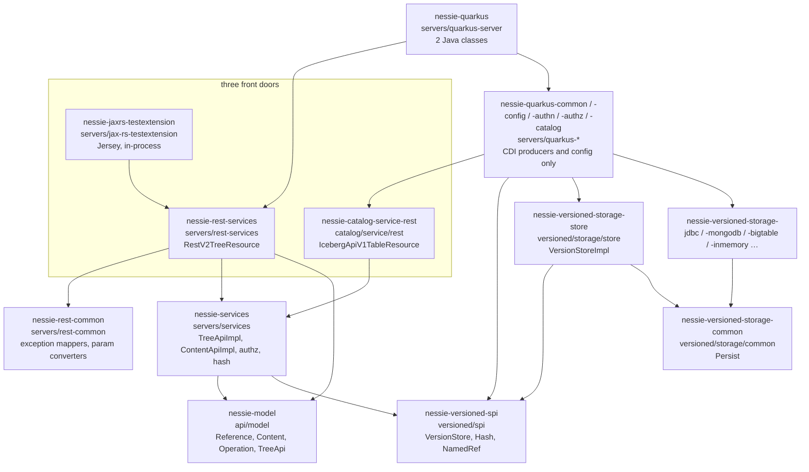

# Chapter 7.1 — Project map: Quarkus layers and Gradle modules

<div class="chapter-meta" markdown>
**The question this chapter answers:** you have a Nessie stack trace, or a class name from a log line, and you need the file — where in a repository of roughly 135 Gradle modules does it live, and what does that split buy?

**Prerequisites:** Chapter 1.3 (Nessie's core idea: a reference is a named pointer, a commit is a set of key changes), Chapter 1.4 (the navigation routine, and why a code search fails in both repositories), Part 6 (what a catalog is and what it has to guarantee)

**Source covered:** `settings.gradle.kts`, `gradle/projects.main.properties`, `servers/quarkus-common/.../ConfigurableVersionStoreFactory.java`
</div>

## 1. The problem

Iceberg's repository is easy to navigate. `api` declares interfaces, `core` implements them, and `spark/`, `flink/`, `hive-metastore/` and `mr/` bind them to engines. One `core` module holds `SnapshotProducer`, `TableMetadata` and the whole write path, and you can read all of it without leaving that directory. The catalogs that live elsewhere — `HiveCatalog` in `hive-metastore/`, `GlueCatalog` in `aws/`, `NessieCatalog` in `nessie/`, `SnowflakeCatalog`, `EcsCatalog`, `BigQueryMetastoreCatalog` — are one class each, hanging off scaffolding that stayed in `core`.

Nessie is not laid out that way, and the reason is not taste. Nessie is a *server*. It has to satisfy four constraints at once:

1. Its wire model is a published artifact. A Spark job on a five-year-old client must talk to today's server, so the model classes cannot drag a server framework onto the classpath.
2. Its storage engine is pluggable — JDBC, MongoDB, DynamoDB, Cassandra, BigTable, RocksDB, in-memory — and the choice is made at runtime by configuration.
3. It exposes *two* unrelated HTTP APIs over the same data: Nessie's own REST API, and the Iceberg REST Catalog protocol from Chapter 6.3.
4. Its tests need to run the real request path in-process, with no server, in milliseconds.

A single `core` module cannot deliver any of those. So Nessie encodes the layering in the build graph: each layer is its own Gradle module, and a dependency that would invert the layering simply fails to compile. Reading the module map is therefore not bookkeeping — it is how you find out what Nessie thinks its own architecture is.

## 2. Where the code lives



Three facts in that picture matter more than the rest.

**`nessie-services` is where all three front doors meet.** `A`, `B` and `C` are three completely different ways to arrive — Nessie's REST API, the Iceberg REST Catalog protocol, and an in-JVM test harness — and they converge on the same `TreeApiImpl` instance type. Chapter 7.4 walks one path from `A`, and Chapter 7.5 shows `B` arriving at the same place.

**The `E → G` edge is where this part stops.** `VersionStore` is an interface in `versioned/spi`. Everything below it — `VersionStoreImpl`, the object store, the key index, the compare-and-swap — is Part 8.

**`H` and `I` do not know about each other.** `versioned/storage/store` holds `VersionStoreImpl` and depends on `-common`, `-batching`, `nessie-model` and `nessie-versioned-spi` (`versioned/storage/store/build.gradle.kts:24-27`); its only reference to a backend is a `testImplementation` on `-inmemory` at `:53`. Each backend depends on `-common` too — `versioned/storage/jdbc/build.gradle.kts:27-29` names `-common`, `-common-proto`, `-common-serialize` — and on nothing above it. The shape is an inverted V converging on `nessie-versioned-storage-common`, which declares `Persist`. `VersionStoreImpl` and the backend that serves it meet for the first time at runtime, when CDI hands a `Persist` to a constructor. Section 6 is that constructor.

## 3. Modules are named by a properties file

Chapter 1.4 gave the navigation rule for this repository in one line — the index is `gradle/projects.main.properties`, and grep it. This section is why that file exists and what the shape of its contents tells you, which is a different question and the one this chapter is for.

Nessie's `settings.gradle.kts` never writes `include("nessie-model")`. It reads a map:



`nessieProject` takes a name, a group id and a *directory*, and sets `p.projectDir` explicitly. `loadProjects` feeds it every line of a properties file. The consequence is the first thing to internalise about this repository:



`nessie-quarkus` is `servers/quarkus-server`. `nessie-rest-services` is `servers/rest-services`. The Gradle coordinate you see in a dependency report and the directory you need to `cd` into are related only by this file. It is 122 lines long, carrying 120 module entries — one blank line and one comment account for the difference — and it is not quite the whole index. `settings.gradle.kts:211` loads six more projects from `gradle/projects.iceberg.properties`, and `:226-244` synthesises nine `nessie-spark-extensions-*` projects inline from a Spark/Scala version matrix. A full configure produces about 135.

Read it as five bands:

| Directory | Modules | What lives there |
| --- | --- | --- |
| `api/` | `nessie-model`, `nessie-client` | The wire model and the Java client — Chapter 7.2 |
| `versioned/` | `nessie-versioned-spi`, `nessie-versioned-storage-*` | `VersionStore` and its implementations — Part 8 |
| `servers/` | `nessie-services`, `nessie-rest-services`, `nessie-quarkus-*` | Service layer, REST resources, Quarkus wiring — 7.3 and 7.4 |
| `catalog/` | `nessie-catalog-service-rest`, `-impl`, `-format-iceberg`, `-files-*` | The Iceberg REST Catalog server — Chapter 7.5 |
| `tools/`, `testing/` | `nessie-immutables-std`, `nessie-*-testcontainer` | Annotation processors and shared fixtures |

## 4. The application module contains almost no application

Open the module that produces the runnable server and you find two Java classes: a startup configuration check and a single-page-app routing filter. The server itself is this:



That is the whole assembly. `nessie-rest-services` supplies the JAX-RS resources, `nessie-quarkus-catalog` the Iceberg catalog beans, `nessie-quarkus-common` the storage producers. The two `nessie-versioned-storage-jdbc` and `-jdbc2` lines are *not* a default-backend selection: all eleven backends are already on the classpath transitively via `servers/quarkus-common/build.gradle.kts:38-51`, and the default is `IN_MEMORY` — `@WithDefault("IN_MEMORY")` on `VersionStoreConfig.getVersionStoreType()` (`servers/quarkus-config/.../VersionStoreConfig.java:64`), restated at `servers/quarkus-server/src/main/resources/application.properties:188`. A server started with no configuration keeps its repository in the heap. Quarkus scans the modules for CDI beans at build time and stitches the application together.

The payoff is visible one line up the graph. `nessie-rest-services` — the module that owns every JAX-RS resource class — declares `jakarta.ws.rs` and CDI as `compileOnly` and has **no Quarkus dependency at all**. `nessie-services`, one layer further down, does not even have JAX-RS on its compile path. That is why `servers/jax-rs-testextension` can register `RestV2TreeResource` with a plain Jersey `ResourceConfig` and exercise the real request path with no Quarkus at all. It does still start a server: those registrations sit inside a `new JerseyTest() { … }` (`NessieJaxRsExtension.java:219-253`) that sets `TestProperties.CONTAINER_PORT` to `"0"`, calls `jerseyTest.setUp()`, and exposes a base URI over Grizzly — the class javadoc says it outright, *"A JUnit 5 extension that starts up Weld/JerseyTest."* The genuinely socket-free in-JVM path is `versioned/combined-cs`, and Chapter 7.3 ends on it.

## 5. Half the code is generated

Before you go looking for `ImmutableBranch`, know that it is not in the tree. Look at what `nessie-model` compiles against:



Three deliberate decisions, all of which will bite you in Chapter 7.2 if you have not seen them here.

**`annotationProcessor(project(":nessie-immutables-std", configuration = "processor"))`.** Nessie's model types are `@Value.Immutable` interfaces; the [Immutables](https://immutables.github.io/) processor generates `ImmutableBranch`, `ImmutablePut`, `ImmutableCommitResponse` and several hundred siblings at compile time. Grepping for them in a clean checkout finds nothing.

**javax *and* jakarta, both `compileOnly`.** `libs.jakarta.ws.rs.api` and `libs.javax.ws.rs`. `libs.jakarta.validation.api` and `libs.javax.validation.api`. One artifact has to work on a Jakarta EE 9+ server and on an older javax stack, and `compileOnly` means neither is imposed on a consumer.

**Jackson 2 as `implementation`, Jackson 3 as `compileOnly`.** `com.fasterxml.jackson.core:jackson-databind` is a real dependency; `tools.jackson.core:jackson-databind` is compiled against but not required. What gets written twice is narrower than it sounds: only the *databind* annotations, `@JsonSerialize` beside `@tools.jackson.databind.annotation.JsonSerialize` and so on. Jackson 3 kept the annotation package name `com.fasterxml.jackson.annotation`, so `@JsonIgnore`, `@JsonTypeName`, `@JsonSubTypes` and `@JsonTypeInfo` are written once and satisfy both stacks — nothing under `api/model/src/main` imports `tools.jackson.annotation` at all. 7.2 shows what that looks like on a real class.

## 6. `VersionStore` is chosen at runtime, in one place

The service layer receives a `VersionStore` by injection. It never constructs one. A tree-wide `grep -rn "new VersionStoreImpl"` finds seven `src/main` call sites — two JUnit extensions, the in-JVM combined client, the repository-export tool, two shared test bases, and exactly one in the Quarkus server, which is a CDI producer:



Read what the method does *not* do. `versionStoreType` is read on the method's first line — and then used only in the log message. The store is always `new VersionStoreImpl(persist)`. The configured backend selects the `Persist` instance that gets injected here, not the version store wrapped around it. `VersionStoreType` is a `Persist` selector wearing a misleading name; the actual selection happens in `PersistProvider.produceBackend()`, which calls `backendBuilder.select(new Literal(versionStoreType))`.

The optional decorator is worth noting for the same reason:

```java
if (storeConfig.isEventsEnabled() && resultConsumer.isResolvable()) {
  versionStore = new EventsVersionStore(versionStore, resultConsumer.get());
}
```

Nessie's event notifications (`events/`) are a wrapper around `VersionStore`, not a hook inside the storage engine. The same trick is used once more, and this one changes what you get from `@Inject`:



Five lines, and they reverse the default. The producer above publishes its bean under the `@NotObserved` qualifier; `QuarkusObservingVersionStore` takes that bean and publishes itself *unqualified*. Every `@Inject VersionStore` in every resource therefore lands on the instrumented wrapper. Reading only the producer tells you the wrong thing about what runs in production.

## 7. Gotchas

!!! warning "The Gradle coordinate is not the directory"
    `nessie-quarkus` is `servers/quarkus-server`. `nessie-versioned-storage-store` is `versioned/storage/store`, and the class it exists for, `VersionStoreImpl`, sits under package `org.projectnessie.versioned.storage.versionstore`. Module name, directory name and package name are three independent namings. When a dependency report or a shaded jar gives you a coordinate, `gradle/projects.main.properties` is the translation table for the 120 main modules; the GC tooling lives in `gradle/projects.iceberg.properties`, and the `nessie-spark-extensions-*` coordinates are synthesised in `settings.gradle.kts` and appear in no properties file at all.

!!! warning "`Immutable*` classes do not exist until you build"
    An IDE opened on a fresh clone will show hundreds of unresolved symbols in `api/model`. That is expected: they are annotation-processor output. This also means `grep -r "class ImmutableBranch"` is a dead end, and that reading the *interface* is the only way to learn the type's shape.

!!! warning "The default version store is `IN_MEMORY`, and it is not a cache"
    A server started with no `nessie.version.store.type` keeps the whole repository in the heap
    and loses it on restart. The two `nessie-versioned-storage-jdbc` lines in the server's build
    file put a driver on the classpath; they do not select it. Moving an existing repository
    between backends is a job for `tools/server-admin`, whose CLI ships `ExportRepository` and
    `ImportRepository` commands for exactly that.

!!! note "`-tests` modules are fixtures, not test suites"
    `versioned/storage/jdbc-tests`, `inmemory-tests`, `mongodb-tests` and their siblings put their code in `src/main`, not `src/test`. They are published helper modules — testcontainer factories, `Backend` builders — consumed by *other* modules' tests. Nothing in them runs on its own, and their absence from a test report is not a gap.

!!! note "Numbered backend modules are alternative implementations, not versions"
    `versioned/storage/jdbc` and `jdbc2`, `mongodb` and `mongodb2`, `cassandra` and `cassandra2`, `dynamodb` and `dynamodb2` all coexist in `projects.main.properties`, and `servers/quarkus-server` ships both JDBC variants. The `2` modules are newer storage layouts, selected by configuration; a fix applied to one does not apply to the other.

## Key takeaways

- Nessie's module split enforces dependency direction: `nessie-model` knows nothing about servers, `nessie-services` has no JAX-RS on its compile path, `nessie-rest-services` has no Quarkus dependency at all, and `versioned/storage/store` has no compile dependency on any backend — both sides meet at `-common`.
- Module names and directories are decoupled by `gradle/projects.main.properties`, which `settings.gradle.kts` reads at configuration time. That file is the repository's index.
- The runnable server module holds two Java classes; the application is assembled by CDI from beans declared in sibling modules.
- `VersionStore` is always `VersionStoreImpl`. The `versionStoreType` setting picks the `Persist` backend underneath it — `IN_MEMORY` unless configured — and two decorators, events and observability, sit on top.
- Model classes are generated by the `nessie-immutables-std` annotation processor and carry duplicated javax/jakarta annotations and duplicated Jackson *databind* annotations. Both facts shape everything you read in Chapter 7.2.
- Three front doors — Nessie REST, the Iceberg REST Catalog, and an in-process Jersey harness — converge on `servers/services`. That convergence is the subject of 7.4 and 7.5.

## Source map

| What | File |
| --- | --- |
| Project loading | [`settings.gradle.kts`](https://github.com/projectnessie/nessie/blob/nessie-0.108.4/settings.gradle.kts) |
| The module map | [`gradle/projects.main.properties`](https://github.com/projectnessie/nessie/blob/nessie-0.108.4/gradle/projects.main.properties) |
| Runnable server | [`servers/quarkus-server/build.gradle.kts`](https://github.com/projectnessie/nessie/blob/nessie-0.108.4/servers/quarkus-server/build.gradle.kts) |
| Model compile path | [`api/model/build.gradle.kts`](https://github.com/projectnessie/nessie/blob/nessie-0.108.4/api/model/build.gradle.kts) |
| Service layer compile path | [`servers/services/build.gradle.kts`](https://github.com/projectnessie/nessie/blob/nessie-0.108.4/servers/services/build.gradle.kts) |
| REST layer compile path | [`servers/rest-services/build.gradle.kts`](https://github.com/projectnessie/nessie/blob/nessie-0.108.4/servers/rest-services/build.gradle.kts) |
| `VersionStore` producer | [`servers/quarkus-common/.../ConfigurableVersionStoreFactory.java`](https://github.com/projectnessie/nessie/blob/nessie-0.108.4/servers/quarkus-common/src/main/java/org/projectnessie/quarkus/providers/versionstore/ConfigurableVersionStoreFactory.java) |
| Observing decorator | [`servers/quarkus-common/.../QuarkusObservingVersionStore.java`](https://github.com/projectnessie/nessie/blob/nessie-0.108.4/servers/quarkus-common/src/main/java/org/projectnessie/quarkus/providers/versionstore/QuarkusObservingVersionStore.java) |
| `Persist` producer | [`servers/quarkus-common/.../PersistProvider.java`](https://github.com/projectnessie/nessie/blob/nessie-0.108.4/servers/quarkus-common/src/main/java/org/projectnessie/quarkus/providers/storage/PersistProvider.java) |
| Backend selection and its default | [`servers/quarkus-config/.../VersionStoreConfig.java`](https://github.com/projectnessie/nessie/blob/nessie-0.108.4/servers/quarkus-config/src/main/java/org/projectnessie/quarkus/config/VersionStoreConfig.java) |
| Immutables style (`nessie-immutables`; the processor `api/model` applies is `nessie-immutables-std`, `tools/immutables-std`) | [`tools/immutables/.../NessieImmutable.java`](https://github.com/projectnessie/nessie/blob/nessie-0.108.4/tools/immutables/src/main/java/org/projectnessie/nessie/immutables/NessieImmutable.java) |
| In-process JAX-RS harness | [`servers/jax-rs-testextension/.../NessieJaxRsExtension.java`](https://github.com/projectnessie/nessie/blob/nessie-0.108.4/servers/jax-rs-testextension/src/main/java/org/projectnessie/jaxrs/ext/NessieJaxRsExtension.java) |

**Next:** Chapter 7.2 opens `api/model` and reads the four types every Nessie request is built from — starting with the one whose `getType()` throws.
