# Chapter 7.2 — The data model: `Reference`, `Content`, `Operation`

<div class="chapter-meta" markdown>
**The question this chapter answers:** what are the four types that make up every Nessie request and response, and what does each of them deliberately refuse to represent?

**Prerequisites:** Chapter 1.3 (these same four types, at altitude), Chapter 7.1 (where `api/model` sits, and why `Immutable*` classes are generated), Chapter 2.2 (`metadata.json`), Chapter 3.3 (snapshots and snapshot IDs)

**Source covered:** `api/model/.../model/Reference.java`, `Detached.java`, `Content.java`, `IcebergTable.java`, `ContentKey.java`, `Operation.java`
</div>

## 1. The problem

Iceberg already solved table state. A `metadata.json` names the schema, the partition specs, the sort orders, the snapshot log; a manifest list names the manifests; manifests name the data files. By the time you reach Chapter 3.3 you know exactly where every byte of a table lives.

What Iceberg did *not* solve is the pointer. `TableMetadata` describes one table at one instant. Which `metadata.json` is current, and current *for whom*, is delegated to a catalog — and a catalog that stores one pointer per table can only ever offer one version of the world.

Nessie's job is that pointer, versioned like a Git repository. Which means its data model has to answer four questions and nothing more:

1. **Which version of the world?** → `Reference`
2. **Which object within it?** → `ContentKey`
3. **What is that object?** → `Content`
4. **How does it change?** → `Operation`

The interesting design decision is how *little* `Content` turns out to be. For an Iceberg table it is a metadata-location string and four Iceberg IDs — one `long` and three `int`s. Nessie never learns your schema. It stores a pointer, versions it, and gets out of the way — which is exactly why Part 8's storage engine can be written without a single reference to Iceberg.

## 2. The four types

```mermaid
classDiagram
    class Base { <<interface>> }
    class Reference {
        <<interface>>
        +getName() String
        +getHash() String
        +getType() ReferenceType
    }
    class Branch { ImmutableBranch, generated }
    class Tag { ImmutableTag, generated }
    class Detached { getType&#40;&#41; throws }
    Base <|-- Reference
    Reference <|.. Branch
    Reference <|.. Tag
    Reference <|.. Detached

    class Content {
        <<abstract>>
        +getId() String
        +getType() Type
        +withId(String) Content
    }
    class IcebergContent {
        <<abstract>>
        +getMetadataLocation() String
        +getVersionId() long
    }
    class IcebergTable { snapshotId long + 3 ints }
    class IcebergView
    class Namespace { elements + properties, no location }
    class UDF
    class DeltaLakeTable
    Content <|-- IcebergContent
    IcebergContent <|-- IcebergTable
    IcebergContent <|-- IcebergView
    Content <|-- Namespace
    Content <|-- UDF
    Content <|-- DeltaLakeTable

    class ContentKey { +getElements() List~String~ }
    class Operation {
        <<interface>>
        +getKey() ContentKey
    }
    class Put { +getContent() Content }
    class Delete
    class Unchanged
    Operation <|.. Put
    Operation <|.. Delete
    Operation <|.. Unchanged
    Operation --> ContentKey : keyed by
    Put --> Content : carries
    ContentKey ..> Namespace : getNamespace&#40;&#41; derives
```



Every box on that diagram is an interface or an abstract class. Not one of them is instantiable directly — Chapter 7.1 explained why: `@Value.Immutable` plus the `nessie-immutables-std` annotation processor produces `ImmutableBranch`, `ImmutablePut` and the rest at compile time.

## 3. `Reference`: a name and a hash



Three details carry weight.

**The hash is a `String`, and it is only sometimes a hash.** The javadoc is precise about the asymmetry: *"Will be an 'exact' commit ID (no relative parts) when returned from a Nessie server. Might contain relative parts when used as an input to a Nessie API functionality (since Nessie spec 2.1.0)."* So `2e1cfa82~2^1` is a legal value on the way in — but only that shape. `getHash()` is annotated with `HASH_OR_RELATIVE_COMMIT_SPEC_REGEX` (`Reference.java:73-79`), which `Validation.java:66-70` builds as an optional 8-to-64-character hex string followed by any number of relative parts. There is no room in it for a reference name or an `@`; `main@2e1cfa82~2^1` belongs to a different grammar, `REF_NAME_PATH_REGEX`, which describes the `{ref}` *path element* rather than this field. Chapter 7.3 covers that one; the point here is that the field's type does not tell you which side of the wire you are on, and `@Value.Check checkHash()` is what enforces the shape.

**`getMetadata()` is opt-in.** The javadoc says it twice, in bold: *"this is **only added** by the server when **explicitly** requested by the client."* Commits-ahead/behind and the common ancestor are expensive to compute, so a plain `getAllReferences` leaves them null. Note the name: the *common ancestor* here is the plain ancestry question, and it is not the same query as the **merge base** Chapter 9.2 computes — Nessie has both, and section 3 of that chapter is where they part company.

**`ReferenceType` has two values.** `BRANCH` and `TAG`. Note what is missing, and hold that thought for exactly one section.

## 4. `Detached`: the reference that has no type



`Detached` is what you get when you address a commit directly rather than through a branch or tag — Git's detached HEAD, made into a wire type. It implements `Reference`, so it flows through every API that takes one. But it has no name of its own (`getName()` returns the constant `"DETACHED"`, marked `@JsonIgnore` so it never appears on the wire), and it has no type:

```java
@Override
default ReferenceType getType() {
  throw new UnsupportedOperationException("Illegal use of detached reference");
}
```

That is a deliberate choice, not an oversight, and it is worth being exact about what `getType()` is *not*. It is not the JSON discriminator: that is `@JsonTypeInfo(use = Id.NAME, property = "type")` on `Reference` (`:55`), resolved through each subtype's `@JsonTypeName`, and `Detached` has one — `@JsonTypeName("DETACHED")` (`Detached.java:42`). The wire has three values; the enum has two. `getType()` never reaches JSON at all, because it is `@JsonIgnore` and `@Value.Redacted` (`Reference.java:107-108`). It throws because `ReferenceType` is a Java-side classification of *named* references and there is no honest constant to return, and Nessie prefers a loud failure to a silent `null`. The cost lands on you: any code that switches on `reference.getType()` breaks the first time a user reads a table at an explicit commit hash.

The `@Value.Check` override carries a second warning worth reading:

```java
@Value.Check
@Override
default void checkHash() {
  // Note: a detached hash must have a start commit ID (absolute part); this is going to be
  // checked by the service layer.
  validateHashOrRelativeSpec(getHash());
}
```

The model type validates only the *syntax*. "This detached hash must actually begin with a commit ID" is a semantic rule, and the comment tells you where it is enforced — the service layer, which Chapter 7.4 opens.

## 5. `Content`: identity that survives a rename



Two members do all the work.

**`getId()`** is described as *"unique for the entire lifetime of this Content object and persists across renames. Two content objects with the same key will have different id."* Read that second sentence carefully: the *key* is not the identity. `sales.orders` renamed to `analytics.orders` is the same object under a new key; `sales.orders` dropped and recreated is a different object under the same key. The id is how Nessie tells those apart, and Section 8 shows the protocol built on it.

**`Type`** is an interface, not an enum, nested inside `Content` a few lines into the excerpt. The constants it declares — `ICEBERG_TABLE`, `NAMESPACE`, `UDF` and the rest — are produced by `ContentTypes.forName(...)`, which reads a registry rather than a fixed list. That registry is populated through Java's `ServiceLoader`, and the bundle that ships the built-in types is eight lines long:



Registration is keyed on each class's `@JsonTypeName` annotation, and a duplicate name throws at class-load time.

What happens to a type this JVM has never heard of is a separate mechanism, and it runs the other way round from what you would guess. `ContentTypeIdResolver.java:60-66` catches the `IllegalArgumentException` from `ContentTypes.forName` and specialises the type to `GenericContent` instead — and `GenericContent`'s own javadoc says who that is for: *"Nessie servers cannot properly handle unknown content types, but with this 'fallback' clients can at least deserialize the content object and do not fail hard."* It is a client-side rescue, not a server-side one. `Content.Type.UNKNOWN` is something else again: the registry's DEFAULT entry (`ContentTypes.java:103-105`), whose one server-side use is decoding legacy payload-`0` records in `servers/store/.../UnknownSerializer.java`.

## 6. `IcebergTable`: what Nessie actually stores



That is it. A path to a `metadata.json`, and four IDs that Iceberg would otherwise have to re-read the file to learn: `currentSnapshotId` (a `long`), `currentSchemaId`, `defaultSpecId` and `defaultSortOrderId` (`int`s). Note the class extends `IcebergContent`, not `Content` directly — `getMetadataLocation()` and `getVersionId()` are declared one level up, and `IcebergView` shares them.

Three things follow, and they explain most of Nessie's behaviour:

- **A Nessie commit is small and fast.** Committing a table change writes a few hundred bytes, not a manifest. Whatever Chapter 3.3's `SnapshotProducer` wrote to object storage is already there; Nessie only moves the pointer.
- **Nessie can version anything with a URI — but "a URI" is not the whole story.** `IcebergView` and `UDF` really are the same shape, a location plus discriminators. `DeltaLakeTable` carries two *lists* of locations, `getMetadataLocationHistory()` and `getCheckpointLocationHistory()`, plus `getLastCheckpoint()`. And `Namespace` has no location at all: its only attributes are `getElements()` and `getProperties()`, which section 7 comes back to.
- **Nessie cannot answer questions about your data.** It does not know your schema, so it cannot validate a write against it. That job stays with the engine, and with the Iceberg REST Catalog layer of Chapter 7.5 — the one part of the *server* that opens a `metadata.json`. Nessie's GC tooling opens it too, from outside the server: `gc/gc-iceberg/.../IcebergContentToFiles.java:137` calls `TableMetadataParser.read`, and `:119` the view equivalent.

Note the `@Deprecated`, `@JsonView(Views.V1.class)` `getMetadata()` on the last lines of the excerpt, with its comment: *"Left here in case an old Nessie client sends this piece of information. To be removed when API v1 gets removed."* One Java class, two wire shapes, selected by Jackson view — a pattern you will meet again in `Operation.Put`.

## 7. `ContentKey`, and the two faces of `Namespace`



A key is an ordered list of strings — `["sales", "orders"]`, not the string `"sales.orders"` — with two hard caps. `MAX_LENGTH = 500` characters, with the comment noting that a character can cost up to three bytes in UTF-8; `MAX_ELEMENTS = 20` levels. Both are enforced in `Elements.validate`, alongside a ban on null elements, empty elements, and control characters. These are not style rules: keys become index entries in Part 8's storage layout, and an unbounded key would make the index unbounded.

The namespace of a key is *derived*, not stored. `getNamespace()`, at the end of that excerpt, is `Namespace.of(getElements().subList(0, getElementCount() - 1))` — everything but the last element. It is pure string arithmetic — and it says nothing about whether a `Namespace` object exists at that key. Because `Namespace` is *also* a `Content` subtype (`Namespace extends Content implements Elements`), stored at its own `ContentKey`, with its own properties and its own content-id. So `sales.orders` can have a namespace of `sales` while no `sales` namespace object has ever been committed.

## 8. `Operation`: three shapes, two protocols



`Operation` has exactly three implementations — `Put`, `Delete`, `Unchanged` — all keyed by a `ContentKey`. `Unchanged` carries no payload at all; it exists so a client can say "I read this key, and my commit assumes it did not move", which becomes a conflict check in Part 8.

The `@Schema` description on `Put` is the specification for the two protocols built on content-ids, and it is worth quoting in full because nothing else in the codebase states it as clearly:

> *A new content object is created by populating the `value` field, the content-id in the content object must not be present (null). A content object is updated by populating the `value` containing the correct content-id. If the key for a content shall change (aka a rename), then use a `Delete` operation using the current (old) key and a `Put` operation using the new key with the `value` having the correct content-id. Both operations must happen in the same commit. A content object can be replaced (think: `DROP TABLE xyz` + `CREATE TABLE xyz`) with a `Delete` operation and a `Put` operation for a content using a `value` representing a new content object, so without a content-id, in the same commit.*

Three operation types, four intents, distinguished only by whether the id is carried:

| Intent | Operations in one commit | Content-id |
| --- | --- | --- |
| Create | `Put(k, content)` | absent |
| Update | `Put(k, content)` | present |
| Rename | `Delete(old)` + `Put(new, content)` | **carried over** |
| Replace | `Delete(k)` + `Put(k, content)` | **dropped** |

Chapter 7.5 shows the Iceberg REST Catalog's `renameTable` doing exactly the third row, by reusing the `Content` object it just fetched.

`Put` declares four accessors, and the second is the historical one — `@Deprecated`, `@SuppressWarnings("DeprecatedIsStillUsed")`, `@JsonView(Views.V1.class)`, `Content getExpectedContent()` — sitting between the live `getContent()` and the two V2-only members that follow it, `getMetadata()` and `getDocumentation()`. In API v1, optimistic concurrency was expressed in the request body: here is what I think is there now, fail me if I am wrong. In v2 that moved into the commit call itself — an expected *hash* for the whole reference rather than an expected *value* per key. Chapter 7.4 shows where it went.

## 9. Gotchas

!!! warning "`Detached.getType()` throws — plan for it"
    `ReferenceType` has only `BRANCH` and `TAG`, so a `switch` over `reference.getType()` is a latent crash the moment a user addresses a commit hash directly. The safe test is `instanceof Branch` / `instanceof Tag` / `instanceof Detached`, which is exactly what `servers/services/.../impl/RefUtil.java:37-45` does. (`TreeApiImpl` and `ContentApiImpl` switch on the versioned-spi types `BranchName`/`TagName`/`DetachedRef` instead — a parallel hierarchy, one layer down.)

!!! warning "The content-id *is* the rename protocol"
    Sending a `Put` with an id means "this is the existing object"; sending one without means "create a new object". A `Delete`+`Put` pair that keeps the id renames; the same pair that drops it drops and recreates. Both commits succeed. The difference only shows up later — in the commit log, in `getEntries`, and in anything that follows an object across time — which makes this the most expensive detail in the chapter to get wrong.

!!! note "A namespace prefix is not a namespace object"
    `ContentKey.getNamespace()` fabricates a `Namespace` from the first N−1 elements without consulting storage. Whether a `Namespace` *content object* exists at that key is a separate question with a separate answer, and `NessieNamespaceNotFoundException` exists precisely because the two can disagree.

!!! note "Some annotations appear twice on purpose — and knowing which is the point"
    `@Valid` next to `@jakarta.validation.Valid`, `@JsonSerialize` next to `@tools.jackson.databind.annotation.JsonSerialize`, `@Nullable` next to `@jakarta.annotation.Nullable`. `nessie-model` compiles against javax *and* jakarta, and against Jackson 2 *and* Jackson 3, all `compileOnly` (Chapter 7.1). What is *not* doubled is just as informative: Jackson 3 kept the annotation package name `com.fasterxml.jackson.annotation`, so `@JsonTypeName`, `@JsonIgnore` and `@JsonSubTypes` are written once and serve both — nothing under `api/model/src/main` imports `tools.jackson.annotation`. It is not copy-paste rot, and a *databind* annotation added to one copy but not the other will serialize correctly on exactly one of the two stacks.

## Key takeaways

- Nessie versions *pointers*, not data. `IcebergTable` is a `metadataLocation` plus four Iceberg IDs — which is why a Nessie commit is cheap and why the storage engine needs no knowledge of Iceberg.
- `Reference` is a name plus a hash; `Branch`, `Tag` and `Detached` are the three subtypes, and `Detached` deliberately has no `ReferenceType` at all.
- `Content.getId()` is the object's identity and survives renames. Whether a `Put` carries it is the entire difference between renaming a table and replacing it.
- `ContentKey` is an element list with hard caps (500 characters, 20 elements) because keys become index entries in the storage layer.
- `Namespace` is simultaneously a `Content` subtype stored at its own key and a value derived from any other key's prefix. The two can disagree.
- Content types are registered through `ServiceLoader`, not enumerated. An unregistered type name deserializes to `GenericContent` so that a *client* does not fail hard; `Content.Type.UNKNOWN` is a different thing, the registry's default entry, and its live use is decoding legacy payload-`0` records.

## Source map

| What | File |
| --- | --- |
| `Reference` | [`api/model/.../model/Reference.java`](https://github.com/projectnessie/nessie/blob/nessie-0.108.4/api/model/src/main/java/org/projectnessie/model/Reference.java) |
| `Branch`, `Tag`, `Detached` | [`Branch.java`](https://github.com/projectnessie/nessie/blob/nessie-0.108.4/api/model/src/main/java/org/projectnessie/model/Branch.java), [`Tag.java`](https://github.com/projectnessie/nessie/blob/nessie-0.108.4/api/model/src/main/java/org/projectnessie/model/Tag.java), [`Detached.java`](https://github.com/projectnessie/nessie/blob/nessie-0.108.4/api/model/src/main/java/org/projectnessie/model/Detached.java) |
| `Content` | [`api/model/.../model/Content.java`](https://github.com/projectnessie/nessie/blob/nessie-0.108.4/api/model/src/main/java/org/projectnessie/model/Content.java) |
| Content subtypes | [`IcebergTable.java`](https://github.com/projectnessie/nessie/blob/nessie-0.108.4/api/model/src/main/java/org/projectnessie/model/IcebergTable.java), [`IcebergView.java`](https://github.com/projectnessie/nessie/blob/nessie-0.108.4/api/model/src/main/java/org/projectnessie/model/IcebergView.java), [`Namespace.java`](https://github.com/projectnessie/nessie/blob/nessie-0.108.4/api/model/src/main/java/org/projectnessie/model/Namespace.java), [`UDF.java`](https://github.com/projectnessie/nessie/blob/nessie-0.108.4/api/model/src/main/java/org/projectnessie/model/UDF.java) |
| Content type registry | [`types/ContentTypes.java`](https://github.com/projectnessie/nessie/blob/nessie-0.108.4/api/model/src/main/java/org/projectnessie/model/types/ContentTypes.java), [`types/MainContentTypeBundle.java`](https://github.com/projectnessie/nessie/blob/nessie-0.108.4/api/model/src/main/java/org/projectnessie/model/types/MainContentTypeBundle.java) |
| `ContentKey` and its rules | [`ContentKey.java`](https://github.com/projectnessie/nessie/blob/nessie-0.108.4/api/model/src/main/java/org/projectnessie/model/ContentKey.java), [`Elements.java`](https://github.com/projectnessie/nessie/blob/nessie-0.108.4/api/model/src/main/java/org/projectnessie/model/Elements.java) |
| `Operation` | [`Operation.java`](https://github.com/projectnessie/nessie/blob/nessie-0.108.4/api/model/src/main/java/org/projectnessie/model/Operation.java), [`Operations.java`](https://github.com/projectnessie/nessie/blob/nessie-0.108.4/api/model/src/main/java/org/projectnessie/model/Operations.java) |
| Name / hash grammar | [`Validation.java`](https://github.com/projectnessie/nessie/blob/nessie-0.108.4/api/model/src/main/java/org/projectnessie/model/Validation.java) |
| Custom immutables style | [`tools/immutables/.../NessieImmutable.java`](https://github.com/projectnessie/nessie/blob/nessie-0.108.4/tools/immutables/src/main/java/org/projectnessie/nessie/immutables/NessieImmutable.java) |

**Next:** Chapter 7.3 puts these types on the wire — and explains why five API interfaces in v1 became one in v2.
