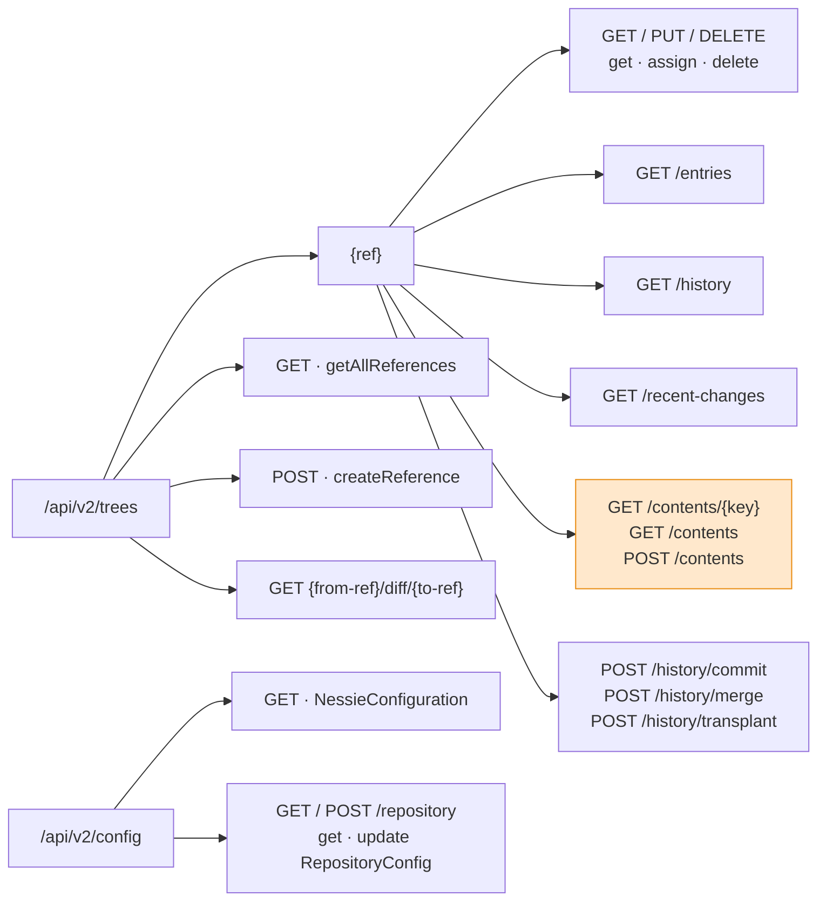

# Chapter 7.3 — REST API v2: `TreeApi`, and where `ContentApi` went

<div class="chapter-meta" markdown>
**The question this chapter answers:** what is Nessie's v2 HTTP surface, and why did six API interfaces in v1 collapse into two?

**Prerequisites:** Chapter 7.2 (`Reference`, `ContentKey`, `Operations`), Chapter 7.1 (why the API interfaces live in `api/model` rather than in the server)

**Source covered:** `api/model/.../api/v2/TreeApi.java`, `http/HttpTreeApi.java`, `doc/ApiDoc.java`, `params/ReferenceResolver.java`, `model/Validation.java`
</div>

## 1. The problem

API v1 had six interfaces: `ConfigApi`, `TreeApi`, `ContentApi`, `DiffApi`, `NamespaceApi` and `RefLogApi`. Five of them divided the surface the way most REST APIs do — by noun. Trees here, contents there, namespaces somewhere else.

API v2 has two: `TreeApi` and `ConfigApi`.

`ConfigApi` carried over unchanged in role; it was never part of the collapse. `RefLogApi` did not survive it either, but for the opposite reason — it is `@Deprecated` on the interface and on its one method, its javadoc says *"The Nessie reflog in this form is deprecated, likely for removal"*, and v2 has no successor for it. The other four really did collapse into one, and that is not tidying. It follows from one decision about addressing. In v1 the reference name and the point in its history were two separate inputs: `tree/{ref}` in the path with `hashOnRef` as a *query* parameter, and in `HttpContentApi` both `ref` and `hashOnRef` as query parameters. In v2 the reference is a single *path element*, and that path element carries both which reference **and** which point in its history:

```
main                                   HEAD of branch main
main@2e1cfa82b035c26cbbbdae632cea0705  an exact commit on main
main@2e1cfa82~2                        relative: the 2nd predecessor of that commit
main*2021-04-07T14:42:25.534748Z       the commit valid at that instant
-                                      the server's default branch
@2e1cfa82b035c26cbbbdae632cea0705      DETACHED: that commit, no branch
```

Once the URL can say *"the tree as of this moment on this branch"*, content stops being a separate resource. It is just something you look up inside a tree: `…/{ref}/contents/{key}`. Diff is a relation between two trees. Namespaces are content. The nouns collapsed because the addressing scheme absorbed them — all but the reflog, which was dropped rather than folded in.

This chapter is about that path element, and about the two-layer way Nessie declares the API around it.

!!! note "There is no `ContentApi` in v2"
    `api/model/.../api/v2/` contains exactly two API interfaces — `TreeApi` and `ConfigApi` — plus their JAX-RS bindings `HttpTreeApi` and `HttpConfigApi`. `getContent` and `getMultipleContents` are methods on `TreeApi`; `getSeveralContents` is declared only on `HttpTreeApi`, which section 5 comes back to. The name `ContentApi` survives in two other places, which is what makes searching for it confusing: `org.projectnessie.api.v1.ContentApi` (the older wire API) and `org.projectnessie.services.impl.ContentApiImpl` (a server-internal split, used in Chapter 7.4). The wire API collapsed; the service-layer separation did not.

## 2. Everything hangs off one path element



The highlighted node is where v1's `ContentApi` went. Its two methods — `getContent` and `getMultipleContents` — reappear under the tree, joined by a third endpoint v1 never had.

The full v2 surface, so you can curl it:

| Method | Path under `/api/v2` | `TreeApi` method |
| --- | --- | --- |
| `GET` | `trees` | `getAllReferences` |
| `POST` | `trees` | `createReference` |
| `GET` | `trees/{ref}` | `getReferenceByName` |
| `PUT` | `trees/{ref}` | `assignReference` |
| `DELETE` | `trees/{ref}` | `deleteReference` |
| `GET` | `trees/{ref}/entries` | `getEntries` |
| `GET` | `trees/{ref}/history` | `getCommitLog` |
| `GET` | `trees/{ref}/recent-changes` | `getReferenceHistory` |
| `GET` | `trees/{from-ref}/diff/{to-ref}` | `getDiff` |
| `GET` | `trees/{ref}/contents/{key}` | `getContent` |
| `GET` | `trees/{ref}/contents` | `getSeveralContents` |
| `POST` | `trees/{ref}/contents` | `getMultipleContents` |
| `POST` | `trees/{branch}/history/commit` | `commitMultipleOperations` |
| `POST` | `trees/{branch}/history/merge` | `mergeRefIntoBranch` |
| `POST` | `trees/{branch}/history/transplant` | `transplantCommitsIntoBranch` |
| `GET` | `config` | `ConfigApi.getConfig` |
| `GET` | `config/repository` | `ConfigApi.getRepositoryConfig` |
| `POST` | `config/repository` | `ConfigApi.updateRepositoryConfig` |

Fifteen tree endpoints and three config endpoints. Fourteen of the fifteen are declared on `TreeApi`; the fifteenth, `getSeveralContents`, exists only on the HTTP binding.

## 3. The `{ref}` grammar

Nessie documents the grammar in a constants file that feeds the OpenAPI annotations, which makes it the closest thing to a normative statement of the syntax:



Three rules in there decide most of the behaviour you will observe:

- *"If neither the reference name or the default branch name placeholder `-` is specified, the reference type `DETACHED` will be assumed."*
- *"If no commit hash is specified, the HEAD of the specified named reference will be used."*
- *"An empty reference parameter is not valid."*

And the constant appended at the end, `FULL_REF_INFO`, closes with a recommendation worth taking literally: *"Although these forms may be convenient to a human-being, they may resolve differently at different times depending on the state of the system. Using the full `name@hash` form is recommended to avoid ambiguity."*

The implementation is a composed regex, built from two raw pieces:





`REF_NAME_PATH_REGEX` is three optional groups: a name, an `@`-prefixed hash, and any number of relative parts. All three optional — which is why `main`, `main@2e1cfa82`, `@2e1cfa82` and `main~1` are all syntactically valid, and why the empty string is too. The semantic rules above are applied separately precisely because the syntax rules almost nothing out.

Note the hash atom: `[0-9a-fA-F]{8,64}`. A hash shorter than eight characters does not match at all, and because the `@` group is itself optional the whole match simply fails — `main@abc123` is not a reference with a bad hash, it is not a reference. The error the caller sees is `Validation.REF_NAME_MESSAGE`, thrown from `ReferenceResolver.java:38-41`.

`REF_NAME_PATH_ELEMENT_REGEX` is the odd one out: `([^/]+|[^@]+(@|%40)[^@/]*)`. That is not the grammar, it is the JAX-RS `@Path` template constraint — it exists so that a reference containing `@` or `%40` still matches as a single path segment before any parsing happens.

## 4. Parsing it



Twenty-one lines, and none of the three semantic rules above lives in them. What this method does is the two things the regex cannot: substitute the configured default branch for `-`, and re-concatenate hash and relative parts back into one string.

The substitution goes through a `Supplier<String>` rather than a captured value — the resource passes `() -> configService.getConfig().getDefaultBranch()`, so the default branch is read when it is needed rather than at construction time.

The other two rules are one level down, in `ParsedReference`:



`check()` is where *"an empty reference parameter is not valid"* becomes real, with the message *"Either name or commit ID with optional relative commit spec or both must be supplied"* — the regex happily matches the empty string, so nothing before this point would have caught it. And in `parsedReference`, a hash with no name is not an error. It becomes the reserved name `"DETACHED"` from Chapter 7.2, and the request proceeds — reading at that commit without any check that the commit is reachable from any branch. That is a real capability with real authorization consequences, and `ApiDoc` says so: such a reference *"may have different authorization implications when compared to an equivalent reference of the former forms."*

Note also that hash and relative parts are re-concatenated into one string. For `main@2e1cfa82~2`, `ParsedReference.hashWithRelativeSpec()` is `"2e1cfa82~2"` — a string, not a parsed structure. Splitting that into an absolute part and a list of relative lookups happens in the service layer, in `ParsedHash` — Chapter 7.4. Chain two relative parts, though, and only one of them arrives; the last gotcha in section 7 is that bug.

## 5. Two layers: the contract and its HTTP binding

`TreeApi` declares fourteen methods with Bean Validation constraints and javadoc, and no HTTP at all. `HttpTreeApi extends TreeApi` re-declares all fourteen with `@Override`, adding the JAX-RS and OpenAPI annotations — and adds a fifteenth of its own, `getSeveralContents`, a convenience `GET` that exists only in the HTTP binding. Here is the commit endpoint:



Every *JAX-RS* annotation appears in both flavours: `@POST` and `@jakarta.ws.rs.POST`, `@Path` and `@jakarta.ws.rs.Path`, `@Consumes` and `@jakarta.ws.rs.Consumes`. Chapter 7.1 explained why — `nessie-model` compiles against javax and jakarta simultaneously, both `compileOnly`, so one published artifact works on either stack. Only that fork and the Bean Validation one were doubled: `@Operation`, `@APIResponses` and Jackson's `@JsonView` are written once, because nothing forked their packages.

A method on the plain interface looks like this — `getContent`, which is where v1's `ContentApi` ended up, and whose javadoc carries a rule you need before Part 9:



> *"Note that if the content object does not exist **and** the access checks fail, an `AccessCheckException` will be thrown, not a `NessieContentNotFoundException`."*

The existence of a key is itself information. If Nessie answered 404 for "no such table" and 403 for "not allowed", an unauthorized caller could enumerate table names by reading status codes. What is ordered is not the lookup but the *throw*: `ContentApiImpl.getContent` reads the value first, then calls `accessCheck.checkAndThrow()` at `:104`, and only if that returns does it throw `NessieContentNotFoundException` at `:106`. Authorization failure wins by being raised first.

## 6. Why the split is not decoration

The two-layer declaration looks like ceremony until you find the second consumer. `RestV2TreeResource` is the only class in the tree that implements the v2 `HttpTreeApi` — it is the server. (`RestTreeResource` implements the *v1* interface of the same simple name, which is its own kind of trap.) But `TreeApi`, the plain one, has a consumer that never touches HTTP:



`NessieApiV2` is the *client* interface — the thing a Spark job holds. `CombinedClientImpl` satisfies all of it with two fields: a `ConfigApi` and a `TreeApi`. No socket, no JSON, no servlet container. And what `CombinedClientBuilder.java:113-118` puts in those two fields is not a stub: it constructs `new RestV2ConfigResource(...)` and `new RestV2TreeResource(...)` — the real JAX-RS resource classes, used as plain Java objects — and hands them straight to the constructor. Client and server run in the same JVM at method-call speed. This is the in-process path Chapter 7.1's fourth constraint asked for, and the one place in the repository where "no server" is literally true.

That is the clearest available proof of what the v2 API actually *is*. Not a set of URLs — a pair of Java interfaces, of which HTTP is one binding. It is also close to a two-line inventory of the v2 server surface: with the single exception of `HttpTreeApi.getSeveralContents`, if it is not on `ConfigApi` or `TreeApi`, it is not in v2.

## 7. Gotchas

!!! warning "The base path is declared twice, and the two disagree"
    `HttpTreeApi` carries `@Path("v2/trees")`. The implementing class `RestV2TreeResource` carries `@Path("api/v2/trees")`. JAX-RS resolves the annotation on the concrete resource class, so the served path is `/api/v2/trees`. Reading the interface alone gives you a URL that 404s.

!!! warning "A hash with no reference name silently means DETACHED"
    `GET /api/v2/trees/@2e1cfa82…/contents/sales.orders` is valid, reads at that commit, and skips every "is this commit on that branch" check a named reference would impose. It is not a typo the server rejects — it is a documented mode with its own authorization profile.

!!! warning "Relative references resolve differently over time"
    `main~1` is legal for a read and means "one commit before whatever HEAD is right now". Two requests seconds apart can return different data for the same URL. `ApiDoc`'s recommendation to use `name@hash` is not stylistic advice; it is the difference between a reproducible request and a racy one. Chapter 7.4 shows the service layer refusing relative-only hashes outright for writes.

!!! warning "Only the last relative part survives the `{ref}` path form"
    The two hash grammars are built differently. `HASH_OR_RELATIVE_COMMIT_SPEC_RAW_REGEX` wraps the repetition — `((?:` … `)*)` — so its group holds the whole sequence, which is why `ParsedHash.parse` can return a `List<RelativeCommitSpec>`. `REF_NAME_PATH_REGEX` puts the capture *inside* the repetition — `(` … `)*` — and `ReferenceResolver.java:47` reads `refNameMatcher.group(3)`, which in Java as in every PCRE-style engine holds only the final repetition. So `main@2e1cfa82~2^1` parses to `hashWithRelativeSpec() == "2e1cfa82^1"`: the `~2` is silently gone, and the request resolves to a different commit than the URL asked for. Chain relative parts in a request body field, not in a `{ref}` path element.

!!! note "The paging token is opaque, and page size is not a promise"
    `ApiDoc.PAGING_INFO` states it directly: *"It is wrong to assume that invoking this method with a very high `maxRecords` value will return all available data in one page. … Pages may contain more of less entries at server's discretion."* Client loops must key on `hasMore`, never on the number of entries returned.

!!! note "One Java type, two wire shapes"
    `@JsonView(Views.V1.class)` and `@JsonView(Views.V2.class)` appear throughout the model, on every method of `HttpTreeApi` and `HttpConfigApi`, and on all fifteen of `RestV2TreeResource`'s (`RestV2ConfigResource` carries it only on `getConfig`). `Operation.Put.getExpectedContent()` and `IcebergTable.getMetadata()` are V1-only; `Put.getMetadata()` and `Put.getDocumentation()` are V2-only. The same `ImmutablePut` serializes differently depending on which resource emitted it.

## Key takeaways

- v2 collapsed four of v1's six interfaces into `TreeApi` because the reference moved into the URL path, absorbing content, diff and namespaces as endpoints under a tree. `ConfigApi` came across unchanged; `RefLogApi` was deprecated and dropped.
- The `{ref}` path element encodes a name, an optional `@hash` of 8 to 64 hex characters, and relative parts (`~N`, `^N`, `*T`) — of which the path form actually carries only the last. `Validation.REF_NAME_PATH_REGEX` is the syntax; `ReferenceResolver` and `ParsedReference` supply the rules the syntax cannot express.
- `-` means the default branch, resolved lazily through a supplier; a hash with no name means `DETACHED`, with different authorization implications.
- `TreeApi` is the contract; `HttpTreeApi` is one binding of it. `CombinedClientImpl` proves the point by implementing the entire client API over `ConfigApi` + `TreeApi` with no HTTP stack.
- Every JAX-RS and Bean Validation annotation is written twice, for javax and jakarta, because `nessie-model` is published once for both worlds. The OpenAPI and Jackson annotations are not.
- When a content lookup fails both existence and authorization, the authorization failure is thrown first and wins — so that 404-versus-403 cannot be used to enumerate keys.

## Source map

| What | File |
| --- | --- |
| v2 API interfaces | [`api/v2/TreeApi.java`](https://github.com/projectnessie/nessie/blob/nessie-0.108.4/api/model/src/main/java/org/projectnessie/api/v2/TreeApi.java), [`api/v2/ConfigApi.java`](https://github.com/projectnessie/nessie/blob/nessie-0.108.4/api/model/src/main/java/org/projectnessie/api/v2/ConfigApi.java) |
| v2 HTTP binding | [`api/v2/http/HttpTreeApi.java`](https://github.com/projectnessie/nessie/blob/nessie-0.108.4/api/model/src/main/java/org/projectnessie/api/v2/http/HttpTreeApi.java), [`http/HttpConfigApi.java`](https://github.com/projectnessie/nessie/blob/nessie-0.108.4/api/model/src/main/java/org/projectnessie/api/v2/http/HttpConfigApi.java) |
| Shared OpenAPI text | [`api/v2/doc/ApiDoc.java`](https://github.com/projectnessie/nessie/blob/nessie-0.108.4/api/model/src/main/java/org/projectnessie/api/v2/doc/ApiDoc.java) |
| `{ref}` parsing | [`api/v2/params/ReferenceResolver.java`](https://github.com/projectnessie/nessie/blob/nessie-0.108.4/api/model/src/main/java/org/projectnessie/api/v2/params/ReferenceResolver.java), [`params/ParsedReference.java`](https://github.com/projectnessie/nessie/blob/nessie-0.108.4/api/model/src/main/java/org/projectnessie/api/v2/params/ParsedReference.java) |
| Name / hash grammar | [`model/Validation.java`](https://github.com/projectnessie/nessie/blob/nessie-0.108.4/api/model/src/main/java/org/projectnessie/model/Validation.java) |
| v2 resources | [`RestV2TreeResource.java`](https://github.com/projectnessie/nessie/blob/nessie-0.108.4/servers/rest-services/src/main/java/org/projectnessie/services/rest/RestV2TreeResource.java), [`RestV2ConfigResource.java`](https://github.com/projectnessie/nessie/blob/nessie-0.108.4/servers/rest-services/src/main/java/org/projectnessie/services/rest/RestV2ConfigResource.java) |
| v1, for contrast (`RefLogApi` is deprecated, with no v2 successor) | [`api/v1/ContentApi.java`](https://github.com/projectnessie/nessie/blob/nessie-0.108.4/api/model/src/main/java/org/projectnessie/api/v1/ContentApi.java), [`api/v1/DiffApi.java`](https://github.com/projectnessie/nessie/blob/nessie-0.108.4/api/model/src/main/java/org/projectnessie/api/v1/DiffApi.java), [`api/v1/NamespaceApi.java`](https://github.com/projectnessie/nessie/blob/nessie-0.108.4/api/model/src/main/java/org/projectnessie/api/v1/NamespaceApi.java) |
| HTTP-free implementation | [`versioned/combined-cs/.../CombinedClientImpl.java`](https://github.com/projectnessie/nessie/blob/nessie-0.108.4/versioned/combined-cs/src/main/java/org/projectnessie/nessie/combined/CombinedClientImpl.java) |

**Next:** Chapter 7.4 takes one endpoint off this map — `POST {branch}/history/commit` — and follows it down to `VersionStore.commit`.
