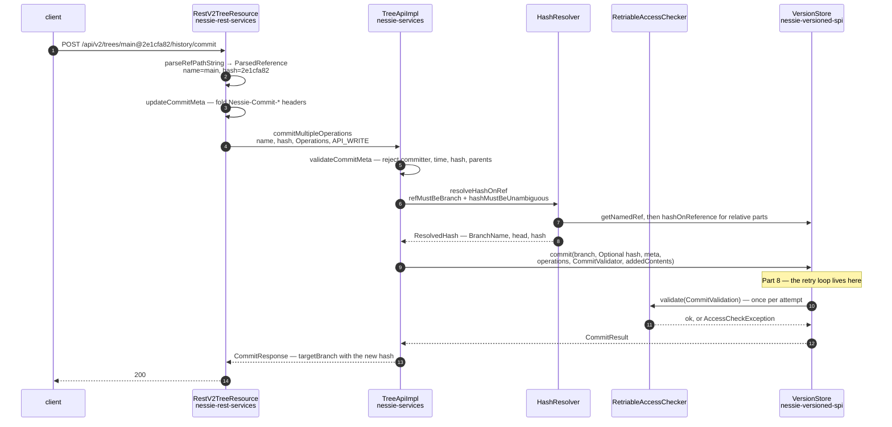

# Chapter 7.4 — From HTTP to the `VersionStore`

<div class="chapter-meta" markdown>
**The question this chapter answers:** what happens between `POST /api/v2/trees/main@2e1cfa82/history/commit` arriving on the wire and `VersionStore.commit(...)` being called — and what has already been decided by then?

**Prerequisites:** Chapter 7.3 (the `{ref}` path grammar and the commit endpoint), Chapter 7.2 (`Operations`, `ContentKey`), Chapter 7.1 (why these three classes live in three different modules)

**Source covered:** `servers/rest-services/.../RestV2TreeResource.java`, `servers/services/.../impl/TreeApiImpl.java`, `.../hash/HashResolver.java`, `versioned/spi/.../VersionStore.java`
</div>

## 1. The problem

Chapter 7.3 left you with a URL and a JSON body. Part 8 will start at `VersionStoreImpl.commit`. This chapter is the bridge, and it is the chapter that makes the rest of Parts 7–9 navigable: once you can follow one request from the socket to the storage interface, every other endpoint is the same walk with different nouns.

There are exactly three layers, and each has one job:

1. **`RestV2TreeResource`** — string work. Parse the `{ref}` path element, fold HTTP headers into the commit metadata, delegate. It is handed a `VersionStore` and never calls it.
2. **`TreeApiImpl`** — semantic work. Reject client-supplied server fields, resolve the expected hash against the real reference, package authorization, translate exceptions.
3. **`VersionStore`** — the interface. Six arguments, two of which are callbacks.

That last detail is the one worth arriving for. Authorization in Nessie is not a gate the request passes through on the way down. It is an argument handed *into* the commit and invoked from inside the storage engine's retry loop. Understanding why is understanding how Nessie reconciles optimistic concurrency with access control.

## 2. The trace



Steps 1–4 are Section 3. Steps 5–8 are Section 4. Steps 9–12 are Sections 5 and 6. The dashed return from step 11 back up is Section 7.

## 3. Step one: the resource does string work



Thirteen lines — the `@JsonView(Views.V2.class)` at `:448` counts — and nothing in them is about committing.

`parseRefPathString(branch)` is `ReferenceResolver.resolveReferencePathElement` from Chapter 7.3, with the default-branch supplier wired in. `commitMeta(...)` rebuilds the request's `CommitMeta` through `RestCommon.updateCommitMeta`. `tree()` returns a `TreeService`. `API_WRITE` is a `RequestMeta` constant meaning "run the write-flavoured access checks".

The resource is also where the API version is stamped. Its constructor — the one CDI actually uses — builds the service objects by hand:



Four plain Java objects, constructed with `new`, holding the injected `VersionStore`. `NESSIE_V2` is `ApiContext.apiContext("Nessie", 2)` — a `@Value.Immutable` interface with two accessors, `getApiName()` and `getApiVersion()`, realised as the generated `ImmutableApiContext`. It travels with every access check so the authorization layer knows which front door a request came through. Chapter 7.5 builds two of these same four services with a different constant.

The header merge is worth a look, because it is a piece of the commit that never appears in the request body:



`Nessie-Commit-Message`, `Nessie-Commit-Authors`, `Nessie-Commit-SignedOffBy` and any `Nessie-Commit-Property-*` header are folded into the `CommitMeta` builder. Authors and sign-offs split on commas; the message takes the first non-blank value. This exists for clients that cannot easily control the body — the Iceberg REST Catalog of Chapter 7.5 is the main one, since Iceberg's protocol has no field for a commit message.

## 4. Step two: the service layer rejects, resolves, delegates



Read it in four beats.

**Beat 1 — refuse what the client must not set.**



Four `checkArgument` calls, each with the same explanation: *"It is set by the server."* Committer, commit time, commit hash and parent hashes are facts the server establishes; accepting them from a client would let anyone forge history. The failure is an `IllegalArgumentException`, which the JAX-RS layer turns into a 400.

**Beat 2 — resolve the reference.** `getHashResolver().resolveHashOnRef(branch, expectedHash, validator)` turns `("main", "2e1cfa82")` into a `ResolvedHash`. Section 5 opens that up.

**Beat 3 — rewrite the metadata.** `commitMetaUpdate(null, numCommits -> null).rewriteSingle(commitMeta)` runs the validated metadata through a `DefaultMetadataRewriter` constructed with the current principal and `Instant.now()` — which is how the fields `validateCommitMeta` just refused get filled in, from the server's own state.

**Beat 4 — call the store, and translate what comes back.** Two catch blocks, and they are the entire mapping from storage vocabulary to HTTP vocabulary:

```java
} catch (ReferenceNotFoundException e) {
  throw new NessieReferenceNotFoundException(e.getMessage(), e);
} catch (ReferenceConflictException e) {
  throw new NessieReferenceConflictException(e.getReferenceConflicts(), e.getMessage(), e);
}
```

404 and 409. Note that `getReferenceConflicts()` is carried across — the structured conflict details from Part 8 reach the client rather than being flattened into a message string.

The `BiConsumer` in the argument list is easy to miss: `(key, cid) -> commitResponse.addAddedContents(addedContent(key, cid))`. New content objects get their content-ids assigned during the commit (Chapter 7.2), and this callback is how they get back into the response.

## 5. Resolving the expected hash



`ParsedHash.parse` splits `"2e1cfa82~2^1"` into an absolute part and a list of `RelativeCommitSpec`s — the split Chapter 7.3 said the API layer deliberately does not do.

Then `validator.validate(ref, parsed)`. The commit path passes this:

```java
ResolvedHash toRef =
    getHashResolver()
        .resolveHashOnRef(
            branch,
            expectedHash,
            new HashValidator("Reference to commit into", "Expected hash")
                .refMustBeBranch()
                .hashMustBeUnambiguous());
```

Two rules that exist nowhere in the API annotations. `refMustBeBranch()` fails a commit onto a tag with *"Reference to commit into must be a branch."* `hashMustBeUnambiguous()` requires the parsed hash to have an absolute part, and its javadoc says why: *"A hash is unambiguous if it is present and starts with an absolute part, because it will always resolve to the same hash, even if it also has relative parts."* `main@~1` is a perfectly good *read* reference and an unacceptable expected-hash, because an expected-hash whose meaning drifts is not an expected-hash at all.

Finally, if there are relative parts, they are resolved by asking the store — and the comment explains a choice that looks wrong at first glance:

```java
// Resolve the hash against DETACHED because we are only interested in
// resolving the hash, not checking if it is on the branch. This will
// be done later on.
resolved = store.hashOnReference(DetachedRef.INSTANCE, Optional.of(resolved), relativeParts);
```

Walking back two commits from `2e1cfa82` does not require knowing which branch you are on. Reachability *does* matter — but it is checked during the commit itself, against the branch as it exists at that moment, and doing it here as well would pay for a second traversal to answer a question that could go stale before the commit runs.

## 6. Step three: the boundary



Six arguments — `branch`, `referenceHash`, `metadata`, `operations`, and two callbacks — and the javadoc states the concurrency contract in one sentence:

> *"If `referenceHash` is not empty, for each key referenced by one of the operations, the current key's value is compared with the stored value for referenceHash's tree, and `ReferenceConflictException` is thrown if values are not matching."*

Compare that with Iceberg. `SnapshotProducer` in Chapter 3.3 validates the *whole table* against freshly refreshed metadata and swaps a single pointer; a losing writer retries the entire `apply()`. Nessie's contract is per-key: two commits touching disjoint keys on the same branch do not conflict, even though they both move the branch HEAD. That is what makes a Nessie branch usable as a shared workspace rather than a serialization point, and Part 9 is built on it.

The convenience overload at the end of that excerpt fills the last two with no-ops —
`commit(branch, referenceHash, metadata, operations, x -> {}, (k, c) -> {})`. Which tells you those two are genuinely optional, and that the real commit path chooses not to use the no-op version.

This is where Part 7 stops. `VersionStoreImpl`, the `Persist` layer, the object model and the compare-and-swap that implements the retry are Part 8.

## 7. Authorization runs inside the retry loop



The comment above the method is the design rationale, and it is the most important paragraph in the chapter:

> *"Commits routinely run retries due to collisions on updating the HEAD of the branch. Authorization is not dependent on the commit history, only on the collection of access checks, which reflect the current commit. On retries, the commit data relevant to access checks almost never changes. Therefore, we use `RetriableAccessChecker` to avoid re-validating access checks (which could be a time-consuming operation) on subsequent retries, unless authorization input data changes."*

Unpack the two halves.

**Why the check must be inside the loop.** The `CommitValidation` handed to the lambda contains `IdentifiedContentKey`s and a `CommitOperationType` of `CREATE`, `UPDATE` or `DELETE` per operation. Those are not knowable from the request body alone: whether `Put(sales.orders, …)` is a create or an update depends on what is at that key *in the tree the commit is actually being applied to*. Under contention the storage engine may retry against a different tree, and the operation can change classification. A check run before the commit would be checking the wrong thing.

**Why it is memoised.** Authorization can be expensive — Nessie's default `Authorizer` evaluates CEL expressions per check. `RetriableAccessChecker.newAttempt()` returns a `BatchAccessChecker` whose `check()` compares the accumulated list of `Check` objects against the previous attempt's list and returns the cached result if they are equal. So an uncontended commit pays once, a contended one pays once more only if the classification actually changed.

The mapping itself is a three-way switch onto three distinct permissions:

```java
case CREATE -> check.canCreateEntity(branchName, op.identifiedKey(), keyActions);
case UPDATE -> check.canUpdateEntity(branchName, op.identifiedKey(), keyActions);
case DELETE -> check.canDeleteEntity(branchName, op.identifiedKey(), keyActions);
```

`keyActions` comes from the `RequestMeta` the resource passed in. For a plain Nessie commit it is empty. Chapter 7.5 shows the Iceberg catalog populating it with named catalog operations, so a policy can distinguish "renamed a table" from "updated a table" even though both arrive as a `Put`.

## 8. Gotchas

!!! warning "The server owns committer, commit time, hash and parents"
    `validateCommitMeta` rejects all four with HTTP 400. A client that reads a `LogEntry`, edits the message and posts the same `CommitMeta` back will be rejected — round-tripping commit metadata does not work, and the fix is to build a fresh `CommitMeta` with only the message, authors and properties set.

!!! warning "`AccessCheckException` can surface from inside the storage engine"
    Because the validator is invoked from within `VersionStore.commit`, an authorization failure unwinds through the storage layer rather than being thrown at the front. This is why `AccessCheckExceptionMapper` is registered separately in `nessie-rest-services`, and why an access failure on a commit can appear in a stack trace below frames you would expect to be unreachable.

!!! warning "You cannot commit onto a tag, or against a relative-only hash"
    Both rules live in `HashValidator`, not in the Bean Validation annotations, so they arrive as 400s from the service layer with prose messages rather than as constraint violations. `main@~1` is a valid read reference and an invalid expected-hash.

!!! note "The access-check cache is keyed on an ordered list"
    `RetriableAccessChecker` returns the previous result when the new `List<Check>` `.equals()` the validated one — order included. A policy whose outcome depends on anything other than that list (wall-clock time, an external service, a counter) will not be re-evaluated on a retry, because from the checker's point of view nothing changed.

## Key takeaways

- Three layers separate the socket from storage: the JAX-RS resource does string work, `TreeApiImpl` does semantic work, `VersionStore` is the boundary. Each lives in its own Gradle module, and the dependencies only point downward.
- The resource constructs its service objects by hand and stamps them with an `ApiContext` — `("Nessie", 2)` here — which travels with every access check.
- `validateCommitMeta` refuses client-supplied committer, commit time, commit hash and parent hashes; `DefaultMetadataRewriter` then fills them in from server state.
- `HashValidator` enforces two rules the API grammar cannot: commits target branches, and an expected hash must start with an absolute commit ID.
- Relative commit specs are resolved against `DETACHED` on purpose — reachability is the storage engine's job during the commit, not the resolver's beforehand.
- Authorization is passed *into* `VersionStore.commit` as a `CommitValidator` and invoked once per attempt, because whether an operation is a CREATE, UPDATE or DELETE depends on the tree the commit lands on. `RetriableAccessChecker` keeps that from costing a full re-evaluation on every retry.
- Nessie's conflict detection is per-key, not per-reference. Two commits touching disjoint keys on the same branch both succeed.

## Source map

| What | File |
| --- | --- |
| v2 tree resource | [`servers/rest-services/.../RestV2TreeResource.java`](https://github.com/projectnessie/nessie/blob/nessie-0.108.4/servers/rest-services/src/main/java/org/projectnessie/services/rest/RestV2TreeResource.java) |
| Header → commit meta | [`servers/rest-common/.../common/RestCommon.java`](https://github.com/projectnessie/nessie/blob/nessie-0.108.4/servers/rest-common/src/main/java/org/projectnessie/services/rest/common/RestCommon.java) |
| Exception mapping | [`AccessCheckExceptionMapper.java`](https://github.com/projectnessie/nessie/blob/nessie-0.108.4/servers/rest-services/src/main/java/org/projectnessie/services/rest/AccessCheckExceptionMapper.java), [`exceptions/NessieExceptionMapper.java`](https://github.com/projectnessie/nessie/blob/nessie-0.108.4/servers/rest-common/src/main/java/org/projectnessie/services/rest/exceptions/NessieExceptionMapper.java) |
| Service SPI | [`servers/services/.../spi/TreeService.java`](https://github.com/projectnessie/nessie/blob/nessie-0.108.4/servers/services/src/main/java/org/projectnessie/services/spi/TreeService.java), [`spi/ContentService.java`](https://github.com/projectnessie/nessie/blob/nessie-0.108.4/servers/services/src/main/java/org/projectnessie/services/spi/ContentService.java) |
| Service implementation | [`impl/TreeApiImpl.java`](https://github.com/projectnessie/nessie/blob/nessie-0.108.4/servers/services/src/main/java/org/projectnessie/services/impl/TreeApiImpl.java), [`impl/BaseApiImpl.java`](https://github.com/projectnessie/nessie/blob/nessie-0.108.4/servers/services/src/main/java/org/projectnessie/services/impl/BaseApiImpl.java), [`impl/ContentApiImpl.java`](https://github.com/projectnessie/nessie/blob/nessie-0.108.4/servers/services/src/main/java/org/projectnessie/services/impl/ContentApiImpl.java) |
| Hash resolution | [`hash/HashResolver.java`](https://github.com/projectnessie/nessie/blob/nessie-0.108.4/servers/services/src/main/java/org/projectnessie/services/hash/HashResolver.java), [`hash/HashValidator.java`](https://github.com/projectnessie/nessie/blob/nessie-0.108.4/servers/services/src/main/java/org/projectnessie/services/hash/HashValidator.java), [`hash/ParsedHash.java`](https://github.com/projectnessie/nessie/blob/nessie-0.108.4/servers/services/src/main/java/org/projectnessie/services/hash/ParsedHash.java) |
| Authorization | [`authz/RetriableAccessChecker.java`](https://github.com/projectnessie/nessie/blob/nessie-0.108.4/servers/services/src/main/java/org/projectnessie/services/authz/RetriableAccessChecker.java), [`authz/BatchAccessChecker.java`](https://github.com/projectnessie/nessie/blob/nessie-0.108.4/servers/services/src/main/java/org/projectnessie/services/authz/BatchAccessChecker.java), [`authz/ApiContext.java`](https://github.com/projectnessie/nessie/blob/nessie-0.108.4/servers/services/src/main/java/org/projectnessie/services/authz/ApiContext.java) |
| The boundary | [`versioned/spi/.../VersionStore.java`](https://github.com/projectnessie/nessie/blob/nessie-0.108.4/versioned/spi/src/main/java/org/projectnessie/versioned/VersionStore.java), [`CommitValidation.java`](https://github.com/projectnessie/nessie/blob/nessie-0.108.4/versioned/spi/src/main/java/org/projectnessie/versioned/CommitValidation.java), [`CommitResult.java`](https://github.com/projectnessie/nessie/blob/nessie-0.108.4/versioned/spi/src/main/java/org/projectnessie/versioned/CommitResult.java) |
| Metadata rewriting | [`DefaultMetadataRewriter.java`](https://github.com/projectnessie/nessie/blob/nessie-0.108.4/versioned/spi/src/main/java/org/projectnessie/versioned/DefaultMetadataRewriter.java) |

**Next:** Chapter 7.5 arrives at the same `TreeApiImpl` from an entirely different front door — the Iceberg REST Catalog protocol of Chapter 6.3, served by Nessie itself.
