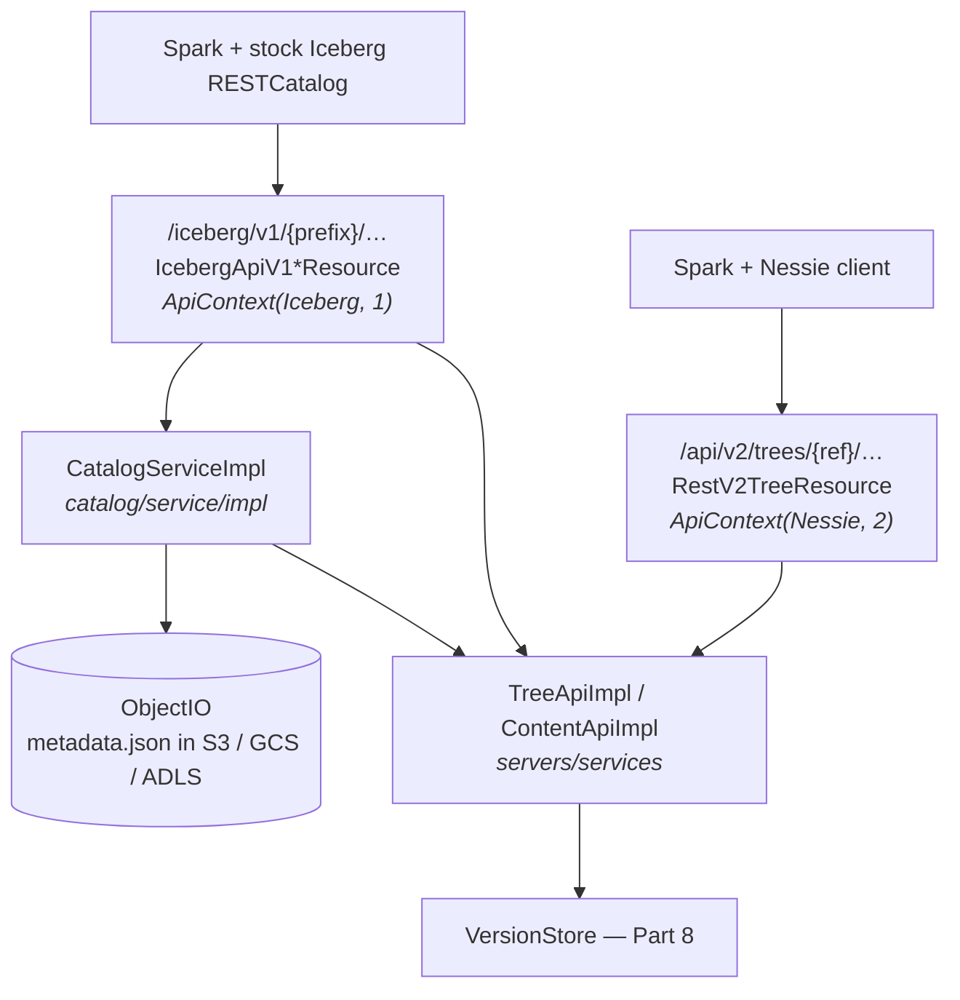

# Chapter 7.5 — Nessie as an Iceberg REST Catalog

**The question this chapter answers:** when Spark points a stock Iceberg `RESTCatalog` at a Nessie server, what serves `/iceberg/v1/{prefix}/…` — and how does one opaque `prefix` string carry a Git-style branch reference through a protocol that was designed without one?

**Prerequisites:** Chapter 6.3 (the REST catalog protocol, from the client side), Chapter 7.2 (`Content`, `Operation`, the rename protocol), Chapter 7.3 (the `{ref}` grammar), Chapter 7.4 (what `treeService.commitMultipleOperations` does next)

**Source covered:** `catalog/service/rest/.../IcebergApiV1TableResource.java`, `.../IcebergApiV1ResourceBase.java`, `.../IcebergConfigurer.java`, `catalog/service/impl/.../CatalogServiceImpl.java`

## 1. The problem

Chapter 6.3 built one half of a conversation. `RESTSessionCatalog` fetches `/v1/config`, then sends `MetadataUpdate` lists and `UpdateRequirement` assertions to `POST /v1/{prefix}/namespaces/{namespace}/tables/{table}`, and a server on the other end validates and commits. That protocol has fields for a namespace, a table, updates and requirements — and nothing at all for a branch.

Nessie's entire product is branches. So the two projects meet on an obstacle: a client that cannot express a reference, talking to a server whose data model is nothing but references.

There are two ways out. Fork the protocol and add a field, which costs you every stock client in the ecosystem. Or find somewhere in the existing protocol to put a reference, and get every stock client for free. Nessie takes the second route, and the place it puts the reference is `prefix` — the one path segment the Iceberg spec leaves for the server to define.

The second surprise is structural. This is not an adapter that translates Iceberg REST calls into Nessie REST calls. It is a *second front door onto the same service objects* Chapter 7.4 traced. A commit that arrives through the Iceberg protocol re-enters at exactly the layer that chapter ended at.

## 2. Two front doors, one service layer

The two edges into `SVC` are the point of the picture: the same class, constructed twice, differing only in the `ApiContext` stamped on it. The one edge with no counterpart on the Nessie side is `CS --> OIO`, and section 10 explains why the catalog stack needs object storage where Nessie's own API does not.

## 3. The endpoints are ordinary Iceberg REST



Nothing in this signature is Nessie-shaped. The class carries `@Path("iceberg")`, so the full path is `/iceberg/v1/{prefix}/namespaces/{namespace}/tables/{table}` — the spec's own path, with the spec's own `snapshots` query parameter and the spec's own `X-Iceberg-Access-Delegation` header for vended credentials.

The whole surface is here: `createTable`, `registerTable`, `updateTable` (a `POST` back to the table path, carrying the requirements-and-updates payload of Chapter 6.3), `dropTable`, `listTables`, `tableExists`, `reportMetrics`, the namespace and view resources, and `commitTransaction` on `/v1/{prefix}/transactions/commit`, which Chapter 10.2 opens up. Almost everything `RESTSessionCatalog` can send has a resource method waiting for it, and the gaps are deliberate and few: there is no `register-view` — `RESTSessionCatalog.registerView` posts to `.../namespaces/{namespace}/register-view`, and that string appears nowhere in the Nessie tree — the three server-side scan-planning paths are declared and then kept out of the advertised set under a bare `// NOT implemented`, and Nessie serves its own `/v1/{prefix}/s3-sign/{identifier}` in place of the spec's `.../tables/{table}/sign`. Chapter 10.3 reads that declared-and-declined list as a capability statement.

One line does all the Nessie-specific work: `decodeTableRef(prefix, namespace, table)`. Sections 5 and 7 are that one line.

Two things are worth noticing on the way past, because they mark where this stack differs from the Nessie resources of Chapter 7.4. The return type is `Uni<IcebergLoadTableResponse>` — reactive, because loading a table may mean fetching `metadata.json` from object storage — while `@Blocking` tells Quarkus to run the method on a worker thread anyway, since the version store access underneath it is not reactive. The catalog resources sit on the seam between the two models.

## 4. The structural punchline



Put this next to `RestV2TreeResource`'s constructor from Chapter 7.4. That one builds four services; this one builds two — but the `new TreeApiImpl(…)` and `new ContentApiImpl(…)` lines are identical except for the last argument. There, `NESSIE_V2 = apiContext("Nessie", 2)`. Here, `ICEBERG_V1 = apiContext("Iceberg", 1)`. Same classes, same injected `VersionStore`.

So everything Chapter 7.4 established still holds for a request that arrived over the Iceberg protocol. `validateCommitMeta` still rejects a client-supplied committer or parent hash. `HashValidator` still refuses a commit onto a tag. Authorization is still a `CommitValidator` invoked from inside the storage engine's retry loop. There is no second implementation of any of it, and therefore no second set of bugs.

What the `ApiContext` buys is discrimination without duplication. It travels with every access check, so a policy — or an audit record — can tell that a `Put` arrived through the Iceberg door rather than the Nessie one, while the code that produced the `Put` stays single.

## 5. The prefix carries the reference



Four steps, and only the last is obvious.

```mermaid
flowchart LR
    P0["path segment<br/><code>main%2Ffeature%7Cwarehouse1</code>"] --> P1["URL-decode<br/><code>main/feature&#124;warehouse1</code>"]
    P1 --> P2["replace(SEPARATOR, '/')<br/><i>a no-op on this input — it<br/>rescues a client that sent<br/>·US· in place of '/'</i>"]
    P2 --> P3["split on the first &#124;<br/><i>ref = main/feature</i><br/><i>warehouse = warehouse1</i>"]
    P3 --> P4["resolveReferencePathElement<br/><i>ParsedReference(main/feature)</i>"]
    P5["<code>-&#124;warehouse1</code>"] --> P6["'-' means the server's<br/>default branch"]
    P7["<code>main@2e1cfa82~1</code>"] --> P8["the Chapter 7.3 grammar,<br/>unchanged: name, hash,<br/>relative specs"]
```

`SEPARATOR` is ASCII 31, the unit separator, drawn as `·US·` in the diagram above, and it is not an arbitrary pick. It is exactly Iceberg's own multi-level namespace separator — `RESTUtil.NAMESPACE_SEPARATOR_AS_UNICODE` — which the same Nessie class uses in `decodeNamespace` to split `{namespace}` into levels. Accepting that byte inside `{prefix}` too lets a reference named `feature/x` cross a single URL path segment without being read as two.

Worth knowing that Nessie's own config response never produces it. Section 6's `IcebergConfigurer` builds the prefix with `java.net.URLEncoder.encode`, so a slash arrives as `%2F` and a `|` as `%7C`, and the `replace` is a no-op on anything Nessie itself handed out. The string `%1F` does not occur anywhere in the Nessie tree. The branch exists for clients and proxies that will not carry an encoded slash.

Then `|` splits reference from warehouse, `-` means "the server's default branch", and what is left goes to `ReferenceResolver.resolveReferencePathElement` — the same parser Chapter 7.3 covered. That is why `main@2e1cfa82~1` works inside a `prefix`: it is not a second syntax, it is the same grammar reached through a different path parameter.

## 6. The client never has to compose that string



This is what `GET /iceberg/v1/config` returns, and the load-bearing line is the `configDefault.accept(ICEBERG_PREFIX, encode(branch + "|" + …, UTF_8))` call, where `ICEBERG_PREFIX` is the string `"prefix"` (`IcebergConfigurer.java:71`). The server picks the reference, encodes it, and puts it in the `defaults` block of the config response. Note its sibling one branch up: when the client names no warehouse and the server has a default one, the prefix is just `encode(branch, UTF_8)`, with no `|warehouse` at all. Three fixed *overrides* follow: `nessie.is-nessie-catalog=true`; `nessie.prefix-pattern={ref}|{warehouse}`, which the comment beside it calls informational for now; and `nessie.default-branch.name`, which a Nessie-aware client can read directly.

Now cross back to the Iceberg side. `RESTSessionCatalog.initialize` does `Map<String, String> mergedProps = config.merge(props)` and builds its path helper from the result:



`properties.get(PREFIX)`. That value is then joined into every catalog path the client builds from then on — all of them except `config()` and `tokens()`, which are reached before a prefix is known:



That is the whole trick, and it deserves stating flatly. **A stock Iceberg client, with no Nessie-aware code in it, becomes branch-aware because the server answered one config request with a string.** The reference is chosen by the server, delivered as an ordinary configuration default, and substituted by the client into every subsequent URL without the client knowing what it means.

There is a second way to select it, visible in the generic resource: `getConfig` is mapped at both `/v1/config` and `{reference}/v1/config`. Point a client's URI at `https://host/iceberg/mybranch/` and the config response comes back with a `prefix` naming that branch.

## 7. A reference can also hide in the table name



`TableReference.parse(table)` applies Nessie's `name@ref#hashOrTimestamp` syntax to the *table identifier* — the string the engine lifted out of the SQL. If it carries a reference, that reference beats the one decoded from the prefix. If it carries a hash or a timestamp, that replaces the prefix's hash.

The precedence is therefore: table identifier, then prefix, then the server's default branch. In SQL, ``SELECT * FROM db.`sales@dev` `` reads `sales` on `dev` inside a session whose prefix says `main`, for that statement only. It is the mechanism behind ad-hoc time travel, and Gotcha 1 is what it costs.

## 8. Watch a mutation land



`POST /v1/{prefix}/tables/rename` becomes, literally, the rename protocol from Chapter 7.2: an `Operations` holding `Delete.of(from)` and `Put.of(to, existingFrom)`. The `Put` reuses the content object that was just fetched, which is how the content-id survives the rename — Nessie treats it as the same entity at a new key, not a new entity at a new key.

Two details connect it back to Chapter 7.4. The commit message is synthesised by the server (`"rename table db.a to db.b"`), because Iceberg's protocol has no field for one; this is the same gap that `RestCommon.updateCommitMeta` and the `Nessie-Commit-*` headers fill for clients that can set headers. And `RequestMeta.apiWrite().addKeyAction(..., CatalogOps.CATALOG_RENAME_ENTITY_FROM.name())` populates the `keyActions` that Chapter 7.4 showed arriving empty for a plain Nessie commit. A policy can now separate "renamed a table" from "updated a table", although both reach the version store as a `Put`.

The last statement is `treeService.commitMultipleOperations(...)`, and from there the trace is Chapter 7.4's, unchanged.

Not every write takes this route. `updateTable` builds an `IcebergCatalogOperation` carrying the client's `updates` and `requirements` — the Chapter 6.3 payload, kept intact — wraps it in a `CatalogCommit`, and hands that to `catalogService.commit`. Chapter 10.2 follows that path, because it is the one that generalises to several tables at once.

## 9. Errors have to be Iceberg's errors too

A drop-in catalog has to reproduce more than paths. Iceberg's REST client reconstructs exceptions from the `type` string in the error body, and both its own test suite and real engine code branch on the resulting exception class and, in places, on the message text. So the server has to speak that vocabulary:



This is a `Conflict` of type `KEY_EXISTS` — a per-key conflict raised by the version store, the structured detail Chapter 7.4 was careful to carry across — being turned into a `409` whose `type` is `AlreadyExistsException` and whose message is composed three different ways depending on whether the operation was a rename, a create, or a failed requirement check. The comment above it is honest about why: *"Produces different messages depending on the target type - just to get the tests passing :facepalm:"*.

`IcebergErrorMapper` does the same for the rest: `CONTENT_NOT_FOUND` becomes `404 NoSuchTableException` or `NoSuchViewException` depending on the `IcebergEntityKind` the resource passed in, `NAMESPACE_NOT_FOUND` becomes `404 NoSuchNamespaceException`, `REFERENCE_NOT_FOUND` becomes `400 NoSuchReferenceException`, and storage-side failures map to `429`, `401`, `403` or — for a missing object — `400`, on the reasoning that a bad location in Iceberg metadata is a client problem.

Compatibility with a protocol includes compatibility with its failures. That is the part a feature matrix never captures.

## 10. What the catalog stack adds



Two things stand out in the injection list. `treeService(ApiContext)` and `contentService(ApiContext)` are the same hand-built service objects again, now parameterised rather than fixed, because this layer is reached from more than one API context. And `ObjectIO` sits alongside `VersionStore`.

That second one is the real difference between the two front doors. Nessie's own model stores a *pointer*: an `IcebergTable` content object is a metadata location plus snapshot, schema, spec and sort-order IDs (Chapter 7.2), and a Nessie client is expected to read `metadata.json` for itself. Iceberg's `loadTable` response, by contrast, must contain the full table metadata document, and its `updateTable` request contains changes that only mean something once applied to that document. So this layer parses, applies and writes `metadata.json` on the server.

Everything else distinctive about this catalog follows. Because the server already resolves the table's data locations and already holds storage credentials, it can vend scoped credentials in the `loadTable` response and sign S3 requests at `IcebergApiV1S3SignResource`. A pointer-only catalog can do neither.

## 11. Gotchas

!!! warning "The reference can come from two places, and the table name wins"
    `fixupTableRef` parses the table identifier with `TableReference.parse`, whose grammar is `name ( '@' reference )? ( '#' hashOrTimestamp )?`. One identifier carrying an `@` — in a query, or buried in a view definition — overrides the session's branch for that statement. A job that "runs on `main`" can silently read `dev`, with nothing in its configuration to suggest it.

!!! warning "`|` and ASCII 31 are load-bearing characters in the prefix"
    `decodePrefix` replaces ASCII 31 with `/` and *then* splits on the first `|`, keeping everything after it as the warehouse. The split itself is safe: `|` is not legal in a Nessie reference name (`Validation.REF_NAME_RAW_REGEX`), so `main|ware|house` resolves to reference `main` and warehouse `ware|house`, and a malformed reference is rejected outright by `ReferenceResolver`. The ordering is what to watch. The same byte means "namespace level" in the `{namespace}` segment and "slash" in the `{prefix}` segment, and it is replaced *before* the split — so an ASCII 31 inside a warehouse name silently becomes a slash. And what `decodePrefix` will never complain about is an absent reference: an empty prefix, or the literal `-`, resolves to the server's default branch with no error at all.

!!! warning "Not every Iceberg REST endpoint is implemented"
    `POST /iceberg/v1/oauth/tokens` returns `501` with *"Endpoint not implemented: please configure the catalog client with the oauth2-server-uri property."* A client left on Iceberg's default OAuth flow fails at authentication, and the fix is client configuration, not server configuration. Chapter 10.3 reads Nessie's full declared endpoint set, including what it marks `// NOT implemented`.

!!! note "The audit trail knows which door you came through"
    `ApiContext("Iceberg", 1)` versus `ApiContext("Nessie", 2)` is threaded into every `BatchAccessChecker`, and the Iceberg resources additionally attach per-key `CatalogOps` actions — eight `CATALOG_*` values among them, `CREATE_ENTITY`, `UPDATE_ENTITY`, `DROP_ENTITY`, `RENAME_ENTITY_FROM` and `_TO`, `REGISTER_ENTITY`, `UPDATE_MULTIPLE`, `S3_SIGN`, alongside the `META_*` and `SNAP_*` groups. Authorization rules can be written against the operation a client attempted, not merely against the `Put` it produced.

!!! note "Commit messages are server-generated for Iceberg clients"
    Iceberg's requests carry no commit metadata, so the server writes it: a synthesised message per operation, plus whatever a client chose to send in `Nessie-Commit-*` headers. History produced by an Iceberg client is therefore uniform and machine-worded, which is worth knowing before reading a commit log for a table that two different kinds of client write to.

## Key takeaways

- Nessie's Iceberg REST catalog is not an adapter over Nessie's REST API. Its resources construct `TreeApiImpl` and `ContentApiImpl` directly, stamped `ApiContext("Iceberg", 1)`, and re-enter exactly where Chapter 7.4 ended.
- The Iceberg spec's `prefix` segment is the extension point the spec itself provides for multi-tenancy, and Nessie spends it on `{ref}|{warehouse}` — accepting ASCII 31 in place of `/` so a slash-containing branch name fits one path segment even where an encoded slash will not travel. A per-reference `/v1/config` path is the second way in.
- The client never composes that string. The server puts it in the `defaults` block of `/v1/config`; `RESTSessionCatalog` merges it and `ResourcePaths` substitutes it into every URL. A stock Iceberg client becomes branch-aware with no Nessie-aware code in it.
- A reference written into the table identifier overrides the prefix for one statement. The precedence is identifier, then prefix, then default branch.
- `renameTable` is the `Delete` + `Put` pair from Chapter 7.2 handed to `treeService.commitMultipleOperations`, with per-key `CatalogOps` actions attached so authorization can see the intent behind the operations.
- The catalog stack injects `ObjectIO` alongside `VersionStore` because Iceberg's protocol requires the full metadata document where Nessie stores only a pointer. Credential vending and S3 request signing are consequences of that one difference.

Part 7 is complete: two protocols, one service layer, one storage boundary. Both doors end at the same six-argument `VersionStore.commit`.

## Source map

| What | File |
| --- | --- |
| Iceberg REST resources | [`catalog/service/rest/.../IcebergApiV1TableResource.java`](https://github.com/projectnessie/nessie/blob/nessie-0.108.4/catalog/service/rest/src/main/java/org/projectnessie/catalog/service/rest/IcebergApiV1TableResource.java), [`IcebergApiV1NamespaceResource.java`](https://github.com/projectnessie/nessie/blob/nessie-0.108.4/catalog/service/rest/src/main/java/org/projectnessie/catalog/service/rest/IcebergApiV1NamespaceResource.java), [`IcebergApiV1ViewResource.java`](https://github.com/projectnessie/nessie/blob/nessie-0.108.4/catalog/service/rest/src/main/java/org/projectnessie/catalog/service/rest/IcebergApiV1ViewResource.java), [`IcebergApiV1GenericResource.java`](https://github.com/projectnessie/nessie/blob/nessie-0.108.4/catalog/service/rest/src/main/java/org/projectnessie/catalog/service/rest/IcebergApiV1GenericResource.java) |
| Shared decoding and service wiring | [`IcebergApiV1ResourceBase.java`](https://github.com/projectnessie/nessie/blob/nessie-0.108.4/catalog/service/rest/src/main/java/org/projectnessie/catalog/service/rest/IcebergApiV1ResourceBase.java), [`AbstractCatalogResource.java`](https://github.com/projectnessie/nessie/blob/nessie-0.108.4/catalog/service/rest/src/main/java/org/projectnessie/catalog/service/rest/AbstractCatalogResource.java) |
| Prefix and ref value types | [`DecodedPrefix.java`](https://github.com/projectnessie/nessie/blob/nessie-0.108.4/catalog/service/rest/src/main/java/org/projectnessie/catalog/service/rest/DecodedPrefix.java), [`TableRef.java`](https://github.com/projectnessie/nessie/blob/nessie-0.108.4/catalog/service/rest/src/main/java/org/projectnessie/catalog/service/rest/TableRef.java), [`NamespaceRef.java`](https://github.com/projectnessie/nessie/blob/nessie-0.108.4/catalog/service/rest/src/main/java/org/projectnessie/catalog/service/rest/NamespaceRef.java) |
| The config response | [`IcebergConfigurer.java`](https://github.com/projectnessie/nessie/blob/nessie-0.108.4/catalog/service/rest/src/main/java/org/projectnessie/catalog/service/rest/IcebergConfigurer.java) |
| Catalog service | [`catalog/service/impl/.../CatalogServiceImpl.java`](https://github.com/projectnessie/nessie/blob/nessie-0.108.4/catalog/service/impl/src/main/java/org/projectnessie/catalog/service/impl/CatalogServiceImpl.java) |
| The `name@ref#hash` syntax | [`api/model/.../TableReference.java`](https://github.com/projectnessie/nessie/blob/nessie-0.108.4/api/model/src/main/java/org/projectnessie/model/TableReference.java) |
| Client side, for the join (`RESTUtil` holds the namespace separator `decodePrefix` reuses) | [`core/.../rest/ResourcePaths.java`](https://github.com/apache/iceberg/blob/apache-iceberg-1.11.0/core/src/main/java/org/apache/iceberg/rest/ResourcePaths.java), [`core/.../rest/RESTSessionCatalog.java`](https://github.com/apache/iceberg/blob/apache-iceberg-1.11.0/core/src/main/java/org/apache/iceberg/rest/RESTSessionCatalog.java) |
| Errors in Iceberg's shape | [`IcebergErrorMapper.java`](https://github.com/projectnessie/nessie/blob/nessie-0.108.4/catalog/service/rest/src/main/java/org/projectnessie/catalog/service/rest/IcebergErrorMapper.java) |
| S3 request signing | [`IcebergApiV1S3SignResource.java`](https://github.com/projectnessie/nessie/blob/nessie-0.108.4/catalog/service/rest/src/main/java/org/projectnessie/catalog/service/rest/IcebergApiV1S3SignResource.java) |

**Next:** Part 8 goes through that boundary. Chapter 8.1 starts at the `Persist` SPI — the interface underneath `VersionStore`, where commits stop being objects and become rows.
