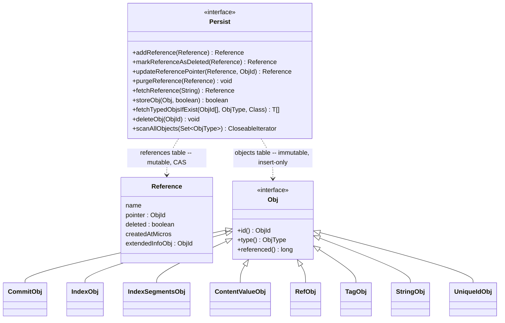
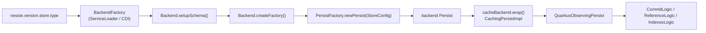

# Chapter 8.1 — The `Persist` SPI and the storage abstraction

**The question this chapter answers:** what is the complete list of things a database has to be able to do before Nessie can run on it, and why is that list so short?

**Prerequisites:** Chapter 7.2 (the data model: `Reference`, `Content`, `Operation`), Chapter 7.4 (from HTTP to the `VersionStore`)

**Source covered:** `versioned/storage/common/.../persist/Persist.java`, `.../persist/Obj.java`, `.../objtypes/StandardObjType.java`, `.../objtypes/ContentValueObj.java`

## 1. The problem

Nessie has to run on PostgreSQL, CockroachDB, MariaDB, DynamoDB, Cassandra, MongoDB, Bigtable, RocksDB — and in unit tests, on a `ConcurrentHashMap`. That list has almost nothing in common. No shared transaction model. No shared query language. No shared consistency guarantees. DynamoDB has a hard 400 KB item limit; PostgreSQL does not. Cassandra has no joins; RocksDB has no server at all.

So the storage interface cannot be designed by asking "what would be convenient?" It has to be designed by asking "what is the *intersection*?" — and then checking whether a version-controlled catalog can be built on top of that intersection.

The answer, which is the subject of this whole part, is: yes, but only if you demand one thing that not every key-value store offers. **Conditional writes.** Insert this row only if it does not exist. Update this row only if it currently holds exactly this value.

Everything else falls out. Nessie's old storage layer — the "database adapter" model — tracked mutable global state and, as its own README puts it, "is practically hard to use with many content keys". The rewrite starts from immutability instead:

> Each object has a unique ID, which is *always* derived from the hash over the object's content. This makes objects in the database "immutable", which allows caching objects without having to implement distributed cache coherency (so not opening that can of worms).

That single decision — content-addressed IDs — is what shrinks the requirement list to two tables and a handful of operations.

## 2. Two tables, one interface

Note what `Reference` is *not*: it is not an `Obj`. It lives in the other table, and it is the only mutable state in the system. Everything an `Obj` — every commit, every content value, every index segment — is written once and never modified.

That asymmetry is the whole architecture. Sections 3 and 4 take each half in turn.

## 3. The immutable half: objects

An `Obj` carries almost nothing:



An ID, a type, and a timestamp whose javadoc spends more words forbidding you to read it than describing it. That is deliberate — `referenced()` exists so repository cleanup can implement "delete this object only if nobody has touched it since I read it", and it is *not* consistent through a caching `Persist`. Section 5 returns to it.

The type is an open registry, but eight values are built in:



That is the entire storage vocabulary of Nessie on one screen. A commit (8.2), an index segment and a segment list (8.3), a reference record and a tag, a content value, a string blob, a unique-ID marker. The one-character `shortName` is what goes into the database column, because at a billion rows the difference between `"c"` and `"COMMIT"` is measurable.

### Where IDs come from

Every one of those types derives its own ID by hashing its own fields. `ContentValueObj` is the smallest example:



`objIdHasher(VALUE)` seeds a SHA-256 with the type name; each field is fed in; `generate()` is the primary key. Feed the same content ID, payload and bytes in again and you get the same 32 bytes out. `ObjIdHasherImpl` is a thin wrapper over Guava's `Hashing.sha256()`.

Three consequences follow, and they are load-bearing for the rest of Part 8:

-   **Writes are idempotent**

    Storing an object that already exists is a no-op, not an error. A retried commit rewrites byte-identical objects.

-   **Caching needs no coherency protocol**

    An object at ID *X* can never change. There is nothing to invalidate.

-   **Unreferenced objects are invisible**

    Until a pointer names them, they are indistinguishable from objects that were never written. This is what makes 8.4's single-CAS atomicity work.

### `storeObj` is a conditional insert



Read the return contract carefully: `true` if stored as a new record, `false` **if an object with the same ID already exists**. Not an exception. Not an overwrite. `false` is a normal, expected outcome, and chapter 8.2 shows the commit path treating it as such.

The `ignoreSoftSizeRestrictions` flag and the `ObjTooLargeException` distinguish two kinds of "too big". A *hard* limit is the database's own row or item limit — 400 KB on DynamoDB, and there is nothing to be done about it. A *soft* limit is Nessie's own configured threshold, and hitting it is not a failure but a signal: chapter 8.3 shows the commit path catching `ObjTooLargeException` and using it to trigger the key-index spill.

## 4. The mutable half: references

Here is where atomicity lives, and the interface says so four times:



Four operations, and every one of them is conditional:

| Operation | Precondition |
| --- | --- |
| `addReference` | no reference with this name exists |
| `markReferenceAsDeleted` | exists, not already deleted, and equal to the given `Reference` |
| `purgeReference` | exists, **is** marked deleted, and equal to the given `Reference` |
| `updateReferencePointer` | exists, not deleted, and equal to the given `Reference` |

Note that the precondition is never "the pointer is *X*". It is always **equal to `reference`** — the entire record, name, pointer, deleted flag, creation timestamp and extended-info pointer. Chapter 8.4 explains why that width matters, and chapter 8.5 shows what each backend does to evaluate it.

Note also what every one of these javadocs says: *"Do not use this function from service implementations, use `ReferenceLogic` instead."* `Persist` is the SPI a database implementer targets. `ReferenceLogic` is the API everything else calls, and the gap between them — reference-name indexing and crash recovery — is chapter 8.4's subject.

## 5. Everything else is a wrapper

`Persist` implementations compose. The Quarkus server assembles them in `PersistProvider.producePersist`: the backend's own `Persist` is wrapped by the object cache, and CDI wraps *that* in `QuarkusObservingPersist` for OpenTelemetry.

`BatchingPersist` is deliberately *not* in that chain. It is applied per operation, by the repository importer and by `BaseCommitHelper.dryRunPersist` — which builds one with `batchSize(-1)` so it never flushes. A write-discarding `Persist` is how Nessie implements "dry run". The SPI is small enough to be abused productively.

## 6. Gotchas

!!! warning "`referenced()` is for GC, and reading it anywhere else gives a wrong answer"
    The javadoc is unusually blunt: the value is generated exclusively by `Persist` implementations, must be `0` when storing, is *not* consistent when using a caching `Persist`, and "it is illegal to refer to and/or interpret this attribute from code that does not have to deal explicitly with this value". It exists for `deleteWithReferenced`, whose own javadoc adds that callers "must ensure that they read the uncached object state, for example via a `scanAllObjects`". Anything else reading `referenced()` through a cache is reading a stale number and will make a wrong deletion decision.

!!! warning "`fetchReference` and `fetchReferenceForUpdate` are not interchangeable"
    The first may be served from the reference cache; the second always goes to the backend. The javadoc says database-specific implementations must implement the former and must **not** implement the latter. Using the cached variant to obtain the expected value for a compare-and-swap means comparing against a value you may never have actually observed. Chapter 8.4 shows the commit path calling `fetchReferenceForUpdate` for exactly this reason — it is a correctness rule, not a performance tip.

!!! warning "`storeObjs` is a bulk write, not a transaction"
    *"In case an object failed to be stored, it is undefined whether other objects have been stored or not."* This is survivable only because objects are immutable and content-addressed: a partially written batch leaves unreferenced garbage that the next attempt rewrites identically. Take the same guarantee to the references table and the system breaks — which is precisely why references get their own conditional, one-row-at-a-time API.

!!! note "`scanAllObjects` and `erase` hold a live database resource"
    The javadoc warns that the returned iterator "can hold a reference to database resources, like a JDBC connection + statement + result set, or a RocksDB iterator", and that it must be closed in every case, "at best using a try-finally". Both methods may require a full table scan. They exist for maintenance; nothing on a request path may call them.

## Key takeaways

- `Persist` is the intersection of eleven backend modules, not their union: two tables, no transactions, no joins, no secondary indexes. The one thing it does demand is conditional writes.
- Every `Obj` derives its own ID by hashing its own fields with SHA-256, which makes objects immutable, makes writes idempotent, and makes caching coherency-free.
- `storeObj` returning `false` means "already present", not "failed" — the normal outcome when a commit is retried.
- All four reference operations are conditional, and their precondition is equality of the whole `Reference` record, not just its pointer.
- Objects are written first and are invisible until a reference points at them; that is what lets a multi-object commit become atomic through a single-row update.
- Caching, batching, validation and tracing are all `Persist` wrappers, which is why changing backend is a configuration change.

## Source map

| What | File |
| --- | --- |
| The SPI | [`versioned/storage/common/.../persist/Persist.java`](https://github.com/projectnessie/nessie/blob/nessie-0.108.4/versioned/storage/common/src/main/java/org/projectnessie/versioned/storage/common/persist/Persist.java) |
| Object contract | [`.../persist/Obj.java`](https://github.com/projectnessie/nessie/blob/nessie-0.108.4/versioned/storage/common/src/main/java/org/projectnessie/versioned/storage/common/persist/Obj.java) |
| Object identity | [`.../persist/ObjId.java`](https://github.com/projectnessie/nessie/blob/nessie-0.108.4/versioned/storage/common/src/main/java/org/projectnessie/versioned/storage/common/persist/ObjId.java), [`.../persist/ObjIdHasher.java`](https://github.com/projectnessie/nessie/blob/nessie-0.108.4/versioned/storage/common/src/main/java/org/projectnessie/versioned/storage/common/persist/ObjIdHasher.java) |
| The eight built-in types | [`.../objtypes/StandardObjType.java`](https://github.com/projectnessie/nessie/blob/nessie-0.108.4/versioned/storage/common/src/main/java/org/projectnessie/versioned/storage/common/objtypes/StandardObjType.java) |
| The mutable half | [`.../persist/Reference.java`](https://github.com/projectnessie/nessie/blob/nessie-0.108.4/versioned/storage/common/src/main/java/org/projectnessie/versioned/storage/common/persist/Reference.java) |
| Backend discovery | [`.../persist/PersistLoader.java`](https://github.com/projectnessie/nessie/blob/nessie-0.108.4/versioned/storage/common/src/main/java/org/projectnessie/versioned/storage/common/persist/PersistLoader.java), [`.../persist/Backend.java`](https://github.com/projectnessie/nessie/blob/nessie-0.108.4/versioned/storage/common/src/main/java/org/projectnessie/versioned/storage/common/persist/Backend.java) |
| Soft size limits | [`.../persist/ValidatingPersist.java`](https://github.com/projectnessie/nessie/blob/nessie-0.108.4/versioned/storage/common/src/main/java/org/projectnessie/versioned/storage/common/persist/ValidatingPersist.java) |
| Server wiring | [`servers/quarkus-common/.../storage/PersistProvider.java`](https://github.com/projectnessie/nessie/blob/nessie-0.108.4/servers/quarkus-common/src/main/java/org/projectnessie/quarkus/providers/storage/PersistProvider.java) |
| Upstream design notes | [`versioned/storage/README.md`](https://github.com/projectnessie/nessie/blob/nessie-0.108.4/versioned/storage/README.md) |

**Next:** Chapter 8.2 opens the most important `ObjType` — `CommitObj` — and asks why a commit stores a list of parent IDs rather than a single parent link.
