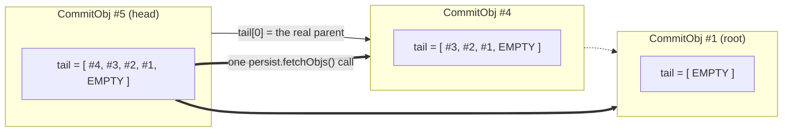
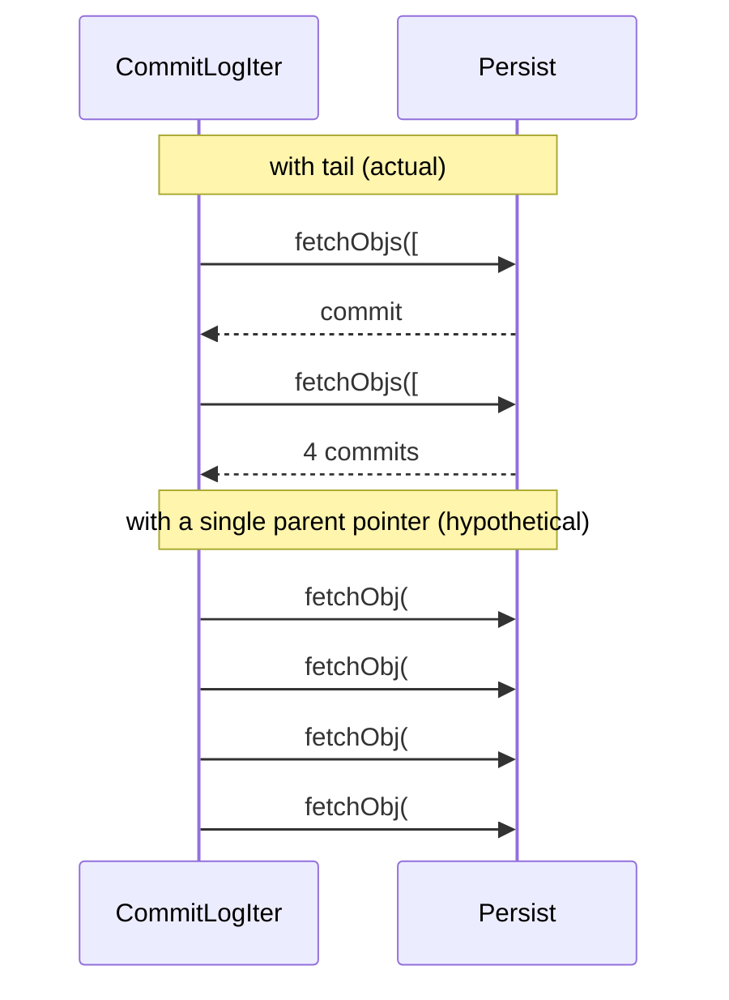

# Chapter 8.2 — `CommitObj` and the commit log DAG

<div class="chapter-meta" markdown>
**The question this chapter answers:** a `CommitObj` stores a *list* of parent IDs rather than a single parent link — what is in that list, and what problem does it solve that one pointer would not?

**Prerequisites:** Chapter 8.1 (`Persist`, `Obj`, content-addressed `ObjId`), Chapter 1.3 (`CommitObj` and `tail()`, stated once already at altitude)

**Source covered:** `versioned/storage/common/.../objtypes/CommitObj.java`, `.../logic/CommitLogicImpl.java`, `.../config/StoreConfig.java`
</div>

## 1. The problem

Start from the read pattern, not the write.

"Show me the commit log of `main`" is the query a Nessie UI issues on every page load, that `nessie-cli` issues on every `LOG` command, and that garbage collection issues over every reference in the repository. On a Git repository this is cheap: the objects are on local disk, and following a parent pointer costs a page fault.

On DynamoDB it costs a network round trip. On Cassandra it costs a coordinator hop plus a quorum read. A naive linked list of commits — each holding one parent ID — means **one round trip per commit displayed**. Fifty commits on a log page is fifty sequential round trips, each one unable to start until the previous finishes, because you cannot ask for a commit whose ID you have not yet learned.

That is the constraint the commit object is shaped around. Nessie's answer is to break the dependency chain by *denormalizing ancestry into every commit*: each commit carries not just its parent but its nearest twenty ancestors, so a reader can issue one bulk fetch for the next twenty and then repeat. The list is redundant — every entry after the first is derivable by walking — and that redundancy is the point.

## 2. What a commit holds



Six fields and one derived accessor, and the interesting field is `tail()`. Read its javadoc twice:

> Zero, one or more parent-entry hashes of this commit, the nearest parent first.
>
> This is an internal attribute used to more efficiently page through the commit log.
>
> **Only the first, the nearest parent, shall be exposed to clients.**

So `tail` is not a semantic field. It is a read cache with a specific shape, and the derived accessor above — `directParent()`, which returns `EMPTY_OBJ_ID` for an empty tail and element 0 otherwise — is how the rest of the codebase reads the part of it that carries meaning. Everything that wants "the parent of this commit" calls that; only the log iterator in section 4 touches the rest.

`secondaryParents` is the semantic one. It holds the merged-from commit of a merge, and it is what makes this a DAG rather than a list. Chapter 9.2 uses it; this chapter is about the other list.

The four index fields — `incrementalIndex`, `referenceIndex`, `referenceIndexStripes`, `incompleteIndex` — are deliberately omitted here. They are chapter 8.3, and they are the reason that chapter exists.

## 3. Building the tail



*(Drawn with `parents-per-commit = 5` so the boxes fit. The default is 20.)*

The maintenance is O(1) per commit, and it happens at the top of `buildCommitObj`:



Two statements do the work. `.addTail(parentCommitId)` puts the real parent at position 0. Then, if a parent exists, the loop copies the first `parentsPerCommit - 1` entries of the *parent's* tail behind it. A sliding window, shifted by one, on every commit. History is never walked to build it.

The size is a table-level knob, and upstream states the purpose in one sentence:



Twenty parents at 33 serialized bytes each is 660 bytes of overhead per commit. That is the price, paid on every write, to make reads twenty times cheaper in round trips.

## 4. Consuming the tail



The iterator is a two-level loop, and the shape repays attention:

**The outer level refills a batch.** `next` holds a list of IDs; `persist.fetchObjs(n.toArray(...))` fetches all of them in one call. Chapter 8.1's bulk-read method exists for exactly this.

**`EMPTY_OBJ_ID` truncates.** `int i = n.indexOf(EMPTY_OBJ_ID); if (i != -1) n = n.subList(0, i);` — the tail of an early commit is padded to nothing by the sentinel, and the iterator trims the batch there rather than asking the database for an ID that does not exist.

**The refill comes from the *last* commit of the batch.** `else if (!b.hasNext()) { next = c.tail(); }` — only when the current batch is exhausted does the iterator take a new tail. Take it from the first commit and the next batch would overlap the current one by nineteen entries; taking it from the last makes the windows abut exactly.

The cost, drawn against the alternative:



`commitIdLog` uses the same trick without the fetch: it walks `tail()` for free and only loads a commit when it needs the *next* window. Listing commit IDs on a branch is one object read per twenty IDs.

Both iterators also carry an `endCommitId`, and both stop on it the same way — when the commit just returned matches, the batch is emptied and `next` is set to `null`, so the following call ends the iteration. That is how a bounded log query terminates without knowing in advance how far apart its two hashes are. It also means an `endCommitId` that is not an ancestor of the start never fires at all: the walk simply runs to the root and stops on the `EMPTY_OBJ_ID` sentinel instead. The bound is a landmark to stop at, not a filter.

## 5. What is actually in the commit ID

`buildCommitObj` ends over 150 lines below where section 3 left it, with `return c.incrementalIndex(index.serialize()).id(hasher.generate()).build();`. Everything in between is a conflict check or a call into a hasher that was seeded ten lines into the snippet above, with three things:

```java
ObjIdHasher hasher =
    objIdHasher(COMMIT)
        .hash(parentCommitId)
        .hash(createCommit.message())
        .hash(createCommit.headers());
```

Each accepted operation then folds itself in. A `Remove` contributes `2`, its payload, its key and its content ID; an `Add` contributes `1`, its key, its payload, the value's bytes and its content ID. The leading `1` and `2` are discriminators, so that adding a key and removing it cannot hash to the same digest.

So the commit ID covers **parent, message, headers, adds and removes**. Not `seq`. Not `created`. Not `secondaryParents`. Not `tail[1..]`.

And not `unchanged` — which is worth stopping on, because an `Unchanged` is an operation the client sent and the commit accepted:



The loop resolves the key, checks it for conflicts, and never touches the hasher. That is the right call: an `Unchanged` is an assertion about the *parent*, not a change to the child, and two commits that differ only in what they asserted really do produce identical state. But it has a consequence. Those two commits are the same object, so if both are attempted the second is absorbed by section 6's collision path rather than stored — and the assertion the second client made is not recorded anywhere. `Unchanged` is enforced at commit time and forgotten immediately after.

Those omissions are the honest statement of what the tail is. Entry 0 is part of the commit's identity because it *is* `parentCommitId`; entries 1 through 19 are a denormalized cache that nothing verifies and nothing would notice was wrong. Section 7 returns to why that trade was worth making.

## 6. Storing a commit



`storeCommit` writes the commit and its value objects in one `storeObjs` call and then passes the commit's boolean to this method. Recall from 8.1 that `false` means "an object with this ID already exists".

Because the ID is a hash over parent, message, headers and operations, that is usually not a collision at all — it is *the same commit, written twice*. A client that retries its own request produces it. Nessie's own retry after an indeterminate backend result produces it. So instead of failing, `mitigateHashCollision` re-reads the stored object and compares it field by field.

The javadoc names the failure mode it is defending against: it "mitigates the risk of false-positive hash-collision errors in case the backend database runs into timeout situations with an undefined outcome". Chapter 8.4 shows where those timeouts come from.

One detail is easy to read past. The comparison rebuilds the candidate with the *stored* commit's `created` timestamp before calling `equals`. `created` is `@Value.Auxiliary` — excluded from `equals`/`hashCode` — precisely so that two attempts separated in time still compare equal.

## 7. Gotchas

!!! warning "The tail is a cache, and only its first entry is part of the commit's identity"
    `tail[1..]`, `secondaryParents` and `seq` are not hashed into the commit ID. Nothing in `CommitLogIter` re-validates that `tail[3]` really is the great-grandparent, and nothing in the ID would change if it were not. The same holds for the index fields, and that is what makes a V2 repository import possible: it writes each commit with the ID recorded in the export and marks it `incompleteIndex`, and a later pass fills in the real index structures — the only code in Nessie permitted to update a stored commit — without any of those IDs moving. The price of that freedom is that tail corruption is a silent-wrong-answer bug, not a detected one.

!!! warning "`seq` is per-branch, not global"
    It is assigned as `parent.seq() + 1`. Two sibling commits on two branches share a `seq`; a merge does not renumber anything. The javadoc's phrasing — "monotonically increasing counter representing the number of commits since the 'beginning of time'" — reads like a global clock and is the trap. Anyone using `seq` as a repository-wide ordering, watermark, or "newer than" predicate is wrong the moment a second branch exists.

!!! warning "'Hash collision detected' almost never means a hash collision"
    When you see it in a log, the overwhelmingly likely cause is a client that replayed an identical commit — same parent, same message, same headers, same operations — and therefore computed the same ID. `mitigateHashCollision` exists because the naive reading of `storeObj` returning `false` produces a scary and wrong error message.

!!! warning "`Unchanged` assertions are checked and then forgotten"
    An `Unchanged` operation is validated against the parent index like any other action, but it never reaches the hasher, so it does not appear in the commit ID. Two commits that make the same changes while asserting different things about other keys are therefore the same object. The first to be stored wins; the second is absorbed as a duplicate. Nothing in the stored commit records that the assertion was ever made, so `Unchanged` cannot be audited after the fact — it is a precondition, not a record.

!!! note "Identical commits made a day apart share an ID"
    Since `created` is not hashed and is excluded from equality, two commits with the same parent, message, headers and operations *are* the same object, whenever they were made. Anyone assuming a commit ID encodes a moment in time will be surprised.

## Key takeaways

- The commit graph is a DAG of content hashes, but reading it is latency-bound, so every commit denormalizes its nearest 20 ancestors into `tail`.
- The tail is maintained in O(1) per commit — parent ID, then the first 19 entries of the parent's tail — and consumed as one bulk fetch per 20 commits.
- Only `tail[0]` is the real parent and only `tail[0]` is hashed into the commit ID; the rest is an unverified read cache, by design.
- `secondaryParents` is the semantic multi-parent field and is what makes merges representable.
- `seq` counts commits along one lineage. It is not a repository-wide ordering.
- The commit ID covers parent, message, headers, adds and removes — and nothing else. `Unchanged` assertions are enforced but unhashed, so they leave no trace in the commit they guarded.
- Storing a commit that already exists is normal, not a collision; `mitigateHashCollision` re-reads and compares before it will say otherwise.

## Source map

| What | File |
| --- | --- |
| The commit object | [`versioned/storage/common/.../objtypes/CommitObj.java`](https://github.com/projectnessie/nessie/blob/nessie-0.108.4/versioned/storage/common/src/main/java/org/projectnessie/versioned/storage/common/objtypes/CommitObj.java) |
| Tail construction, log iteration, storing | [`.../logic/CommitLogicImpl.java`](https://github.com/projectnessie/nessie/blob/nessie-0.108.4/versioned/storage/common/src/main/java/org/projectnessie/versioned/storage/common/logic/CommitLogicImpl.java) |
| The documented commit-logic contract | [`.../logic/CommitLogic.java`](https://github.com/projectnessie/nessie/blob/nessie-0.108.4/versioned/storage/common/src/main/java/org/projectnessie/versioned/storage/common/logic/CommitLogic.java) |
| `parents-per-commit` and its default | [`.../config/StoreConfig.java`](https://github.com/projectnessie/nessie/blob/nessie-0.108.4/versioned/storage/common/src/main/java/org/projectnessie/versioned/storage/common/config/StoreConfig.java) |
| Headers and commit type | [`.../objtypes/CommitHeaders.java`](https://github.com/projectnessie/nessie/blob/nessie-0.108.4/versioned/storage/common/src/main/java/org/projectnessie/versioned/storage/common/objtypes/CommitHeaders.java), [`.../objtypes/CommitType.java`](https://github.com/projectnessie/nessie/blob/nessie-0.108.4/versioned/storage/common/src/main/java/org/projectnessie/versioned/storage/common/objtypes/CommitType.java) |
| Paging over the log | [`.../logic/CommitLogQuery.java`](https://github.com/projectnessie/nessie/blob/nessie-0.108.4/versioned/storage/common/src/main/java/org/projectnessie/versioned/storage/common/logic/CommitLogQuery.java), [`.../logic/PagingToken.java`](https://github.com/projectnessie/nessie/blob/nessie-0.108.4/versioned/storage/common/src/main/java/org/projectnessie/versioned/storage/common/logic/PagingToken.java) |

**Next:** Chapter 8.3 opens the four fields this chapter skipped, and answers the question that makes Nessie usable as a catalog: how a branch with a million keys answers a point lookup without reading a million-entry index.
