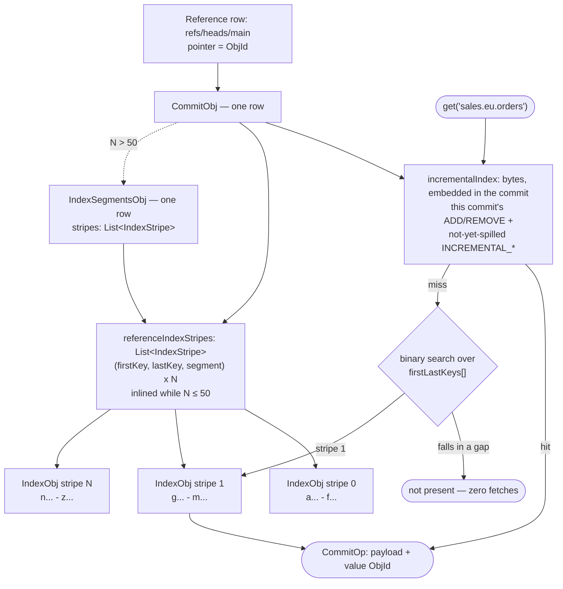
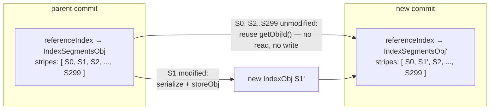

# Chapter 8.3 — Key indexes and index stripes: how large catalogs stay fast

**The question this chapter answers:** a branch holds a million tables and a commit changes one of them — how does Nessie answer "what is at key `sales.eu.orders` on `main`?" without reading a million-entry index, and without rewriting one on every commit?

**Prerequisites:** Chapter 8.1 (`Persist`, content-addressed `ObjId`, soft vs hard size limits), Chapter 8.2 (`CommitObj`)

**Source covered:** `versioned/storage/common/.../objtypes/CommitObj.java`, `.../objtypes/CommitOp.java`, `.../indexes/StripedIndexImpl.java`, `.../logic/IndexesLogicImpl.java`, `.../logic/CommitLogicImpl.java`

## 1. A million keys, one commit

Start with the requirement, because it is stricter than it looks. Given a branch, Nessie must answer *what content is at this key* without walking history. Not "walk back until you find the last commit that touched this key" — that is O(commits) and turns a cold key into a hundred round trips. Every commit must carry a complete view of every key that exists at that commit.

Now put a number on "complete view". The index stores one entry per key, and its serialized size is exact:



One byte of action, one var-int byte of payload, a serialized `ObjId` (33 bytes for a 32-byte hash), and 16 bytes of content UUID. **51 bytes per entry**, before the key itself. Keys are prefix-compressed against their predecessor, so call it 60 bytes for a realistic namespace-heavy key.

A million tables is therefore roughly **60 MB of index**. Two obvious designs both die on that number:

-   **Store only the diff per commit**

    Writes are tiny. But a lookup has to reconstruct state by walking backwards until it finds the key, so reading gets slower the longer the branch lives. It destroys the one thing a branch pointer was supposed to make cheap.

-   **Store the full index per commit**

    Lookups are one read. But every commit rewrites 60 MB to change one key, and no database will take a 60 MB row anyway.

Nessie takes both and layers them. And it works well enough that upstream's own load-test notes claim, flatly, that "commit performance is negligibly affected by a 'huge' amount of keys (30k and more) visible on commits". This chapter is *how*.

## 2. The shape of the answer

Two levels, and a lookup descends at most both of them. The **incremental index** lives inside the commit row and holds this commit's own operations plus whatever accumulated changes still fit. When it stops fitting, those accumulated changes are **spilled** into a **reference index**: a sorted list of `IndexStripe` records, each naming a first key, a last key, and the `ObjId` of an `IndexObj` row holding that key range.

The defaults that set the scale, all from `StoreConfig`: `max-incremental-index-size` 50 KiB, `max-serialized-index-size` 200 KiB, `max-reference-stripes-per-commit` 50. At ~60 bytes per entry that is about 850 keys before the first spill. Past it the arithmetic is a range rather than a number, because a stripe is *created* at half the segment limit and only split once it exceeds the whole limit (§6): a settled stripe holds roughly 1,700 to 3,400 keys, so the fiftieth stripe arrives somewhere between about 85,000 and 170,000 keys. Those two moments — first spill, and the stripe list outgrowing the commit row — are the only scale transitions in the whole design.

## 3. The four fields 8.2 skipped



Read them as a state machine on one commit:

- **`incrementalIndex`** is always present. Its javadoc names the tradeoff: combining "the incremental index update and the commit operations" in one structure is space-efficient, at the cost that "a new commit must reset the `Action`s from the previous commit to `NONE` before adding its own operations". Section 4 is that reset.
- **`referenceIndex`** stays `null` for far longer than its own javadoc suggests. Upstream glosses `null` as "the 'embedded' `incrementalIndex()` was never big enough, a 'reference index' does not exist and `incrementalIndex()` contains everything" — true before the first spill, and still true well after it. Section 6 shows why: a spill fills `referenceIndexStripes` and leaves this field alone until the stripe count passes `maxReferenceStripesPerCommit`. Reading `referenceIndex != null` as "this commit has spilled" is wrong for every repository below that ceiling, which in practice is most of them.
- **`referenceIndexStripes`** is where a spilled index actually lands. The rule is one sentence in the javadoc: "an external `INDEX_SEGMENTS` object will only be created, if the number of stripes is higher than `maxReferenceStripesPerCommit()`". Saving a round trip is worth 50 stripe records in the commit row; 51 is not.
- **`hasReferenceIndex()`** exists because of the previous two bullets. It is `referenceIndex() != null || !referenceIndexStripes().isEmpty()`, and it is the only honest way to ask the question. Every code path in this chapter that needs to know whether a lower layer exists calls it rather than testing a field.
- **`incompleteIndex`** is a marker that this commit's index holds only its own operations. It is not a state the commit path can produce — gotcha 2 says where it comes from.

Note the warning embedded in the `incrementalIndex` javadoc: databases with hard row-size limits "must have a mechanism to store this incremental index in an adjacent row using a row-key derived from `id()`". That is the abstraction admitting it has a physical dimension, and chapter 8.5 shows DynamoDB dealing with it.

## 4. Five actions, and why removes are tombstones

The two layers compose only because every index entry says *which layer it came from*:



`ADD` and `REMOVE` are this commit's operations — `currentCommit()` is true for exactly those two, which is how `commitOperations()` recovers "what did this commit change" from a structure that also holds inherited state. `INCREMENTAL_ADD` and `INCREMENTAL_REMOVE` are the same facts carried forward from earlier commits and not yet spilled. `NONE` is the placeholder used down in the reference index, where nothing is "new".

Every new commit demotes its parent's entries:



`ADD` becomes `INCREMENTAL_ADD` unconditionally. `REMOVE` is the interesting one — it becomes `INCREMENTAL_REMOVE` **only if `hasReferenceIndex()`**, and is otherwise deleted from the index outright, with the comment "purge old removes, if there is no reference-index that might contain those".

That is the entire reason `INCREMENTAL_REMOVE` exists. A remove is a tombstone, and a tombstone is only needed when a *lower layer* might still answer the query. With no reference index there is no lower layer, so the record of a deletion is itself deleted and stops consuming bytes in the commit row forever. With a reference index, the tombstone must survive in the upper layer until the spill can apply it to the segment below.

The third arm of the switch applies the same test to tombstones inherited from earlier commits: an existing `INCREMENTAL_REMOVE` is also dropped when `hasReferenceIndex()` is false, under the same comment. That case is reachable — §6 shows the reference index becoming `null` again when a commit deletes the last key in it — and without this arm a repository that emptied its reference index would carry its tombstones forever, protecting a layer that no longer exists.

## 5. The read path

The whole answer to this chapter's question is one method:



Resolve the reference to a head commit. `buildCompleteIndex(head, empty())` deserializes the embedded incremental index and, if the commit has a reference index, wraps the pair in a `LayeredIndexImpl` where the incremental layer wins. Then `loadIfNecessary(singleton(storeKey))` — and *that* is where the design pays off, because it takes a set of keys and fetches only the stripes those keys need. One key, at most one stripe.

Which stripe, if any:



`firstLastKeys` is a flat array `{first₀, last₀, first₁, last₁, …}` — every stripe boundary in key order, in memory, from the commit row. `binarySearch` returns an insertion point when the key is not itself a boundary, and the parity test is the trick: an **even** insertion point means the key sorts after some stripe's `lastKey` and before the next stripe's `firstKey`. It lies in a *gap between* stripes, so it is in no stripe, so `-1` — and `loadIfNecessary` fetches nothing at all.

Now count the reads, including the one the snippet ends with and most descriptions forget. Resolving the reference is one. Fetching the head commit is two — and that commit carries the incremental index and, usually, the stripe list, so both arrive for free. A third read happens only if the stripe list has outgrown the commit row: above 50 stripes it lives in an `IndexSegmentsObj` that `loadReferenceIndex` must fetch before any stripe. `loadIfNecessary` then fetches at most one stripe. Finally `contentMapping.fetchContent(...)` fetches the `ContentValueObj`, because the index stores a pointer to the value, never the value.

So a hit costs two reads on a branch that never spilled, four on one with stripes inline, and five past the 50-stripe transition. A miss stops before the value fetch, and when the key lands in a gap between stripes it stops before the stripe fetch too.

The exact number matters less than its shape: every term in that sum is a constant, and none of them is a function of how many keys the branch holds. That is the property the whole chapter is about, and it is worth stating as the sum that it is rather than as a rounder number that would not survive being checked. The layered index makes the first level authoritative for recent writes; the striped index stops the second level from ever being read whole.

## 6. The spill, and what triggers it

Nothing on the write path measures the index and decides to spill. The commit path optimistically writes the commit and finds out afterwards:



Fourteen lines are the entire policy that decides when a catalog graduates to an external index. `CommitLogicImpl.storeCommit` calls `persist.storeObjs(values + commit)`, catches `ObjTooLargeException`, and only then runs `indexTooBigStoreUpdate` to rebuild the commit with a reference index. The soft limit is a *signal*, not an error — which is what chapter 8.1 meant by distinguishing it from a database's hard row limit.

Where that rebuilt index lands is the rule §3 promised:



`referenceIndexId` is initialised to `null` and stays `null` on the first branch — the branch a spill normally takes. A single-stripe index takes it too, because `StoreIndexImpl.stripes()` returns `singletonList(this)`, so a one-stripe list is a list of size one and not a special case. Only when the stripe count exceeds `maxReferenceStripesPerCommit` does `persistStripedIndex` write an `IndexSegmentsObj` and put its ID in the field. The `null` in the third line of the method — `referenceIndex` itself being null — is the "someone deleted every key" case that §4's third arm depends on.

When a reference index already exists, the rebuild is this:



Four things happen, and the order matters:

**Prefetch only what is touched.** The first loop collects the keys whose action is *not* `currentCommit()` — the accumulated `INCREMENTAL_*` entries, the ones being pushed down — and calls `referenceIndex.loadIfNecessary(prefetch)`. Every other stripe stays unloaded. On a million-key branch this is the difference between reading 300 stripes and reading three.

**Split the layers.** The second loop walks the incremental index once. Entries belonging to this commit go into `newIncremental` and stay in the commit row. Everything else is pushed into the reference index: `action.exists()` entries are re-added with action `NONE` (the placeholder, because down here nothing is new), and the rest are `remove`d — the tombstone finally being applied and discarded.

**Split oversized stripes.** A stripe whose `estimatedSerializedSize()` exceeds `effectiveIndexSegmentSizeLimit()` is `divide(parts)`d into at least two, with `newSegmentSize = maxSize / 2` as the target so a freshly split stripe has room to grow. This is a B-tree node split, performed at commit time, one level deep.

**Drop emptied stripes.** `if (s.elementCount() > 0)` — a stripe whose keys were all deleted disappears from the list rather than persisting as an empty segment.

Everything the loop does is gated on `s.isMutable()`. A stripe becomes mutable only when `add` or `remove` was called on it; untouched stripes are passed through by reference, never deserialized, never inspected.

## 7. Why touching one key costs one stripe

The line that makes the picture true is three lines long:



`if (!indexSegment.isModified()) segId = indexSegment.getObjId();`

An unmodified stripe contributes its *existing* ID to the new commit's stripe list. Nothing is serialized, nothing is stored, and the `IndexObj` row that stripe names is now referenced by two commits — the parent's index and the child's. That is only safe because of chapter 8.1: the ID is the SHA-256 of the content, so an identical stripe *is* the same row, and an immutable row can be shared by every commit that has not changed it.

So the million-entry index is never rewritten. It is **shared**, one stripe at a time, in exactly the way a persistent tree shares its untouched subtrees. A commit that touches one key writes one new `IndexObj` and reuses 299 by ID. The stripe list it writes is 300 records — 300 × (firstKey + lastKey + 33 bytes) of pointers, not 60 MB of entries — and at 300 stripes that list is past the ceiling of §3, so it is a new `IndexSegmentsObj` rather than a field on the commit. Both rows are small; neither is the index.

### The wire format, and one rejected idea

Stripes are cheap to share because they are cheap to serialize. `StoreIndexImpl` keeps keys in exact binary order and encodes each one as a var-int "strip N trailing bytes from the previous key, then append these" — so `aaa.bbb.TableFoo` followed by `aaa.bbb.TableBarBaz` costs a `3` plus six bytes. There are no length prefixes anywhere, "to reduce the space required for serialization". Version 2 of the format adds an element count and lazy deserialization, so a key is materialized from the buffer only when something asks for it.

The class javadoc also records what was tried and *not* kept, which is rarer and more useful:

> Experiment with >80000 words (each at least 10 chars long) for key elements: compression (gzip) of a key-to-commit-entry index (32 byte hashes) with interleaved key and value saves about 15% … so it is not worth the extra complexity.

A second entry rejects compression again on a different measure — the saving "might save one (or two) row reads of a bulk read", and "the savings do not feel worth the extra complexity". Two independent arguments, recorded separately, reaching the same answer.

## 8. Gotchas

!!! warning "The spill is triggered by an exception, and the values are already written when it fires"
    `storeCommit` writes value objects and the commit in one `storeObjs` call. If that throws `ObjTooLargeException`, the `catch` block re-stores only the *additional* objects and then the rebuilt commit — because it cannot know how much of the first batch landed (8.1: a failed `storeObjs` leaves an undefined subset stored). The deeper consequence is for backend implementers: a `Persist` that does not implement `ValidatingPersist`'s soft limits does not get slightly larger commits, it gets commits that grow until they hit the database's *hard* row limit and then fail with no fallback path at all.

!!! warning "`incompleteIndex` is a poison pill, and it exists because of imports"
    A V2 repository import writes commits whose indexes hold only that commit's own operations, because building complete indexes during import would mean replaying history. Both `buildCompleteIndex` and `incrementalIndexForUpdate` open with `checkArgument(!commit.incompleteIndex(), …)` — a hard error on any production path. Upstream explains the choice: handling incomplete commits everywhere "complicates the code base a lot and ensuring correctness for all possible code paths is very hard", so instead a post-import pass fixes them up, and that pass is "the only code that is allowed to actually *update* a (commit) object in the database".

!!! warning "`elementCount()` and `asKeyList()` are traps on striped and layered indexes"
    The javadoc says it outright: "do not use this method in production code against lazy or striped or layered indexes, because it will trigger index load operations". `LayeredIndexImpl.elementCount()` literally iterates the merged index and counts. On a million-key branch that fetches every stripe — the exact thing the whole chapter is about avoiding — to produce a number.

!!! warning "Stripe boundaries are keys, so key distribution decides stripe utilisation"
    Stripes split where the *serialized size* crosses the threshold, in key order. A workload that creates all its new tables under one namespace prefix splits the same stripe repeatedly while the rest stay cold, and there is no merge-back: at this tag the README's TODO list still carries "CommitLogic: have some logic here that detects 'too tiny' reference index segments to combine segments."

!!! note "Keys are case-sensitive and cannot be made otherwise"
    The README answers the obvious feature request directly: lower- or upper-casing keys would lose the original case and break catalogs that rely on case-sensitive keys, and "making keys case-insensitive while preserving the original key value does not work with the store index structure" — because the structure's entire efficiency comes from keys being in exact binary order.

## Key takeaways

- Every commit carries a complete view of every key, so a point lookup never walks history: reference, commit, at most one `IndexSegmentsObj`, at most one stripe, then the value object — a sum of constants at any catalog size.
- The index is two layers — an incremental index embedded in the commit row, and a reference index of separately stored, sorted stripes — joined by a layered view in which the incremental layer wins.
- `Action` distinguishes this commit's operations from carried-forward ones; `INCREMENTAL_REMOVE` is a tombstone that exists only while a lower layer could still answer, and is purged the moment it cannot.
- Spilling is exception-driven: `ValidatingPersist` throws `ObjTooLargeException` past 50 KiB of incremental index, and the commit is rebuilt with a reference index.
- A commit that touches one key re-serializes one stripe and reuses every other stripe by `ObjId`. Content addressing is what makes sharing an unchanged 60 MB index free.
- There are exactly two scale transitions: incremental index over 50 KiB spills to stripes; more than 50 stripes moves the stripe list out of the commit into an `IndexSegmentsObj`. `referenceIndex()` is still `null` between them, which is why `hasReferenceIndex()` tests two fields.

## Source map

| What | File |
| --- | --- |
| The index fields on a commit | [`versioned/storage/common/.../objtypes/CommitObj.java`](https://github.com/projectnessie/nessie/blob/nessie-0.108.4/versioned/storage/common/src/main/java/org/projectnessie/versioned/storage/common/objtypes/CommitObj.java) |
| The action model and entry serializer | [`.../objtypes/CommitOp.java`](https://github.com/projectnessie/nessie/blob/nessie-0.108.4/versioned/storage/common/src/main/java/org/projectnessie/versioned/storage/common/objtypes/CommitOp.java) |
| Index factories and what each implementation is for | [`.../indexes/StoreIndexes.java`](https://github.com/projectnessie/nessie/blob/nessie-0.108.4/versioned/storage/common/src/main/java/org/projectnessie/versioned/storage/common/indexes/StoreIndexes.java) |
| Serialization, prefix compression, lazy elements | [`.../indexes/StoreIndexImpl.java`](https://github.com/projectnessie/nessie/blob/nessie-0.108.4/versioned/storage/common/src/main/java/org/projectnessie/versioned/storage/common/indexes/StoreIndexImpl.java) |
| Stripe selection and bulk loading | [`.../indexes/StripedIndexImpl.java`](https://github.com/projectnessie/nessie/blob/nessie-0.108.4/versioned/storage/common/src/main/java/org/projectnessie/versioned/storage/common/indexes/StripedIndexImpl.java) |
| Reference-over-incremental view | [`.../indexes/LayeredIndexImpl.java`](https://github.com/projectnessie/nessie/blob/nessie-0.108.4/versioned/storage/common/src/main/java/org/projectnessie/versioned/storage/common/indexes/LayeredIndexImpl.java), [`.../indexes/LazyIndexImpl.java`](https://github.com/projectnessie/nessie/blob/nessie-0.108.4/versioned/storage/common/src/main/java/org/projectnessie/versioned/storage/common/indexes/LazyIndexImpl.java) |
| Stripe and segment objects | [`.../objtypes/IndexStripe.java`](https://github.com/projectnessie/nessie/blob/nessie-0.108.4/versioned/storage/common/src/main/java/org/projectnessie/versioned/storage/common/objtypes/IndexStripe.java), [`.../objtypes/IndexObj.java`](https://github.com/projectnessie/nessie/blob/nessie-0.108.4/versioned/storage/common/src/main/java/org/projectnessie/versioned/storage/common/objtypes/IndexObj.java), [`.../objtypes/IndexSegmentsObj.java`](https://github.com/projectnessie/nessie/blob/nessie-0.108.4/versioned/storage/common/src/main/java/org/projectnessie/versioned/storage/common/objtypes/IndexSegmentsObj.java) |
| Building, spilling and persisting indexes | [`.../logic/IndexesLogicImpl.java`](https://github.com/projectnessie/nessie/blob/nessie-0.108.4/versioned/storage/common/src/main/java/org/projectnessie/versioned/storage/common/logic/IndexesLogicImpl.java), [`.../logic/CommitLogicImpl.java`](https://github.com/projectnessie/nessie/blob/nessie-0.108.4/versioned/storage/common/src/main/java/org/projectnessie/versioned/storage/common/logic/CommitLogicImpl.java) |
| Size limits and their defaults | [`.../config/StoreConfig.java`](https://github.com/projectnessie/nessie/blob/nessie-0.108.4/versioned/storage/common/src/main/java/org/projectnessie/versioned/storage/common/config/StoreConfig.java), [`.../persist/ValidatingPersist.java`](https://github.com/projectnessie/nessie/blob/nessie-0.108.4/versioned/storage/common/src/main/java/org/projectnessie/versioned/storage/common/persist/ValidatingPersist.java) |
| The read entry point | [`versioned/storage/store/.../versionstore/VersionStoreImpl.java`](https://github.com/projectnessie/nessie/blob/nessie-0.108.4/versioned/storage/store/src/main/java/org/projectnessie/versioned/storage/versionstore/VersionStoreImpl.java) |
| Upstream design notes on indexes | [`versioned/storage/README.md`](https://github.com/projectnessie/nessie/blob/nessie-0.108.4/versioned/storage/README.md) |

**Next:** Chapter 8.4 asks where the atomicity of all this actually lives — a commit writes a new commit row, new index stripes and new value objects, on a database with no transactions, and exactly one conditional update on one row makes them all visible at once.
