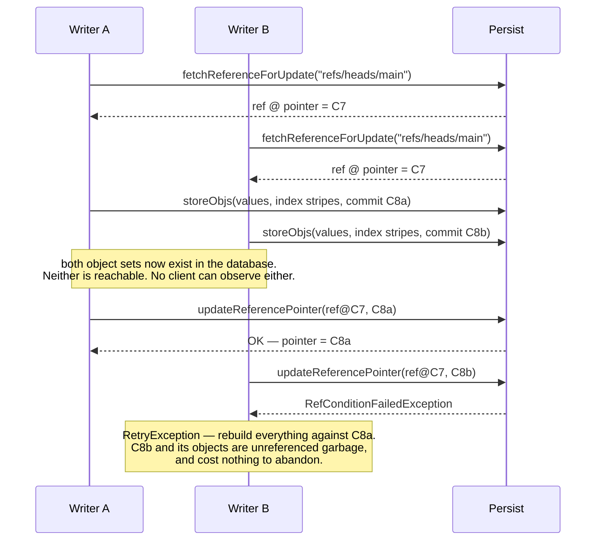
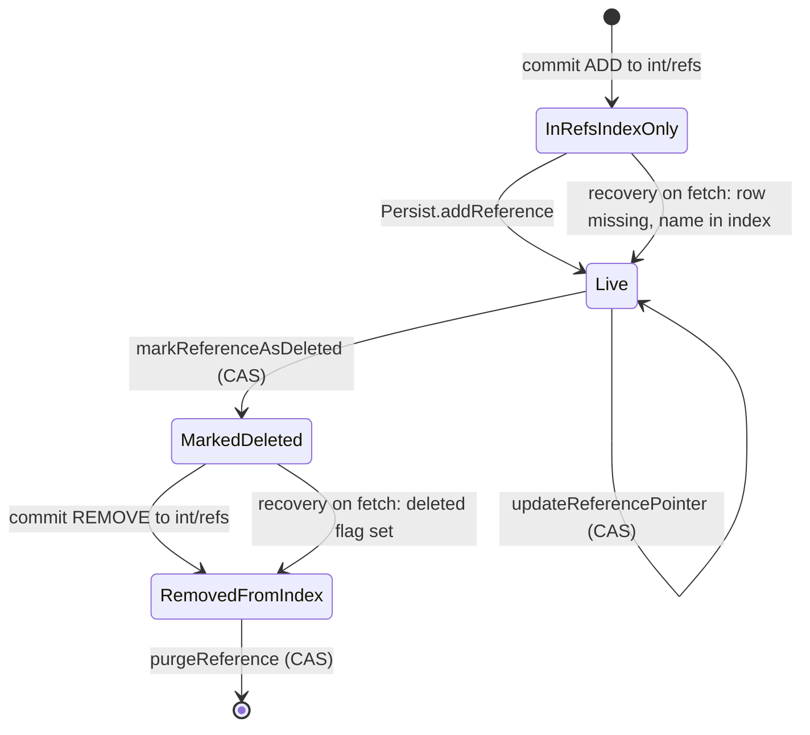

# Chapter 8.4 — References and CAS: where atomicity actually lands

**The question this chapter answers:** Nessie promises that a commit either happens completely or not at all, across an arbitrary number of rows written to a database with no transactions — where is that promise actually kept?

**Prerequisites:** Chapter 8.1 (the four conditional reference operations), Chapter 8.2 (content-addressed commit IDs), Chapter 8.3 (a commit also writes index stripes)

**Source covered:** `versioned/storage/common/.../persist/Persist.java`, `.../persist/Reference.java`, `.../logic/ReferenceLogicImpl.java`, `.../logic/CommitRetry.java`, `versioned/storage/store/.../versionstore/BaseCommitHelper.java`

## 1. The problem

Count the rows a single Nessie commit writes. One `ContentValueObj` per `Put`. Possibly a new `IndexObj` stripe, or several if a stripe split (8.3). Possibly an `IndexSegmentsObj`. And one `CommitObj`. Call it five to fifty rows, in a database that may be DynamoDB or Cassandra, where there is no transaction to wrap them in and no way to make them appear at the same instant.

The usual answer to this is a transaction. Nessie cannot have one, so it inverts the problem: instead of making N writes atomic, it makes them **irrelevant**.

Every object is content-addressed and immutable (8.1). Writing one is therefore not a state change — an object that nothing points at is indistinguishable from an object that was never written, because nothing can name it. It is not a partial commit, it is not a corrupt state, it is not even visible. It is garbage that a reader has no path to.

So all N writes happen first, unobserved. Then the entire observable state of a branch — everything a client can see, every key, every value, the whole history — changes when **one field in one row** changes. That field is `Reference.pointer()`, and the atomicity of the whole system is the atomicity of that one update.

That update is a **compare-and-swap** — the same primitive Chapter 1.2 found under an Iceberg commit and Chapter 3.4 found under `doCommit`, and the CAS this chapter's title names. The word is worth insisting on, because from here down the code and the backends speak of *conditional updates* instead (Chapter 8.5 reads five dialects of the phrase). They are the same operation, and the difference between Nessie and Iceberg is not the primitive. It is the **scope**: Iceberg swaps a pointer that names one table, Nessie swaps a pointer that names every key in the repository. One instruction, two very different blast radii.

## 2. The condition is the whole record



> Low-level, atomically updates the given reference's `pointer()` to the new value, **if and only if** the current persisted reference is not marked as `deleted()` and **equal to `reference`**.

Not "if the pointer is still X". Equal to the whole `Reference` you passed:



Name, pointer, deleted flag, creation timestamp, extended-info pointer. Five fields, and the CAS fails if any of them moved. Widening the condition beyond the pointer costs nothing on a single-row conditional update and buys a real guarantee: a concurrent *deletion* of the branch, or a re-creation of a branch with the same name at a different `createdAtMicros`, cannot slip past a check that only looked at the pointer. Chapter 8.5 shows what each backend does with that: four of them bind pointer, deleted flag, creation timestamp and extended-info as four separate predicates in their own dialect, and Bigtable sidesteps the question entirely by matching the whole serialized record in a single filter.

`previousPointers` is the one field deliberately left out, and the comment says why in one line: it is `@Value.Auxiliary` — excluded from `equals`/`hashCode` — "to avoid having separate `equals()` implementation that does not consider this attribute (esp. for in-memory and rocks-db backends)". A list that grows on every commit cannot be part of an equality condition that must hold across attempts.

`Persist`'s javadoc says not to call this from a service implementation — "use `ReferenceLogic` instead" — and `ReferenceLogic`'s version of it is a single delegation:



A guard that the caller is not touching an internal reference, then the CAS. Nothing else.

But the commit path does not go through it. `assignReference` has exactly one caller — `VersionStoreImpl.assign` — while commit, merge and transplant all reach `BaseCommitHelper.bumpReferencePointer`, which calls `persist.updateReferencePointer` directly, against the javadoc's advice.

That is not sloppiness, and the distinction is worth holding on to, because it is the shape of the whole chapter. `ReferenceLogic` exists to keep the reference-name index in `int/refs` consistent with the references table — a two-row problem, and the subject of section 7. *Advancing* a reference does not touch that index: upstream states it flatly in the class javadoc, "Updates to a named reference are **not** tracked in `REF_REFS`". So the commit path has nothing for `ReferenceLogic` to do, and calling one row's conditional update is the entire operation. `assignReference`'s one guard is the only thing `ReferenceLogic` adds, and the commit path enforces the same invariant by construction: it only ever holds a reference it resolved from a user-facing branch name.

## 3. Two writers, one row

Two things are worth stopping on. **All the expensive work is done before the serialization point** — validation, index maintenance, stripe serialization, value writes — and all of it is discarded for free when the CAS loses, because discarding it means simply not pointing at it. Nothing needs rolling back; there is nothing to roll back.

And **B's wasted objects are not even wasted twice**. Its retry against C8a re-derives the same value objects, whose IDs are hashes of the same content, so `storeObj` returns `false` and the write is a no-op (8.1). The cost of losing a race is one round trip per object plus the work of rebuilding the index — which is exactly what the upstream README means when it says the fix for contention was not fairness but making retries cheap.

## 4. The call site

Exactly one method on the commit path performs the swap:



Seventeen lines, three outcomes, three different meanings:

| Exception | What it means | What happens |
| --- | --- | --- |
| `RefConditionFailedException` | someone else won the race | `RetryException` — redo everything |
| `RefNotFoundException` | the reference no longer exists | `RuntimeException` — not a race, a bug |
| `UnknownOperationResultException` | the database timed out; nobody knows | re-read once and compare |

The third is the honest one, and the comment is unusually candid about the size of the hole it is patching:

> *If the above pointer-bump returned an "unknown result", we check once (and only once!) whether the reference-pointer-change succeeded. This mitigation may not always work, especially not in highly concurrent update situations.*

The check compares the freshly read reference against `reference.forNewPointer(newHead, persist.config())` — the exact row this attempt was trying to write. Match means the write landed. Anything else means retry.

Note *which* fetch it uses. `fetchReferenceForUpdate` bypasses the reference cache; `fetchReference` does not. Chapter 8.1 flagged this as a correctness rule and this is the reason: deciding "did my update land?" against a possibly-cached value is deciding against a state that may never have existed in the database.

The race this cannot cover is stated plainly by the comment. If a third writer advances the branch between the timed-out CAS and the re-read, the pointer differs even though this attempt's write may have succeeded — so Nessie retries, and the retry is safe only because a commit ID is a content hash (8.2). Re-storing the same commit is a no-op, not a duplicate. Chapter 9.1 covers the same method from the commit path's side; here the point is narrower: the indeterminate outcome is a property of the *storage layer*, and the mitigation is bounded by what a single re-read can prove.

## 5. The retry budget is time, not attempts



An unbounded `for` loop with exactly two `catch` clauses. `RetryException` — a lost CAS — and `UnknownOperationResultException`. Nothing else is retryable: a `CommitConflictException` from per-key validation propagates out immediately, because retrying a genuine key conflict would just produce the same conflict.

What stops the loop is `tls.retry(t1)` returning false, and the defaults in `StoreConfig` say what that means:

| Knob | Default |
| --- | --- |
| `commitTimeoutMillis` | 5,000 |
| `commitRetries` | `Integer.MAX_VALUE` |
| `retryInitialSleepMillisLower` / `Upper` | 5 / 25 |
| `retryMaxSleepMillis` | 250 |

The attempt count is effectively unbounded; the *clock* is the budget. Sleeps are randomised between the lower and upper bound — jitter, so that two writers who collided do not collide again on the same schedule — doubling toward 250 ms, and `sleepAndBackoff` clamps the result so it cannot overshoot `maxTime`.

One line in that method repays reading twice. The comment says "consider the already elapsed time of the last attempt" and the code writes `sleepMillis - NANOSECONDS.toMillis(attemptElapsed)`, which reads as a subtraction. But `attemptElapsed` was computed two lines earlier as `timeAttemptStarted - current` — the operands in the opposite order from `totalElapsed` on the line above it — so it is negative, and the minus sign *adds* the failed attempt's duration to the sleep. The effect is that a slow attempt backs off harder than a fast one, which is a defensible policy on a contended branch; it is simply not the policy the line appears to state.

Contrast Iceberg (chapter 3.3): `commit.retry.num-retries = 4`, a count. Iceberg gives up after four attempts because each attempt rewrites a manifest list and is genuinely expensive. Nessie gives up after five seconds because its attempts are cheap and the useful question is not "how many times did I lose" but "how long has this client been waiting".

## 6. What the winning update writes



Something else rides along on the CAS. Each advance prepends the *old* pointer to `previousPointers`, then copies forward as many of the existing entries as fit under two bounds: a count (`referencePreviousHeadCount`) and an age (`referencePreviousHeadTimeSpanSeconds`) — 20 entries within 5 minutes, by default. The loop `break`s on the first entry that is too old, which works because the list is maintained newest-first.

This is not part of the condition — recall `previousPointers` is excluded from `equals`. It is written *by* the winner, and it is a small, bounded, time-windowed audit trail: a client that lost a race, or that held a stale head, can ask where the branch recently was. It is also the value `bumpReferencePointer` reconstructs to test an unknown outcome, which is why the method has to be deterministic given the same config.

Note `.deleted(false)`. Advancing a reference asserts it is live.

## 7. When one CAS is not enough

Creating and deleting a reference cannot be a single conditional update, because two things must change: the reference row, and the *index of reference names* — which Nessie keeps as commits on an internal reference, `int/refs`, using exactly the commit and key-index machinery of 8.2 and 8.3. `Persist` offers no way to list references; `ReferenceLogic` builds that on top of its own storage model.

The class javadoc specifies both protocols, and specifies them as *orderings* rather than as transactions:



Create: commit the `ADD` to `int/refs` first, then `addReference`. Delete: `markReferenceAsDeleted` first, then commit the `REMOVE` to `int/refs`, then `purgeReference`. Every step is one conditional operation, and the orderings are chosen so that every intermediate state is *distinguishable from every other state by inspection*:

The recovery rules are the other half of the design:



A crash in the middle leaves a state that the *next reader* repairs. Row present and not deleted: done, return it. Row present with `deleted() == true`: a delete failed midway, so resume the delete. Row absent but the name is in `int/refs`: a create failed midway, so resume the create. That is the entire purpose of the `deleted` flag — it turns "crashed halfway through a two-step delete" from a corrupt state into a labelled, resumable one. Note also the requirement stated inside the protocol: implementations "must only commit, if the reference is not present, to allow the resume/recovery process", which is what makes replaying a half-finished create idempotent.

## 8. The consequence nobody can design around

A branch is one row. Two commits to the same branch are serialized by that row, no matter how many Nessie servers are running, because the serialization is done by the database and not by the servers. Different branches share nothing and are genuinely concurrent.

Upstream states the constraint that forces this, and it is a deliberate choice rather than an oversight:

> *Nessie (server) is and must stay stateless, which means that Nessie servers do not communicate with each other. There is no form of "distributed consensus" or the like, which would be expensive.*

The README's proposed mitigation is not a distributed lock but request routing: send commits for a branch to the same server, "as a best-effort approach of course", so the collisions are resolved in-process before they cost a database round trip. Nothing at this tag implements it.

The practical reading for anyone designing a catalog on Nessie: many short-lived branches are cheap and genuinely parallel; one hot `main` with hundreds of writers is a queue, and its throughput is bounded by how fast one row can be conditionally updated.

## 9. Gotchas

!!! warning "The expected value is the whole reference, not the pointer"
    A change to `createdAtMicros` or `extendedInfoObj` fails the condition just as a moved pointer does. Backend implementers must compare all of it — chapter 8.5 shows JDBC, Cassandra, DynamoDB and MongoDB binding four separate columns and Bigtable comparing the whole serialized value. A backend that compared only `pointer` would let a commit land on a branch that had been deleted and re-created underneath it.

!!! warning "`fetchReference` is cached and must not feed a CAS"
    Using the cached variant to obtain the expected value means comparing against a state you may never have observed in the database. Under a warm cache the update then fails forever, or lands against a base the caller never saw. `bumpReferencePointer` uses `fetchReferenceForUpdate` for its unknown-result check for exactly this reason. It is a correctness rule, not a performance tip.

!!! warning "Sustained contention produces a timeout, not a conflict"
    With `commitRetries` defaulting to `Integer.MAX_VALUE`, what ends the loop is five seconds of elapsed time, surfaced as `ReferenceRetryFailureException`. The client sees "timed out", which reads like a network problem and is actually a hot branch. Upstream's own "asymmetric operation counts" experiment describes the pathology: a writer committing ten keys per commit takes longer per attempt than one committing a single key, so under equal pressure the small writer wins systematically. Their answer was not fairness — it was making retries cheap enough that the loser still makes progress, and admitting that the problem "is not 100% solvable though, at least not without introducing a more coordinated 'commit-target-lease mechanism'".

!!! warning "`UnknownOperationResultException` is checked exactly once, on purpose"
    The comment says "once (and only once!)". Looping the re-check would not help: each re-read can be invalidated by another writer, and there is no number of reads that turns "I do not know whether my write landed" into knowledge. Nessie takes the safe branch — retry — and relies on content-addressed IDs to make a duplicated commit a no-op rather than a duplicate.

!!! note "Reference listing is a commit log, and it costs a commit"
    Because `Persist` has no listing capability, creating or deleting a branch commits to `int/refs`. Two branches created concurrently therefore contend on the *internal* reference exactly as two commits contend on a branch — creating thousands of branches in parallel is contention on one row, even though committing to those thousands of branches afterwards is not.

## Key takeaways

- The *contents* of a branch — every key, every value, the whole history — become visible through one conditional update on one row. Branch creation and deletion need more than one, and section 7 shows the shape of the generalisation: never a transaction, always a sequence of single-row conditional operations ordered so that every intermediate state is recognisable. Nessie never requires atomicity across two rows.
- Objects are written before the CAS and are unreachable until it succeeds, so a lost race needs no rollback — only abandonment.
- The CAS condition is the whole `Reference` record, minus the deliberately excluded `previousPointers`.
- Three failure modes, three meanings: condition failed means retry, not-found means a bug, unknown means re-read once and then retry anyway.
- The retry budget is 5 seconds of wall clock, not a retry count — the opposite of Iceberg's four attempts, because Nessie's attempts are cheap and idempotent.
- Reference creation and deletion need two steps, so they are ordered such that every crash state is recognisable and resumable by the next reader; the `deleted` flag exists for exactly that.
- A branch is a single-writer lane. Many branches are parallel; one branch never is.

## Source map

| What | File |
| --- | --- |
| The CAS contract | [`versioned/storage/common/.../persist/Persist.java`](https://github.com/projectnessie/nessie/blob/nessie-0.108.4/versioned/storage/common/src/main/java/org/projectnessie/versioned/storage/common/persist/Persist.java) |
| The reference record and its previous-pointer window | [`.../persist/Reference.java`](https://github.com/projectnessie/nessie/blob/nessie-0.108.4/versioned/storage/common/src/main/java/org/projectnessie/versioned/storage/common/persist/Reference.java) |
| Reference lifecycle, recovery, the reference-name index | [`.../logic/ReferenceLogic.java`](https://github.com/projectnessie/nessie/blob/nessie-0.108.4/versioned/storage/common/src/main/java/org/projectnessie/versioned/storage/common/logic/ReferenceLogic.java), [`.../logic/ReferenceLogicImpl.java`](https://github.com/projectnessie/nessie/blob/nessie-0.108.4/versioned/storage/common/src/main/java/org/projectnessie/versioned/storage/common/logic/ReferenceLogicImpl.java) |
| Internal references (`int/refs`, `int/repo`) | [`.../logic/InternalRef.java`](https://github.com/projectnessie/nessie/blob/nessie-0.108.4/versioned/storage/common/src/main/java/org/projectnessie/versioned/storage/common/logic/InternalRef.java), [`.../logic/RepositoryLogicImpl.java`](https://github.com/projectnessie/nessie/blob/nessie-0.108.4/versioned/storage/common/src/main/java/org/projectnessie/versioned/storage/common/logic/RepositoryLogicImpl.java) |
| The retry loop, backoff and its knobs | [`.../logic/CommitRetry.java`](https://github.com/projectnessie/nessie/blob/nessie-0.108.4/versioned/storage/common/src/main/java/org/projectnessie/versioned/storage/common/logic/CommitRetry.java), [`.../config/StoreConfig.java`](https://github.com/projectnessie/nessie/blob/nessie-0.108.4/versioned/storage/common/src/main/java/org/projectnessie/versioned/storage/common/config/StoreConfig.java) |
| The one call site on the commit path | [`versioned/storage/store/.../versionstore/BaseCommitHelper.java`](https://github.com/projectnessie/nessie/blob/nessie-0.108.4/versioned/storage/store/src/main/java/org/projectnessie/versioned/storage/versionstore/BaseCommitHelper.java) |
| Indeterminate outcomes | [`.../exceptions/UnknownOperationResultException.java`](https://github.com/projectnessie/nessie/blob/nessie-0.108.4/versioned/storage/common/src/main/java/org/projectnessie/versioned/storage/common/exceptions/UnknownOperationResultException.java) |
| Upstream on statelessness and contention | [`versioned/storage/README.md`](https://github.com/projectnessie/nessie/blob/nessie-0.108.4/versioned/storage/README.md) |

**Next:** Chapter 8.5 asks the obvious follow-up — which databases can actually perform that conditional single-row update, how each one expresses it, and what each does when it cannot say whether it did.
