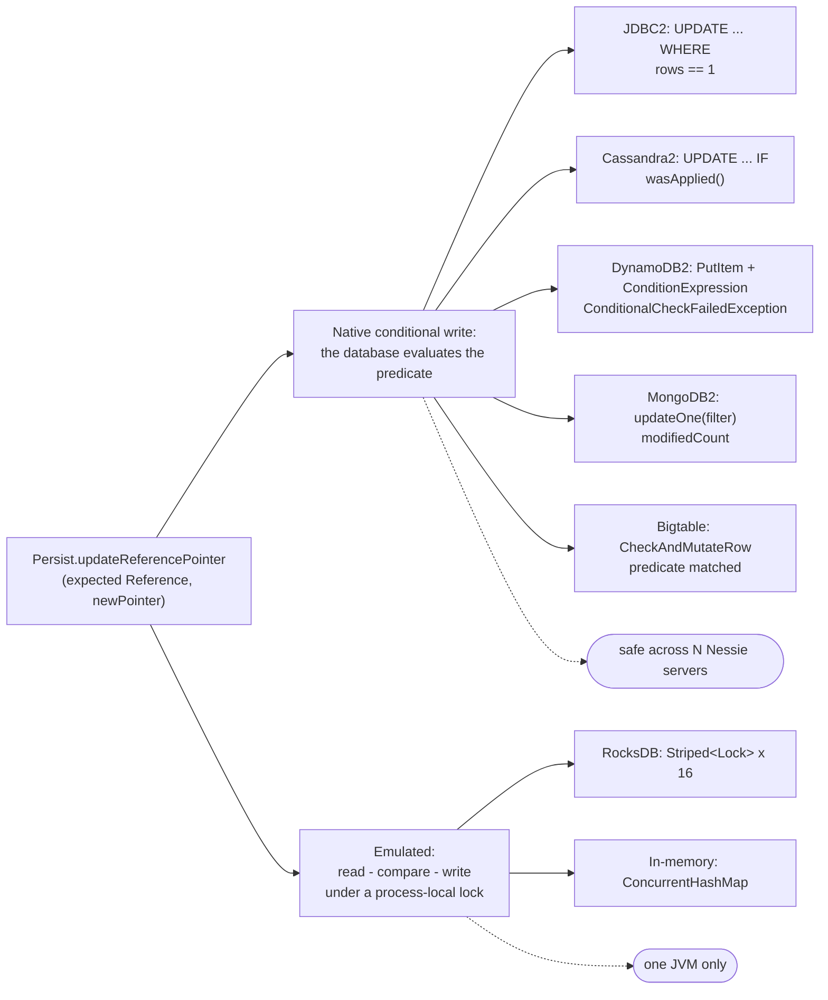

# Chapter 8.5 — Backends: RocksDB, JDBC, DynamoDB, Cassandra

**The question this chapter answers:** chapter 8.4 reduced every guarantee Nessie makes to one conditional update on one row — which databases can actually perform that, how does each one express it, and what happens when the database cannot say whether it did?

**Prerequisites:** Chapter 8.1 (the `Persist` operation list), Chapter 8.4 (why the reference CAS is the only operation that has to be perfect)

**Source covered:** `versioned/storage/jdbc2/`, `.../cassandra2/`, `.../dynamodb2/`, `.../rocksdb/`, `.../mongodb2/`, `.../bigtable/`, `.../inmemory/`

## 1. One test, eleven modules

The pinned source ships **eleven** backend modules: `inmemory`, `rocksdb`, `jdbc`, `jdbc2`, `dynamodb`, `dynamodb2`, `cassandra`, `cassandra2`, `mongodb`, `mongodb2`, `bigtable`. That is a lot of surface area for an SPI that 8.1 showed fits on one screen, and reading them all as separate systems is the wrong way in.

Read them against one test instead. Chapter 8.4 established that Nessie needs exactly two things a plain key-value store does not give you:

1. **insert-if-absent** on the objects table, so that an object ID cannot be silently overwritten;
2. **compare-and-swap** on a reference row, comparing the whole record.

So for each backend, ask three questions. *How is the condition expressed? How is failure detected? Can the outcome be unknown?* The first two sort the backends by dialect. The third — which only appears under failure — is the split that actually matters, because it is the difference between a commit that gets retried and one that is reported as an error.

Before any of that, the SPI's own concession that databases are physical:



`hardObjectSizeLimit()` defaults to `Integer.MAX_VALUE` and is overridden by exactly the backends that have a real row limit. The two `effective…SizeLimit()` methods clamp chapter 8.3's spill thresholds to *half* of it — half, because a commit row must hold its incremental index plus everything else. This is the whole abstraction leak, in three default methods.

## 2. JDBC: `UPDATE … WHERE`, checked by row count

`jdbc2` covers PostgreSQL, CockroachDB, MariaDB/MySQL and H2. It is the most legible implementation, so start here:



The statement is `UPDATE refs2 SET pointer=?, prev_ptr=? WHERE repo=? AND ref_name=? AND pointer=? AND deleted=? AND created_at… AND ext_info…` — the `2` in the table name is the v2 layout of section 8. The first two parameters are the new state — note `reference.forNewPointer(newPointer, config)` computing the previous-pointer list from 8.4 §6 — and everything after is the expected record. `deleted` is bound to a literal `false`: this update asserts the reference is live, exactly as the SPI javadoc promises.

The failure signal is `executeUpdate() != 1`. Zero rows updated means the `WHERE` clause did not match, and the code then re-reads the row to decide *which* failure it was: absent means `RefNotFoundException`, present means `RefConditionFailedException` carrying the reference as it actually is. The database never tells you why the condition failed; you find out by asking a second question.

Two nullable columns spoil the simple story, and six lines fix it:



`created_at = ?` bound to null is never true in SQL, because `NULL = NULL` is unknown. So the SQL text itself is rewritten per call: `=?` when there is a value, ` IS NULL` when there is not, with placeholder tokens substituted before the statement is prepared. A three-valued logic bug that would have shown up as "the CAS never succeeds on references created by an older Nessie", avoided by generating two statement shapes.

One thing `jdbc2` deliberately does *not* use the transaction for: the connection runs with auto-commit off so that multi-statement *object* writes can be rolled back, but the reference CAS is a single statement and needs no transaction at all. The atomicity is in the `WHERE` clause.

## 3. Cassandra: a lightweight transaction



The same expected record, bound in the same order, into `UPDATE … WHERE repo=? AND ref_name=? IF pointer=? AND deleted=? AND created_at=? AND ext_info=?`. The `IF` clause makes it a Paxos lightweight transaction, executed at `LOCAL_QUORUM` with `LOCAL_SERIAL` serial consistency, and the whole detection mechanism is `backend.executeCas(stmt)`: `session.execute(stmt)`, then `wasApplied()` on the result — wrapped in a `catch (DriverException)` that routes through `unhandledException`, which is where section 6's third outcome enters from a CAS.

Two things are worth naming. The statement is built with `setIdempotence(false)` — the driver must not silently retry an LWT on its own, because a driver-level retry of a conditional update is precisely the "unknown outcome" case that Nessie wants to handle itself, one level up. And an LWT is not cheap: Paxos costs four round trips per conditional write, per branch, per commit. Cassandra's throughput ceiling for a single hot branch is set by that, not by write bandwidth.

## 4. DynamoDB: a condition expression, and a hard limit



A `PutItem` that replaces the *whole* reference item, guarded by a `conditionExpression` built from the expected reference. The fixed half lives in `DynamoDB2Constants` and reads `(d = :deleted) AND (p = :pointer)`. `referenceCondition` appends two more clauses and *chooses* each one as it builds the string: `AND (c = :createdAt)` when the reference has a creation timestamp, `AND attribute_not_exists(c)` when it does not, and the same pair for `e`. No `OR` survives into the expression — the two forms are mutually exclusive, picked in Java before the request is sent. It is exactly the alternation `jdbc2` performs on SQL text, for exactly the same reason: an equality against an absent attribute can never be true, so the absence has to be tested for directly. Failure arrives as `ConditionalCheckFailedException`, which the caller catches and turns into the same re-read-then-classify sequence as everywhere else.

Notably, the storage layer uses no DynamoDB transactions at all — not even in `storeObj`, where a comment records the reason: DynamoDB does not support "PUT IF NOT EXISTS" inside a `BatchWriteItemRequest`, so conditional inserts are issued as single-item writes.

This is also the backend where chapter 8.3's arithmetic becomes concrete:



`ITEM_SIZE_LIMIT` is `400 * 1024`, commented in the source as "the hard item size limit in DynamoDB". Feed that through §1's formula: `effectiveIncrementalIndexSizeLimit()` becomes `min(50 KiB, 200 KiB)` — the configured 50 KiB still wins — but `effectiveIndexSegmentSizeLimit()` becomes `min(200 KiB, 200 KiB)`, exactly at the ceiling. On DynamoDB, the stripe size limit is the database's limit, and the spill machinery of 8.3 is what keeps commits under it.

## 5. RocksDB and in-memory: the CAS that is not a CAS



`repo.referencesLock(name)`, then a hand-written `checkReference` (a `db.get`, a deserialize, and `ref.deleted() != expectDeleted || !ref.equals(expected)`), then a plain `db.put`, then `unlock()` in a `finally`. No conditional write anywhere. The lock is the condition.



Two Guava `Striped<Lock>` instances, sixteen stripes each, one keyed by reference name and one by `ObjId`. Sixteen is not a correctness parameter — striping only bounds contention between unrelated keys; two operations on the same reference name always land on the same lock.

This is the right answer for an embedded store, and it is also the whole reason RocksDB is a development and single-node backend. The correctness argument in 8.4 depended on the *database* evaluating the condition. Here it is evaluated by a lock inside one JVM's heap, and a second Nessie process opening the same directory would violate every guarantee in that chapter with nothing in the code to stop it.

The in-memory backend is in the same family and makes the point more compactly, because `ConcurrentHashMap` supplies the mutual exclusion for free:



`computeIfPresent` runs its remapping function under the map's per-bin lock, so the `!r.deleted() && r.equals(reference)` test and the replacement are one atomic step. The two-element `Reference[] result` array is the workaround for a lambda that cannot return two different kinds of outcome: index 0 is set on success, index 1 on condition failure, and the caller reads them afterwards to decide which exception to throw. A `null` return from `computeIfPresent` means the key was absent — `RefNotFoundException`. Same three outcomes as PostgreSQL, expressed in a `HashMap`.

## 6. The axis that only appears under failure

Every conditional write can end three ways: applied, not applied, or *the connection died and nobody knows*. Chapter 8.4 showed `bumpReferencePointer` handling the third with a single re-read — but that path only runs if the backend raises `UnknownOperationResultException` rather than a plain `RuntimeException`. Each backend defines the boundary in its own failure vocabulary:



`QueryConsistencyException` or `DriverTimeoutException` means unknown. Everything else is rethrown as-is and fails the commit. The `AllNodesFailedException` branch matters: the driver wraps per-node errors, so a timeout can arrive nested inside an aggregate exception, and the code flattens `getAllErrors()` to check whether *any* inner error was one of the two. Miss that unwrapping and a timed-out LWT would be reported as a hard failure.

The others make the same decision with different vocabulary:

| Backend | "I do not know" is |
| --- | --- |
| JDBC2 | `databaseSpecific.isRetryTransaction(e)` — SQLSTATE `40001` (Cockroach "retry, write too old") and `40P01` (Postgres deadlock) |
| Cassandra2 | `QueryConsistencyException`, `DriverTimeoutException`, including inside `AllNodesFailedException` |
| DynamoDB2 | `SdkException.retryable()`, the two API-call timeouts, `AbortedException`, plus any throttling `AwsServiceException` |
| Bigtable | `DeadlineExceededException`, `WatchdogTimeoutException`, `UnknownException`, `AbortedException` |
| RocksDB / in-memory | never — `rocksDbException` always returns a plain `RuntimeException` |

RocksDB's mapper is the clearest statement of the whole axis, because there is nothing in it:



Three lines, no classification, no `UnknownOperationResultException` anywhere in the module. A local operation either happened or threw; there is no third outcome to model. Every remote backend has one, and misclassifying it in either direction is a real bug — call an unknown result a failure and a landed commit is reported as an error; call a genuine failure unknown and 8.4's re-read runs against a reference that never moved.

## 7. The whole comparison

| Backend | Reference CAS mechanism | Failure signal | Objects: insert-if-absent | Unknown result? |
| --- | --- | --- | --- | --- |
| In-memory | `ConcurrentHashMap.computeIfPresent` | remapping function saw a mismatch | `compute` | no |
| RocksDB | read-compare-write under `Striped<Lock>` (16) | `checkReference` throws | `get` then `put` under the obj lock | no |
| JDBC2 (PG, CRDB, MariaDB, H2) | `UPDATE … WHERE` | `executeUpdate() != 1` | `ON CONFLICT DO NOTHING` / `INSERT IGNORE` | SQLSTATE `40001`, `40P01` |
| Cassandra2 | `UPDATE … IF` (Paxos LWT) | `wasApplied()` | `INSERT … IF NOT EXISTS` | consistency / timeout exceptions |
| DynamoDB2 | `PutItem` + `ConditionExpression` | `ConditionalCheckFailedException` | `attribute_not_exists(y)` | retryable / timeout / throttling |
| MongoDB2 | `updateOne` with a filter document | modified and matched counts | `insertOne` + `DUPLICATE_KEY` | timeout / interrupt exceptions |
| Bigtable | `CheckAndMutateRow` on the serialized value | the predicate boolean | `CheckAndMutateRow` then/otherwise | deadline / watchdog / unknown / aborted |

One row needs a footnote. **MongoDB2** treats `modifiedCount != 1` with `matchedCount == 1` as *success* — the filter matched, so the expected record was current, but the document came out unchanged because the new pointer equalled the old one. Treating that as a failure would turn a legitimate no-op commit into a retry loop that can never make progress.

The `storeObj` half is more uniform than the reference half, because every one of these databases can express insert-if-absent. The shape is the same everywhere: attempt the conditional insert, and if it conflicts the object already exists, so issue a cheap second write that only bumps the `referenced` timestamp (8.1) and return `false`. Cassandra's version of that second write carries a comment worth transplanting into any similar design — "IF EXISTS is necessary to prevent writing just the referenced timestamp after an object has been deleted".

## 8. What the v2 rewrite was actually about

Four backends exist twice: `jdbc`/`jdbc2`, `cassandra`/`cassandra2`, `dynamodb`/`dynamodb2`, `mongodb`/`mongodb2`. The v1 variants are `@Deprecated` at the Quarkus config level, and the one-line javadocs there say exactly what the difference is — "variant using many distinct columns" against "variant using few columns, saves storage overhead".

That is the whole change: v1 gives every object type its own columns or attributes; v2 stores one serialized blob plus a type and a version. The object *layout* was rewritten. The reference CAS is essentially unchanged between each pair — the same expected record, the same conditional statement, the same re-read-and-classify on failure.

Which is the closing argument of Part 8. The part of the design that turned out to need a second attempt was how objects are laid out in rows. The one-conditional-update-on-one-row primitive that everything else rests on was right the first time, and it is the same primitive in seven dialects.

## 9. Gotchas

!!! warning "RocksDB opens a `TransactionDB` and never starts a transaction"
    `RocksDBBackend` calls `TransactionDB.open(...)`, which reads like the module uses RocksDB transactions. Grep it for `beginTransaction`, `getForUpdate` or `WriteBatch` and there are no hits — every operation is a plain `db.get` / `db.put`, and all atomicity comes from `RocksDBRepo`'s striped locks. The consequence must be stated plainly: two Nessie processes pointed at the same RocksDB directory would violate every guarantee in chapter 8.4, and nothing in the code prevents it.

!!! warning "The DynamoDB backend factory names are swapped at this tag"
    The deprecated `dynamodb` module declares `public static final String NAME = "DynamoDB2"`, and the current `dynamodb2` module declares `NAME = "DynamoDB"` (`DynamoDBBackendFactory.java:23`, `DynamoDB2BackendFactory.java:23`). So `PersistLoader.findFactoryByName("DynamoDB")` resolves the *v2* module and vice versa. No other module pair does this. Quarkus is unaffected because it selects by `@StoreType` rather than by name, but code using `PersistLoader` directly — or anyone reading `Persist.name()` out of a log line — will be misled. Stated here as a fact of the pinned source, not as a claim about intent.

!!! warning "Bigtable pins a constant cell timestamp, and the comment says why"
    `refsMutation` writes at a fixed `CELL_TIMESTAMP`: *"must use a constant timestamp, otherwise BigTable will pile up historic values, which would also break our CAS conditions, because historic values could match."* Bigtable's `CheckAndMutateRow` filter matches on cell *value*, and with versioned cells the filter could match a superseded version and let a stale update through. It is the sharpest illustration in the codebase of how narrow the margin is between "this database can do a CAS" and "this database can do a CAS correctly".

!!! warning "Three backends knowingly get `deleteWithReferenced` wrong for pre-existing objects"
    Cassandra2, DynamoDB2 and Bigtable each carry a variant of the same comment — *"We take a risk here in case the given object does not have a `referenced()` value (old object)"* — because Cassandra's conditional `DELETE … IF` cannot express `IF col IS NULL`, DynamoDB cannot check `== 0 OR IS ABSENT`, and Bigtable cannot test for the *absence* of a cell. JDBC2 can, and carries two SQL variants for it. This is a maintenance-path correctness gap on repositories written before `referenced()` existed, and it is documented in the source rather than hidden.

!!! note "`BatchingPersist.storeObj` returns `true` unconditionally"
    It buffers into a pending map and reports success for everything; the real conditional insert happens at `flush()`. Any code reading that boolean as "I created this object" is wrong under batching — which is part of why the commit path re-reads and compares in `mitigateHashCollision` (8.2) instead of trusting the flag.

## Key takeaways

- Grade a backend on one axis: what it provides for the reference CAS. Every production backend gets it natively and differs only in dialect.
- Two families exist. Native conditional writes — JDBC, Cassandra, DynamoDB, MongoDB, Bigtable — are evaluated by the database and are safe across N Nessie servers. Emulated ones — RocksDB, in-memory — are evaluated under a process-local lock and are correct in exactly one JVM.
- Every backend widens the condition to the whole reference record, and two of them had to work around their database's handling of `NULL` to do it.
- The second, subtler split is whether a backend can raise `UnknownOperationResultException`. Local backends never can; every remote one defines it against its own timeout vocabulary, and that classification decides whether a commit is retried or failed.
- `hardObjectSizeLimit()` is the SPI's only physical concession, and DynamoDB's 400 KB item limit is what makes chapter 8.3's stripe threshold a hard ceiling rather than a tuning knob.
- The v1→v2 rewrite changed the object row layout and left the reference CAS alone. That is a statement about which part of the design was load-bearing and correct from the start.

## Source map

| What | File |
| --- | --- |
| The SPI and its physical-limit knobs | [`versioned/storage/common/.../persist/Persist.java`](https://github.com/projectnessie/nessie/blob/nessie-0.108.4/versioned/storage/common/src/main/java/org/projectnessie/versioned/storage/common/persist/Persist.java) |
| RocksDB | [`versioned/storage/rocksdb/.../RocksDBPersist.java`](https://github.com/projectnessie/nessie/blob/nessie-0.108.4/versioned/storage/rocksdb/src/main/java/org/projectnessie/versioned/storage/rocksdb/RocksDBPersist.java), [`.../RocksDBRepo.java`](https://github.com/projectnessie/nessie/blob/nessie-0.108.4/versioned/storage/rocksdb/src/main/java/org/projectnessie/versioned/storage/rocksdb/RocksDBRepo.java), [`.../RocksDBBackend.java`](https://github.com/projectnessie/nessie/blob/nessie-0.108.4/versioned/storage/rocksdb/src/main/java/org/projectnessie/versioned/storage/rocksdb/RocksDBBackend.java) |
| JDBC (current) | [`versioned/storage/jdbc2/.../AbstractJdbc2Persist.java`](https://github.com/projectnessie/nessie/blob/nessie-0.108.4/versioned/storage/jdbc2/src/main/java/org/projectnessie/versioned/storage/jdbc2/AbstractJdbc2Persist.java), [`.../SqlConstants.java`](https://github.com/projectnessie/nessie/blob/nessie-0.108.4/versioned/storage/jdbc2/src/main/java/org/projectnessie/versioned/storage/jdbc2/SqlConstants.java), [`.../Jdbc2Backend.java`](https://github.com/projectnessie/nessie/blob/nessie-0.108.4/versioned/storage/jdbc2/src/main/java/org/projectnessie/versioned/storage/jdbc2/Jdbc2Backend.java), [`.../DatabaseSpecifics.java`](https://github.com/projectnessie/nessie/blob/nessie-0.108.4/versioned/storage/jdbc2/src/main/java/org/projectnessie/versioned/storage/jdbc2/DatabaseSpecifics.java) |
| DynamoDB (current) | [`versioned/storage/dynamodb2/.../DynamoDB2Persist.java`](https://github.com/projectnessie/nessie/blob/nessie-0.108.4/versioned/storage/dynamodb2/src/main/java/org/projectnessie/versioned/storage/dynamodb2/DynamoDB2Persist.java), [`.../DynamoDB2Constants.java`](https://github.com/projectnessie/nessie/blob/nessie-0.108.4/versioned/storage/dynamodb2/src/main/java/org/projectnessie/versioned/storage/dynamodb2/DynamoDB2Constants.java) |
| Cassandra (current) | [`versioned/storage/cassandra2/.../Cassandra2Persist.java`](https://github.com/projectnessie/nessie/blob/nessie-0.108.4/versioned/storage/cassandra2/src/main/java/org/projectnessie/versioned/storage/cassandra2/Cassandra2Persist.java), [`.../Cassandra2Constants.java`](https://github.com/projectnessie/nessie/blob/nessie-0.108.4/versioned/storage/cassandra2/src/main/java/org/projectnessie/versioned/storage/cassandra2/Cassandra2Constants.java), [`.../Cassandra2Backend.java`](https://github.com/projectnessie/nessie/blob/nessie-0.108.4/versioned/storage/cassandra2/src/main/java/org/projectnessie/versioned/storage/cassandra2/Cassandra2Backend.java) |
| MongoDB, Bigtable, in-memory | [`versioned/storage/mongodb2/.../MongoDB2Persist.java`](https://github.com/projectnessie/nessie/blob/nessie-0.108.4/versioned/storage/mongodb2/src/main/java/org/projectnessie/versioned/storage/mongodb2/MongoDB2Persist.java), [`versioned/storage/bigtable/.../BigTablePersist.java`](https://github.com/projectnessie/nessie/blob/nessie-0.108.4/versioned/storage/bigtable/src/main/java/org/projectnessie/versioned/storage/bigtable/BigTablePersist.java), [`versioned/storage/inmemory/.../InmemoryPersist.java`](https://github.com/projectnessie/nessie/blob/nessie-0.108.4/versioned/storage/inmemory/src/main/java/org/projectnessie/versioned/storage/inmemory/InmemoryPersist.java) |
| Where deprecation of the v1 variants is declared | [`servers/quarkus-config/.../config/VersionStoreConfig.java`](https://github.com/projectnessie/nessie/blob/nessie-0.108.4/servers/quarkus-config/src/main/java/org/projectnessie/quarkus/config/VersionStoreConfig.java) |
| Indeterminate outcomes | [`versioned/storage/common/.../exceptions/UnknownOperationResultException.java`](https://github.com/projectnessie/nessie/blob/nessie-0.108.4/versioned/storage/common/src/main/java/org/projectnessie/versioned/storage/common/exceptions/UnknownOperationResultException.java) |
| Batching wrapper | [`versioned/storage/batching/.../BatchingPersistImpl.java`](https://github.com/projectnessie/nessie/blob/nessie-0.108.4/versioned/storage/batching/src/main/java/org/projectnessie/versioned/storage/batching/BatchingPersistImpl.java) |
| Upstream's own backend impressions | [`versioned/storage/README.md`](https://github.com/projectnessie/nessie/blob/nessie-0.108.4/versioned/storage/README.md) |

**Next:** Part 9 builds Nessie's branching algorithms — commit, merge, transplant, garbage collection — on top of everything in this part, and from here on "the CAS" can be said without qualification.
