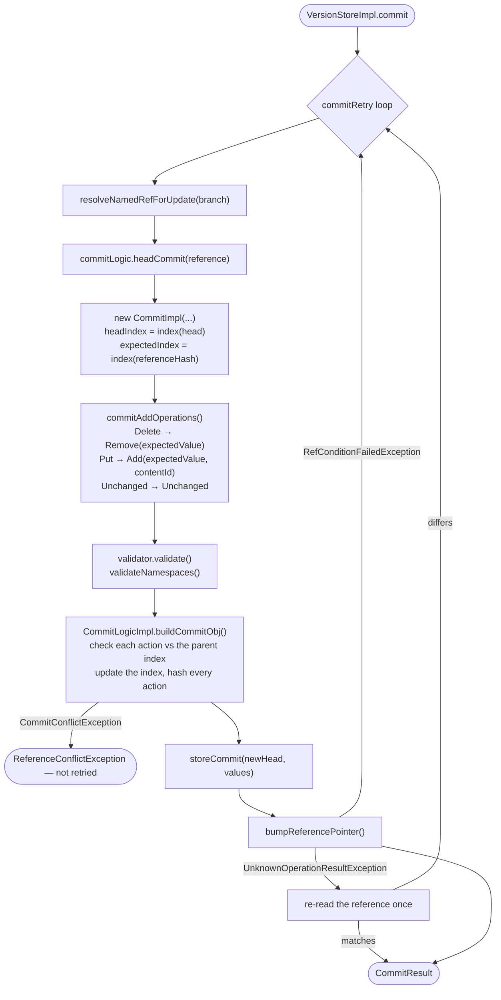

# Chapter 9.1 — Commit: from `Operation` to `CommitObj`

<div class="chapter-meta" markdown>
**The question this chapter answers:** when a client posts a list of `Put`/`Delete` operations to a branch, what turns them into a persisted `CommitObj` with an updated key index, and where exactly does the compare-and-swap on the reference happen?

**Prerequisites:** Part 8 (`Persist`, `CommitObj`, the incremental key index, the conditional reference update), Chapter 3.3 (`SnapshotProducer` — the same retry argument in Iceberg)

**Source covered:** `versioned/storage/store/.../versionstore/CommitImpl.java`, `.../BaseCommitHelper.java`, `versioned/storage/common/.../logic/CommitLogicImpl.java`
</div>

## 1. The problem

A Nessie commit request carries four things: a branch name, an optional *expected hash*, a `CommitMeta`, and a list of `Put`/`Delete`/`Unchanged` operations. What comes out is one new `CommitObj` in the object store and one reference row pointing at it.

Between those two states, Nessie has to solve four problems that do not decompose cleanly:

1. **Translate.** The request speaks `ContentKey`, `Content`, `Operation`. The storage layer speaks `StoreKey`, `ObjId`, and `CreateCommit` actions. Nothing crosses that boundary unchanged.
2. **Check.** Each operation must still be legal against the branch as it is *now*, and "now" moved while the request was in flight.
3. **Mint.** A `Put` for a table Nessie has never seen needs a content ID, and content IDs are generated, not derived.
4. **Swap.** The reference pointer moves atomically, or the whole attempt is discarded and repeated.

Three classes divide this up, and the division is the interesting part. `CommitImpl` owns translation and minting. `CommitLogicImpl.buildCommitObj` owns checking, index maintenance, and — the fact everything else hangs on — deriving the commit's identity by *hashing its own content*. `BaseCommitHelper` owns the retry envelope and the swap.

Because the commit ID is a content hash rather than an allocated number, committing the same thing twice is not a duplicate but a collision. That single design choice explains most of the odd-looking code in this chapter.

## 2. Three layers, one retry loop



Note where the loop boundary falls. Reference resolution, head load, index construction and translation are all *inside* it. A retry does not resume; it starts over from the current branch head.

## 3. The envelope

Every mutating operation in the version store — commit, merge, transplant — goes through one method:



The committer is constructed by a `CommitterSupplier` *inside* the lambda, from a `Reference` and a `CommitObj head` that were themselves loaded inside the lambda. This is the same argument Chapter 3.3 made about `SnapshotProducer.apply()` living inside Iceberg's retry loop, and it is load-bearing for the same reason: everything the attempt derives — which index to check against, what the parent commit is, what the new commit's `seq` will be — comes from the head it read.

Two details in the plumbing are worth naming. `CommitWrappedException` exists only to ferry checked exceptions out through a lambda that cannot declare them; the `catch` block below unwraps and rethrows the original. And `RetryTimeoutException` is converted into a `ReferenceRetryFailureException` carrying `operationName` — which is why an exhausted merge and an exhausted commit produce distinguishable messages from shared code.

## 4. Two indexes, not one

`BaseCommitHelper`'s constructor resolves the caller's `referenceHash` into a second commit and keeps it as `expected`, separate from `head`. `CommitImpl` then builds a lazy index over each:



Both are `lazyStoreIndex`, so neither costs a read until something asks. The conditional is the part that matters: when the caller committed against the current head, `expected == head` and `expectedIndex` is not a second index but *the same object*. Later code tests that with `==` rather than `equals`, and the constructor carries a `@SuppressWarnings` for the Java-object-identity check to say it is deliberate. (The annotation's own name is `"ReferenceEquality"`, which in this chapter means Java references and not Nessie ones — a collision worth noticing once and then ignoring.) When they differ, Nessie is being asked to commit against an older point in the branch, and the two indexes are genuinely two.

This is the difference between Nessie and a catalog that CAS-es on a table pointer. Committing against a stale hash is not automatically a conflict. It fails only if a *key this commit touches* has moved since that hash. Two clients editing different tables on the same branch never contend, no matter how far apart their expected hashes are.

## 5. Translation: `commitAddOperations`



Four decisions are visible here.

**Duplicate keys are rejected, with one exception.** `checkDuplicateKey` allows a `Delete` followed by a `Put` whose content has no ID — a table dropped and re-created under the same name in one commit. Everything else with a repeated key throws.

**The index is prefetched in bulk.** `expectedIndex().loadIfNecessary(new HashSet<>(storeKeys))` resolves every stripe the commit will need in one round trip, before any per-key work. Part 8 covers what a stripe is; the point here is that the commit path is written to touch the store once, not once per key.

**Deletes are processed before puts,** with a comment saying so. The `Put` handler consults `deleted` — the map of content ID to store key built by the delete pass — to recognise a rename (same content ID, different key) or a re-add (same key, new content). Reverse the order and both become "key already exists".

**Which index each operation consults is not uniform.** `Put` and `Delete` are resolved against `expectedIndex()`. `Unchanged` gets both, because an `Unchanged` assertion only means anything when the two differ. `validateNamespaces` at the end takes `headIndex()`: the namespace a new table needs must exist on the branch *now*, not at the caller's expected hash.

Six `// TODO` comments sit in the two methods this one dispatches to, four in `commitAddDelete` and two in `commitAddUnchanged`, and two of them appear in both: *"add much stricter handling of Delete against existing content, but that requires changes to the model"* and *"validate content-ID in store-index against content-ID in operation"*. They are honest markers of where the model, not the algorithm, is the limit — a `Delete` cannot assert what it is deleting, because `Operation.Delete` has nowhere to carry the assertion.

## 6. Minting identity

A `Put` whose `Content` has no ID is new. `commitAddPut` mints one:



The `do`/`while` is a uniqueness proof: `storeObj` returns false if the `UniqueIdObj` already exists, so the ID is not merely random but *claimed*. A UUID collision is not the failure being defended against — a *retry* is, and the `computeIfAbsent` wrapped around the loop is the defence. `CommitRetryState.generatedContentIds` memoizes the minted ID per `ContentKey`, and its javadoc states the failure mode directly:

> *Keeps state between commit retries to avoid duplicate value objects for new contents, which would otherwise get a new content-id during every commit retry, therefore pollute the database.*

Without the memo, N retries of a single create leave N−1 orphaned `UniqueIdObj` rows behind. The same object also tracks `storedContents`, so a retry does not re-persist value objects it already wrote.

## 7. `commit()` — the orchestration



The `toStore` set seeded from `commitRetryState.storedContents` is the retry optimisation in action: objects already written are not written again, but their IDs still flow into `storeCommit` so the commit references them.

Then the line that surprises people:

```java
checkState(
    stored.stored() || newHead.id().equals(commitRetryState.commitPersisted),
    "Hash collision detected, a commit with the same parent commit, commit message, "
        + "headers/commit-metadata and operations already exists");
```

It is not really a collision. The ID *is* a hash of exactly those inputs, so replaying an identical commit produces an identical ID and `storeCommit` reports that nothing was stored. The message names the inputs precisely enough to diagnose it: same parent, same message, same headers, same operations. A client that retries a commit itself, rather than letting Nessie retry, lands here.

The second half of the condition is why Nessie's own retries do not trip it. If a previous attempt persisted the commit and *then* got an unknown result from the reference bump, `commitPersisted` holds that ID and the attempt continues to the CAS rather than failing.

## 8. Where identity comes from

The check-and-build core is `buildCommitObj`. Its `Add` loop is the whole algorithm in miniature:



Read the last three statements first. `index.add(indexElement(key, op))` mutates the child index; `hasher.hash(...)` folds the accepted action into a running digest; and the method ends with

```java
return c.incrementalIndex(index.serialize()).id(hasher.generate()).build();
```

Only actions that survived conflict checking reach the hasher — `continue` skips both. So the commit ID covers the parent, the message, the headers, and precisely the operations that were committed.

What the ID does *not* cover is `seq`. That is set as `parent.seq() + 1` and is a convenience for ordering, not an allocated resource. Contrast Iceberg, where a retry must re-read `base.nextSequenceNumber()` because the number is consumed by whoever commits first (Chapter 3.3, §5). Nessie has no such counter to contend on; a Nessie retry re-runs because the *index* it checked against moved, not because it burned an identifier.

The `removes.remove(contentId)` branch is rename detection. A content ID that this same commit removed from another key is not "missing" — it moved. The `Remove`'s `CommitOp` becomes the `existingContent` for the conflict check, so the rename is validated against where the content came *from*.

## 9. The swap, and why this path can survive not knowing

The commit ends in `BaseCommitHelper.bumpReferencePointer`, one conditional update of one row. **Chapter 8.4 §4 reads that method** — its three outcomes, why the expected value is the whole `Reference` record, and why the unknown-result mitigation re-reads exactly once and says so in its own comment. Nothing about it is specific to committing; merge and transplant reach the same seventeen lines.

What *is* specific to this chapter is the question 8.4 has to leave open. Its mitigation cannot cover one race: a third writer advances the branch between the timed-out compare-and-swap and the re-read, so the pointer no longer matches even though this attempt's write may have landed. 8.4's answer is that Nessie retries anyway. This chapter can say why retrying is safe rather than duplicating.

It is safe because of §7 and §8 together. The commit ID is a hash of parent, message, headers and committed actions, so a second attempt against the same head builds a *byte-identical* `CommitObj` — and `storeCommit` reporting "already present" for it is the expected outcome, not an error. The `commitPersisted` branch in §7 is what turns that into a pass rather than the `checkState` failure: an attempt that persisted its commit and then lost track of the pointer bump carries the ID forward and proceeds straight to the CAS on the next try.

So the honest summary of the two chapters together is that Nessie does not solve the indeterminate write. It makes the indeterminate write *harmless* by making every retry of it produce the same object — which is the same trade as §6's content-ID memoisation, one level up.

It is worth naming what that costs, because it is not free. Determinism holds only for the parts of the commit that are hashed. §8 listed what those are — parent, message, headers, committed actions — and `seq`, `created` and the tail beyond its first entry are not among them. A retry therefore reproduces the *identity* of the earlier attempt exactly while reproducing its *timestamp* not at all, and `created` is `@Value.Auxiliary` precisely so that the two still compare equal. The safety of the fallback rests on a field being excluded from equality, which is a small and deliberate piece of design carrying a large amount of weight.

## 10. Gotchas

!!! warning "\"Hash collision detected\" almost always means a client-side retry"
    The commit ID is derived from parent, message, headers and operations. Submitting the same commit twice against the same head produces the same ID and this error. The fix is to let Nessie's own retry loop handle contention, not to wrap `commit()` in an application-level retry.

!!! warning "Committing against an old hash is allowed, and that is the point"
    `referenceHash` is not required to be the current branch head. Nessie checks the keys you touched, not the branch pointer. Code that refreshes to the head before every commit to "avoid conflicts" is discarding the concurrency Nessie was built to provide.

!!! note "`Unchanged` is free when head equals expected"
    `commitAddUnchanged` short-circuits on `headIndex != expectedIndex` — an object-identity comparison, not a comparison of Nessie references. When the caller committed against the current head, an `Unchanged` assertion has nothing to detect and no action is emitted at all.

!!! warning "Namespace validation reads the head, not your expected hash"
    `validateNamespaces` is called with `headIndex()`. A commit that creates `a.b.table` fails if someone deleted namespace `a.b` on the branch after your expected hash, even though your commit never touches that key. Namespaces are a global constraint, not a per-key one.

## Key takeaways

- Three layers, three vocabularies: `CommitImpl` translates and mints, `buildCommitObj` checks and indexes, `BaseCommitHelper` retries and swaps.
- A `CommitObj`'s ID is a hash of its parent, message, headers, and committed actions — identity is derived, never allocated, so a commit is idempotent by construction.
- Nessie's optimistic concurrency is per key, not per branch: the expected hash selects which index the operations are checked against, and untouched keys never contend.
- Content IDs are minted with a claim (`UniqueIdObj`), which is why `CommitRetryState` has to memoize them across retries.
- The reference bump handles an unknown store result by re-reading once, and documents that the mitigation is incomplete — determinism of the commit ID is what makes the fallback retry safe.

## Source map

| What | File |
| --- | --- |
| Commit entry point | [`versioned/storage/store/.../VersionStoreImpl.java`](https://github.com/projectnessie/nessie/blob/nessie-0.108.4/versioned/storage/store/src/main/java/org/projectnessie/versioned/storage/versionstore/VersionStoreImpl.java) |
| Model → storage translation, content-ID minting | [`versioned/storage/store/.../CommitImpl.java`](https://github.com/projectnessie/nessie/blob/nessie-0.108.4/versioned/storage/store/src/main/java/org/projectnessie/versioned/storage/versionstore/CommitImpl.java) |
| Retry envelope, CAS, namespace validation | [`versioned/storage/store/.../BaseCommitHelper.java`](https://github.com/projectnessie/nessie/blob/nessie-0.108.4/versioned/storage/store/src/main/java/org/projectnessie/versioned/storage/versionstore/BaseCommitHelper.java) |
| The documented commit contract | [`versioned/storage/common/.../logic/CommitLogic.java`](https://github.com/projectnessie/nessie/blob/nessie-0.108.4/versioned/storage/common/src/main/java/org/projectnessie/versioned/storage/common/logic/CommitLogic.java) |
| `buildCommitObj`, index update, ID hashing | [`versioned/storage/common/.../logic/CommitLogicImpl.java`](https://github.com/projectnessie/nessie/blob/nessie-0.108.4/versioned/storage/common/src/main/java/org/projectnessie/versioned/storage/common/logic/CommitLogicImpl.java) |
| Retry loop and backoff | [`versioned/storage/common/.../logic/CommitRetry.java`](https://github.com/projectnessie/nessie/blob/nessie-0.108.4/versioned/storage/common/src/main/java/org/projectnessie/versioned/storage/common/logic/CommitRetry.java) |
| The action model | [`versioned/storage/common/.../logic/CreateCommit.java`](https://github.com/projectnessie/nessie/blob/nessie-0.108.4/versioned/storage/common/src/main/java/org/projectnessie/versioned/storage/common/logic/CreateCommit.java) |

**Next:** Chapter 9.2 takes `buildCommitObj` exactly as it stands and shows that Nessie's merge adds no conflict machinery at all — only four callbacks and a different source of expected values.
