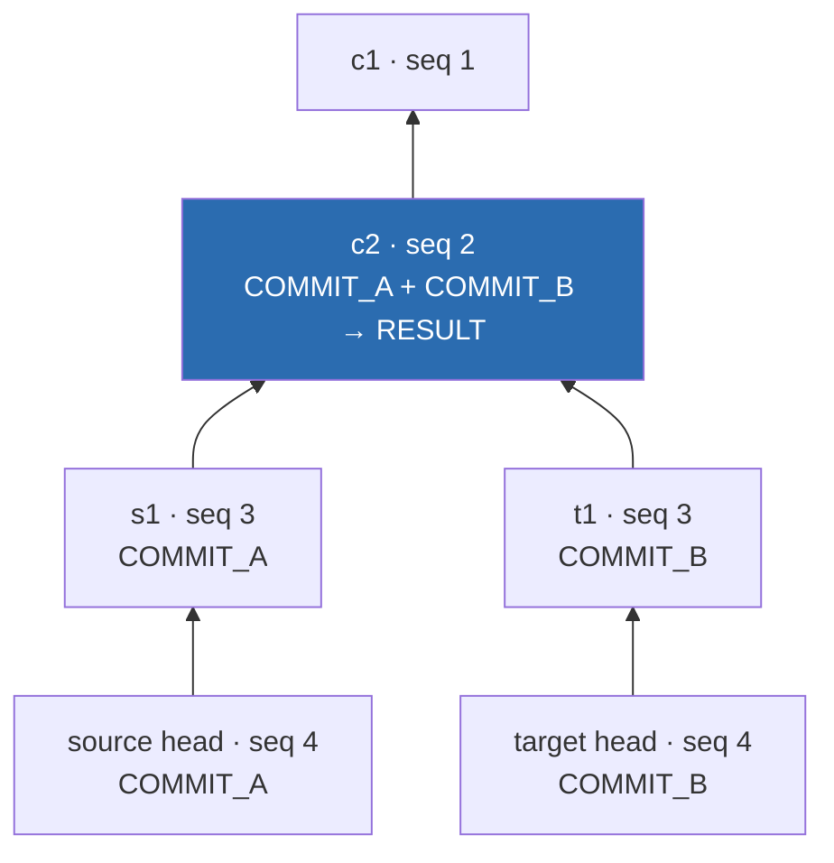
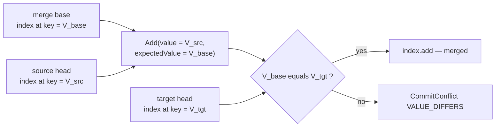

# Chapter 9.2 — Merge: merge base, three-way merge, conflict detection

<div class="chapter-meta" markdown>
**The question this chapter answers:** when Nessie merges a branch, what is compared against what to decide that a key conflicts — and how does that differ from what git does?

**Prerequisites:** Chapter 9.1 (`CreateCommit` actions, expected values, `buildCommitObj`), Part 8 (the key index, and why `ObjId` equality is a content comparison), Chapter 1.3 (why Nessie has merge and transplant at all)

**Source covered:** `versioned/storage/common/.../logic/MergeBase.java`, `.../CommitLogicImpl.java`, `.../CommitConflict.java`, `versioned/storage/store/.../versionstore/BaseMergeTransplantSquash.java`, `.../BaseCommitHelper.java`
</div>

## 1. The problem

Merging two branches requires answering one question per key: *is it safe to write the source's value onto the target?* Git answers it by diffing both sides against a common ancestor and, when both changed, running a line-level merge inside the file.

Nessie cannot do the second half. A key's value is an Iceberg table's `metadataLocation` — an opaque pointer to a file Nessie has never opened. There is no line-level anything. So Nessie's merge has to be exactly as smart as a compare-and-swap and no smarter, and the entire design question becomes: *what do you compare-and-swap against?*

The answer is the interesting part, and it is not what most readers assume. Conflict *detection* never compares the source value with the target value. It asks, per key, **has the target moved away from the merge base?** — and it answers by comparing two content hashes. One branch of the conflict *handler* does compare source with target, to absorb a case detection cannot express; that exception is section 7, and the gotcha it produces is worth the wait.

Everything else in this chapter follows from that, including the parts that look like bugs.

## 2. There is exactly one merge implementation



The first statement is the whole story of Nessie's merge strategies. `CommitterSupplier<Merge> supplier = MergeSquashImpl::new` is not a default that something else overrides: `MergeSquashImpl` is the only class in the tree that implements `Merge`, nothing in `MergeOp` selects a strategy, and there is no fast-forward path, no replay path and no `--no-ff` flag. A merge that writes a commit writes exactly one, on the target, with the source head recorded as a secondary parent.

The rest of the method does two things. It swaps the supplier for a dry-run variant — section 8 returns to that — and it converts the result, turning an unsuccessful merge into a `MergeConflictException` naming every conflicting key, sorted and quoted.

Three outcomes write no commit at all, and it is worth having them in view before the machinery. The first is checked here in `MergeSquashImpl.merge`: if `fromId.equals(commonAncestorId)`, the source is already an ancestor of the target, and the result is `wasSuccessful(true).wasApplied(false)` with the head unchanged. The other two — an empty squash and a conflicting one — are section 8.

## 3. The merge base



`findMergeBase(targetId, sourceId)` delegates to `MergeBase`, and the search is git's `paint_down_to_common` rendered in Java:



The two starting commits are painted `COMMIT_A` and `COMMIT_B` and pushed into a `PriorityQueue` ordered by `seq` **descending** — newest first. Each pop propagates its flags to its parents. A commit that ends up carrying both flags is reachable from both sides, so it is a merge base: `setResult()` adds it to the results and the `CANDIDATE` flag starts flowing down from it, marking everything it can already reach as "not the nearest".

The loop condition is the termination proof: `while (queue.stream().anyMatch(ShallowCommit::isNotCandidate))`. Once every queued commit is a candidate — reachable from an already-found base — nothing better can be found and the walk stops. Because the queue pops the highest `seq` first, the first `RESULT` recorded is the nearest one, and `identifyMergeBase` returns `mergeBases.get(0)`.

`ShallowCommit` exists purely to keep that walk cheap, and says so:

> *Identifying the merge-base may require holding a lot of commits, so keeping only the needed data should help reducing the heap pressure (think: `CommitObj#incrementalIndex()`).*

A merge base search on a long-lived branch can touch thousands of commits; loading each one's serialized index would be untenable. `ShallowCommit` holds an ID, a parent array, a `seq`, and an `int` of flags.

### The flag that changes the answer

`MergeBase` has a `respectMergeParents` switch, and Nessie exposes both settings:

- `findMergeBase` sets it **true**, and `shallowCommit` then builds each commit's parent array as *secondary parents first, direct parent last*.
- `findCommonAncestor` sets it **false**, and the parent array is just `{commit.directParent()}`.

Those two names are not synonyms in this codebase, and the book has used both. The *common ancestor* is the one a reader meets first, in Chapter 7.2: `getMetadata()` can report a `commonAncestorHash` for a reference, and that is `findCommonAncestor`'s answer — pure ancestry, merge parents ignored. The **merge base** is `findMergeBase`'s, and it is the one a merge needs. On a repository that has never merged the two agree; after the first merge they diverge, and the paragraph below is why.

The secondary parent is what a squash merge recorded in §2. With merge parents respected, a second merge from the same source branch finds the *previous merge point* as its base, so only commits made since then are diffed. Turn the flag off and the search walks past it to the original fork, and the merge re-applies changes that are already on the target. Nessie uses `findMergeBase` for merges; `findCommonAncestor` exists for callers that genuinely want the ancestry question rather than the merge question.

## 4. The source side becomes a diff



Three things happen here, and the first is the one to hold onto: the entire source branch — however many commits — collapses into `commitLogic.diff(diffQuery(baseCommit, headCommit, ...))`. A **two-way** diff. Individual source commits are never replayed and are not visible to anything downstream.

Second, `MergeBehavior.DROP` is applied as a `Predicate<StoreKey>` *on the diff itself*. A dropped key never becomes an action, so it can never conflict — it is filtered out one layer below conflict detection.

Third, `commitBuilder.addSecondaryParents(mergeFromId)` records the source head. That is the edge §3 walks on the next merge.

## 5. Where the merge base becomes an expected value



This 34-line method is the hinge of the whole chapter. Look at the "key updated" case:

```java
createCommit.addAdds(
    commitAdd(
        d.key(), d.toPayload(), requireNonNull(d.toId()), d.fromId(), d.toContentId()));
```

The signature is `commitAdd(key, payload, value, expectedValue, contentId)`. So `value` is `d.toId()` — the source's value — and `expectedValue` is `d.fromId()` — **the value at the merge base**.

That is the third way of the three-way merge, and it is the only trace of it anywhere. There is no merge algorithm below this line. The merge base does not survive as a concept; it survives as the expected value of a compare-and-swap, and from here on the code is the same code a plain commit runs.

The fourth case is worth noting too. When both sides have a value but the content IDs differ, the key was dropped and re-created — so the diff emits a `Remove` *and* an `Add`, preserving the identity change rather than papering over it as an update.

## 6. Conflict detection, in twenty-nine lines

The `CreateCommit` from §5 is handed to `buildCommitObj` parented on the **target head**. So every `expectedValue` — every merge-base value — is checked against the target's own key index. That check is one static method:



And there are five ways to fail it:



Read the two together and the algorithm is complete:

| `expectedValue` | target index | outcome |
| --- | --- | --- |
| `null` (key is new on the source) | absent | no conflict |
| `null` | present | `KEY_EXISTS` |
| set (key existed at the base) | absent | `KEY_DOES_NOT_EXIST` |
| set | present, payload differs | `PAYLOAD_DIFFERS` |
| set | present, content ID differs | `CONTENT_ID_DIFFERS` |
| set | present, value differs | `VALUE_DIFFERS` |
| set | present, all match | no conflict |

Now state what that table does *not* contain. The source's value appears nowhere in it. `checkForConflict` receives `op` only to attach it to the conflict report; the decision is made entirely from `expectedValue` (the base) and `existingContent` (the target). Both `payload` and `contentId` come from the action, which took them from the *source* side of the diff, so those two clauses do reach across — but the value comparison, the one that fires in practice, does not.



There is no arrow from `V_src` to `V_tgt`. A conflict means *the target moved*, and nothing else. If the target never moved for this key, the merge writes the source's value without ever looking at what was there.

**`VALUE_DIFFERS` is an `ObjId` comparison.** `ObjId` is the content hash of the serialized `ContentValueObj` — for an Iceberg table, a hash over the `metadataLocation` string and its neighbours. Two commits that appended different data files to the same table produce different metadata locations, therefore different hashes, therefore a conflict. Nessie will not open either file. This is not a limitation the code apologises for; it is the whole contract of a catalog that versions pointers.

**The ordering of the three "differs" checks is a diagnosis, not an accident.** Payload is checked first: the content *type* changed, so nothing else is comparable. Content ID second: the key holds a different object than it did at the base — a drop-and-recreate — and reporting a value mismatch would obscure that the identities differ. Value last. This matters for the next section, because forcing a `CONTENT_ID_DIFFERS` conflict grafts one table's metadata onto another table's identity.

## 7. The conflict *handler* is where merge diverges

A plain commit passes `c -> CONFLICT` and `buildCommitObj` throws. A merge passes this instead:



Start at the bottom, with the `MergeBehavior` switch. The enum has three values, documented in one line each: `NORMAL` ("merged, conflict detection takes place"), `FORCE` ("merged unconditionally, no conflict detection"), `DROP` ("will not be merged"). They map onto `ConflictResolution` — `CONFLICT`, `ADD`, `DROP` — but not one-to-one:

- **`FORCE`** → `ConflictResolution.ADD`, and `keyDetails(mergeBehavior, null)`: the action is committed, **no conflict is recorded**. Source wins.
- **`DROP`** → `ConflictResolution.DROP`: the action is discarded and no conflict is recorded. Target wins. (Most `DROP` keys never reach here at all — §4 filtered them out of the diff.)
- **`NORMAL`** → `keyDetails(mergeBehavior, commitConflictToConflict(conflict))` and then **`ConflictResolution.ADD`**.

That last line is the one to stop on. `NORMAL` — the default, the conflict-detecting behaviour — does *not* return `CONFLICT`. It returns `ADD`. The conflicting action is committed into the resulting `CommitObj` alongside every clean one. `buildCommitObj`'s `conflicts` list stays empty and it never throws; the conflict is recorded in `keyDetailsMap` and nothing more.

There is also a fall-through worth noting: `FORCE` and `DROP` only take their fast path when `mergeKeyBe.getExpectedTargetContent() == null`. The comment is explicit — *"Do not plain ignore (due to FORCE) or drop (DROP), when the caller provided an expectedTargetContent"* — so a client that asserted what the target holds gets that assertion honoured even under `FORCE`. Chapter 9.3 covers that mechanism.

Above the switch sit two special cases for `KEY_EXISTS`, both firing only when source and target payloads match. If the values are also equal, `ConflictResolution.DROP` — the comment: *"Got another add for the exact same content that is already on the target, so drop the conflicting operation on the floor."* Otherwise, if the payload is `NAMESPACE`, `ConflictResolution.ADD`, under a comment that calls itself *"rather a hack to ignore conflicts when merging namespaces."*

## 8. Build the commit, then throw it away

Because `NORMAL` returns `ADD`, a conflicting merge runs to completion. `BaseMergeTransplantSquash.squash` builds the full `CommitObj` — index updates, hashing, all of it — and only then decides what to do with it:



Read the two exits in order. The first is the empty squash: if the built commit has no operations at all, it is not persisted and `finishMergeTransplant` is called with `isEmpty` true. The second is the branch that matters here — `dryRun() || hasConflicts` — where `newHead` simply stays at `headId()` and `storeCommit` is never reached.

`hasConflicts` and `dryRun` sharing one branch is not tidiness; it is the design. A conflict-checking merge *is* a dry run that decided not to commit, which buys two properties a fail-fast implementation could not have:

**Every conflicting key is reported at once.** `keyDetailsMap` accumulated an entry per key, so `MergeResponse` lists all of them. A client resolving conflicts sees the full set on the first attempt.

**Dry-run needs no separate code path.** `VersionStoreImpl.merge` wraps the supplier in `dryRunCommitterSupplier`, which swaps in a `BatchingPersist` with `batchSize(-1)` that never flushes. The merge runs identically and writes nothing.

The cost is real: a merge that will fail still does the full index build and hashing before it knows. Nessie pays it to give the client a complete answer.

## 9. Gotchas

!!! warning "Identical concurrent *creates* are absorbed; identical concurrent *updates* conflict"
    The "exact same content" fast path in §7 only fires for `KEY_EXISTS` — the case where `expectedValue` was `null` because the key was new on the source. If both branches *updated* an existing key to byte-identical content, `expectedValue` is the base value, `existingContent` is the target value, and the check falls through to `VALUE_DIFFERS`. Two branches that agree perfectly still conflict. This is the opposite of what a git user expects.

!!! warning "A namespace whose properties differ is silently overwritten by the source"
    In the `KEY_EXISTS` branch, when both payloads are `NAMESPACE` and the values differ, the handler returns `ConflictResolution.ADD` with no conflict recorded — the source's namespace object is committed. The upstream comment describes the intent as letting *"the target content win (aka no change)"*, which is not what `ADD` does. Either way, no conflict is reported, so namespace property edits made on the target can vanish on merge with nothing in `MergeResponse` to say so.

!!! warning "`FORCE` on a `CONTENT_ID_DIFFERS` conflict is not what you want"
    `FORCE` skips conflict *reporting*, not conflict *detection* — `checkForConflict` still ran and still classified the problem. Forcing past `VALUE_DIFFERS` overwrites a value. Forcing past `CONTENT_ID_DIFFERS` writes the source table's metadata under a key that now holds a *different* table's identity. Read the conflict type before choosing `FORCE`.

!!! note "An unused `MergeKeyBehavior` fails the whole merge"
    `MergeBehaviors.postValidate()` asserts `remainingKeys.isEmpty()`, with the message *"Not all merge key behaviors specified in the request have been used."* Ask for `FORCE` on a key that turns out not to be in the diff and the merge is rejected with an `IllegalArgumentException`, rather than the behaviour being ignored.

## Key takeaways

- Every Nessie merge is a squash merge: one implementation, one commit, source head recorded as a secondary parent.
- The merge base is found by git's painting algorithm over a `seq`-ordered priority queue, and respecting secondary parents is what stops a repeat merge from re-applying merged work.
- The source branch collapses to a two-way diff; the merge base survives only as the `expectedValue` of each resulting action.
- Conflict detection never compares source with target. It asks whether the target moved away from the base, by comparing content hashes — five conflict types, checked payload, then content ID, then value. The one place source and target meet is a `KEY_EXISTS` branch of the conflict handler, which drops a duplicate create.
- `MergeBehavior.NORMAL` returns `ConflictResolution.ADD`: the conflicting action is committed into a `CommitObj` that is then discarded, which is why one attempt reports every conflicting key and why dry-run needs no separate code path.

## Source map

| What | File |
| --- | --- |
| Merge entry point, single implementation | [`versioned/storage/store/.../VersionStoreImpl.java`](https://github.com/projectnessie/nessie/blob/nessie-0.108.4/versioned/storage/store/src/main/java/org/projectnessie/versioned/storage/versionstore/VersionStoreImpl.java) |
| Merge base lookup, "already up to date" | [`versioned/storage/store/.../MergeSquashImpl.java`](https://github.com/projectnessie/nessie/blob/nessie-0.108.4/versioned/storage/store/src/main/java/org/projectnessie/versioned/storage/versionstore/MergeSquashImpl.java) |
| Squash: diff → `CreateCommit` → `CommitObj` → maybe persist | [`versioned/storage/store/.../BaseMergeTransplantSquash.java`](https://github.com/projectnessie/nessie/blob/nessie-0.108.4/versioned/storage/store/src/main/java/org/projectnessie/versioned/storage/versionstore/BaseMergeTransplantSquash.java) |
| The `ConflictHandler` and `ValueReplacement` callbacks | [`versioned/storage/store/.../BaseCommitHelper.java`](https://github.com/projectnessie/nessie/blob/nessie-0.108.4/versioned/storage/store/src/main/java/org/projectnessie/versioned/storage/versionstore/BaseCommitHelper.java) |
| Merge-base painting algorithm | [`versioned/storage/common/.../logic/MergeBase.java`](https://github.com/projectnessie/nessie/blob/nessie-0.108.4/versioned/storage/common/src/main/java/org/projectnessie/versioned/storage/common/logic/MergeBase.java), [`ShallowCommit.java`](https://github.com/projectnessie/nessie/blob/nessie-0.108.4/versioned/storage/common/src/main/java/org/projectnessie/versioned/storage/common/logic/ShallowCommit.java) |
| Conflict detection, diff, `diffToCreateCommit` | [`versioned/storage/common/.../logic/CommitLogicImpl.java`](https://github.com/projectnessie/nessie/blob/nessie-0.108.4/versioned/storage/common/src/main/java/org/projectnessie/versioned/storage/common/logic/CommitLogicImpl.java) |
| Storage-level conflict types | [`versioned/storage/common/.../logic/CommitConflict.java`](https://github.com/projectnessie/nessie/blob/nessie-0.108.4/versioned/storage/common/src/main/java/org/projectnessie/versioned/storage/common/logic/CommitConflict.java) |
| Resolution vocabulary | [`versioned/storage/common/.../logic/ConflictHandler.java`](https://github.com/projectnessie/nessie/blob/nessie-0.108.4/versioned/storage/common/src/main/java/org/projectnessie/versioned/storage/common/logic/ConflictHandler.java) |
| API-level behaviour and conflict model | [`api/model/.../MergeBehavior.java`](https://github.com/projectnessie/nessie/blob/nessie-0.108.4/api/model/src/main/java/org/projectnessie/model/MergeBehavior.java), [`Conflict.java`](https://github.com/projectnessie/nessie/blob/nessie-0.108.4/api/model/src/main/java/org/projectnessie/model/Conflict.java) |
| Storage → API conflict mapping | [`versioned/storage/store/.../RefMapping.java`](https://github.com/projectnessie/nessie/blob/nessie-0.108.4/versioned/storage/store/src/main/java/org/projectnessie/versioned/storage/versionstore/RefMapping.java) |

**Next:** Chapter 9.3 shows that transplant shares every line of this machinery and differs in exactly one argument — which is why some conflict-resolution features are legal for merge and rejected for cherry-pick.
