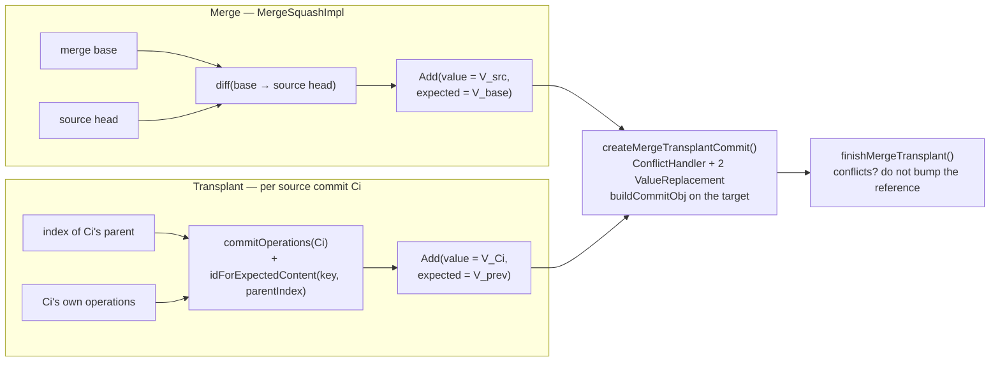

# Chapter 9.3 — Transplant (cherry-pick) and conflict resolution policies

<div class="chapter-meta" markdown>
**The question this chapter answers:** merge and transplant run through the same `createMergeTransplantCommit`, so what is actually different between them — and what does that shared structure force to be true about conflict resolution?

**Prerequisites:** Chapter 9.2 (conflict detection, `MergeBehavior`, `finishMergeTransplant`), Chapter 9.1 (`CreateCommit` actions and expected values)

**Source covered:** `versioned/storage/store/.../versionstore/TransplantIndividualImpl.java`, `.../BaseCommitHelper.java`, `.../MergeBehaviors.java`, `api/model/.../MergeKeyBehavior.java`
</div>

## 1. The problem

Cherry-picking asks a different question from merging. A merge asks "bring this branch's *state* over". A cherry-pick asks "bring these specific *commits* over" — and the whole point is that the commits in between are left behind.

Nessie implements both with one conflict detector, one policy engine, and one result type. Reading the two side by side is worth the effort, because the difference collapses to a single argument. Once you can name it, the API restrictions on conflict resolution — which look arbitrary in the REST docs — become obvious.

That argument is **where the expected value comes from**.

## 2. Two shapes, one machine



Everything to the right of the two `Add` nodes is literally the same code, described in Chapter 9.2. `VersionStoreImpl` wires exactly one implementation for each operation — `MergeSquashImpl` and `TransplantIndividualImpl` — so merge is always a squash and transplant is always a per-commit replay. Neither is configurable.

The two entry points are otherwise indistinguishable. Both wrap their supplier in `dryRunCommitterSupplier` when the request asks for a dry run, which swaps the real `Persist` for a `BatchingPersist` with `batchSize(-1)` that never flushes; both return through the same `mergeTransplantResponse`, which turns `wasSuccessful() == false` into a `MergeConflictException` listing every conflicting key, sorted and quoted. Chapter 9.2's "build it all, report it all" decision is inherited here unchanged.

## 3. A cherry-pick is a run, not a set



The hashes are bulk-loaded in one `fetchTypedObjs` call, and then checked:

```java
if (!commit.directParent().equals(commits.get(i - 1).id())) {
  throw new IllegalArgumentException("Sequence of hashes is not contiguous.");
}
```

Nessie will not transplant an arbitrary set of commits. The requested hashes must form an unbroken parent chain. That constraint is what makes §4 possible: each commit's expected values can be read from its predecessor's index because there *is* a predecessor in the request.

The `parent` variable is declared before the loop and filled inside it, in the `else` arm that only the first iteration reaches: `commitLogic.fetchCommit(commit.directParent())`. It becomes `baseCommit()` in the returned context, and its index is the starting baseline. One extra fetch for the whole range, because the contiguity check has already guaranteed that every later commit's baseline is the commit before it.

Worth noticing what this makes of the common case, transplanting a single commit. The source list has one entry, the baseline is that commit's parent, and the expected values are exactly the values the commit was authored against. That is a stricter test than merging the same change would apply: a merge would compare against the merge base, which may be much older and may already account for intervening target changes.

The last three statements compute a *squashed* `CommitMeta` from all the source commits' metadata and hand it to `MergeTransplantContext`. Note where it goes: nowhere. `TransplantIndividualImpl` reads only `sourceCommits()` and `baseCommit()` from that context. The squashed metadata is the merge path's input — `BaseMergeTransplantSquash.createSquashCommit` consumes it — and is computed here for a shared carrier that transplant does not exercise. Each transplanted commit gets its own metadata instead, in §4.

## 4. Where the expected value comes from



Twenty-eight lines, and one of them is the chapter:

```java
ObjId expectedId = idForExpectedContent(el.key(), sourceParentIndex);
```

Compare with the merge's `diffToCreateCommit`, which set `expectedValue` to `d.fromId()` — the value at the merge base. Here it is the value in the *source commit's parent index*: what the key held immediately before this commit changed it.

So a transplant has no merge base and never computes one. Its baseline is per commit. The question `checkForConflict` asks is unchanged — *does the target still hold the expected value?* — but "expected" now means "what the source commit was written against", not "what both branches last agreed on".

The other half of the method is the operations themselves. `indexesLogic.commitOperations(sourceCommit)` yields only the operations *that commit introduced*, not its full index — the incremental index Part 8 describes. Existing keys become `Add`s, deletions become `Remove`s, and `requireNonNull(expectedId, "expectedId")` on the remove path states the invariant out loud: you cannot delete what the source commit's parent did not have.

Metadata is rewritten per commit with `updateCommitMetadata.rewriteSingle(...)`, which is how a transplant preserves N distinct commit messages while a merge collapses to one.

## 5. The replay loop



Two indexes advance together at the bottom of each iteration:

```java
sourceParentIndex = indexesLogic.buildCompleteIndex(sourceCommit, Optional.empty());
targetParentIndex = indexesLogic.buildCompleteIndex(newCommit, Optional.empty());
```

`sourceParentIndex` walks forward through the source chain, supplying §4's expected values. `targetParentIndex` walks forward through the commits being created, so validation and namespace policy for commit *i+1* see the effects of commit *i*. Both are complete indexes, rebuilt per commit — a transplant of N commits is N index builds, which is the cost of not squashing.

Three more things in this loop deserve naming.

**The loop never breaks on conflict.** `keyDetailsMap` is declared outside it and accumulates across every commit; `recordKeyDetailsAndCheckConflicts` runs once, after. As in Chapter 9.2, the commits are all built and the reference is simply not bumped. A five-commit transplant with a conflict in commit two still constructs all five.

**Empty commits are skipped silently.** `if (!indexesLogic.commitOperations(newCommit).iterator().hasNext()) continue;` — a source commit whose operations were all dropped, or all redundant against the target, produces no commit at all.

**`newHead` starts at `headId()` and only moves on a real commit.** The `empty` flag is set false the first time a commit survives the skip check, and both are handed to `finishMergeTransplant(empty, ...)`. A transplant in which every source commit turned out to be a no-op returns successful, applied-false, with the branch untouched — the same outcome as merging a source that is already an ancestor.

**`committed.stored()` distinguishes a genuinely new commit from one that already existed**, with a comment explaining the case: *"If not equal, we have to assume that the commit already existed - aka a 'fast-forward transplant'. This is only to maintain compatibility with (pre-)existing behavior."* Because commit IDs are content hashes (Chapter 9.1), transplanting a commit already present on the target reproduces its exact ID, and Nessie reports it rather than duplicating it.

## 6. Validation runs per commit, too

Two checks sit at the top of each iteration, before any commit object is built, and both take `targetParentIndex` — the index that advances with the commits being created:

```java
validateMergeTransplantCommit(createCommit, transplantOp.validator(), targetParentIndex);

verifyMergeTransplantCommitPolicies(targetParentIndex, sourceCommit);
```

`validateMergeTransplantCommit` reconstructs an `IdentifiedContentKey` for every add and remove and hands the set to the caller's `CommitValidator` — the hook authorization is wired into. So a transplant is authorized once per replayed commit, not once for the range.

`verifyMergeTransplantCommitPolicies` re-runs the namespace rules from Chapter 9.1: every new key must have an existing parent namespace, and no namespace may be deleted while it still holds children. Because the index advances, a source commit that creates namespace `a.b` and a later one that creates `a.b.t` both pass — the second sees the first. But a transplant can be asked for a run whose namespace creation was *left behind*, and then the replay fails with `NAMESPACE_ABSENT` even though the source branch was perfectly consistent. That is the price of replaying a subrange rather than a state.

The merge path calls both methods too, and against `headIndex` rather than an advancing one — once, not N times.


## 7. Advanced resolution: two callbacks

`MergeBehavior` gets you source-wins or target-wins. Neither helps when the right answer is a *third* value. That is what the remaining two callbacks of `buildCommitObj` are for:



`expectedValueReplacement` runs *before* conflict detection and substitutes what the commit logic compares against. When a client supplies `MergeKeyBehavior.expectedTargetContent`, Nessie builds that content's `ContentValueObj` and uses its ID as the expected value — and the comment notes the shortcut: *"we only need the ObjId for it to let the commit code perform the check. An object load is not needed."* Hashing the client's object is enough; if the hash matches what the target holds, the assertion passes.

`committedValueReplacement` runs on the value being written. When `MergeKeyBehavior.resolvedContent` is set, the client's merged object is persisted — `objsToStore.accept(resolvedValue)` — and its ID is committed instead of the source's. This is how an external three-way merge is fed back in: the client reads both sides, resolves them, and hands Nessie the answer.

`MergeBehaviors.validate()` enforces the pairing at construction time:



Two rules, and they are narrower than they look. Under `NORMAL`, `resolvedContent` without `expectedTargetContent` is rejected: a resolution is only valid against a known starting point, and writing a merged value onto a target that has since moved again would silently discard the third change. Under `FORCE` or `DROP`, `resolvedContent` is rejected outright, because those behaviours skip exactly the check that would make it meaningful.

`expectedTargetContent` is **not** rejected under `FORCE` or `DROP`. It is deliberately honoured there, and chapter 9.2 showed the code that does it: the `FORCE`/`DROP` arm of the conflict handler only takes its fast path when `getExpectedTargetContent() == null`, and otherwise falls through into the `NORMAL` case. The two features are asymmetric on purpose. `resolvedContent` supplies an answer, which needs a question that was actually asked; `expectedTargetContent` *is* a question, and a client that asks it gets an answer even when it also said "force".

## 8. Why resolution is documented merge-only

`MergeKeyBehavior`'s javadoc states the restriction on all four resolution attributes, in the same words each time:

> *This parameter is not supported when multiple commits will be generated, which means only merge operations.*

The mechanism, now that §5 is in view, is clear. A transplant calls `createMergeTransplantCommit` once per source commit, and `MergeBehaviors` is constructed once and shared across all of them. A single `resolvedContent` would be injected into every replayed commit that touches the key — each time overwriting the previous one, each time against a different expected value. There is no coherent answer to give.

Now read the javadoc's exact words again: *not supported*. Not *rejected*. At this tag nothing enforces the restriction. `MergeBehaviors.validate()` checks only the combinations above, and it runs identically for merge and transplant; `TreeApiImpl.transplantCommitsIntoBranch` validates the hash list, the commit metadata and access, and passes `mergeKeyBehaviors` through a plain `Collectors.toMap` without inspecting them. A transplant carrying `resolvedContent` under `NORMAL`, with the `expectedTargetContent` that `validate()` requires alongside it, is accepted — and the `committedValueReplacement` callback then applies the same resolved object to every replayed commit that touches the key, exactly as described above.

So this is a documented limitation, not an enforced one, and the difference matters to anyone building on it. A client that supplies `resolvedContent` to a transplant does not get a 400 telling it the request was malformed. It gets commits.

## 9. Gotchas

!!! warning "A transplant of N commits is N chances to conflict, against N different baselines"
    A merge asks one question per key. A transplant asks one per key *per commit*, each against that commit's own predecessor. Replaying `A → B → C` onto a target where the key changed independently conflicts at `A`, and the loop keeps going — so the result may report the same key several times over, once per commit that touched it.

!!! warning "`FORCE` applies to every replayed commit, and the last one wins"
    One `MergeBehaviors` instance serves the whole replay. `FORCE` on a key overwrites the target once per source commit that touches it, and every intermediate value is still written as a commit on the branch. There is no way to force only the first, or only the last.

!!! note "The transplanted range can be shorter than you asked for"
    Commits whose operations are all dropped or all redundant are skipped with `continue` and no warning. Comparing source and target commit counts after a transplant will not always match.

!!! warning "Contiguity is checked; reachability from the named source reference is not"
    The assertion is that hash *i*'s direct parent is hash *i−1* within the submitted list. Nessie does not separately verify that the run is reachable from the reference named in the request — the hashes carry that requirement themselves.

## Key takeaways

- Merge is always a squash and transplant is always a per-commit replay; `VersionStoreImpl` wires one implementation for each and offers no alternative.
- The only semantic difference is the source of `expectedValue`: the merge base for a merge, the source commit's own parent index for a transplant.
- A cherry-pick must be a contiguous run of commits, because each commit's expected values are read from its predecessor.
- Everything after the `CreateCommit` — conflict detection, `MergeBehavior`, key details, the decision not to persist — is shared code, so a conflicting transplant builds all its commits and discards them, exactly as a merge does.
- `expectedTargetContent` and `resolvedContent` are `ValueReplacement` callbacks that let a client resolve a conflict externally. They are documented as merge-only because a replay would apply one resolution to many commits — but nothing at this tag enforces that, so a transplant carrying `resolvedContent` is accepted rather than refused.

## Source map

| What | File |
| --- | --- |
| Transplant wiring, dry-run supplier | [`versioned/storage/store/.../VersionStoreImpl.java`](https://github.com/projectnessie/nessie/blob/nessie-0.108.4/versioned/storage/store/src/main/java/org/projectnessie/versioned/storage/versionstore/VersionStoreImpl.java) |
| The replay loop, `cloneCommit`, contiguity check | [`versioned/storage/store/.../TransplantIndividualImpl.java`](https://github.com/projectnessie/nessie/blob/nessie-0.108.4/versioned/storage/store/src/main/java/org/projectnessie/versioned/storage/versionstore/TransplantIndividualImpl.java) |
| The shared conflict and resolution callbacks | [`versioned/storage/store/.../BaseCommitHelper.java`](https://github.com/projectnessie/nessie/blob/nessie-0.108.4/versioned/storage/store/src/main/java/org/projectnessie/versioned/storage/versionstore/BaseCommitHelper.java) |
| The merge counterpart, for contrast | [`versioned/storage/store/.../BaseMergeTransplantSquash.java`](https://github.com/projectnessie/nessie/blob/nessie-0.108.4/versioned/storage/store/src/main/java/org/projectnessie/versioned/storage/versionstore/BaseMergeTransplantSquash.java) |
| Per-key policy validation | [`versioned/storage/store/.../MergeBehaviors.java`](https://github.com/projectnessie/nessie/blob/nessie-0.108.4/versioned/storage/store/src/main/java/org/projectnessie/versioned/storage/versionstore/MergeBehaviors.java) |
| Source-commit and metadata carrier | [`versioned/storage/store/.../MergeTransplantContext.java`](https://github.com/projectnessie/nessie/blob/nessie-0.108.4/versioned/storage/store/src/main/java/org/projectnessie/versioned/storage/versionstore/MergeTransplantContext.java) |
| Client-facing policy model and its restrictions | [`api/model/.../MergeKeyBehavior.java`](https://github.com/projectnessie/nessie/blob/nessie-0.108.4/api/model/src/main/java/org/projectnessie/model/MergeKeyBehavior.java), [`MergeBehavior.java`](https://github.com/projectnessie/nessie/blob/nessie-0.108.4/api/model/src/main/java/org/projectnessie/model/MergeBehavior.java) |

**Next:** Chapter 9.4 turns to what these operations leave behind. A conflicting merge or transplant builds complete commit objects and abandons them — which makes garbage collection the last algorithm in this part, and the one with two independent implementations that must not be confused.
