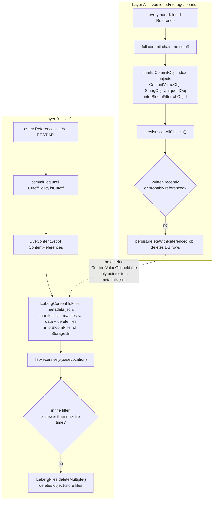

# Chapter 9.4 — Nessie GC and its interaction with Iceberg file cleanup

<div class="chapter-meta" markdown>
**The question this chapter answers:** Nessie has two independent garbage collectors — which objects does each one delete, what does each one consider reachable, and what breaks when you get the relationship between them wrong?

**Prerequisites:** Part 8 (`Persist`, `Obj`, `ObjId`, the object types being swept), Chapters 9.1–9.3 (why unreferenced commit objects exist at all), Part 2 (what an Iceberg `metadata.json`, manifest list and manifest contain)

**Source covered:** `versioned/storage/cleanup/.../{Cleanup,ReferencedObjectsResolverImpl,PurgeObjectsImpl,PurgeFilter}.java`, `gc/gc-base/.../{identify/IdentifyLiveContents,expire/PerContentDeleteExpired}.java`
</div>

## 1. The problem

Nessie ships two garbage collectors. They are both mark-and-sweep, they both back their live set with a Guava bloom filter, and they share nothing else — not a module, not a database, not a definition of reachability, not a clock.

Start with the names, because the names are the trap. Only one of the two is called GC:

| | module | tool | deletes |
| --- | --- | --- | --- |
| **Layer A** | `versioned/storage/cleanup` | `nessie-server-admin-tool cleanup-repository` | rows in Nessie's backend database |
| **Layer B** | `gc/` (nine modules) | `nessie-gc.jar` | files in the object store |

Layer A is called *cleanup*, and its build file describes it as *"Identify and purge unreferenced objects in the Nessie repository."* It has no Iceberg dependency at all. Layer B is called *GC* and exists entirely to delete Iceberg files. Operators say "run Nessie GC" and mean either one.

They have to be understood together because their outputs are coupled in one direction: Layer A deletes the objects that *point at* the files Layer B deletes. Neither knows the other exists.

## 2. Two collectors, one dashed edge



The dashed edge is the only coupling, and it is a data dependency, not a call.

## 3. Layer A: what "referenced" means

Upstream documents the flow on the entry-point class, which is the fastest way to see the shape:



`resolve()` walks the two internal references (`REF_REFS`, `REF_REPO`) and then every user reference returned by `ReferenceLogic`. For each, `handleReference` skips soft-deleted references and calls `commitChain(reference.pointer())`. And `commitChain` has **no cutoff of any kind** — it pushes the head onto a queue, and `commitLog(...)` walks it to the root. Every commit ever made on a live reference is visited.

What each visit marks:



Four kinds of thing, and one recursion:

- the `CommitObj`'s own ID;
- every `referenceIndexStripes()` segment, plus the `referenceIndex()` itself — the external index objects Part 8 describes, queued for a batched fetch that will expand `INDEX_SEGMENTS` into its stripes;
- every value `ObjId` in `buildCompleteIndexOrEmpty(commit)` whose action `exists()` — the `ContentValueObj`s, which is where an Iceberg table's `metadataLocation` actually lives;
- `commit.secondaryParents()`, recursed into via `commitChain`.

That last one is Chapter 9.2's merge parent, and it is why a merged-away branch's commits stay live after the branch is deleted: the squash commit still names the source head.

Note that the *complete* index is used, not the incremental one. A commit that changed one key still marks every value visible at that commit. `RecentObjIdFilterImpl`, a bounded LRU, exists purely to stop that from re-processing the same IDs, and says why:

> *Set of recently handled 'ObjId's to prevent re-processing the same objects multiple times. This happens, when the values referenced from the commit index are iterated, because it iterates over all keys, not only the keys added by a particular commit.*

## 4. Layer A: the sweep, and the clause that saves you

The live set is a `BloomFilter<ObjId>`, and its interface states the safety property that makes the whole thing sound:

> *The implementation is usually backed by a probabilistic data structure (bloom filter), which means that there is a chance that an unreferenced object is not collected, but all referenced objects are guaranteed to remain.*

One-sided error, in the safe direction: garbage may survive, live data may not be deleted. The sweep is then a full-table scan — `persist.scanAllObjects(Set.of())` — with one predicate deciding each row's fate:



```java
return obj.referenced() > maxObjReferencedInMicrosSinceEpoch()
    || referencedObjects().isProbablyReferenced(obj.id());
```

Two independent reasons to keep an object, and the *first* is the one that matters operationally. It has nothing to do with reachability:



`referenced()` is a write timestamp whose only legitimate consumer is maintenance code — the javadoc calls interpreting it elsewhere *"illegal"*. Anything written more recently than the grace threshold is kept whether or not anything points at it. `Cleanup.buildReferencedObjectsContext` says what the window is for:

> *`maxObjReferenced` should be the timestamp of a few days ago to not delete unreferenced objects too early and give users a chance to reset branches to another commit ID in case some table/view metadata is broken. […] Production workloads should set this to something like "now minus 7 days".*

That is the window in which you can still `assign` a branch back after a bad merge. Below it, the commits a failed merge or a reset abandoned are gone.

The javadoc also warns that `referenced()` is not consistent through a caching `Persist`, which is why `PurgeObjectsImpl` reads objects via `scanAllObjects` and deletes with `persist.deleteWithReferenced(obj)` — a conditional delete that only fires if the stored timestamp still matches what the scan saw. An object written between scan and delete survives.

One more safety valve: `markReferenced` throws as soon as the observed false-positive probability exceeds the configured allowance — a `MustRestartWithBiggerFilterRuntimeException`, which `resolve()` catches and re-throws as the checked `MustRestartWithBiggerFilterException` so callers cannot ignore it. `CleanupRepository` catches that and restarts the whole run with `withIncreasedExpectedObjCount()`. Sweeping with a degraded filter would start deleting *referenced* objects, so the mark phase is abandoned before a sweep can begin, not repaired mid-flight.

## 5. Layer B: a different reachability question entirely

Layer B does not open Nessie's database. It walks the commit log through `RepositoryConnector`, the public API, and applies a `CutoffPolicy` per reference:



Two upstream comments carry the rules. The first:

> *The HEAD commit is always live, consult cutoff-policy for all other commits*

which is the `lastCommitId == null ||` disjunct — the branch tip is never expired, however old. The walk then continues while `!cutoffPolicy.isCutoff(commitTime, numCommits)`, collecting a `ContentReference` for every `Put` whose content type passes the filter, and `break`s at the first commit the policy rejects.

The second:

> *Always consider all content reachable from the last live commit.*

`collectAllKeys(addContents, Detached.of(lastCommitId))` then adds every key visible at that commit, not only the ones that live commits happened to `Put`. Without it, a table untouched for longer than the cutoff would have no live content reference at all and its current files would be deleted.

The results go into a `LiveContentSet`, persisted in a separate database — the `gc/gc-repository-jdbc` module, tables `gc_live_sets`, `gc_live_set_contents`, `gc_file_deletions`. The mark phase's output outlives the process.

## 6. Layer B: from content references to file deletions

The sweep runs per content ID. `IcebergContentToFiles.extractFiles` turns each live content reference into the files it needs — table metadata, manifest list, every manifest, every data and delete file — and those go into a `BloomFilter<StorageUri>`. Then every base location is listed recursively and matched:



```java
if (filter.mightContain(f.path()) || filter.mightContain(f.absolutePath())) {
  expireStats.liveFiles++;
  return false;
}
if (f.modificationTimeMillisEpoch() > maxFileTime) {
  expireStats.newFiles++;
  return false;
}
expireStats.expiredFiles++;
return true;
```

Three clauses. The bloom filter is consulted twice — relative path and absolute URI — for the reason its javadoc gives: a file written outside the table's declared `location` is recorded absolutely, and *"such a file can still be located under another base location of the same content, for example an older table location."* The modification-time clause protects writers in flight; `ExpireParameters.maxFileModificationTime` is documented as *"Files newer than this instant will not be deleted."*

Everything that survives both is handed to `fileDeleter().deleteMultiple(baseLocation, fileObjects)` — normally `IcebergFiles`, which deletes through Iceberg's own `S3FileIO` or `ResolvingFileIO`. With `--defer-deletes` the deleter is `liveContentSet.fileDeleter()` instead, which records the paths in `gc_file_deletions` for a later `deferred-deletes` run.

Two properties of Layer B's file enumeration are worth stating explicitly, because they are more conservative than Iceberg's own maintenance. `IcebergContentToFiles` walks manifest entries *of every status* — `EXISTING`, `ADDED` and `DELETED` alike — so a live Nessie commit retains files that Iceberg alone would consider expired. And the sweep only ever lists base locations belonging to contents that are still live. Nothing else is ever looked at.

## 7. Which layer deletes what

| | Layer A · `cleanup` | Layer B · `gc/` |
| --- | --- | --- |
| Reads | Nessie's backend DB, directly via `Persist` | Nessie's commit log, via the REST API |
| Reachability | every commit of every live reference, **no cutoff** | commit log per reference, **stops at `CutoffPolicy`** |
| Live set | `BloomFilter<ObjId>`, in memory, per run | `LiveContentSet` in JDBC, plus a per-content `BloomFilter<StorageUri>` |
| Second guard | `Obj.referenced()` grace window | `maxFileModificationTime` |
| Deletes | `CommitObj`, index objects, `ContentValueObj`, `StringObj`, `RefObj`, `TagObj`, `UniqueIdObj` | `metadata.json`, manifest lists, manifests, data and delete files |
| Via | `persist.deleteWithReferenced(obj)` | `IcebergFiles` / `FileIO` |
| Never touches | any data-lake file | Nessie's backend database |

The asymmetry in row two is the one to internalise. **Layer A is the conservative one about history; Layer B is not.** A commit older than the GC cutoff is still fully live to Layer A, still resolvable, still in `nessie log` — while the files it points at are gone.

## 8. Gotchas

The four below were read out of the pinned source. Getting any of them backwards in an operational runbook causes data loss, so they are stated flatly.

!!! danger "A `CutoffPolicy` retains files, not commits"
    Layer A walks the *entire* commit chain of every live reference — `commitChain(reference.pointer())`, no cutoff anywhere — so a commit older than the GC cutoff survives in Nessie with its `IcebergTable` content and its `metadataLocation` intact. Layer B has deleted the file at that location. The failure surfaces as a not-found from `FileIO` when someone time-travels, not as a Nessie error, which makes it look like storage corruption rather than a retention setting. Choose the cutoff by how far back anyone will actually read, and treat it as a hard floor.

!!! danger "A table dropped on every branch leaks its entire base location, forever"
    Layer B's sweep is per *live* content ID, and base locations are only discovered from contents that are still live. Once no live commit references a content, nothing ever lists its directory again. Upstream documents the gap rather than closing it, under "Completely unreferenced contents": *"Files of contents that are not visible from any live Nessie commit can be completely removed. Detecting this situation is not directly supported by the above approach."* Layer A will reclaim the database rows; the object-store prefix stays until someone deletes it by hand.

!!! warning "Do not run Iceberg's own `expireSnapshots` or `removeOrphanFiles` against a Nessie table"
    Those procedures reason about one table's snapshot history. A Nessie repository has many branches, and a snapshot invisible from one branch is current on another. The mechanism is in `IcebergContentToFiles`, whose javadoc says it walks *"all `ManifestEntry`s of every status (`EXISTING`, `ADDED`, `DELETED`"* — Layer B deliberately retains files that Iceberg alone would consider expired, because another branch may still be reading them. An Iceberg-side `expireSnapshots` reasons from a single table's history, cannot see the other branches, and will delete exactly those files. Upstream calls the `gc/` modules *"effectively a complete replacement of Iceberg's expire snapshots and delete orphan files"*, though note it says so while describing how to reuse them **outside** Nessie; the argument for not mixing the two inside Nessie is the manifest-status difference above, not that sentence.

!!! warning "`cut-history` makes Layer B's blind spot permanent"
    `CutHistory` severs a commit's parents so older commits become unreachable, and its javadoc says it *"is generally meaningful when followed by `PurgeObjects`"*. Run it before a Layer B identify pass and those commits' content references vanish from the API — so their Iceberg files fall into the second gotcha's hole and are never reclaimed. Order the jobs: identify-live-contents, then sweep, and only then `cut-history` and `cleanup-repository`.

## Key takeaways

- Nessie has two garbage collectors with no shared code: `versioned/storage/cleanup` deletes database rows, `gc/` deletes object-store files. Only the second is named GC.
- Layer A's reachability is total — every commit of every live reference, marking commit objects, index objects and every value in each commit's *complete* index, following merge parents.
- Layer A keeps an object if it is probably referenced **or** was written inside the grace window; the second clause is what lets an operator reset a branch after a bad merge.
- Layer B's reachability is bounded by a `CutoffPolicy`, so it is the more aggressive of the two about history: Nessie keeps the old commit, Nessie GC deletes the files it points at.
- Both bloom filters are one-sided in the safe direction, and both refuse to sweep once the observed false-positive rate exceeds what was configured — Layer A by abandoning the whole run for the CLI to restart with a bigger filter, Layer B by returning an empty delete summary for that one content and moving on.

## Source map

| What | File |
| --- | --- |
| Layer A entry point and documented flow | [`versioned/storage/cleanup/.../Cleanup.java`](https://github.com/projectnessie/nessie/blob/nessie-0.108.4/versioned/storage/cleanup/src/main/java/org/projectnessie/versioned/storage/cleanup/Cleanup.java), [`CleanupParams.java`](https://github.com/projectnessie/nessie/blob/nessie-0.108.4/versioned/storage/cleanup/src/main/java/org/projectnessie/versioned/storage/cleanup/CleanupParams.java) |
| Layer A mark phase | [`versioned/storage/cleanup/.../ReferencedObjectsResolverImpl.java`](https://github.com/projectnessie/nessie/blob/nessie-0.108.4/versioned/storage/cleanup/src/main/java/org/projectnessie/versioned/storage/cleanup/ReferencedObjectsResolverImpl.java) |
| Layer A live set and its contract | [`versioned/storage/cleanup/.../ReferencedObjectsFilter.java`](https://github.com/projectnessie/nessie/blob/nessie-0.108.4/versioned/storage/cleanup/src/main/java/org/projectnessie/versioned/storage/cleanup/ReferencedObjectsFilter.java) |
| Layer A sweep and keep predicate | [`versioned/storage/cleanup/.../PurgeObjectsImpl.java`](https://github.com/projectnessie/nessie/blob/nessie-0.108.4/versioned/storage/cleanup/src/main/java/org/projectnessie/versioned/storage/cleanup/PurgeObjectsImpl.java), [`PurgeFilter.java`](https://github.com/projectnessie/nessie/blob/nessie-0.108.4/versioned/storage/cleanup/src/main/java/org/projectnessie/versioned/storage/cleanup/PurgeFilter.java) |
| History truncation | [`versioned/storage/cleanup/.../CutHistory.java`](https://github.com/projectnessie/nessie/blob/nessie-0.108.4/versioned/storage/cleanup/src/main/java/org/projectnessie/versioned/storage/cleanup/CutHistory.java) |
| The GC-only write timestamp | [`versioned/storage/common/.../persist/Obj.java`](https://github.com/projectnessie/nessie/blob/nessie-0.108.4/versioned/storage/common/src/main/java/org/projectnessie/versioned/storage/common/persist/Obj.java), [`Persist.java`](https://github.com/projectnessie/nessie/blob/nessie-0.108.4/versioned/storage/common/src/main/java/org/projectnessie/versioned/storage/common/persist/Persist.java) |
| Layer A CLI | [`tools/server-admin/.../CleanupRepository.java`](https://github.com/projectnessie/nessie/blob/nessie-0.108.4/tools/server-admin/src/main/java/org/projectnessie/tools/admin/cli/CleanupRepository.java) |
| Layer B mark phase | [`gc/gc-base/.../identify/IdentifyLiveContents.java`](https://github.com/projectnessie/nessie/blob/nessie-0.108.4/gc/gc-base/src/main/java/org/projectnessie/gc/identify/IdentifyLiveContents.java), [`CutoffPolicy.java`](https://github.com/projectnessie/nessie/blob/nessie-0.108.4/gc/gc-base/src/main/java/org/projectnessie/gc/identify/CutoffPolicy.java) |
| Layer B repository access | [`gc/gc-base/.../repository/RepositoryConnector.java`](https://github.com/projectnessie/nessie/blob/nessie-0.108.4/gc/gc-base/src/main/java/org/projectnessie/gc/repository/RepositoryConnector.java) |
| Layer B live-content storage | [`gc/gc-base/.../contents/LiveContentSet.java`](https://github.com/projectnessie/nessie/blob/nessie-0.108.4/gc/gc-base/src/main/java/org/projectnessie/gc/contents/LiveContentSet.java), [`gc/gc-repository-jdbc/.../JdbcPersistenceSpi.java`](https://github.com/projectnessie/nessie/blob/nessie-0.108.4/gc/gc-repository-jdbc/src/main/java/org/projectnessie/gc/contents/jdbc/JdbcPersistenceSpi.java) |
| Layer B sweep and keep predicate | [`gc/gc-base/.../expire/PerContentDeleteExpired.java`](https://github.com/projectnessie/nessie/blob/nessie-0.108.4/gc/gc-base/src/main/java/org/projectnessie/gc/expire/PerContentDeleteExpired.java), [`ExpireParameters.java`](https://github.com/projectnessie/nessie/blob/nessie-0.108.4/gc/gc-base/src/main/java/org/projectnessie/gc/expire/ExpireParameters.java) |
| Iceberg file enumeration | [`gc/gc-iceberg/.../IcebergContentToFiles.java`](https://github.com/projectnessie/nessie/blob/nessie-0.108.4/gc/gc-iceberg/src/main/java/org/projectnessie/gc/iceberg/IcebergContentToFiles.java) |
| Physical file deletion | [`gc/gc-iceberg-files/.../IcebergFiles.java`](https://github.com/projectnessie/nessie/blob/nessie-0.108.4/gc/gc-iceberg-files/src/main/java/org/projectnessie/gc/iceberg/files/IcebergFiles.java) |
| Layer B CLI | [`gc/gc-tool/.../cli/CLI.java`](https://github.com/projectnessie/nessie/blob/nessie-0.108.4/gc/gc-tool/src/main/java/org/projectnessie/gc/tool/cli/CLI.java) |

**Next:** Part 10 leaves the algorithms behind for the ecosystem around them — the engines, catalogs and clients that drive everything Parts 8 and 9 described.
