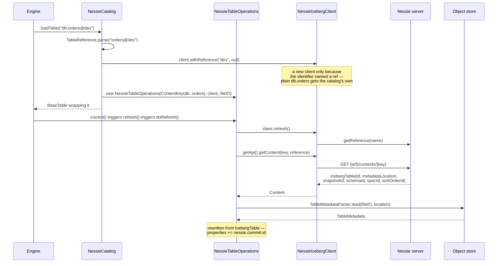

# Chapter 10.1 — `NessieCatalog` and `NessieTableOperations`

<div class="chapter-meta" markdown>
**The question this chapter answers:** when an engine resolves `db.orders@dev`, what code turns that string into a `Table`, and what does committing to it do that committing through a metastore does not?

**Prerequisites:** Chapter 3.3 (`SnapshotProducer` and the commit contract), Chapter 6.1 (the `Catalog` SPI), Chapter 7.2 (`Reference`, `Content`, `Operation`, `ContentKey`)

**Source covered:** `nessie/.../NessieCatalog.java`, `nessie/.../NessieTableOperations.java`, `nessie/.../NessieIcebergClient.java`, `nessie/.../NessieUtil.java`
</div>

## 1. The problem

Every catalog in Part 6 solves the same problem: store one mutable pointer per table, and move it atomically. Hive stores it in a metastore row. `JdbcCatalog` stores it in a table. `HadoopCatalog` stores it in a file name and hopes.

Nessie does not have one mutable pointer per table. It has one mutable pointer per *branch*, and under that branch an immutable tree of content keyed by `ContentKey`. The table's state is a value in that tree. Nothing about a table is mutable; the branch is.

That inversion propagates upward into every method of the integration:

- A `TableOperations` cannot exist until a reference has been chosen, because "the current state of `db.orders`" is not a well-formed question — only "the current state of `db.orders` on `dev`" is.
- `metadata.json` stops being authoritative. The same file is reachable from many commits on many branches, so the pointers *inside* it cannot describe branch-local state.
- The compare-and-swap token is not the previous metadata location. It is a Nessie commit hash.

Two of these three are invisible in the class names. This chapter is about where they actually live in the code.

One point of orientation first, because the name is ambiguous. The classes below ship in the **Iceberg** repository, in the `iceberg-nessie` module (`nessie/src/main/java/org/apache/iceberg/nessie/`). Nessie's own Iceberg integration is a REST *server*, not a `Catalog` implementation; it is Chapter 7.5's subject, and it reappears in 10.2 with a capability this one does not have.

## 2. Where the reference enters



Reference resolution happens *before* table resolution, and it happens per operations object rather than per catalog. `NessieCatalog` itself holds one `client`, but never uses it to build a `TableOperations`:



Three decisions in ten lines.

**The reference is parsed out of the table *name*, not the namespace.** `TableReference.parse(tableIdentifier.name())` accepts `orders@dev` and `orders@dev#a1b2c3d4` — the hash has to be at least eight hex characters, because `Validation.HASH_RAW_REGEX` is `[0-9a-fA-F]{8,64}`; anything shorter is filed as a *timestamp* by `TableReference.parse` and then rejected by the message below. That is why one catalog instance registered in an engine can serve every branch in the repository without reconfiguration — the branch travels in the identifier.

**`client.withReference(...)` returns a new client — but usually it does not.** `NessieIcebergClient.java:114-121` short-circuits on `null == requestedRef` and returns `this`, and `newTableOps` passes `tr.getReference()`, which `TableReference` declares `@Nullable` and leaves null whenever the identifier carries no `@ref`. So for a plain `db.orders` — the common case — every `NessieTableOperations` from one catalog shares the catalog's single memoised `UpdateableReference`. A new client appears only when the identifier names a reference that differs from the current one.

That sharing matters, because the shared object is mutable in place. `doRefresh`'s `client.refresh()` reassigns its `reference` field (`UpdateableReference.java:46`), and after a successful commit `commitContent` does `updateableReference.updateReference(branch)` (`NessieIcebergClient.java:703`). Refreshing or committing one plain-named table therefore *does* move every other plain-named table's view of the branch. What keeps that from corrupting a commit is not isolation between tables — it is the CAS token of section 5, read out of each table's own base metadata rather than out of the shared client.

**The `ContentKey` is built from the Iceberg namespace levels plus the *stripped* table name.** `tr.getName()` is `orders`, not `orders@dev`. The reference is consumed by the parse and does not leak into the key — otherwise every branch would produce a different key for the same table.

`parseTableReference` also rejects one syntax that `TableReference` supports:

> Invalid table name: # is only allowed for hashes (reference by timestamp is not supported)

## 3. `doRefresh()` — where the source of truth changes hands



Read it as three questions asked in order.

**Is the reference still valid?** `client.refresh()` re-reads the branch head. A `NessieNotFoundException` here means the branch itself is gone — someone deleted `dev` — and it is rethrown as an `UncheckedIOException`, not as a table-level error. The distinction matters: a missing branch is not a missing table.

**Does the key exist on this reference?** `getContent().key(key).reference(reference)`. The `null` handling is careful: a null content when `currentMetadataLocation()` is also null means "this is a brand new table", which is legal. A null content when we *did* have a metadata location means the table was dropped underneath us, which is `NoSuchTableException`.

**Is it actually an Iceberg table?** `content.unwrap(IcebergTable.class)`. A `ContentKey` can hold a namespace, a view, or a table; the key namespace is shared. Unwrapping to the wrong type raises `NessieContentNotFoundException` — inside the same `try`, and `NessieContentNotFoundException extends NessieNotFoundException`, which the `catch` three lines down handles. So a caller never sees it: it becomes `NoSuchTableException` when `currentMetadataLocation()` is non-null, and otherwise is swallowed entirely and the refresh continues with `metadataLocation == null`. Asking a view for its table metadata is indistinguishable, from outside, from asking for a table that is not there yet.

Only then does the metadata file get read — and the last argument is the interesting one. `refreshFromMetadataLocation(metadataLocation, null, 2, location -> ...)` passes a *rewrite function*. What comes back from disk is not what becomes the table.

## 4. What Nessie stores about a table

Before the rewrite makes sense, look at what the content object actually holds. It is built on the way out, in `commitTable`:



An `IcebergTable` is six live fields: a content ID, a metadata location, and four Iceberg IDs — `snapshotId` (a `long`), `schemaId`, `specId`, `sortOrderId`. That is the whole of what Nessie's *model* knows about an Iceberg table. The client does not parse the metadata file on Nessie's behalf, does not know what a manifest is, and stores no schema. (Nessie's Iceberg REST *server* does parse it — Chapter 7.5 — which is the distinction 10.4 turns into a whole section.)

Which is exactly enough. Everything a table *has ever been* lives in `metadata.json`; the four IDs pick out which of those the table currently *is*. A branch is then a cheap thing: two branches can share one metadata file and differ only in four integers.

<div class="grid cards" markdown>

-   **Hive / JDBC catalog**

    The metastore holds a metadata location. `metadata.json` holds `current-snapshot-id`. One file, one answer.

-   **Nessie**

    The commit holds the four IDs. `metadata.json` holds the candidates. One file, one answer *per reference*.

</div>

Note also `contentId`: `doCommit` passes `table == null ? null : table.getId()`. A null content ID means "this key is new"; a non-null one must match what the server already has. That identity check is Nessie's, not Iceberg's, and it is what makes a re-created table distinguishable from an updated one.

## 5. The rewrite: Nessie beats the file



The loaded `TableMetadata` has its current schema, sort order, partition spec and snapshot **overwritten** from the Nessie `IcebergTable` content object. `setPreviousFileLocation(null)` does not erase the metadata log — it does the opposite. `buildFrom(base)` seeds `previousFileLocation` with `base.metadataFileLocation` (`TableMetadata.java:997`) so that `build()` will *append* an entry; passing `null` makes `addPreviousFile` return the existing list untouched (`:1785-1787`). The inherited log survives; only the append is suppressed. And `discardChanges()` is not tidiness: `withMetadataLocation` on a builder with non-empty `changes` trips a `Preconditions.checkArgument` at `:1547-1550` — *"Cannot set metadata location with changes to table metadata"* — so the call is required for the rewrite to build at all.

This is the chapter's structural fact. On a metastore catalog, `metadata.json` *is* the table. Here it is a catalogue of everything the table has ever been, and the Nessie content object supplies the selection. That is what makes branching cheap: pointing `dev` at an older snapshot is a new content value under the same key, not a rewritten metadata file.

Two consequences worth naming now, because both come back later:

- `builder.setBranchSnapshot(table.getSnapshotId(), SnapshotRef.MAIN_BRANCH)` installs the snapshot on Iceberg's `main` ref, whatever Nessie reference you are actually on. Iceberg branches and Nessie branches are different namespaces that happen to share a word. Chapter 10.2 shows where that collision bites.
- `newProperties.put(NessieTableOperations.NESSIE_COMMIT_ID_PROPERTY, reference.getHash())` writes the branch hash into the table's properties under the key `nessie.commit.id`. It looks like telemetry. It is the CAS token.

## 6. `doCommit()` — write the file, then race for the branch



The shape is conventional — write the new metadata file, then try to install it — but the `boolean failure` flag is doing precise work. It is set on three paths, all visible in the snippet: `NessieConflictException`, `NessieNotFoundException`, and — in its own clause further down — `NessieBadRequestException`. It is *not* set for `HttpClientException`, which shares a `catch` with the first two. So the `finally` block deletes the metadata file when the commit definitely failed, and leaks it when the outcome is unknown. That is Chapter 3.3's rule — leaked storage is recoverable, a corrupted table is not — implemented in one boolean.

The install itself, two calls down:



`expectedHead` starts as the branch as currently known to this client, and is then *replaced*:

```java
String metadataCommitId =
    properties.getOrDefault(
        NessieTableOperations.NESSIE_COMMIT_ID_PROPERTY, expectedHead.getHash());
if (metadataCommitId != null) {
  expectedHead = Branch.of(expectedHead.getName(), metadataCommitId);
}
```

Those `properties` are the **base** metadata's properties — the ones section 5 stamped when this writer loaded the table. Note the `if (properties != null)` guard the re-quote elides: `commitTable` passes `base != null ? base.properties() : null`, so on a *create* there is no base, the replacement never happens, and the CAS runs against the client's current head instead. For every update, though, the commit is attempted against the branch as it was when the writer read it, not as the client last happened to see it. The optimistic-concurrency token travels with the metadata rather than with the connection, which is what makes it correct when a single client holds several tables at different freshness.

And then the operation itself: `.operation(Operation.Put.of(key, newContent))`. Singular. One key, one commit. Remember the method name — `commitMultipleOperations` — because Chapter 10.2 is about what happens when the list is longer than one.

## 7. Speaking Iceberg's exception vocabulary

Before the code, a word. **"Conflict" does work at three altitudes in this part, and they are not interchangeable.** Iceberg's is the coarsest: a `CommitFailedException` meaning *someone else moved the pointer I was committing against*, with no detail about what they changed. Nessie's API-level `NessieReferenceConflictException` is finer — it carries a list of named per-key conflicts such as `KEY_EXISTS` or `NAMESPACE_ABSENT`. And below both sits the storage layer's `ConflictType`, the five-way classification `checkForConflict` produces per key, which Chapter 9.2 reads and Chapter 10.2 meets again. This section is about the seam between the first two, and the translation is lossy in exactly the direction you would expect.

`SnapshotProducer`'s retry loop only retries `CommitFailedException`, and refuses to delete anything on `CommitStateUnknownException`. Neither exception exists in Nessie's client. Something has to translate:



A reference conflict *usually* becomes `CommitFailedException` — retryable, which is right, because the branch moved and re-applying against the new head is the correct response. Read the first branch, though: a `NessieReferenceConflictException` carrying exactly one conflict of type `NAMESPACE_ABSENT`, `NAMESPACE_NOT_EMPTY`, `KEY_DOES_NOT_EXIST` or `KEY_EXISTS` is specialised instead, into `NoSuchNamespaceException`, `NamespaceNotEmptyException`, `NoSuchTableException` or `AlreadyExistsException` — none of them retryable, because none of them will fix itself on a second attempt. `CommitFailedException` is the fallthrough, not the rule. A vanished reference becomes a plain `RuntimeException` — not retryable, because retrying will not bring the branch back. And any `HttpClientException` becomes `CommitStateUnknownException`, with a comment that explains the deliberate over-catching:

> Intentionally catch all nessie-client-exceptions here and not just the "timeout" variant to catch all kinds of network errors (e.g. connection reset). Network code implementation details and all kinds of network devices can induce unexpected behavior. So better be safe than sorry.

That is the sentence behind the `failure` flag in section 6. The two pieces of code are one decision.

## 8. Gotchas

!!! warning "Iceberg's garbage collection is turned off, on purpose"
    `NessieCatalog.DEFAULT_CATALOG_OPTIONS` pushes `gc.enabled=false` and `write.metadata.delete-after-commit.enabled=false` down as table defaults, and `NessieUtil.checkAndUpdateGCProperties` warns loudly if a table has either enabled. The upstream comment gives the failure mode: *"To prevent accidental deletion of files that are still referenced by other branches/tags... `nessie-gc` CLI provides a reference-aware GC functionality."* The reason is structural. `ExpireSnapshots` reasons over one snapshot lineage; Nessie's history is a DAG over many references, so a file unreachable from `main` may be live on `dev`. Chapter 9.4 covers the reference-aware alternative.

!!! warning "Committing to a tag or a pinned hash fails as an `IllegalArgumentException`"
    `UpdateableReference` computes `mutable = reference instanceof Branch && !hashReference` once, in its constructor. `commitContent` calls `checkMutable()` first, which throws *"You can only mutate tables/views when using a branch without a hash or timestamp."* Note the exception type: `SnapshotProducer` will not retry it, which is correct, but it also means the failure does not look like a commit conflict in logs.

!!! note "A dropped commit always leaks exactly one metadata file"
    The metadata file is written before the Nessie commit is attempted, and the delete in `finally` only fires on a definite failure. A process that dies between the two leaves an orphan. This is unavoidable in the ordering — you cannot reference a file you have not written — and it is why the Nessie-aware GC tool exists rather than Iceberg's orphan-file action.

!!! note "Table locations carry a random UUID"
    `defaultWarehouseLocation` returns `location + "_" + UUID.randomUUID()`, with the comment: *"Different tables with same table name can exist across references in Nessie. To avoid sharing same table path between two tables with same name, use uuid in the table path."* Two branches can each create `db.orders` independently, and they must not share a data directory. The cost is that a table's storage path is no longer derivable from its name.

## Key takeaways

- `NessieCatalog` binds a *reference* before it binds a table: `newTableOps` parses `table@branch#hash` out of the identifier. A table named without an `@ref` shares the catalog's one `UpdateableReference` with every other such table, and that object is mutated in place by refresh and by commit.
- `metadata.json` is not authoritative. `doRefresh` loads it and then overwrites the current schema, spec, sort order and snapshot from the Nessie content object, while leaving the inherited metadata log intact — which is why branching a table costs one content value, not a rewritten metadata file.
- The CAS token is `nessie.commit.id`, stamped into table properties at load time and read back out of the *base* metadata at commit time, so the commit races against the branch the writer actually read.
- `commitContent` sends exactly one `Operation.Put`. The multi-key capability of the underlying API is present but unused on this path.
- `handleExceptionsForCommits` maps Nessie's exceptions onto Iceberg's contract; `HttpClientException` becomes `CommitStateUnknownException`, and the `failure` flag in `doCommit` correspondingly deletes nothing.
- Iceberg's own file cleanup is disabled by default here, because single-lineage GC is unsound over a commit DAG.

## Source map

| What | File |
| --- | --- |
| `NessieCatalog` | [`nessie/.../NessieCatalog.java`](https://github.com/apache/iceberg/blob/apache-iceberg-1.11.0/nessie/src/main/java/org/apache/iceberg/nessie/NessieCatalog.java) |
| `NessieTableOperations` | [`nessie/.../NessieTableOperations.java`](https://github.com/apache/iceberg/blob/apache-iceberg-1.11.0/nessie/src/main/java/org/apache/iceberg/nessie/NessieTableOperations.java) |
| `NessieIcebergClient` | [`nessie/.../NessieIcebergClient.java`](https://github.com/apache/iceberg/blob/apache-iceberg-1.11.0/nessie/src/main/java/org/apache/iceberg/nessie/NessieIcebergClient.java) |
| Metadata rewrite, exception mapping, GC guard | [`nessie/.../NessieUtil.java`](https://github.com/apache/iceberg/blob/apache-iceberg-1.11.0/nessie/src/main/java/org/apache/iceberg/nessie/NessieUtil.java) |
| The mutability rule | [`nessie/.../UpdateableReference.java`](https://github.com/apache/iceberg/blob/apache-iceberg-1.11.0/nessie/src/main/java/org/apache/iceberg/nessie/UpdateableReference.java) |
| The same shape, for views | [`nessie/.../NessieViewOperations.java`](https://github.com/apache/iceberg/blob/apache-iceberg-1.11.0/nessie/src/main/java/org/apache/iceberg/nessie/NessieViewOperations.java) |

**Next:** Chapter 10.2 takes the single `Operation.Put` in `commitContent`, asks what happens when the list holds two, and follows the answer down to the one compare-and-swap that makes two tables change together.
