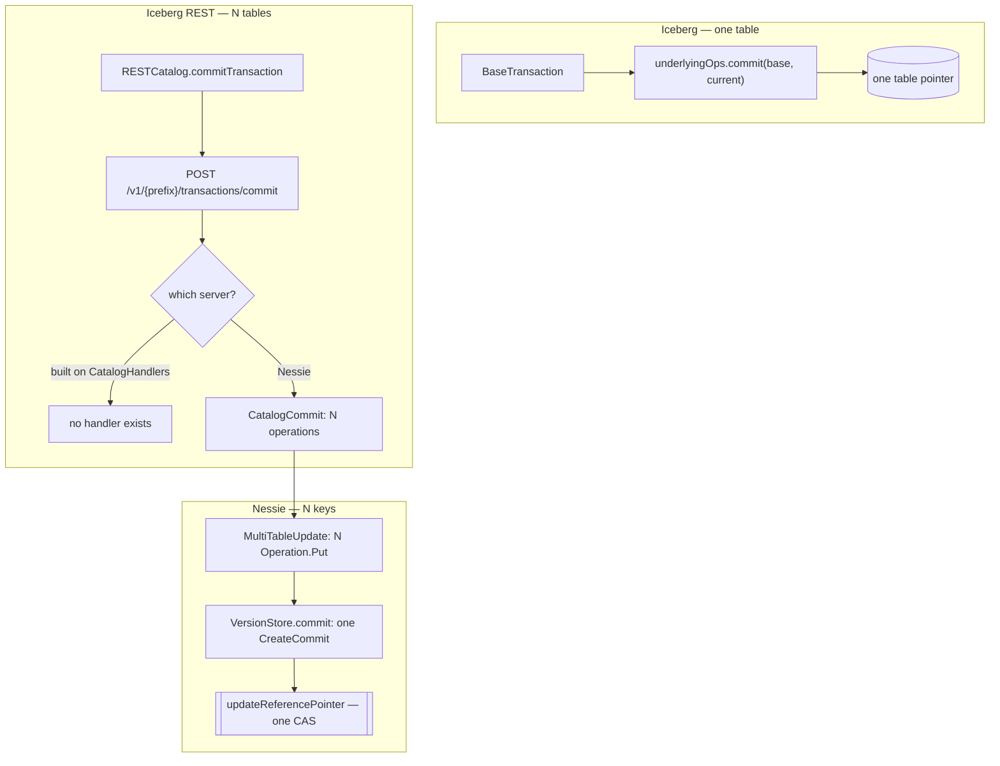
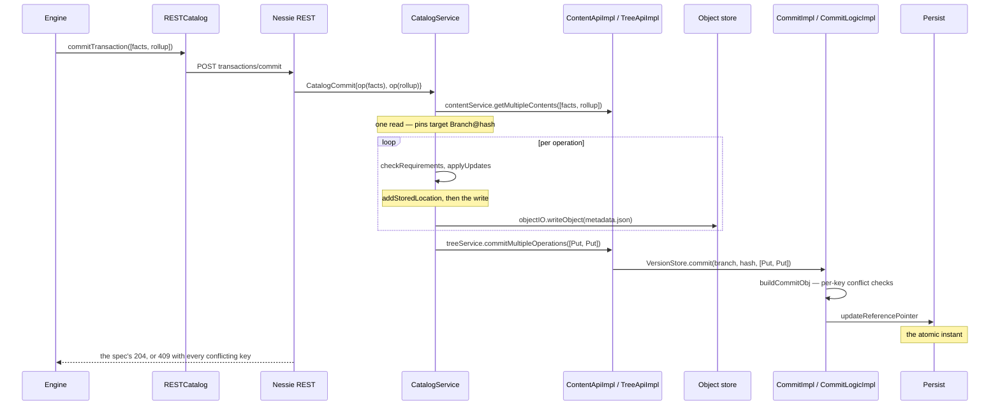

# Chapter 10.2 — Multi-table atomic commits: how they are implemented

<div class="chapter-meta" markdown>
**The question this chapter answers:** `TableOperations.commit` moves one table's pointer. What code makes a change to two tables land together, and which single instruction is the atomic one?

**Prerequisites:** Chapter 6.4 (the multi-table gap), Chapter 6.3 (the requirements-and-updates payload, and how a client learns an endpoint exists), Chapter 8.4 (references and CAS), Chapter 9.1 (`Operation` to `CommitObj`, and the head/expected index pair), Chapter 9.2 (the five conflict types), Chapter 10.1 (the single-`Put` path)

**Source covered:** `core/.../BaseTransaction.java`, Nessie's `catalog/service/rest/`, `catalog/service/impl/`, `versioned/storage/`
</div>

## 1. The problem

Part 6 ends on a gap. Iceberg's commit protocol gives you a genuinely atomic swap — for one table. Nothing in the model composes two of them. Update a fact table and its aggregate together and you get two commits, two windows, and two independent chances to fail. Readers between the two see a state that never existed as far as your pipeline was concerned.

The workarounds are all bad in the same way. Commit in a fixed order and hope nobody reads in between. Write to staging tables and swap. Add a "generation" column and filter. Each of these is a way of *encoding* atomicity into data because the catalog would not provide it.

This chapter shows the code that provides it. The mechanism is not a distributed transaction and not two-phase commit. It is much smaller than that: one Nessie commit carries a list of operations against several content keys, and installing it is one compare-and-swap on one reference pointer.

Before the mechanism, it is worth being exact about where Iceberg's ceiling is — because it is not where most readers assume.

## 2. Two ceilings, one floor



The `R4` node is not a rhetorical flourish. Iceberg ships a reference server-side implementation of the REST spec in `CatalogHandlers`, and that class has no `commitTransaction` method at all. Its update entry point is `updateTable(Catalog catalog, TableIdentifier ident, UpdateTableRequest request)` — a single identifier, delegating to a `Catalog`. There is no seam where a second table could join, because `Catalog` cannot express the request. A REST catalog built the obvious way therefore cannot serve the endpoint the spec defines, whatever else it supports.

## 3. Where Iceberg stops

`Transaction` is the Iceberg API that *sounds* like it should stack tables. It does not:



Sixty-eight lines, and the two that matter are inside the retried lambda:

```java
applyUpdates(underlyingOps);
underlyingOps.commit(base, current);
```

`Tasks.foreach(ops)` iterates over exactly one thing: `ops`, the transaction's single `TableOperations`. What a `Transaction` composes is *operations on one table* — an append and a schema change landing in one metadata file, one snapshot, one swap. That is a real and useful guarantee, and it is not the multi-table one.

Everything else in the method reinforces the reading. `base` and `current` are one table's metadata. `startingSnapshots` is one table's snapshot set. The post-commit cleanup compares against `committedFiles(ops, newSnapshots)` — again, one `ops`. There is no plural anywhere.

So the ceiling is in `core`, not in the REST layer. `Catalog` has no multi-table commit; `commitTransaction` exists only on `RESTCatalog` and `RESTSessionCatalog`, is not an `@Override` of anything, and begins by asking permission:



The client can *send* a multi-table commit. Whether it is atomic is entirely the server's problem.

## 4. Fan-in: N table changes become one commit

Nessie's Iceberg REST server implements the endpoint. Here is the whole of it:



Read the `map` closely. Each `tableChange` — an Iceberg identifier plus its `requirements` and `updates` — becomes an `IcebergCatalogOperation` whose `key` is `tableChange.identifier().toNessieContentKey()`. Iceberg's table identifiers become Nessie content keys, and the list of them becomes a single `CatalogCommit`.

That is the entire translation. There is no coordinator, no lock manager, no transaction ID. The Iceberg request shape — a list of per-table changes with per-table preconditions — happens to be exactly the shape of a Nessie commit, and the resource method is short because there is nothing to reconcile.

`CatalogServiceImpl.commit` then does the per-table work. It reads every key once (`getMultipleContents(allKeys)`), checks that the effective reference is a branch — *"Can only commit to a branch, but %s %s"* — and pins a target `Branch` at either the client's requested hash or the head it just read. Then, for each operation in turn: verify the Iceberg requirements, apply the metadata updates, write a new `metadata.json` to object storage, and hand the result to the accumulator:



One `Operation.Put` per content key, appended to a single `Operations` builder. `checkState(!committed, "Already committed")` guards the obvious mistake.

At this point every table's new metadata file exists in storage and nothing is visible to any reader. The commit itself:



`treeService.commitMultipleOperations(branch, hash, operations, meta)`. One call, once, for the whole transaction. That is the multi-table machinery in its entirety — a list and a method call. Recall from Chapter 10.1 that `NessieIcebergClient.commitContent` calls the same API with a list of length one. The capability was always in the protocol; this path is the one that uses it.

The ordering is what makes the whole thing work, and it is worth seeing end to end:



All storage writes happen before the commit and none of them are reachable until it lands. Note the order inside the loop: `storeSnapshot` calls `multiTableUpdate.addStoredLocation(...)` *before* `objectIO.writeObject(...)`, not after. That is what makes the cleanup sound — a location is on the delete list before the byte that might need deleting exists, so a crash between the two lines leaves a name for something that was never written rather than a file nobody remembers. If anything in the loop throws, the `whenComplete` handler deletes what was written and no reader ever saw a byte of it.

## 5. Where it becomes atomic

The commit request reaches `TreeApiImpl.commitMultipleOperations`, which resolves the expected hash and calls `VersionStore.commit(branch, Optional.of(hash), meta, operations, validator, callback)`. Down in the version store, `CommitImpl.commitAddOperations` folds all N operations into a single `CreateCommit` — processing every `Delete` before every `Put`, and rejecting a key that appears twice — and `CommitLogicImpl.buildCommitObj` turns that into one `CommitObj`.

Building it is where preconditions are enforced, per key:



`expectedValue` is what the client's tree said this key held; `existingContent` is what the branch head says it holds now. Five ways for those to disagree, each named: the key was created underneath you (`KEY_EXISTS`), removed underneath you (`KEY_DOES_NOT_EXIST`), or changed underneath you (`PAYLOAD_DIFFERS`, `CONTENT_ID_DIFFERS`, `VALUE_DIFFERS`).

Those two values come from two different trees, and the split is the reason this scheme is precise rather than merely safe. `BaseCommitHelper`'s constructor keeps both: `head` is the branch's current head commit, and `expected` is the commit at the hash the client sent — resolved by `commitInChain` when they differ, with a comment noting the load doubles as validation that the hash exists. `CommitImpl` then builds a `headIndex` and an `expectedIndex` from them.

They are not read at the same moment, and by the time `checkForConflict` runs, one of them is long gone. `expectedValue` is read **earlier and in a different class**: `commitAddPut`, `commitAddDelete` and `commitAddUnchanged` each take `expectedIndex()` while `CommitImpl` is still assembling the `CreateCommit`, and the value they find travels *on the operation*. `existingContent` is read later, here in `CommitLogicImpl.buildCommitObj`, out of `fullIndex` — the index built from the parent chain, which is the head, because the commit is parented on `headId()`. So `checkForConflict` is not comparing two live lookups; it is comparing a value carried in from the client's tree against a fresh read of the branch's.

The consequence is that the comparison is per key rather than per branch. Another writer committing to the same branch does not make these two disagree unless it touched one of *your* keys. A branch is not a lock.

Crucially, a conflict on one key does not short-circuit. `buildCommitObj` collects them:



If the list is non-empty the whole commit dies and the client is told about every conflicting key at once. If it is empty, one `CommitObj` exists describing all N tables. Same accumulate-then-throw shape Iceberg uses in `Schema.checkCompatibility`, for the same reason: one round trip should tell you everything that is wrong.

Then, finally, the atomic instruction:



`persist.updateReferencePointer(reference, newHead)`. One conditional update of one pointer. Before it, the new commit object exists but nothing references it; after it, all N tables are visible in their new state. There is no instant at which one has moved and another has not, because there is only one instruction that moves anything.

That is the whole answer, and its shape is worth stating plainly: **multi-table atomicity is not a feature Nessie adds. It is what you get for free once the unit of commit stops being a table.**

## 6. Gotchas

!!! warning "Atomic in the catalog, not in the object store"
    All N `metadata.json` files are written *before* the commit and are unreferenced until it lands. `CatalogServiceImpl.commit` attaches a `whenComplete` handler that calls `objectIO.deleteObjects(multiTableUpdate.storedLocations())` on failure — best effort. A process that dies between the writes and the commit orphans every file it wrote. Atomicity here is a claim about what readers can observe, never about what exists in storage.

!!! warning "`assert-ref-snapshot-id` must name `main`"
    `IcebergUpdateRequirement.AssertRefSnapshotId.checkForTable` opens with `checkState("main".equals(ref()), ...)` and fails with *"Requirement failed: ref must be 'main', but is '%s'"*. The upstream comment explains: *"Cannot really check the reference name, because the ref-name in a table-metadata is something very different from Nessie references."* Iceberg branches live inside `metadata.json`; Nessie branches live in the version store. This is the same namespace collision Chapter 10.1 met when `setBranchSnapshot` installed every snapshot on Iceberg's `main` ref regardless of the Nessie reference in play.

!!! warning "Concurrency cost and failure have different triggers"
    Two mechanisms, easily conflated. `bumpReferencePointer` catches `RefConditionFailedException` and throws `RetryException`, which `CommitRetry.commitRetry` turns into a fresh attempt against the new head — so *any* concurrent commit on the branch costs a retry, even one touching unrelated tables. A *conflict* only materialises when `checkForConflict` finds one of this commit's own keys changed. Cost scales with branch traffic; failure follows only from key overlap.

!!! note "An unknown outcome does not become an unknown outcome per table"
    `bumpReferencePointer` can return without knowing whether its write landed, and Chapter 8.4 §4 covers what it does about that. The point worth making *here* is that the uncertainty does not multiply: whatever it is, it is one uncertainty about one row, not one per table in the transaction. A five-table commit that ends in an indeterminate state ends in a single indeterminate state, and resolving it resolves all five. Compare `CommitStateUnknownException` in Chapter 3.3, which is per table by construction — five tables committed in a loop can leave five independent unknowns, and no amount of care at the client can merge them into one question.

!!! note "Two updates to the same table in one transaction are rejected"
    `CommitImpl.commitAddOperations` calls `checkDuplicateKey`, which throws *"Duplicate key in commit operations: "* plus the key. The single exemption is a `Delete` followed by a `Put` with no content ID — the rename and re-add shape. A client that batches two changes to one table into a transaction gets an error, not a merge.

!!! note "This path is not reachable through `NessieCatalog`"
    The Java catalog from Chapter 10.1 has no `commitTransaction` and its `commitContent` sends one `Operation.Put`. Multi-table commits require talking to Nessie through `RESTCatalog`. The one place `iceberg-nessie` does send two operations in a single commit is `NessieIcebergClient.renameContent`, which pairs a `Delete` and a `Put` so that a rename cannot be observed half-done — proof that the mechanism was always available, just never exposed as a transaction API.

## Key takeaways

- Iceberg's one-table ceiling is in `core`, not in the REST layer: `BaseTransaction` drives a single `TableOperations` and calls `commit(base, current)` once. `Catalog` has no multi-table commit at all.
- The REST spec defines an atomic multi-table endpoint, but Iceberg's own `CatalogHandlers` implements no handler for it — a server built on a `Catalog` cannot serve it.
- Nessie's server translates N Iceberg table changes into N `Operation.Put`s against N `ContentKey`s and issues one `commitMultipleOperations`.
- Preconditions are per key and are accumulated: any conflicting key aborts the whole commit, and the client is told about all of them at once.
- The atomic instruction is `persist.updateReferencePointer` — one conditional pointer update. Nothing else in the path is atomic and nothing else needs to be.
- Multi-table atomicity is a consequence of the unit of commit being a reference rather than a table, not a feature layered on top.

## Source map

| What | File |
| --- | --- |
| Iceberg's one-table transaction | [`core/.../BaseTransaction.java`](https://github.com/apache/iceberg/blob/apache-iceberg-1.11.0/core/src/main/java/org/apache/iceberg/BaseTransaction.java) |
| REST client entry point | [`core/.../rest/RESTSessionCatalog.java`](https://github.com/apache/iceberg/blob/apache-iceberg-1.11.0/core/src/main/java/org/apache/iceberg/rest/RESTSessionCatalog.java) |
| The endpoint in the spec | [`open-api/rest-catalog-open-api.yaml`](https://github.com/apache/iceberg/blob/apache-iceberg-1.11.0/open-api/rest-catalog-open-api.yaml) |
| Reference handlers — no `commitTransaction` | [`core/.../rest/CatalogHandlers.java`](https://github.com/apache/iceberg/blob/apache-iceberg-1.11.0/core/src/main/java/org/apache/iceberg/rest/CatalogHandlers.java) |
| Nessie's REST resource | [`catalog/service/rest/.../IcebergApiV1GenericResource.java`](https://github.com/projectnessie/nessie/blob/nessie-0.108.4/catalog/service/rest/src/main/java/org/projectnessie/catalog/service/rest/IcebergApiV1GenericResource.java) |
| Per-table work and file writes | [`catalog/service/impl/.../CatalogServiceImpl.java`](https://github.com/projectnessie/nessie/blob/nessie-0.108.4/catalog/service/impl/src/main/java/org/projectnessie/catalog/service/impl/CatalogServiceImpl.java) |
| The single commit | [`catalog/service/impl/.../MultiTableUpdate.java`](https://github.com/projectnessie/nessie/blob/nessie-0.108.4/catalog/service/impl/src/main/java/org/projectnessie/catalog/service/impl/MultiTableUpdate.java) |
| Iceberg requirement checks | [`catalog/format/iceberg/.../IcebergUpdateRequirement.java`](https://github.com/projectnessie/nessie/blob/nessie-0.108.4/catalog/format/iceberg/src/main/java/org/projectnessie/catalog/formats/iceberg/rest/IcebergUpdateRequirement.java) |
| Operations into one commit object | [`versioned/storage/store/.../CommitImpl.java`](https://github.com/projectnessie/nessie/blob/nessie-0.108.4/versioned/storage/store/src/main/java/org/projectnessie/versioned/storage/versionstore/CommitImpl.java) |
| Per-key conflict detection | [`versioned/storage/common/.../CommitLogicImpl.java`](https://github.com/projectnessie/nessie/blob/nessie-0.108.4/versioned/storage/common/src/main/java/org/projectnessie/versioned/storage/common/logic/CommitLogicImpl.java) |
| The CAS and the retry loop | [`versioned/storage/store/.../BaseCommitHelper.java`](https://github.com/projectnessie/nessie/blob/nessie-0.108.4/versioned/storage/store/src/main/java/org/projectnessie/versioned/storage/versionstore/BaseCommitHelper.java), [`versioned/storage/common/.../CommitRetry.java`](https://github.com/projectnessie/nessie/blob/nessie-0.108.4/versioned/storage/common/src/main/java/org/projectnessie/versioned/storage/common/logic/CommitRetry.java) |

**Next:** Chapter 10.3 asks what else "implements the REST catalog spec" leaves to the server, and how to read any catalog's real capability surface out of its own source.
