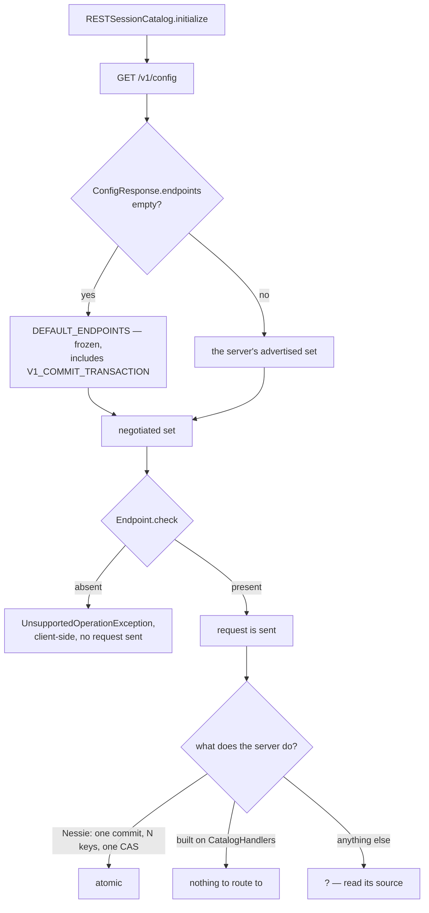

# Chapter 10.3 — Nessie, Polaris, and Lakekeeper compared

**The question this chapter answers:** three catalogs all "implement the Iceberg REST spec" — what does that sentence actually guarantee, and where in the source do you look to find out what a given one will refuse to do?

**Prerequisites:** Chapter 6.3 (the REST catalog spec and `RESTSessionCatalog`), Chapter 7.5 (Nessie as an Iceberg REST catalog), Chapter 10.2 (what Nessie does behind `transactions/commit`)

**Source covered:** `open-api/rest-catalog-open-api.yaml`, `core/.../rest/CatalogHandlers.java`, `core/.../rest/Endpoint.java`, `core/.../rest/RESTSessionCatalog.java`, Nessie's `catalog/service/rest/`

## 1. The problem, and what this chapter can honestly claim

!!! warning "Two levels of confidence in this chapter"
    Apache Iceberg and Project Nessie are vendored at pinned tags, so every claim about them here is injected from source you can open. **Apache Polaris and Lakekeeper are not vendored.** Nothing in this book can verify a claim about their code, and this chapter will not make one. Section 7 is fenced off for exactly that reason and says almost nothing about them — deliberately. What it gives you instead is the procedure to answer the question yourself, against whatever version you are actually running.

That constraint turns out to be the chapter's subject rather than its limitation.

"Implements the Iceberg REST catalog spec" reads like a binary property, and it is not one. The spec is a menu. It defines about thirty endpoints, several of them optional in practice, and it repeatedly specifies *what a server must do* without specifying *how* — most consequentially for `transactions/commit`, where the word doing all the work is "atomic". A server can implement the path, return `204`, and provide no atomicity whatsoever. The spec cannot stop it. Chapter 10.2 showed one server that genuinely provides it and one class of server that structurally cannot.

So the useful question is never "does catalog X implement the REST spec". It is: **which endpoints does it serve, and what does it do behind the ones I care about?** Both halves are answerable from source, in every case, including for catalogs this book has never seen.

## 2. What the spec fixes, and what it leaves open



Read the summary line: *"Commit updates to multiple tables in an atomic operation."* Then read the description, which is precise about the request shape — a table identifier, requirements to validate, updates to apply — and completely silent about mechanism. It even pins down an error contract elsewhere in the same block (`409` for failed requirements, `500` when *"the commit state is unknown"*), which tells you the authors understood exactly how hard the guarantee is.

This is the right way to write a spec. It is also why "spec-compliant" cannot mean what a procurement checklist wants it to mean. The spec states an obligation; the source is where you find out whether it is met.

## 3. What the reference implementation can serve

Iceberg ships server-side handlers so that anyone can put a REST façade over an existing `Catalog`. That class is the fastest way to see the shape of the constraint:



`(Catalog catalog, TableIdentifier ident, UpdateTableRequest request)`. One identifier. The method reaches through the `Catalog` for a `TableOperations` and commits it — including, in the create case, a comment cheerfully admitting *"this is a hacky way to get TableOperations for an uncommitted table"*.

Now the negative result, which is the load-bearing one: **`CatalogHandlers` contains no `commitTransaction` method.** Not a stub, not an unsupported-operation throw — no handler at all. A REST catalog assembled the obvious way, by wrapping a `Catalog` in these handlers, has nothing to route `POST /v1/{prefix}/transactions/commit` to. And it could not fix that locally, because `Catalog` has no method that accepts several tables.

That single fact partitions the catalog landscape more sharply than any feature table. A server either has its own commit path underneath the REST layer, or it inherits Iceberg's per-table one and the multi-table endpoint is out of reach.

## 4. How a client finds out — and what it assumes when it cannot

The negotiation itself is the `/v1/config` response. When a server advertises nothing, the client does not degrade to a minimum — it assumes a fixed historical set:



The comment explains why the list is frozen: legacy servers predate the advertisement mechanism, so the set has to describe what a server from that era was assumed to do. Note what is in it. Of the fourteen `.add(...)` calls, `V1_COMMIT_TRANSACTION` is the last. **A silent server is assumed to support multi-table commits.**

Note also what is *not* in it: none of the three `HEAD` existence endpoints — `V1_TABLE_EXISTS`, `V1_NAMESPACE_EXISTS`, `V1_VIEW_EXISTS`. A client talking to a silent server is therefore assumed to be able to commit two tables atomically and assumed *not* to be able to ask whether one table exists. The two assumptions point in opposite directions, and both are frozen.

When the assumption is wrong, this is the failure:



Six lines, and worth reading carefully because of where they run. This is client-side, before any request is sent, against the negotiated set. The message says *"Server does not support endpoint"*, but the client never asked the server — if the set came from `DEFAULT_ENDPOINTS`, the sentence is a statement about a hardcoded list. Read it as "my client believes the server does not support", which is a different and much weaker claim, and one you can fix from the client side.

## 5. What Nessie declares

Nessie does advertise, and it does so as a plain list of constants:



Six namespace endpoints, `V1_COMMIT_TRANSACTION`, ten table endpoints, seven view endpoints. This is a capability surface stated in code rather than prose, and it can be diffed against `Endpoint`'s constants in Iceberg to find the gaps precisely. One example readable directly from the block above: Iceberg defines `V1_REGISTER_VIEW`; Nessie's list has view create, load, list, exists, update, delete and rename, and no view registration.

The most useful part is a few lines earlier, and it is a comment:



Three path constants, defined and then deliberately kept out of `ENDPOINTS`, under a bare `// NOT implemented`. These are the server-side scan-planning endpoints — the ones that let a catalog plan a scan on the client's behalf. Nessie names them, declines them, and says so in the source.

This is what an honest capability statement looks like, and it is the thing to go looking for in any catalog. A project that maintains a list like this is telling you the truth about itself in a form that cannot drift from the implementation.

Where that list becomes a response is worth one more snippet, because Nessie does something the spec does not require:



`configResponse.endpoints(ENDPOINTS)` is the constant list going out on the wire. The `@Path("{reference}/v1/config")` above it is the part the spec never asked for: the same handler is mapped a second time under a Nessie reference, so pointing a stock client's URI at `…/iceberg/mybranch/` produces a config response whose `prefix` default names that branch. The advertised capability surface is identical either way; the reference is not.

### An endpoint is a verb and a path, not a name

Diffing two capability lists sounds like set subtraction on constant names. It is not, and `Endpoint`'s own fields say why:



Two constants can name the same path and differ only in method — `V1_FETCH_TABLE_SCAN_PLAN` is `GET` on the scan-plan path and `V1_CANCEL_TABLE_SCAN_PLAN` is `DELETE` on the same one — so Nessie's three declined *paths* cover four of Iceberg's declined *endpoints*. And two projects can name the same endpoint differently: Iceberg's `V1_TABLE_CREDENTIALS` (`GET .../credentials`) is Nessie's `V1_LOAD_CREDENTIALS`. Diff on the pair, never on the identifier. The wire format agrees — the spec describes each entry as *"&lt;HTTP verb&gt; &lt;resource path from OpenAPI REST spec&gt;"*, and the client splits it on a space.

### The endpoint list is not the only thing negotiated

Two other things arrive in the same `/v1/config` response, and each has its own default direction.

The first is `defaults` and `overrides`, whose precedence `ConfigResponse.merge` fixes as *"overrides, then client properties, and then defaults"*. A server can therefore silently win an argument with a client setting — a capability no endpoint list mentions.

The second runs opposite to the endpoint list. `idempotency-key-lifetime` is a field whose *presence* is the capability: the spec says *"Presence of this field indicates the server supports Idempotency-Key semantics for mutation endpoints. If absent, clients MUST assume idempotency is not supported."* The client obliges — `RESTSessionCatalog.java:219-222` installs an idempotency-header supplier only when the field is non-null. So silence about endpoints means "assume the frozen set"; silence about idempotency means "assume none". Grepping Nessie's `catalog/` tree for `idempotency` returns nothing, so a stock client against Nessie sends no such header.

And the degradation path is not always an exception. `Endpoint.check` refuses; `tableExists` negotiates:



Absent the `HEAD` endpoint it falls back to a load-based check, under the comment *"fallback in order to work with 1.7.x and older servers"* — which is exactly the case a silent server produces, since `V1_TABLE_EXISTS` is not in `DEFAULT_ENDPOINTS`. Reading `Endpoint.check` alone and concluding "unadvertised means unusable" gets this one backwards.

## 6. The comparison that can be made from source

Two of the four positions on the board are fully verifiable here.

| Question to ask the source | Iceberg's `CatalogHandlers` | Nessie |
| --- | --- | --- |
| What is the smallest thing the server commits? | One table, via `TableOperations` | One commit on a reference, carrying N operations over N content keys |
| What makes that step atomic? | Whatever the wrapped `Catalog` provides | `Persist.updateReferencePointer` — one CAS |
| Is `transactions/commit` served? | No handler exists in the class | Yes, `IcebergApiV1GenericResource.commitTransaction` |
| What is advertised at `/v1/config`? | Whatever the embedding server chooses | An explicit `ENDPOINTS` list |
| What does it admit it does not do? | — | Server-side scan planning, marked in source |
| Which Iceberg spec versions can it parse? | Any that `iceberg-core` supports | v1 and v2 only — Chapter 10.4 |

Those six questions are the chapter's actual deliverable. They are answerable against any catalog's repository in under an hour, and the answers do not go stale in the way a feature matrix does — because you re-derive them against the version you are running.

## 7. Polaris and Lakekeeper

!!! warning "Not source-verified — read this differently from the rest of the book"
    Apache Polaris and Lakekeeper are not vendored in this book. No claim below is resolved against a pinned tag, nothing here was injected from source, and none of it carries the authority of the nine injected snippets above it. This section exists to hand you the questions, not the answers.

Both are Iceberg REST catalog implementations under active development, and both are worth evaluating. This book will not tell you how either one commits, what either one advertises at `/v1/config`, or whether either one implements `transactions/commit` atomically — because it cannot check, and a plausible-sounding paragraph placed next to a page of injected snippets would borrow an authority it has not earned.

What you can do instead, in their repositories, is run section 6's table — six questions, six searches:

1. **Find the multi-table path.** Search for the literal string `transactions/commit`. If the only thing that answers it is Iceberg's `CatalogHandlers`, the endpoint is not served. If there is a handler, follow it.
2. **Find the last write.** Trace that handler to the final storage write before the response is produced. Whatever that write is — a row update, a conditional put, a database transaction — *that* is the atomic step, and its scope is the real answer to "is this atomic".
3. **Find the endpoint list.** Look for the constants that populate `ConfigResponse.endpoints`. Diff them against `Endpoint`'s constants in `iceberg-core`. Anything missing is a client-side `UnsupportedOperationException` waiting to happen.
4. **Find the format-version ceiling.** Look for any `switch` or enum over `format-version`. Chapter 10.4 shows what that looks like when a server parses metadata itself.
5. **Find the format-version answer for each door.** A project that both hosts an Iceberg REST server and ships a `Catalog` client can answer differently on each. Chapter 10.4 shows exactly that, in one project at one version.
6. **Find what they admit.** Search the source for the equivalent of Nessie's `// NOT implemented`. Its presence or absence is itself informative.

A catalog whose unit of commit is a row in a relational database gets multi-table atomicity from a database transaction. One whose unit of commit is a reference gets it from a pointer swap, as Chapter 10.2 showed. One whose unit of commit is a `Catalog` call gets it from nothing. Which of these describes any particular product is a question for its source tree, not for this book.

## 8. Gotchas

!!! warning "A silent server is assumed to be a capable one"
    An empty `ConfigResponse.endpoints` does not mean "minimal server". It means `DEFAULT_ENDPOINTS`, which includes `V1_COMMIT_TRANSACTION`, `V1_REGISTER_TABLE` and `V1_REPORT_METRICS`. The list cannot be trimmed without breaking genuinely old servers, so it will keep asserting capabilities that a new minimal server may not have.

!!! warning "Table and view endpoints have opposite defaults"
    `VIEW_ENDPOINTS` is merged into the assumed set only when `view-endpoints-supported` is true, and `VIEW_ENDPOINTS_SUPPORTED_DEFAULT` is `false`. So in the no-advertisement case, table endpoints are assumed present and view endpoints are assumed absent. Two switches, opposite defaults, one silent negotiation — a reliable source of "views work against catalog A but not catalog B".

!!! note "`Endpoint.check` names the wrong culprit"
    It throws before contacting the server, on the basis of a set that may have been invented client-side. When this exception appears, the first thing to check is whether the server advertised anything at all — not whether the server supports the feature.

!!! note "Serving an endpoint and honouring it are different claims"
    Nothing in the protocol distinguishes a server that commits N tables atomically from one that loops and commits them individually. Both return `204`. This is the one property in the whole spec that a client cannot test for, which is precisely why it has to be read out of source.

## Key takeaways

- "Implements the REST catalog spec" is a set of claims, not one. The spec fixes request and error shapes and deliberately leaves mechanism to the server — `transactions/commit` says "atomic" and stops there.
- Iceberg's own `CatalogHandlers` has no `commitTransaction` handler, and could not have one: `Catalog` cannot express a multi-table request. That splits catalogs into those with their own commit path and those without.
- Capability is negotiated at `/v1/config`; when a server advertises nothing, the client assumes a frozen historical set that includes multi-table commits.
- `Endpoint.check` fails client-side against the negotiated set, so its message describes the client's belief rather than the server's behaviour.
- Nessie states its surface as a list of constants and marks the scan-planning endpoints `// NOT implemented`. That form of honesty is what to look for in any catalog.
- An endpoint is a `(verb, path)` pair, so a capability diff done on constant names is wrong twice over: one path can carry two endpoints, and two projects can name one endpoint differently.
- Claims about Polaris and Lakekeeper are not made here because they cannot be verified here. The six questions in section 7 are the substitute, and they are more durable than an answer would have been.

## Source map

| What | File |
| --- | --- |
| The REST catalog spec | [`open-api/rest-catalog-open-api.yaml`](https://github.com/apache/iceberg/blob/apache-iceberg-1.11.0/open-api/rest-catalog-open-api.yaml) |
| Endpoint constants and `check` | [`core/.../rest/Endpoint.java`](https://github.com/apache/iceberg/blob/apache-iceberg-1.11.0/core/src/main/java/org/apache/iceberg/rest/Endpoint.java) |
| Client negotiation and defaults | [`core/.../rest/RESTSessionCatalog.java`](https://github.com/apache/iceberg/blob/apache-iceberg-1.11.0/core/src/main/java/org/apache/iceberg/rest/RESTSessionCatalog.java) |
| Reference server-side handlers | [`core/.../rest/CatalogHandlers.java`](https://github.com/apache/iceberg/blob/apache-iceberg-1.11.0/core/src/main/java/org/apache/iceberg/rest/CatalogHandlers.java) |
| Path constants for the spec | [`core/.../rest/ResourcePaths.java`](https://github.com/apache/iceberg/blob/apache-iceberg-1.11.0/core/src/main/java/org/apache/iceberg/rest/ResourcePaths.java) |
| Client-side REST properties | [`core/.../rest/RESTCatalogProperties.java`](https://github.com/apache/iceberg/blob/apache-iceberg-1.11.0/core/src/main/java/org/apache/iceberg/rest/RESTCatalogProperties.java) |
| Config-response merge precedence | [`core/.../rest/responses/ConfigResponse.java`](https://github.com/apache/iceberg/blob/apache-iceberg-1.11.0/core/src/main/java/org/apache/iceberg/rest/responses/ConfigResponse.java) |
| Nessie's Iceberg REST resource | [`catalog/service/rest/.../IcebergApiV1GenericResource.java`](https://github.com/projectnessie/nessie/blob/nessie-0.108.4/catalog/service/rest/src/main/java/org/projectnessie/catalog/service/rest/IcebergApiV1GenericResource.java) |

**Next:** Chapter 10.4 applies the same method to format versions instead of endpoints — where v3 support actually stops in each of these two trees, and what it takes to move it.
