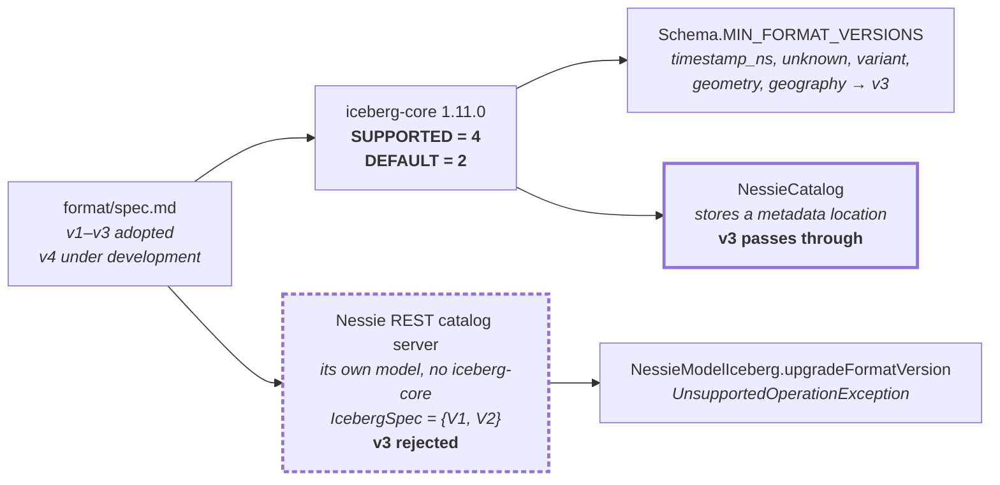

# Chapter 10.4 — V3 adoption and contributing upstream

**The question this chapter answers:** at `apache-iceberg-1.11.0` and `nessie-0.108.4`, which parts of format v3 can you actually use end to end — and what is the real process for changing that?

**Prerequisites:** Chapter 2.2 (`metadata.json` and the format-version constants), Chapter 2.5 (what v3 *is*), Chapter 10.1 (why `NessieCatalog` never parses metadata), Chapter 10.3 (answer capability questions from source, not from a README)

**Source covered:** `format/spec.md`, `core/.../TableMetadata.java`, `api/.../Schema.java`, `site/docs/status.md`, Nessie's `catalog/format/iceberg/`, and both projects' contribution documents

## 1. The problem

"Does it support v3" is not one question, because a format version is adopted in four independent places: the specification, the reference library, each catalog, and each engine. Nothing forces those four to move together, and at the tags pinned in this book they demonstrably have not.

That is not a defect. Staged adoption is what a format version looks like while it is being adopted, and the useful thing about Iceberg and Nessie is that every stage boundary is a constant, an enum, or a `throw` that you can go and read. Chapter 10.3 answered "which endpoints does this catalog serve" that way. This chapter does the same for format versions, and then asks the follow-on question — what it takes to move one of these gates — using each project's own contribution rules rather than generic advice about opening pull requests.

## 2. Four gates, four different answers

Two of those boxes are the same project, at the same version. Which one you are talking to depends on which endpoint your engine is pointed at, and section 7 is that story.

Note where `NREST` hangs from. It is a child of the *spec*, not of the library, and that is not a drafting convenience: no `src/main` file anywhere under Nessie's `catalog/` imports `org.apache.iceberg` at all, and `catalog/format/iceberg/build.gradle.kts` names `iceberg-core` only in an Avro codegen source set (`:50`) and in test fixtures (`:73`). Nessie's server reads the specification and implements it; it does not link the reference implementation. That is why its ceiling can differ from `iceberg-core`'s — and why `NessieCatalog`, which *is* an iceberg-core module, inherits the library's answer instead.

## 3. What the spec says, at this tag

Start at the primary source. The status line is two sentences over three lines — the middle one is blank — and it is unambiguous:



So v3 is adopted, and v4 exists as a work in progress that the library already has a constant for. Now the feature list, which is what "v3" means in one place:



Ten capabilities, in six bullets — five new types on the first bullet, five features on the five after it. Chapter 2.5 explains how they work; this chapter only counts them and then goes looking for where each one is gated. Note the shape of the list: some entries are types (`variant`, `geometry`, nanosecond timestamps), some are metadata structures (row lineage, deletion vectors, encryption keys), and one is a semantic change to existing structures (multi-argument transforms). They are gated in different places, which is the first hint that "v3 support" is not a single switch.

## 4. The library: supported is not default



Three of these constants tell the whole adoption story.

`SUPPORTED_TABLE_FORMAT_VERSION = 4`: the Java library will read and write up to v4, one version beyond what the spec calls adopted. `DEFAULT_TABLE_FORMAT_VERSION = 2`: a table created without an explicit `format-version` is v2. Chapter 2.2 flagged that gap while reading `metadata.json`; here is what it costs. **Upgrading your Iceberg dependency to 1.11.0 does not start producing v3 tables.** `newTableMetadata` reads `TableProperties.FORMAT_VERSION` with `DEFAULT_TABLE_FORMAT_VERSION` as its fallback, so v3 is opt-in per table, at creation or by an explicit upgrade.

`MIN_FORMAT_VERSION_ROW_LINEAGE = 3` is the interesting one. One v3 feature has been given its own named minimum in `TableMetadata`, rather than living in the general type gate of section 5, because row lineage changes the *snapshot* structure rather than the schema.

The upgrade path is one-way and says so. `Builder.upgradeFormatVersion` refuses `newFormatVersion < formatVersion` with `"Cannot downgrade v%s table to v%s"`, returns unchanged when the version is equal, and rejects anything above `SUPPORTED_TABLE_FORMAT_VERSION`. There is no code path in the library that lowers a table's format version.

## 5. Where a v3 type meets a v2 table



This runs from `TableMetadata.Builder.addSchemaInternal`, which means every `AddSchema` update passes through it — creating a table, adding a column, evolving a schema, on a client or inside a REST catalog server applying the updates of Chapter 6.3.

Two distinct problems land in one map. A field whose type has a minimum version above the table's — `MIN_FORMAT_VERSIONS` lists `timestamp_ns`, `variant`, `unknown`, `geometry` and `geography`, all at 3. And a field with a non-null `initialDefault` when the table is below `DEFAULT_VALUES_MIN_FORMAT_VERSION`, also 3. Column defaults are a v3 feature just as much as `variant` is, and they fail through the same door with a differently worded message.

The reporting shape is deliberate. Problems accumulate into a `TreeMap` keyed by field ID — the comment says *"accumulate errors as a treemap to keep them in a reasonable order"* — and one `IllegalStateException` is thrown listing them, formatted `"Invalid schema for v%s:\n- %s"`. The map is keyed by field ID, so a field with *both* a bad type and a bad default reports only the second — one message per field, not per problem. That is the same accumulate-then-throw pattern as Nessie's conflict list in Chapter 10.2, adopted for the same reason: a schema with six offending columns should take one round trip to diagnose, not six.

The schema gate is not the only one, which is the point section 3 hinted at. Table encryption keys — another item on the v3 list — are gated on properties rather than on types, in a different class:



Below v3, any encryption table property at all is rejected with `"Invalid properties for v%s: %s"`; at v3 the method returns immediately. And row lineage, gated on the snapshot structure rather than either of those, gets a public predicate of its own:



Three v3 features, three gates, in three classes. There is no single `isV3Enabled` to consult.

## 6. Adoption is per language, too

The Java library is one implementation of five. Iceberg tracks the others in-tree:



Be precise about what this page is. It has sections for Table Spec V1 and Table Spec V2 — for maintenance, update, read, write and catalog operations — and **no Table Spec V3 section at all** at this tag. It is not a v3 support matrix.

The data type table, though, is a v3 matrix in disguise, because section 3's *first* bullet — the five new data types — appears in it, rendered as six rows because nanosecond timestamps split into `timestamp_ns` and `timestamptz_ns`. The other five bullets (defaults, multi-argument transforms, row lineage, deletion vectors, encryption keys) appear nowhere in that table at all. Read it and the shape of adoption outside Java is visible immediately: `variant` is everywhere except C++; `unknown` is missing in Rust and C++; `geometry` and `geography` are Java-only. A pipeline that writes a `geometry` column from Spark and expects PyIceberg to read it is not blocked by a version number, it is blocked by a row in this table.

## 7. Crossing into Nessie: two answers in one release



`IcebergSpec` is an enum with exactly two values, `V1` and `V2`, each binding a Jackson view and an Avro bundle. `forVersion` throws `IllegalArgumentException("Unkown Iceberg spec version " + version)` — typo included — for anything else. The method is reached whenever the catalog server serialises table metadata back to a client, and whenever it reads a manifest list or manifest file itself. Nessie's REST catalog *parses* `metadata.json` (Chapter 7.5), so this enum is a hard ceiling on what it can round-trip.

The other half is marked in the source as pending work:



Any change of format version on an existing entity throws `UnsupportedOperationException("Implement format version update, ...")`. This is not a limitation someone discovered by testing; it is a `throw` with a to-do written into its message. Setting the version on an entity that has none is allowed, and everything else is deferred.

Now the contrast that actually matters operationally. `NessieCatalog` — the Iceberg `Catalog` implementation of Chapter 10.1 — stores a metadata *location* plus snapshot, schema, spec and sort-order IDs. It never parses the file, so a table's format version is invisible to it and v3 tables pass through untouched. Nessie's REST catalog server materialises `IcebergTableMetadata` and is bounded by a two-element enum.

**Same version of Nessie, opposite answers, decided by which endpoint the engine is configured against.** The server half is not left to inference: `IcebergApiV1TableResource.java:339` hard-codes `upgradeFormatVersion(2)` into the update list it builds for a create-table request, so Nessie's REST catalog creates v2 tables and nothing else.

Nessie's own release notes do say half of it. `CHANGELOG.md:187`, under the `0.103.0` upgrade notes, reads *"Iceberg table spec v3 is not supported in Nessie, because it is still under active development."* What that sentence does not distinguish is which Nessie is meant — the note is true of the REST catalog server and false of `NessieCatalog`, and no feature matrix has a column for the difference.

## 8. Why the gates move slowly

Everything above is a constant somebody has to change. The reason those changes take time is written down in each project's own rules, and reading them is more useful than any general advice about contributing.

A change to the format itself is a proposal, not a pull request:



A GitHub issue from a template, a document covering motivation, implementation, breaking changes and alternatives, and a `[DISCUSS]` thread on the dev list. Adoption needs a vote with **three positive PMC votes and no lazy consensus modifier** — and the text is explicit that the vote is *"to reinforce and affirm the agreed upon proposal, not to settle disagreements or to force a decision"*. The consensus has to exist before the vote starts.

Then there is a mechanical gate underneath the social one:



`iceberg-api` requires a full **major version** deprecation cycle, enforced by Revapi; `iceberg-core` and friends require one minor version. The task is `./gradlew revapi` — the same page demonstrates it at `:243-247` with a `Task :iceberg-api:revapi FAILED`. So a v3 feature that needs a new public API method cannot land as a single pull request — it lands as a deprecation, a release, and a removal. That is the mechanism behind the four out-of-step gates in section 2. Not inattention: policy, enforced by a build task.

Nessie's rules are shorter and stricter in a different place:



A CLA on first submission, and *"Support must be unanimous for a change to be merged"* — no majority, no lazy consensus. For large changes, `CONTRIBUTING.md` asks for a mailing-list proposal first, for the same reason Iceberg does: to avoid duplicated work and to settle direction before code exists.

There is one asymmetry worth knowing before you go looking. Iceberg's in-tree `CONTRIBUTING.md` is a 23-line stub, 18 lines of which are the ASF licence header, pointing at the website; the substantial in-tree material is `AGENTS.md` (build and PR conventions, including `Module: Description` PR titles and one concern per PR) and `site/docs/contribute.md`. Nessie inverts it: 279 lines of `CONTRIBUTING.md` carrying the real commands, and a 31-line `AGENTS.md`.

Those commands are the actionable part:



`./gradlew sAp compileAll jar codeChecks` is the smoke check to run before pushing anything. Iceberg's equivalents, from `AGENTS.md`, are `./gradlew spotlessApply`, `./gradlew build -x test -x integrationTest` for a compile check, and — as `AGENTS.md:154` writes it — `./gradlew revApiCheck` when you have touched a public interface. That last string appears exactly once in the Iceberg tree, in that file, and it is not a task: type it and Gradle reports task-not-found. The real one is `revapi`, per `site/docs/contribute.md`. A document about how to contribute, itself carrying a typo nobody has contributed a fix for, is a fair note to end the tooling section on.

## 9. Gotchas

!!! warning "\"Supported\" is not \"default\", and the default is v2"
    A table created without `format-version` set is v2 at this release, whatever your library version. Teams who upgraded the dependency and expected deletion vectors or row lineage to appear are looking at v2 tables. Moving is an explicit `upgradeFormatVersion`, it applies per table, and it cannot be undone: `"Cannot downgrade v%s table to v%s"`.

!!! warning "A v3 type in a v2 table fails at schema validation, with a compound message"
    `checkCompatibility` throws one `IllegalStateException` listing every offending field. Two different problems produce entries in that list — a type below its minimum version, and a non-null column default below v3 — and reading the second as a type error is a common misdiagnosis. The message names the field and says which minimum it violated; read all the bullets, not the first.

!!! warning "The client-side and server-side Nessie integrations disagree about v3"
    `NessieCatalog` stores a metadata location and never parses the file, so format version is invisible to it. Nessie's REST catalog server parses `metadata.json` and is bounded by `IcebergSpec = {V1, V2}`. Both ship in the same release. Before asking "does Nessie support v3", establish which of the two your engine is talking to.

!!! note "`site/docs/status.md` has no v3 section, and is still worth reading for v3"
    The operation tables stop at Table Spec V2. The data type table does not, and it is the fastest honest answer to "can PyIceberg read this column". Treat the page as two documents: an out-of-date operation matrix and a current type matrix.

!!! note "The file named `CONTRIBUTING.md` is the wrong file in one of these two repositories"
    Iceberg's is a pointer to the website; the in-tree substance is in `AGENTS.md` and `site/docs/contribute.md`. Nessie's is the substance. A contributor who reads only the file named `CONTRIBUTING.md` in each repo comes away with a very uneven picture of what is expected.

## 10. What this book cannot tell you

Everything asserted above is a constant, an enum, a `throw` or a document in the pinned trees. Three related questions are deliberately not answered here, because they are not verifiable from these two repositories: engine-side v3 support in Spark, Flink and Trino; the state of v3 in PyIceberg, Rust, Go and C++ beyond the type table in section 6; and whether or when Nessie's catalog server will gain v3.

That last one is the most tempting to guess at and the most useful to check yourself, so here is the check, in the shape of Chapter 10.3's method:

1. Find the ceiling: search the catalog's source for a `switch` or enum over the format version. In Nessie it is `IcebergSpec.forVersion`.
2. Find the pending work: search for `UnsupportedOperationException` and to-do text near it. `NessieModelIceberg.upgradeFormatVersion` names itself.
3. Find whether the server parses metadata at all. If it stores only a location, the format version is not its problem — and it is not its guarantee either.
4. Diff the constants against `TableMetadata`'s `SUPPORTED_TABLE_FORMAT_VERSION` in the `iceberg-core` version that catalog depends on.

If step 1 or 2 turns up something you want moved, the process in section 8 is how it moves, and both projects ask for the same first step: a proposal on the list before the code.

## Key takeaways

- A format version is adopted in four independent places — spec, library, catalog, engine — and at these tags all four disagree. Every boundary is a readable constant.
- The Java library supports v4 and defaults to v2. Upgrading the dependency does not produce v3 tables; only an explicit format version does, and the upgrade cannot be reversed.
- `Schema.checkCompatibility` is the gate where a v3 type or a column default meets a v2 table. It accumulates every problem into one exception, keyed by field ID.
- `site/docs/status.md` has no v3 section, but its data type table is the real cross-language v3 matrix: `geometry` and `geography` are Java-only at this tag.
- Nessie answers the v3 question twice in one release. `NessieCatalog` is format-blind and passes v3 through; the REST catalog server parses metadata and stops at v2, with format-version upgrades an explicit `UnsupportedOperationException`.
- Format changes are slow because of published rules, not neglect: an Iceberg proposal needs a dev-list vote with three positive PMC votes and no lazy consensus, `iceberg-api` changes need a major-version deprecation cycle enforced by Revapi, and Nessie merges only on unanimous support.
- The in-tree contribution guidance lives in different files in the two projects. Read `AGENTS.md` and `site/docs/contribute.md` for Iceberg, `CONTRIBUTING.md` for Nessie.

## Source map

| What | File |
| --- | --- |
| The spec: version status and the v3 list | [`format/spec.md`](https://github.com/apache/iceberg/blob/apache-iceberg-1.11.0/format/spec.md) |
| Format version constants and the upgrade guard | [`core/.../TableMetadata.java`](https://github.com/apache/iceberg/blob/apache-iceberg-1.11.0/core/src/main/java/org/apache/iceberg/TableMetadata.java) |
| Type and default-value gates | [`api/.../Schema.java`](https://github.com/apache/iceberg/blob/apache-iceberg-1.11.0/api/src/main/java/org/apache/iceberg/Schema.java) |
| Row lineage minimum | [`core/.../TableUtil.java`](https://github.com/apache/iceberg/blob/apache-iceberg-1.11.0/core/src/main/java/org/apache/iceberg/TableUtil.java) |
| Deletion vectors, the v3 delete encoding | [`core/.../DeletionVector.java`](https://github.com/apache/iceberg/blob/apache-iceberg-1.11.0/core/src/main/java/org/apache/iceberg/DeletionVector.java), [`core/.../deletes/BaseDVFileWriter.java`](https://github.com/apache/iceberg/blob/apache-iceberg-1.11.0/core/src/main/java/org/apache/iceberg/deletes/BaseDVFileWriter.java) |
| Cross-language implementation status | [`site/docs/status.md`](https://github.com/apache/iceberg/blob/apache-iceberg-1.11.0/site/docs/status.md) |
| Iceberg contribution process | [`site/docs/contribute.md`](https://github.com/apache/iceberg/blob/apache-iceberg-1.11.0/site/docs/contribute.md), [`AGENTS.md`](https://github.com/apache/iceberg/blob/apache-iceberg-1.11.0/AGENTS.md), [`CONTRIBUTING.md`](https://github.com/apache/iceberg/blob/apache-iceberg-1.11.0/CONTRIBUTING.md) |
| Nessie's Iceberg spec support | [`catalog/format/iceberg/.../IcebergSpec.java`](https://github.com/projectnessie/nessie/blob/nessie-0.108.4/catalog/format/iceberg/src/main/java/org/projectnessie/catalog/formats/iceberg/IcebergSpec.java), [`.../nessie/NessieModelIceberg.java`](https://github.com/projectnessie/nessie/blob/nessie-0.108.4/catalog/format/iceberg/src/main/java/org/projectnessie/catalog/formats/iceberg/nessie/NessieModelIceberg.java) |
| Nessie contribution process | [`CONTRIBUTING.md`](https://github.com/projectnessie/nessie/blob/nessie-0.108.4/CONTRIBUTING.md), [`AGENTS.md`](https://github.com/projectnessie/nessie/blob/nessie-0.108.4/AGENTS.md) |

**Next:** Part 11 turns the book's method on the one thing it has avoided so far — advice. Chapter 11.1 starts with Spark's catalog wiring, and every recommendation from there on is argued from the integration source, against these same pinned versions.
