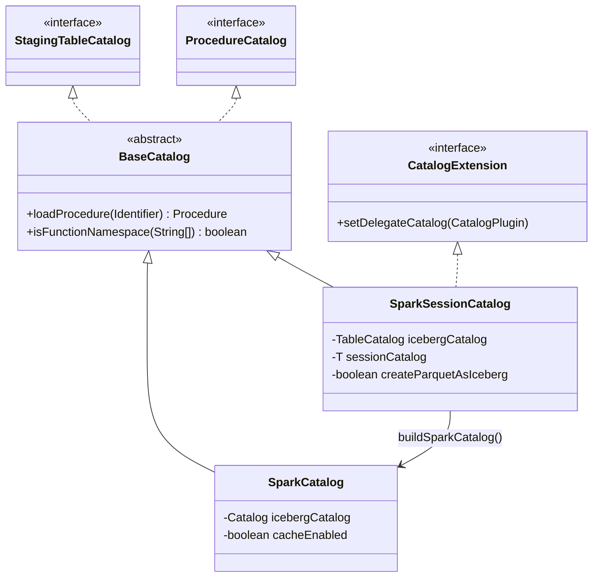
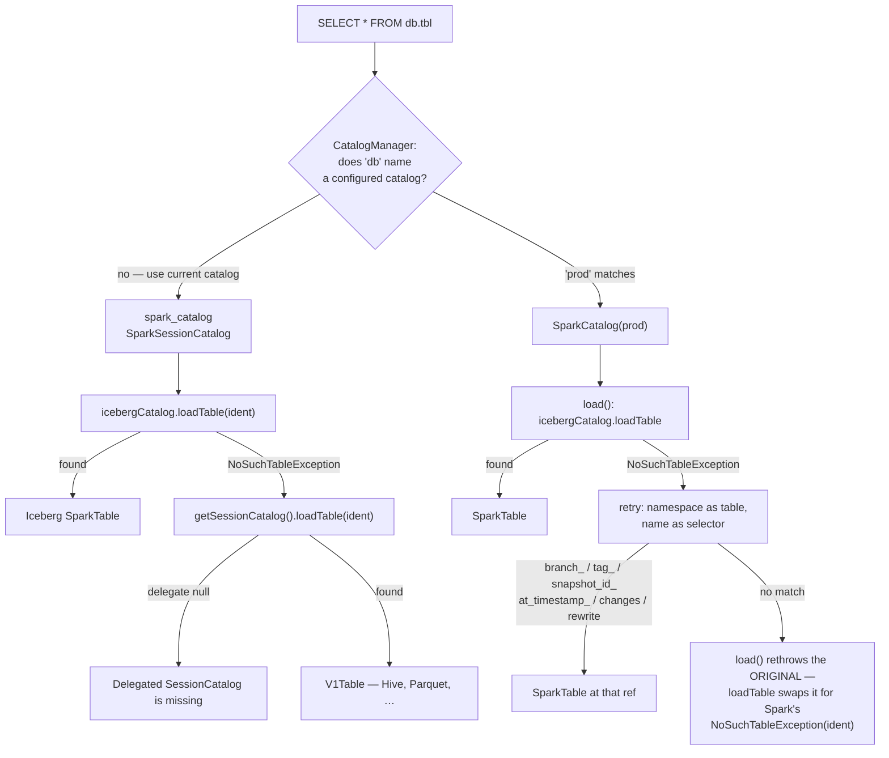

# Chapter 11.1 — Wiring Spark to Iceberg: `SparkCatalog` vs `SparkSessionCatalog`

<div class="chapter-meta" markdown>
**The question this chapter answers:** what does each of the two Spark catalog implementations actually do to a table name before it reaches Iceberg, and why does choosing the wrong one produce errors that name neither class?

**Prerequisites:** Chapter 6.1 (the `Catalog` SPI these classes adapt), Chapter 6.2 (what `type=hive` and `type=hadoop` commit against)

**Source covered:** `spark/v3.5/.../spark/SparkCatalog.java`, `.../spark/SparkSessionCatalog.java`, `.../spark/BaseCatalog.java`
</div>

## 1. The problem

Spark 3 resolves `a.b.c` by asking `CatalogManager` for a catalog plugin named `a`. If no plugin has that name, the whole identifier goes to the current catalog instead. Iceberg plugs in at that seam, and it ships two plugins for it.

The names invite the wrong mental model. `SparkCatalog` sounds like the general one and `SparkSessionCatalog` like a variant for people who want session integration. They are not two flavours of the same thing. They occupy structurally different slots and they fail in different ways:

- `SparkCatalog` is a **closed world**. Every identifier under it must resolve to an Iceberg table or the load fails.
- `SparkSessionCatalog` is a **fallback chain** bound to one specific name. It tries Iceberg, then falls back to whatever Spark's built-in session catalog says — silently, with no signal about which side answered.

Almost every confusing wiring failure reduces to one of three code paths: a delegate that was never set, a provider default that makes untyped `CREATE TABLE` produce Iceberg, or the `system` namespace check that `CALL` requires. All three are a few lines each. This chapter reads them.

## 2. The structural difference



Two edges matter.

**Only `SparkSessionCatalog` implements `CatalogExtension`.** That interface is how Spark hands a plugin the built-in catalog it is replacing, via `setDelegateCatalog`. It is the mechanism that lets one plugin take over `spark_catalog`, and `SparkCatalog` does not have it.

**`SparkSessionCatalog` contains a `SparkCatalog`.** `initialize` calls `buildSparkCatalog(name, options)`, whose default implementation constructs and initializes a fresh `SparkCatalog` with the same name and options. The session catalog is not an alternative implementation of Iceberg support; it is a wrapper that adds a Hive fallback and a `spark_catalog` binding on top of the same class.

## 3. Resolution under `SparkCatalog`



The method opens with a branch that is not about name resolution at all: `if (isPathIdentifier(ident)) return loadFromPathIdentifier((PathIdentifier) ident);`. That is the `catalog.` prefix followed by a bare location — a table addressed by path, with no catalog entry — and it parses a trailing `#`-suffix as a metadata-table selector. It is a separate feature and this chapter does not follow it further.

Past that branch, the next four lines are the closed world: ask the Iceberg catalog, wrap the answer in a `SparkTable`, done. Everything after `catch` exists for one feature.

Iceberg lets you address a table's history through the identifier itself — `db.tbl.branch_audit`, `db.tbl.snapshot_id_9182`, `db.tbl.at_timestamp_1700000000000`, `db.tbl.changes`. Spark has no syntax for that, so Iceberg implements it by abusing the namespace. When `db.tbl.branch_audit` fails to load as a table, the code retries with `db.tbl` as the identifier and `branch_audit` as a selector to interpret against it.

Read the guards in order:

- `if (ident.namespace().length == 0) throw e;` — a bare name has no namespace to reinterpret.
- `catch (Exception ignored) { throw e; }` — if the namespace is not a table either, the identifier was simply wrong. Rethrow the *original* exception.
- Then six name checks, and a final `throw e` if none apply. Four are `Matcher` matches against compiled patterns — `at_timestamp_(\d+)`, `snapshot_id_(\d+)`, `branch_(.*)`, `tag_(.*)`; the other two are plain `equalsIgnoreCase` comparisons, against `SparkChangelogTable.TABLE_NAME` (`"changes"`) and the `REWRITE` constant (`"rewrite"`). The diagram below lists all six.

**All three exits rethrow `e`, the original `NoSuchTableException` — and the only caller then throws it away.** `loadTable(Identifier)` is nothing but `try { return load(ident); } catch (org.apache.iceberg.exceptions.NoSuchTableException e) { throw new NoSuchTableException(ident); }`, so what reaches the user is Spark's exception naming the identifier they typed. The original message, and with it any hint of which of the three exits produced it, never leaves the class. A typo in a branch name and a typo in a table name produce the same message. That is the cost of implementing selectors as a fallback rather than as syntax.

## 4. Resolution under `SparkSessionCatalog`



Eight lines, and they are the entire contract. Iceberg first, Hive second, and nothing in the return type distinguishes them. A query against `db.events` may hit a `SparkTable` or a `V1Table` depending on state the query does not mention.

The same shape repeats across the class. `tableExists` is `icebergCatalog.tableExists(ident) || getSessionCatalog().tableExists(ident)`. `dropTable` is `icebergCatalog.dropTable(ident) || getSessionCatalog().dropTable(ident)`, with a comment noting that existence need not be checked first because both are required to return `false` for a missing table. `alterTable` and `renameTable` check `icebergCatalog.tableExists(ident)` explicitly first — `renameTable` carries a comment explaining why: `HadoopCatalog` throws `UnsupportedOperationException` on rename, so the check exists to keep session-catalog tables off that path.



## 5. The delegate that was never set



This is the single most useful diagnostic in the integration, and it fires late.

`setDelegateCatalog` is invoked by Spark only for the plugin that replaces the built-in session catalog — the one registered as `spark.sql.catalog.spark_catalog`. Register `SparkSessionCatalog` as `spark.sql.catalog.prod` instead and nothing complains: `initialize` runs, builds an inner `SparkCatalog`, reads the `parquet-enabled` flags and returns. The session starts clean. Iceberg tables under `prod` even work, because those never touch the delegate.

The failure arrives on the first operation that falls through — a `listTables`, a read of a Hive table, any `loadNamespaceMetadata` — as:

> Delegated SessionCatalog is missing. Please make sure your are replacing Spark's default catalog, named 'spark_catalog'.

The typo is upstream's. The instruction is exact: this class belongs under the name `spark_catalog` and nowhere else.

## 6. The provider default



`createTable`, `stageCreate`, `stageReplace` and `stageCreateOrReplace` all begin with `String provider = properties.get("provider")` and route on this method. The first branch is the one that changes behaviour across a whole warehouse, and the second is where the format flags enter:

```java
    if (provider == null || "iceberg".equalsIgnoreCase(provider)) {
      return true;
    } else if (createParquetAsIceberg && "parquet".equalsIgnoreCase(provider)) {
```

A `CREATE TABLE t (id bigint)` with no `USING` clause has a null provider. Under Spark's own session catalog that means "use `spark.sql.sources.default`", usually Parquet. Under `SparkSessionCatalog` it means Iceberg.

The three flags below widen this deliberately. Setting `spark.sql.catalog.spark_catalog.parquet-enabled=true` makes `USING parquet` create an Iceberg table too. That is a migration aid — turn it on and new writes land in Iceberg without editing any DDL — but it is also an invisible change to what every existing `CREATE TABLE … USING parquet` in your codebase does.

## 7. Where `CALL` resolves



Two facts, both load-bearing for Chapters 11.2 and 11.5.

`isSystemNamespace` requires `namespace.length == 1` and the single element to equal `"system"` ignoring case. Nothing else resolves; the namespace is not configurable, and the comment says why it is compared case-insensitively — *"namespace resolution is case insensitive until we have a way to configure case sensitivity in catalogs"*.

More importantly, this method lives on `BaseCatalog`. Only Iceberg's two plugins implement `ProcedureCatalog` at all. If `spark_catalog` is still Spark's built-in session catalog, `CALL system.migrate(...)` does not fail with an Iceberg message — it fails to resolve a procedure, because the current catalog has no procedures. The fix is a wiring change, and nothing in the error says so.

## 8. Gotchas

!!! warning "`SparkSessionCatalog` under any name but `spark_catalog` fails at first use, not at startup"
    `initialize` succeeds. The failure surfaces later, on the first call that falls through to the delegate, as `Delegated SessionCatalog is missing`. If you see that message, the fix is the catalog's *name*, not its options.

!!! warning "Untyped `CREATE TABLE` under `SparkSessionCatalog` produces an Iceberg table"
    `useIceberg(null)` returns `true`. Adopting `SparkSessionCatalog` across an existing Hive warehouse therefore changes the format of every future table created without an explicit `USING` clause. `parquet-enabled`, `avro-enabled` and `orc-enabled` extend that to explicitly-typed DDL.

!!! warning "Snapshot selectors are a fallback path, so they mask real errors"
    In `load()`, every failure exit rethrows the original `NoSuchTableException` (L872, L884, L926) — and `loadTable` catches that and throws Spark's `new NoSuchTableException(ident)` in its place, so the original never surfaces. `db.tbl.branch_typo` and `db.tbl_typo.branch_ok` produce identical messages. When a selector query fails, check the table name before the selector.

!!! warning "`CALL` needs the `system` namespace on an Iceberg catalog"
    `CALL prod.system.rewrite_data_files(...)` resolves; `CALL prod.rewrite_data_files(...)` does not, and neither does any `CALL` when the current catalog is Spark's built-in one. Chapter 11.5's procedures all assume this is already correct.

!!! note "The catalog cache is on by default and its entries time out after 30 seconds"
    `SparkCatalog.initialize` wraps the built catalog in `CachingCatalog.wrap(catalog, cacheCaseSensitive, cacheExpirationIntervalMs)` whenever `cache-enabled` is true. `CatalogProperties.CACHE_ENABLED_DEFAULT` is `true` and `CACHE_EXPIRATION_INTERVAL_MS_DEFAULT` is 30 seconds. The constant says *expiration* and means a cache eviction: nothing here is related to `expire_snapshots`, which removes snapshots from a table and is Chapter 11.5's subject. One word, one process, two unrelated things — this one forgets a table, that one deletes files. A table committed by another process is invisible to this session until the entry times out — the mechanism is one argument in `load()`, which constructs `new SparkTable(table, !cacheEnabled)`, passing the negated flag as the table's `refreshEagerly` field. Caching on means refreshing off. Setting the interval to `0` disables caching outright — the code special-cases it and skips the wrap, with the comment *"An expiration interval of 0ms effectively disables caching."*

!!! note "One asymmetry in v3.5 and v4.0, fixed only in v4.1"
    `loadTable(Identifier)` catches Spark's `NoSuchTableException`, but the `(ident, version)` and `(ident, timestamp)` overloads catch `org.apache.iceberg.exceptions.NoSuchTableException` — which the inner `SparkCatalog` never throws from those methods, because `SparkCatalog.loadTable(ident, version)` delegates to `loadTable(ident)`, which has already converted Iceberg's exception into Spark's. So `VERSION AS OF` against a non-Iceberg table under `spark_catalog` does not fall back. v4.0 is unchanged here — both overloads still catch the Iceberg type. Only v4.1 catches the bare (Spark) `NoSuchTableException` in all three.

## Key takeaways

- `SparkCatalog` is a closed world; `SparkSessionCatalog` is a fallback chain that wraps a `SparkCatalog` and adds a Hive second attempt.
- Only `SparkSessionCatalog` implements `CatalogExtension`, which is why it — and only it — can be bound to `spark_catalog`, and why binding it anywhere else breaks every delegating method.
- Under `SparkSessionCatalog`, a null table provider means Iceberg. Untyped `CREATE TABLE` silently changes format.
- Snapshot and branch selectors are implemented as a retry inside `load()`, not as syntax; every failure rethrows the original exception, which `loadTable` then swaps for Spark's, so selector typos and table typos are indistinguishable.
- `CALL` resolves only under a namespace of exactly `system`, and only on a catalog that is one of these two classes.
- The Iceberg catalog is wrapped in a 30-second cache by default, which explains stale reads that have nothing to do with commits.

## Source map

| What | File |
| --- | --- |
| `SparkCatalog` | [`spark/v3.5/.../spark/SparkCatalog.java`](https://github.com/apache/iceberg/blob/apache-iceberg-1.11.0/spark/v3.5/spark/src/main/java/org/apache/iceberg/spark/SparkCatalog.java) |
| `SparkSessionCatalog` | [`spark/v3.5/.../spark/SparkSessionCatalog.java`](https://github.com/apache/iceberg/blob/apache-iceberg-1.11.0/spark/v3.5/spark/src/main/java/org/apache/iceberg/spark/SparkSessionCatalog.java) |
| Procedures and functions | [`spark/v3.5/.../spark/BaseCatalog.java`](https://github.com/apache/iceberg/blob/apache-iceberg-1.11.0/spark/v3.5/spark/src/main/java/org/apache/iceberg/spark/BaseCatalog.java) |
| Cache defaults | [`core/.../CatalogProperties.java`](https://github.com/apache/iceberg/blob/apache-iceberg-1.11.0/core/src/main/java/org/apache/iceberg/CatalogProperties.java) |
| Catalog construction from `type` / `catalog-impl` | [`core/.../CatalogUtil.java`](https://github.com/apache/iceberg/blob/apache-iceberg-1.11.0/core/src/main/java/org/apache/iceberg/CatalogUtil.java) |

**Next:** Chapter 11.2 takes the wiring as given and uses it — `migrate` requires the source catalog to be a `SparkSessionCatalog`, `snapshot` requires it to be literally named `spark_catalog`, and the choice made here decides which import procedures are legal at all.
