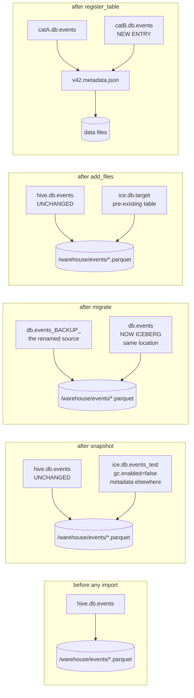

# Chapter 11.2 — Bringing existing tables in: `snapshot`, `migrate`, `add_files`, `register_table`

<div class="chapter-meta" markdown>
**The question this chapter answers:** which of the four import paths mutates the source table, which of them can be undone, and what happens to the original data files in each case?

**Prerequisites:** Chapter 11.1 (which catalog the source lives in is a precondition), Chapter 2.4 (what a manifest entry stores), Chapter 3.3 (`newAppend().commit()`)

**Source covered:** `data/.../TableMigrationUtil.java`, `spark/v3.5/.../spark/SparkTableUtil.java`, `.../actions/SnapshotTableSparkAction.java`, `.../actions/MigrateTableSparkAction.java`, `.../procedures/AddFilesProcedure.java`, `core/.../BaseMetastoreCatalog.java`
</div>

## 1. The problem

You have a Hive table with four years of Parquet in it. You want it to be an Iceberg table. Iceberg offers four procedures, the documentation describes all four in similar language, and one of them renames your production table.

The stakes are asymmetric. Picking the conservative option when you wanted the aggressive one costs an afternoon. Picking the reverse can leave two tables writing to one set of files, or a `metadata.json` registered in two catalogs that will eventually delete each other's data. These are not equivalent mistakes, and the difference is not visible in the procedure names.

So this chapter is written to be checkable. Every claim about what a procedure does to your data is anchored to the line that does it.

## 2. The one mechanic they share

Start with the fact that makes all four comparable.



`withPath(stat.getPath().toString())`. The `DataFile` that ends up in an Iceberg manifest carries the path the file already had.

**No import procedure copies a data file.** `listPartition` lists a directory, reads each file's footer for metrics and row count, and builds a `DataFile` describing bytes that are already on disk and are not moved, rewritten, or touched. `SparkTableUtil` then commits them, by one of two routes: `importSparkPartitions` packs them into manifests written to a staging directory and appends those, while the unpartitioned path skips manifests entirely and appends the `DataFile`s straight to `targetTable.newAppend()`. Either way the whole operation is an indexing pass.

That single fact generates every difference between the four procedures. If import means "index files where they lie", then after an import two things may point at one set of bytes. What each procedure does about that — disarm one side, remove one side, or nothing — is the entire subject.



Every box has two arrows into one file set. That is the shape of the risk.

## 3. `snapshot` — a test drive

`snapshot` creates a new Iceberg table from a source table and leaves the source completely alone. Its metadata and manifests go to a new location; its **data files are still the source table's files**. `SnapshotTableSparkAction.doExecute` enforces the separation before doing any work, at `SnapshotTableSparkAction.java` L129–L136: the staged location must not equal the source location and neither may be a prefix of the other, *"because it would overlap with source table location … Overlapping snapshot and source would mix table files."*

The consequence is in the properties it sets on the new table.



Four moves. Copy the source's properties, minus `path`, `transient_lastDdlTime` and `serialization.format`. Strip every location-bearing property — `location`, `write.metadata.path`, `write.folder-storage.path`, `write.object-storage.path`, `write.data.path` — so the new table cannot inherit a path that points back into the source. Set `provider=iceberg` and merge in whatever the caller passed. Then:

```java
properties.put(TableProperties.GC_ENABLED, "false");
properties.put("snapshot", "true");
```

One property survives the strip: if the caller supplied a destination location explicitly, the method puts `location` back at the very end. That is the only way a snapshot table gets a path you chose rather than the catalog's default, and it is why the overlap precondition is checked against the staged table's resolved `location()` rather than against this map.

`gc.enabled=false` is not advisory. Five places refuse to run when it is set, with near-identical messages: the constructors of `ExpireSnapshotsSparkAction` and `DeleteOrphanFilesSparkAction`, `DeleteReachableFilesSparkAction.doExecute`, `SparkCatalog.purgeTable` — *"Cannot purge table: GC is disabled (deleting files may corrupt other tables)"* — and `RemoveSnapshots`' constructor in **core**. That last one is the one to remember: it is not a Spark check, so `table.expireSnapshots()` from plain Java refuses too (Chapter 5.5 §5). A sixth site does not refuse but changes behaviour — `CatalogUtil.dropTableData` skips deleting data files while still deleting manifests, manifest lists and metadata, which is what stops a catalog-level purge destroying somebody else's bytes.

**Verdict.** Source untouched. The catalog entry is reversible with a plain `DROP TABLE`; the files it wrote are not, and which of them survive depends on your catalog. `SparkCatalog.dropTable` calls `icebergCatalog.dropTable(ident, false /* don't purge data */)`. On a metastore catalog that removes the entry and nothing else — `HiveCatalog.dropTable` loads the metadata only when `purge` is true — so the snapshot table's `metadata.json`, manifest lists and manifests stay on storage as orphans no job will collect: the table they belonged to is gone, and while it existed `remove_orphan_files` was refused on it. `HadoopCatalog` is the exception, and for the wrong reason: it runs `fs.delete(tablePath, true)` regardless of the argument. That asymmetry is documented inside `purgeTable` itself — *"HadoopCatalog/HadoopTables will drop the warehouse directly and ignore the `purge` argument"*. In every case the source's data files are untouched, because they were never under the snapshot table's location. This is still the procedure to reach for when you want to test Iceberg against real data. Delete the leftover metadata directory yourself afterwards.

## 4. `migrate` — in place, and it renames your table



The comment on the first statement states the design: *"move the source table to a new name, halting all modifications and allowing us to stage the creation of a new Iceberg table in its place."*

Read it as five steps.

1. `renameAndBackupSourceTable()` — `db.events` becomes `db.events_BACKUP_` (or a name you pass as `backup_table_name`). The *source* was already checked in `BaseTableCreationSparkAction`'s constructor — `checkSourceCatalog`, then `validateSourceTable` — so a bucketed table or an unsupported provider is rejected before any rename happens. Nothing about the import itself is checked first. If the rename fails because the backup name is taken, you get `AlreadyExistsException` and nothing else has changed.
2. `stageDestTable()` — an Iceberg table is staged under the original identifier `db.events`, inheriting the source's location.
3. `ensureNameMappingPresent` — a `schema.name-mapping.default` is written so the existing Parquet, which has no Iceberg field IDs, resolves by name.
4. `SparkTableUtil.importSparkTable(...)` reading from `v1BackupIdent` — the file listing comes from the *backup* table's partition metadata.
5. `stagedTable.commitStagedChanges()`.

The `finally` block is the recovery story. It has two halves, and only the first one recovers anything:

```java
} finally {
  if (threw) {
    LOG.error(
        "Failed to perform the migration, aborting table creation and restoring the original table");

    restoreSourceTable();

    if (stagedTable != null) {
      try {
        stagedTable.abortStagedChanges();
      } catch (Exception abortException) {
        LOG.error("Cannot abort staged changes", abortException);
      }
    }
  } else if (dropBackup) {
    dropBackupTable();
  }
}
```

`restoreSourceTable()` renames the backup back. Its own catch blocks log rather than throw, including *"Cannot restore the original table, a table with the original name exists. Use the backup table {} to restore the original table manually."* So the *name* is recovered, and when it is not, the message tells you the backup is your recovery.

`abortStagedChanges()` recovers nothing, because it does nothing:



`// TODO: clean up` is the entire implementation. Read it with the field above: a `StagedSparkTable` wraps a `Transaction`, and `commitStagedChanges()` is `transaction.commitTransaction()`. A transaction does not defer *writing* — it defers the catalog commit. By the time step 5 can fail, `ensureNameMappingPresent` has committed a property to that transaction and `SparkTableUtil` has appended manifests to it, so a `metadata.json` and a manifest list already exist under `getMetadataLocation(icebergTable)`.

For `migrate` that location is the source table's own directory plus `/metadata`, because the staged table inherited `sourceTableLocation()`. `destTableProps` ends with `properties.putIfAbsent(LOCATION, sourceTableLocation())`, and `sourceTableLocation` is captured in `BaseTableCreationSparkAction`'s constructor — before the rename — so the new Iceberg table claims the source's original directory.

So the concrete state after a failed migration is: the Hive table is back under its original name, its data files are untouched and correct, and there is now an Iceberg `metadata/` directory sitting inside it holding whatever the import got through. Nothing will delete it. `importSparkPartitions` does clean up after itself, but only the manifests it collected and only from its own `catch (Throwable e)`; anything an executor wrote before failing, and everything the transaction wrote, stays. `snapshot` leaks the same way on failure — with the mercy that its leftovers are under the new table's own directory, which you can delete wholesale.

**Verdict.** The source table is renamed, which is a mutation of the catalog, not of the data. The data files become the Iceberg table's data files in place. Reversible only while the backup exists, and only by renaming it back — and a reversal is not a return to the starting state, because the staging directory is still sitting in the restored table's location.

## 5. `add_files` — adding to a table you already have

`add_files` is the only one of the four that targets an existing Iceberg table. `AddFilesProcedure.call` resolves the source through the session catalog, then `importToIceberg` branches on whether the source identifier looks like `parquet.` / `orc.` / `avro.` followed by a path, or an ordinary catalog table. The path form always ends in `SparkTableUtil.importSparkPartitions` against the target; the catalog form goes through `importSparkTable`, which routes to `importUnpartitionedSparkTable` when the compatible spec is unpartitioned and appends `DataFile`s directly, with no manifests and no staging directory.

Nothing is done to the source. The *target* is written to twice, though: `ensureNameMappingPresent` commits a `schema.name-mapping.default` property before the import begins, so a run that dies during the scan still leaves that commit in the target's history. Afterwards, the source table and the Iceberg table both reference the same files, and neither knows about the other. There is no `gc.enabled` interlock and no backup.

Iceberg does ship an interlock for exactly this shape, and `add_files` is not what sets it. `ExpireSnapshots.CleanupLevel.METADATA_ONLY` names the case in its own javadoc — *"Consider `METADATA_ONLY` when data files are shared across tables or when using procedures like add-files that may reference the same data files"* — and expires snapshots while retaining data files. It is a core-API setting only: `ExpireSnapshotsSparkAction` hardcodes `cleanupLevel(CleanupLevel.NONE)` and then computes its own deletions, and neither it nor the `expire_snapshots` procedure exposes the level. From Spark there is no interlock, which is why the guidance below is about not creating the aliasing rather than about surviving it.

The one guard it does have is duplicate detection, and it is not shared with the other procedures.



That overload — the one both `MigrateTableSparkAction` and `SnapshotTableSparkAction` invoke — passes `false` for `checkDuplicateFiles`. `AddFilesProcedure` reads its own parameter with `input.asBoolean(CHECK_DUPLICATE_FILES_PARAM, true)`.

So running `add_files` twice over the same source fails loudly:

> Cannot complete import because data files to be imported already exist within the target table: … This is disabled by default as Iceberg is not designed for multiple references to the same file within the same table. If you are sure, you may set 'check_duplicate_files' to false to force the import.

Re-running `migrate` after a partial failure has no such backstop.

**Verdict.** Source untouched, and the target gains references to files it does not own. There is no clean undo: rolling back to the pre-`add_files` snapshot leaves the added files still present and still referenced by the snapshot you rolled back from.

## 6. `register_table` — a pointer, and nothing else



No scan. No footer reads. No manifest. It reads one `metadata.json`, parses it, and calls `ops.commit(null, metadata)` — creating a catalog entry that points at metadata someone else wrote.

The guards are two `Preconditions` on argument shape and one existence check:

```java
if (tableExists(identifier)) {
  throw new AlreadyExistsException("Table already exists: %s", identifier);
}
```

`tableExists` is a method on the catalog being written to. Nothing anywhere asks whether that `metadata.json` is already registered somewhere else. `RegisterTableProcedure` adds only that the catalog must be a `HasIcebergCatalog` — *"Cannot use Register Table in a non-Iceberg catalog"*.

**Verdict.** No data is read, moved or changed. Dropping the new entry undoes the registration. But this is the procedure that can produce the worst outcome of the four, because it is the one API that lets you break Iceberg's central assumption without an error.

## 7. The comparison

| | `snapshot` | `migrate` | `add_files` | `register_table` |
|---|---|---|---|---|
| Target | new Iceberg table | the source identifier, in place | existing Iceberg table | new catalog entry |
| Reads source data files | yes, footers only | yes, footers only | yes, footers only | no |
| Copies data | no | no | no | no |
| Mutates source table | no | **yes — renamed to `_BACKUP_`** | no | no |
| Source queryable after | yes | only under the backup name | yes | yes |
| Data files afterwards | shared with source | now the Iceberg table's | shared with source | unchanged |
| Reversible by | `DROP TABLE` — the entry only (`PURGE` refused) | renaming the backup back, while it exists | no clean undo | dropping the new entry |
| If it fails midway | source untouched; staged metadata leaked at the new location | name restored; staging directory left **inside** the source's own directory | collected manifests cleaned; the name-mapping commit stands | no entry created |
| Duplicate-file check | off | off | on by default | n/a |
| Safety interlock | `gc.enabled=false` | `migrated=true`, a marker only | none | none |

## 8. Gotchas

!!! danger "`register_table` does not check whether the metadata file is already registered elsewhere"
    The only guard is `tableExists(identifier)` against the catalog being written to. Register one `metadata.json` in a second catalog and you get two `TableOperations`, each doing compare-and-swap against its own entry. Neither sees the other's commits, so writes are lost silently rather than rejected. Whichever side runs `expire_snapshots` first deletes files the other still references. Iceberg's commit protocol assumes exactly one catalog entry per table; this is the one API that lets you violate that without an error. And nothing sets `gc.enabled=false` on either side, so `expire_snapshots` is not even the fastest way to lose the data: a `DROP TABLE … PURGE` on either entry sails through the guard in `SparkCatalog.purgeTable`, because the property defaults to `true`. Use `register_table` to move a table between catalogs — deregistering the old entry — not to share one.

!!! danger "After `migrate`, the backup table points at the migrated table's own data files"
    `db.events` (now Iceberg) and `db.events_BACKUP_` (still Hive) describe the same directory, because the Iceberg table inherited `sourceTableLocation()` and the backup is the renamed original. Any drop of the backup that purges data destroys the migrated table's data. `dropBackupTable()` catches `Exception` and only logs — *"Cannot drop the backup table {}, after the migration is completed."* — so `drop_backup => true` failing is invisible in the procedure's output, which reports only `migrated_files_count`.

!!! warning "A `snapshot` table's data belongs to the source; do not enable GC on it"
    `gc.enabled=false` is checked in five places, all of which refuse to proceed, and one of them is in core rather than in Spark — so dropping to the Java API does not get you past it either. Setting the flag to `true` to make `expire_snapshots` or `remove_orphan_files` run will delete the source table's data files. If a snapshot table has served its purpose, drop it, then delete its metadata directory yourself.

!!! warning "`migrate` and `snapshot` skip duplicate detection; `add_files` does not"
    The shared overload hardcodes `checkDuplicateFiles = false`. `add_files` defaults its parameter to `true`. If you are scripting repeated imports, `add_files` will stop you and the other two will not.

!!! warning "Partition listing is one level deep and skips `_`- and `.`-prefixed names"
    `TableMigrationUtil.listPartition` calls `fs.listStatus(partitionDir, HIDDEN_PATH_FILTER)` and keeps only entries where `FileStatus::isFile`. `listStatus` on a directory does not recurse, so a partition directory containing sub-directories contributes nothing from them. `HIDDEN_PATH_FILTER` is `p -> !p.getName().startsWith("_") && !p.getName().startsWith(".")` — correct for `_SUCCESS`, wrong for any data file an upstream job named that way. Neither case raises an error: you get a smaller `migrated_files_count` and a table quietly missing data. Compare the count against the source before trusting the result.

!!! note "Which catalog the source lives in is a hard precondition"
    `MigrateTableSparkAction.checkSourceCatalog` requires the resolved source catalog to be an instance of `SparkSessionCatalog` — *"Cannot migrate a table from a non-Iceberg Spark Session Catalog"*. `SnapshotTableSparkAction.checkSourceCatalog` requires `catalog.name().equalsIgnoreCase("spark_catalog")`. Both share `BaseTableCreationSparkAction.validateSourceTable`, which rejects any provider outside `{parquet, avro, orc, hive}`, any table without an explicit location, and any bucketed table. The wiring choice from Chapter 11.1 decides which of these procedures you can run at all.

!!! note "What the source leaves ambiguous"
    Whether dropping a Hive table deletes its data is decided by Hive and by Spark's `V2SessionCatalog`, not by Iceberg — a managed table and an external table behave differently, and neither is visible from this code. This chapter states what the Iceberg code does: `dropBackupTable()` calls `destCatalog().dropTable(backupIdent)` and the backup describes the same directory as the migrated table. Whether that particular drop removes files is a property of your metastore configuration. Verify it on a copy before running `drop_backup => true` in production.

## Key takeaways

- No import procedure copies data. `buildDataFile` records the file's existing path, so every import creates aliasing between whatever pointed at those bytes before and the Iceberg table that now indexes them.
- `snapshot` is the one that touches nothing: the source is untouched, and `gc.enabled=false` is enforced in five places — one of them in core — to keep it from touching anything later. Dropping it reverses the catalog entry, not the metadata it wrote.
- `migrate` is the only one that mutates the source, by renaming it. The backup is the entire recovery mechanism, it shares a directory with the migrated table, and `abortStagedChanges()` is an empty method — so a failed migration restores the name and leaves its staging metadata behind.
- `add_files` leaves two tables referencing one file set with no interlock, and is the only procedure that checks for duplicates by default.
- `register_table` reads no data and writes no manifest; its only guard is that the name is free in the destination catalog, which is not enough to prevent two catalogs owning one table.

## Source map

| What | File |
| --- | --- |
| `DataFile` construction from footers | [`data/.../TableMigrationUtil.java`](https://github.com/apache/iceberg/blob/apache-iceberg-1.11.0/data/src/main/java/org/apache/iceberg/data/TableMigrationUtil.java) |
| Shared import machinery | [`spark/v3.5/.../spark/SparkTableUtil.java`](https://github.com/apache/iceberg/blob/apache-iceberg-1.11.0/spark/v3.5/spark/src/main/java/org/apache/iceberg/spark/SparkTableUtil.java) |
| `snapshot` | [`.../actions/SnapshotTableSparkAction.java`](https://github.com/apache/iceberg/blob/apache-iceberg-1.11.0/spark/v3.5/spark/src/main/java/org/apache/iceberg/spark/actions/SnapshotTableSparkAction.java) |
| `migrate` | [`.../actions/MigrateTableSparkAction.java`](https://github.com/apache/iceberg/blob/apache-iceberg-1.11.0/spark/v3.5/spark/src/main/java/org/apache/iceberg/spark/actions/MigrateTableSparkAction.java) |
| Shared source validation | [`.../actions/BaseTableCreationSparkAction.java`](https://github.com/apache/iceberg/blob/apache-iceberg-1.11.0/spark/v3.5/spark/src/main/java/org/apache/iceberg/spark/actions/BaseTableCreationSparkAction.java) |
| `add_files` | [`.../procedures/AddFilesProcedure.java`](https://github.com/apache/iceberg/blob/apache-iceberg-1.11.0/spark/v3.5/spark/src/main/java/org/apache/iceberg/spark/procedures/AddFilesProcedure.java) |
| `register_table` | [`core/.../BaseMetastoreCatalog.java`](https://github.com/apache/iceberg/blob/apache-iceberg-1.11.0/core/src/main/java/org/apache/iceberg/BaseMetastoreCatalog.java) |

**Next:** Chapter 11.3 leaves imported tables behind and follows a real Spark write down to the files it produces — where the file count is decided before a byte is written.
